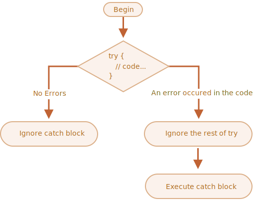

`try..catch` 와 에러 핸들링
=========================

- 에러 원인
  - 실수
  - 예상치 못한 사용자 입력
  - 잘못된 서버 응답
  - 기타 등등
- 에러 발생 시
  - 스크립트는 즉시 중단
  - 콘솔 : 에러 출력

- `try..catch` 문법
  - 스크립트 중단 방지
  - 에러 '잡음 <sub>(catch)</sub>'
    - 더 합당한 무언가 실행

### `try…catch` 문법
- 구성
  - `try` 블록
  - `catch` 블록
```javascript
try {

  // 코드…

} catch (err) {

  // 에러 핸들링

}
```
##### `try…catch` 동작 알고리즘
1. `try { … }` 안 코드 실행
2. 에러 無
    - `try` 안 마지막 줄까지 실행
    - `catch` 블록 스킵
3. 에러 有
    - `try` 코드 실행 중단
    - `catch(err)` 블록 제어 흐름 有
    - `err` <sub>(변수)</sub>
      - 에러 객체 포함
      - 무슨 일 일어났는지에 대한 설명


