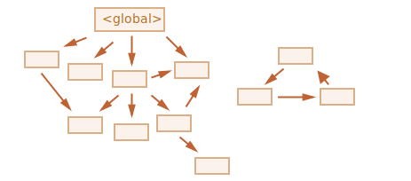

객체
====

자료형
- 원시형 (primitive type)
- 객체형
  - 프로퍼티
    - 키 : 문자형
    - 값 : 모든 자료형
- 빈 객체 생성 방법
```javascript
let user = new Object(); // 객체 생성자
let user = {};           // 객체 리터럴 (주로 사용)
```

### 리터럴과 프로퍼티
- 중괄호 {...} 안
  - ‘키: 값’ 쌍 프로퍼티
```javascript
let user = {     // 객체
  name: "John",  // 키: "name", 값: "John"
  age: 30        // 키: "age",  값: 30
};
```
- 프로퍼티 키
  - 프로퍼티 이름
  - 식별자
- 점 표기법 (dot notation) : 프로퍼티 값 reading
```javascript
alert( user.name ); // John
alert( user.age );  // 30
```
- 프로퍼티 추가
  - 프로퍼티 값 : 모든 자료형
```javascript
user.isAdmin = true;
```
- 프로퍼티 삭제 : delete 연산자
```javascript
delete user.age;
```
- 복수 단어 조합 프로퍼티 이름 : 따옴표로 묶기
```javascript
let user = {
  name: "John",
  age: 30,
  "likes birds": true // 복수 단어 따옴표
};
```
- 마지막 프로퍼티 끝 : 쉼표 사용 가능
  - trailing(길게 늘어지는) 쉼표
  - hanging(매달리는) 쉼표
  - 모든 프로퍼티 유사 형태
    - 프로퍼티 추가 · 삭제 · 이동 용이
```javascript
let user = {
  name: "John",
  age: 30,
}
```

#### 상수 객체 수정 주의
- const 선언 객체 수정 가능
- 객체 값 고정, but 내용 고정 X

```javascript
const user = {
  name: "John"
};
user.name = "Pete";
alert(user.name); // Pete
```

### 대괄호 표기법
- 복수 단어 조합 프로퍼티 키
  - 점 표기법 사용 X
  - 점 표기법 '유효한 변수 식별자’
    - 공백 X
    - 숫자 시작 X
    - '$', '_' 제외 특수 문자 X
```javascript
// 문법 에러가 발생합니다.
user.likes birds = true;
```
- 대괄호 표기법 (square bracket notation)
  - 모든 키 문자열 상관없이 동작
  - 따옴표 묶기 (", ')
```javascript
let user = {};
user["likes birds"] = true; // set
alert(user["likes birds"]); // get
delete user["likes birds"]; // delete
```
- 모든 표현식 평가 결과 프로퍼티 키 사용 가능
```javascript
let key = "likes birds";

// user["likes birds"] = true;
user[key] = true;
```
- 프로퍼티 키 변수 런타임 평가
  - 사용자 입력값 변경 등에 따라 값 변경 가능
  - 평가 종료 이후의 결과 프로퍼티 키 사용
  - 응용하여 코드 유연하게 작성
```javascript
let user = {
  name: "John",
  age: 30
};
let key = prompt("사용자의 어떤 정보를 얻고 싶으신가요?", "name");

// 변수로 접근
alert( user[key] ); // John (프롬프트 창 "name" 입력한 경우)
```
- 점 표기법 이런 방식 불가능
```javascript
let user = {
  name: "John",
  age: 30
};
let key = "name";
alert( user.key ) // undefined
```

#### 계산된 프로퍼티
- 객체 생성 시 객체 리터럴 안 대괄호 프로퍼티 키
  -  계산된 프로퍼티 (computed property)
```javascript
let fruit = prompt("어떤 과일을 구매하시겠습니까?", "apple");
let bag = {
  [fruit]: 5,       // 변수 fruit에서 프로퍼티 이름 동적으로 받아옴
// apple : 5,       // fruit에 "apple" 할당 시
};
alert( bag.apple ); // fruit에 "apple" 할당 시, 5 출력

// 동일

let fruit = prompt("어떤 과일을 구매하시겠습니까?", "apple");
let bag = {};
bag[fruit] = 5; // 변수 fruit 사용해 프로퍼티 이름 생성
/*
bag.fruit  = 5;
*/
```
- 대괄호 안 복잡한 표현식 가능
```javascript
let fruit = 'apple';
let bag = {
  [fruit + 'Computers']: 5 // bag.appleComputers = 5
};
```
- 프로퍼티 이름 · 값 제약 제거
  - 점 표기법 보다 강력
  - 작성 번거로움<br /><br />
- 점 표기법 사용
  - 이름 확정
  - 단순한 이름
- 대괄호 표기법 사용
  - 복잡한 상황

### 단축 프로퍼티
- 실무에서 종종 프로퍼티 값 기존 변수에서 받아와 사용
  - 프로퍼티 값 단축 구문 (property value shorthand)
    - 프로퍼티 이름 == 변수 이름
```javascript
function makeUser(name, age) {
  return {
    name: name,
    age: age,
  };
}

↓↓↓

function makeUser(name, age) {
  return {
    name, // name: name
    age,  // age: age
  };
}
```
- 한 객체 일반 프로퍼티, 단축 프로퍼티 함께 사용
```javascript
let user = {
  name,  // name: name
  age: 30
};
```

### 프로퍼티 이름 제약사항
- 특별한 제약 X
  - 문자형
  - 심볼형
  - 예약어 등
```javascript
// 예약어 키
let obj = {
  for: 1,
  let: 2,
  return: 3
};
alert( obj.for + obj.let + obj.return );  // 6
```
- 문자형 or 심볼형 X 값
  - 문자열 자동 형 변환
```javascript
let obj = {
  0: "test" // "0": "test"
};
alert( obj["0"] ); // test
alert( obj[0] );   // test (0 → "0" 자동 형변환)
```
- 특별 대우 이름 (역사적인 이유)
  - \_\_proto\_\_
```javascript
let obj = {};
obj.__proto__ = 5;    // 숫자 할당
alert(obj.__proto__); // [object Object]
```

### ‘in’ 연산자 프로퍼티 존재 여부 확인
- 자바스크립트 객체
  - 미존재 프로퍼티 접근 시 에러 X, undefined 반환
```javascript
let user = {};
alert( user.noSuchProperty === undefined );
```
- in 왼쪽 반드시 프로퍼티 이름
  - 보통 따옴표 감싼 문자열
```javascript
"key" in object
```
```javascript
let user = {
  name: "John",
  age: 30
};
alert( "age" in user );    // true
alert( "blabla" in user ); // false
```
- 따옴표 생략 시 엉뚱한 변수 조사 위험
```javascript
let user = { age: 30 };
let key = "age";
alert( key in user ); // true
                      // 변수 key 값("age") 사용해 프로퍼티 존재 여부 확인
```
- in 연산자 존재 이유
  - 가끔 "=== undefined" 실패
```javascript
let obj = {
  test: undefined
};

// 값 : `undefined`
// 프로퍼티 'test' 존재
alert( obj.test );      // undefined

// `in` : 프로퍼티 유무 제대로 확인
alert( "test" in obj ); // true
```

### ‘for…in’ 반복문
- 객체 모든 키 순회
```javascript
for (key in object) {
  // 각 프로퍼티 키(key) 이용하여 본문(body) 실행
}
```
```javascript
let user = {
  name: "John",
  age: 30,
  isAdmin: true
};

// 객체 user 모든 프로퍼티 출력
// 반복 변수 선언 (let key)
// 반복 변수명 자유롭게 지정
for (let key in user) {
  alert( key );       // name, age, isAdmin
  alert( user[key] ); // John, 30, true
}
```

### 객체 정렬 방식
- 특별한 방식 정렬
- 정수 프로퍼티
  - 자동 정렬
```javascript
let codes = {
  "49": "독일",
  "41": "스위스",
  "44": "영국",
  "1": "미국"
};

for (let code in codes) {
  alert(code); // 1, 41, 44, 49 (정수 프로퍼티 자동 정렬)
}
```

#### 정수 프로퍼티
- 변형 없이 정수에서 왔다 갔다 할 수 있는 문자열
- "49"
  - 정수 변환 or 변환한 정수 다시 문자열 변환 → 변형 X
- '+49’, '1.2’
  - 정수 프로퍼티 X
```javascript
// 함수 Math.trunc : 소수점 아래 버리고 숫자 정수부만 반환
alert( String(Math.trunc(Number("49"))) );  // '49' ==  49 → 정수 프로퍼티
alert( String(Math.trunc(Number("+49"))) ); // '49' != +49 → 정수 프로퍼티 X
alert( String(Math.trunc(Number("1.2"))) ); // '1'  != 1.2 → 정수 프로퍼티 X
```

- 그 외 프로퍼티
  - 객체 추가 순서 그대로 정렬
```javascript
let user = {
  name: "John",
  surname: "Smith"
};
user.age = 25; // 프로퍼티 하나 추가

// 추가 순서대로 나열
for (let prop in user) {
  alert( prop ); // name, surname, age
}
```
- 정수 프로퍼티 자동 정렬 방지 트릭
  - 프로퍼티 앞 "+"
```javascript
let codes = {
  "+49": "독일",
  "+41": "스위스",
  "+44": "영국",
  "+1": "미국"
};

for (let code in codes) {
  alert( +code ); // 49, 41, 44, 1
}
```

<br />

참조에 의한 객체 복사
===================

- 원시값
  - ‘값 그대로’ 저장 · 할당 · 복사
```javascript
// 두 개 독립된 변수 각각 문자열 "Hello!" 저장
let message = "Hello!";
let phrase = message;
```
- 객체
  - ‘참조에 의해(by reference)’ 저장 · 복사
  - 변수에 '객체에 대한 참조 값' (객체 저장 메모리 주소) 저장
```javascript
// 객체 : 메모리 내 어딘가 저장
// 변수 user : 객체 '참조’할 수 있는 값 저장
let user = {
  name: "John"
};
```
- 객체 할당 변수 복사 시
  - 객체 참조 값 복사
  - 객체 복사 X
```javascript
// 변수 두 개, 각 변수 동일 '객체에 대한 참조 값' 저장
let user = { name: "John" };
let admin = user; // 참조값 복사
```
- 객체 접근 · 조작 시 여러 변수 사용 가능
```javascript
let user = { name: 'John' }; // 객체
let admin = user;            // 객체 참조 값 복사
admin.name = 'Pete';         // 'admin' 참조 값에 의해 변경
alert(user.name);            // 'Pete'
```

#### 참조에 의한 비교
- 객체 비교 시
  - 동등 연산자 '==', 일치 연산자 '===' 동일 동작
  - 두 객체 동일한 객체인 경우 참
```javascript
// 두 변수 같은 객체 참조
let a = {};
let b = a; // 참조에 의한 복사
alert( a == b );  // true, 두 변수 같은 객체 참조
alert( a === b ); // true
```
```javascript
// 두 객체 모두 비어있음
// 독립된 두 객체
let a = {};
let b = {};
alert( a == b ); // false
```

### 객체 복사 · 병합과 Object.assign

- 자바스크립트 객체 복제 내장 메서드 지원 X
- 객체 복제 할 일 거의 없음
- 객체 생성 후 프로퍼티 순회해 원시 수준까지 프로퍼티 복사
```javascript
let user = {
  name: "John",
  age: 30
};
let clone = {}; // 새로운 빈 객체

// 빈 객체에 user 프로퍼티 전부 복사
for (let key in user) {
  clone[key] = user[key];
}

// 완전히 독립적인 복제본
clone.name = "Pete"; // clone 데이터 변경
alert( user.name );  // "John" (기존 객체)
```
- Object.assign
```javascript
Object.assign(dest, [src1, src2, src3...]);
```
  - dest : 목표 객체
  - src1, src2, src3... : 복사하고자 하는 객체
  1. 객체 src1, src2, src3... 프로퍼티 dest에 복사
  2. dest 반환
```javascript
let user = { name: "John" };
let permissions1 = { canView: true };
let permissions2 = { canEdit: true };

// permissions1, permissions2 프로퍼티 user로 복사
Object.assign(user, permissions1, permissions2);
// user == { name: "John", canView: true, canEdit: true };
```
- 동일 이름 프로퍼티 기존 값 덮어씌워짐
```javascript
let user = { name: "John" };
Object.assign(user, { name: "Pete" });
alert(user.name); // user == { name: "Pete" }
```
- 반복문 없이 간단하게 객체 복사
```javascript
let user = {
  name: "John",
  age: 30
};

let clone = Object.assign({}, user);
```

### 중첩 객체 복사
- 프로퍼티 복사 : 객체 복제 X
```javascript
let user = {
  name: "John",
  sizes: {
    height: 182,
    width: 50
  }
};
let clone = Object.assign({}, user);
alert( user.sizes === clone.sizes ); // true (같은 객체)

// user · clone : sizes 프로퍼티 공유
user.sizes.width++;
alert(clone.sizes.width); // 51
```
- 깊은 복사(deep cloning)
  - 프로퍼티 객체인 경우 객체 구조 복사 반복문 사용
- 깊은 복사 표준 알고리즘
  - Structured cloning algorithm
- 자바스크립트 라이브러리 lodash
    - _.cloneDeep(obj)

<br />

가비지 컬렉션
============
- 자바스크립트 보이지 않는 곳에서 메모리 관리 수행

### 가비지 컬렉션 기준
- 자바스크립트 '도달 가능성 (reachability)' 개념 사용해 메모리 관리 수행
- ‘도달 가능한 (reachable)’ 값
  - 어떻게든 접근 · 사용 가능 값
  - 도달 가능한 값 메모리에서 삭제 X
  1. 루트 (root)
      - 현재 함수의 지역 변수 · 매개변수
      - 중첩 함수의 체인에 있는 함수에서 사용되는 변수 · 매개변수
      - 전역 변수
      - 기타 등등
  2. 루트가 참조하는 값 · 체이닝으로 루트에서 참조할 수 있는 값
      -  ex) 전역 변수 객체 프로퍼티 또 다른 객체 참조<br />(이 객체가 참조하는 다른 모든 것들 : 도달 가능 간주)
- 자바스크립트 엔진 내 '가비지 컬렉터 (garbage collector)' 끊임없이 동작
- 모든 객체 모니터
- 도달할 수 없는 객체 삭제
```javascript
// user에 객체 참조 값 저장
let user = {
  name: "John"
};

// user 값 다른 값으로 덮어씀 : 참조 사라짐
user = null;

// { name: "John" } → 도달할 수 없는 상태
// 접근 방법, 참조 모두 없어짐
// 가비지 컬렉터 { name: "John" } 저장 데이터 삭제 후, 메모리에서 삭제
```

### 참조 두 개
```javascript
// user에 객체 참조 값 저장
let user = {
  name: "John"
};

let admin = user;

  // user 값 다른 값으로 덮어씀 : 'admin' 아직 참조
user = null;

// admin 통해 여전히 객체 접근 가능
// { name: "John" } 메모리에서 삭제 X
// admin 다른 값(null 등)으로 덮어쓰면 { name: "John" } 메모리에서 삭제
```

### 연결된 객체
```javascript
function marry(man, woman) {
  // 두 객체 서로 참조
  woman.husband = man;
  man.wife = woman;

  return {
    father: man,
    mother: woman
  }
}

let family = marry({
  name: "John"
}, {
  name: "Ann"
});
```


- 참조 2개 삭제
```javascript
delete family.father;
delete family.mother.husband;
```


- John 도달 가능한 상태 X
  - 메모리에서 제거
  - John 저장된 데이터 (프로퍼티) 메모리에서 제거
- 외부로 나가는 참조 　　: 도달 가능한 상태 영향 X
- 외부에서 들어오는 참조 : 도달 가능한 상태 영향


- 가비지 컬렉션 후


### 도달할 수 없는 섬
- 도달할 방법 없는 경우, 섬 구성 객체 전부 메모리에서 삭제
- 근원 객체 family 참조 제거
```javascript
family = null;
```


### 내부 알고리즘
- 'mark-and-sweep’
  - 가비지 컬렉션 기본 알고리즘
- 진행 단계
  1. 루트(root) 정보 수집 후 ‘mark(기억)’



  2. 루트가 참조하고 있는 모든 객체 방문 후 mark


  3. mark 된 모든 객체 방문 후 그 객체들이 참조하는 객체 mark
      - 한번 방문한 객체 전부 mark
      - 같은 객체 재방문 X


  4. 루트에서 도달 가능한 모든 객체 방문할 때까지 위 과정 반복


  5. mark 되지 않은 모든 객체 메모리에서 삭제


#### 최적화 기법
- 자바스크립트 엔진 실행 영향 미치지 않으면서 가비지 컬렉션 더 빠르게 하는 다양한 최적화 기법 적용
- generational collection (세대별 수집)
  1. 객체 '새로운 객체’, '오래된 객체’ 분리
  2. 객체 상당수 생성 이후 제 역할 빠르게 수행 후 금방 쓸가 없어짐
      - '새로운 객체’ 분류
  3. 가비지 컬렉터 '새로운 객체’ 공격적으로 메모리에서 제거
  4. 일정 시간 이상 살아남은 객체
      - '오래된 객체’ 분류
      - 가비지 컬렉터 덜 감시
- incremental collection (점진적 수집)
  1. 가비지 컬렉션 여러 부분 분리
  2. 각 부분 별도 수행
  - 작업 분리, 변경 사항 추적에 추가 작업 필요
    - 긴 지연 짧은 지연 여러 개로 분산
- idle-time collection (유휴 시간 수집)
  - CPU 유휴 상태 때만 가비지 컬렉션 실행
    - 실행에 영향 최소화

<br />

메서드와 this
============

- 객체 프로퍼티 함수 할당

### 메서드 만들기
```javascript
let user = {
  name: "John",
  age: 30
};
user.sayHi1 = function() {
  alert("안녕하세요!");
};
user.sayHi1();        // 안녕하세요!

// 함수 선언
function sayHi2() {
  alert("안녕하세요!");
};
user.sayHi2 = sayHi2; // 선언된 함수 메서드 등록
user.sayHi2();        // 안녕하세요!
```

#### 객체 지향 프로그래밍 (object-oriented programming, OOP)
- 객체 사용하여 개체 표현
  - 올바른 개체 선택
  - 개체 사이 상호작용 나타내는 방법 등
- 추천 도서
  - ‘GoF의 디자인 패턴’ - 에릭 감마
  - ‘UML을 활용한 객체지향 분석 설계’ - 그래디 부치

#### 메서드 단축 구문
- 객체 상속 관련된 미묘한 차이 존재
```javascript
user = {
  sayHi1: function() {
    alert("Hello");
  },

  // 단축 구문
  sayHi2() {
    alert("Hello");
  },
};
```

### 메서드와 this
- 메서드 객체 저장된 정보 접근
- 메서드 내부 'this 키워드'
  - 객체 접근
```javascript
let user = {
  name: "John",
  age: 30,
  sayHi() {
    alert(this.name); // 'this' → '현재 객체'
  }
};
user.sayHi(); // John (실행 동안 this → user)
user.sayHi()가 
```
- 외부 변수 사용해 객체 접근
  - this 사용 X
```javascript
let user = {
  name: "John",
  age: 30,
  sayHi() {
    alert( user.name ); // 'this' 대신 'user'
  }
};
```
- 외부 변수 사용해 객체 참조 시 예상치 못한 에러 발생 가능
```javascript
let user = {
  name: "John",
  age: 30,
  sayHi() {
    alert( user.name );
  }
};
let admin = user;
user = null; // user → null
admin.sayHi(); // sayHi() 엉뚱한 객체 참고, 에러 발생 (null.name)
               // Error: Cannot read property 'name' of null
```

### 자유로운 this
- 모든 함수 this 사용 가능
```javascript
function sayHi() {
  alert( this.name );
}
```
- this 값 런타임에 결정
  - 컨텍스트 따라 상이
- 동일 함수 다른 객체에서 호출 시 'this’ 참조 값 상이
```javascript
let user = { name: "John" };
let admin = { name: "Admin" };
function sayHi() {
  alert( this.name );
}

// 별개 객체 동일 함수 사용
user.f = sayHi;
admin.f = sayHi;

// 'this' '점(.) 앞의' 객체 참조 → this 값 달라짐
user.f();     // John  (this == user)
admin.f();    // Admin (this == admin)
admin['f'](); // Admin (점 · 대괄호 동일 동작)
```

#### 객체 없이 호출하기 : this == undefined
- 객체 없이 함수 호출 가능
```javascript
function sayHi() {
  alert(this);
}
sayHi(); // undefined
```
- 엄격 모드
  - 'this'에 'undefined' 할당
  - this.name 접근 시 에러 발생
- 엄격 모드 X
  - this 전역 객체 참조
    - 브라우저 환경 : window 전역 객체
    - "use strict" 도입 배경
- 대개 실수로 작성된 경우 多
- 함수 본문 this : 객체 컨텍스트 내 함수 호출 예상

#### 자유로운 this가 만드는 결과
- 'bound this'
  - this 항상 메서드 정의된 객체 참조
- 자바스크립트 this : 런타임에 결정
  - 메서드 정의 위치 상관 X
  - ‘점 앞의’ 객체 따라 ‘자유롭게’ 결정
- 장점
  - 함수(메서드) 하나만 생성 후 여러 객체 재사용
- 단점
  - 유연함 → 실수

### this 없는 화살표 함수
- ‘고유한’ this 소유 X
  - 별개 this 생성 X
- 화살표 함수 this 참조 시, ‘평범한’ 외부 함수 this 값 가져옴
  - 외부 컨텍스트 this 이용

```javascript
let user = {
  firstName: "보라",
  sayHi() {
    let arrow = () => alert(this.firstName); // this → user.sayHi() this
    arrow();
  }
};
user.sayHi(); // 보라
```
