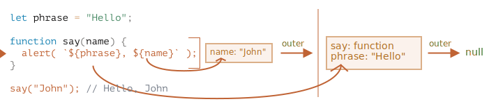
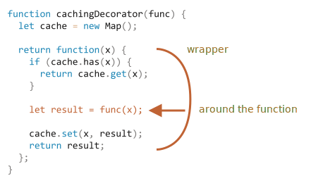

재귀와 스택
==========

- 큰 목표 작업 → 동일 간단 작업들
- 함수 자기 자신 호출

### 두 가지 사고방식
  - 반복
  - 재귀
```javascript
// 거듭제곱
pow(2, 2) = 4
pow(2, 3) = 8
pow(2, 4) = 16
```
```javascript
/* 반복적인 사고 */
// for 루프
function pow(x, n) {
  let result = 1;

  // 반복문 돌면서 x 를 n번 곱함
  for (let i = 0; i < n; i++) {
    result *= x;
  }

  return result;
}

alert( pow(2, 3) ); // 8

/* 재귀적인 사고 */
// 작업 단순화 · 자기 자신 호출
function pow(x, n) {
  if (n == 1) {
    return x;
  } else {
    return x * pow(x, n - 1);
  }
}

alert( pow(2, 3) ); // 8
```
- `pow (x, n)` 호출 시
  - 두 갈래 나뉘어 코드 실행
```javascript
              if n == 1  = x
             /
pow(x, n) =
             \
              else       = x * pow(x, n - 1)
```

##### `n == 1`
  - 재귀 베이스 <sub>(base)</sub>
  - 모든 절차 간단해짐
  - 명확한 결과 값 즉시 도출
  - `pow(x, 1) == x`

##### `n != 1`
  - 재귀 단계 <sub>(recursive step)</sub>
  - `pow(x, n)` → `x * pow(x, n - 1)`
    - x<sup>n</sup> = x * x<sup>(n-1)</sup>
  - 목표 작업 <sub>(`pow(x, n)`)</sub> 분할
    - 간단한 동작 <sub>(x 곱하기)</sub>
    - 목표 작업 변형 <sub>(`pow(x, n - 1)`)</sub>
    - `n == 1` 될 때까지 계속 진행


- `pow (2, 4)`
  1. `pow(2, 4)` = `2 * pow(2, 3)`
  2. `pow(2, 3)` = `2 * pow(2, 2)`
  3. `pow(2, 2)` = `2 * pow(2, 1)`
  4. `pow(2, 1)` = `2`

 **재귀 사용 코드 : 짧음**

- 반복적 사고 코드보다 대개 짧음
- `if` 문 → `?` <sub>(조건부 연산자)</sub>
  - 간결성 · 가독성 ↑
```javascript
function pow(x, n) {
  return (n == 1) ? x : (x * pow(x, n - 1));
}
```

<br />

- 재귀 깊이
  - 중첩 호출 최대 개수 <sub>(첫 호출 포함)</sub>
  - `pow(x, n)` 재귀 깊이
    - `n`
- 자바스크립트 엔진
  - 최대 재귀 깊이 제한
  - 만개 정도까지 확실히 허용
    - 엔진 따라 더 많은 깊이 가능
    - 대다수 엔진 십만까지는 X
- tail calls optimization
  - 엔진 내부 자동 최적화 수행 <sub>(제한 완화)</sub>
  - 모든 경우 적용 X
  - 간단한 경우 적용
- 재귀 깊이 제한
  - 실제 적용 시 부담
  - 그럼에도 광범위하게 사용
    - 간결성 ↑
    - 유지보수 난이도 ↓

### 실행 컨텍스트 · 스택
- 실행 중인 함수 실행 절차 정보
  - 해당 함수 실행 컨텍스트에 저장
- 실행 컨텍스트
  - 함수 실행 세부 정보 보유 <sub>(내부 데이터 구조)</sub>
    - 제어 흐름 현재 위치
    - 변수 현재 값
    - `this` 값
    - 기타 등등
  - 함수 호출 1회
    - 실행 컨텍스트 1개 생성
##### 함수 내부 중첩 호출 절차
1. 현재 함수 실행 일시 중지
2. 실행 컨텍스트 스택에 저장
    - 실행 컨텍스트 <sub>(일시 중지 함수)</sub> push
3. 중첩 호출 실행
4. 중첩 호출 실행 종료
    1. 실행 컨텍스트 스택에서 제거
        - 실행 컨텍스트 <sub>(일시 중지 함수)</sub> pop
    2. 일시 중지 함수 실행 재개

#### `pow(2, 3)`
- 실행 컨텍스트에 정보 저장
  - `x = 2, n = 3` <sub>(변수)</sub>
- 실행 흐름
  - 함수 1번째 줄 위치
```javascript
Context: { x: 2, n: 3, 1번째 줄 } call: pow(2, 3)
```
- `n == 1` <sub>(조건)</sub> 만족 X
  - 실행 흐름
    - `if` 문 2번째 분기 진행
```javascript
function pow(x, n) {
  if (n == 1) {
    return x;
  } else { // ←
    return x * pow(x, n - 1);
  }
}
alert( pow(2, 3) );
```
- 변수 동일 · 실행 흐름 위치 변경
  - 실행 컨텍스트 정보 변경
```javascript
Context: { x: 2, n: 3, 5번째 줄 } call: pow(2, 3) // 줄 정보 변경
```
- `x * pow (x, n - 1)` 계산
  - `pow (2, 2)` <sub>(서브 호출)</sub> 생성
    - 새 인수 `pow` <sub>(함수)</sub>

#### `pow(2, 2)`
- 중첩 호출
  - 실행 컨텍스트 스택에 저장
    - 현재 실행 컨텍스트 push
- 프로세스
  1. 스택 최상단 현재 컨텍스트 기록
  2. 새 컨텍스트 <sub>(서브 호출)</sub> 생성
  3. 서브 호출 완료 시
      - 기존 컨텍스트 실행 재개
        - 스택 pop
- `pow (2, 2)` <sub>(서브 호출)</sub> 시작 시 스택
```javascript
Context: { x: 2, n: 2, 1번째 줄 } call: pow(2, 2) // new context
Context: { x: 2, n: 3, 5번째 줄 } call: pow(2, 3) // old context
```
- 이전 컨텍스트에 정보 저장
  - 변수 정보
  - 코드 일시 중단된 줄
- 서브 호출 종료 후
  - 이전 컨텍스트 문제없이 다시 시작

 **주의**

- 한 줄에 복수 서브 호출 가능
  - `pow( … ) + pow( … ) + somethingElse( … )`
  - 서브 호출 바로 직후 실행 시작

#### `pow(2, 1)`
- 동일한 과정 다시 반복
- 5번째 줄 새 서브 호출 생성
  - `x = 2, n = 1` <sub>(인수)</sub>
- 새 실행 컨텍스트 생성 후
  - 실행 컨텍스트 스택 push
    - 스택 최상단
```javascript
Context: { x: 2, n: 1, 1번째 줄 } call: pow(2, 1) // new
Context: { x: 2, n: 2, 5번째 줄 } call: pow(2, 2) // old
Context: { x: 2, n: 3, 5번째 줄 } call: pow(2, 3) // older
```

#### 실행 종료
- `pow (2, 1)` 실행 시
  - `n == 1` <sub>(조건)</sub> 만족
    - `if` 문 1번째 분기 실행
```javascript
function pow(x, n) {
  if (n == 1) { // ←
    return x;
  } else {
    return x * pow(x, n - 1);
  }
}
```
- 호출할 중첩 호출 미존재
  - 함수 종료 · `2` 반환
- 상응 실행 컨텍스트 쓸모 X
  - 해당 실행 컨텍스트
    - 메모리에서 삭제
  - 스택 최상단
    - 이전 실행 컨텍스
```javascript
// Context: { x: 2, n: 1, 1번째 줄 } call: pow(2, 1) // new (X)
Context: { x: 2, n: 2, 5번째 줄 } call: pow(2, 2)    // old
Context: { x: 2, n: 3, 5번째 줄 } call: pow(2, 3)    // older
```
- `pow (2, 2)` 실행 다시 시작
  - 서브 호출 <sub>(`pow (2, 1)`)</sub> 결과 알고 있음
  - `x * pow (x, n - 1)` 계산 후
    - `4` 반환
- 스택 최상단
  - 이전 실행 컨텍스
```javascript
// Context: { x: 2, n: 1, 1번째 줄 } call: pow(2, 1) // new (X)
// Context: { x: 2, n: 2, 5번째 줄 } call: pow(2, 2) // old (X)
Context: { x: 2, n: 3, 5번째 줄 } call: pow(2, 3)    // older
```
- 마지막 실행 컨텍스트 처리 후
  - `pow (2, 3) = 8` <sub>(결과)</sub> 도출
- 재귀 깊이
  - == 실행 컨텍스트 수 <sub>(스택)</sub> 최댓값
- 메모리 요구사항 유의
  - 실행 컨텍스트 메모리 차지
    - 메모리 저장 공간 필요
      1. n 증가
      2. n번 내려감
      3. n개 실행 컨텍스트 생성
- 반복문 기반 알고리즘
  - 메모리 절약
```javascript
function pow(x, n) {
  let result = 1;

  for (let i = 0; i < n; i++) {
    result *= x;
  }

  return result;
}
```
- 컨텍스트 1개만 사용
  - `i` · `result` 컨택스트 내 변경
  - `n` 의존 X
  - 필요 메모리 공간 ↓
  - 사용 메모리 공간 고정
- 대개 함수 호출 비용 <sub>(메모리 사용)</sub> 절약
- 코드 재작성 후 큰 개선 없는 경우 有
  - 조건 따라 다른 재귀 서브 호출 후 결과 합칠 때
  - 분기문 복잡하게 얽혀있을 때
    - 메모리 크게 절약 X
    - 최적화 필요 X
    - 최적화 노력 무용지물
- 재귀 사용 시
  - 코드 양 ↓
  - 코드 이해도 ↑
  - 유지보수 이점
- 모든 곳에 메모리 최적화 신경 쓸 필요 X
  - 필요한 것 : 좋은 코드 <sub>(최적화 코드 X)</sub>

### 재귀적 순회
- 재귀적 순회
```javascript
/* 한 회사 임직원 */
let company = {

  sales: [{
    name: 'John',
    salary: 1000
  }, {
    name: 'Alice',
    salary: 1600
  }],

  development: {
    sites: [{
      name: 'Peter',
      salary: 2000
    }, {
      name: 'Alex',
      salary: 1800
    }],

    internals: [{
      name: 'Jack',
      salary: 1300
    }]
  }
};
```
##### 모든 임직원 급여 더하기
- 반복문
  - `company`
    - 최상위 반복문
  - 1단계 하위 부서
    - 1번째 중첩 반복문
  - n단계 하위 부서
    - n번째 중첩 반복문
- 재귀
  - 단순 <sub>(임직원)</sub> 부서 <sub>(배열)</sub>
    - 반복문
  - n단계 하위 부서 <sub>(객체)</sub>
    - n번째 재귀 호출
- 재귀 베이스
  - 단순 부서 <sub>(배열)</sub>
- 재귀 단계
  - n단계 하위 부서 <sub>(객체)</sub>
- 복잡한 작업 → 작은 작업들
  - 하위 부서 대상 반복문
- 부서 깊이 따라 더 작은 작업들로 쪼개기
  - 마지막 == 재귀 베이스
``` javascript
let company = {
  sales: [{name: 'John', salary: 1000},  {name: 'Alice', salary: 1600 }],
  development: {
    sites: [{name: 'Peter', salary: 2000}, {name: 'Alex', salary: 1800 }],
    internals: [{name: 'Jack', salary: 1300}]
  }
};

// 급여 합계 함수
function sumSalaries(department) {

  // 재귀 베이스
  // 단순 부서 (배열)
  if (Array.isArray(department)) {

    // 배열 요소 총합
    return department.reduce((prev, current) => prev + current.salary, 0);

  // 재귀 단계
  // n단계 하위 부서 (객체)
  } else {
    let sum = 0;
    for (let subdep of Object.values(department)) {

      // 재귀 호출
      // - 각 하위 부서 임직원 급여 총합
      sum += sumSalaries(subdep);
    }
    return sum;
  }
}

alert(sumSalaries(company)); // 7700
```
- `{ … }` <sub>(객체)</sub>
  - 서브 호출
- `[ … ]` <sub>(배열)</sub>
  - 서브 호출 X
  - 결과 계산


### 재귀적 구조
- 재귀적으로 정의된 자료구조
  - 자기 자신 일부 복제 형태
- 회사 부서 객체
  - 사람 <sub>(배열)</sub>
  - 하위 부서 <sub>(객체)</sub>
- HTML · XML
  - 일반 텍스트
  - HTML 주석
  - HTML 태그
    - 일반 텍스트
    - HTML 주석
    - 다른 HTML 태그
    - 기타 등등

### 연결 리스트

##### 배열
- 앞 요소 연산
  - 요소 삭제 · 삽입 비용 ↑
  - `unshift(obj)` · `shift()`
    - 새 요소 공간 생성 · 제거
      - 모든 요소 번호 다시 매김
    - 배열 크기 ↑
      - 연산 수행 시간 ↑
    - 동일
- 끝 요소 연산
  - 요소 삭제 · 삽입 비용 ↓
  - `push` · `pop`
##### 연결 리스트 <sub>(linked list)</sub>
- 삽입 · 삭제 속도 ↑
- 프로퍼티
  - value
    - 요소
  - next
    - 다음 요소 참조
    - 다음 요소 X
      - `null`
```javascript
let list1 = {
  value: 1,
  next: {
    value: 2,
    next: {
      value: 3,
      next: {
        value: 4,
        next: null
      }
    }
  }
};

↓↓↓

let list2 = { value: 1 };
list2.next = { value: 2 };
list2.next.next = { value: 3 };
list2.next.next.next = { value: 4 };
list2.next.next.next.next = null;
```


- 전체 리스트
  - 여러 부분으로 나누기
  - 다시 합치기
```javascript
// 여러 부분으로 나누기
let secondList = list.next.next;
list.next.next = null;

// 다시 합치기
list.next.next = secondList;
```


- 쉽게 요소 추가 · 삭제
- 리스트 앞에 요소 추가
```javascript
let list = { value: 1 };
list.next = { value: 2 };
list.next.next = { value: 3 };
list.next.next.next = { value: 4 };

// list에 새 요소 추가
list = { value: "new item", next: list };

// 중간 요소 제거
// - 이전 요소 next 변경
list.next = list.next.next;
```


- `list.next` 참조 변경
  - 1 → 2
  - `value 1` 요소
    - 체인에서 제외
    - 객체 따로 저장 X
      - 자동으로 메모리에서 제거
- 연결 리스트 단점
  - 번호 <sub>(인덱스)</sub> 사용해 요소 쉽게 접근 X
    - n번째 값 접근 시
      - `list[n]` X
      - 첫 항목에서 n번 이동 <sub>(next)</sub>
- 중간 요소 삽입 · 삭제 연산 덜 중요 시
  - 큐 <sub>(queue)</sub>
  - 데크 <sub>(deque)</sub>
    - 양 끝 삽입 · 삭제 빠르게 수행
- 연결 리스트 예시 개선 <sub>(기능 추가)</sub>
  - `prev` <sub>(프로퍼티)</sub> 추가
    - 이전 요소 참조
    - 이전 요소 쉽게 이동
  - `tail` <sub>(변수)</sub> 추가
    - 마지막 요소 참조
    - 마지막 요소 추가 · 삭제 시
      - `tail` 갱신
- 요구사항 따라 구조 변경

<br />

나머지 매개변수와 전개 구문
=========================

##### 상당수 내장 함수
- 인수 개수 제약 X
- `Math.max(arg1, arg2, …, argN)`
  - 인수 중 가장 큰 수 반환
- `Object.assign(dest, src1, …, srcN)`
  - `dest` 에 `src1..N` <sub>(프로퍼티)</sub> 복사
- 기타 등등

### `...` <sub>(나머지 매개변수)</sub>
- 함수 전달 인수 개수 제약 X
  - 함수 정의 방법 상관 X
```javascript
function sum(a, b) {
  return a + b;
}

alert( sum(1, 2, 3, 4, 5) );
```
- 함수 정의
  - 인수 2개 명시
- 실제 함수 호출 시
  - 여분 인수 전달 <sub>(에러 X)</sub>
  - 처음 2개 인수만 사용
- 여분 매개변수
  - `...` + 매개변수명 <sub>(배열)</sub>
```javascript
// 모든 인수 → args 배열
function sumAll(...args) {
  let sum = 0;

  for (let arg of args) sum += arg;

  return sum;
}

alert( sumAll(1) );       // 1
alert( sumAll(1, 2) );    // 3
alert( sumAll(1, 2, 3) ); // 6
```
- 혼합 사용
  - 처음 인수 2개 <sub>(매개변수)</sub>
  - 나머지 인수 <sub>(`titles` 배열)</sub>
```javascript
function showName(firstName, lastName, ...titles) {
  alert( firstName + ' ' + lastName ); // Bora Lee

  // 나머지 인수 → titles 배열 요소
  // titles = ["Software Engineer", "Researcher"]

  alert( titles[0] );     // Software Engineer
  alert( titles[0] );     // Software Engineer
  alert( titles[1] );     // Researcher
  alert( titles.length ); // 2
}

showName("Bora", "Lee", "Software Engineer", "Researcher");
```

 **나머지 매개변수 : 항상 마지막에 위치**

- 남아있는 인수 모으는 역할
```javascript
// ...rest
// - 항상 마지막 위치
// ...rest 뒤에 arg2 X
function f(arg1, ...rest, arg2) {
  // 에러
}
```

### `arguments` 객체
- 유사 배열 객체
- 인덱스 사용해 인수 접근
```javascript
function showName() {
  alert( arguments.length );
  alert( arguments[0] );
  alert( arguments[1] );

  /*
   arguments
   - 이터러블 객체
   - for…of 사용 가능
   */
}

showName("Bora", "Lee"); // 2, Bora, Lee
showName("Bora");        // 1, Bora, undefined
```
- 나머지 매개변수
  - 비교적 최신 문법
- `arguments`
  - 예전의 함수 인수 전체 얻기 방법
  - 지금도 사용 가능
    - 오래된 코드에서 발견
  - 유사 배열 객체
  - 이터러블 <sub>(반복 가능)</sub> 객체
  - 배열 X
    - 배열 메서드 사용 X
  - 인수 전체 담음
    - 일부 인수만 사용 X
- 나머지 매개변수 사용 권장

 **화살표 함수 : `arguments` 객체 미지원**

- `arguments` 객체 접근 시
  - 외부 일반 함수에서 가져옴
```javascript
function f() {
  let showArg = () => alert(arguments[0]);
  showArg();
}

f(1); // 1
```
- 화살표 함수
  - 자체 `this` X
  - `arguments` 객체 미지원

### 스프레드 문법
```javascript
alert( Math.max(3, 5, 1) );   // 5

// 배열 그대로 전달
// - 동작 X
// - 배열 아닌 숫자 목록 인수 받음
alert( Math.max([3, 5, 1]) ); // NaN

// 배열 요소 수동 나열
// - 불편
// - 실제 전달 배열 길이 다양
let arr = [3, 5, 1];
alert( Math.max([arr[0], arr[1], arr[2]]) );
```
- 전개 구문 <sub>(spread syntax)</sub>
  - `...` 사용
  - 나머지 매개변수 반대 역할
    - 펼치기
```javascript
let arr = [3, 5, 1];

// ...arr
// - arr (이터러블 객체) 인수 목록 확장
// - 배열 → 인수 목록
alert( Math.max(...arr) ); // 5
```
- 이터러블 <sub>(반복 가능)</sub> 객체
  - 여러 개 전달
```javascript
let arr1 = [1, -2, 3, 4];
let arr2 = [8, 3, -8, 1];

alert( Math.max(...arr1, ...arr2) ); // 8
```
- 혼합 사용
  - 스프레드 문법 · 평범한 값
```javascript
let arr1 = [1, -2, 3, 4];
let arr2 = [8, 3, -8, 1];

alert( Math.max(1, ...arr1, 2, ...arr2, 25) ); // 25
```
- 배열 합칠 때 활용
```javascript
let arr = [3, 5, 1];
let arr2 = [8, 9, 15];
let merged = [0, ...arr, 2, ...arr2];

alert(merged); // 0,3,5,1,2,8,9,15
               // 0 → arr → 2 → arr2
```
- 이터러블 <sub>(반복 가능)</sub> 객체
  - 전개 구문 사용 가능
```javascript
// 문자열 → 문자 배열
let str = "Hello";

alert( [...str] ); // H,e,l,l,o
```
- `for…of` 같은 방식
  - 요소 수집 시
    - 내부 이터레이터 <sub>(반복자)</sub> 사용
- `for…of` 문자열
  - 문자열 구성 문자 반환
- `[...str]`
  - `...str` → `H,e,l,l,o`
  - `[]` <sub>(배열 초기자)</sub> 전달
##### `Array.from`
  - 이터러블 <sub>(반복 가능)</sub> 객체 → 배열
    - 스프레드 문법 동일 기능
```javascript
let str = "Hello";

// 이터러블 → 배열
alert( Array.from(str) ); // H,e,l,l,o
                          // [...str] 동일 결과
```
- `Array.from(obj)`  vs `[...obj]`

||이터러블 객체|유사 배열 객체|
|:---:|:---:|:---:|
|`Array.from`|O|O|
|스프레드 문법|O|X|

- 배열 변환
  - `Array.from` 보편적 사용

### 배열 · 객체 복사본 생성
- `Object.assign()`
  - 객체 복사
- 스프레드 문법
  - 배열 · 객체 복사
```javascript
// 배열 복사
let arr = [1, 2, 3];

// 1. 배열 펼쳐 각 요소 분리
// 2. 매개변수 목록 생성
// 3. 매개변수 목록 새 배열 할당
let arrCopy = [...arr];

// 기존 배열 요소 == 복사본 배열 요소
alert(JSON.stringify(arr) === JSON.stringify(arrCopy)); // true

// 두 배열 다름
alert(arr === arrCopy); // false (참조 다름)

// 참조 다름
// - 기존 배열 수정
//   - 복사본 영향 X
arr.push(4);
alert(arr);     // 1, 2, 3, 4
alert(arrCopy); // 1, 2, 3
```
```javascript
// 객체 복사
let obj = { a: 1, b: 2, c: 3 };

// 1. 객체 펼쳐 각 요소 분리
// 2. 매개변수 목록 생성
// 3. 매개변수 목록 새 객체 할당
let objCopy = { ...obj };

// 기존 객체 프로퍼티 == 복사본 객체 프로퍼티
alert(JSON.stringify(obj) === JSON.stringify(objCopy)); // true

// 두 객체 다름
alert(obj === objCopy); // false (참조 다름)

// 참조 다름
// - 기존 객체 수정
//   - 복사본 영향 X
obj.d = 4;
alert(JSON.stringify(obj));     // {"a":1,"b":2,"c":3,"d":4}
alert(JSON.stringify(objCopy)); // {"a":1,"b":2,"c":3}
```
- 전개 구문
  - 코드 양 ↓
- `Object.assign()`
  - 코드 양 ↑
```javascript
let arr = [1, 2, 3];
let obj = { a: 1, b: 2, c: 3 };

// 전개 구문
let arrCopy1 = [...arr];
let objCopy1 = { ...obj };

// Object.assign()
let objCopy2 = Object.assign({}, obj);
let arrCopy2 = Object.assign([], arr);
```

<br />

변수의 유효범위와 클로저
======================

- 자바스크립트 : 함수 지향 언어
  - 많은 자유
  - 함수 동적 생성
  - 생성한 함수 → 다른 함수 인수 전달
  - 생성된 곳 아닌 다른 곳에서 함수 호출

### 코드 블록
- `{ … }` <sub>(코드 블록)</sub> 안 선언 변수
  - 블록 안에서만 사용 가능
```javascript
// 지역 변수 선언 후 몇 가지 조작
// - 그 결과 밖에서 볼 수 없음
{
  let message = "안녕하세요."; // 블록 내에서만 접근 가능

  alert(message); // 안녕하세요.
}

alert(message);   // ReferenceError: message is not defined
```
- 블록 특징
  - 특정 작업 수행 코드 묶는 용도
  - 블록 내 작업 수행 전용 변수 생성
```javascript
{
  // 메시지 출력
  let message = "안녕하세요.";
  alert(message);
}

{
  // 또 다른 메시지 출력
  let message = "안녕히 가세요.";
  alert(message);
}
```

 **블록 없으면 에러 발생**

- 이미 선언된 변수와 동일한 이름 변수
  - `{ … }` <sub>(블록)</sub> 없이 선언 시 에러 발생
```javascript
// 메시지 출력
let message = "안녕하세요.";
alert(message);

// 또 다른 메시지 출력
let message = "안녕히 가세요."; // SyntaxError: Identifier 'message' has already been declared
alert(message);
```

<br />

- `{ … }` <sub>(블록)</sub> 안 선언 변수
  - `{ … }` <sub>(블록)</sub> 안에서만 접근 가능
  - `if` · `for` · `while` 동일
```javascript
if (true) {
  let phrase = "안녕하세요!";

  alert(phrase); // 안녕하세요!
}

// if 문 블록 밖 alert 함수
// - phrase 접근 불가능
alert(phrase); // ReferenceError: phrase is not defined
```
- 변수 유효 범위
  - 블록 범위 한정
    - `if` · `for` · `while` 문 유용
```javascript
for (let i = 0; i < 3; i++) {
  // 변수 i
  // - for 문 안에서만 사용 가능
  alert(i); // 0, 1, 2
}

alert(i); // ReferenceError: i is not defined
```

### 중첩 함수
- 함수 내부 선언 함수
  - 코드 정돈 시 사용
```javascript
function sayHiBye(firstName, lastName) {

  // 헬퍼 (helper) 중첩 함수
  function getFullName() {
    return firstName + " " + lastName;
  }

  alert( "Hello, " + getFullName() );
  alert( "Bye, " + getFullName() );

}
```
- 객체 프로퍼티 형태 · 중첩 함수 자체
  - 반환 가능 값
- 반환된 중첩 함수
  - 어디서든 호출해 사용 가능
  - 외부 변수 접근 여전히 가능
```javascript
function makeCounter() {
  let count = 0;

  return function() {
    return count++;
  };
}

let counter = makeCounter();

alert( counter() ); // 0
alert( counter() ); // 1
alert( counter() ); // 2
```

### 렉시컬 환경

#### 단계 1. 변수

##### 자바스크립트
- 렉시컬 환경 <sub>(내부 숨김 연관 객체)</sub> 보유
  - 실행 중인 함수
  - `{ … }` <sub>(코드 블록)</sub>
  - 스크립트 전체

##### 렉시컬 환경 객체
  - 환경 레코드 <sub>(특수 내부 객체)</sub>
    - 모든 지역 변수 → 프로퍼티 저장 객체
    - 기타 정보 저장
      - `this` 값
      - 기타 등등
  - 외부 렉시컬 환경 참조
    - 외부 코드 연관

##### 변수
  - 환경 레코드 프로퍼티
  - 변수 가져오기 · 변경
    - 환경 레코드 프로퍼티 가져오기 · 변경

##### 스크립트 전체 관련 렉시컬 환경
  - 전역 렉시컬 환경
  - 외부 참조 → `null`

](./images/5/lexical-environment-global.svg)

- 실행 흐름 진행
  - 렉시컬 환경 변화
1. 스크립트 시작 시
    - 스크립트 내 선언 변수
      - 전역 렉시컬 환경 올라감 <sub>(pre-populated)</sub>
    - 변수 상태
      - uninitialized <sub>(특수 내부 상태)</sub>
      - 자바스크립트 엔진
        - uninitialized 상태 변수 인지
        - `let` 등장 전까지 변수 참조 X
2. `let phrase` 등장 <sub>(값 할당 전)</sub>
    - 값 : `undefined`
    - `phrase`
      - 이 시점 이후 사용 가능
3. `phrase` 값 할당
4. `phrase` 값 변경

](./images/5/closure-variable-phrase.svg)

 **렉시컬 환경 : 명세서에만 존재**

- 명세서 내 동작 방식 설명 이론상 객체
  - 직접 렉시컬 환경 얻기 · 조작 불가능
- 자바스크립트 엔진들
  - 렉시컬 환경 최적화
    - 명세서 언급 사항 준수
    - 엔진 고유 방법 사용
    - 메모리 절약
      - 미사용 변수 버기기
    - 다양한 내부 트릭
    - 기타 등등

#### 단계 2. 함수 선언문
- 함수
  - == 값 <sub>(≒ 변수)</sub>
- 함수 선언문 선언 함수
  - 바로 초기화 <sub>(일반 변수와 상이)</sub>
    - 렉시컬 환경 생성 즉시 사용 가능
    - 선언 전 함수 사용 가능 이유
  - 일반 변수
    - `let` 등장 · 선언 전 사용 X
- 스크립트에 함수 추가 시
  - 전역 렉시컬 환경 초기 상태 변화


- 함수 선언문 정의 함수에만 적용
  - 함수 표현식 <sub>(함수 변수 할당)</sub> 해당 X
    - ex&#41; `let say = function(name) …`

#### 단계 3. 내부 · 외부 렉시컬 환경
- 함수 호출 · 실행 시
  - 새 렉시컬 환경 자동 생성
  - 새 렉시컬 환경 내 함수 호출 시
    - 전달 받은 매개변수 저장
    - 함수 지역 변수 저장
- 함수 호출 중 보유 환경
  - 호출 중인 함수 내부 렉시컬 환경
  - 내부 렉시컬 환경 참조 외부 렉시컬 환경
- `say("John")` 호출 시 내부 변화
  - 현재 실행 흐름 : 좌측 화살표


##### 내부 렉시컬 환경
-  `say` <sub>(현재 실행 중 함수)</sub> 상응
- 프로퍼티 1개 보유
  - 렉시컬 환경 내부 함수 인자 `name`
  - 값 : `"John"`
    - `say("John")` 호출
- 외부 렉시컬 환경 참조

##### 외부 렉시컬 환경 <sub>(전역 렉시컬 환경)</sub>
- 프로퍼티
  - `phrase` <sub>(변수)</sub>
  - `say` <sub>(함수)</sub>

##### 코드에서 변수 접근 시
1. 검색 범위 설정
    1. 내부 렉시컬 환경
    2. 외부 렉시컬 환경 확장
        - 내부 렉시컬 환경 참조
    3. 전역 렉시컬 환경 확장 때까지 반복
2. 전역 렉시컬 환경 도달 후 변수 X
    - 엄격 모드
      - 에러 발생
    - 비 엄격 모드
      - 새 전역 변수 생성 <sub>(에러 발생 X)</sub>
        - 하위 호환성

##### 예시 정리
- `alert` <sub>(`say` 내부)</sub>
  - `name` <sub>(변수)</sub> 접근
    1. 내부 렉시컬 환경 검색
        - `name` <sub>(변수)</sub> 찾음
  - `phrase` <sub>(변수)</sub> 접근
    1. 내부 렉시컬 환경 검색
        - 상응 프로퍼티 <sub>(`phrase` )</sub> 부재
    2. 외부 렉시컬 환경 검색 <sub>(범위 확장)</sub>
        - `phrase` <sub>(변수)</sub> 찾음



#### 단계 4. 함수 반환하는 함수
```javascript
function makeCounter() {
  let count = 0;

  return function() {
    return count++;
  };
}

let counter = makeCounter();
```

##### `makeCounter()` 호출 시
- 매번 새 렉시컬 환경 객체 생성
  - `makeCounter` 실행 필요 변수들 저장
- 예시 : 2개 렉시컬 환경 생성


##### `makeCounter()` 실행 중
- 중첩 함수 생성 <sub>(실행 X)</sub>
- 모든 함수
  - 렉시컬 환경 <sub>(생성 위치)</sub> 기억
    - 호출 장소 상관 X
- `[[Environment]]` <sub>(숨김 프로퍼티)</sub>
  - 렉시컬 환경 <sub>(함수 생성 위치)</sub> 참조 저장
  - 함수 생성 시 값 세팅 후 변화 X
- `counter.[[Environment]]`
  - 렉시컬 환경 <sub>(`{count: 0}`)</sub> 참조 저장


##### `counter()` 호출 시
- 매번 새 렉시컬 환경 생성
- 새 렉시컬 환경 참조 외부 렉시컬 환경
  - `counter.[[Environment]]`


##### 실행 흐름 중첩 함수 본문 도달
- `count` <sub>(변수)</sub> 필요
1. 자체 렉시컬 환경 검색
    - 렉시컬 환경 비어있음
      - 익명 중첩 함수 지역 변수 X
2. 외부 렉시컬 환경 검색
    - 자체 렉시컬 환경 참조
    - `counter.[[Environment]]`
      - 변수 발견
3. `count++` 실행 · `count` 값 1 증가
    - 변숫값 갱신
      - 변수 저장된 렉시컬 환경에서 실행


 **클로저**

- 외부 변수 기억 · 접근 가능 함수
- 자바스크립트 모든 함수
  - 자연스럽게 클로저
- 예외 하나 존재
  - 자세한 내용 new Function 문법

### 가비지 컬렉션
- 함수 호출 종료 시
  - 함수 대응 렉시컬 환경 메모리에서 제거
  - 함수 관련 변수 모두 제거
    - 함수 종료 시 관련 변수 참조 불가능 이유
- 호출 종료 후 여전히 도달 가능한 중첩 함수 존재
- 중첩 함수 `[[Environment]]` <sub>(프로퍼티)</sub>
  - 외부 함수 렉시컬 환경 정보 저장
    - 도달 가능한 상태
    - 함수 호출 종료 후 렉시컬 환경 메모리에 유지
```javascript
function f() {
  let value = 123;

  return function() {
    alert(value);
  }
}

// g.[[Environment]]
// - f() 호출 시 생성되는 렉시컬 환경 정보 저장
let g = f();
```
- 중첩 함수 사용 시 주의사항
  - `f()` 다수 호출 후 결과 저장 시
  - 호출 시 생성된 각 렉시컬 환경
    - 모두 메모리에 유지
```javascript
function f() {
  let value = Math.random();

  return function() { alert(value); };
}

// 배열 안 세 함수
// - 각각 f() 호출 시 생성된 환경과 연관 관계 맺음
let arr = [f(), f(), f()];
```
- 렉시컬 환경 객체
  - 도달 불가능 시 메모리에서 삭제
  - 참조 중첩 함수 하나라도 존재 시
    - 제거 X
```javascript
function f() {
  let value = 123;

  return function() {
    alert(value);
  }
}

let g = f(); // g 살아있는 동안 연관 렉시컬 환경 메모리에 유지
g = null;    // 도달할 수 없는 상태
             // - 메모리에서 삭제
```

#### 최적화 프로세스
- 이론
  - 함수 살아있는 동안
    - 모든 외부 변수 메모리에 유지
- 실제
  - 자바스크립트 엔진 계속 최적화
    - 변수 사용 분석
    - 외부 변수 미사용 판단 시
      -  메모리에서 제거
- 디버깅 시
  - 최적화 과정 중 제거된 변수
    - 사용 불가능
  - V8 엔진 주요 부작용
    - Chrome
    - Opera
```javascript
function f() {
  let value = Math.random();

  function g() {

    // 이론상 value 접근 가능
    // 최적화 대상 되어 에러 발생
    debugger; // Uncaught ReferenceError: value is not defined
  }

  return g;
}

let g = f();
g();
```
- 외부 변수 최적화
  - 흥미로운 디버깅 이슈 유발
```javascript
// 의도한 변수 대신 동명의 다른 외부 변수 출력
let value = "이름 같은 다른 변수";

function f() {
  let value = "가장 가까운 변수";

  function g() {

     // 콘솔 'alert(value);' 입력 시 '이름이 같은 다른 변수' 출력
    debugger;
  }

  return g;
}

let g = f();
g();
```
- V8 부작용 미리 인지 시 유용
  - Chrome · Opera 디버깅 시
    - 언젠간 이슈 접할 수 있음

<br />

오래된 `var`
=========

### `var` : 블록 스코프 X
- `var` 스코프
  - 함수 · 전역 스코프
- `{ … }` <sub>(블록)</sub> 기준 스코프 X
  - 외부에서 접근 가능
```javascript
if (true) {
  var test = true;
}
alert(test); // true, 전역 변수

for (var i = 0; i < 10; i++) {
  // …
}
alert(i);    // 10, 전역 변수
```
- 함수 레벨 변수
  - 코드 블록 <sub>(`var` 포함)</sub> → 함수 안
```javascript
function sayHi() {
  if (true) {
    var phrase = "Hello";
  }
  alert(phrase); // 제대로 출력
}
sayHi();
alert(phrase);   // Error: phrase is not defined
```

### 변수 중복 선언 허용
- 2번째 선언문 무시
```javascript
var user = "Pete";
var user = "John"; // var 선언 무시
                   // - 할당만 동작
                   // - 에러 발생 X
alert(user);       // John
```

### 선언 전 사용 가능
- 함수 본문 내 `var` 선언 변수
  - 함수 본문 시작 지점으로 자동 정의 <sub>(이동)</sub>
    - 선언 위치 상관 X
    - 규칙
      - 중첩 함수 내 정의 변수 X
```javascript
function Same() {
  phrase = "Hello";
  alert(phrase);
  var phrase; // var 변수 정의
}
Same();

↓↓↓

function Same() {
  var phrase; // var 변수 정의 최상단 이동
  phrase = "Hello";
  alert(phrase);
}
same();
```
- 코드 블록 무시
  - 동일 동작
```javascript
function same() {
  phrase = "Hello";
  if (false) {  // ←
    var phrase; // ← if 문 블록 무시
  }             // ←
  alert(phrase);
}
same();
```
- 선언 Hoisting
  - 모든 `var` 선언 변수
    - 함수 최상위로 끌어 올려짐 <sub>(hoisted)</sub>
- 할당 Hoisting X
```javascript
function same() {
  alert(phrase);
  var phrase = "Hello";
}
same();

↓↓↓

function same() {
  var phrase;       // 함수 시작 시 선언 처리
  alert(phrase);    // undefined
  phrase = "Hello"; // 실행 흐름 해당 코드 도달 시
                    // - 할당 처리
}
same();
```

### 즉시 실행 함수 표현식 <sub>(IIFE)</sub>
- 개발자들 `var` 도 블록 레벨 스코프 가질 수 있는 방안 고려
  - '즉시 실행 함수 표현식'
  - immediately-invoked function expressions <sub>(IIFE)</sub>
```javascript
(function() {
  let message = "Hello"; // 함수만의 변수

  alert(message); // Hello
})();
```
- 자바스크립트
  - `function` 키워드 등장 시
    - 함수 선언문 시작 예상
  - 선언문 함수 생성 시
    - 반드시 함수 이름 선언
```javascript
/* 함수 동시 선언 · 실행 */
function() {      // ← Error: Function statements require a function name
  let message = "Hello";
  alert(message); // Hello
}();
```
- 함수 선언문 정의 함수
  - 동시 정의 · 호출 허용 X
```javascript
/* 맨 아래 괄호 때문에 문법 에러 */
function go() {
  }(); // ← 함수 선언문 선언 즉시 호출 X
```
- 함수 괄호로 감싸기 <sub>`(function { … })`</sub>
  - 함수 선언문 X
  - 표현식 인식
  - 이름 부재 가능
  - 즉시 호출 가능
  - 괄호 외 여러 방법 가능
  - 모던 자바스크립트 불필요
```javascript
// IIFE 만드는 방법
(function() {
  alert("함수를 괄호로 둘러싸기");
})();

(function() {
  alert("전체를 괄호로 둘러싸기");
}());

!function() {
  alert("표현식 앞에 비트 NOT 연산자 붙이기");
}();

+function() {
  alert("표현식 앞에 단항 덧셈 연산자 붙이기");
}();
```

<br />

전역 객체
========

- 어디서나 사용 가능한 변수 · 함수
- 보통 언어 자체 · 호스트 환경 기본 내장
- 각 호스트 환경마다 부르는 이름 상이
- `globalThis` <sub>(전역 객체명)</sub> 표준화 내용
  - 최근 자바스크립트 명세 추가
  - 모든 호스트 환경 이를 따라야 함
  - Chromium 기반 아닌 몇몇 브라우저
    - 아직 `globalThis` 미지원
    - 폴리필 <sub>(polyfill)</sub> 쉽게 추가 가능
```javascript
alert("Hello");

window.alert("Hello");
```
- 브라우저 내 `var` 선언 전역 함수 · 변수
  - 전역 객체 프로퍼티
  - `let` · `const` X
```javascript
var gVar = 5;

alert(window.gVar); // 5
```
- 하위 호환성 때문에 이런 방식 유지
  - 비권장
  - 모던 자바스크립트 <sub>(모듈 사용)</sub> 미지원
- `let` 사용 시
  - 전역 객체 통해 변수 접근 X
```javascript
let gLet = 5;

alert(window.gLet); // undefined
```
- 전역 접근 필요 시
  - 전역 객체에 직접 프로퍼티 추가
```javascript
// 모든 스크립트 'currentUser' 접근 가능
window.currentUser = {
  name: "John"
};

alert(currentUser.name); // John

// 'currentUser' 지역 변수 존재 시
// - 전역 객체에서 명시적으로 가져오기
alert(window.currentUser.name); // John
```
- 전역 변수 가급적 사용 X
- 함수 생성 시
  - 외부 · 전역 변수 사용 자제
  - 함수 권장 구성
    1. '인풋' 변수 받기
    2.  이를 이용해 '아웃풋' 만들기
    - 테스트 난이도 ↓
    - 에러 발생률 ↓

### 폴리필 사용
- 브라우저 최신 기능 지원 여부 확인
  - 전역 객체 이용
```javascript
// Promise 내장 객체 지원 여부 테스트
// 구식 브라우저 Promise 객체 미지원
if (!window.Promise) {
  alert("구식 브라우저를 사용 중이시군요!");
}
```
- 폴리필 추가
  - 오래된 브라우저 <sub>(명세 기능 미지원)</sub> 사용 시
    - 직접 함수 생성 후 전역 객체에 추가
```javascript
if (!window.Promise) {
  window.Promise = … // 모던 자바스크립트 지원 기능 직접 구현
}
```

<br />

객체로서의 함수와 기명 함수 표현식
===============================

- 함수 : 호출 가능한 <sub>(callable)</sub> '행동 객체'
    - 호출 가능
    - 프로퍼티 추가 · 제거 · 참조 통해 전달

### `name` 프로퍼티
- 함수 이름
```javascript
function sayHi() {
  alert("Hi");
}

alert(sayHi.name); // sayHi
```
- 익명 함수
  - 자동 이름 할당
```javascript
let sayHi = function() {
  alert("Hi");
};

alert(sayHi.name); // sayHi
```
- 기본값 사용해 이름 할당 시 동일
```javascript
function f(sayHi = function() {}) {
  alert(sayHi.name); // sayHi
}

f();
```
- 'contextual name'
  - 이름 없는 함수에 이름 지정 시
    - 컨텍스트에서 이름 가져옴
  - 자바스크립트 명세서 정의 기능
- 객체 메서드 이름
  - `name` 프로퍼티
```javascript
let user = {

  sayHi() {
    // …
  },

  sayBye: function() {
    // …
  }

}

alert(user.sayHi.name);  // sayHi
alert(user.sayBye.name); // sayBye
```
- 객체 메서드
  - 이름 자동 할당 X
    - 적절한 이름 추론 불가능한 상황 有
    - `name` 프로퍼티
      - `""` <sub>(빈 문자열)</sub> 저장
  - 실무
    - 대부분의 함수 이름 존재
    - 발생 빈도 ↓
```javascript
// 배열 안 함수 생성
let arr = [function() {}];

// 엔진 이름 설정 불가능
// name 프로퍼티 값
// - 빈 문자열
alert( arr[0].name ); // "" (빈 문자열)
```

### `length` 프로퍼티
- 함수 매개변수 개수 반환
```javascript
function f1(a) {}
function f2(a, b) {}
function many(a, b, ...more) {}

alert(f1.length);   // 1
alert(f2.length);   // 2
alert(many.length); // 2
```
- 나머지 매개변수
  - 개수 포함 X
- 다른 함수 안 동작 함수 타입 검사에 종종 사용
```javascript
function ask(question, ...handlers) {
  let isYes = confirm(question);

  for(let handler of handlers) {
    if (handler.length == 0) {
      if (isYes) handler();
    } else {
      handler(isYes);
    }
  }

}

/*
 사용자 OK 클릭 시
 - 핸들러 2개 모두 호출
 사용자 Cancel 클릭 시
 - 2번째 핸들러만 호출
 */
ask("질문 있으신가요?", () => alert('OK를 선택하셨습니다.'), result => alert(result));
```
- 다형성 <sub>(polymorphism)</sub>
  - 인수 종류 따라 인수 다르게 처리

### 커스텀 프로퍼티
- 함수에 자체 프로퍼티 추가
```javascript
function sayHi() {
  alert("Hi");

  // 함수 호출 수 카운트
  sayHi.counter++;
}
sayHi.counter = 0; // 초깃값

sayHi(); // Hi
sayHi(); // Hi

alert( `호출 횟수: ${sayHi.counter}회` ); // 호출 횟수: 2회
```

 **프로퍼티 : 변수 X**

- 함수에 프로퍼티 할당
  - ex&#41; `sayHi.counter = 0`
  - 함수 내 `counter` <sub>(지역 변수)</sub> 생성 X
  - `counter` <sub>(프로퍼티)</sub> ≠ `let counter` <sub>(변수)</sub>
  - 함수 ≒ 객체
    - 실행에 아무 영향 X

<br />

- 클로저 함수 → 프로퍼티 대체
```javascript
function makeCounter() {

  // let count = 0

  function counter() {
    return counter.count++;
  };

  counter.count = 0;

  return counter;
}

let counter = makeCounter();
alert( counter() ); // 0
alert( counter() ); // 1
/*
 count 프로퍼티
 - 외부 렉시컬 환경 X
 - 함수 프로퍼티에 값 저장
 */
```
##### 클로저 vs 함수 프로퍼티
- 클로저
  - 외부 코드 `count` <sub>(변수)</sub> 접근 X
  - 중첩 함수 내에서만 `count` <sub>(변수)</sub> 값 수정 가능
- 함수 프로퍼티
  - 외부에서 값 수정 가능
- 목적 따라 구현 방법 선택
```javascript
function makeCounter() {

  function counter() {
    return counter.count++;
  };

  counter.count = 0;

  return counter;
}

let counter = makeCounter();

counter.count = 10;
alert( counter() ); // 10
```

### 기명 함수 표현식 <sub>(Named Function Expression, NFE)</sub>
- 이름 있는 함수 표현식
```javascript
// 일반 함수 표현식
let sayHi1 = function(who) {
  alert(`Hello, ${who}`);
};

sayHi1("John"); // Hello, John

// 기명 함수 표현식
let sayHi2 = function func(who) {
  alert(`Hello, ${who}`);
};

sayHi2("John"); // Hello, John
```
- 이름 붙여도 여전히 함수 표현식
  - `"func"` 이름 붙어도 여전히 표현식 할당 형태 유지
  - 함수 선언문 X
- 2가지 변화
  - 함수 표현식 내부 자기 자신 참조 가능
    - 이름 사용
  - 함수 표현식 외부
    - 이름 사용 X
```javascript
let sayHi = function func(who) {
  if (who) {
    alert(`Hello, ${who}`);
  } else {
    func("Guest"); // 'func' 사용해 자신 호출
  }
};

sayHi(); // Hello, Guest

// 함수 표현식 외부
// - 이름 접근 X
func(); // Error, func is not defined
```
- 기명 함수 표현식 미사용 시
  - 외부 코드 의해 코드 변경 가능
```javascript
let sayHi = function(who) {
  if (who) {
    alert(`Hello, ${who}`);
  } else {
    sayHi("Guest"); // TypeError: sayHi is not a function
  }
};

/*
 1. 함수 표현식 새로운 변수에 할당
 2. 기존 변수 null 할당
  - 에러 발셍
 */
let welcome = sayHi;
sayHi = null;

welcome(); // 중첩 sayHi 호출 더 이상 불가능
```
- 자기 자신 검색
  - 지역 렉시컬 환경
    - `sayHi` <sub>(함수)</sub> 부재
  - 외부 렉시컬 환경 <sub>(함수 호출 시점)</sub>
    - `sayHi` → `null` 할당
- 문제 해결
  - 기명 함수 표현식
```javascript
let sayHi = function func(who) {
  if (who) {
    alert(`Hello, ${who}`);
  } else {
    func("Guest"); // 값 제대로 출력
  }
};

/*
 "func" 이름
 - 함수 지역 수준 존재
   - 외부 렉시컬 환경 검색 X
   - 외부 렉시컬 환경에서 보이지도 않음
 명세서 정의
 - 함수 표현식 붙인 이름
   - 현재 함수만 참조
 */

let welcome = sayHi;
sayHi = null;

welcome(); // Hello, Guest (중첩 호출 제대로 동작)
```

 **함수 선언문 : 내부 이름 지정 X**

- 함수 선언문
  - 내부 이름 지정 문법 X
  - 믿을만한 내부 이름 필요 시
    - 함수 선언문 → 기명 함수 표현식

<br />

new Function 문법
=================

- 드물게 사용
- 이 방법 외 대안 없을 때 사용

### 문법
```javascript
let func = new Function ([arg1, arg2, … argN], functionBody);
```
- 인수
  - `arg1 … argN`
- 함수 본문
  - `functionBody`
```javascript
// 인수 2개
let sum = new Function('a', 'b', 'return a + b');

alert( sum(1, 2) ); // 3

// 인수 X
let sayHi = new Function('alert("Hello")');

sayHi(); // Hello

/* 모두 동일 */
new Function('a', 'b', 'return a + b'); // 기본 문법
new Function('a,b', 'return a + b');    // 쉼표 구분
new Function('a , b', 'return a + b');  // 쉼표 · 공백 구분
```
- 런타임에 받은 문자열 사용해 함수 생성
  - 특별한 경우 사용
    - 함수 동적 컴파일 시
      - 서버에서 코드 받기
      - 템플릿 사용
      - 기타 등등
    - 복잡한 웹 애플리케이션 구현 시
```javascript
let str = … 서버에서 동적으로 전달받은 문자열 (코드 형태) …

let func = new Function(str);
func();
```

### 클로저
- new Function 함수 생성 시
  - `[[Environment]]` <sub>(프로퍼티)</sub>
    - 전역 렉시컬 환경 참조
      - 전역 변수에만 접근
      - 외부 변수 접근 X
```javascript
/* new Function */
function getFunc1() {
  let value = "test";

  let func = new Function('alert(value)');

  return func;
}

getFunc1()(); // ReferenceError: value is not defined

/* 일반적인 방법 */
function getFunc2() {
  let value = "test";

  let func = function() { alert(value); };

  return func;
}

getFunc2()(); // "test"
```
- 실무에서 아주 유용하게 사용

##### new Function 함수 외부 변수 접근 시
- 선언문 함수와 동일 동작 보장 필요
- 프로덕션 서버 반영 전 압축기에 의해 압축
  - 지역 변수명 짧게 바꿈
    - 문제 발생
- new Function 함수
  - 내부 → 외부 변수 접근 시
    - 기존 변수명 이미 변경
      - 검색 · 접근 실패
- 함수 내부 → 외부 변수 접근
  - 아키텍처 관점 권장 X
  - 에러 취약
- new Function 생성 함수에 전달 필요 시
  - 인수 사용 권장

<br />

`setTimeout` · `setInterval` 이용한 호출 스케줄링
===============================================

- 호출 스케줄링
  - 일정 시간 지난 후 함수 예약 실행 <sub>(호출)</sub>
  - `setTimeout`
    - 일정 시간 지난 후 함수 실행
  - `setInterval`
    - 일정 시간 간격 두고 함수 실행
  - `setTimeout` · `setInterval`
    - 자바스크립트 명세서 명시 X
    - 자바스크립트 호스트 환경 대부분
      - 유사 메서드 · 내부 스케줄러 지원

### `setTimeout`
```javascript
let timerId = setTimeout(func|code, [delay], [arg1], [arg2], …)
```
- `func|code`
  - 실행 코드
    - 함수
    - 문자열
      - 하위 호환성
      - 권장 x
- `delay`
  - 실행 전 대기 시간
  - 단위
    - 밀리초
  - 기본값
    - `0`
- `arg1, arg2…`
  - 함수 전달 인수
  - IE9 이하 미지원
```javascript
function sayHi() {
  alert('안녕하세요.');
}

// 1초 후 sayHi() 호출
setTimeout(sayHi, 1000);
```
- 함수에 인수 전달
```javascript
function sayHi(who, phrase) {
  alert( who + ' 님, ' + phrase );
}

setTimeout(sayHi, 1000, "홍길동", "안녕하세요."); // 홍길동 님, 안녕하세요.
```
- 1번째 인수 문자열
  - 문자열 이용해 함수 생성
  - 권장 X
  - 화살표 함수 이용
```javascript
// 문자열
setTimeout("alert('안녕하세요.')", 1000);

// 화살표 함수
setTimeout(() => alert('안녕하세요.'), 1000);
```

 **함수 전달 <sub>(함수 실행 X)</sub>**

- 함수 뒤 `()` <sub>(괄호)</sub> 붙이는 실수
```javascript
// 함수 실행 결과 전달
// sayHi()
// - undefined 반환
// - 동작 X
setTimeout(sayHi(), 1000);
```
#### `clearTimeout` : 스케줄링 취소
- `setTimeout` 호출 시
  - '타이머 식별자' 반환
  - 스케줄링 취소 시 사용
```javascript
let timerId = setTimeout( … );
clearTimeout(timerId);
```
```javascript
let timerId = setTimeout(() => alert("아무런 일도 일어나지 않습니다."), 1000);
alert(timerId); // 타이머 식별자

clearTimeout(timerId);
alert(timerId); // 취소 후 식별자 값 != null
```
- 타이머 식별자 자료형
  - 호스트 환경 따라 상이
  - Node.js `setTimeout`
    - 타이머 객체 반환

### `setInterval`
- `setTimeout` 문법 · 인수 동일
```javascript
let timerId = setInterval(func|code, [delay], [arg1], [arg2], …)
```
- 함수 주기적으로 실행
- `clearInterval(timerId)`
  - 함수 호출 중단
```javascript
// 2초 간격으로 메시지 보여줌
let timerId = setInterval(() => alert('째깍'), 2000);

// 5초 후에 정지
setTimeout(() => { clearInterval(timerId); alert('정지'); }, 5000);

/*
 1번째 alert 창 떴을 때 몇 초 후 창 닫으면 2번째 alert 창 바로 나타남
 - 얼럿 창 2초 (명시 지연 시간) 보다 더 짧은 간격으로 뜸
 */
```

 **창 떠 있어도 타이머 계속 진행**

- 대다수 브라우저 <sub>(Chrome · Firefox 등)</sub>
  - 창 떠 있는 동안 내부 타이머 계속 진행
    - `alert` · `confirm` · `prompt`

### 중첩 `setTimeout`
- 일정 간격 함수 실행 방법
  - `setInterval`
  - 중첩 `setTimeout`
```javascript
// let timerId = setInterval(() => alert('째깍'), 2000);

let timerId = setTimeout(function tick() {
  alert('째깍');
  timerId = setTimeout(tick, 2000);
}, 2000);
```
- 중첩 `setTimeout`
  - `setInterval` 보다 유연
  - 호출 결과 따라 다음 호출 조정 가능
```javascript
// 5초 간격 서버 요청 보내 데이터 획득
// 서버 과부하 상태 시
// - 요청 간격 10 · 20 · 40초 등으로 증가
let delay = 5000;
let timerId = setTimeout(function request() {

  /* … 요청 보내기 … */

  if (서버 과부하로 인한 요청 실패) {

    // 요청 간격 ↑
    delay *= 2;
  }

  timerId = setTimeout(request, delay);

}, delay);
```
- CPU 소모 多 작업 주기적 실행 시
  - `setTimeout` 재귀 실행 유용
  - 작업 소모 시간 따라 다음 작업 유동적으로 계획

```javascript
// setinterval
let i = 1;
setInterval(function() {
  func(i++);
}, 100);
```


##### `setInterval`
- 지연 시간 간격 보장 X
- 함수 호출 사이 지연 간격
  - 실제 명시 간격 <sub>(100ms)</sub> 보다 ↓
- 함수 실행 소모 시간
  - 지연 간격에 포함
  - 명시 지연 간격보다 길 때
    - 함수 종료 때까지 대기
    - 함수 종료 시
      - 스케줄러 확인 후 지연 시간 지났으면 다음 호출 바로 시작
      - 함수 호출 시간 > `delay` <sub>(밀리초)</sub>
        - 함수 계속 연속 호출

- 중첩 `setTimeout` 지연 간격 보장
  - 이전 함수 실행 종료 후 다음 함수 호출 계획 세워짐
```javascript
// 중첩 setTimeout
let i = 1;
setTimeout(function run() {
  func(i++);
  setTimeout(run, 100);
}, 100);
```
  

 **가비지 컬렉션과 `setInterval` · `setTimeout`**

- `setInterval` · `setTimeout` 함수 전달 시 함수에 대한 내부 참조 새롭게 생성 후 참조 정보 스케줄러에 저장
- 해당 함수 참조하는 것 없어도 `setInterval` · `setTimeout` 전달한 함수 가비지 컬렉션 대상 X
```javascript
// 스케줄러 함수 호출할 때까지 함수 참조 메모리에 유지
setTimeout(function() { … }, 100);

// clearInterval 호출 전까지 함수 참조 메모리에 유지
setInterval(function() { … }, 100);
```
- 부작용
  - 외부 렉시컬 환경 참조 함수 메모리에 유지 동안 외부 변수 역시 메모리에 유지
    - 실제 함수 차지 공간보다 더 많은 메모리 공간 사용
    - 스케줄링 필요 없어진 함수 반드시 취소

### 대기 시간 0 `setTimeout`
- 대기 시간 0 설정
  - `setTimeout(func, 0)`
  - `setTimeout(func)`
  - `func` '가능한 한' 빨리 실행
    - 스케줄러 현재 실행 중인 스크립트 처리 종료 이후 스케줄링한 함수 실행
    - 현재 스크립트 실행 종료 '직후' 함수 실행
```javascript
/* 얼럿창 'Hello' → 'World' 순서 출력 */

// '0 밀리초 후 함수 호출하기' 할 일 '계획표 기록' 역할
// 스케줄러 현재 스크립트 (alert 함수) 실행 종료 후 '계획표 확인'
setTimeout(() => alert("World"));

alert("Hello");
```

 **브라우저 환경 실제 대기 시간 : 0 아님**

- 브라우저 HTML5 표준 중첩 타이머 실행 간격 관련 제약 준수
  - "5번째 중첩 타이머 이후엔 대기 시간 최소 4밀리초 이상으로 강제"
```javascript
예시 내 setTimeout은 지연 없이 함수 run을 다시 호출할 수 있게 스케줄링 되어 있습니다. 배열 times에는 실제 지연 간격에 대한 정보가 기록되도록 해놓았는데, 배열 times에 어떤 값이 저장되는지 알아봅시다.
let start = Date.now();
let times = [];

setTimeout(function run() {

  // 이전 호출 끝난 시점 · 현재 호출 시작 시점 시차 기록
  times.push(Date.now() - start);

  // 지연 간격 > 100ms → array 얼럿창
  if (start + 100 < Date.now()) alert(times);

  // 지연 간격 < 100ms → 재스케줄링
  else setTimeout(run);
});

// 1,1,1,1,9,15,20,24,30,35,40,45,50,55,59,64,70,75,80,85,90,95,100
```
- 5번째 중첩 타이머 이후 지연 간격 4밀리초 이상
  - `setTimeout` · `setInterval` 적용
- 오래전부터 있던 브라우저 제약
  - 구식 스크립트 중 일부 아직 이 제약 의존
    - 명세서 변경 X
- 서버 제약 X
  - Node.js
    - 비동기 작업 지연 없이 실행
      - `process.nextTick`
      - `setImmediate`

<br />

call/apply와 데코레이터, 포워딩
=============================

### 코드 변경 없이 캐싱 기능 추가
- CPU 소모량 크지만 안정적인 함수 `slow(x)`
  - 안정적 : x 같으면 호출 결과 같음
- `slow()` 안 캐싱 관련 코드 추가 대신 래퍼 함수 만들어 캐싱 기능 추가
```javascript
function slow(x) {

  // CPU 집약적인 작업 가정
  alert(`slow(${x}) 호출`);
  return x;
}

// 데코레이터 (decorator)
// - 인수 (func) 함수 행동 변경 함수
// - 캐싱 래퍼 반환
function cachingDecorator(func) {
  let cache = new Map();

  return function(x) {
    if (cache.has(x)) {    // cache에 해당 키 존재 시
      return cache.get(x); // 대응 값 cache에서 읽기
    }

    let result = func(x);  // cache에 해당 키 미존재 시 func 호출
    cache.set(x, result);  // 그 결과 캐싱 (저장)
    return result;
  };
}

slow = cachingDecorator(slow);

alert( slow(1) ); // slow(1) 저장
alert( "다시 호출: " + slow(1) ); // 동일 결과

alert( slow(2) ); // slow(2) 저장
alert( "다시 호출: " + slow(2) ); // 동일 결과
```



- `cachingDecorator(func)` 호출 시 래퍼 `function(x)` 반환
- 래퍼 `function(x)` `func(x)` 호출 결과 캐싱 로직으로 wrapping
- 독립된 래퍼 함수 이점
  - `cachingDecorator` 재사용
    - 원하는 함수 어디에든 `cachingDecorator` 적용 가능
  - 캐싱 로직 분리되어 `slow` 자체 복잡성 증가 X
    - 캐싱 관련 코드 · 함수 코드 분리
    - 함수 코드 간결성 ↑
  - 필요 시 여러 개의 데코레이터 조합 · 사용
    - 추가 데코레이터 `cachingDecorator` 뒤 따름

### `func.call` : 컨텍스트 지정
- 위 캐싱 데코레이터 객체 메서드에 사용 부적합
```javascript
let worker = {
  someMethod() {
    return 1;
  },

  // 객체 메서드
  slow(x) {

    // CPU 집약적인 작업 가정
    alert(`slow(${x}) 호출`);

    // 레퍼에서 메서드 호출 시
    // - this : undefined
    return x * this.someMethod();
  }
};

function cachingDecorator(func) {
  let cache = new Map();
  return function(x) {
    if (cache.has(x)) {
      return cache.get(x);
    }
    let result = func(x); // 레퍼에서 메서드 호출
 // let result = func.call(this, x); // 'this' 제대로 전달
    cache.set(x, result);
    return result;
  };
}

alert( worker.slow(1) ); // 기존 메서드 정상 동작

worker.slow = cachingDecorator(worker.slow); // 캐싱 데코레이터 적용

alert( worker.slow(2) ); // Error: Cannot read property 'someMethod' of undefined
```

#### `func.call(context, …args)`
- `this` 명시적으로 고정
```javascript
func.call(context, arg1, arg2, …)
```
- `context`
  - `func` 의 `this`
- `arg1, arg2, …`
  - `func` 인수
```javascript
func(1, 2, 3);
func.call(obj, 1, 2, 3) // this → obj 고정
```
```javascript
function sayHi() {
  alert(this.name);
}

let user = { name: "John" };
let admin = { name: "Admin" };

// call 사용해 원하는 객체 'this' 설정
sayHi.call( user );  // this = John
sayHi.call( admin ); // this = Admin
```
```javascript
function say(phrase) {
  alert(this.name + ': ' + phrase);
}

let user = { name: "John" };

// this        → user
// 1번째 인수 → "Hello"
say.call( user, "Hello" ); // John: Hello
```

### 여러 인수 전달
```javascript
let worker = {
  slow(min, max) {
    return min + max; // CPU 집약적인 작업 가정
  }
};

// 동일 인수 전달 시 호출 결과 기억 필요
worker.slow = cachingDecorator(worker.slow);
```
- 인수 여러 개
  1. 복수 키 지원 자료구조 <sub>(맵 유사)</sub>
  2. 중첩 맵
    - 쌍 저장
      - `cache.set(min)`
    - result
      - `cache.get(min).get(max)`
  3. 두 값 하나로 합치기
    - 맵 키
      - 문자열 "min,max"
    - 여러 값 하나로 합치기
      - 해싱 함수 <sub>(hashing function)</sub>
- `func.call(this, x)`
  - `func.call(this, ...arguments)`
    - 복수 인수
```javascript
let worker = {

  // CPU 집약적인 작업 가정
  slow(min, max) {
    alert(`slow(${min},${max}) 호출`);
    return min + max;
  }
};

function cachingDecorator(func, hash) {
  let cache = new Map();
  return function() {

    // arguments: 함수 인수 배열
    let key = hash(arguments);
    if (cache.has(key)) {
      return cache.get(key);
    }

    // this · 래퍼 인수 기존 함수에 전달
    let result = func.call(this, ...arguments);

    cache.set(key, result);
    return result;
  };
}

function hash(args) {
  return args[0] + ',' + args[1];
}

worker.slow = cachingDecorator(worker.slow, hash);

alert( worker.slow(3, 5) ); // 정상 동작
alert( "다시 호출: " + worker.slow(3, 5) ); // 동일 결과
```

### `func.apply`
- `func.call(this, ...arguments)`
  - `func.apply(this, arguments)`
```javascript
func.apply(context, args)
```
- `context`
  - `func` 의 `this`
- `args`
  - 유사 배열 객체

#### `call` vs `apply`
  - `call`
    - 인수 : 개별
    - 전개 구문 `...`
      - 이터러블 `args` 분해 후 전달
  - `apply`
    - 인수 : 유사 배열 객체
    - 오직 유사 배열 형태 `args` 만 받음
- 이터러블 + 유사 배열 객체
  - ex&#41; 배열
  - 둘 다 사용 가능
    - 대부분 자바스크립트 엔진 내부 `apply` 최적화
      - `apply` 좀 더 빠름
```javascript
// 동일 결과
func.call(context, ...args);
func.apply(context, args);
```

#### 콜 포워딩 <sub>(call forwarding)</sub>
- 컨텍스트 · 인수 전체 다른 함수에 전달
```javascript
// 가장 간단한 콜 포워딩 형태
let wrapper = function() {
  return func.apply(this, arguments);
};
```
- 외부에서 `wrapper` 호출 시 기존 함수 `func` 호출과 명확하게 구분 X

### 메서드 빌리기
- 예시 해싱 함수 개선
```javascript
function hash(args) {
  return args[0] + ',' + args[1];
}
```
- 요소 개수 상관없이 요소들 합치기
```javascript
function hash(args) {

  // arguments
  // - 진짜 배열 X
  // - 이터러블 객체 · 유사 배열 객체
  return args.join(); // Error: arguments.join is not a function
}
```
- 메서드 빌리기
```javascript
function hash() {
  [].join.call(arguments); // 1,2
}

hash(1, 2);
```
1. `[].join`
    - 일반 배열 `join` 메서드 빌려오기
2. `[].join.call(arguments);`
    1. `arguments` → 컨텍스트 고정
    2. `join` 메서드 호출
- 네이티브 메서드 `arr.join(glue)` 내부 알고리즘
  1. 1번째 인수
      - 인수 O : `glue`
      - 인수 X : ","
  2. `result`
      - 빈 문자열 초기화
  3. `this[0]`
      - `result` 에 덧붙임
  4. `glue` · `this[1]`
      - `result` 에 덧붙임
  5. `glue` · `this[2]`
      - `result` 에 덧붙임
  6. `this.length` 개 항목 모두 추가될 때까지 반복
  7. `result` 반환
- 기존 call 방식처럼 `this` 받고 `this[0]`, `this[1]` 등 합쳐짐
  - 어떤 유사 배열이든 `this` 될 수 있음
  - 상당수 메서드 이런 관습 따름

### 데코레이터 · 함수 프로퍼티
- 함수 · 메서드 데코레이터 감싸 대체
  - 대체적으로 안전
  - 원본 함수 프로퍼티 존재 시
    - 데코레이터 적용 함수 프로퍼티 사용 X <sub>(안전 X)</sub>
    - 데코레이터 사용 주의
- 일부 데코레이터 자신만의 프로퍼티 보유
  - 함수 호출 횟수 · 호출 시 소모 시간 등 정보 래퍼 프로퍼티 저장
- 함수 프로퍼티 접근 데코레이터
  - `Proxy`

<br />

함수 바인딩
==========

- 객체 메서드 콜백 전달 시 `this` 정보 사라짐

### 사라진 `this``
```javascript
// setTimeout
// - this 사라짐
let user = {
  firstName: "John",
  sayHi() {
    alert(`Hello, ${this.firstName}!`);
  }
};

setTimeout(user.sayHi, 1000); // Hello, undefined!
```
- 예제 마지막 줄
```javascript
setTimeout(user.sayHi, 1000); // Hello, undefined!

↓↓↓

let f = user.sayHi;
setTimeout(f, 1000); // user 컨텍스트 잃어버림
```
- 브라우저 환경 `setTimeout` 메서드 특별한 방식 동작
- 인수 함수 호출 시
  - `this` 에 `window` 할당
    - `this.firstName` → `window.firstName`

### 방법 1: 래퍼
- 가장 간단한 해결책
  - 래퍼 함수
```javascript
let user = {
  firstName: "John",
  sayHi() {
    alert(`Hello, ${this.firstName}!`);
  }
};

setTimeout(function() {
  user.sayHi(); // Hello, John!
}, 1000);
```
- 외부 렉시컬 환경 `user` 받아서 보통 때처럼 메서드 호출
- `setTimeout` 화살표 함수
  - 간결성 · 취약성 ↑
  - `setTimeout` 트리거 되기 전 <sub>(1초 지나기 전)</sub> `user` 변경 시 변경된 객체 메서드 호출
```javascript
setTimeout(() => user.sayHi(), 1000); // Hello, John!
```
```javascript
let user = {
  firstName: "John",
  sayHi() {
    alert(`Hello, ${this.firstName}!`);
  }
};

setTimeout(() => user.sayHi(), 1000);

// 1초 지나기 전 user 값 바뀜
user = { sayHi() { alert("또 다른 사용자!"); } }; // Hello, 또 다른 사용자!
```

### 방법 2: bind
- 모든 함수 `this` 수정 내장 메서드 `bind` 제공
```javascript
let boundFunc = func.bind(context);
```
- 특수 객체 반환
  - 함수처럼 호출 가능
  - `this` → `context` 고정 함수 `func` 반환
- `boundFunc` 호출 == `this` 고정 `func` 호출
```javascript
let user = {
  firstName: "John"
};

function func() {
  alert(this.firstName);
}

//func의 this → user '바인딩'
let funcUser = func.bind(user);
funcUser(); // John
```
- 인수 원본 함수에 그대로 전달
```javascript
let user = {
  firstName: "John"
};

function func(phrase) {
  alert(phrase + ', ' + this.firstName);
}

// this → user 바인딩
let funcUser = func.bind(user);

funcUser("Hello"); // Hello, John
                   // 인수 "Hello",  this → user 고정
```
- 이제 객체 메서드 `bind`
```javascript
let user = {
  firstName: "John",
  sayHi() {
    alert(`Hello, ${this.firstName}!`);
  }
};

/*
 메서드 user.sayHi → user 바인딩
 sayHi
 - '묶인 (bound)' 함수
 - 단독 호출 가능
 */
let sayHi = user.sayHi.bind(user);

// 객체 없이 객체 메서드 호출
sayHi();                 // Hello, John!
setTimeout(sayHi, 1000); // Hello, John!

// 1초 이내 user 값 변해도 기존 값 사용
user = {
  sayHi() { alert("또 다른 사용자!"); }
};
```
- 인수 그대로 전달 · bind → this 고정
```javascript
let user = {
  firstName: "John",
  say(phrase) {
    alert(`${phrase}, ${this.firstName}!`);
  }
};

let say = user.say.bind(user);

say("Hello"); // Hello, John, 인수 "Hello" 전달
say("Bye");   // Bye, John  , 인수 "Bye"   전달
```

 **`bindAll` : 메서드 전체 바인딩**

- 객체 복수 메서드 전체 전달
  - 반복문 사용해 메서드 바인딩
  - lodash 라이브러리
    - `_.bindAll(object, methodNames)`
```javascript
for (let key in user) {
  if (typeof user[key] == 'function') {
    user[key] = user[key].bind(user);
  }
}
```

### 부분 적용
- 인수 바인딩
  - 드물게 사용 · 가끔 유용
```javascript
let bound = func.bind(context, [arg1], [arg2], …);
```
```javascript
function mul(a, b) {
  return a * b;
}

let double = mul.bind(null, 2);

alert( double(3) ); // mul(2, 3) = 6
alert( double(4) ); // mul(2, 4) = 8
alert( double(5) ); // mul(2, 5) = 10
```
- 가독성 좋은 이름 <sub>(double, triple 등)</sub> 가진 독립 함수 생성 가능
- 1번째 인수 고정
  - 매번 인수 전달 필요 X
- 매우 포괄적인 함수 기반 덜 포괄적인 변형 함수 생성 가능
- ex&#41; 함수 `send(from, to, text)`
  - 객체 user 부분 적용 활용
    - 전송 주체 현재 사용자인 함수 `sendTo(to, text)` 구현 가능

### 컨텍스트 없는 부분 적용
- 네이티브 `bind`
  - 컨텍스트 생략 X
- 인수만 바인딩 헬퍼 함수 `partial` 구현 쉬움
```javascript
function partial(func, ...argsBound) {

  // 래퍼 함수
  return function(...args) {
    return func.call(this, ...argsBound, ...args);
  }
}

let user = {
  firstName: "John",
  say(time, phrase) {
    alert(`[${time}] ${this.firstName}: ${phrase}!`);
  }
};

// 시간 고정 부분 메서드 추가
user.sayNow = partial(user.say, new Date().getHours() + ':' + new Date().getMinutes());

user.sayNow("Hello"); // [10:00] John: Hello!
```
- `partial(func[, arg1, arg2...])` 호출 시 래퍼 함수 반환
- 래퍼 호출 시
  - 동일한 `this`
      - `user.sayNow` : `user` 대상 호출
  - partial 호출 시 받은 인수 <sub>("10:00")</sub>
    - `...argsBound`
  - 래퍼 전달 인수 <sub>("Hello")</sub>
    - `...args`
- lodash 라이브러리
  - `_.partial`

<br />

화살표 함수 다시 살펴보기
=======================

- 화살표 함수 단순히 '짧게' 쓰기 위한 용도 X
- 자바스크립트 사용 중 저 멀리 동떨어진 곳에서 실행될 작은 함수 작성 상황 자주 발생
  - `arr.forEach(func)`
    - `func` : `forEach` 호출 시 때 배열 `arr` 요소 전체 대상 실행
  - `setTimeout(func)`
    - `func` : 내장 스케줄러에 의해 실행
  - 기타 등등
- 자바스크립트 함수 생성 후 어딘가 전달 아주 자연스러움
- 어딘가에 함수 전달 시 함수 컨텍스트 잃을 수 있음
  - 화살표 함수 사용 시 현재 컨텍스트 잃지 않음

### 화살표 함수 : `this` X
- `this` 접근 시 외부에서 값 가져옴
```javascript
let group = {
  title: "1모둠",
  students: ["보라", "호진", "지민"],

  /*
   화살표 함수 본문 this.title
   - 화살표 함수 바깥 메서드 showList 가리키는 대상과 동일
   - this.title → group.title
   */
  showList() {
    this.students.forEach(
      student => alert(this.title + ': ' + student)
    );
  }
};

group.showList();
```
- 화살표 함수 대신 일반 함수 사용 시 에러 발생
- 함수 `this` : `undefined`
  - `alert` 함수 `undefined.title` 접근
- 화살표 함수 `this` 자체 없음
  - 에러 발생 X
```javascript
let group = {
  title: "1모둠",
  students: ["보라", "호진", "지민"],

  showList() {
    this.students.forEach(function(student) {
      // TypeError: Cannot read property 'title' of undefined
      alert(this.title + ': ' + student)
    });
  }
};

group.showList();
```

 **화살표 함수 :  `new` 함께 실행 X**

- `this` 미존재
  - 생성자 함수 사용 X
  - `new` 함께 호출 X

 **화살표 함수 vs bind**

- 미묘한 차이
- `.bind(this)`
  - 함수 '한정된 버전' 생성
- 화살표 함수
  - 어떤 것도 바인딩 X
  - 단지 `this` 미존재
  - `this` 사용 시
    - `this` 값 외부 렉시컬 환경에서 찾음
    - 일반 변수 서칭 유사

### 화살표 함수 : `arguments` X
- 일반 함수와 다르게 모든 인수 접근 유사 배열 객체 `arguments` 미지원
  - 현재 `this` 값 · `arguments` 정보 함께 실어 호출하는 포워딩 데코레이터 생성 시 유용
```javascript
function defer(f, ms) {
  return function() {
    setTimeout(() => f.apply(this, arguments), ms)
  };
}

function sayHi(who) {
  alert('안녕, ' + who);
}

let sayHiDeferred = defer(sayHi, 2000);
sayHiDeferred("철수"); // 2초 후 "안녕, 철수" 출력
```
- 화살표 함수 미사용
  - `setTimeout` 전달 콜백 함수 사용할 변수 `ctx` · `args` 필요
```javascript
function defer(f, ms) {
  return function(...args) {
    let ctx = this;
    setTimeout(function() { return f.apply(ctx, args); }, ms);
  };
}
```
