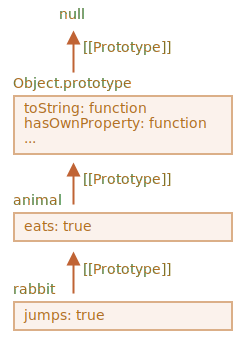
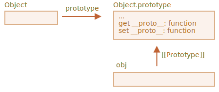

프로토타입 상속
==============

- 개발 중 기존 기능 가져와 확장하는 경우 발생
  - 자바스크립트 언어 고유 기능 프로토타입 상속

### `[[Prototype]]`
- 자바스크립트 객체 명세서에서 명명한 `[[Prototype]]` 숨김 프로퍼티 보유
- 값 : `null` · 다른 객체 참조
  - 다른 객체 참조 시 참조 대상
    - 프로토타입 <sub>(prototype)</sub>


- 프로토타입 동작 방식 '신비스러운' 면 존재
  - object 프로퍼티 읽을 때 해당 프로퍼티 없으면 자바스크립트 자동으로 프로토타입에서 프로퍼티 찾음
    - 프로토타입 상속
- `[[Prototype]]` 프로퍼티
  - 내부 · 숨김 프로퍼티
  - 다양한 방법 사용해 값 설정 가능
    - ex&#41; 특별한 이름 `__proto__` 사용해 값 설정
```javascript
let animal = {
  eats: true
};
let rabbit = {
  jumps: true
};

rabbit.__proto__ = animal;
```

 **`__proto__` == `[[Prototype]]`용 `getter` · `setter`**

- `__proto__`
  - `[[Prototype]]` `getter` <sub>(획득자)</sub> · `setter` <sub>(설정자)</sub>
- 하위 호환성 때문에 여전히 `__proto__` 사용 가능
  - 비교적 근래 작성 스크립트 `__proto__` 대신 함수 `Object.getPrototypeOf` · `Object.setPrototypeOf` 사용해 프로토타입 획득 <sub>(get)</sub> · 설정 <sub>(set)</sub>
- `__proto__` 브라우저 환경에서만 지원하도록 자바스크립트 명세서 규정
  - 실상 서버 사이드 포함 모든 호스트 환경 `__proto__` 지원

<br />

```javascript
let animal = {
  eats: true
};
let rabbit = {
  jumps: true
};

// 객체 rabbit 프로퍼티 미존재 시 자동으로 animal 객체에서 프로퍼티 얻음
rabbit.__proto__ = animal;

alert( rabbit.eats );      // true, [[Prototype]] 참조 객체 animal 에서 eats 얻음
alert( rabbit.jumps );     // true
```


- 'rabbit 프로토타입 : animal'
- "rabbit은 animal을 상속받음"
- 프로토타입에서 상속받은 프로퍼티
  - 상속 프로퍼티
```javascript
let animal = {
  eats: true,
  walk() {
    alert("동물이 걷습니다.");
  }
};

let rabbit = {
  jumps: true,
  __proto__: animal
};

rabbit.walk(); // 동물이 걷습니다.
```


```javascript
let animal = {
  eats: true,
  walk() {
    alert("동물이 걷습니다.");
  }
};

let rabbit = {
  jumps: true,
  __proto__: animal
};

let longEar = {
  earLength: 10,
  __proto__: rabbit
};

// 메서드 walk 프로토타입 체인 통해 상속받음
longEar.walk();       // 동물이 걷습니다.
alert(longEar.jumps); // true, rabbit 에서 상속받음
```


- 프로토타입 체이닝 제약사항
  - 순환 참조 X
    - `__proto__` 이용해 닫힌 형태로 다른 객체 참조 시 에러 발생
  - `__proto__` 값
    - 객체 · `null` 만 가능
    - 다른 자료형 무시
  - 객체 오직 하나의 `[[Prototype]]`만 존재
    - 두 개 객체 상속 X

### 프로토타입은 읽기 전용이다
- 프로퍼티 읽을 때만 사용
- 프로퍼티 추가 · 수정 · 삭제 연산
  - 객체에 직접 실행
```javascript
let animal = {
  eats: true,
  walk() {
    // rabbit 이 메서드 사용 X
  }
};

let rabbit = {
  __proto__: animal
};

// 객체 rabbit 에 메서드 walk 직접 할당
rabbit.walk = function() {
  alert("토끼가 깡충깡충 뜁니다.");
};

/*
 rabbit.walk() 호출 시
 - 프로토타입 메서드 X
 - 객체 rabbit 직접 추가 메서드 실행
*/
rabbit.walk(); // 토끼가 깡충깡충 뜁니다.
```


- 접근자 프로퍼티
  - `setter` 함수 사용해 프로퍼티 값 할당
    - 접근자 프로퍼티 값 할당 시 `setter` 함수 호출되면서 조금 다르게 동작
```javascript
let user = {
  name: "John",
  surname: "Smith",

  set fullName(value) {
    [this.name, this.surname] = value.split(" ");
  },

  get fullName() {
    return `${this.name} ${this.surname}`;
  }
};

let admin = {
  __proto__: user,
  isAdmin: true
};

// 프로토타입 getter 함수 실행
alert(admin.fullName); // John Smith

// 프로토타입 setter 함수 실행
admin.fullName = "Alice Cooper";

alert(admin.fullName); // Alice Cooper,
                       // setter 의해 추가된 admin 프로퍼티 (name · surname) 값 가져옴
alert(user.fullName);  // John Smith
                       // 본래 user 있었던 프로퍼티 값
```
- 프로토타입 `setter` 함수 <sub>(`set fullName`)</sub> 할당 연산 실행 시
  - 객체 `user` 프로퍼티 추가 X
  - 프로토타입 `setter` 함수 호출

### `this` 가 나타내는 것
- `this` 프로토타입 영향 X
  - 메서드 호출 객체 · 프로토타입 상관없이 `this` 언제나 `.` 앞 객체
  - `admin.fullName=` `setter` 함수 호출 시 `this`
    - `user` &nbsp;&nbsp;X
    - `admin` O
- 객체 하나 생성 · 메서드 다수 구현 후 여러 객체에서 상속하는 경우 多
  - 상속받은 메서드 사용하더라도 객체 프로토타입 자신 상태 수정
```javascript
// animal 다양한 메서드 보유
let animal = {
  walk() {
    if (!this.isSleeping) {
      alert(`동물이 걸어갑니다.`);
    }
  },
  sleep() {
    this.isSleeping = true;
  }
};

let rabbit = {
  name: "하얀 토끼",
  __proto__: animal
};

// rabbit 새로운 프로퍼티 isSleeping 추가
// - 값 true 변경
rabbit.sleep();

alert(rabbit.isSleeping); // true
alert(animal.isSleeping); // undefined
```


- 상속받은 객체들 프로토타입 구현 메서드 사용 가능
  - 상속받은 메서드 `this`
    - 실제 메서드 호출 시점 `.` 앞 객체
      - 프로토타입 X
      - 해당 객체 상태 변화
- 메서드 공유
- 객체 상태 공유 X

### `for…in` 반복문
- 상속 프로퍼티 순회대상 포함
```javascript
let animal = {
  eats: true
};

let rabbit = {
  jumps: true,
  __proto__: animal
};

// Object.keys 객체 자신 키만 반환
alert(Object.keys(rabbit));          // jumps

// for…in 객체 자신 · 상속 프로퍼티 키 모두 순회
for(let prop in rabbit) alert(prop); // jumps, eats
```
- `obj.hasOwnProperty(key)`
  - 상속 프로퍼티 순회 대상 제외
    - 상속 프로퍼티
      - `false`
    - `obj` 직접 구현 프로퍼티
      - `true`
- `obj.hasOwnProperty(key)` 응용 시
  - 상속 프로퍼티 걸러냄
  - 상속 프로퍼티만 대상으로 작업 가능
```javascript
let animal = {
  eats: true
};

let rabbit = {
  jumps: true,
  __proto__: animal
};

for(let prop in rabbit) {
  let isOwn = rabbit.hasOwnProperty(prop);

  if (isOwn) {
    alert(`객체 자신의 프로퍼티: ${prop}`); // 객체 자신 프로퍼티: jumps
  } else {
    alert(`상속 프로퍼티: ${prop}`);       // 상속 프로퍼티: eats
  }
}
```



- `animal` → `Object.prototype` 상속
  - `animal` 객체 리터럴 방식 선언
- `hasOwnProperty` 출력 X
  - 열거 가능한 <sub>(enumerable)</sub> 프로퍼티 X
  - `Object.prototype` 모든 메서드
    - `enumerable` 플래그 : `false`
    - `for…in` 오직 열거 가능 프로퍼티만 순회 대상 포함

 **키 : 값 순회하는 대부분 메서드 : 상속 프로퍼티 제외 후 동작**

- 객체 키 : 값 대상 동작 메서드
  - 대부분 상속 프로퍼티 제외 후 동작
    - 프로토타입 상속 프로퍼티 제외
    - 해당 객체 정의 프로퍼티만 연산 대상 포함
  - ex&#41; `Object.keys` · `Object.values`

<br />

함수의 prototype 프로퍼티
========================

- 생성자 함수 프로토타입 객체인 경우
  - `new` 연산자 사용해 만든 객체 생성자 함수 프로토타입 정보 사용해 `[[Prototype]]` 설정

 **주의**

- 자바스크립트 만들어졌을 당시 프로토타입 기반 상속 주요 기능 중 하나
- 과거 프로토타입 직접 접근 방법 X
  - 그나마 믿고 사용할 수 있었던 방법
    - 생성자 함수 `prototype` 프로퍼티 이용
    - 많은 스크립트 아직 이 방법 사용하는 이유

<br />

- 생성자 함수 `(F)` 프로토타입 의미
  - `F.prototype`
    - `F` 에 정의된 일반 프로퍼티
    - 프로토타입과 비슷, but 일반적인 프로퍼티
```javascript
let animal = {
  eats: true
};

function Rabbit(name) {
  this.name = name;
}

// new Rabbit 호출해 만든 새로운 객체 [[Prototype]] → animal 설정
Rabbit.prototype = animal;

let rabbit = new Rabbit("흰 토끼"); //  rabbit.__proto__ == animal

alert( rabbit.eats );              // true
```


- 가로 화살표
  - `prototype` <sub>(일반 프로퍼티)</sub>
- 세로 화살표
  - `[[Prototype]]`
  - rabbit → animal 상속

 **`F.prototype` : `new F` 호출할 때만 사용**

- `F.prototype` 프로퍼티 `new F` 호출 시만 사용
  - `new F` 호출 시 생성 객체 `[[Prototype]]` 할당
- 새로운 객체 생성 후 `F.prototype` 프로퍼티 바뀌면 <sub>(F.prototype = &#60;another object&#62;)</sub>
  - `new F` 호출해 생성한 또 다른 새로운 객체 `another object` `[[Prototype]]`로 보유
  - 기존 객체 `[[Prototype]]` 그대로 유지

### 함수의 디폴트 프로퍼티 prototype과 constructor 프로퍼티
- 모든 함수 기본적으로 `prototype` 프로퍼티 보유
- 디폴트 `prototype` 프로퍼티
  - `constructor` 프로퍼티 하나만 있는 객체 가리킴
    - `constructor` 프로퍼티 : 함수 자신 가리킴
```javascript
function Rabbit() {}

// 디폴트 prototype
// Rabbit.prototype = { constructor: Rabbit };
```


```javascript
function Rabbit() {}
// 함수 생성만 해도 디폴트 프로퍼티 prototype 설정됨
// Rabbit.prototype = { constructor: Rabbit }

alert( Rabbit.prototype.constructor == Rabbit ); // true
```
- `new Rabbit` 실행해 만든 객체 모두에서 `constructor` 프로퍼티 사용 가능
  - 이때 `[[Prototype]]` 거침
```javascript
function Rabbit() {}
// 디폴트 prototype
// - Rabbit.prototype = { constructor: Rabbit }

let rabbit = new Rabbit();           // {constructor: Rabbit} 상속받음

alert(rabbit.constructor == Rabbit); // true
                                     // [[Prototype]] 거쳐 접근
```


- `constructor` 프로퍼티
  - 기존 객체 `constructor` 사용해 새로운 객체 만들때 사용
```javascript
function Rabbit(name) {
  this.name = name;
  alert(name);
}

let rabbit1 = new Rabbit("흰 토끼");
let rabbit2 = new rabbit1.constructor("검정 토끼");
```
- 어떤 객체 존재 시 객체 생성에 어떤 생성자 사용되었는지 알 수 없는 경우 유용
  - 객체 from 서드 파티 라이브러리 등
- `constructor` 가장 중요한 점
  - 자바스크립트 알맞은 `constructor` 값 보장 X
  - 함수 기본으로 `prototype` 설정된다라는 사실 그게 전부
  - `constructor` 관련 발생하는 모든 일 전적으로 개발자에게 달려있음
- 함수 기본 설정 `prototype` 프로퍼티 값 다른 객체로 바꾸는 경우
  - new 사용해 객체 생성 후 이 객체에 `constructor` 없음
```javascript
function Rabbit() {}
Rabbit.prototype = {
  jumps: true
};

let rabbit = new Rabbit();
alert(rabbit.constructor === Rabbit); // false
```
- `constructor` 기본 성질 제대로 활용
  - `prototype` 전체 덮어쓰기 X
  - 디폴트 `prototype` 에 원하는 프로퍼티 추가 · 제거
```javascript
function Rabbit() {}

/*
 Rabbit.prototype 전체 덮어쓰기 X
 원하는 프로퍼티 추가
 - 디폴트 프로퍼티 Rabbit.prototype.constructor 유지
 */
Rabbit.prototype.jumps = true
```
- 실수로 `prototype` 덮어썼을 경우 `constructor` 프로퍼티 수동으로 다시 생성
  - constructor 다시 사용 가능
```javascript
// 수동으로 constructor 추가
// - constructor 특징 그대로 사용 가능
Rabbit.prototype = {
  jumps: true,
  constructor: Rabbit
};
```

<br />

내장 객체의 프로토타입
====================

- 모든 내장 생성자 함수 `prototype` 프로퍼티 사용

### `Object.prototype`
```javascript
let obj = {};
alert( obj ); // "[object Object]"
```
- `"[object Object]"` 문자열 생성하는 `toString` 메서드
- `obj = new Object()` == `obj = {}`
  - `Object` : 내장 객체 생성자 함수
  - 생성자 함수 `prototype`
    - `toString` 포함 다양한 메서드 구현되어있는 거대한 객체 참조


- `new Object()` 호출 · 리터럴 문법 { … } 사용해 객체 생성 시
  - 새롭게 생성된 객체 `[[Prototype]]` → `Object.prototype` 참조


- `obj.toString()` 호출 시 `Object.prototype`에서 해당 메서드 가져옴
```javascript
let obj = {};

alert(obj.__proto__ === Object.prototype);          // true
alert(obj.toString  === obj.__proto__.toString);    // true
alert(obj.toString  === Object.prototype.toString); // true
```
- `Object.prototype` 위쪽 `[[Prototype]]` 체인 X
```javascript
alert(Object.prototype.__proto__); // null
```
### Array, Date, Function을 비롯한 내장 객체들 역시 프로토타입에 메서드를 저장해 놓습니다.
- 배열 `[1, 2, 3]` 생성 시
  - `new Array()` 디폴트 생성자 내부 동작
    - `Array.prototype` → 배열 `[1, 2, 3]` 프로토타입
    - `Array.prototype` 통해 배열 메서드 사용
      - 메모리 효율 ↑
- 명세서 모든 내장 프로토타입 상속 트리 꼭대기 `Object.prototype` 규정
  - "모든 것은 객체를 상속받는다."

세 내장 객체를 이용해 지금까지 설명한 내용을 그려보면 다음과 같습니다.


```javascript
let arr = [1, 2, 3];

// arr → Array.prototype  상속?
alert( arr.__proto__ === Array.prototype );            // true

// arr → Object.prototype 상속?
alert( arr.__proto__.__proto__ === Object.prototype ); // true

// 체인 맨 위 : null
alert( arr.__proto__.__proto__.__proto__ );            // null
```
- 체인 상 프로토타입 중복 메서드 존재 가능
  - ex&#41; `Array.prototype` : `toString`
      - 요소 사이 쉼표 넣어 요소 전체 합친 문자열 반환 자체 메서드
```javascript
let arr = [1, 2, 3]
alert(arr); // 1,2,3, Array.prototype.toString 결과
```
- 중복 메서드 존재 시 체인 상 가까운 곳 메서드 사용
  - `Array.prototype`.`toString` ← `Object.prototype`.`toString`


- 타 내장 객체들 · 함수 동일 방법으로 동작
- 함수
  -  내장 객체 `Function` 생성자 사용해 생성
    - `call` · `apply` 등 함수 사용 가능 메서드 `Fuction.prototype`에서 받아옴
    - 함수 `toString` 구현 존재
```javascript
function f() {}

alert(f.__proto__ == Function.prototype);         // true
alert(f.__proto__.__proto__ == Object.prototype); // true, 객체에서 상속받음
```

### 원시값
- 문자열 · 숫자 · 불린값 다루기 엄청 까다로움
- 문자열 · 숫자 · 불린값 객체 X
- 원시 타입 값 프로퍼티 접근 시
  - 내장 생성자 `String` · `Number` · `Boolean` 사용 임시 래퍼 객체 생성
    - 메서드 제공 후 제거
  - 래퍼 객체 보이지 않는 곳에서 생성
    - 엔진 의해 최적화 진행
    - 명세서 각 자료형 해당 래퍼 객체 메서드 프로토타입 내 구현 후 `prototype` 사용 규정
      - `String.prototype`
      - `Number.prototype`
      - `Boolean.prototype`

 **`null` · `undefined` 대응 래퍼 객체 : X**

- 메서드 · 프로퍼티 · 프로토타입 사용 X

### 네이티브 프로토타입 변경하기
- 네이티브 프로토타입 수정 가능
  - `String.prototype` 메서드 하나 추가 시 모든 문자열 해당 메서드 사용 가능
```javascript
String.prototype.show = function() {
  alert(this);
};

"BOOM!".show(); // BOOM!
```
- 개발 중 새로운 내장 메서드 생성 고려하게 됨
  - 네이티브 프로토타입에 새 내장 메서드 추가
    - → 좋지 않은 방법

 **중요:**

- 프로토타입 전역 영향
  - 프로토타입 조작 시  기존 코드 충돌 발생 가능성 ↑
    - 두 라이브러리 동시에 `String.prototype.show` 메서드 추가 시 한 라이브러리 메서드 다른 라이브러리 메서드 덮어씀
- 네이티브 프로토타입 수정 권장 X

#### 모던 프로그래밍 네이티브 프로토타입 변경 허용 경우 딱 하나
- 폴리필 제작
- 폴리필
  - 자바스크립트 명세서 메서드 동일 기능 메서드 구현체 의미
  - 명세서 정의, but 특정 자바스크립트 엔진 해당 기능 미구현 시 폴리필 사용
- 폴리필 직접 구현 후 내장 프로토타입에 추가할 때만 네이티브 프로토타입 변경
```javascript
/* repeat 메서드 미구현 가정 */
if (!String.prototype.repeat) {

  // 프로토타입 repeat 추가
  String.prototype.repeat = function(n) {

    // string n회 반복
    return new Array(n + 1).join(this);
  };
}

alert( "라".repeat(3) ); // 라라라
```

### 프로토타입에서 메서드 빌려오기
```javascript
// 유사 배열 객체 생성 후 Array 메서드 복사
let obj = {
  0: "Hello",
  1: "world!",
  length: 2,
};

obj.join = Array.prototype.join;

alert( obj.join(',') ); // Hello,world!
```
- 내장 메서드 `join` 내부 알고리즘
  - 제대로 된 인덱스 있는지 · `length` 프로퍼티 있는지만 확인
    - 에러 없이 동작
  - 호출 대상 진짜 배열인지 상관 X
    - 다수 내장 메서드 이런 식으로 동작
- `obj.__proto__` → `Array.prototype` 설정해 배열 메서드 상속
  - `obj` 모든 `Array` 메서드 사용 가능
  - 자바스크립트 단일 상속 허용
    - `obj` 다른 객체 상속받고 있을 때 사용 X
- 메서드 빌리기
  - 여러 객체에서 필요한 기능 가져와 섞는 것 가능
    - 유연한 개발 가능

<br />

프로토타입 메서드와 __proto__가 없는 객체
======================================

- `__proto__`
  - 브라우저 대상 개발 시 다소 구식 → 사용 X
    - 표준 관련 내용 명시
- 모던 메서드 사용
  - `Object.create(proto, [descriptors])`
    - `[[Prototype]]` → `proto` 참조 빈 객체 생성
    - 프로퍼티 설명자 선택적 전달 가능
  - `Object.getPrototypeOf(obj)`
    - `obj`.`[[Prototype]]` 반환
  - `Object.setPrototypeOf(obj, proto)`
    - `obj`.`[[Prototype]]` → `proto` 설정
```javascript
let animal = {
  eats: true
};

// 새로운 객체 생성
// - 프로토타입 → animal
let rabbit = Object.create(animal);

alert(rabbit.eats);                              // true
alert(Object.getPrototypeOf(rabbit) === animal); // true
Object.setPrototypeOf(rabbit, {});               // rabbit 프로토타입 → {}
```
- `Object.create` 프로퍼티 설명자 선택적 전달
```javascript
let animal = {
  eats: true
};

let rabbit = Object.create(animal, {
  jumps: {
    value: true
  }
});

alert(rabbit.jumps); // true
```
- `Object.create` 사용 시 `for…in` 프로퍼티 복사보다 더 효과적으로 객체 복제
```javascript
let clone = Object.create(Object.getPrototypeOf(obj), Object.getOwnPropertyDescriptors(obj));
```
- `obj` 모든 프로퍼티 포함한 완벽한 사본 생성
  - 모든 프로퍼티 복제
    - 열거 가능 프로퍼티
    - 열거 불가능 프로퍼티
    - 데이터 프로퍼티
    - getter
    - setter
    - `[[Prototype]]` 등

### 비하인드 스토리
- `[[Prototype]]` 다루는 방법 다양
  - 목표 하나, 수단 여러 가지
- 역사적인 이유
  - 생성자 함수 `prototype` 프로퍼티 아주 오래전부터 사용
  - 2012년, 명세서 `Object.create` 추가
    - 주어진 프로토타입 사용해 객체 생성 가능
    - 프로토타입 얻기 · 설정 불가능
    - 브라우저 비표준 접근자 `__proto__` 구현해 프로토타입 얻기 · 설정 가능
  - 2015년, `Object.setPrototypeOf` · `Object.getPrototypeOf` 표준 추가
    - `__proto__` 동일 기능 수행
    - 이 시점 `__proto__` 사용 너무 많음
      - 사실상 표준
      - 명세서 부록 B 내용 추가
        - 브라우저 이외 호스트 환경에서 선택사항

 **속도 중요 : 기존 객체 `[[Prototype]]` 변경 X**

- 언제나 `[[Prototype]]` 얻기 · 설정 가능
  - 기술적 제약 X
  - 대개 객체 생성 시만 `[[Prototype]]` 설정, 이후 수정 X
- 자바스크립트 엔진 이런 시나리오 토대로 최적화
  - `Object.setPrototypeOf` · `obj.__proto__=` 사용해 프로토타입 그때그때 바꾸는 연산
    - 객체 프로퍼티 접근 관련 최적화 망침 → 성능 나쁜 영향

### 아주 단순한 객체
- 객체 키 : 값 쌍 있는 연관 배열로 사용 가능
- 커스텀 사전 같이 사용자 직접 입력한 키로 객체 생성 시 사소한 결함 발견
  - "__proto__" 문자열 키로 사용 X
```javascript
let obj = {};
let key = prompt("입력하고자 하는 key는 무엇인가요?", "__proto__");
obj[key] = "… 값 …";

alert(obj[key]); // "… 값 …"이 아닌 [object Object]가 출력됩니다.
```
- `__proto__`
  - 항상 객체 · `null`
  - 문자열 프로토타입 X
- 할당 값 객체 일 때 프로토타입 바뀔 수 있다는 치명적인 버그 발생 가능
  - 프로토타입 바뀌면 예상치 못한 일 발생
  - 개발자들 대개 프로토타입 중간에 바뀌는 시나리오 배제한 채 개발 진행
  - 프로토타입 중간에 바뀌면서 발생한 버그 원인 찾기 어려움
    - 서버 사이드 자바스크립트 사용 시 취약점 되기도 함
    - `toString` 같은 내장 메서드에 할당 할 때도 예상치 못한 일 발생 가능
- 문제 해결
  1. 객체 대신 맵 사용
  2. 객체 사용 방법

- `__proto__`
  - 객체 프로퍼티 X
  - `Object.prototype` 접근자 프로퍼티
    - `obj.__proto__` 읽기 · 쓰기 시 대응 `getter` · `setter` 프로토타입에서 호출
    - `obj` : `[[Prototype]]` 통해 `getter` · `setter` 접근
  - `[[Prototype]]` 접근 위한 수단
  - `[[Prototype]]` 그 자체 X



- 간단한 트릭 써 객체 연관 배열 역할 수행
- `Object.create(null)`
  - 프로토타입 없는 빈 객체 생성
  - `[[Prototype]]` == `null`
```javascript
let obj = Object.create(null);
let key = prompt("입력하고자 하는 key는 무엇인가요?", "__proto__");
obj[key] = "… 값 …";

alert(obj[key]); // "… 값 …" 제대로 출력
```


- `Object.create(null)` 객체 생성 시
  - `__proto__`
    - `getter` · `setter` 상속 X
    - 평범한 데이터 프로퍼티처럼 처리
- 프로토타입 없는 빈 객체
  - 아주 단순한 · 순수 사전식 객체
  - 일반 객체 `{ … }` 보다 훨씬 단순
  - 내장 메서드 X
    - ex &#41; `toString`
    - 객체 연관 배열로 쓸 때 문제 X
```javascript
let obj = Object.create(null);

alert(obj); // Error: Cannot convert object to primitive value (toString 없음)
```
- 객체 관련 메서드 대부분 `Object.something( … )` 형태
  - ex&#41; `Object.keys(obj)`
  - 프로토타입 메서드 X
    - '아주 단순한 객체’에도 사용 가능
