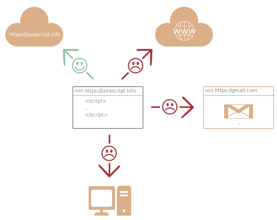

자바스크립트란?
====

### 정의

##### 프로그래밍 언어
- '웹페이지 내 생동감 불어넣기' (목적)

##### 스크립트
- JS 작성 프로그램
- 웹페이지 HTML 내 작성
  - 로드 시 자동 실행
- 특별한 준비 · 컴파일 불필요
  - 일반 문자 형태 작성 가능
  - 실행 가능

 

 **_Javascript_ (이름) 유래**

##### 언어 초기
- _LiveScript_
- 당시 자바 인기 ↑
  - 홍보 목적 이름 변경 (자바 '동생' 격)

##### 독자적 언어 (자바 무관)
- 고유 명세 (ECMAScript) 有

 

##### 실행 환경
- 브라우저
- 서버
- JS 엔진 장착 디바이스

##### 브라우저
- 엔진 (JS 가상 머신) 내장

##### 다양한 엔진 종류 (특유 코드 네임)
|엔진|브라우저|
|---|---|
|[V8](https://en.m.wikipedia.org/wiki/V8_(JavaScript_engine))|Chrome|
||Opera|
|[SpiderMonkey](https://en.m.wikipedia.org/wiki/SpiderMonkey)|Firefox|
|Trident · Chakra|IE (버전별 상이)|
|ChakraCore|Microsoft Edge|
|SquirrelFish|Safari|

 

 **엔진 동작 방식**

##### 기본 원리
1. 스크립트 읽기 (파싱)
2. 읽은 스크립트 → 기계어 전환 (컴파일)
3. 전환된 기계어 코드 실행 (실행 속도 ↑)

##### 특징
- 프로세스 각 단계별 최적화 진행
- 컴파일 후 실행 중인 코드 감시
- 코드로 흘러가는 데이터 분석
- 전환된 기계어 코드 다시 최적화 (분석 결과 기반)
  - 스크립트 실행 속도 ↑

 

### 브라우저에서 할 수 있는 일

##### 모던 JS
- '안전한' 프로그래밍 언어
  - 저수준 영역 (메모리 · CPU 등) 조작 불허
- 브라우저 대상 언어
  - 저수준 접근 불필요

##### JS 기능 (실행 환경 영향 ↑)
- [Node.js](https://en.m.wikipedia.org/wiki/Node.js)
  - 임의 파일 읽기 · 쓰기
  - 네트워크 요청 함수 지원
  - 기타 등등
- 브라우저
  - 웹페이지 조작
  - 클라이언트 · 서버 상호작용
  - 기타 등등

##### 브라우저 내 JS 가능 작업
- 웹페이지 작업
  - 새 HTML 추가
  - 기존 HTML · 스타일 수정
- 사용자 행동 반응
  - 마우스 클릭
  - 포인터 이동
  - 키보드 키 눌림
  - 기타 등등
- 사용자 상호작용
  - 질문 물어보기
  - 메시지 보여주기
- 네트워크 작업 ([AJAX](https://en.m.wikipedia.org/wiki/Ajax_(programming)) · [COMET](https://en.m.wikipedia.org/wiki/Comet_(programming)))
  - 원격 서버 요청 전송
  - 파일 다운 · 업로드
  - 기타 등등
- 쿠키 접근 · 설정
- 클라이언트 내 데이터 저장 (로컬 스토리지)

### 브라우저에서 할 수 없는 일

##### 브라우저 내 JS 기능 제약 有 (보안)
- 악성 웹페이지 악용 방지
  - 개인 정보 접근
  - 사용자 데이터 손상

### 일부 제약사항

#### a. 디스크 내 임의 파일 대상 작업 관련

##### 읽기 · 쓰기 · 복사 · 실행 시 제약 有
- 운영체제 지원 기능
  - 브라우저 직접 사용 불가능

##### 파일 처리 시 접근 제한
- 특정 경우만 허용
  - 파일 '드래그 앤 드롭' (사용자)
  - 파일 선택 (`<input>` 태그)

##### 디바이스 상호작용 (카메라 · 마이크 등)
- 명시적인 사용자 허가 필요

#### b. 동일 출처 정책 (Same Origin Policy)

##### 상이 오리진 (도메인 · 포트 · 프로토콜) 접근 불가능
- 도메인 · 포트 · 프로토콜 상이 시
  - 페이지 접근 불가능
- ex\) `http://anysite.com`
  - `http://gmail.com` 접근 불가능

##### 보통 탭 · 창 사이 정보 공유 X
- JS 사용해 창 내 타 창 열기 (예외)
  - 정보 공유 가능
  - 동일 출처 정책 적용
    - 오리진 상이 시 정보 공유 X

##### 정책 우회 방법
- 양쪽 페이지 준비 필요
  - 데이터 교환 동의
  - 특수 JS 코드 (동의 관련) 포함

#### c. 타 사이트 · 도메인 내 데이터 송신 불가능

##### 원격 서버
- 명시적인 승인 필요 (HTTP 헤더 등 이용)

##### 페이지 생성 서버
- 자유롭게 정보 교환 가능

##### 모던 브라우저
- 플러그인 · 익스텐션 설치 허용
  - 추가 권한 허가 요청

### JS 강점

##### 대표적 강점
- HTML · CSS 완전 통합
- 단순 처리 방법 제공
- 모든 주요 브라우저 지원 (기본 언어)

##### 주요 브라우저 연관 기능 구현
- 브라우저 인터페이스 제작 시 가장 많이 사용

##### 기타 강점
- 서버 · 모바일 앱 등 제작 가능

### JS 다음 언어들

##### 새 언어들 등장
- 브라우저 실행 전 JS 트랜스파일 (변환)
- 최신 툴 사용 권장
  - 빠르고 명확하게 트랜스파일 (변환) 수행
  - '보이지 않는 곳에서' 자동 변환

#### 대표적 언어 (일부)

##### [CoffeeScript](https://coffeescript.org/)
- 'syntactic sugar' (문법적 설탕)
  - 짧은 문법 도입 (명료성 · 이해도 ↑)
- Ruby 개발자 애용

##### [TypeScript](https://www.typescriptlang.org/) (Microsoft 개발)
- 자료형 명시화 집중
  - 개발 단순화
  - 복잡한 시스템 지원

##### [Flow](https://flow.org/) (Facebook 개발)
- 자료형 강제
  - 고유 방식 사용

##### [Dart](https://www.dartlang.org/) (Google 개발)
- 독자적 언어 (고유 엔진 有)
  - 브라우저 외 환경 동작 (모바일 앱 등)

##### 이 외 다양한 언어 有
- 기본은 JS!
  - JS 지식 학습 필수

 

요약
====

#### JS

##### 초기
- 브라우저 전용 언어

##### 현재
- 다양한 환경 내 사용
- 브라우저 환경 기본 언어
- HTML · CSS 완전 통합 가능

##### 다양한 JS 트랜스파일 (변환) 언어 有
- 각 언어별 고유 기능 제공
- JS 지식 필수
