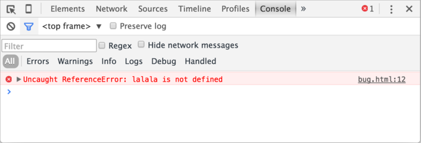

개발자 콘솔
==========

##### '개발자 도구'
- 브라우저 내장
- 에러 · 유용한 정보 (스크립트 관련) 확인

##### Chrome · Firefox (대다수 개발자 선호 브라우저)
- 굉장히 훌륭한 개발자 도구
- 기타 브라우저들
  - 거의 Chrome · Firefox '따라가는' 수준
- 지원 기능 잘 활용 시
  - 개발 효율 ↑

### Chrome

##### bug.html
- 에러 존재 (페이지 내 스크립트) 
  - 일반적인 사용자 눈에 안 보임

##### 개발자 도구 열기
- F12 (Windows)
- 'Cmd + Opt + J' (Mac)
- Console 패널 (기본)

화면 구성은 사용하고 있는 Chrome 버전에 따라 다릅니다. 버전이 바뀔 때 마다 구성이 조금씩 바뀌긴 하지만 큰 틀은 바뀌지 않습니다.

- 빨간색 에러 메시지가 보일 겁니다. 'lalala’가 정의되지 않았다(not defined)라는 메시지입니다.
- 에러 메시지 우측에 링크 bug.html:12가 있습니다. bug.html은 해당 에러가 발생한 파일, 12는 에러가 발생한 줄을 나타냅니다.

에러 메시지 아래에 파란색 기호 >가 있는데, 이 기호가 있는 곳엔 자바스크립트 명령어(command)를 입력할 수 있습니다. 이를 '커맨드 라인(command line)'이라 부릅니다. 커맨드 라인에 명령어(command)를 입력한 후 Enter를 누르면 해당 명령어가 실행됩니다.

자 이제 에러를 확인하는 방법을 알았습니다. 시작치곤 나쁘지 않네요. 에러를 확인하고 고치는 방법(디버깅)은 Chrome으로 디버깅하기에서 다루도록 하겠습니다.

 **Multi-line input**

보통은 한줄 짜리 명령어를 입력하고 Enter를 눌러 해당 명령어를 실행하는 작업을 많이 합니다.

명령어를 여러 줄에 걸쳐 작성하고 싶다면 Shift+Enter를 누르면 됩니다. Shift+Enter를 누르면 명령어를 실행시키지 않고 줄 바꿈만 할 수 있기 때문에 자바스크립트 코드 조각을 입력하는 것도 가능해집니다.

### Firefox, Edge 및 기타 브라우저
F12를 누르면 대부분의 브라우저에서 개발자 도구를 열 수 있습니다.

브라우저는 다르지만 개발자 도구 인터페이스는 거의 유사하기 때문에, 한 브라우저에 익숙해지면 다른 브라우저에 적응하는 건 어렵지 않습니다. Chrome을 이용해 개발자 도구에 입문해 보시길 바랍니다.

### Safari
Mac 전용 브라우저인 Safari에서 개발자 도구를 사용하려면 '개발자 메뉴(Develop menu)'를 명시적으로 활성화해주어야 합니다.

환경설정(Preferences)의 ‘고급(Advanced)’ 패널을 클릭한 후 ‘메뉴 막대에서 개발자용 메뉴 보기’ 체크 박스를 체크해 개발자 도구를 활성화해봅시다.

이제 Cmd+Opt+C를 눌러 개발자 콘솔을 여닫을 수 있게 되었습니다. Safari 상단에 ‘개발자용(Develop)’ 메뉴가 새로 생긴 것도 볼 수 있습니다. 개발자용 메뉴엔 다양한 명령어와 옵션이 있습니다.
