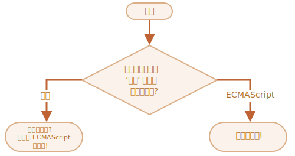

`if` · `?` <sub>(조건 처리)</sub>
====

### `if` <sub>(문)</sub>

##### `if (…)` <sub>(괄호)</sub> 내 조건문 평가 <sub>(`boolean`)</sub>
- `true` 평가 시 코드 블록 실행 여부 결정
```javascript
if (…조건문…) …코드 블록…
```
```javascript
let year = prompt('ECMAScript-2015 명세는 몇 년도에 출판되었을까요?', '');

if (year == 2015) alert( '정답입니다!' );
```

##### 코드 블록 감싼 `{…}` <sub>(중괄호)</sub>
- 다수 실행문 작성 가능
- 항상 사용 권장 <sub>(가독성 ↑)</sub>
```javascript
// 다수 실행문
if (…조건문…) {
  …코드 블록…
}
```
```javascript
// 다수 실행문
if (year == 2015) {
  alert( "정답입니다!" );
  alert( "아주 똑똑하시네요!" );
}

// {…} (중괄호) 미사용 (가독성 ↓)
if (year == 201) alert( "정답입니다!" );

// {…} (중괄호) 사용 (가독성 ↑)
if (year == 2015) {
  alert( "아주 똑똑하시네요!" );
}
```

### `boolean` 형 변환

##### `if (…)` <sub>(괄호)</sub> 내 표현식 평가 후 결과 형 변환
- 결과 값 → `boolean` 값

|표현식|형 변환|
|---|---|
|'falsy' <sub>(거짓 같은)</sub> 값<br />- `0` <sub>(숫자)</sub><br /> - `""` <sub>(빈 문자열)</sub><br /> - `null` <br /> - `undefined`<br /> - `NaN`|`false`|
|'truthy' <sub>(참 같은)</sub> 값<br />- falsy 외 값|`true`|

```javascript
// 항상 미실행
if (0) { // 0 → false (falsy)
  …
}

// 항상 실행
if (1) { // 1 → true (truthy)
  …
}

// 평가 후 확정된 boolean 값 전달 가능
let cond = (year == 2015);
if (cond) {
  …
}
```

### `else` <sub>(절)</sub>

##### `if (…)` 괄호 내 조건 거짓일 때 실행
if (…조건문…) {
  …코드 블록… // true  평가 시 실행
} else {
  …코드 블록… // false 평가 시 실행
}
```
```javascript
let year = prompt('ECMAScript-2015 명세는 몇 년도에 출판되었을까요?', '');

if (year == 2015) {
  alert( '정답입니다!' );

// 2015 외 값 입력 시 실행
} else {
  alert( '오답입니다!' );
}
```

### `else if` 복수 조건 처리

##### 다수 조건 처리
- 마지막 `else`
  - 선택사항
```javascript
if (…조건문 1…) {
  …코드 블록…
} else if (…조건문 2…) {
  …코드 블록…
} else { // 선택사항
  …코드 블록…
}
```

### `?` <sub>(조건부 연산자)</sub>
- 더 짧고 간결
- 삼항 연산자 <sub>(피연산자 3개)</sub>
  - 피연산자 3개 받는 유일 연산자
```javascript
condition ? trueValue : falseValue
```
```javascript
let accessAllowed;
let age = prompt('나이를 입력해 주세요.', '');
if (age > 18) {
  accessAllowed = true;
} else {
  accessAllowed = false;
}
alert(accessAllowed);

// ? (조건부 연산자)
let accessAllowed1 = (age > 18) ? true : false;

// `(…)` (괄호) 생략 가능
// - 물음표 연산자 우선순위 ↓
// - 가독성 ↓
let accessAllowed2 =  age > 18  ? true : false;
```

<br />

 **주의**

##### 비교 연산자 자체
- `true` · `false` 반환
- `?` <sub>(물음표 연산자)</sub> 불필요
```javascript
let accessAllowed3 =  age > 18;
```

<br />

### 다중 `?` <sub>(조건부 연산자)</sub>

##### 복수 조건 처리
```javascript
let age = prompt('나이를 입력해주세요.', 18);
let message =
  (age < 3)   ? '아기야 안녕?' :
  (age < 18)  ? '안녕!'      :
  (age < 100) ? '환영합니다!'  :
  '나이가 아주 많으시거나, 나이가 아닌 값을 입력 하셨군요!';
alert( message );
```

### 부적절한 `?` <sub>(조건부 연산자)</sub>

##### 종종 `if` <sub>(문)</sub> 대신 사용
- 간결성 ↑
- 가독성 ↓

##### `?` <sub>(물음표 연산자)</sub> 용도
- 조건 따라 반환 값 달리하기

##### `if` <sub>(문)</sub> 용도
- 다수 분기 처리
```javascript
let company = prompt('JS는 어떤 회사가 만들었을까요?', '');

// 지양 (가독성 ↓)
(company == 'Netscape') ?
   alert('정답입니다!') : alert('오답입니다!');

// 권장 (가독성 ↑)
if (company == 'Netscape') {
  alert('정답입니다!');
} else {
  alert('오답입니다!');
}
```

<br />

##  과제

### `if` <sub>(문)</sub> · `0` <sub>(문자열)</sub>

##### `alert` <sub>(함수)</sub> 실행 여부
```javascript
if ("0") {
  alert( 'Hello' );
}
```

<br />


##### 실행됨
- 모든 문자열 <sub>(빈 문자열 제외)</sub>
  - 논리 평가 : `true` 반환
- `"0"`
  - 비어있지 않은 문자열
```javascript
if ("0") {
  alert( 'Hello' );
}
```

<hr />

### JS 공식 이름

##### 질문하는 코드 작성
- "JS 의 '공식' 이름은 무엇일까요?"
  - `if…else` 구조 이용

##### 사용자 입력값 · 대답
- `'ECMAScript'`
  - `'정답입니다!'`
- 이 외
  - `'땡! 정답은 ECMAScript입니다!'`



[데모](https://ko.js.cx/task/check-standard/ifelse_task2)

<br />


```html
<!DOCTYPE html>
<html>

<body>
  <script>
    'use strict';

    let value = prompt("JS 의 '공식' 이름은 무엇일까요?", '');

    if (value == 'ECMAScript') {
      alert('정답입니다!');
    } else {
      alert("땡! 정답은 ECMAScript입니다!");
    }
  </script>
</body>

</html>
```

<hr />

### 입력받은 숫자의 부호 표시하기
1. 사용자로부터 숫자 하나 입력받기
2. 조건 따라 얼럿창에 결과 출력
    - 입력값 \> `0`
      - `1`
    - 입력값 \< `0`
      - `-1`
    - 입력값 == `0`
      - `0`
- `if…else` · 프롬프트 대화상자 사용
- 사용자 입력값
  - 항상 숫자 가정

[데모](https://ko.js.cx/task/sign/if_sign/)

<br />


```javascript
let value = prompt('숫자를 입력하세요.', 0);

if (value > 0) {
  alert( 1 );
} else if (value < 0) {
  alert( -1 );
} else {
  alert( 0 );
}
```

<hr />

### `if` <sub>(문)</sub> → `?` <sub>(조건부 연산자)</sub> 교체하기
- 동작 결과 동일
```javascript
let result;

if (a + b < 4) {
  result = '미만';
} else {
  result = '이상';
}
```

<br />


```javascript
let result = (a + b < 4) ? '미만' : '이상';
```

<hr />

### `if…else` <sub>(문)</sub> → `?` <sub>(조건부 연산자)</sub> 교체하기
- 동작 결과 동일
- 표현식 여러 줄 분할
  - 가독성 ↑
```javascript
let message;

if (login == '직원') {
  message = '안녕하세요.';
} else if (login == '임원') {
  message = '환영합니다.';
} else if (login == '') {
  message = '로그인이 필요합니다.';
} else {
  message = '';
}
```

<br />


```javascript
let message = (login == '직원') ? '안녕하세요.' :
  (login == '임원') ? '환영합니다.' :
  (login == '') ? '로그인이 필요합니다.' :
  '';
```
