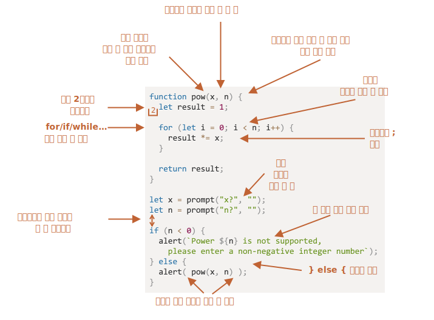

코딩 스타일
====

### 문법



<br />

 **절대 규칙 無**

##### 취사선택
- 취향 · 선호도 따라 규칙 선택

<br />

#### `{…}` <sub>(중괄호)</sub>

##### `{` <sub>(여는 중괄호)</sub>
- 보통 Egyptian 스타일 사용
  - 상응 키워드 동일 줄 위치 <sub>(새 줄 X)</sub>
- 공백 1개 앞쪽 위치
```javascript
// if (문) 동일 줄 위치
//          ↓ (공백 1개)
if (…조건문…) {
  …본문…
}
```
```javascript
// 지양 (`{…}` 중괄호 불필요)
if (n < 0) {`Power ${n} is not supported`;}

// 지양 (새 코드 줄 추가 시 에러)
if (n < 0)
  `Power ${n} is not supported`;

// 간결 (짧은 코드 유용)
if (n < 0) `Power ${n} is not supported`;

// 권장 (가독성 ↑)
if (n < 0) {
  `Power ${n} is not supported`;
}
```

#### 가로 길이

##### 긴 가로 길이 → 다수 줄 분리
- 문자열
  - `` ` `` <sub>(역따옴표 · 백틱)</sub> 사용
```javascript
let str = `
  ECMA International's TC39 is a group of JavaScript developers,
  implementers, academics, and more, collaborating with the community
  to maintain and evolve the definition of JavaScript.
`;
```
- `if (…)` <sub>(괄호)</sub> 내 조건문
  - 줄 바꿈
```javascript
// 연산자
// - 다수 줄 분리
if (
  id === 123 &&
  moonPhase === 'Waning Gibbous' &&
  zodiacSign === 'Libra'
) {
  letTheSorceryBegin();
}
```

##### 최대 가로 길이 <sub>(팀원 합의 권장)</sub>
- 보통 80 · 120자

#### 들여쓰기

##### 가로 들여쓰기
- 스페이스 2 · 4개 사용
- 탭 대신 스페이스 권장
  - 들여쓰기 정도 유연하게 변경 가능
```javascript
// 들여쓰기 (스페이스 5개)
// - 인수 위치 정렬
show(parameters,
     aligned,
     one,
     after,
     another
  ) {
  …
}
```

##### 세로 들여쓰기
- 코드 <sub>(논리 블록)</sub> 분리 <sub>(새)</sub> 줄
  - 가독성 ↑
```javascript
function pow(x, n) {
  let result = 1; // 변수 선언
  //               ←
  for (let i = 0; i < n; i++) { // 반복문
    result *= x;
  }
  //               ←
  return result;  // return (문)
}
```

#### `;` <sub>(세미콜론)</sub>

##### 모든 구문 끝 항상 추가 권장
- JS 내 일부 예외 경우 자동 삽입 미발생
  - 줄 바꿈 ≠ `;` <sub>(세미콜론)</sub> 해석
  - 에러 발생률 ↑

#### 중첩 레벨

##### 깊은 중첩문 가능한 지양
- 반복문 내 중첩문 깊이 ↑
  - `continue` <sub>(지시자)</sub> 사용 고려

##### `if` <sub>(문)</sub> 조건 처리
```javascript
for (let i = 0; i < 10; i++) {
  if (cond) {
    …코드… // 중첩 레벨 ↑
  }
}

↓↓↓

for (let i = 0; i < 10; i++) {
  if (!cond) {
    continue;
  }

  …코드…   // 중첩 레벨 유지
}
```

##### `if…else` · `return` <sub>(문)</sub> 조합
- 중첩 레벨 증가 방지
- 코드 가독성 ↑
```javascript
function pow(x, n) {
  if (n < 0) {
    "'n'은 음수가 될 수 없습니다.";
  } else {
    /* 실제 동작 코드 (중첩 레벨 ↑) */
    let result = 1;

    for (let i = 0; i < n; i++) {
      result *= x;
    }

    return result;
  }
}

↓↓↓

function pow(x, n) {

  // 조건 평가
  // - 불만족 → 함수 종료
  // - 만족   → 주요 코드 흐름 진행
  if (n < 0) {
    "'n'은 음수가 될 수 없습니다.";
    return;
  }

  /* 실제 동작 코드 (중첩 레벨 유지) */
  let result = 1;

  for (let i = 0; i < n; i++) {
    result *= x;
  }

  return result;
}
```

### 함수 위치

##### 헬퍼 함수 코드 구조 정리 <sub>(선언 위치 조정)</sub>
- a. 사용 코드 상단
```javascript
// 함수 선언
function createElement() { … }
function setHandler(elem) { … }
function walkAround() { … }

// 사용 코드
let elem = createElement();
setHandler(elem);
walkAround();
```
- b. 사용 코드 하단 <sub>(선호 방법)</sub>
```javascript
// 사용 코드
let elem = createElement();
setHandler(elem);
walkAround();

// 함수 선언
function createElement() { … }
function setHandler(elem) { … }
function walkAround() { … }
```
- c. 개별 사용 코드 상단 <sub>(각 함수 필요 시 선언)</sub>
```javascript
function createElement() { … }
let elem = createElement();

function setHandler(elem) { … }
setHandler(elem);

function walkAround() { … }
walkAround();
```

##### 보통 2번째 방법 <sub>(사용 코드 하단)</sub> 선호
- 보통 동작 <sub>(정의 X)</sub> 위주 코드 읽기 진행
- 간결 · 명확한 헬퍼 함수명
  - 함수 역할 <sub>(기능)</sub> 쉽게 유추 가능
  - 함수 본문 읽기 불필요

### 스타일 가이드

##### 전반적인 규칙 <sub>(코드 작성 방식)</sub> 기술 문서
- 사용 따옴표 종류
- 들여쓰기 스페이스 개수
- 최대 가로 길이
- 기타 등등

##### 팀원
- 동일 스타일 가이드 사용 · 준수 시
  - 동일한 스타일 코드 유지
- 팀 전용 스타일 가이드 작성 가능
  - 보통 유명 스타일 가이드 선택

##### 유명 스타일 가이드
- [Google JS 스타일 가이드](https://google.github.io/styleguide/jsguide.html)
- [Airbnb JS 스타일 가이드](https://github.com/airbnb/javascript)
- [Idiomatic.JS](https://github.com/rwaldron/idiomatic.js)
- [StandardJS](https://standardjs.com/)
- 기타 등등

### Linter

##### 코딩 스타일 자동 검사 도구
- 스타일 가이드 준수 여부 검사
- 스타일 개선 관련 제안 제공
- 기타 등등

##### 장점
- 버그 <sub>(오타 등)</sub> · 스타일 오류 등 예방
- 유명 에디터 통합 사용 가능 <sub>(플러그인)</sub>

##### 유명 linter
- [JSLint](http://www.jslint.com/) <sub>(역사 오래됨)</sub>
- [JSHint](http://www.jshint.com/) <sub>(유연한 세팅)</sub>
- [ESLint](http://eslint.org/) <sub>(최신)</sub>

<br />

요약
====

##### 챕터 내 문법 규칙 · 스타일 가이드 목적
- 코드 가독성 ↑

##### 코딩 스타일 선택 기준
- 가독성 · 이해도 ↑
- 에러 방지 용이

##### 유명 스타일 가이드
- 코딩 스타일 트렌드 확인 가능
- 모범 사례 최신 정보 제공

<br />

##  과제

### 지양 코딩 스타일

##### 부적절한 코딩 스타일 부분 지적 · 수정
```javascript
function pow(x,n)
{
  let result=1;
  for (let i=0;i<n;i++) {result*=x;}
  return result;
}

let x=prompt("x?",''), n=prompt("n?",'')
if (n<=0)
{
  `Power ${n} is not supported, please enter an integer number greater than zero`;
}
else
{
  pow(x,n)
}
```

<br />


##### 지적
```javascript
// 인수 사이 공백 無
function pow(x,n)

// `{` (여는 중괄호) 별도 줄 위치
{

  // `=` (할당 연산자) 전 · 후 공백 無
  let result=1;

  // `=` · `<` (할당 · 비교 연산자) 전 · 후 공백 無
  // '{…}' (코드 블록) 내 코드 새 줄 위치 X
  for (let i=0;i<n;i++) {result*=x;}
  return result;
}

// 두 줄 작성 권장
// 연산자 전 · 후 공백 無
// 문장 끝 `;` (세미콜론) 無 (추가 권장)
let x=prompt("x?",''), n=prompt("n?",'')
// 연산자 전 · 후 공백 無
// 세로 들여쓰기 (상단 새 줄 추가) 권장 (논리 블록 분리)
if (n<=0)

// `{` (여는 중괄호) 별도 줄 위치
{

  // 긴 가로 길이 → 다수 줄 분리
  `Power ${n} is not supported, please enter an integer number greater than zero`;
}

// else (절) · `{…}` (중괄호) 한 줄 작성 권장
// - } else {
else
{

  // 인수 사이 공백 無 · `;` (세미콜론) 無 (추가 권장)
  pow(x,n)
}
```

##### 수정
```javascript
function pow(x, n) {
  let result = 1;

  for (let i = 0; i < n; i++) {
    result *= x;
  }

  return result;
}

let x = prompt("x?", "");
let n = prompt("n?", "");

if (n <= 0) {
  `Power ${n} is not supported,
   please enter an integer number greater than zero`;
} else {
  pow(x, n);
}
```
