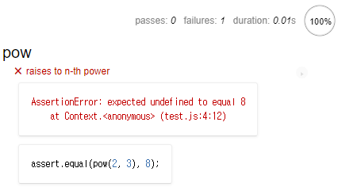
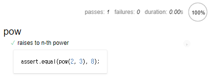
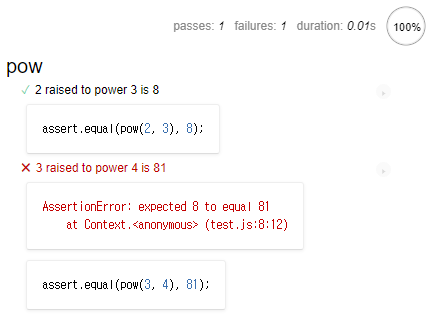
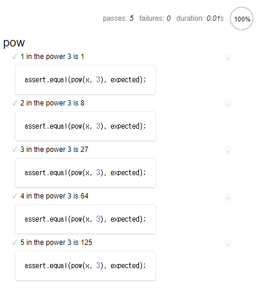
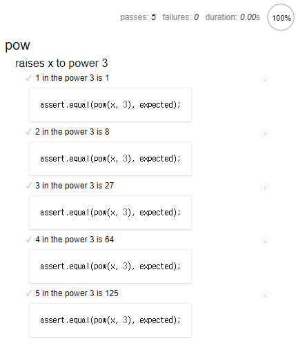
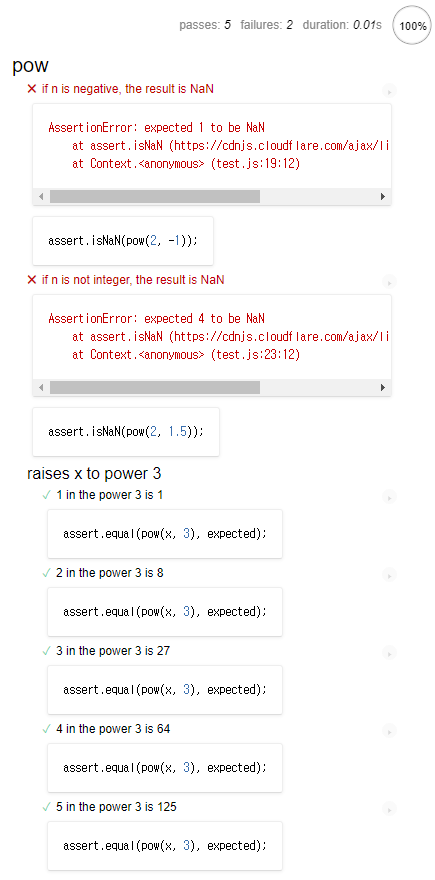

테스트 자동화 · `Mocha`
====

### 테스트 이유

#### 함수 1개 작성 가정

##### 함수 코드 구상
- 보통 매개변수 · 결과 관계 중심

##### 개발 중 기능 구현 상태 확인
- 실제 실행 결과 · 기대 결과 계속 비교
  - 콘솔 창 등 이용
- 실제 실행 결과 ≠ 기대 결과
  - 코드 수정 후 재실행 후 결과 비교
    - 기능 완성 때까지 과정 반복

#### 상당히 불완전한 '수동' 재실행 <sub>(실수 확률 ↑)</sub>

##### `f` <sub>(함수)</sub> 구현 과정
1. 코드 작성
2. `f(1)` 테스트
   - 정상 동작
3. `f(2)` 테스트
   - 비장상 동작
4. 코드 수정 후 `f(2)` 다시 테스트
   - 정상 동작
5. `f(3)` 테스트
   - …
   - `f(1)` 정상 동작 ?

##### 개발 시 보통 수많은 사용 사례 고려
- 코드 변경 시 모든 사용 사례 상기 불가능
  - 하나 수정 → 타 문제 발생

##### 테스트 코드 <sub>(테스팅 자동화)</sub>
- 실제 동작 관여 코드 별개 작성 필요
- 다양한 조건 하 기능 실행 가능
  - 실행 결과 · 기대 결과 비교

### [Behavior Driven Development](https://en.wikipedia.org/wiki/Behavior-driven_development) <sub>(BBD)</sub>

##### 3가지 결합
- 테스트 <sub>(test)</sub>
- 문서 <sub>(documentation)</sub>
- 예시 <sub>(example)</sub>

### 거듭제곱 함수 · 명세서 <sub>(예시)</sub>

##### `pow(x, n)` <sub>(함수)</sub> 구현 가정
- `x` 를 `n` 번 곱하기
- `n` 조건
  - 자연수
  - 0 이상

##### 본격적 코드 작성 전 할 일
- 코드 동작 상상 후 자연어 표현
  - 명세서 · 스펙 <sub>(spec[ification])</sub>
    - 사용 사례 상세 설명 · 테스트
```javascript
describe("pow", function() {

  it("주어진 숫자의 n 제곱", function() {
    assert.equal(pow(2, 3), 8);
  });

});
```

#### 스펙 주요 구성 요소 <sub>(3가지)</sub>

##### 1. `describe("title", function() { … })`
- 구현 기능 설명
  - `pow` <sub>(함수)</sub> 동작 설명
- `it` 블록 모으기

##### 2. `it("사용 사례 설명", function() { … })`
- 1번째 인수
  - 특정 사용 사례 설명 <sub>(자연어 작성)</sub>
- 2번째 인수
  - 사용 사례 테스트 함수

##### 3. `assert.equal(value1, value2)`
- 인수끼리 동등 비교
- 상이 판단 시
  - 에러 반환

##### `assert.[*]` <sub>(함수)</sub>
- 동작 테스트 실행

##### 명세서 : 실행 가능
- 실행 시
  - `it` 블록 내 테스트 실행

### 개발 순서
1. 명세서 초안 작성
    - 기본적인 테스트 포함
2. 명세서 초안대로 코드 작성
3. 코드 작동 확인 <sub>(명세서 실행)</sub>
    - 테스트 프레임워크 사용
      - [Mocha](https://mochajs.org)
      - 기타 등등
    - 코드 문제 존재 시
      - 에러 출력
    - 에러 미출력 때까지 코드 수정
4. 모든 테스트 통과
    - 코드 초안 완성
5. 명세서 : 미고려 사용 사례 추가
    - 테스트 실패 발생
6. 모든 테스트 통과 때까지 코드 수정
    - → 3단계로 롤백
7. 기능 완성 때까지 3 ~ 6단계 반복

##### 반복적인 <sub>(iterative)</sub> 성격
- 명세서 작성 · 실행 · 테스트
- 모든 테스트 통과 때까지 반복

##### `pow` <sub>(함수)</sub> 스펙 초안
- 위에서 작성 완료 <sub>(1단계 완료)</sub>

### 스펙 실행하기

#### 테스트 라이브러리 <sub>(3가지)</sub>

##### [Mocha](https://mochajs.org/) <sub>(핵심 프레임워크)</sub>
- 테스팅 · 실행 관련 주요 함수 제공
  - `describe`
  - `it`
  - 기타 등등

##### [Chai](https://www.chaijs.com/)
- 다양한 assertion 제공
  - `assert.equal`
  - 기타 등등

##### [Sinon](https://sinonjs.org/)
- 함수 정보 획득
  - 내장 함수 등 모방

##### 공통점
- 모든 실행 환경 내 사용 가능

##### `pow` <sub>(함수)</sub> 스펙 · 라이브러리
```html
<!DOCTYPE html>
<html>

<head>
  <!-- mocha.css (결과 출력에 사용) -->
  <link rel="stylesheet" href="https://cdnjs.cloudflare.com/ajax/libs/mocha/3.2.0/mocha.css">

  <!-- Mocha 프레임워크 코드 로드 -->
  <script src="https://cdnjs.cloudflare.com/ajax/libs/mocha/3.2.0/mocha.js"></script>
  <script>
    // 기본 설정
    mocha.setup('bdd');
  </script>

  <!-- chai 프레임워크 코드 로드 -->
  <script src="https://cdnjs.cloudflare.com/ajax/libs/chai/3.5.0/chai.js"></script>
  <script>
    // assert 전역 선언
    // - chai 기능 중 하나
    let assert = chai.assert;
  </script>
</head>

<body>
  <script>
    function pow(x, n) {
      /* 코드 작성 */
    }
  </script>

  <!--
  테스트 스크립트 로드
  - describe
  - it
  - 기타 등등
  -->
  <script src="test.js"></script>

  <!-- 테스트 결과 출력 요소 -->
  <div id="mocha"></div>

  <!-- 테스트 실행 -->
  <script>
    mocha.run();
  </script>
</body>

</html>
```
1. `<head>`
    - 서드파티 라이브러리 · 스타일 로드
      - 테스트에 필요
2. `<script>`
    - 테스트 대상 함수 <sub>(`pow`)</sub> 코드
3. 테스트 <sub>(외부 스크립트 (`test.js`) 에서 로드)</sub>
    - `describe("pow", ...)`
4. `<div id="mocha">` <sub>(HTML 요소)</sub>
    - Mocha 실행 결과 출력
5. `mocha.run()`
    - 테스트 실행 명령어

##### 결과



##### 현재 `pow` <sub>(함수)</sub> 본문 X
- `pow(2,3)`
  - `undefined` 반환
    - 테스트 실패

##### 고수준 테스트 러너 <sub>([karma](https://karma-runner.github.io/latest/index.html) 등)</sub>
- 다양한 종류의 테스트 자동 실행

### 코드 초안

##### 오로지 테스트 통과 목적
```javascript
function pow(x, n) {
  return 8;
}
```

##### 스펙 실행
- 에러 X



### 스펙 개선하기

##### 현재 초안
- 틀린 실행 결과 · 테스트 통과
  - 실무에서 빈번히 발생
- 사용 사례 추가
  - `pow(3, 4) = 81` 테스트

#### 스펙 내 테스트 추가 방법

##### 1. `assert` 하나 더 추가 <sub>(기존 `it` 블록)</sub>
- `assert` 내 에러 발생 시
  - `it` 블록 즉시 종료
- 1번째 `assert` 실패 시
  - 2번째 `assert` 실행 · 결과 확인 X
```javascript
describe("pow", function() {

  it("주어진 숫자의 n 제곱", function() {
    assert.equal(pow(2, 3), 8);
    assert.equal(pow(3, 4), 81);
  });

});
```

##### 2. 테스트 <sub>(`it` 블록)</sub> 하나 더 추가
- 더 많은 정보 얻기 가능
- 권장 방법
```javascript
describe("pow", function() {

  it("2를 세 번 곱하면 8입니다.", function() {
    assert.equal(pow(2, 3), 8);
  });

  it("3을 네 번 곱하면 81입니다.", function() {
    assert.equal(pow(3, 4), 81);
  });

});
```

##### 테스트 규칙 권장
- 테스트 하나
  - 한 가지만 확인
- 한 테스트 내 연관 없는 사항 2개
  - 분리

##### 테스트 추가 <sub>(2번째 방법)</sub> 결과



##### 추가한 테스트 실패
- 함수 반환 기댓값 : `81`
  - 함수 반환 값 : `8`

### 코드 개선하기
- 2번째 테스트 통과 목적
```javascript
function pow(x, n) {
  let result = 1;

  for (let i = 0; i < n; i++) {
    result *= x;
  }

  return result;
}
```

##### 더 많은 값 테스트
- `for` <sub>(반복문)</sub>
  - `it` 블록 자동 생성
```javascript
describe("pow", function() {

  function makeTest(x) {
    let expected = x * x * x;
    it(`${x}을/를 세 번 곱하면 ${expected}입니다.`, function() {
      assert.equal(pow(x, 3), expected);
    });
  }

  for (let x = 1; x <= 5; x++) {
    makeTest(x);
  }

});
```

##### 결과



### 중첩 `describe`
- 그룹 형성

##### 중첩 `describe` 내 헬퍼 함수 · 반복문
- `makeTest` <sub>(헬퍼 함수)</sub>
  - `for` <sub>(반복문)</sub> 에서만 사용
- 함께 `pow` <sub>(함수)</sub> 동작 확인
```javascript
describe("pow", function() {

  describe("x를 세 번 곱합니다.", function() {

    function makeTest(x) {
      let expected = x * x * x;
      it(`${x}을/를 세 번 곱하면 ${expected}입니다.`, function() {
        assert.equal(pow(x, 3), expected);
      });
    }

    for (let x = 1; x <= 5; x++) {
      makeTest(x);
    }

  });

  // describe · it
  // - 더 많은 테스트 추가 가능
});
```

##### 새 테스트 '하위 그룹' 정의
- 새로 정의된 테스트 하위 그룹
  - 들여쓰기 적용 상태 출력



##### 이후 최상위 레벨
- `describe` · `it` <sub>(자체 헬퍼 함수 有)</sub> 추가 시
  - 자체 헬퍼 함수
    - `makeTest` <sub>(헬퍼 함수)</sub> 접근 X

<br />

 **`before` · `after` · `[before·after]Each`**

##### 용도
- 보통 초기화 용도
  - 카운터 변수 : `0` 설정
  - 테스트 · 그룹 교체 시 필요 작업 실행

##### 함수 실행 시점
- `before`
  - (전체) 테스트 시작 전
- `after`
  - (전체) 테스트 종료 후
- `[before·after]Each`
  - 매 `it` 시직 전 · 종료 후
```javascript
describe("test", function() {

  before(() => alert("테스트 시작 (테스트 시작 전)"));
  after( () => alert("테스트 종료 (테스트 종료 후)"));

  beforeEach(() => alert("단일 테스트 시작 (각 테스트 시작 전)"));
  afterEach( () => alert("단일 테스트 종료 (각 테스트 종료 후)"));

  it('test 1', () => alert(1));
  it('test 2', () => alert(2));

});
```

##### 실행 순서
```javascript
테스트 시작 (테스트 시작)          // before
단일 테스트 시작 (각 테스트 시작 전) // beforeEach
1
단일 테스트 종료 (각 테스트 종료 후) // afterEach
단일 테스트 시작 (각 테스트 시작 전) // beforeEach
2
단일 테스트 종료 (각 테스트 종료 후) // afterEach
테스트 종료 (테스트 종료 후)       // after
```
- [코드](https://plnkr.co/edit/7qRYvAeAPcW1qm9A?p=preview)

<br />

### 스펙 확장하기

##### 1번째 반복
- `pow` <sub>(함수)</sub> 기본 기능 구현
- 또 다른 반복
  - 기능 개선

##### `n` <sub>(함수 매개변수)</sub>
- 조건
  - 양의 정수
  - 부적합 시
    - `NaN` 반환 필요
- JS 수학 관련 연산 중 에러
  - `NaN` 반환

##### 테스트 추가
- `n` <sub>(매개변수)</sub> 조건 부적합 시
  - `NaN` 반환 여부 검사
```javascript
describe("pow", function() {
  …

  it("n이 음수일 때 결과는 NaN입니다.", function() {
    assert.isNaN(pow(2, -1));
  });

  it("n이 정수가 아닐 때 결과는 NaN입니다.", function() {
    assert.isNaN(pow(2, 1.5));
  });

});
```

##### 결과



##### 기존 함수
- `n` : 음수 · 정수 아닌 경우 상정 X
  - 새 추가 테스트
    - 반드시 실패

##### BDD 핵심
1. 실패할 수밖에 없는 테스트 추가
2. 코드 개선
    - 테스트 통과할 수 있게
    - 에러 발생하지 않게

<br />

 **다양한 assertion**

##### [Chai](https://www.chaijs.com/) <sub>(라이브러리)</sub>
- 다양한 assertion 지원

##### 지원 목록 일부 <sub>(확인 기능)</sub>
- `assert.isNaN`
  - `NaN` 여부
- `assert.equal(value1, value2)`
  - `value1 == value2`
- `assert.strictEqual(value1, value2)`
  - `value1 === value2`
- `assert.not(strict)equal`
  - `!= · !==`
- `assert.isTrue(value)`
  - `value === true`
- `assert.isFalse(value)`
  - `value === false`
- 이 외 다양한 assertion
  - [docs](https://www.chaijs.com/api/assert/)

<br />

##### 함수 내 코드 추가
- 새 추가 테스트 통과 목적
```javascript
function pow(x, n) {
  if (n < 0) return NaN;
  if (Math.round(n) != n) return NaN;

  let result = 1;

  for (let i = 0; i < n; i++) {
    result *= x;
  }

  return result;
}
```
- 에러 없이 모든 테스트 모두 통과
- [문제 풀기](https://plnkr.co/edit/UvezyTK4eJJpVwN7?p=preview)

<br />

요약
====

##### BBD <sub>(Behavior Driven Development)</sub>
- 스펙 먼저 작성 후 구현 시작
- 구현 종료 시점
  - 스펙 · 코드 둘 다 확보

##### 스펙 용도 <sub>(3가지)</sub>
1. 테스트
    - 함수의 의도한 동작 수행 보장
2. 문서
    - 함수 동작 수행 설명
    - `describe` · `it` 포함
3. 예시
    - 함수 사용법 설명
      - 실제 동작 예시 이용

##### 스펙 역할
- 안전하게 함수 개선 · 변경
- 함수 처음부터 재작성 시
  - 기존 코드 동일 동작 보장 가능

##### 대규모 프로젝트
- 코드 수정 시
  - 기존 구현 기능 영향 방지 중요
- 함수 하나
  - 이곳저곳 사용
- 수동 변경 함수
  - 함수 사용하는 모든 곳
    - 정상 동작 확인 불가능

##### 테스트 없이 코드 작성 시
1. 아무 대책 없이 코드 변경
    - 부작용 고려 X
      - 어디선가 버그 발생
2. 수정 · 개선 기피
    - 가혹한 버그 대가
    - 구식 코드 개선 X

##### 테스팅 자동화
- 코드 변화 발생 시
  - 스펙 실행해 테스트 진행
    - 몇 초 만에 에러 여부 확인

#### 잘 테스트 된 코드 == 더 나은 아키텍처

##### 테스트 작성 시
- 먼저 정의 후 구현
  - 함수 동작
  - 입출력값
- 코드
  - 정의된 사항 뒷받침 할 수 있게 작성
- 구현 시작 단계
  - 이미 좋은 아키텍처 보장

##### 매번 이런 절차 따라 구현 : 쉽지 않음
- 함수 동작 방식 확신 없는 상황
  - 코드 작성하기도 전 스펙 작성
- 테스트 작성
  - 개발 속도 ↑
  - 코드 안정성 ↑

<br />

##  과제

### 잘못된 점 찾기

##### `pow` <sub>(함수)</sub> 테스트 코드
- 잘못된 점 찾기
```javascript
it("주어진 숫자의 n 제곱", function() {
  let x = 5;

  let result = x;
  assert.equal(pow(x, 1), result);

  result *= x;
  assert.equal(pow(x, 2), result);

  result *= x;
  assert.equal(pow(x, 3), result);
});
```

##### 참고
- 문법 오류 X
- 모든 테스트
  - 문제없이 통과

<br />


##### `assert` 3개 · 테스트 함수 1개
- 당장은 쉽게 테스트 진행
- 에러 발생 시
  - 원인 찾기 어려움

##### 실행 흐름 복잡한 경우 에러
- 에러 유발 입력값 일일이 확인
  - 테스트 코드를 디버깅

##### 권장 테스트 작성법
- 명확한 입출력값 <sub>(변수 X)</sub>
- 다수 `it` 블록
```javascript
describe("주어진 숫자의 n 제곱", function() {
  it("5를 1 제곱하면 5", function() {
    assert.equal(pow(5, 1), 5);
  });

  it("5를 2 제곱하면 25", function() {
    assert.equal(pow(5, 2), 25);
  });

  it("5를 3 제곱하면 125", function() {
    assert.equal(pow(5, 3), 125);
  });
});
```

##### 다수 `it` 블록으로 쪼개기
- 에러 발생 시
  - 입력값 파악 용이
- `it.only`
  - 원하는 테스트만 실행
```javascript
describe("주어진 숫자의 n 제곱", function() {
  it("5를 1 제곱하면 5", function() {
    assert.equal(pow(5, 1), 5);
  });

  // 해당 블록만 실행
  it.only("5를 2 제곱하면 25", function() {
    assert.equal(pow(5, 2), 25);
  });

  it("5를 3 제곱하면 125", function() {
    assert.equal(pow(5, 3), 125);
  });
});
```
