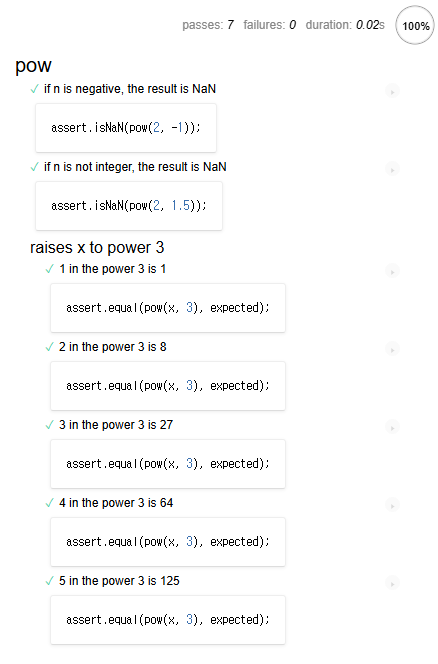

테스트 자동화 · `Mocha`
====

### 테스트 이유

#### 함수 1개 작성 가정

##### 함수 코드 구상
- 보통 매개변수 · 결과 관계 중심

##### 개발 중 기능 구현 상태 확인
- 실제 실행 결과 · 기대 결과 계속 비교
  - 콘솔 창 등 이용
- 실제 실행 결과 ≠ 기대 결과
  - 코드 수정 후 재실행 후 결과 비교
    - 기능 완성 때까지 과정 반복

#### 상당히 불완전한 '수동' 재실행 <sub>(실수 확률 ↑)</sub>

##### `f` <sub>(함수)</sub> 구현 과정
1. 코드 작성
2. `f(1)` 테스트
   - 정상 동작
3. `f(2)` 테스트
   - 비장상 동작
4. 코드 수정 후 `f(2)` 다시 테스트
   - 정상 동작
5. `f(3)` 테스트
   - …
   - `f(1)` 정상 동작 ?

##### 개발 시 보통 수많은 사용 사례 고려
- 코드 변경 시 모든 사용 사례 상기 불가능
  - 하나 수정 → 타 문제 발생

##### 테스트 코드 <sub>(테스팅 자동화)</sub>
- 실제 동작 관여 코드 별개 작성 필요
- 다양한 조건 하 기능 실행 가능
  - 실행 결과 · 기대 결과 비교

### [BBD](https://en.wikipedia.org/wiki/Behavior-driven_development) <sub>(Behavior Driven Development)</sub>

##### 3가지 결합 개념
- 테스트 <sub>(test)</sub>
- 문서 <sub>(documentation)</sub>
- 예시 <sub>(example)</sub>

### 거듭제곱 함수 · 명세서

##### `pow(x, n)` <sub>(함수)</sub> 구현 가정
- x<sup>n</sup> 연산 수행
- `n` 조건
  - 자연수
  - 0 이상

##### 명세서 · 명세서 <sub>(BBD 용어)</sub> 작성 <sub>(본격적인 코드 작성 전)</sub>
- 코드 동작 상상 후 자연어 표현
  - 사용 사례 상세 설명 · 테스트 기술
```javascript
// 개념적인 코드 동작 설명 (자연어)
describe("pow", function() {

  it("주어진 숫자의 n 거듭제곱", function() {
    assert.equal(pow(2, 3), 8);
  });

});
```

#### 명세서 주요 구성 요소 <sub>(3가지)</sub>

##### a. `describe(title, function() {…})`
- `title`
  - 구현 기능 설명 <sub>(`pow` 함수 동작 설명 등)</sub>
- `function() {…}`
  - `it{…}` <sub>(블록)</sub> 그룹

##### b. `it(useCase, function() {…})`
- `useCase`
  - 특정 사용 사례 설명 <sub>(자연어 작성)</sub>
- `function() {…}`
  - 사용 사례 테스트 함수

##### c. `assert.equal(…, …)`
- 인수 동등 비교 수행
  - 상이 시 에러 반환

##### 실행 가능한 명세서
- 명세서 실행 → `it{…}` <sub>(블록)</sub> 내 테스트 실행

### 개발 순서

##### 실제 개발 착수 시 진행 순서
1. 명세서 초안 작성 <sub>(기본적인 테스트 포함)</sub>
2. 코드 작성 <sub>(명세서 초안 기준)</sub>
3. 명세서 실행 <sub>(코드 작동 확인)</sub>
   - 테스트 프레임워크 <sub>([Mocha](https://mochajs.org) 등)</sub> 사용
   - 잘못 작성된 코드 → 에러 출력
     - 코드 계속 수정
4. 모든 테스트 통과
   - 코드 초안 완성
5. 명세서 내 미고려 사용 사례 추가
   - 테스트 실패
6. ③ ~ ⑥ 반복 <sub>(기능 완성 때까지)</sub>

##### 반복적인 성질 有
- 명세서 작성 · 실행 · 테스트
  - 모든 테스트 통과 때까지 반복
- 반복 결과
  - 완전 동작 코드
  - 테스트 코드

### 명세서 실행

##### 테스트 라이브러리 <sub>(3가지)</sub>
- [Mocha](https://mochajs.org/) <sub>(핵심)</sub>
  - 테스트 관련 주요 함수 제공
    - `describe`
    - `it`
    - 기타 등등
- [Chai](https://www.chaijs.com/)
  - 다양한 assertion 제공
    - `assert.equal`
    - 기타 등등
- [Sinon](https://sinonjs.org/)
  - 함수 정보 획득 <sub>(내장 함수 등 모방)</sub>

##### 공통점
- 모든 실행 환경 내 사용 가능
  - 브라우저
  - Node.js
  - 기타 등등

##### `pow` <sub>(함수)</sub> 명세서 · 테스트 라이브러리 <sub>(HTML 페이지)</sub>
```html
<!DOCTYPE html>
<html>

<head>
  <!-- mocha.css (결과 출력 시 사용) -->
  <link rel="stylesheet" href="https://cdnjs.cloudflare.com/ajax/libs/mocha/3.2.0/mocha.css">

  <!-- Mocha (프레임워크) 코드 로드 -->
  <script src="https://cdnjs.cloudflare.com/ajax/libs/mocha/3.2.0/mocha.js"></script>
  <script>
    mocha.setup('bdd'); // 기본 설정
  </script>

  <!-- Chai (프레임워크) 코드 로드 -->
  <script src="https://cdnjs.cloudflare.com/ajax/libs/chai/3.5.0/chai.js"></script>
  <script>
    // assert 전역 선언
    let assert = chai.assert;
  </script>
</head>

<body>
  <script>
    function pow(x, n) {
      /* 함수 코드 작성 */
    }
  </script>

  <!-- 테스트 스크립트 로드 (describe · it 등) -->
  <script src="test.js"></script>

  <!-- 테스트 결과 출력 요소 -->
  <div id="mocha"></div>

  <!-- 테스트 실행 -->
  <script>
    mocha.run();
  </script>
</body>

</html>
```

##### 구분
- `<head>` <sub>(테스트 자원 로드)</sub>
  - 서드파티 라이브러리
  - 스타일
- `<script>`
  - 테스트 대상 함수 <sub>(`pow`)</sub> 코드
- 테스트 코드 <sub>(외부 스크립트 로드)</sub>
  - `describe("pow", …)`
- `<div id="mocha">` <sub>(HTML 요소)</sub>
  - Mocha <sub>(라이브러리)</sub> 실행 결과 출력
- `mocha.run()`
  - 테스트 실행 명령어

##### 결과


##### 현재 `pow` <sub>(함수)</sub> 본문 미작성 → 테스트 실패
- `pow(2, 3)` → `undefined` 반환 <sub>(에러)</sub>

##### 고수준 테스트 실행 도구 <sub>([karma](https://karma-runner.github.io/latest/index.html) 등)</sub>
- 다양한 테스트 자동 실행 가능

### 코드 초안

##### 간단한 코드 작성
- 단순 테스트 통과 목적
```javascript
function pow(x, n) {
  return 8;
}
```

##### 결과 <sub>(명세서 정상 실행 · 에러 X)</sub>


### 명세서 개선

##### 현재 초안
- 불완전한 상태
- 다수 사용 사례 추가 필요
  - ex\) `pow(3, 4) = 81` 테스트

#### 명세서 내 테스트 추가 방법 <sub>(2가지)</sub>

##### a. `assert` 추가 <sub>(기존 `it{…}` 블록)</sub>
- `assert` 내 에러 발생 시
  - `it{…}` <sub>(블록)</sub> 즉시 종료
- 1번째 `assert` 실패 시
  - 2번째 `assert` 미실행 <sub>(결과 확인 불가능)</sub>
```javascript
describe("pow", function() {

  it("주어진 숫자의 n 거듭제곱", function() {
    assert.equal(pow(2, 3), 8);
    assert.equal(pow(3, 4), 81); // 추가분
  });

});
```

##### b. 테스트 <sub>(새 `it{…}` 블록)</sub> 추가 <sub>(권장)</sub>
- 테스트 분리 작성
  - 더 많은 정보 접근 가능
```javascript
describe("pow", function() {

  it("2를 세 번 곱하면 8입니다.", function() {
    assert.equal(pow(2, 3), 8);
  });

  // 추가분
  it("3을 네 번 곱하면 81입니다.", function() {
    assert.equal(pow(3, 4), 81);
  });

});
```

##### 권장 테스트 규칙
- 한 테스트 내
  - 한 가지만 확인
  - 무관한 사항 2개 점검 시 분리

##### 테스트 추가 <sub>(2번째 방법)</sub> 결과


##### 추가한 테스트 실패
- 함수 반환 기댓값
  - `81`
- 함수 반환 값
  - `8` <sub>(항상)</sub>

### 코드 개선

##### 개선된 코드 작성
- 실제 기능 구현 코드 작성
```javascript
function pow(x, n) {
  let result = 1;

  for (let i = 0; i < n; i++) {
    result *= x;
  }

  return result;
}
```

##### 다수 값 테스트 추가
- `for` <sub>(반복문)</sub> 사용
  - `it{…}` <sub>(블록)</sub> 자동 생성
```javascript
describe("pow", function() {

  // 헬퍼 함수
  function makeTest(x) {
    let expected = x * x * x;

    it(`${x}을/를 세 번 곱하면 ${expected}입니다.`, function() {
      assert.equal(pow(x, 3), expected);
    });
  }

  // 반복문
  for (let x = 1; x <= 5; x++) {
    makeTest(x);
  }

});
```

##### 결과


### 중첩 `describe` <sub>(그룹화)</sub>

##### 중첩 `describe` 내 헬퍼 함수 · 반복문 <sub>(그룹화)</sub>
- `makeTest` <sub>(헬퍼 함수)</sub>
  - 하단 `for` <sub>(반복문)</sub> 에서만 사용
```javascript
describe("pow", function() {

  // 그룹화 (함수 · 반복문)
  describe("x를 세 번 곱합니다.", function() {

    // 헬퍼 함수
    function makeTest(x) {
      let expected = x * x * x;

      it(`${x}을/를 세 번 곱하면 ${expected}입니다.`, function() {
        assert.equal(pow(x, 3), expected);
      });
    }

    // 반복문
    for (let x = 1; x <= 5; x++) {
      makeTest(x);
    }

  });

  // 다수 테스트 추가 가능 (describe · it)
});
```

##### 새 테스트 '하위 그룹' 정의
- 출력 시 들여쓰기 적용


##### 차후 최상위 레벨 내 `describe` · `it` 추가 시
- 내부 자체 헬퍼 함수
  - `makeTest` <sub>(헬퍼 함수)</sub> 접근 불가능

<br />

 **생명주기 함수**

##### 종류
- `before`
- `after`
- `beforeEach`
- `afterEach`

##### 함수 실행 시점
- `before` · `after`
  - 전체 테스트 시작 전 · 종료 후
- `[before·after]Each`
  - 개별 `it` 시직 전 · 종료 후
```javascript
describe("test", function() {

  before(() => "전체 테스트 시작 (본 테스트 시작 전)");
  after( () => "전체 테스트 종료 (본 테스트 종료 후)");

  beforeEach(() => "단일 테스트 시작 (각 테스트 시작 전)");
  afterEach( () => "단일 테스트 종료 (각 테스트 종료 후)");

  it('test 1', () => 1);
  it('test 2', () => 2);

});
```

##### 실행 순서
```javascript
전체 테스트 시작 (본 테스트 시작)    // before
단일 테스트 시작 (각 테스트 시작 전) // beforeEach
1
단일 테스트 종료 (각 테스트 종료 후) // afterEach
단일 테스트 시작 (각 테스트 시작 전) // beforeEach
2
단일 테스트 종료 (각 테스트 종료 후) // afterEach
전체 테스트 종료 (본 테스트 종료 후) // after
```

##### 용도
- 보통 초기화 시 사용
  - 카운터 변수 초기화 <sub>(`0`)</sub>
  - 테스트 <sub>(그룹)</sub> 준비 작업 실행

<br />

### 명세서 확장

##### `n` <sub>(2번째 매개변수)</sub>
- 양의 정수 요구
- 이 외 값 전달 시
  - `NaN` <sub>(수학 관련 연산 에러)</sub> 반환 필요

##### 테스트 추가
- `n` <sub>(2번째 매개변수)</sub> 조건 부적합 시
  - `NaN` 반환 여부 검사
```javascript
describe("pow", function() {

  …
  it("n이 음수일 때 결과는 NaN입니다.", function() {
    assert.isNaN(pow(2, -1));
  });

  it("n이 정수가 아닐 때 결과는 NaN입니다.", function() {
    assert.isNaN(pow(2, 1.5));
  });

});
```

##### 결과


##### 기존 코드 내 `n` <sub>(2번째 매개변수)</sub>
- 양의 정수 외 값 전달 상정 X
  - 새 추가 테스트 실패

##### BDD 핵심
1. 실패할 수밖에 없는 테스트 추가
2. 코드 개선
   - 테스트 통과 <sub>(에러 無)</sub> 목표

<br />

 **다양한 assertion**

##### [Chai](https://www.chaijs.com/) <sub>(라이브러리)</sub>
- 다양한 assertion 지원

##### [지원 목록](https://www.chaijs.com/api/assert/) 일부
- `assert.isNaN`
  - `NaN` 여부
- `assert.[strict]equal`
  - 동등 · 일치 <sub>(`== · ===`)</sub> 여부
- `assert.not[strict]equal`
  - 부등 · 불일치 <sub>(`!= · !==`)</sub> 여부
- `assert.isTrue`
  - `true` 일치 <sub>(`===`)</sub> 여부
- `assert.isFalse`
  - `false` 일치 <sub>(`===`)</sub> 여부
- 기타 등등

<br />

##### 함수 내 코드 추가
- `n` <sub>(2번째 매개변수)</sub> 조건 부적합 시 `NaN` 반환
  - 새 추가 테스트 통과 목표
```javascript
function pow(x, n) {
  if (n < 0) {              // 음수
    return NaN;
  }

  if (Math.round(n) != n) { // 유리수
    return NaN;
  }

  let result = 1;

  for (let i = 0; i < n; i++) {
    result *= x;
  }

  return result;
}
```

##### 결과 <sub>(모든 테스트 통과)</sub>



<br />

요약
====

##### BBD <sub>(Behavior Driven Development)</sub>
- 명세서 먼저 작성 후 구현 시작
- 구현 종료 시점
  - 명세서 · 코드 확보

##### 명세서 용도 <sub>(3가지)</sub>
- a. 테스트
  - 함수 동작 정상 수행 보장
- b. 문서
  - 함수 동작 설명 <sub>(`describe` · `it`)</sub>
- c. 예시
  - 함수 사용법 설명 <sub>(실제 동작 예시 이용)</sub>

##### 명세서 장점
- 안전한 함수 수정 · 개선 가능
- 함수 재작성 시 동일 동작 보장

##### 코드 수정 시 기존 기능 영향 차단 중요 <sub>(특히 대규모 프로젝트)</sub>
- 프로젝트 규모 ↑
  - 함수 1개 다수 위치 사용
- 함수 수정 시
  - 모든 함수 사용 위치 테스트 불가능

##### 테스트 없는 코드 작성 시 문제점
- a. 아무 대책 없이 코드 변경 <sub>(부작용 고려 X)</sub>
  - 어디선가 버그 발생
- b. 수정 · 개선 기피 <sub>(구식 코드 유지)</sub>

#### 테스팅 자동화 이점

##### a. 빠른 문제 확인
- 코드 변화 발생 시 명세서 실행 <sub>(테스트 진행)</sub>
  - 즉시 에러 발생 여부 확인

##### b. 초기 <sub>(구현 시작)</sub> 단계 좋은 아키텍처 보장
- 테스트 작성 시 구현 전 많은 정보 필요
  - 함수 동작 정의
  - 입출력값 정의
  - 기타 등등
- 구현 코드
  - 정의 사항 뒷받침 필수

<br />

##  과제

### 문제점 해결

##### `pow` <sub>(함수)</sub> 테스트 코드 내 문제점 확인
```javascript
it("주어진 숫자의 n 거듭제곱", function() {

  let x = 5;

  let result = x;
  assert.equal(pow(x, 1), result);

  result *= x;
  assert.equal(pow(x, 2), result);

  result *= x;
  assert.equal(pow(x, 3), result);

});
```

##### 참고
- 문법 오류 無
- 모든 테스트 통과

<br />


##### 문제점
- 한 테스트 함수 내 `assert` 3개
- 테스트 코드 내 변수 사용

##### 복잡한 실행 흐름 내 에러 시
- 에러 유발 입력값 일일이 확인 필요
  - 테스트 코드 디버깅 수행 <sub>(웃픈 상황)</sub>

##### 권장 테스트 작성 방법
- 명확한 입출력값 <sub>(변수 X)</sub> 사용
- 다수 `it{…}` <sub>(블록)</sub> 사용
```javascript
describe("주어진 숫자의 n 거듭제곱", function() {

  it("5를 1 제곱하면 5", function() {
    assert.equal(pow(5, 1), 5);
  });

  it("5를 2 제곱하면 25", function() {
    assert.equal(pow(5, 2), 25);
  });

  it("5를 3 제곱하면 125", function() {
    assert.equal(pow(5, 3), 125);
  });

});
```

##### 단일 `it{…}` <sub>(블록)</sub> → 다수 `it{…}` <sub>(블록)</sub> 분리
- 에러 발생 시 입력값 파악 용이
- 특정 테스트만 실행 가능 <sub>(`it.only`)</sub>
```javascript
describe("주어진 숫자의 n 거듭제곱", function() {

  it("5를 1 제곱하면 5", function() {
    assert.equal(pow(5, 1), 5);
  });

  // 해당 `{…}` (블록) 만 실행
  it.only("5를 2 제곱하면 25", function() {
    assert.equal(pow(5, 2), 25);
  });

  it("5를 3 제곱하면 125", function() {
    assert.equal(pow(5, 3), 125);
  });

});
```
