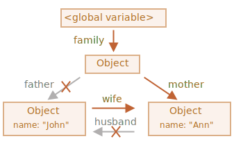

가비지 컬렉션
============
- JS : 보이지 않는 곳에서 메모리 관리 수행

### 가비지 컬렉션 기준
- 메모리 관리 수행 시
  - '도달 가능성' 개념 사용

##### '도달 가능한' 값
- 어떻게든 접근 · 사용 가능한 값
- '도달 가능한' 값
  - 메모리에서 삭제 X
1. 루트 <sub>(root)</sub>
    - 현재 함수 내
      - 지역 변수 · 매개변수
    - 중첩 함수 체인 상 함수 내
      - 사용 변수 · 매개변수
    - 전역 변수
    - 기타 등등
2. 루트가 참조하는 값<br />체이닝으로 루트에서 참조할 수 있는 값
    - ex&#41; 전역 변수 내 객체 프로퍼티
      - → 또 다른 객체 참조
      - 이 객체가 참조하는 모든 것들
        - '도달 가능' 간주
- JS 엔진 내 가비지 컬렉터
  - 끊임없이 동작
  - 모든 객체 모니터
  - '도달 불가능' 객체 삭제
```javascript
// user (변수)
// - 객체 참조 값 저장
let user = {
  name: "John"
};

// user (변수) 값
// - 다른 값으로 덮어씀
//   - 참조 사라짐
user = null;
/*
 { name: "John" } (객체)
 - '도달 불가능' 상태
 - 접근 방법 · 참조 모두 없어짐
 가비지 컬렉터
  - 해당 객체 저장 데이터 삭제 후 메모리에서 삭제
 */
```

### 참조 2개
```javascript
// user (변수)
// - 객체 참조 값 저장
let user = {
  name: "John"
};

// admin (변수)
// - 객체 참조 값 복사
let admin = user;

// user (변수) 값
// - 다른 값으로 덮어씀
// admin (변수)
// - 아직 해당 객체 참조
user = null;

/*
 { name: "John" } (객체)
   - admin (변수) 통해 여전히 접근 가능
     - 메모리에서 삭제 X
   - admin (변수) 값
     - 다른 값 (null 등) 으로 덮어쓰면
       - 메모리에서 삭제
 */
```

### 연결된 객체
```javascript
function marry(man, woman) {

  // 두 객체 서로 참조
  woman.husband = man;
  man.wife = woman;

  return {
    father: man,
    mother: woman
  }
}

let family = marry({
  name: "John"
}, {
  name: "Ann"
});
```


- 참조 2개 삭제
```javascript
delete family.father;
delete family.mother.husband;
```


##### { name: "John" } <sub>(객체)</sub>
- '도달 가능한' 상태 X <sub>('도달 불가능')</sub>
  - 저장 데이터 <sub>(프로퍼티)</sub> 메모리에서 제거

##### '도달 가능한' 상태 영향 끼침 여부
- 외부로 나가는 참조 <sub>(X)</sub>
- 외부에서 들어오는 참조 <sub>(O)</sub>


- 가비지 컬렉션 후


### 도달할 수 없는 섬
- 도달할 방법 없는 경우
  - 섬 구성 객체 전부 메모리에서 삭제
- `family` <sub>(근원 객체)</sub> 참조 제거
```javascript
family = null;
```


### 내부 알고리즘
- 가비지 컬렉션 기본 알고리즘
  - 'mark-and-sweep'

##### 진행 단계
1. 루트 <sub>(root)</sub> 정보 수집 후 mark <sub>(기억)</sub>


2. 루트가 참조하는 모든 객체 방문 후 mark


3. mark 된 모든 객체 방문 후
    - 그 객체들이 참조하는 객체 mark
      - 한번 방문한 객체 전부 mark
      - 같은 객체 재방문 X


4. 루트에서 도달 가능한 모든 객체 방문할 때까지 위 과정 반복


5. mark 되지 않은 모든 객체
    - 메모리에서 삭제


#### 최적화 기법
- JS 엔진 : 다양한 최적화 기법 적용
  - 실행 영향 X
  - 가비지 컬렉션 속도 ↑

##### generational collection <sub>(세대별 수집)</sub>
1. 객체 분리
    - '새로운 객체'
    - '오래된 객체'
2. '새로운 객체' 분류
    - 객체 상당수
      - 생성 후 제 역할 빠르게 수행
      - 금방 쓸모 없어짐
3. 가비지 컬렉터
    - '새로운 객체' 공격적으로 메모리에서 제거
4. '오래된 객체' 분류
    - 일정 시간 이상 살아남은 객체
    - 가비지 컬렉터 덜 감시

##### incremental collection <sub>(점진적 수집)</sub>
1. 가비지 컬렉션 여러 부분 분리
2. 각 부분 별도 수행
- 작업 분리 · 변경 사항 추적
  - 추가 작업 필요
  - 긴 지연 → 짧은 지연 여러 개 <sub>(분산)</sub>

#####  idle-time collection <sub>(유휴 시간 수집)</sub>
- CPU 유휴 상태 때만 가비지 컬렉션 실행
  - 실행에 영향 최소화

<br />

## 요약
요약
지금까지 알아본 내용을 요약해 봅시다.
- 가비지 컬렉션은 엔진이 자동으로 수행하므로 개발자는 이를 억지로 실행하거나 막을 수 없습니다.
- 객체는 도달 가능한 상태일 때 메모리에 남습니다.
- 참조된다고 해서 도달 가능한 것은 아닙니다. 서로 연결된 객체들도 도달 불가능할 수 있습니다.

모던 자바스크립트 엔진은 좀 더 발전된 가비지 컬렉션 알고리즘을 사용합니다.

어떤 알고리즘을 사용하는지 궁금하다면 ‘The Garbage Collection Handbook: The Art of Automatic Memory Management’(저자 – R. Jones et al)를 참고하시기 바랍니다.

저수준(low-level) 프로그래밍에 익숙하다면, [A tour of V8: Garbage Collection](https://jayconrod.com/posts/55/a-tour-of-v8-garbage-collection)을 읽어보세요. V8 가비지 컬렉터에 대한 자세한 내용을 확인해 볼 수 있습니다.

[V8 공식 블로그](https://v8.dev)에도 메모리 관리 방법 변화에 대한 내용이 올라옵니다. 가비지 컬렉션을 심도 있게 학습하려면 V8 내부구조를 공부하거나 V8 엔지니어로 일했던 [Vyacheslav Egorov](https://mrale.ph)의 블로그를 읽는 것도 좋습니다. 여러 엔진 중 ‘V8’ 엔진을 언급하는 이유는 인터넷에서 관련 글을 쉽게 찾을 수 있기 때문입니다. V8과 타 엔진들은 동작 방법이 비슷한데, 가비지 컬렉션 동작 방식에는 많은 차이가 있습니다.

저수준 최적화가 필요한 상황이라면, 엔진에 대한 조예가 깊어야 합니다. 먼저 자바스크립트에 익숙해진 후에 엔진에 대해 학습하는 것을 추천해 드립니다.
