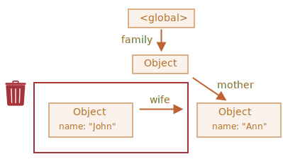

가비지 컬렉션
====

### 가비지 컬렉션 기준

#### '도달 가능성'

##### '도달 가능한' 값
- 접근 · 사용 가능 값 <sub>(방식 무관)</sub>
- 메모리 내 삭제 X
- 종류 <sub>(2가지)</sub>
  - a. 루트
  - b. 루트 참조 대상

##### a. 루트 <sub>(최상위 요소)</sub>
- 현재 함수 내 지역 변수 · 매개변수
- 중첩 함수 체인 상 함수 내 사용 변수 · 매개변수
- 전역 변수
- 기타 등등

##### b. 루트 참조 대상 <sub>(간접 참조 포함)</sub>
- 전역 변수 내 중첩 객체 참조 대상
- 기타 등등

##### JS 엔진 내 [가비지 컬렉터](https://en.wikipedia.org/wiki/Garbage_collection_(computer_science)) 항시 동작
- 모든 객체 감시
  - '도달 불가능' 객체 삭제

### 참조 1개

##### `user` <sub>(변수)</sub>
```javascript
// 객체 생성 · 참조 값 저장
let user = {
  name: "John"
};

user = null; // 타 값 저장 (참조 제거)

/* { name: "John" } (객체)
 도달 불가능 상태
 - 접근 방법 · 참조 無
 가비지 컬렉터
 - 해당 객체 내 저장 데이터 삭제 후 메모리 내 삭제
 */
```

### 참조 2개

##### `user` · `admin` <sub>(변수)</sub>
```javascript
// 객체 생성 · 참조 값 저장
let user = {
  name: "John"
};

let admin = user; // 객체 참조 값 복사

/*
 user (변수)
 - 타 값 저장 (참조 제거)
 admin (변수)
 - 해당 객체 참조 (참조 유지)
*/
user = null;

/* { name: "John" } (객체)
 도달 가능한 상태
 - admin (변수) 참조
 가비지 컬렉터
 - 해당 객체 메모리 내 유지
 - admin (변수) 타 값 저장 시 메모리 내 삭제
 */
```

### 연결된 객체

##### `marry` <sub>(함수)</sub>
- 두 매개변수 <sub>(객체)</sub> 연결 <sub>(서로 참조)</sub> 후
  - 새 객체 내 삽입 후 반환
```javascript
function marry(man, woman) {

  // 두 객체 (man · woman) 서로 참조
  man.wife = woman;
  woman.husband = man;

  return {
    father: man,
    mother: woman
  }
}

let family = marry({
  name: "John"
}, {
  name: "Ann"
});
```

##### 함수 실행 후 메모리 구조
- 모든 객체
  - 도달 가능한 상태


##### 참조 2개 제거
```javascript
delete family.father;
delete family.mother.husband;
```


- `{ name: "John" }` <sub>(객체)</sub>
  - 도달 불가능 상태 → 메모리 내 삭제
    - 객체
    - 저장 데이터 <sub>(프로퍼티)</sub>



##### 가비지 컬렉션 후 메모리 구조


##### 참조 방향별 도달 가능한 상태 영향 여부

|참조 방향|영향|
|:---:|:---:|
|내부 → 외부|有|
|내부 ← 외부|無|

### 도달할 수 없는 섬

##### 객체 도달 방법 無
- 해당 객체 내 모든 구성 요소
  - 메모리 내 삭제

##### `family` <sub>(근원 객체)</sub> 참조 제거
```javascript
family = null;
```

##### 참조 제거 후 메모리 구조
- `family` <sub>(객체)</sub> 내 하위 구성 요소
  - 전부 도달 불가능 상태


### 내부 알고리즘

##### 가비지 컬렉션 기본 알고리즘
- 'mark-and-sweep'

#### 진행 단계 <sub>(가비지 컬렉터)</sub>

##### 1. 루트 <sub>(최상위)</sub> 방문 <sub>(정보 수집)</sub> 후 mark
1. 루트 <sub>(최상위)</sub> 방문 <sub>(정보 수집)</sub> 후 mark
- mark <sub>(기억)</sub> 용도
  - 동일 객체 재방문 방지


##### 2. 루트 참조 대상 <sub>(객체)</sub> 방문 후 mark
2. 루트 참조 대상 <sub>(객체)</sub> 방문 후 mark


##### 3. 이전 mark 객체 참조 대상 <sub>(객체)</sub> 방문 후 mark
3. 이전 mark 객체 참조 대상 <sub>(객체)</sub> 방문 · mark
3. 이전 mark 객체 참조 대상 <sub>(객체)</sub> 방문 <sub>(mark)</sub>


##### 4. ③ 반복 <sub>(도달 가능한 모든 객체 방문)</sub>
4. ③ 반복 <sub>(도달 가능한 모든 객체 방문)</sub>


##### 5. mark 안 된 모든 객체 메모리 내 삭제
5. mark 안 된 모든 객체 메모리 내 삭제


#### 최적화 기법

##### JS 엔진
- 다양한 최적화 기법 적용
  - 실행 영향 無
  - 가비지 컬렉션 속도 ↑

#### generational collection <sub>(세대별 수집)</sub>

##### 1. 객체 분리
- '새 객체'
- '구식 객체'

##### 2. '새 객체' 분류
- 객체 상당수
  - 생성 후 제 역할 빠르게 수행
  - 금방 쓸모 없어짐

##### 3. 가비지 컬렉터
- '새 객체' 공격적으로 메모리에서 삭제

##### 4. '구식 객체' 분류
- 일정 시간 이상 살아남은 객체
- 가비지 컬렉터 감시 빈도 ↓

##### incremental collection <sub>(점진적 수집)</sub>
1. 가비지 컬렉션 다수 부분 분리
2. 각 부분 별도 수행
- 작업 분리 · 변경 사항 추적
  - 추가 작업 필요
  - 긴 지연 1개 → 다수 짧은 지연 <sub>(분산)</sub>

##### idle-time collection <sub>(유휴 시간 수집)</sub>
- CPU 유휴 상태 때만 가비지 컬렉션 실행
  - 실행에 영향 최소화

<br />

요약
====

##### 가비지 컬렉션
- 엔진 자동 수행
  - 개발자 간섭 X
- 객체 : 도달 가능한 상태
  - 메모리에 유지

##### 참조 가능 → 항상 도달 가능 의미 X
- 서로 연결된 객체들
  - 도달 불가능 가능성 有

##### 모던 JS 엔진
- 좀 더 발전된 가비지 컬렉션 알고리즘 사용

##### 참고
- 'The Garbage Collection Handbook: The Art of Automatic Memory Management' <sub>(저자 – R. Jones et al)</sub>
- [A tour of V8: Garbage Collection](https://jayconrod.com/posts/55/a-tour-of-v8-garbage-collection)
  - V8 가비지 컬렉터 상세 내용
  - 저수준 <sub>(low-level)</sub> 프로그래밍
- [V8 공식 블로그](https://v8.dev)
  - 메모리 관리 방법 변화 관련 내용

##### 가비지 컬렉션 심화 학습
- V8 내부구조
- [Vyacheslav Egorov](https://mrale.ph) <sub>(블로그)</sub>

##### V8 엔진
- 인터넷 상 많은 관련 글
- 타 엔진들
  - 동작 방식 유사
  - 가비지 컬렉션 동작 방식 상이

##### 저수준 최적화 필요 상황
- 깊은 엔진 지식 필요
