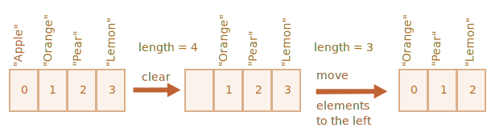

배열
====

##### 자료구조
- 순서 있는 컬렉션 저장

### 배열 선언

##### 배열 생성 <sub>(2가지)</sub>
- a. 배열 생성자
- b. `[…]` <sub>(배열 리터럴)</sub>
  - 주로 사용
```javascript
// 배열 생성자
let arr1 = new Array();

// `[…]` (배열 리터럴)
let arr2 = [];
```

##### `[…]` <sub>(대괄호)</sub> 내 초기 요소 삽입 가능
```javascript
let fruits = ["사과", "오렌지", "자두"];
```

##### 배열 내 각 요소 숫자 <sub>(인덱스)</sub> 부여
- 0 ~ n
- 배열 내 순서 의미

##### 배열 내 특정 요소 접근
- `[…]` <sub>(대괄호)</sub> 내 인덱스 명시
```javascript
let fruits = ["사과", "오렌지", "자두"];

// 요소 접근
fruits[0]; // 사과
fruits[1]; // 오렌지
fruits[2]; // 자두

/* 요소 수정
 ["사과", "오렌지", "자두"]
          ↓↓↓
 ["사과", "오렌지", "배" ]
 */
fruits[2] = '배';

/* 새 요소 추가
 ["사과", "오렌지", "배" ]
          ↓↓↓
 ["사과", "오렌지", "배", "레몬"]
 */
fruits[3] = '레몬';
```

##### `length` <sub>(프로퍼티)</sub>
- 배열 내 요소 개수
```javascript
let fruits = ["사과", "오렌지", "자두"];

fruits.length; // 3
```

##### 배열 전체 출력
```javascript
let fruits = ["사과", "오렌지", "자두"];

fruits; // 사과,오렌지,자두
```

##### 배열 내 요소 자료형 제약 無
```javascript
// 문자열 · 객체 · boolean 값, 함수 삽입
let arr = [
  '사과',
  {name: '이보라'},
  true,
  function() { '안녕하세요.'; }
];

// 2번째 요소 (객체) 내 name (프로퍼티) 접근
arr[1].name; // 이보라

// 4번째 요소 (함수) 실행
arr[3](); // 안녕하세요.
```

<br />

 **trailing 쉼표**

##### 마지막 요소 끝 `,` <sub>(쉼표)</sub> 사용 가능
- 모든 요소 동일 구조 유지
  - 요소 추가 · 삭제 · 이동 용이
```javascript
let fruits = [
  "사과",
  "오렌지",
  "자두", // ←
];
```

<br />

### `pop` · `push` vs `[un]shift`

#### [큐](https://en.wikipedia.org/wiki/Queue_(abstract_data_type)) <sub>(queue)</sub>


##### 대표적인 배열형 자료구조
- 순서 있는 컬렉션 저장
- 선입선출 <sub>(First-In-First-Out · FIFO)</sub>

##### 주요 연산 <sub>(배열 메서드)</sub>
- `push`
  - 끝 요소 추가
- `shift`
  - 1번째 요소 추출
  - 나머지 요소들 앞 이동

#### [스택](https://en.wikipedia.org/wiki/Stack_(abstract_data_type)) <sub>(stack)</sub>


##### 대표적인 배열형 자료구조
- 후입선출 <sub>(Last-In-First-Out · LIFO)</sub>

##### 주요 연산 <sub>(배열 메서드)</sub>
- `push`
  - 끝 요소 추가
- `pop`
  - 끝 요소 추출

#### [데큐](https://en.wikipedia.org/wiki/Double-ended_queue) <sub>(Double Ended Queue · deque)</sub>

##### 배열형 자료구조
- 처음 · 끝 요소 추가 · 추출 가능
  - 큐 · 스택 기능 모두 구현

#### 배열 메서드

##### 배열 끝 작업 메서드
- `pop`
  - 끝 요소 제거 후 반환
- `push`
  - 새 끝 요소 추가
  - `배열[배열.length] = …` 동일
```javascript
let fruits = ["사과", "오렌지", "배"];

// pop
fruits.pop(); // 배

fruits;       // 사과,오렌지

// push
fruits.push("배");
// fruits[fruits.length] = "배";

fruits;       // 사과,오렌지,배
```

##### 배열 앞 작업 메서드
- `shift`
  - 1번째 요소 제거 후 반환
- `unshift`
  - 새 1번째 요소 추가
```javascript
let fruits = ["사과", "오렌지", "배"];

// shift
fruits.shift(); // 사과

fruits;         // 오렌지,배

// unshift
fruits.unshift('사과');

fruits;         // 사과,오렌지,배
```

##### `push` · `unshift` <sub>(끝 · 1번째 요소 추가 메서드)</sub>
- 다수 요소 추가 가능
```javascript
let fruits = ["사과"];

fruits.push("오렌지", "배");
// ["사과", "오렌지", "배"]
//           ↑      ↑

fruits.unshift("파인애플", "레몬");
// ["파인애플", "레몬", "사과", "오렌지", "배"]
//     ↑       ↑

fruits; // 파인애플,레몬,사과,오렌지,배
```

### 배열 내부 동작 원리

##### 배열 == 특별 '객체'
- 객체 기본 기능 제공
- 객체 문법 <sub>(`[…]` 대괄호)</sub> 사용
  - ex\) `arr[0]`

##### 숫자 <sub>(`number`)</sub> 키 사용
- 순서 있는 컬렉션 제어 방법 제공
  - 배열 메서드
  - `length` <sub>(프로퍼티)</sub>
  - 기타 등등

##### 배열 == 객체형 <sub>(원시 자료형 X)</sub>
- 객체 기본 동작 수행
```javascript
let fruits = ["바나나"]

let arr = fruits; // 참조 복사

arr === fruits; // true

arr.push("배"); // 복사한 참조 이용해 배열 수정

fruits; // 바나나,배
```

##### 배열 내부 표현방식 특징 <sub>(JS 엔진)</sub>
- 인접한 메모리 공간 내 차례대로 요소 저장
  - 연산 속도 ↑
- 이 외 다양한 배열 관련 연산 최적화 기법 有

##### 정상적인 배열 용도 <sub>(순서 있는 컬렉션)</sub> 외 작업
- 배열 최적화 기법 동작 X
```javascript
let arr = [];

// 숫자 외 프로퍼티 키 사용
// - 일반 객체 (배열 X) 처리 (JS 엔진)
arr.test = 1;

// 아주 큰 인덱스 요소 삽입
arr[99999] = 5;

// 1번째 · 끝에만 요소 추가
arr[0]   = 1;
arr[1000] = 2;

// 요소 역순 삽입
arr[999] = 1;
arr[998] = 2;
```

##### JS 엔진 배열 처리 시 다양한 최적화 기법 적용
- 메모리 내 요소 저장 방식
- 배열 내장 메서드 최적화 기준
  - 배열 용도 <sub>(순서 있는 자료 저장)</sub>
- 기타 등등

##### 임의 <sub>(숫자 외)</sub> 키 사용 필요 시
- 일반 객체 사용

### 삽입 메서드 성능 <sub>(속도)</sub>

##### `push` · `pop` vs `[un]shift`
- 배열 뒤 작업 vs 배열 앞 작업


#### `[un]shift` 속도 ↓
```javascript
let fruits = ["Apple", "Orange", "Pear", "Lemon"];

// "Apple" (1번째 요소) 제거 후 반환
fruits.shift();
```



##### `[0]` <sub>(1번째 요소)</sub> 대상 작업 <sub>(제거 · 추가)</sub> 수행
- 이후 나머지 요소 수정

##### `shift` 동작 과정 <sub>(≒ `unshift`)</sub>
1. `[0]` <sub>(1번째 요소)</sub> 제거
2. 모든 요소 좌측 이동 <sub>(인덱스 1씩 감소)</sub>
   - `[0]` ← `[1]`
   - `[1]` ← `[2]`
   - …
3. `length` <sub>(프로퍼티)</sub> 값 갱신

##### 배열 내 요소 개수 ↑
- 요소 이동 시간 ↑
- 메모리 관련 연산 ↑

#### `push` · `pop` 속도 ↑
```javascript
let fruits = ["Apple", "Orange", "Pear", "Lemon"];

// "Lemon" (끝 요소) 제거 후 반환
fruits.pop();
```


##### `[n]` <sub>(끝 요소)</sub> 대상 작업 <sub>(제거 · 추가)</sub> 수행
- 이후 나머지 요소 수정 X

##### `pop` 동작 과정 <sub>(≒ `push`)</sub>
1. `[n]` <sub>(끝 요소)</sub> 제거
2. `length` <sub>(프로퍼티)</sub> 값 갱신

##### 배열 내 요소 개수 ↑
- 요소 이동 시간 ↑
- 메모리 관련 연산 ↑

##### 요소 이동 X
- 기존 인덱스 그대로 유지

### 반복문

##### `for` <sub>(가장 오래된 방법)</sub>
- 인덱스 사용
```javascript
let arr = ["사과", "오렌지", "배"];

for (let i = 0; i < arr.length; i++) {
  arr[i]; // 사과, 오렌지, 배
}
```

##### `for…of`
- 요솟값 접근
  - 인덱스 접근 불가능
- 코드량 ↓
```javascript
let fruits = ["사과", "오렌지", "자두"];

for (let fruit of fruits) {
  fruit; // 사과, 오렌지, 배
}
```

##### `for…in` <sub>(객체형 순회)</sub>
- 배열 == 객체
```javascript
let arr = ["사과", "오렌지", "배"];

for (let key in arr) {
  arr[key]; // 사과, 오렌지, 배
}
```

#### `for…in` 배열 순회 시 문제점 <sub>(사용 지양)</sub>

##### a. 유사 배열 객체 대상 부적합
- 유사 배열 객체
  - 배열 형태 유사 객체 <sub>(≠ 배열)</sub>
- 객체 내 다양한 프로퍼티 有
  - 요소 인덱스
  - `length` <sub>(프로퍼티)</sub>
  - 기타 프로퍼티 · 메서드
- `for…in`
  - 객체 내 모든 <sub>(숫자 키 외)</sub> 프로퍼티 순회
    - 문제 발생 가능성 ↑

##### b. 객체 대상 최적화
- 배열 사용 시 속도 ↓ <sub>(10 ~ 100배)</sub>
- 보통 반복문 자체 속도 ↑
  - 병목 지점 위주 문제 발생 가능

### `length` <sub>(프로퍼티)</sub>

##### 인덱스 최댓값 + 1 <sub>(≠ 실제 요소 개수)</sub>
  - 배열 조작 시 자동 갱신

##### 일부 큰 인덱스 요소 삽입 시 프로퍼티 값 ↑ <sub>(지양)</sub>
```javascript
// 잘못된 배열 사용
let fruits = [];
fruits[123] = "사과";

fruits.length; // 124
```

##### 수정 가능
- 값 수동 증가 시 프로퍼티 값만 증가
- 값 수동 감소 시 배열 뒤쪽 잘림
  - 잘린 배열 요소 복구 불가능
```javascript
let arr = [1, 2, 3, 4, 5];

// 요소 2개만 남기고 자르기
arr.length = 2;
// [1, 2]

// 배열 길이 수동 증가
// - 삭제된 기존 요소들 복구 X
arr.length = 5;
// [1, 2, undefined, undefined, undefined]

// 간단한 배열 비우기
arr.length = 0;
// [] (빈 배열)
```

### `new Array()` <sub>(배열 생성자)</sub>

##### 배열 생성
- `[…]` <sub>(배열 리터럴)</sub> 대비 코드량 ↑
```javascript
let arr = new Array("사과", "배", "기타");
//  arr =          ["사과", "배", "기타"]
```

##### 까다로운 사용법 <sub>(사용 빈도 ↓)</sub>
- 인수 <sub>(`number`)</sub> 1개 전달 시
  - 배열 내 요소 無
  - 배열 길이 == 인수
```javascript
let arr = new Array(2);
// [undefined, undefined]

arr.length; // 2
```

### 다차원 배열 <sub>(배열 내 배열)</sub>

##### 행렬 저장 용도
```javascript
let matrix = [
  [1, 2, 3], // [0] (배열 요소)
  [4, 5, 6], // [1] (배열 요소)
  [7, 8, 9]  // [2] (배열 요소)
];

matrix[1][1]; // 5
```

### `toString` <sub>(메서드)</sub>

##### 전체 요소 문자열 <sub>(`,` 쉼표 구분)</sub> 반환
```javascript
let arr = [1, 2, 3];

arr; // 1,2,3

String(arr) === '1,2,3'; // true
```

##### `[Symbol.toPrimitive]` · `valueOf` <sub>(메서드)</sub> 無
- 항상 `string` 형 변환
```javascript
//     문자열 + 숫자  →  문자열
[]    + 1; // "1"
[1]   + 1; // "11"
[1,2] + 1; // "1,21"

""    + 1; // "1"
"1"   + 1; // "11"
"1,2" + 1; // "1,21"
```

<br />

요약
====

### 배열

##### 특수 객체 <sub>(자료구조)</sub>
- 순서 있는 자료 저장 · 관리 최적화

##### 선언 방법
- a. 배열 생성자
- b. `[…]` <sub>(배열 리터럴)</sub>
  - 주로 사용
```javascript
// 배열 생성자
let arr1 = new Array(item1, item2...);

// `[…]` (배열 리터럴)
let arr2 = [item1, item2...];
```

##### `new Array(…)` <sub>(배열 생성자)</sub>
- 인수 <sub>(`number`)</sub> 1개 전달 시
  - 배열 내 요소 無
  - 배열 길이 == 인수

##### `length` <sub>(프로퍼티)</sub>
- 인덱스 최댓값 + 1 <sub>(≠ 실제 요소 개수)</sub>
- 배열 메서드 실행 시 값 자동 조정
- 값 수동 감소 시 배열 뒤쪽 잘림

#### 배열 메서드

##### 배열 끝 작업
- `pop()`
  - 끝 요소 제거 후 반환
- `push(...items)`
  - 새 끝 요소들 <sub>(`items`)</sub> 추가

##### 배열 앞 작업
- `shift()`
  - 1번째 요소 제거 후 반환
- `unshift(...items)`
  - 새 1번째 요소들 <sub>(`items`)</sub> 추가

##### 전체 요소 대상 반복 작업
- `for`
  - 가장 빠른 속도
  - 구식 브라우저 호환
- `for…of` <sub>(모던)</sub>
  - 배열 요소만 접근 <sub>(인덱스 접근 불가능)</sub>
- `for…in`
  - 배열 사용 지양

<br />

##  과제

### 배열은 복사가 될까요?

##### 코드 실행 결과 에측
```javascript
let fruits = ["사과", "배", "오렌지"];

// 배열 참조 값 '복사' 후 push (메서드) 호출 (새 끝 요소 삽입)
let shoppingCart = fruits;
shoppingCart.push("바나나");

fruits.length; // ?
```

<br />


##### `4`
- 배열 == 객체
  - 참조 값 복사 시 동일 개체 참조
- `fruits` · `shoppingCart` <sub>(변수)</sub>
  - 동일 배열 참조
```javascript
…
fruits.length; // 4
```
<hr />

### 배열 관련 연산

##### 배열 관련 연산 수행 코드 작성 <sub>(5가지)</sub>
1. `styles` <sub>(배열)</sub> 생성 <sub>(요소 초기화 실행)</sub>
   - `"Jazz"`
   - `"Blues"`
2. 새 끝 요소 추가
   - `"Rock-n-Roll"`
3. 정 중앙 요소 교체 <sub>(홀수 · 짝수 요소 배열 정상 작동)</sub>
   - `"Classics"`
4. 1번째 요소 추출 후 출력
5. 새 1번째 요소들 추가
   - `"Rap"`
   - `"Reggae"`

##### 단계별 배열 모습
```javascript
["Jazz"    , "Blues"]
["Jazz"    , "Blues"      , "Rock-n-Roll"]
["Jazz"    , "Classics"   , "Rock-n-Roll"]
["Classics", "Rock-n-Roll"]
["Rap"     , "Reggae"     , "Classics"   , "Rock-n-Roll"]
```

<br />


```javascript
let styles = ["Jazz", "Blues"];
styles.push("Rock-n-Roll");
styles[Math.floor((styles.length - 1) / 2)] = "Classics";
styles.shift();
styles.unshift("Rap", "Reggae");
```

<hr />

### 배열 컨텍스트 내 함수 호출하기

##### 코드 실행 결과 예측 · 이유
```javascript
let arr = ["a", "b"];

arr.push(function() {
  this;
});

arr[2](); // ?
```

<br />


##### 함수형 요소 호출 == 객체 메서드 호출 <sub>(문법적 동일)</sub>
```javascript
arr[   2  ]();
 ↓    ↓
obj[method]();
```

##### `arr[2]` <sub>(함수)</sub>
- `this` → `arr` <sub>(배열)</sub> 참조
  - 배열 요소 출력 <sub>(`a,b,function(){ … }`)</sub>
```javascript
let arr = ["a", "b"];

arr.push(function() {
  this; // this → arr 참조
});
// ["a", "b", function(){ … }]

arr[2](); // a,b,function(){ … }
```

<hr />

### 입력한 숫자 합 구하기

##### `sumInput()` <sub>(함수)</sub> 작성
1. 프롬프트 창 표시
   - 숫자 입력 요청 <sub>(배열 내 입력값 저장)</sub>
2. 특정 조건 만족 시 질문 중단
   - 숫자 외 값 입력
   - `""` <sub>(빈 문자열)</sub> 입력
   - 취소 버튼
3. 배열 요소 합 계산 결과 반환

##### 주의
- `0` <sub>(숫자)</sub> 유효
  - 질문 중단 X

<br />


##### 입력값 → `number` 형 변환 전 질문 중단 여부 확인 필요
- `""` <sub>(빈 문자열 · 중단 조건)</sub> → `0` <sub>(유효값)</sub> 변환
  - 중단 조건 확인 후 형 변환
```javascript
function sumInput() {
  let numbers = [];

  while (true) {
    let value = prompt("숫자를 입력해 주세요.", 0);

    // 입력 중단 조건 확인
    if (value === "" || value === null || !isFinite(value)) {
      break;
    }

    numbers.push(+value);
  }

  let sum = 0;

  for (let number of numbers) {
    sum += number;
  }

  return sum;
}

sumInput();
```

<hr />

### 최대합 부분 배열

##### `getMaxSubSum(arr)` <sub>(함수)</sub> 작성
- `arr` <sub>(배열)</sub>
  - 숫자 요소 구성
- 부분 배열 요소 합 중 최댓값 반환
  - 인접 요소 총합 최대 <sub>(조건)</sub>
```javascript
getMaxSubSum(…);

//      [ 2, 3 ] → 5
[    -1,  2, 3, -9 ]

//  [ 2, -1, 2,  3 ] → 6
[     2, -1, 2,  3, -9 ]

//                [ 11 ] → 11
[    -1,  2, 3, -9, 11 ]

//         [ 1,  2 ] → 3
[    -2, -1, 1,  2 ]

//[ 100 ] → 100
[   100, -9, 2, -3,  5 ]

//  [ 1,  2, 3 ] → 6 (모든 요소)
[     1,  2, 3 ]
```

##### 요소 전체 음수
- 요소 선택 X
  - 최댓값 == `0`
```javascript
//           [] → 0
getMaxSubSum([-1, -2, -3]);
```

##### 함수 작성 시 성능 고려
- [O(n<sup>2</sup>)](https://en.wikipedia.org/wiki/Big_O_notation)
- O(n)

<br />


#### 느린 해답

##### 모든 부분 배열 <sub>(각 요소 시작점)</sub> 합 계산
- `[-1, 2, 3, -9, 11]`
```javascript
// -1 (1번째 요소) ~
-1
-1 + 2
-1 + 2 + 3
-1 + 2 + 3 + (-9)
-1 + 2 + 3 + (-9) + 11

// 2  (2번째 요소) ~
2
2 + 3
2 + 3 + (-9)
2 + 3 + (-9) + 11

// 3  (3번째 요소) ~
3
3 + (-9)
3 + (-9) + 11

// -9 (4번째 요소) ~
-9
-9 + 11

// 11 (5번째 요소) ~
11
```

##### 중첩 반복문 필요
- 외부 반복문
  - 배열 각 요소 순회
- 내부 반복문
  - 부분 배열 <sub>(각 요소 시작점)</sub> 합 계산
```javascript
function getMaxSubSum(arr) {

  // 요소 미선택 시 0 반환 (요소 전체 음수)
  let maxSum = 0;

  for (let i = 0; i < arr.length; i++) {
    let sumFixedStart = 0;

    for (let j = i; j < arr.length; j++) {
      sumFixedStart += arr[j];
      maxSum = Math.max(maxSum, sumFixedStart);
    }
  }

  return maxSum;
}

// 5
getMaxSubSum([ -1,  2, 3, -9]);

// 11
getMaxSubSum([ -1,  2, 3, -9, 11]);

// 3
getMaxSubSum([ -2, -1, 1,  2]);

// 100
getMaxSubSum([100, -9, 2, -3, 5 ]);

// 6
getMaxSubSum([  1,  2, 3]);
```

##### [O(n2)](https://en.wikipedia.org/wiki/Big_O_notation) <sub>(시간 복잡도)</sub>
- 배열 크기 2배 ↑
  - 알고리즘 소모 시간 4배 ↑
- 크기 큰 배열 <sub>(1000 ~)</sub>
  - 속도 ↓↓

#### 빠른 해답

##### 현재 부분합 별도 저장
- 각 부분합 간 크기 비교
  - 더 큰 값 저장 <sub>(다음 부분합 비교)</sub>
- 음수
  - `0` 할당
```javascript
function getMaxSubSum(arr) {
  let maxSum = 0;
  let partialSum = 0;

  for (let item of arr) {

    // 각 요소 합 누적
    partialSum += item;

    // 최댓값 기억
    maxSum = Math.max(maxSum, partialSum);

    // 음수
    // - 0 할당
    if (partialSum < 0) {
      partialSum = 0;
    }
  }

  return maxSum;
}

getMaxSubSum([ -1,  2,  3, -9]);     // 5
getMaxSubSum([ -1,  2,  3, -9, 11]); // 11
getMaxSubSum([ -2, -1,  1,  2]);     // 3
getMaxSubSum([100, -9,  2, -3,  5]); // 100
getMaxSubSum([  1,  2,  3]);         // 6
getMaxSubSum([ -1, -2, -3]);         // 0
```

##### O(n) <sub>(시간 복잡도)</sub>
- 정확히 1번 배열 순회
- [최대합 부분 배열 문제](https://en.wikipedia.org/wiki/Maximum_subarray_problem)

[정답](https://plnkr.co/edit/uAWodoF6mrto3rih?p=preview)
