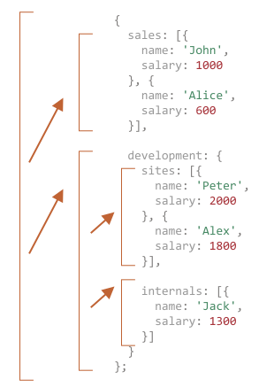
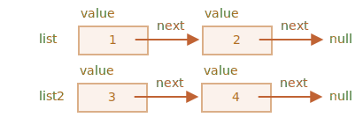
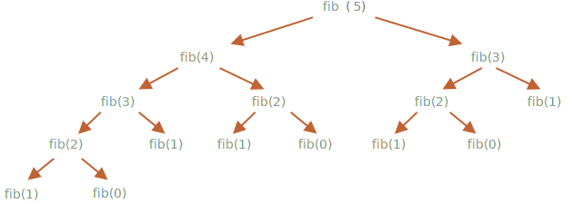

재귀 · 스택
====

##### 재귀 <sub>(프로그래밍 패턴)</sub>
- 큰 목표 작업 1개 → 다수 단순 작업 <sub>(분리)</sub>
- 함수 내 자기 자신 호출

### 반복 vs 재귀

#### `pow(x, n)` <sub>(함수)</sub>

##### x<sup>n</sup> <sub>(거듭제곱)</sub> 계산
```javascript
// 거듭제곱
pow(2, 2); // 4
pow(2, 3); // 8
pow(2, 4); // 16
```

##### 구현
- a. 반복적인 사고
  - 반복문 사용
```javascript
function pow(x, n) {
  let result = 1;

  // 반복문 곱셈 연산 반복
  for (let i = 0; i < n; i++) {
    result *= x;
  }

  return result;
}

pow(2, 3); // 8
```
- b. 재귀적인 사고
  - 작업 단순화
  - 자기 자신 호출
```javascript
function pow(x, n) {
  if (n == 1) {
    return x;
  } else {
    return x * pow(x, n - 1);
  }
}

pow(2, 3); // 8
```

#### 재귀적인 사고

##### 두 갈래 나뉘어 코드 실행
```javascript
               if  (n == 1) = x
             /
pow(x, n) =
             \ //  (n != 1)
              else          = x * pow(x, n - 1)
```

##### `n == 1` <sub>(재귀 기반)</sub>
- `pow(x, 1)` → `x`
  - x<sup>1</sup> = x
- 절차 단순화
  - 명확한 결괏값 즉시 도출

##### `n != 1` <sub>(재귀 단계)</sub>
- `pow(x, n)` → `x * pow(x, n - 1)`
  - x<sup>n</sup> = x * x<sup>(n-1)</sup>
- 목표 작업 <sub>(`pow(x, n)`)</sub> 분할
  - 단순 동작 <sub>(`x` 곱셈)</sub>
  - 목표 작업 변형 <sub>(`pow(x, n - 1)`)</sub>
- `n == 1` <sub>(조건)</sub> 충족 시 종료


##### `pow(2, 4)`
1. `pow(2, 4)` == `2 * pow(2, 3)`
2. `pow(2, 3)` == `2 * pow(2, 2)`
3. `pow(2, 2)` == `2 * pow(2, 1)`
4. `pow(2, 1)` == `2`

<br />

 **재귀 사용 시 코드량 ↓**

##### 보통 반복적 사고 코드 대비 코드량 ↓
- `if` <sub>(문)</sub> → `?` <sub>(조건부 연산자)</sub>
  - 간결성 · 가독성 ↑
```javascript
function pow(x, n) {

  // if (문)
  if (n == 1) {
    return x;
  } else {
    return x * pow(x, n - 1);
  }

  ↓↓↓

  // `?` (조건부 연산자)
  return (n == 1) ? x : (x * pow(x, n - 1));
}
```

<br />

#### 재귀 깊이

##### 중첩 호출 최대 개수 <sub>(1번째 호출 포함)</sub>
- ex\) `pow(x, n)` <sub>(함수)</sub>
  - `n` <sub>(재귀 깊이)</sub>

##### 최대 깊이 제한 有 <sub>(JS 엔진)</sub>
- 약 1만개 확실히 허용 <sub>(엔진별 상이)</sub>
- 약 10만 개 처리 불가능 <sub>(대다수 엔진)</sub>

##### 꼬리 물기 최적화 <sub>(_'tail call optimization'_)</sub>
- 최대 깊이 제한 완화
  - JS 엔진 내부 최적화 자동 수행
- 항상 적용 적용 X
  - 간단한 경우만 적용

##### 제약 <sub>(재귀 깊이 제한)</sub> \< 편의성
- 간결성 ↑
- 유지보수 난이도 ↓

### [실행 컨텍스트](https://tc39.es/ecma262/#sec-execution-contexts) · 스택

##### 실행 컨텍스트
- 함수 실행 세부 정보 저장
  - 제어 흐름 현재 위치
  - 변수 현재 값
  - `this` 값
  - 기타 등등
- 함수 호출 1회 당 1개 생성

##### 함수 내부 중첩 호출 절차
1. 현재 함수 실행 일시 중단
2. 일시 중단 함수 실행 컨텍스트
   - 실행 컨텍스트 스택 push
3. 중첩 호출 실행
4. 중첩 호출 실행 종료
   1. 실행 컨텍스트 스택 pop
      - 중단 함수 실행 컨텍스트
   2. 일시 중단 함수 실행 재개

### `pow(2, 3)` 호출 시 실행 컨텍스트

#### 1. `pow(2, 3)`

##### 실행 컨텍스트 내 정보 저장 <sub>(함수 호출 직후)</sub>
- 변수
  - `x = 2`
  - `n = 3`
- 실행 흐름 위치
  - 함수 1번째 줄
```javascript
Context: {x: 2, n: 3, 1번째 줄} call: pow(2, 3)
```

##### `n == 1` <sub>(조건)</sub> 만족 X
- 실행 흐름 이동
  - `if` <sub>(문)</sub> 2번째 분기
```javascript
function pow(x, n) {
  if (n == 1) {
    return x;
  } else {
    return x * pow(x, n - 1); // ←
  }
}
```
- 변수 동일 · 실행 흐름 위치 변경
  - 실행 컨텍스트 정보 변경
```javascript
// 1 → 5번째 줄 (실행 흐름 위치 변경)
Context: {x: 2, n: 3, 5번째 줄} call: pow(2, 3)
```

##### `x * pow(x, n - 1)` 계산
- `pow(2, 2)` <sub>(서브 호출)</sub> 생성
  - 새 인수 전달

#### 2. `pow(2, 2)`

##### 중첩 호출 발생 시
- 현재 실행 컨텍스트
  - 실행 컨텍스트 스택 내 저장 <sub>(push)</sub>

##### 중첩 호출 진행 절차
1. 현재 컨텍스트 <sub>(기존 호출)</sub>
   - 스택 최상단 기록
2. 새 컨텍스트 <sub>(서브 호출)</sub> 생성
   - 서브 호출 실행
3. 서브 호출 완료
   1. 실행 컨텍스트 스택 pop
      - 기존 컨텍스트
   2. 기존 호출 실행 재개

##### 새 실행 컨텍스트 내 정보 저장 <sub>(함수 호출 직후)</sub>
- 변수
  - `x = 2`
  - `n = 2`
- 실행 흐름 위치
  - 함수 1번째 줄
```javascript
Context: {x: 2, n: 2, 1번째 줄} call: pow(2, 2) // 새 실행 컨텍스트
Context: {x: 2, n: 3, 5번째 줄} call: pow(2, 3) // 기존 컨텍스트
```

##### `n == 1` <sub>(조건)</sub> 만족 X
- 실행 흐름 이동
  - `if` <sub>(문)</sub> 2번째 분기
```javascript
function pow(x, n) {
  if (n == 1) {
    return x;
  } else {
    return x * pow(x, n - 1); // ←
  }
}
```
- 변수 동일 · 실행 흐름 위치 변경
  - 실행 컨텍스트 정보 변경
```javascript
// 1 → 5번째 줄 (실행 흐름 위치 변경)
Context: {x: 2, n: 2, 5번째 줄} call: pow(2, 2) // 새 실행 컨텍스트
Context: {x: 2, n: 3, 5번째 줄} call: pow(2, 3) // 기존 컨텍스트
```

##### 이전 컨텍스트
- 기존 호출 정보 <sub>(변수 · 일시 중단 줄)</sub> 저장
  - 서브 호출 종료 시 기존 호출 재개 가능

##### `x * pow(x, n - 1)` 계산
- `pow(2, 1)` <sub>(서브 호출)</sub> 생성
  - 새 인수 전달

<br />

 **주의**

##### 한 줄 내 다수 서브 호출 가능
- `pow(…) + pow(…) + some(…)`

##### 정확한 실행 시점
- 서브 호출 직후

<br />

#### 3. `pow(2, 1)` <sub>(동일 과정 반복)</sub>

##### 새 실행 컨텍스트 내 정보 저장 <sub>(함수 호출 직후)</sub>
- 변수
  - `x = 2`
  - `n = 1`
- 실행 흐름 위치
  - 함수 1번째 줄
```javascript
Context: {x: 2, n: 1, 1번째 줄} call: pow(2, 1) // 새 실행 컨텍스트
Context: {x: 2, n: 2, 5번째 줄} call: pow(2, 2) // 기존 컨텍스트 2
Context: {x: 2, n: 3, 5번째 줄} call: pow(2, 3) // 기존 컨텍스트 1
```

#### 4. 실행 종료

##### `n == 1` <sub>(조건)</sub> 만족
- 실행 흐름 이동
  - `if` <sub>(문)</sub> 1번째 분기
```javascript
function pow(x, n) {
  if (n == 1) {
    return x; // ←
  } else {
    return x * pow(x, n - 1);
  }
}
```
- 중첩 호출 無
  - `2` 반환 <sub>(함수 종료)</sub>
  - 해당 실행 컨텍스트 메모리 내 제거
- 스택 최상단
  - 이전 실행 컨텍스트 위치
```javascript
// Context: {x: 2, n: 1, 1번째 줄} call: pow(2, 1)
   Context: {x: 2, n: 2, 5번째 줄} call: pow(2, 2)
   Context: {x: 2, n: 3, 5번째 줄} call: pow(2, 3)
```

##### `pow(2, 2)` 실행 재개
- 서브 호출 <sub>(`pow(2, 1)`)</sub>
  - `2` 반환
- `x * pow(x, n - 1)`
  - `4` 반환 <sub>(함수 종료)</sub>
  - 해당 실행 컨텍스트 메모리 내 제거
- 스택 최상단
  - 이전 실행 컨텍스트
```javascript
// Context: {x: 2, n: 1, 1번째 줄} call: pow(2, 1)
// Context: {x: 2, n: 2, 5번째 줄} call: pow(2, 2)
   Context: {x: 2, n: 3, 5번째 줄} call: pow(2, 3)
```

##### `pow(2, 3)` 실행 재개
- 서브 호출 <sub>(`pow(2, 2)`)</sub>
  - `4` 반환
- `x * pow(x, n - 1)`
  - `8` 반환 <sub>(함수 종료)</sub>
  - 해당 실행 컨텍스트 메모리 내 제거
- 스택 최상단
  - 이전 실행 컨텍스트
```javascript
// Context: {x: 2, n: 1, 1번째 줄} call: pow(2, 1)
// Context: {x: 2, n: 2, 5번째 줄} call: pow(2, 2)
// Context: {x: 2, n: 3, 5번째 줄} call: pow(2, 3)
```

##### 마지막 실행 컨텍스트 처리 후
- 결과 도출
  - `pow(2, 3) = 8`

##### 재귀 깊이
- 스택 내 실행 컨텍스트 수 최댓값

#### 메모리 요구사항 유의

##### 실행 컨텍스트 메모리 차지
1. `n` ↑
2. 실행 컨텍스트 수 ↑
3. 메모리 공간 사용량 ↑

##### 반복문 기반 알고리즘
- 컨텍스트 1개만 사용 <sub>(메모리 절약)</sub>
  - 반복문 내 사용 변수 수정
  - `n` <sub>(개수)</sub> 의존 X
  - 필요 메모리 공간 ↓
  - 사용 메모리 공간 고정
```javascript
function pow(x, n) {
  let result = 1;

  for (let i = 0; i < n; i++) {
    result *= x;
  }

  return result;
}
```

##### 재귀 코드 → 반복문 코드 <sub>(재작성)</sub> 가능
- 보통 함수 호출 비용 <sub>(메모리 사용)</sub> 절약
- 큰 개선 無 경우 有 <sub>(최적화 불필요)</sub>
  - 복잡한 분기문
  - 조건별 상이 재귀 서브 호출
  - 기타 등등

##### 재귀 코드
- 메모리 최적화 코드 X
- 좋은 코드
  - 코드량 ↓
  - 이해도 ↑
  - 유지보수 이점

### 재귀적 순회

##### `company` <sub>(객체)</sub>
- 회사
  - 부서 <sub>(중첩 배열 · 객체)</sub>
    - 하위 부서 <sub>(중첩 배열)</sub>
    - 임직원 <sub>(중첩 객체)</sub>
- 추후 하위 부서 분리 가능성 有
  - ex\) `sites` → `siteA` · `siteB`
```javascript
let company = {
  sales: [
    {
      name: 'John',
      salary: 1000
    }, {
      name: 'Alice',
      salary: 1600,
    }
  ],
  development: {
    sites: [
      {
        name: 'Peter',
        salary: 2000
      }, {
        name: 'Alex',
        salary: 1800
      },
    ],
    internals: [
      {
        name: 'Jack',
        salary: 1300
      },
    ],
  }
};
```

#### 모든 임직원 급여 총합 계산

##### 반복문
- `company` <sub>(객체)</sub>
  - 최상위 반복문
- 1단계 하위 부서
  - 1번째 중첩 반복문
- n단계 하위 부서
  - n번째 중첩 반복문

##### 재귀
- 단순 부서 <sub>(재귀 기반)</sub>
  - 중첩 배열 <sub>(임직원 구성)</sub>
  - 반복문 사용
- 복합 부서 <sub>(재귀 단계)</sub>
  - 중첩 객체 <sub>(n단계 하위 부서 구성)</sub>
  - 작업 분리 <sub>(n번 재귀 호출)</sub>
``` javascript
function sumSalaries(department) {

  // 단순 부서 (재귀 기반)
  // - 중첩 배열 (임직원 구성)
  if (Array.isArray(department)) {

    // 배열 요소 총합
    return department.reduce((prev, current) => prev + current.salary, 0);

  // 복합 부서 (재귀 단계)
  // - 중첩 객체 (n단계 하위 부서 구성)
  } else {
    let sum = 0;

    for (let subdep of Object.values(department)) {

      // 작업 분리 (n번 재귀 호출)
      // - 각 하위 부서 임직원 급여 총합 계산
      sum += sumSalaries(subdep);
    }
    return sum;
  }
}

alert(sumSalaries(company)); // 7700
```
- `[…]` <sub>(중첩 배열 · 재귀 기반)</sub>
  - 결과 계산
- `{…}` <sub>(중첩 객체 · 재귀 단계)</sub>
  - 서브 호출



### 재귀적 구조

##### 자기 자신 일부 복제 형태
- 회사 부서
  - 임직원 <sub>(배열)</sub>
  - 하위 부서 <sub>(객체)</sub>
- HTML · XML
  - 일반 텍스트
  - HTML 주석
  - HTML 태그
    - 일반 텍스트
    - HTML 주석
    - HTML 태그
    - …
- 기타 등등

### [연결 리스트](https://en.wikipedia.org/wiki/Linked_list) <sub>(linked list)</sub>

#### 배열

##### 앞 요소 작업 <sub>(`[un]shift` 메서드)</sub>
- 요소 삭제 · 삽입 비용 ↑
  - 배열 1번째 요소 공간 생성 · 제거
  - 모든 요소 인덱스 재설정
- 배열 크기 ↑
  - 연산 수행 시간 ↑

#### 연결 리스트 <sub>(배열 대비 작업 속도 ↑)</sub>

##### 프로퍼티
- `value`
  - 요소
- `next`
  - 다음 요소 참조 값
  - `null` <sub>(다음 요소 無)</sub>
```javascript
let list = {
  value: 1,
  next: {
    value: 2,
    next: {
      value: 3,
      next: {
        value: 4,
        next: null
      }
    }
  }
};

/*
let list            = {value: 1};
list.next           = {value: 2};
list.next.next      = {value: 3};
list.next.next.next = {value: 4};
list.next.next.next.next = null;
 */
```


##### 리스트 분리 · 결합 가능
- 분리
```javascript
// 새 리스트 시작 지점
let list2 = list.next.next;

// 기존 리스트 연결 제거
list.next.next = null;
```



- 결합
```javascript
list.next.next = list2;
```

##### 요소 추가 · 삭제 용이
- 앞 요소 추가
```javascript
let list            = {value: 1};
list.next           = {value: 2};
list.next.next      = {value: 3};
list.next.next.next = {value: 4};

// 새 1번째 요소 추가
list = {
  value: "new item",
  next: list
};
```


- 중간 요소 제거
```javascript
// 이전 요소 next (프로퍼티) 수정
list.next = list.next.next;

/* list.next (참조) 변경 ({value: 1} → {value: 2})
 {value: 1} (요소)
   - 체인 내 제외 (별도 저장 X)
     - 메모리 내 자동 제거
 */
```


##### 인덱스 <sub>(숫자)</sub> 사용 불가능 <sub>(단점)</sub>
- `n`번째 요소 접근
  - `list[n]` X
  - `n`번 이동 <sub>(1번째 요소 시작)</sub>

##### 기능 개선
- `prev` <sub>(프로퍼티)</sub> 추가
  - 이전 요소 참조
- `tail` <sub>(변수)</sub> 추가
  - 끝 요소 참조
  - 끝 요소 작업 시 참조 갱신 필요
- 기타 등등

<br />

요약
====

#### 재귀

##### 프로그래밍 용어
- 함수 내부 자기 자신 호출

##### 재귀 기반
- 단순 작업 상태
- 서브 호출 미생성

##### 재귀 단계
- 자기 자신 호출

##### [재귀적 정의](https://en.wikipedia.org/wiki/Recursive_data_type) 자료 구조
- 자료 구조 정의 시 자기 자신 이용
  - 연결 리스트
  - HTML 요소 트리 <sub>(HTML 문서)</sub>
  - 기타 등등
```javascript
// 연결 리스트
list = {
  value,
  next → list // 다음 요소 참조
}
```
```html
<!-- html 요소 트리 -->
<html>
  <head>…</head>
  <body>
    <div>…</div>
  </body>
</html>
```
- 각 분기 순회
  - 재귀 함수 사용

##### 재귀 함수
- 구현 · 유지보수 용이
- 반복문 함수 재작성 가능 <sub>(최적화)</sub>

<br />

##  과제

### 모든 숫자 더하기

##### `sumTo (n)` <sub>(함수)</sub> 작성
- `1 + 2 + … + n` <sub>(숫자)</sub> 계산
```javascript
sumTo(1);  // 1
sumTo(2);  // 3  (2 + 1)
sumTo(3);  // 6  (3 + 2 + 1)
sumTo(4);  // 10 (4 + 3 + 2 + 1)
…
sumTo(100) // 5050 (100 + 99 + … + 2 + 1)
```

##### 3가지 답안
- a. `for` <sub>(반복문)</sub> 사용
- b. 재귀 사용
  - `sumTo(n) = n + sumTo(n - 1)`
    - `n > 1` <sub>(조건)</sub> 충족 시
- c. [등차수열](https://en.wikipedia.org/wiki/Arithmetic_progression) 공식 사용
```javascript
function sumTo(n) { … }

sumTo(100); // 5050
```

##### 더 생각해보기
- a. 3가지 방법 속도 비교 · 이유 설명
- b. 재귀
  - `sumTo(100000)` 계산 가능 여부

<br />


##### a. 반복문 사용
```javascript
function sumTo(n) {
  let sum = 0;

  for (let i = 1; i <= n; i++) {
    sum += i;
  }

  return sum;
}
```

##### b. 재귀 사용
```javascript
function sumTo(n) {
  if (n == 1) {
    return 1;
  } else {
    return n + sumTo(n - 1);
  }
}
```

##### c. 등차수열 합공식 사용
- `sumTo(n) = n * (n + 1) / 2`
```javascript
function sumTo(n) {
  return n * (n + 1) / 2;
}
```

##### 속도 비교
1. 등차수열 합공식
   - 항상 3개 연산만 수행 <sub>(`n` 무관)</sub>
2. 반복문
3. 재귀 <sub>(자원 소비량 ↑)</sub>
   - 중첩 호출
   - 실행 스택 관리

#### `sumTo(100000)` 재귀 적용

##### 꼬리 물기 최적화
- 최대 깊이 제한 완화
- 엔진별 지원 여부 상이

##### 최적화 지원 엔진 <sub>(일부)</sub> 가능
- 함수 내 마지막 수행 연산 == 재귀 호출
  - 외부 함수 재실행 불필요
    - 실행 컨텍스트 저장 X
    - 메모리 부담 ↓

##### 최적화 미지원 엔진 <sub>(대다수)</sub> 불가능
- 엔진 설정 스택 크기 제한 초과
  - 최대 스택 크기 초과 에러

<hr />

### 팩토리얼 계산하기

##### [팩토리얼](https://en.wikipedia.org/wiki/Factorial) <sub>(factorial)</sub>
- 1 ~ n 사이 모든 자연수 곱 <sub>(n!)</sub>
  - n == 자연수
- 정의
```javascript
n! = n * (n - 1) * (n - 2) * … * 1
```
- n!
```javascript
1! = 1
2! = 2   = 2 * 1
3! = 6   = 3 * 2 * 1
4! = 24  = 4 * 3 * 2 * 1
5! = 120 = 5 * 4 * 3 * 2 * 1
…
```

##### `factorial(n)` <sub>(함수)</sub> 작성
- 재귀 사용해 n! <sub>(n 팩토리얼)</sub> 계산
```javascript
factorial(5); // 120
```

##### 힌트
- n!
  - `n * (n - 1)!`
```javascript
3! = 3 * 2!
   = 3 * 2 * 1!
```

<br />


##### `factorial(n)` → `n` * `factorial(n - 1)`
- `n` <sub>(인수)</sub> 값 ↓
  - `n` → `n - 1` → … → `1`
- 재귀 기반
  - `0` · `1` 가능 <sub>(차이 無)</sub>
```javascript
function factorial(n) {

//if (n) {      // 재귀 기반 == 0
  if (n != 1) { // 재귀 기반 == 1
    return n;
  } else {
    return factorial(n - 1) : 1;
  }
}

factorial(5); // 120
```

<hr />

### 피보나치 수 계산하기

##### [피보나치 수](https://ko.wikipedia.org/wiki/%ED%94%BC%EB%B3%B4%EB%82%98%EC%B9%98_%EC%88%98) <sub>(수열)</sub>
- 1 · 2번째 항
  - 1
- 3번째 항 ~
  - 바로 앞 두 항 합
- 공식
  - F<sub>n</sub> = F<sub>n-1</sub> + F<sub>n-2</sub>
- 2 <sub>(1+1)</sub>, 3 <sub>(1+2)</sub>, 5 <sub>(2+3)</sub>, …
  - 1, 1, 2, 3, 5 , 8, 13, 21, …

##### `fib(n)` <sub>(함수)</sub> 작성
- `n`번째 피보나치 수 반환
```javascript
function fib(n) { … }

fib(3);  // 2
fib(7);  // 13
fib(77); // 5527939700884757
```

##### 주의
- `fib (77)` 호출 시 연산 시간
  - 1초 이하

<br />


##### 재귀
```javascript
function fib(n) {
  return n <= 1 ? n : fib(n - 1) + fib(n - 2);
}

fib(3);  // 2
fib(7);  // 13
fib(77); // 시간 소모량 多
```

##### `n` ↑ → 속도 ↓
- 함수 호출 도중 수많은 서브 호출 발생
  - 동일 값들 다수 평가 수행
- ex\) `fib(5)` · `fib(4)` <sub>(독립된 두 개별 연산)</sub>
  - `fib(3)` 필요
    -  동일 값 중복 계산 발생
```javascript
…
fib(5) = fib(4) + fib(3)
fib(4) = fib(3) + fib(2)
…
```
- 전체 연산 횟수 ↑ <sub>(기하급수적)</sub>
  - ex\) `fib(5)`
    - `fib(2)` 3번 평가
    - `fib(3)` 2번 평가
    - …



##### 최적화
- a. 평가 값 저장
- b. 재귀 → 반복문 <sub>(재작성)</sub>

#### 반복문 기반 알고리즘

##### 이전 두 항 값만 저장
- 연산 속도 ↑
- 중복 계산 X
```javascript
let a = 1;     // a = fib(1)
let b = 1;     // b = fib(2)
let c = a + b; // c = fib(3)

// a  b  c
// 1, 1, 2

a = b;     // a = fib(2)
b = c;     // b = fib(3)
c = a + b; // c = fib(4)

//    a  b  c
// 1, 1, 2, 3

a = b;     // a = fib(3)
b = c;     // b = fib(4)
c = a + b; // c = fib(5)

//       a  b  c
// 1, 1, 2, 3, 5

…
```

##### 함수 구현
```javascript
function fib(n) {
  let a = 1;
  let b = 1;

  for (let i = 3; i <= n; i++) {
    let c = a + b;
    a = b;
    b = c;
  }

  return b;
}
```

##### 참고
- [_bottom-up dynamic programming_](https://en.wikipedia.org/wiki/Dynamic_programming)

<hr />

### 단일 연결 리스트 출력하기

##### `list` <sub>(단일 연결 리스트)</sub>
```javascript
let list = {
  value: 1,
  next: {
    value: 2,
    next: {
      value: 3,
      next: {
        value: 4,
        next: null
      }
    }
  }
};
```

##### `printList(list)` <sub>(함수)</sub> 작성
- 리스트 내 항목 순차 출력

##### 2가지 답안
- 반복문 · 재귀 각각 사용
  - 둘 중 더 좋은 코드 판단

<br />


##### 반복문 기반
- `tmp` <sub>(임시 변수)</sub> 사용
  - 순회 용도
```javascript
function printList(list) {
  let tmp = list; // 임시 변수

  while (tmp) {
    alert(tmp.value);

    tmp = tmp.next;
  }
}
```
- `list` <sub>(매개변수)</sub> 사용
  - 타 작업 중 사용 시 문제 발생 가능
```javascript
function printList(list) {
  while(list) { // 매개변수 직접 사용
    alert(list.value);

    list = list.next;
  }
}
```

##### 재귀 기반
```javascript
function printList(list) {
  alert(list.value); // 현재 요소 출력

  // 다음 요소 존재 시 동일 방법 출력
  if (list.next) {
    printList(list.next);
  }
}
```

##### 비교 <sub>(반복문 vs 재귀)</sub>
- 반복문
  - 자원 사용량 ↓ <sub>(중첩 함수 호출 無)</sub>
- 재귀
  - 코드량 ↓
  - 이해도 ↑

<hr />

### 단일 연결 리스트 역순 출력하기

##### 함수 작성
- 이전 과제 `list` <sub>(연결 리스트)</sub> 항목 역순 출력

##### 2가지 답안
- 반복문 · 재귀 각각 사용

<br />


##### 반복문 기반
1. 요소 순차 방문
   - 배열 내 각 요소 저장
2. 마지막 요소 도달
   - 배열 역순 출력
```javascript
function printReverseList(list) {
  let array = [];
  let tmp = list;

  while (tmp) {
    array.push(tmp.value);
    tmp = tmp.next;
  }

  for (let i = array.length - 1; i >= 0; i--) {
    alert( array[i] );
  }
}
```

##### 재귀 기반
- 나머지 요소들 출력 후 현재 요소 출력
```javascript
function printReverseList(list) {

  // 다음 요소 존재 시 먼저 출력
  if (list.next) {
    printReverseList(list.next);
  }

  alert(list.value); // 현재 요소 출력
}
```

##### 비교 <sub>(반복문 vs 재귀)</sub>
- 동일 접근 방식 사용
  1. 1번째 요소 시작
  2. 스택 내 각 요소 저장
  3. 스택 역순 출력
