변수 유효범위 · 클로저
====

##### JS <sub>(함수 지향 언어)</sub> 특징
- 함수 동적 생성
- 함수형 인수 전달
- 별개 위치 함수 호출
- 기타 등등

### `{…}` <sub>(코드 블록)</sub>

##### `{…}` <sub>(코드 블록)</sub> 내 선언 변수
- `{…}` <sub>(블록)</sub> 내에서만 유효
```javascript
{
  // 지역 변수 선언
  // - `{…}` (블록) 내에서만 접근 가능
  let message = "안녕하세요.";

  alert(message); // 안녕하세요.
}

// `{…}` (블록) 외부 해당 지역 변수 접근 불가능
alert(message); // ReferenceError: message is not defined
```

##### `{…}` <sub>(블록)</sub> 용도
- 특정 작업 수행 코드 그룹화
  - `{…}` <sub>(블록)</sub> 내 작업 전용 변수 생성 가능
```javascript
{
  // 메시지 출력용 변수
  let message = "안녕하세요.";

  alert(message);
}

{
  // 타 메시지 출력용 변수
  // - 변수명 중복 X (타 `{…}` 블록 내 위치)
  let message = "안녕히 가세요.";

  alert(message);
}
```

<br />

 **`{…}` <sub>(블록)</sub> 부재 시 동명 변수 에러**

##### 기존 변수명 동명 변수 선언
- `{…}` <sub>(블록)</sub> 미사용 시 에러
```javascript
// 메시지 출력용 변수
let message = "안녕하세요.";

alert(message);

// 타 메시지 출력용 변수 (변수명 중복 · 에러)
let message = "안녕히 가세요."; // SyntaxError: Identifier 'message' has already been declared.

alert(message);
```

<br />

##### 분기문 <sub>(`if` 등)</sub> · 반복문 <sub>(`for` 등)</sub>
- `{…}` <sub>(블록)</sub> 내 선언 변수
  - 해당 `{…}` <sub>(블록)</sub> 내에서만 접근 가능
```javascript
if (true) {
  let phrase = "안녕하세요!";

  alert(phrase); // 안녕하세요!
}

// if (문) `{…}` (블록) 외부 alert (함수)
// - phrase (변수) 접근 불가능
alert(phrase); // ReferenceError: phrase is not defined
```
- 변수 유효 범위
  - 해당 `{…}` <sub>(블록)</sub> 범위 한정 <sub>(유용)</sub>
```javascript
for (let i = 0; i < 3; i++) {

  // i (변수)
  // - for (문) `{}` (블록) 내에서만 유효
  alert(i); // 0, 1, 2
}

alert(i); // ReferenceError: i is not defined
```

### 중첩 함수

##### 함수 내 선언 함수
- 코드 정돈 시 사용
```javascript
function sayHiBye(firstName, lastName) {

  // 헬퍼 중첩 함수
  function getFullName() {
    return firstName + " " + lastName;
  }

  alert( "Hello, " + getFullName() );
  alert( "Bye, "   + getFullName() );
}
```

##### 특징
- 객체 내 프로퍼티 할당 가능
- 중첩 함수 자체 반환 가능
  - 그대로 사용 가능 <sub>(위치 무관)</sub>
  - 외부 변수 접근 가능
```javascript
function makeCounter() {
  let count = 0;

  return function() {
    return count++;
  };
}

let counter = makeCounter();

counter(); // 0
counter(); // 1
counter(); // 2
```

### 렉시컬 환경

#### 단계 1. 변수

##### 렉시컬 환경 <sub>(내부 숨김 연관 객체)</sub> 보유 요소
- 실행 중인 함수
- `{…}` <sub>(코드 블록)</sub>
- 스크립트 전체

##### 렉시컬 환경 <sub>(객체)</sub> 구성 <sub>(2가지)</sub>
- a. 환경 레코드 <sub>(내부 렉시컬 환경 · 특수 내부 객체)</sub>
  - 모든 지역 변수 저장 <sub>(내부 프로퍼티)</sub>
  - 기타 정보 저장
    - `this` 값
    - 기타 등등
- b. 외부 렉시컬 환경 참조
  - 외부 코드 연관

##### 변수 == 환경 레코드 내 프로퍼티
- 변수 접근 · 변경
  - 환경 레코드 프로퍼티 접근 · 변경

##### 전역 렉시컬 환경
- 스크립트 전체 관련 렉시컬 환경
- 외부 렉시컬 환경 참조 값
  - `null`

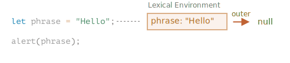

#### 실행 흐름 진행 → 렉시컬 환경 변화

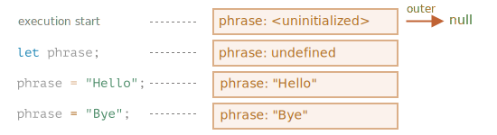

##### 1. 스크립트 시작 <sub>(execution start)</sub>
- 스크립트 내 선언 변수 전체
  - 전역 렉시컬 환경 내 로드
  - uninitialized <sub>(특수 내부 상태)</sub>
- JS 엔진
  - 변수 인지 · 참조 불가능 <sub>(`let` 등장 전)</sub>

##### 2. `let phrase` 등장 <sub>(값 할당 전)</sub>
- `phrase` <sub>(변수)</sub> 사용 가능
  - `undefined` <sub>(값)</sub>

##### 3. `phrase` 값 할당

##### 4. `phrase` 값 변경

<br />

 **렉시컬 환경 <sub>(명세서 개념)</sub>**

##### 이론상 객체 <sub>(명세서 내 동작 방식 설명)</sub>
- 직접 렉시컬 환경 접근 · 조작 불가능

##### 렉시컬 환경 최적화 수행 <sub>(JS 엔진)</sub>
- 명세서 언급 사항 준수
- 엔진 고유 방법 사용
  - 메모리 절약 <sub>(미사용 변수 제거 등)</sub>
  - 다양한 내부 트릭
  - 기타 등등

<br />

#### 단계 2. 함수 선언문

##### 함수 <sub>(== 값)</sub>
- 변수 초기화 과정 동일

##### 함수 선언문 선언 함수 <sub>(예외)</sub>
- 즉시 초기화 <sub>(선언 전 사용 가능 이유)</sub>
  - 렉시컬 환경 생성 직후 사용 가능
- 일반 변수
  - `let` 등장 <sub>(선언)</sub> 전 사용 불가능

##### 전역 렉시컬 환경 초기 상태 변화
- 스크립트 내 함수 추가

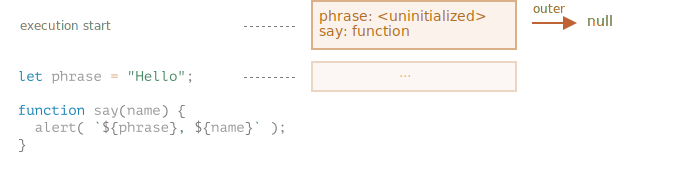

##### 함수 표현식 <sub>(함수 → 변수 할당)</sub> 미해당
- 변수 초기화 과정 동일
- ex\) `let f = function(…) { … }`

#### 단계 3. 내 · 외부 렉시컬 환경

##### 함수 생성 <sub>(선언 · 할당)</sub> 시
- 외부 렉시컬 환경 참조 저장

##### 함수 호출 <sub>(실행)</sub> 시
- 새 내부 렉시컬 환경 자동 생성
  - 함수 매개변수 저장
  - 함수 지역 변수 저장

##### 함수 호출 시 보유 렉시컬 환경
- 내부 렉시컬 환경 <sub>(호출 중인 함수 전용)</sub>
- 외부 렉시컬 환경 <sub>(참조)</sub>

#### `say("John")` <sub>(함수)</sub> 호출 시 내부 상태 변화

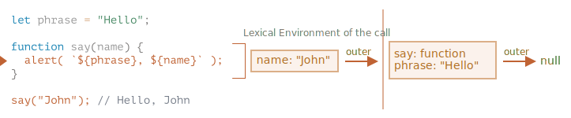

##### 내부 렉시컬 환경
- `say` <sub>(현재 실행 중인 함수)</sub> 상응
- 프로퍼티 1개 저장
  - `name` <sub>(함수 매개변수)</sub>
    - `"John"` <sub>(`say("John")` 반환 값)</sub>
- 외부 렉시컬 환경 <sub>(전역)</sub> 참조 저장

##### 외부 렉시컬 환경 <sub>(전역)</sub>
- 프로퍼티 2개 저장
  - `phrase` <sub>(변수)</sub>
  - `say` <sub>(함수)</sub>

#### 코드 내 변수 접근 과정

##### 1. 검색 순서
1. 내부 렉시컬 환경
2. 외부 렉시컬 환경 <sub>(참조 이용)</sub>
3. 전역 렉시컬 환경 도달까지 반복

##### 2. 전역 렉시컬 환경 도달 후 검색 실패 <sub>(변수 無)</sub>
- 엄격 모드
  - 에러
- 非엄격 모드
  - 새 전역 변수 생성 <sub>(하위 호환성)</sub>

#### `say(name)` <sub>(함수)</sub> 내 변수 접근

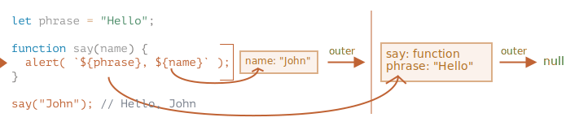

##### `name` <sub>(변수)</sub>
1. 내부 렉시컬 환경 검색
   - `name` <sub>(상응 프로퍼티)</sub> 有 <sub>(검색 성공)</sub>

##### `phrase` <sub>(변수)</sub>
1. 내부 렉시컬 환경 검색
   - `phrase` <sub>(상응 프로퍼티)</sub> 無 <sub>(검색 실패)</sub>
2. 외부 렉시컬 환경 검색 <sub>(참조 이용)</sub>
   - `phrase` <sub>(상응 프로퍼티)</sub> 有 <sub>(검색 성공)</sub>

#### 단계 4. 함수 반환 함수

##### `[[Environment]]` <sub>(숨김 프로퍼티)</sub>
- <sub>(함수 생성 당시)</sub> 렉시컬 환경 참조 저장
  - 함수 생성 시 값 설정 <sub>(이후 변경 X)</sub>

##### `makeCounter` <sub>(함수)</sub>
- 함수 반환
```javascript
function makeCounter() {
  let count = 0;

  return function() {
    return count++;
  };
}

let counter = makeCounter();
```

##### `makeCounter` <sub>(함수)</sub> 선언 시
- `makeCounter.[[Environment]]`
  - 외부 렉시컬 환경 <sub>(전역)</sub> 참조 저장

##### `makeCounter` <sub>(함수)</sub> 호출 시
- 매번 새 내부 렉시컬 환경 생성
  - 함수 실행 필요 변수들 저장
- 렉시컬 환경 2개 보유
  - 내부 렉시컬 환경 <sub>(`makeCounter` 함수)</sub>
  - 외부 렉시컬 환경 <sub>(전역)</sub> 참조

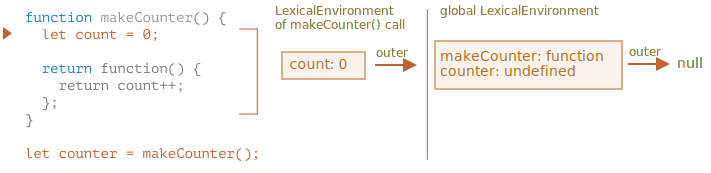

##### `makeCounter` <sub>(함수)</sub> 실행 중
- 중첩 함수 생성 <sub>(실행 X)</sub>
  - `function() {return count++;}`
- `counter.[[Environment]]`
  - 외부 렉시컬 환경 참조 저장
  - `{count: 0}` <sub>(`makeCounter` 함수 본문)</sub>

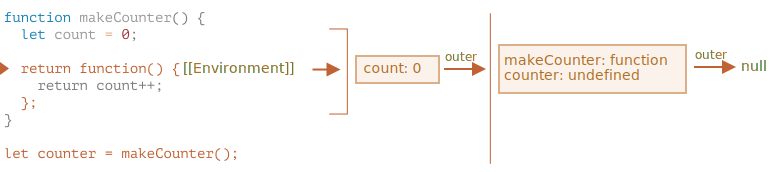

##### `counter` <sub>(중첩 함수)</sub> 호출 시
- 매번 새 내부 렉시컬 환경 생성
  - 함수 실행 필요 변수들 저장
- 렉시컬 환경 2개 보유
  - 내부 렉시컬 환경 <sub>(`counter` 중첩 함수)</sub>
  - 외부 렉시컬 환경 <sub>(`makeCounter`)</sub> 참조

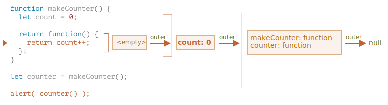

##### `phrase` <sub>(변수)</sub>
1. 내부 렉시컬 환경 검색
   - `phrase` <sub>(상응 프로퍼티)</sub> 無 <sub>(검색 실패)</sub>
2. 외부 렉시컬 환경 검색 <sub>(참조 이용)</sub>
   - `phrase` <sub>(상응 프로퍼티)</sub> 有 <sub>(검색 성공)</sub>
##### `counter` <sub>(중첩 함수)</sub> 실행 중
1. `count` <sub>(변수)</sub> 검색
   1. 자체 <sub>(내부)</sub> 렉시컬 환경
      - 상응 프로퍼티 無 <sub>(검색 실패)</sub>
   2. 외부 렉시컬 환경 <sub>(`{count: 0}`)</sub>
      - 상응 프로퍼티 有 <sub>(검색 성공)</sub>
2. `count++` 수행 <sub>(변수 저장 렉시컬 환경 내 실행)</sub>
   - 변숫값 갱신

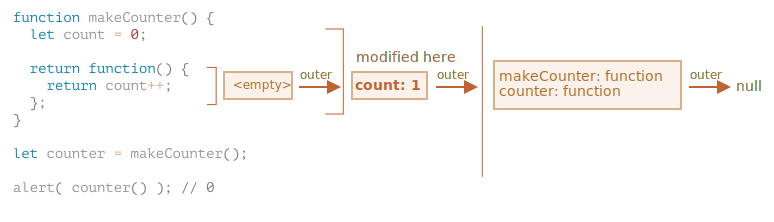

<br />

 **[클로저](https://en.wikipedia.org/wiki/Closure_(computer_programming))**

##### 외부 변수 기억 · 접근 가능 함수
- 일부 언어
  - 구현 불가능
  - 특수 방식 사용 필요
- JS
  - 모든 함수 해당 <sub>(예외 1개 有)</sub>

<br />

### 가비지 컬렉션

##### 함수 호출 종료 시
- 함수 대응 내부 렉시컬 환경 제거
  - 함수 관련 변수 전체 포함 <sub>(참조 불가능)</sub>
    - 도달 불가능 상태

##### 호출 종료 후 여전히 '도달 가능한' 중첩 함수
- `[[Environment]]` <sub>(숨김 프로퍼티)</sub>
  - 외부 함수 렉시컬 환경 참조 저장
    - '도달 가능한' 상태
- 함수 호출 종료 후
  - 외부 렉시컬 환경 메모리 내 유지
```javascript
function f() {
  let value = 123;

  return function() {
    alert(value);
  }
}

// g.[[Environment]]
// - f (함수) 내부 렉시컬 환경 (호출 시 생성) 정보 저장
let g = f();
```

##### 각 외부 함수 렉시컬 환경 메모리 내 유지 <sub>(주의)</sub>
- ex\) `f` <sub>(함수)</sub> 다수 호출 후 결과 저장 시
  - 각 `f` <sub>(함수)</sub> 렉시컬 환경 <sub>(호출 시 생성)</sub>
    - 전부 메모리 내 유지
```javascript
function f() {
  let value = Math.random();

  return function() { alert(value); };
}

// 배열 내 함수 3개
// - 각각 내부 렉시컬 (호출 시 생성) 환경 보유
let arr = [f(), f(), f()];
```

##### 렉시컬 환경 <sub>(객체)</sub>
- 도달 불가능 시 메모리 내 제거
- 참조 존재 시 메모리 내 유지
```javascript
function f() {
  let value = 123;

  return function() {
    alert(value);
  }
}

// g (함수) 메모리 내 유지 시
// - 연관 렉시컬 환경 (f 함수) 메모리 내 유지
let g = f();

// g (함수) 참조 제거 (도달 불가능 상태)
// - g (함수) 함수 · 연관 렉시컬 환경 (f 함수) 메모리 내 제거
g = null;
```

#### 최적화 프로세스

##### 이론
- 모든 외부 변수
  - 함수 살아있는 동안 메모리에 유지

##### 실제
- JS 엔진 : 계속 최적화
  - 변수 사용 분석
  - 외부 변수 미사용 판단 시
    - 메모리에서 제거

##### 디버깅 시
- 최적화 과정 중 제거된 변수
  - 사용 불가능
- V8 엔진 주요 부작용
  - Chrome
  - Opera
```javascript
function f() {
  let value = Math.random();

  function g() {

    // 이론상 value 접근 가능
    // 최적화 대상 되어 에러
    debugger; // Uncaught ReferenceError: value is not defined
  }

  return g;
}

let g = f();
g();
```

##### 외부 변수 최적화
- 흥미로운 디버깅 이슈 유발
```javascript
// 의도한 변수 대신 동명의 다른 외부 변수 출력
let value = "동일 변수명 · 다른 변수";

function f() {
  let value = "최근접 변수";

  function g() {

     // 콘솔 'alert(value);' 입력 시
     // - '동일 변수명 · 다른 변수' 출력
    debugger;
  }

  return g;
}

let g = f();
g();
```

##### V8 부작용 미리 인지 시 유용
- Chrome · Opera 디버깅 시 발생
  - 언젠가 이슈 접할 수 있음

<br />

##  과제

### 함수의 가장 최근 변경 값 접근 여부

##### `sayHi` <sub>(함수)</sub> 실행 시 사용 값 예측
- 외부 변수 <sub>(`name`)</sub> 사용
```javascript
let name = "John";

function sayHi() {
  alert("Hi, " + name);
}

name = "Pete";

// what will it show: "John" or "Pete"?
sayHi();
```

##### 브라우저 · 서버 개발 시 흔한 상황
- 함수
  - 생성 이후 어느 시점에 호출
- ex\)
  - 사용자 활동 후
  - 네트워크 요청 후
  - 기타 등등

<br />


#### `"Pete"`

##### `sayHi` <sub>(함수)</sub>
- 외부 변수 접근 시
  - 현재 <sub>(가장 최근)</sub> 값 접근
- 이전 값
  - 어딘가에 저장 X

<hr />

### 사용가능한 변수 맞추기

##### `makeWorker` <sub>(함수)</sub>
- 함수 생성 · 반환
- 반환 함수
  - 어딘가에서 호출 가능

##### 반환 함수 접근 값 예측
- `name` <sub>(변수)</sub>
```javascript
function makeWorker() {
  let name = "Pete";

  return function() {
    alert(name);
  };
}

let name = "John";

// 반환 함수 생성
let work = makeWorker();

// 반환 함수 호출
work();
```

<br />


#### `"Pete"`

##### `work` <sub>(함수)</sub>
- `name` <sub>(변수)</sub> 접근 시
  - 외부 렉시컬 환경 참조
    - `makeWorker` <sub>(함수)</sub>

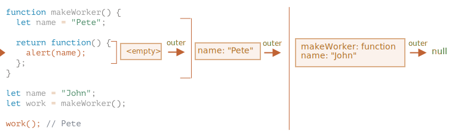

##### `makeWorker` <sub>(함수)</sub> 내 `let name` 부재 시
- 함수 외부 검색
  - 전역 변수 참조
    - `"John"`

<hr />

### counter 독립적 작동 여부

##### `makeCounter` <sub>(함수)</sub>
- conuter 함수 2개 생성
  - `counter`
  - `counter2`

##### 두 counter <sub>(함수)</sub> 독립적 작동 여부
```javascript
function makeCounter() {
  let count = 0;

  return function() {
    return count++;
  };
}

let counter = makeCounter();
let counter2 = makeCounter();

alert( counter() );  // 0
alert( counter() );  // 1

alert( counter2() ); // ?
alert( counter2() ); // ?
```

<br />


#### 독립적 작동

##### `counter` · `counter2` <sub>(함수)</sub>
- 각각 다른 `makeCounter` 호출 의해 생성
  - 독립적인 렉시컬 환경 보유
  - 자신만의 `count` <sub>(변수)</sub> 보유

<hr />

### `counter` <sub>(객체)</sub>

##### 코드 정상 작동 여부
- 생성자
  - `counter` <sub>(객체)</sub> 생성
```javascript
function Counter() {
  let count = 0;

  this.up = function() {
    return ++count;
  };
  this.down = function() {
    return --count;
  };
}

let counter = new Counter();

alert( counter.up() );   // ?
alert( counter.up() );   // ?
alert( counter.down() ); // ?
```

<br />


#### 정상 동작

##### 생성자 내 두 중첩 함수
- 동일 외부 렉시컬 환경 내 생성
  - 동일 `count` <sub>(변수)</sub> 공유
```javascript
function Counter() {
  let count = 0;

  this.up = function() {
    return ++count;
  };

  this.down = function() {
    return --count;
  };
}

let counter = new Counter();

alert( counter.up() );   // 1
alert( counter.up() );   // 2
alert( counter.down() ); // 1
```

<hr />

### if <sub>(문)</sub> 내 함수

##### 코드 실행 결과 예측
```javascript
let phrase = "Hello";

if (true) {
  let user = "John";

  function sayHi() {
    alert(`${phrase}, ${user}`);
  }
}

sayHi();
```

<br />


#### 에러 발생

##### `sayHi` <sub>(함수)</sub>
- `if` <sub>(문)</sub> 내 정의
  - `if` <sub>(문)</sub> 내에서만 접근할 가능
- `if` <sub>(문)</sub> 밖
  - 함수 부재

<hr />

### 클로저 이용하여 합 구하기

##### `sum` <sub>(함수)</sub> 작성
- `sum(a)(b) = a + b`
  - `(…)` <sub>(괄호)</sub> 2개
```javascript
sum(1)(2) = 3
sum(5)(-1) = 4
```

<br />


##### 1번째 `(…)` <sub>(괄호)</sub> : 함수 반환
```javascript
function sum(a) {

  return function(b) {

    // a
    // - 외부 렉시컬 환경에서 가져옴
    return a + b;
  };

}

alert( sum(1)(2) );  // 3
alert( sum(5)(-1) ); // 4
```

<hr />

### 변수 가시성

##### 코드 실행 결과 예측
```javascript
let x = 1;

function func() {
  console.log(x); // ?

  let x = 2;
}

func();
```

##### 주의
- 함정 有

<br />


### 에러 발생
```javascript
let x = 1;

function func() {
  console.log(x); // ReferenceError: Cannot access 'x' before initialization

  let x = 2;
}

func();
```

##### 변수 부재 vs 'uninitialized'
- 실행 흐름 : `{…}` <sub>(코드 블록)</sub> · 함수 진입 시
  - 변수 초기 상태 <sub>(`let` 문 도달 전까지)</sub>
    - 'uninitialized'
- 변수 존재 상태
  - `let` <sub>(문)</sub> 도달 전 사용 X
```javascript
function func() {
  /* 지역 변수 (x)
   함수 시작 시 엔진 인식
   - 'unitialized' 상태 (let 문 전까지)
     - 'dead zone'
   */

  console.log(x); // ReferenceError: Cannot access 'x' before initialization

  let x = 2;
}
```

##### 'dead zone'
- 변수 사용 불가능 구간
  - `{…}` <sub>(코드 블록)</sub> 시작 부분 ~ `let` <sub>(문)</sub>
<hr />

### 함수 이용해 원하는 값만 걸러내기

##### `arr.filter(f)` <sub>(배열 내장 메서드)</sub>
- 특정 요소 담은 배열 반환
  - `f` <sub>(함수형 인수)</sub> 반환 값 == `true`

#### `filter` 전달 가능 함수 작성 <sub>(2가지)</sub>

##### `inBetween(a, b)`
- `a` ≤ x ≤ `b`
- ex\) `arr.filter(inBetween(3,6))`
  - `3` ~ `6` 사이 값 반환

##### `inArray([…])`
- 배열 내 값 유무 여부
- ex\) `arr.filter(inArray([1,2,3]))`
  - `[1,2,3]` 내 존재 값만 반환
```javascript
/* 함수 작성
 inBetween
 inArray
 */

let arr = [1, 2, 3, 4, 5, 6, 7];

// 3,4,5,6
alert( arr.filter(inBetween(3, 6)) );

// 1,2
alert( arr.filter(inArray([1, 2, 10])) );
```

<br />


#### `inBetween` <sub>(함수)</sub>
```javascript
function inBetween(a, b) {
  return function(x) {
    return a <= x && x <= b;
  };
}

let arr = [1, 2, 3, 4, 5, 6, 7];

// 3,4,5,6
alert( arr.filter(inBetween(3, 6)) );
```

#### `inArray` <sub>(함수)</sub>
```javascript
function inArray(arr) {
  return function(x) {
    return arr.includes(x);
  };
}

let arr = [1, 2, 3, 4, 5, 6, 7];

// 1,2
alert( arr.filter(inArray([1, 2, 10])) );
```

[정답](https://plnkr.co/edit/EzBBfjjhTTbOX3WG?p=preview)

<hr />

### 필드 기준 정렬하기

##### 객체 배열
```javascript
let user = [
  {name: "John", age: 20, surname: "Johnson"},
  {name: "Pete", age: 18, surname: "Peterson"},
  {name: "Ann",  age: 19, surname: "Hathaway"},
];
```

##### 일반적인 정렬
```javascript
// 이름 기준 (Ann, John, Pete)
users.sort((a, b) => a.name > b.name ? 1 : -1);

// 나이 기준 (Pete, Ann, John)
users.sort((a, b) => a.age > b.age ? 1 : -1);
```

##### 정렬 함수 사용
- 코드 깔끔해짐
```javascript
users.sort(byField('name'));
users.sort(byField('age'));
```

##### `byField` <sub>(함수)</sub> 작성
- 필드 기준 정렬

<br />


```javascript
function byField(fieldName){
  return (a, b) => a[fieldName] > b[fieldName] ? 1 : -1;
}
```

[정답](https://plnkr.co/edit/dzWCOinTV321PrUr?p=preview)

<hr />

### 함수 사용해 군대 만들기

##### `shooters` <sub>(배열)</sub> 생성
- `shooter` <sub>(요소 · 함수)</sub>
  - 요소 순번 출력
  - 현재 정상 작동 X
```javascript
function makeArmy() {
  let shooters = [];

  let i = 0;
  while (i < 10) {

    // shooter (함수)
    let shooter = function() {

      // 요소 순번 출력
      alert( i );
    };
    shooters.push(shooter);
    i++;
  }

  return shooters;
}

let army = makeArmy();

army[0](); // 10
army[5](); // 10
```

##### 코드 수정
- 요소 순번 정상 출력

<br />


#### `makeArmy` <sub>(함수)</sub> 기존 실행 과정

##### 1. `[]` <sub>(빈 배열 · `shooters`)</sub> 생성
```javascript
let shooters = [];
```

##### 2. 반복문 사용해 배열 채워넣기
- `shooters.push(function…)`
- 모든 요소 == 함수
```javascript
shooters = [
  function () { alert(i); },
  function () { alert(i); },
  function () { alert(i); },
  function () { alert(i); },
  function () { alert(i); },
  function () { alert(i); },
  function () { alert(i); },
  function () { alert(i); },
  function () { alert(i); },
  function () { alert(i); }
];
```

##### 3. 함수 : 채워진 배열 <sub>(`shooters`)</sub> 반환
- 배열 요소 호출 == 함수 호출

##### 비정상 작동 이유
- 배열 요소 <sub>(함수)</sub>
  - 지역 변수 <sub>(`i`)</sub> X
  - `i` <sub>(변수)</sub> 접근 시
    - 외부 렉시컬 환경 검색

##### `i` <sub>(변수)</sub>
- `makeArmy` <sub>(함수)</sub> 렉시컬 환경 내 존재

##### `army[5]()` <sub>(함수 요소 호출)</sub> 시점
- `makeArmy` <sub>(함수)</sub> 작업 완료
  - `i` <sub>(변수)</sub> 값 : `10`

##### 모든 요소 <sub>(`shooter` 함수)</sub>
- 외부 렉시컬 환경 참조
  - `i` <sub>(변수)</sub> 마지막 값 <sub>(`10`)</sub> 참조

##### 방법 ⓐ
- `i` <sub>(변수)</sub> 위치 변경
  - 반복문 안
- `while` → `for`
```javascript
function makeArmy() {

  let shooters = [];

  for (let i = 0; i < 10; i++) {
    let shooter = function() {
      alert( i );
    };
    shooters.push(shooter);
  }

  return shooters;
}

let army = makeArmy();

army[0](); // 0
army[5](); // 5
```

##### 변수 위치 변경 후 정상 작동
- `(let i = 0 …) { … }` <sub>(각 반복문 코드 블록)</sub>
  - 새 렉시컬 환경 생성
    - `i` <sub>(변수)</sub> 저장

##### `i` <sub>(변수)</sub> 위치
- `makeArmy` <sub>(함수)</sub> 렉시컬 환경 X
- 각 반복문 `{…}` <sub>(블록)</sub> 렉시컬 환경

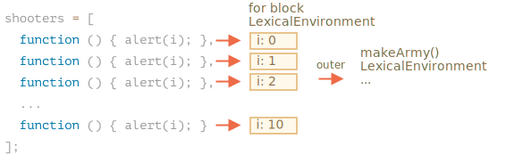

##### 방법 ⓑ
- 반복문 내 별도 변수 <sub>(`j`)</sub> 선언
```javascript
function makeArmy() {
  let shooters = [];

  let i = 0;
  while (i < 10) {
    let j = i;
    let shooter = function() {
      alert( j );
    };
    shooters.push(shooter);
    i++;
  }

  return shooters;
}

let army = makeArmy();

army[0](); // 0
army[5](); // 5
```

##### 반복문 `{…}` <sub>(블록)</sub>
- 매 반복마다 새 렉시컬 환경 생성

##### `let j = i`
- 각 반복문 본문
  - `j` <sub>(변수)</sub> 생성
    - 값 : `i` <sub>(변수)</sub> 값 복사

[정답](https://plnkr.co/edit/BOHSGwHNGbptajR2?p=preview)
