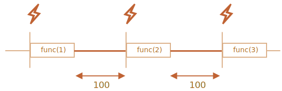

`set[Timeout·Interval]` <sub>(호출 스케줄링)</sub>
====

##### 호출 스케줄링 <sub>(관련 명세 無)</sub>
- 일정 시간 경과 후 함수 예약 실행 <sub>(호출)</sub>
- 대다수 JS 호스트 환경
  - 메서드 · 내부 스케줄러 지원

|메서드 <sub>(명세서 X)</sub>|함수 실행 시점|
|:---:|---|
|`setTimeout`|일정 시간 경과 후|
|`setInterval`|일정 시간 간격|


### `setTimeout` <sub>(메서드)</sub>
```javascript
let timerId = setTimeout(func|code, [delay], [arg1], [arg2], …)
```
- `func|code` <sub>(함수 · 문자열)</sub>
  - 실행 코드
  - 문자열 지양 <sub>(하위 호환성)</sub>
- `[delay]` <sub>(숫자)</sub>
  - 실행 전 지연시간
  - ms <sub>(단위)</sub>
  - `0` <sub>(기본값)</sub>
- `[arg1], [arg2], …`
  - 함수 전달 시 인수
  - IE9 이하 미지원
- 반환 값 <sub>(숫자)</sub>
  - 타이머 식별자
  - [timers section](https://www.w3.org/TR/html5/webappapis.html#timers) <sub>(HTML5)</sub> 준수

##### 1초 후 `sayHi()` 호출
```javascript
function sayHi() {
  alert('안녕하세요.');
}

// 안녕하세요. (1초 후)
setTimeout(sayHi, 1000);
```

##### 함수 인수 전달
```javascript
function sayHi(who, phrase) {
  alert( who + ' 님, ' + phrase );
}

// 홍길동 님, 안녕하세요. (1초 후)
setTimeout(sayHi, 1000, "홍길동", "안녕하세요.");
```

##### 문자열 형태 함수 <sub>(1번째 인수)</sub>
- 문자열 이용해 함수 생성 <sub>(지양)</sub>
```javascript
setTimeout("alert('안녕하세요.')", 1000);
```
- 화살표 함수 권장
```javascript
setTimeout(() => alert('안녕하세요.'), 1000);
```

<br />

 **함수 전달 <sub>(실행 X)</sub>**

##### 함수 뒤 `(…)` <sub>(괄호)</sub> 추가 시 반환 값 전달
```javascript
// 반환 값 無 (undefined 반환)
function sayHi() {
  alert('안녕하세요.');
}

// 함수 실행 결과 (undefined) 전달
// - 정상 동작 X
setTimeout(sayHi(), 1000);

// 함수 전달
// - 정상 동작
setTimeout(sayHi, 1000);
```

<br />

#### `clearTimeout` <sub>(스케줄링 취소 메서드)</sub>

##### `setTimeout` <sub>(메서드)</sub> 반환 값
- 타이머 식별자
  - 스케줄링 취소 시 사용
```javascript
let timerId = setTimeout(…);

clearTimeout(timerId);
```

##### 스케줄링 취소
- 코드 실행 시 변화 無
```javascript
let timerId = setTimeout(
  () => alert("아무런 일도 일어나지 않습니다."),
  1000
);

// 타이머 식별자
alert(timerId);

// 스케줄링 취소
clearTimeout(timerId);

// 취소 후 식별자 값 여전히 유효
alert(timerId);
```

##### 타이머 식별자 자료형
- 호스트 환경별 상이
  - ex\) Node.js
    - 타이머 객체

### `setInterval` <sub>(메서드)</sub>

```javascript
let timerId = setInterval(func|code, [delay], [arg1], [arg2], …)
```
- 함수 일정 간격 실행
- `setTimeout` <sub>(메서드)</sub> 문법 · 인수 동일

#### `clearInterval` <sub>(스케줄링 취소 메서드)</sub>
- `clearTimeout` <sub>(메서드)</sub> 동일
```javascript
// 2초 간격 메시지 출력
let timerId = setInterval(() => alert('째깍'), 2000);

// 5초 후 스케줄링 정지
setTimeout(
  () => { clearInterval(timerId); alert('정지'); },
  5000
);

// 1번째 얼럿 창 표시 후 몇 초 후 창 종료 시 2번째 얼럿 창 즉시 표시
// - 2초 (명시 지연시간) 보다 짧은 간격 표시 진행
```

 **창 표시 후에도 타이머 계속 진행**

##### 대다수 브라우저 <sub>(Chrome · Firefox 등)</sub>
- 별도 창 표시 후 내부 타이머 계속 진행
  - `alert` <sub>(함수)</sub>
  - `confirm` <sub>(함수)</sub>
  - `prompt` <sub>(함수)</sub>
  - 기타 등등

### 중첩 `setTimeout` <sub>(메서드)</sub>

##### 일정 간격 함수 실행 방법 <sub>(2가지)</sub>
- a. `setInterval` <sub>(메서드)</sub>
```javascript
let timerId = setInterval(
  () => alert('째깍'),
  2000
);
```
- b. 중첩 `setTimeout` <sub>(메서드)</sub>
```javascript
let timerId = setTimeout(function tick() {
  alert('째깍');

  timerId = setTimeout(tick, 2000);
}, 2000);
```

##### 중첩 `setTimeout` <sub>(메서드)</sub>
- `setInterval` <sub>(메서드)</sub> 대비 유연성 ↑
  - 호출 결과 따라 다음 호출 조정 가능
```javascript
// 5초 간격 서버 요청 전송 후 데이터 수신
// - 서버 과부하 상태 시 요청 간격 ↑
//   - 10 · 20 · 40초 등
let delay = 5000;
let timerId = setTimeout(function request() {

  /* … 요청 전송 … */

  if (서버 과부하로 인한 요청 실패) {
    delay *= 2; // 요청 전송 간격 ↑
  }

  timerId = setTimeout(request, delay);
}, delay);
```

##### CPU 소모 多 작업 주기적 실행 시 유용
- 작업 소모 시간 따라 다음 작업 유동적 계획

### 지연 간격

#### `setInterval` <sub>(메서드)</sub>

##### 지연 간격 보장 X
- 함수 실행 소모 시간
  - 지연 간격 내 포함
- 함수 호출 사이 지연 간격
  - 실제 명시 값 대비 ↓
```javascript
let i = 1;

setInterval(function() {
  func(i++);
}, 100);
```


##### 명시 지연 간격 시간 \< 함수 실행 소모 시간
- 함수 종료 대기
- 함수 종료 시 스케줄러 확인
  - 지연시간 경과 시 다음 호출 즉시 시작
    - 함수 계속 연속 호출

#### 중첩 `setTimeout` <sub>(메서드)</sub>

##### 지연 간격 보장
- 이전 함수 실행 종료 후
  - 다음 함수 호출 계획 수립

```javascript
let i = 1;

setTimeout(function run() {
  func(i++);

  setTimeout(run, 100);
}, 100);
```



<br />

 **가비지 컬렉션**

##### `set[Timeout·Interval]` 전달 함수
- 함수 내부 참조 생성 후 스케줄러 내 저장
  - 가비지 컬렉션 대상 X
- `setTimeout` <sub>(메서드)</sub>
  - 호출 · 취소 전까지 유지
- `setInterval` <sub>(메서드)</sub>
  - 취소 전까지 유지
```javascript
 setTimeout(function() { … }, 100);
setInterval(function() { … }, 100);
```

#### 부작용

##### 전달 함수 내 외부 렉시컬 환경 참조
- 함수 · 외부 변수 메모리 내 유지
  - 메모리 사용량 ↑
- 스케줄링 불필요 함수
  - 취소 필수

<br />

### 지연시간 0 `setTimeout` <sub>(메서드)</sub>

##### 실행 방법
```javascript
setTimeout(func);
setTimeout(func, 0);
```

##### 효과
- 현재 실행 중인 스크립트 처리 종료 후
  - '가능한 한 빨리' 함수 실행

##### 용도
- 현재 스크립트 실행 종료 직후 함수 실행
```javascript
/* 지연시간 0 setTimeout (메서드)
 계획표 기록
 - '0밀리초 후 함수 호출하기'
 스케줄러
 - 현재 스크립트 (alert("Hello")) 실행 후 계획표 확인
 */
setTimeout(() => alert("World"));

alert("Hello");

// 얼럿 창 출력 순서
// 1. "Hello"
// 2. "World"
```

<br />

 **브라우저 환경 실제 지연시간 ≠ 0**

##### 브라우저 제약 <sub>([HTML5 표준](https://ko.javascript.info/settimeout-setinterval) 중첩 타이머 실행 간격 관련)</sub>
- 5번째 중첩 타이머 <sub>(`set[Timeout·Interval]`)</sub> 후
  - 최소 4ms 이상 지연 강제
- 일부 구식 스크립트 제약 의존
  - 명세서 변경 불가능
```javascript
let start = Date.now();
let times = []; // 기준 시점

setTimeout(function run() {

  // 시차 기록 (지연 실행 시점 - 기준 시점)
  times.push(Date.now() - start);

  // 100ms 초과 시 중단 후 기록 출력
  if (start + 100 < Date.now()) {
    alert(times);

  // 100ms 이하 시 재스케줄링 (중첩 setTimeout 메서드)
  } else {
    setTimeout(run);
  }
});

// 1,1,1,1,9,15,20,24,30,35,40,45,50,55,59,64,70,75,80,85,90,95,100
```

##### 서버 제약 無
- 비동기 작업 시 강제 지연 X
- ex\) Node.js
  - [`process.nextTick`](https://nodejs.org/api/process.html)
  - [`setImmediate`](https://nodejs.org/api/timers.html)

<br />

요약
====

##### `set[Timeout·Interval]` <sub>(메서드)</sub>
```javascript
 setTimeout(func, delay, …args)
setInterval(func, delay, …args)
```
- `delay` <sub>(ms)</sub> 후 `func` <sub>(함수형 인수)</sub> 실행
  - 1번 <sub>(`setTimeout`)</sub>
  - 규칙적 <sub>(`setInterval`)</sub>
- 반환 값 <sub>(타이머 식별자 · 숫자)</sub>
  - 스케줄링 취소 시 사용

##### `clear[Timeout·Interval]` <sub>(메서드)</sub>
- 스케줄링 취소 <sub>(타이머 식별자 사용)</sub>

##### 중첩 `setTimeout` <sub>(메서드)</sub>
- `setInterval` <sub>(메서드)</sub> 대비 유연성 ↑
- 지연 간격 보장

##### 지연시간 0 `setTimeout` <sub>(메서드)</sub>
- 현재 실행 중인 스크립트 처리 종료 후
  - '가능한 한 빨리' 함수 실행
```javascript
setTimeout(func);
setTimeout(func, 0);
```

##### 지연시간 0 중첩 타이머 <sub>(`set[Timeout · Interval]`)</sub>
- 5번째 중첩 타이머 <sub>(지연시간 0)</sub> 이후
  - 최소 4ms 이상 지연 강제
- 중첩 타이머
  - 중첩 `setTimeout`
  - `setInterval`

##### 최소 4ms 이상 강제 지연 발생 경우
- 지연시간 0 중첩 `setTimeout` <sub>(메서드)</sub>
  - 5회 이상 호출
- 지연시간 0 `setInterval`<sub>(메서드)</sub>
  - 5회 이상 호출
- 브라우저 적용 사항
  - 하위 호환성

#### 명시 지연 간격 미보장 가능성 有

##### 미보장 상황
- CPU 과부하 상태
- 브라우저 탭
  - 백그라운드 모드
- 노트북 구동
  - 배터리 의존

##### 최소 지연시간 <sub>(ms)</sub>
- 300 ~ 1,000
- 브라우저 · 구동 운영 체제 성능 설정 따라 상이

<br />

##  과제

### 일초 간격으로 숫자 출력하기

##### `printNumbers(from, to)` <sub>(함수)</sub> 작성
- `from` ~ `to` 사이 숫자 출력
  - 숫자 간 1초 간격
- 2가지 방법 사용
  1. `setInterval` <sub>(메서드)</sub>
  2. 중첩 `setTimeout` <sub>(메서드)</sub>

<br />


##### `setInterval` <sub>(메서드)</sub>
```javascript
function printNumbers(from, to) {
  let current = from;

  let timerId = setInterval(function() {

    alert(current);

    if (current == to) {
      clearInterval(timerId);
    }

    current++;

  }, 1000);
}

printNumbers(5, 10);
```

중첩 `setTimeout` <sub>(메서드)</sub>
```javascript
function printNumbers(from, to) {
  let current = from;

  setTimeout(function go() {

    alert(current);

    if (current < to) {
      setTimeout(go, 1000);
    }

    current++;
  }, 1000);
}

printNumbers(5, 10);
```

##### 공통점
- 최초 호출 이전 <sub>(1번째 얼럿 창 표시 전)</sub>
  - 1,000ms 지연 간격 존재

##### 초기 지연시간 없이 바로 실행
- 별도 줄에서 함수 호출
```javascript
function printNumbers(from, to) {
  let current = from;

  // 함수 정의
  function go() {

    alert(current);

    if (current == to) {
      clearInterval(timerId);
    }

    current++;
  }

  // 별도 줄에서 함수 초기 호출
  go();
  let timerId = setInterval(go, 1000);
}

printNumbers(5, 10);
```

<hr />

### `setTimeout` 은 무엇을 보여줄까요?

##### 호출 스케줄링 코드 <sub>(`setTimeout` 메서드)</sub>
- 실행 시간 ≥ 100ms
  - 무거운 작업 수행

##### `setTimeout` <sub>(메서드)</sub> 전달 함수 실행 시점 맞추기
1. 반복문 실행 전
2. 반복문 실행 시
3. 반복문 실행 후

##### 얼럿 창 출력값 맞추기
```javascript
let i = 0;

setTimeout(() => alert(i), 100); // ?

// 반복문 다 도는 데 걸리는 시간
// - 100ms 이상 가정
for (let j = 0; j < 100000000; j++) {
  i++;
}
```

<br />


##### `setTimeout` <sub>(메서드)</sub> 실행 시점
- 현재 실행 중인 코드 종료 후 실행
- 반복문 실행 후 `i` <sub>(변수)</sub> 값
  - `100000000`

##### 얼럿 창 출력값
- `100000000`
```javascript
let i = 0;

setTimeout(() => alert(i), 100); // 100000000

for (let j = 0; j < 100000000; j++) {
  i++;
}
```
