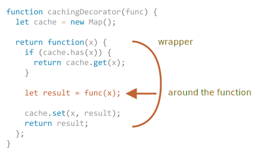
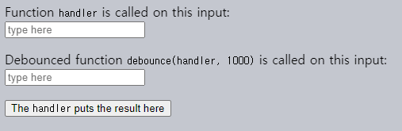

데코레이터 · 컨텍스트 지정 · 포워딩
====

### 코드 변경 없이 캐싱 기능 추가

##### 데코레이터 <sub>(decorator)</sub>
- 함수 행동 변경 함수

##### `slow(x)` <sub>(함수)</sub>
- '안정적인' 함수 <sub>(변수 동일 시 결과 동일)</sub>
- CPU 소모량 多
  - 자주 호출 시 소모 자원 · 시간 ↑
    - 캐싱 필요 <sub>(재연산 횟수 ↓)</sub>
- 캐싱 기능 추가
  - 함수 내부 관련 코드 추가 X
  - 래퍼 함수 사용

##### `cachingDecorator(func)` <sub>(데코레이터)</sub>
- `func` <sub>(함수)</sub> 대상 캐싱 기능 추가
```javascript
function slow(x) {

  /* …CPU 집약적인 작업 수행… */
  alert(`slow(${x}) 호출`);

  return x;
}

// 데코레이터 (함수)
// - 기존 함수 (func) 전달
// - 캐싱 래퍼 (함수) 반환
function cachingDecorator(func) {
  let cache = new Map();

  return function(x) {

    // cache 내 특정 키 (x) 유무 여부 확인
    if (cache.has(x)) {

      // cache 내 특정 키 (x) 대응 값 반환
      return cache.get(x);
    }

    // cache 내 특정 키 (x) 부재 시 func (기존 함수) 호출
    let result = func(x);

    // 기존 함수 호출 결과 캐싱 (저장)
    cache.set(x, result);

    return result;
  };
}

slow = cachingDecorator(slow);

slow(1); // 캐시 내 slow(1) 호출 호출 저장
slow(1); // 캐시 내 결괏값 반환

slow(2); // 캐시 내 slow(2) 호출 결과 저장
slow(2); // 캐시 내 결괏값 반환
```



##### `cachingDecorator(func)` <sub>(데코레이터)</sub>
- 모든 함수 전달 가능
- `function(x)` <sub>(캐싱 래퍼 함수)</sub> 반환
- 적용 방법 단순 <sub>(함수 전달)</sub>
  - 캐싱 기능 추가 용이
- 코드 분리 <sub>(간결성 ↑)</sub>
  - 함수 코드
  - 캐싱 코드

##### `function(x)` <sub>(캐싱 래퍼 함수)</sub>
- `func(x)` <sub>(기존 함수)</sub> 호출 후
  - 결괏값 대상 캐싱 로직 적용 <sub>(감싸기)</sub>

#### 독립 래퍼 함수 <sub>(기존 함수 수정 X)</sub> 이점

##### a. 재사용성 ↑
- 모든 함수 적용 가능
- 사용법 단순

##### b. 복잡성 ↓
- 코드 <sub>(로직)</sub> 분리
  - 기존 함수 코드 <sub>(간결성 ↑)</sub>
  - 추가 기능 관련 코드

##### c. 다수 데코레이터 조합 가능
- 순차 적용

### 데코레이터 내 함수 컨텍스트

##### 객체 내 메서드 컨텍스트
- 타 위치 전달 시 유실 발생
```javascript
let obj = {
  someMethod() { … },

  // 타 위치 전달 시 this 컨텍스트 유실
  // - this == undefined
  otherMethod() {
    return this.someMethod();
  },
};

// otherMethod (메서드) 변수 할당
// - 메서드 내 this 컨텍스트 유실 (undefined)
let func = obj.otherMethod;

func(); // 에러 (this == undefined)
```

##### 일반 데코레이터 <sub>(함수)</sub>
- 객체 내 메서드 적용 부적합
  - `this` 컨텍스트 유실 발생
```javascript
let worker = {
  someMethod() {
    return 1;
  },

  slow(x) {

    /* …CPU 집약적인 작업 수행… */
    alert(`slow(${x}) 호출`);

    // 객체 내 메서드 대상 래퍼 적용 시
    // - this 컨텍스트 유실 (this == undefined)
    return x * this.someMethod();
  },
};

function cachingDecorator(func) {
  let cache = new Map();

  return function(x) {
    if (cache.has(x)) {
      return cache.get(x);
    }

    // 기존 함수 (객체 내 메서드) 호출
    let result = func(x);

    cache.set(x, result);

    return result;
  };
}

// 객체 내 기존 메서드 정상 동작
worker.slow(1);

// 캐싱 데코레이터 적용
worker.slow = cachingDecorator(worker.slow);

// 래퍼 함수 실행 시 에러
worker.slow(2); // Error: Cannot read property 'someMethod' of undefined
```

### [`function.call`](https://developer.mozilla.org/ko/docs/Web/JavaScript/Reference/Global_Objects/Function/call) <sub>(내장 메서드)</sub>

##### 문법
```javascript
func.call(context, arg1, arg2, …)
```
- `context`
  - `func` <sub>(함수)</sub> 내 `this`
- `arg1, arg2, …`
  - `func` <sub>(함수)</sub> 전달 인수

##### 함수 내 `this` 명시적 고정
```javascript
// this == undefined
func(1, 2, 3);

// this == obj (고정)
func.call(obj, 1, 2, 3);
```

##### `sayHi` <sub>(함수)</sub>
- 상이 컨텍스트 적용
```javascript
function sayHi() {
  alert(this.name);
}

let user  = {name: "John"};
let admin = {name: "Admin"};

// this 컨텍스트 (객체) 고정
sayHi.call(user);  // John  (this == user  객체)
sayHi.call(admin); // Admin (this == admin 객체)
```

##### `say(phrase)` <sub>(함수)</sub>
- 상이 컨텍스트 적용
- 인수 1개 <sub>(`phrase`)</sub> 전달
```javascript
function say(phrase) {
  alert(this.name + ': ' + phrase);
}

let user = {name: "John"};

// this 컨텍스트 (객체) 고정
// - this == user (객체)
// - "Hello" (1번째 인수) 전달
say.call(user, "Hello"); // John: Hello
```

### 다수 인수 전달
```javascript
// 캐싱 예시
// - 다수 인수 전달
let worker = {
  slow(min, max) {

    // CPU 집약적인 작업 가정
    return min + max;
  }
};

// 동일 인수 전달 시
// - 호출 결과 기억 (캐싱)
worker.slow = cachingDecorator(worker.slow);
```

#### 다수 키 저장 방법

##### 1. 다수 키 지원 자료구조 <sub>(`Map` 유사)</sub> 구현

##### 2. 중첩 `Map`
- `(max, result)` 쌍 저장
  - `cache.set(min)`
- `result`
  - `cache.get(min).get(max)`

##### 3. 두 값 하나로 합치기 <sub>(`Map`)</sub>
- 키
  - `"min,max"` <sub>(문자열)</sub>
- 다수 값 → 1개 값
  - 해싱 함수 구현 <sub>(유연성 ↑)</sub>

<br />

##### 다수 인수 <sub>(`...` 스프레드 문법)</sub>
- `func.call(this, ...arguments)`
```javascript
let worker = {

  // CPU 집약적인 작업 가정
  slow(min, max) {
    alert(`slow(${min},${max}) 호출`);
    return min + max;
  }
};

function cachingDecorator(func, hash) {
  let cache = new Map();
  return function() {

    // arguments
    // - 인수 담은 유사 배열 (이터러블 객체)
    let key = hash(arguments);
    if (cache.has(key)) {
      return cache.get(key);
    }

    // this 고정 · 인수 전달
    let result = func.call(this, ...arguments);

    cache.set(key, result);
    return result;
  };
}

function hash(args) {
  return args[0] + ',' + args[1];
}

// 반환 함수 → 객체 내 프로퍼티 할당 (메서드)
worker.slow = cachingDecorator(worker.slow, hash);

// 정상 동작
alert( worker.slow(3, 5) );

// 동일 결과
alert( "다시 호출: " + worker.slow(3, 5) );
```

### [`function.apply`](https://developer.mozilla.org/ko/docs/Web/JavaScript/Reference/Global_Objects/Function/apply) <sub>(내장 메서드)</sub>

##### 문법
```javascript
func.apply(context, args)
```
- `context`
  - `func` <sub>(함수)</sub> 내 `this`
- `args`
  - 유사 배열 객체

##### `this` 명시적 고정
- `function.call` 동일 기능
```javascript
func.call(context, ...args);
func.apply(context, args);
```

#### `call` vs `apply`

##### `call`
- 인수
  - 개별
- `...` <sub>(전개 구문)</sub> 사용
  - `args` <sub>(이터러블 객체)</sub> 분해 후 전달

##### `apply`
- 인수
  - 유사 배열 객체
- 배열 형태 인수만 받음

##### 배열 <sub>(이터러블 · 유사 배열 객체)</sub>
- `call` · `apply` 둘 다 사용 가능
- 대다수 JS 엔진
  - `apply` 최적화
  - `apply` 좀 더 빠름

#### 콜 포워딩 <sub>(call forwarding)</sub>
- 컨텍스트 · 인수 전체
  - 다른 함수에 전달
```javascript
/* 가장 간단한 콜 포워딩 형태 */
let wrapper = function() {
  return func.apply(this, arguments);
};
```

##### 외부에서 `wrapper` 호출 시
- `func` <sub>(기존 함수)</sub> 호출과 명확하게 구분 X

### 메서드 빌리기

##### 캐싱 예시 해싱 함수 개선
```javascript
function hash(args) {
  return args[0] + ',' + args[1];
}
```

##### 요소 개수 상관없이 합치기
```javascript
function hash(args) {

  /* args (arguments)
   유사 배열 · 이터러블 (객체)
   배열 X
   - 배열 메서드 X
   */

  return args.join(); // Error: arguments.join is not a function
}
```

##### 메서드 빌리기
```javascript
function hash() {
  [].join.call(arguments); // 1,2
}

hash(1, 2);
```
1. `[].join`
    - 일반 배열 메서드
2. `[].join.call(arguments);`
    - 컨텍스트 <sub>(this)</sub> → `arguments` 고정
    - `join` <sub>(메서드)</sub> 호출

##### `arr.join(glue)` <sub>(네이티브 메서드)</sub> 내부 알고리즘
1. 1번째 인수 <sub>(`glue`)</sub>
    - 존재 시
      - `glue` 사용
    - 부재 시
      - `,` 사용
2. `result`
    - `""` <sub>(빈 문자열)</sub> 초기화
3. `this[0]`
    - `result` 에 덧붙임
4. `glue` + `this[1]`
    - `result` 에 덧붙임
5. `glue` + `this[2]`
    - `result` 에 덧붙임
6. 항목 <sub>(`this.length`)</sub> 모두 추가될 때까지 반복
7. `result` 반환

##### 기존 `call` 방식 유사
- `this` 받은 후
  - `this[0]` · `this[1]` 등 합쳐짐
- 어떤 유사 배열이든 가능
- 상당수 메서드
  - 이런 관습 따름

### 데코레이터 · 함수 내 프로퍼티

##### 데코레이터로 함수 · 메서드 감싸 대체하기
- 대체적으로 안전

#### 원본 함수 내 프로퍼티
- 데코레이터 적용 시
  - 프로퍼티 사용 지양 <sub>(불안전)</sub>
- ex\) `slow` <sub>(캐싱 예시 함수)</sub>
  - 프로퍼티 보유 시
    - 래퍼 : 프로퍼티 사용 X

##### 일부 데코레이터
- 자신만의 프로퍼티 보유
- 다수 정보 저장
  - 함수 호출 횟수
  - 호출 시 소모 시간
  - 기타 등등

##### 함수 내 프로퍼티 접근 가능 데코레이터
- `Proxy`

<br />

요약
====

##### 데코레이터
- 함수 감싸는 래퍼
  - 함수 행동 변화
- 주요 작업
  - 기존 함수 처리
- 함수에 추가된 '기능' · '상' <sub>(aspect)</sub>
- 1개 · 다수 데코레이터 추가 시
  - 함수 코드 변경 X

#### `cachingDecorator` <sub>(데코레이터)</sub> 구현

##### [`func.call(context, arg1, arg2…)`](https://developer.mozilla.org/ko/docs/Web/JavaScript/Reference/Global_Objects/Function/call)
- `func` 호출
  - `this` → `context` 할당
- `func` 인수
  - `arg1, arg2…` <sub>(개별)</sub>
    - 이터러블 전개 가능

##### [`func.apply(context, args)`](https://developer.mozilla.org/ko/docs/Web/JavaScript/Reference/Global_Objects/Function/apply)
- `func` 호출
  - `this` → `context` 할당
- `func` 인수
  - `args` <sub>(유사 배열 객체)</sub>
    - 배열 형태 가능

##### 콜 포워딩
- 보통 `apply` 사용해 구현
```javascript
let wrapper = function() {
  return original.apply(this, arguments);
};
```

##### 메서드 빌리기
1. 특정 객체에서 메서드 가져오기
2. 다른 객체 → 컨텍스트 고정
3. 함수 호출 <sub>(`call`)</sub>
- 흔한 사용
  - 배열 메서드 → `arguments` 적용

<br />

##  과제

### 스파이 데코레이터

##### `spy(func)` <sub>(데코레이터)</sub> 작성
- 함수 호출 정보 저장
  - `calls` <sub>(프로퍼티)</sub>
  - 인수 배열 형태
```javascript
function work(a, b) {
  alert( a + b );
}

work = spy(work);

work(1, 2);
work(4, 5);

for (let args of work.calls) {

  // "call:1,2", "call:4,5"
  alert( 'call:' + args.join() );
}
```

##### 참고
- 스파이 데코레이터
  - 유닛 테스팅 시 유용
- [Sinon.JS](https://sinonjs.org/) <sub>(라이브러리)</sub>
  - `sinon.spy`

<br />


##### `spy(f)` <sub>(데코레이터)</sub>
- 모든 인수 저장
- 콜 포워딩
  - `f.apply` 사용
```javascript
function spy(func) {

  function wrapper(...args) {

    /* ...args 사용 (arguments X)
     진짜 배열 저장
     - wrapper.calls
     arguments
     - 유사 배열 객체 (배열 X)
     */
    wrapper.calls.push(args);
    return func.apply(this, args);
  }

  wrapper.calls = [];

  return wrapper;
}
```

[정답](https://plnkr.co/edit/POzbW11w6PNUZ7ro?p=preview)

<hr />

### 지연 데코레이터

##### `delay(f, ms)` <sub>(데코레이터)</sub> 작성
- `f` <sub>(함수형 인수)</sub> 호출 `ms` <sub>(ms)</sub> 지연
- 반환 함수
  - `f` <sub>(함수형 인수)</sub> 변형 버전
```javascript
function f(x) {
  alert(x);
}

// 래퍼 생성
let f1000 = delay(f, 1000);
let f1500 = delay(f, 1500);

f1000("test"); // 1000ms 후 "test" 출력
f1500("test"); // 1500ms 후 "test" 출력
```

##### 조건
- `f` <sub>(함수형 인수)</sub>
  - 모든 인수 · 컨텍스트 <sub>(`this`)</sub> 전달

<br />


```javascript
function delay(f, ms) {

  return function() {
    setTimeout(() => f.apply(this, arguments), ms);
  };

}

// 래퍼 생성
let f1000 = delay(f, 1000);
let f1500 = delay(f, 1500);

f1000("test"); // 1000ms 후 "test" 출력
f1500("test"); // 1500ms 후 "test" 출력
```

##### 래퍼 내 화살표 함수
- `this` · `arguments` X
- `f.apply(this, arguments)`
  - 래퍼의 `this` · `arguments` 사용

##### 래퍼 내 일반 함수 사용 시
- `setTimeout` <sub>(메서드)</sub>
  - `arguments` X
  - `this = window` <sub>(컨텍스트)</sub>
- 중간 변수 필요
  - 귀찮은 작업
```javascript
function delay(f, ms) {

  return function(...args) {

    // this (컨텍스트) 저장
    let savedThis = this;

    setTimeout(function() {
      f.apply(savedThis, args);
    }, ms);
  };

}
```

[정답](https://plnkr.co/edit/fhgkOsofTgF05rCQ?p=preview)

<hr />

### 디바운싱 데코레이터

##### `debounce(f, ms)` <sub>(데코레이터)</sub> 작성
- `f` <sub>(함수형 인수)</sub> 연속 호출 시
  - `ms` <sub>(ms)</sub> 후 호출
    - 가장 최근 인수 사용

##### ex\) `f = debounce(f, 1000)`
- `f` <sub>(함수형 인수)</sub> 3번 <sub>(0 · 200 · 500ms)</sub> 호출 시
  - 1500ms 후 한 번만 호출
  - 마지막 호출 후 1000ms 후 호출
  - 가장 최근 인수 사용


##### ex\) [Lodash](https://lodash.com/docs/4.17.15#debounce) <sub>(라이브러리)</sub> 함수
```javascript
let f = _.debounce(alert, 1000);

f("a");
setTimeout( () => f("b"), 200);
setTimeout( () => f("c"), 500);

// 마지막 호출 후 1000ms 후 함수 호출 (가장 최근 인수 사용)
// - alert("c")
```

##### 실제 사용 사례
- 사용자 입력 완료 시
  - 서버에 요청 전송
- 문자 입력 시 매번 전송 X
  - 입력 완료 대기 후 전송
- 이벤트 핸들러 설정 <sub>(브라우저)</sub>
  - `input` 필드 변화 발생 시 호출
    - 보통 입력 때마다 호출
- 디바운싱 <sub>(1000ms)</sub> 적용 시
  - 마지막 입력 후 1000ms 후 한 번 호출



##### 디바운싱
- 일련의 이벤트 처리 시 유용
  - 키 입력
  - 마우스 이동
  - 기타 등등
- 마지막 호출 후 일정 시간 대기 후 호출

<br />


##### 래퍼 반환
- 기존 `setTimeout` <sub>(메서드)</sub> 취소
- `ms` <sub>(ms)</sub> 후 `func` <sub>(기존 함수)</sub> 호출
```javascript
function debounce(func, ms) {
  let timeout;

  return function() {
    clearTimeout(timeout);
    timeout = setTimeout(() => func.apply(this, arguments), ms);
  };
}
```

[정답](https://plnkr.co/edit/5CRbYP6L0kJjuYEZ?p=preview)

<hr />

### 쓰로틀 데코레이터

##### `throttle(f, ms)` <sub>(데코레이터)</sub> 작성
- 다수 호출 시
  - `f` <sub>(함수형 인수)</sub> 로 호출 전달
    - `ms` <sub>(ms)</sub> 당 최대 1번

#### 디바운싱 vs 쓰로틀

##### 디바운싱
- 일정 시간 후 단 한 번 호출
- 마지막 결과 처리 시 유용

##### 쓰로틀
- 일정 시간 당 한 번 씩 호출
- 정기적 갱신 시 유용
  - 너무 빈번한 빈도 X

#### 실제 사용 사례

##### 마우스 이동 추적 <sub>(이벤트 핸들러)</sub>
- 마우스 이동 때마다
  - 포인터 위치 정보 얻음
- 마우스 사용 시
  - 매우 자주 핸들러 호출
    - ex\) 초당 100번

##### 포인터 이동 시 페이지 내 특정 정보 갱신 상황
- `update()` <sub>(갱신 함수)</sub>
  - 무거운 작업 수행
    - 자주 실행 X

##### `throttle(update, 100)` <sub>(데코레이터)</sub>
- `update` <sub>(갱신 함수)</sub> 로 호출 전달
  - 100ms 당 최대 1번
1. 첫 마우스 이동
    - 바로 호출 전달
2. 그 다음 마우스 이동
    - 100ms 이내 호출 전달 X <sub>(무시)</sub>
3. 100ms 후
    - 호출 한 번 전달
      - 가장 최근 좌표
4. 마우스 이동 정지
    - 100ms 대기 후 마지막 호출 전달
      - 마지막 좌표
```javascript
function f(a) {
  console.log(a);
}

// 1000ms 당 최대 1번 호출 전달
let f1000 = throttle(f, 1000);

f1000(1); // 1
f1000(2); // 쓰로틀 중
f1000(3); // 쓰로틀 중

// 1000ms 후
// - 3 표시
//   - 중간 호출 (2) 무시
```

##### 참고
- 인수 · 컨텍스트 <sub>(`this`)</sub>
  - `f` <sub>(기존 함수)</sub> 전달

<br />


```javascript
function throttle(func, ms) {

  let isThrottled = false,
    savedArgs,
    savedThis;

  function wrapper() {

    // ②
    if (isThrottled) {
      savedArgs = arguments;
      savedThis = this;
      return;
    }

    // ①
    func.apply(this, arguments);

    isThrottled = true;

    setTimeout(function() {

      // ③
      isThrottled = false;
      if (savedArgs) {
        wrapper.apply(savedThis, savedArgs);
        savedArgs = savedThis = null;
      }
    }, ms);
  }

  return wrapper;
}
```

#### 과정

##### 1. 첫 호출 시
1. `func` <sub>(기존 함수)</sub> 호출
2. 스로틀 상태 설정
    - `isThrottled = true`

##### 2. 호출 정보 <sub>(인수 · 컨텍스트)</sub> 저장
- `saved[Args·This]` <sub>(변수)</sub>

##### 3. `ms` <sub>(ms)</sub> 후 `setTimeout` <sub>(메서드)</sub> 실행
- 스로틀 상태 제거
  - `isThrottled = false`
- 래퍼 실행
  - 마지막 호출 인수 · 컨텍스트 정보 사용
- `func` <sub>(기존 함수)</sub> 실행 X
  - 스로틀 상태 설정 필요
  - `setTimeout` <sub>(메서드)</sub> 설정 필요
    - 스로틀 상태 초기화

[정답](https://plnkr.co/edit/3jpeXB7loFZo0F0R?p=preview)
