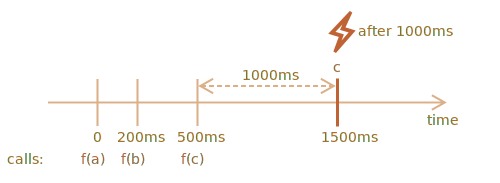

`call` · `apply`  · 데코레이터 · 포워딩
=============================

### 코드 변경 없이 캐싱 기능 추가

##### `slow(x)` <sub>(함수)</sub>
- CPU 소모량 크지만 '안정적인' 함수
- '안정적인' 함수
  - 변수 동일 시 호출 결과 동일
- 래퍼 함수 생성해 캐싱 기능 추가
  - 함수 내부 캐싱 관련 코드 추가 X
```javascript
function slow(x) {

  // CPU 집약적인 작업 가정
  alert(`slow(${x}) 호출`);
  return x;
}

/* 데코레이터 (decorator)
 캐싱 래퍼 반환
 func (인수 함수)
 - 기존 함수
 */
function cachingDecorator(func) {
  let cache = new Map();

  return function(x) {

    // cache 에 해당 키 존재 시
    if (cache.has(x)) {

      // 대응 값 cache 에서 읽기
      return cache.get(x);
    }

    // cache 에 해당 키 부재 시 func (인수 함수) 호출
    let result = func(x);

    // 그 결과 캐싱 (저장)
    cache.set(x, result);
    return result;
  };
}

slow = cachingDecorator(slow);

alert( slow(1) ); // slow(1) 결과 저장
alert( slow(1) ); // 캐시 결과 반환

alert( slow(2) ); // slow(2) 결과 저장
alert( slow(2) ); // 캐시 결과 반환
```


##### `cachingDecorator(func)` 호출 시
- `function(x)` <sub>(래퍼)</sub> 반환

##### `function(x)` <sub>(래퍼)</sub>
- `func(x)` <sub>(기존 함수)</sub> 호출 결과
  - 캐싱 로직으로 wrapping

#### 독립된 래퍼 함수 이점

##### 재사용
- 원하는 함수 어디에든 적용 가능

##### 캐싱 로직 분리
- 기존 함수 <sub>(`slow`)</sub> 자체 복잡성 증가 X
- 캐싱 관련 코드 · 함수 코드 분리
- 함수 코드 간결성 ↑

##### 필요 시 여러 데코레이터 조합 · 사용
- 추가 데코레이터
  - 기존 데코레이터 뒤 따름

### `func.call` <sub>(컨텍스트 지정)</sub>
- 캐싱 데코레이터 객체 <sub>(위 예제)</sub>
  - 메서드 사용 부적합
```javascript
let worker = {
  someMethod() {
    return 1;
  },

  // 객체 메서드
  slow(x) {

    // CPU 집약적인 작업 가정
    alert(`slow(${x}) 호출`);

    // 레퍼에서 메서드 호출 시
    // - this : undefined
    return x * this.someMethod();
  }
};

function cachingDecorator(func) {
  let cache = new Map();
  return function(x) {
    if (cache.has(x)) {
      return cache.get(x);
    }

    // 레퍼에서 메서드 호출
    let result = func(x);
 // let result = func.call(this, x);

    cache.set(x, result);
    return result;
  };
}

// 기존 메서드 정상 동작
alert( worker.slow(1) );

// 캐싱 데코레이터 적용
worker.slow = cachingDecorator(worker.slow);

// Error: Cannot read property 'someMethod' of undefined
alert( worker.slow(2) );
```

#### `func.call(context, …args)`
- `this` 명시적으로 고정
```javascript
func.call(context, arg1, arg2, …)
```
- `context`
  - `func` <sub>(함수)</sub> 의 `this`
- `arg1, arg2, …`
  - `func` <sub>(함수)</sub> 전달 인수
```javascript
func(1, 2, 3);

// this → obj 고정
func.call(obj, 1, 2, 3);
```
```javascript
function sayHi() {
  alert(this.name);
}

let user = { name: "John" };
let admin = { name: "Admin" };

// call 사용
// - 원하는 객체 : 'this' 설정
// this == john (객체)
sayHi.call( user );

// this == admin (객체)
sayHi.call( admin );
```
```javascript
function say(phrase) {
  alert(this.name + ': ' + phrase);
}

let user = { name: "John" };

// this : user (객체)
// 인수 : "Hello"
say.call( user, "Hello" ); // John: Hello
```

### 여러 인수 전달
```javascript
// 캐싱 예시
// - 인수 여러 개 전달
let worker = {
  slow(min, max) {

    // CPU 집약적인 작업 가정
    return min + max;
  }
};

// 동일 인수 전달 시
// - 호출 결과 기억 (캐싱)
worker.slow = cachingDecorator(worker.slow);
```

#### 복수 키 저장 방법

##### 1. 복수 키 지원 자료구조 <sub>(맵 유사)</sub> 구현

##### 2. 중첩 맵
- `(max, result)` 쌍 저장
  - `cache.set(min)`
- `result`
  - `cache.get(min).get(max)`

##### 3. 두 값 하나로 합치기 <sub>(맵)</sub>
- 키
  - `"min,max"` <sub>(문자열)</sub>
- 여러 값 → 1개 값
  - 해싱 함수 구현 <sub>(유연성 ↑)</sub>

<br />

##### 복수 인수 <sub>(`...` 스프레드 문법)</sub>
- `func.call(this, ...arguments)`
```javascript
let worker = {

  // CPU 집약적인 작업 가정
  slow(min, max) {
    alert(`slow(${min},${max}) 호출`);
    return min + max;
  }
};

function cachingDecorator(func, hash) {
  let cache = new Map();
  return function() {

    // arguments
    // - 인수 담은 유사 배열 (이터러블 객체)
    let key = hash(arguments);
    if (cache.has(key)) {
      return cache.get(key);
    }

    // this 고정 · 인수 전달
    let result = func.call(this, ...arguments);

    cache.set(key, result);
    return result;
  };
}

function hash(args) {
  return args[0] + ',' + args[1];
}

// 반환 함수 → 객체 프로퍼티 (메서드) 할당
worker.slow = cachingDecorator(worker.slow, hash);

alert( worker.slow(3, 5) ); // 정상 동작
alert( "다시 호출: " + worker.slow(3, 5) ); // 동일 결과
```

### `func.apply`
```javascript
func.apply(context, args)
```
- `context`
  - `func` <sub>(함수)</sub> 의 `this`
- `args`
  - 유사 배열 객체
```javascript
/* 동일 */
func.call(context, ...args);
func.apply(context, args);
```

#### `call` vs `apply`

##### `call`
- 인수
  - 개별
- `...` <sub>(전개 구문)</sub> 사용
  - `args` <sub>(이터러블 객체)</sub> 분해 후 전달

##### `apply`
- 인수
  - 유사 배열 객체
- 배열 형태 인수만 받음

##### 배열 <sub>(이터러블 · 유사 배열 객체)</sub>
- `call` · `apply` 둘 다 사용 가능
- 대부분 JS 엔진
  - `apply` 최적화
  - `apply` 좀 더 빠름

#### 콜 포워딩 <sub>(call forwarding)</sub>
- 컨텍스트 · 인수 전체
  - 다른 함수에 전달
```javascript
/* 가장 간단한 콜 포워딩 형태 */
let wrapper = function() {
  return func.apply(this, arguments);
};
```

##### 외부에서 `wrapper` 호출 시
- `func` <sub>(기존 함수)</sub> 호출과 명확하게 구분 X

### 메서드 빌리기

##### 캐싱 예시 해싱 함수 개선
```javascript
function hash(args) {
  return args[0] + ',' + args[1];
}
```

##### 요소 개수 상관없이 합치기
```javascript
function hash(args) {

  /* args (arguments)
   유사 배열 · 이터러블 (객체)
   배열 X
   - 배열 메서드 X
   */

  // Error: arguments.join is not a function
  return args.join();
}
```

##### 메서드 빌리기
```javascript
function hash() {
  [].join.call(arguments); // 1,2
}

hash(1, 2);
```
1. `[].join`
    - 일반 배열 메서드
2. `[].join.call(arguments);`
    - 컨텍스트 <sub>(this)</sub> → `arguments` 고정
    - `join` <sub>(메서드)</sub> 호출

##### `arr.join(glue)` <sub>(네이티브 메서드)</sub> 내부 알고리즘
1. 1번째 인수 <sub>(`glue`)</sub>
    - 존재 시
      - `glue` 사용
    - 부재 시
      - `,` 사용
2. `result`
    - `""` <sub>(빈 문자열)</sub> 초기화
3. `this[0]`
    - `result` 에 덧붙임
4. `glue` + `this[1]`
    - `result` 에 덧붙임
5. `glue` + `this[2]`
    - `result` 에 덧붙임
6. 항목 <sub>(`this.length`)</sub> 모두 추가될 때까지 반복
7. `result` 반환

##### 기존 `call` 방식 유사
- `this` 받은 후
  - `this[0]` · `this[1]` 등 합쳐짐
- 어떤 유사 배열이든 가능
- 상당수 메서드
  - 이런 관습 따름

### 데코레이터 · 함수 프로퍼티

##### 데코레이터로 함수 · 메서드 감싸 대체하기
- 대체적으로 안전

#### 원본 함수 프로퍼티
- 데코레이터 적용 시
  - 프로퍼티 사용 X <sub>(안전 X)</sub>
- ex&#41; `slow` <sub>(캐싱 예시 함수)</sub>
  - 프로퍼티 보유 시
    - 래퍼 : 프로퍼티 사용 X

##### 일부 데코레이터
- 자신만의 프로퍼티 보유
- 여러 정보 저장
  - 함수 호출 횟수
  - 호출 시 소모 시간
  - 기타 등등

##### 함수 프로퍼티 접근 가능 데코레이터
- `Proxy`

<br />

## 요약

##### 데코레이터
- 함수 감싸는 래퍼
  - 함수 행동 변화
- 주요 작업
  - 기존 함수 처리
- 함수에 추가된 '기능' · '상' <sub>(aspect)</sub>
- 하나 · 여러 개 데코레이터 추가 시
  - 함수 코드 변경 X

#### `cachingDecorator` <sub>(데코레이터)</sub> 구현

##### [`func.call(context, arg1, arg2…)`](https://developer.mozilla.org/ko/docs/Web/JavaScript/Reference/Global_Objects/Function/call)
- `func` 호출
  - `this` → `context` 할당
- `func` 인수
  - `arg1, arg2…` <sub>(개별)</sub>
    - 이터러블 전개 가능

##### [`func.apply(context, args)`](https://developer.mozilla.org/ko/docs/Web/JavaScript/Reference/Global_Objects/Function/apply)
- `func` 호출
  - `this` → `context` 할당
- `func` 인수
  - `args` <sub>(유사 배열 객체)</sub>
    - 배열 형태 가능

##### 콜 포워딩
- 대개 `apply` 사용해 구현
```javascript
let wrapper = function() {
  return original.apply(this, arguments);
};
```

##### 메서드 빌리기
1. 특정 객체에서 메서드 가져오기
2. 다른 객체 → 컨텍스트 고정
3. 함수 호출 <sub>(`call`)</sub>
- 흔한 사용
  - 배열 메서드 → `arguments` 적용

<br />

##  과제

### 스파이 데코레이터

##### `spy(func)` <sub>(데코레이터)</sub> 작성
- 함수 호출 정보 저장
  - `calls` <sub>(프로퍼티)</sub>
  - 인수 배열 형태
```javascript
function work(a, b) {
  alert( a + b );
}

work = spy(work);

work(1, 2);
work(4, 5);

for (let args of work.calls) {

  // "call:1,2", "call:4,5"
  alert( 'call:' + args.join() );
}
```

##### 참고
- 스파이 데코레이터
  - 유닛 테스팅 시 유용
- [Sinon.JS](https://sinonjs.org/) <sub>(라이브러리)</sub>
  - `sinon.spy`

<br />


##### `spy(f)` <sub>(데코레이터)</sub>
- 모든 인수 저장
- 콜 포워딩
  - `f.apply` 사용
```javascript
function spy(func) {

  function wrapper(...args) {

    /* ...args 사용 (arguments X)
     진짜 배열 저장
     - wrapper.calls
     arguments
     - 유사 배열 객체 (배열 X)
     */
    wrapper.calls.push(args);
    return func.apply(this, args);
  }

  wrapper.calls = [];

  return wrapper;
}
```

[정답](https://plnkr.co/edit/POzbW11w6PNUZ7ro?p=preview)

<hr />

### 지연 데코레이터

##### `delay(f, ms)` <sub>(데코레이터)</sub> 작성
- `f` <sub>(인수 함수)</sub> 호출 `ms` <sub>(밀리초)</sub> 지연
- 반환 함수
  - `f` <sub>(인수 함수)</sub> 변형 버전
```javascript
function f(x) {
  alert(x);
}

// 래퍼 생성
let f1000 = delay(f, 1000);
let f1500 = delay(f, 1500);

f1000("test"); // 1000ms 후 "test" 출력
f1500("test"); // 1500ms 후 "test" 출력
```

##### 조건
- `f` <sub>(인수 함수)</sub>
  - 모든 인수 · 컨텍스트 <sub>(`this`)</sub> 전달

<br />


```javascript
function delay(f, ms) {

  return function() {
    setTimeout(() => f.apply(this, arguments), ms);
  };

}

// 래퍼 생성
let f1000 = delay(f, 1000);
let f1500 = delay(f, 1500);

f1000("test"); // 1000ms 후 "test" 출력
f1500("test"); // 1500ms 후 "test" 출력
```

##### 래퍼 내 화살표 함수
- `this` · `arguments` X
- `f.apply(this, arguments)`
  - 래퍼의 `this` · `arguments` 사용

##### 래퍼 내 일반 함수 사용 시
- `setTimeout` <sub>(함수)</sub>
  - `arguments` X
  - `this = window` <sub>(컨텍스트)</sub>
- 중간 변수 필요
  - 귀찮은 작업
```javascript
function delay(f, ms) {

  return function(...args) {

    // this (컨텍스트) 저장
    let savedThis = this;

    setTimeout(function() {
      f.apply(savedThis, args);
    }, ms);
  };

}
```

[정답](https://plnkr.co/edit/fhgkOsofTgF05rCQ?p=preview)

<hr />

### 디바운싱 데코레이터

##### `debounce(f, ms)` <sub>(데코레이터)</sub> 작성
- `f` <sub>(인수 함수)</sub> 연속 호출 시
  - `ms` <sub>(밀리초)</sub> 후 호출
    - 가장 최근 인수 사용

##### ex&#41; `f = debounce(f, 1000)`
- `f` <sub>(인수 함수)</sub>
  - 0 · 200 · 500ms <sub>(3번)</sub> 호출 시
    - 1500ms 후 한 번만 호출
    - 마지막 호출 후 1000ms 후 호출
    - 가장 최근 인수 사용



##### ex&#41; [Lodash](https://lodash.com/docs/4.17.15#debounce) <sub>(라이브러리)</sub> 함수
```javascript
let f = _.debounce(alert, 1000);

f("a");
setTimeout( () => f("b"), 200);
setTimeout( () => f("c"), 500);

// 마지막 호출 후 1000ms 후 함수 호출 (가장 최근 인수 사용)
// - alert("c")
```

##### 실제 유스케이스
- 사용자 입력 완료 시
  - 서버 요청 전송
- 매 문자 입력 시 전송 X
  - 입력 완료 대기 후 전송
- 이벤트 핸들러 설정 <sub>(브라우저)</sub>
  - `input` 필드 변화 발생 시 호출
    - 대개 매 입력 마다 호출
- 디바운싱 <sub>(1000ms)</sub> 적용 시
  - 마지막 입력 후 1000ms 후 한 번만 호출

In this live example, the handler puts the result into a box below, try it:


See? The second input calls the debounced function, so its content is processed after 1000ms from the last input.

So, `debounce` is a great way to process a sequence of events: be it a sequence of key presses, mouse movements or something else.

It waits the given time after the last call, and then runs its function, that can process the result.

The task is to implement `debounce` decorator.

Hint: that's just a few lines if you think about it

<br />


```javascript
function debounce(func, ms) {
  let timeout;
  return function() {
    clearTimeout(timeout);
    timeout = setTimeout(() => func.apply(this, arguments), ms);
  };
}
```
A call to `debounce` returns a wrapper. When called, it schedules the original function call after given `ms` and cancels the previous such timeout.

[정답](https://plnkr.co/edit/5CRbYP6L0kJjuYEZ?p=preview)

<hr />

### Throttle decorator
Create a "throttling" decorator `throttle(f, ms)` – that returns a wrapper.

When it's called multiple times, it passes the call to `f` at maximum once per `ms` milliseconds.

The difference with debounce is that it's completely different decorator:
- `debounce` runs the function once after the "cooldown" period. Good for processing the final result.
- `throttle` runs it not more often than given `ms` time. Good for regular updates that shouldn't be very often.

In other words, `throttle` is like a secretary that accepts phone calls, but bothers the boss (calls the actual `f`) not more often than once per `ms` milliseconds.

Let's check the real-life application to better understand that requirement and to see where it comes from.

**For instance, we want to track mouse movements.**

In a browser we can setup a function to run at every mouse movement and get the pointer location as it moves. During an active mouse usage, this function usually runs very frequently, can be something like 100 times per second (every 10 ms). **We'd like to update some information on the web-page when the pointer moves.**

…But updating function `update()` is too heavy to do it on every micro-movement. There is also no sense in updating more often than once per 100ms.

So we'll wrap it into the decorator: use `throttle(update, 100)` as the function to run on each mouse move instead of the original `update()`. The decorator will be called often, but forward the call to `update()` at maximum once per 100ms.

Visually, it will look like this:
1. For the first mouse movement the decorated variant immediately passes the call to `update`. That's important, the user sees our reaction to their move immediately.
2. Then as the mouse moves on, until `100ms` nothing happens. The decorated variant ignores calls.
3. At the end of `100ms` – one more `update` happens with the last 4coordinates.
. Then, finally, the mouse stops somewhere. The decorated variant waits until `100ms` expire and then runs `update` with last coordinates. So, quite important, the final mouse coordinates are processed.

A code example:
```javascript
function f(a) {
  console.log(a);
}

// f1000 passes calls to f at maximum once per 1000 ms
let f1000 = throttle(f, 1000);

f1000(1); // shows 1
f1000(2); // (throttling, 1000ms not out yet)
f1000(3); // (throttling, 1000ms not out yet)

// when 1000 ms time out...
// ...outputs 3, intermediate value 2 was ignored
```

P.S. Arguments and the context `this` passed to `f1000` should be passed to the original `f`.

<br />


```javascript
function throttle(func, ms) {

  let isThrottled = false,
    savedArgs,
    savedThis;

  function wrapper() {

    if (isThrottled) { // (2)
      savedArgs = arguments;
      savedThis = this;
      return;
    }

    func.apply(this, arguments); // (1)

    isThrottled = true;

    setTimeout(function() {
      isThrottled = false; // (3)
      if (savedArgs) {
        wrapper.apply(savedThis, savedArgs);
        savedArgs = savedThis = null;
      }
    }, ms);
  }

  return wrapper;
}
```

A call to `throttle(func, ms)` returns wrapper.

1. During the first call, the `wrapper` just runs `func` and sets the cooldown state (`isThrottled = true`).
2. In this state all calls are memorized in `savedArgs`/`savedThis`. Please note that both the context and the arguments are equally important and should be memorized. We need them simultaneously to reproduce the call.
3. After `ms` milliseconds pass, `setTimeout` triggers. The cooldown state is removed (`isThrottled = false`) and, if we had ignored calls, `wrapper` is executed with the last memorized arguments and context.

The 3rd step runs not `func`, but `wrapper`, because we not only need to execute `func`, but once again enter the cooldown state and setup the timeout to reset it.

[정답](https://plnkr.co/edit/3jpeXB7loFZo0F0R?p=preview)
