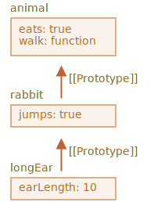

프로토타입 상속
====

##### 프로토타입 상속 <sub>(JS)</sub>
- 기존 기능 확장
  - 개발 시 매우 유용

|기본 객체|확장 <sub>(기능 추가)</sub> 객체|
|:---:|:---:|
|`user`|`admin`|
||`guest`|

### `[[Prototype]]`

##### JS 객체 내부 숨김 프로퍼티 <sub>(명세서)</sub>
- 객체 참조 값 저장 <sub>(미참조 시 `null`)</sub>
  - 참조 대상 == 프로토타입 <sub>(prototype)</sub>


##### 프로토타입 상속 <sub>(동작 방식)</sub>
- 객체 내 부재 프로퍼티 접근 시
  - 프로토타입 내 자동 검색

##### `__proto__` <sub>(접근자 프로퍼티)</sub>
- `[[Prototype]]` <sub>(숨김 프로퍼티)</sub> 값 접근 · 설정
```javascript
let animal = {
  eats: true
};

let rabbit = {
  jumps: true
};

// __proto__ 값 설정
rabbit.__proto__ = animal;
```

<br />

 **`[[Prototype]]` ≠ `__proto__`**

##### `[[Prototype]]` <sub>(숨김 프로퍼티)</sub>
- 프로토타입 참조

##### `__proto__` <sub>(접근자 프로퍼티)</sub>
- `[[Prototype]]` 값 접근 · 설정 <sub>(\[g·s\]etter)</sub>

##### `[[Prototype]]` <sub>(숨김 프로퍼티)</sub> 설정 방법
- a. `__proto__` <sub>(접근자 프로퍼티)</sub>
  - 과거 방법
- b. `Object.[g·s]etPrototypeOf` <sub>(메서드)</sub>
  - 최신 방법

##### 특징
- 명세서
  - 브라우저 환경만 지원
- 실제
  - 모든 호스트 환경 지원

<br />

##### `rabbit` <sub>(객체)</sub> → `animal` <sub>(객체)</sub> 상속
- `rabbit` <sub>(자식 객체)</sub> 내 부재 프로퍼티 접근 시
   - `animal` <sub>(부모 객체)</sub> 내 자동 검색
```javascript
let animal = {
  eats: true
};

let rabbit = {
  jumps: true
};

// rabbit.[[Prototype]] → animal (객체) 참조
// - rabbit (객체) → animal (객체) 상속
rabbit.__proto__ = animal;

// rabbit (자식 객체) 내 eats (부재 프로퍼티) 접근 시
// - rabbit.[[prototype]] (animal 객체) 검색 후 사용
rabbit.eats;  // true
rabbit.jumps; // true
```


##### 상속 프로퍼티
- 프로토타입 통해 상속받은 프로퍼티
```javascript
let animal = {
  eats: true,
  walk() {
    alert("동물이 걷습니다.");
  }
};

let rabbit = {
  jumps: true,
  __proto__: animal
};

// walk (상속 메서드)
// - rabbit (자식 객체) 내 無
//   - animal (부모 객체) 검색 후 호출
rabbit.walk(); // 동물이 걷습니다.
```


##### 프로토타입 체인
- 더 깊은 상속 단계 형성 가능

##### `longEar` → `rabbit` → `animal` <sub>(객체)</sub> 상속
```javascript
let animal = {
  eats: true,
  walk() {
    alert("동물이 걷습니다.");
  }
};

let rabbit = {
  jumps: true,

  // rabbit (객체) → animal (객체) 상속
  __proto__: animal
};

let longEar = {
  earLength: 10,

  // longEar (객체) → rabbit (객체) 상속
  __proto__: rabbit
};

// longEar → rabbit → animal
longEar.walk(); // 동물이 걷습니다.

// longEar → rabbit
alert(longEar.jumps); // true
```



##### 프로토타입 체인 제약사항 <sub>(3가지)</sub>
- a. 순환 참조 불허
  - 타 객체 닫힌 형태 참조 시 에러
- b. `__proto__` 값 자료형 제한
  - 객체 · `null` 만 가능
  - 타 자료형 무시
- c. 단일 `[[Prototype]]` <sub>(숨김 프로퍼티)</sub>
  - 객체 당 1개 → 단일 상속
    - 다수 상속 불가능

### 프로토타입 == 읽기 전용

##### 프로토타입
- 프로퍼티 읽기 연산만 가능
- 프로퍼티 추가 · 수정 · 삭제 연산 불가능
  - 객체 대상 직접 실행 필요

##### 중복 상속 프로퍼티
- 자식 객체 내 프로퍼티 사용
```javascript
let animal = {
  eats: true,
  walk() {
    alert("동물이 걷습니다.");
  }
};

let rabbit = {

  // rabbit (객체) → animal (객체) 상속
  __proto__: animal
};

// rabbit (자식 객체) 내 walk (메서드) 직접 할당
// - 상속 메서드 중복
rabbit.walk = function() {
  alert("토끼가 깡충깡충 뜁니다.");
};

// rabbit.walk() (중복 상속 메서드) 호출 시
// - 프로토타입 (animal 객체) 내 메서드 미사용
// - rabbit (자식 객체) 내 직접 추가한 메서드 실행
rabbit.walk(); // 토끼가 깡충깡충 뜁니다.
```


##### 접근자 프로퍼티 상속
- setter <sub>(값 설정 함수)</sub> 호출 시
  - ㄴ
```javascript
let user = {
  name: "John",
  surname: "Smith",

  // setter (값 설정)
  // - this.[sur]name 값 수정
  set fullName(value) {
    [this.name, this.surname] = value.split(" ");
  },

  // getter (값 접근)
  // - this.sur[name] 값 조합 문자열 반환
  get fullName() {
    return `${this.name} ${this.surname}`;
  }
};

let admin = {
  __proto__: user,
  isAdmin: true
};

// getter (프로토타입 내 함수) 실행
// - 프로토타입 (user 객체) 내 프로퍼티 값 접근
alert(admin.fullName); // John Smith

// setter (프로토타입 내 함수) 실행
// - admin (자식 객체) 내 [sur]name (프로퍼티) 추가
admin.fullName = "Alice Cooper";

// getter (프로토타입 내 함수) 실행
// - admin (자식 객체) 내 프로퍼티 값 접근
alert(admin.fullName); // Alice Cooper

// getter (객체 내 자체 함수) 실행
// - user (객체) 내 프로퍼티 값 접근
alert(user.fullName);  // John Smith
```

##### 자식 객체 : `setter` 할당 연산 <sub>(`set fullName`)</sub>
- 프로토타입 `setter` <sub>(함수)</sub> 호출
- `user` <sub>(부모 객체)</sub> 프로퍼티 추가 X

### `this` 의미

##### `this` : 프로토타입 영향 無
- 메서드 호출 주체 <sub>(객체 · 프로토타입)</sub> 무관
  - 항상 `.` <sub>(점)</sub> 앞 객체
- `setter` <sub>(함수)</sub> 호출 시 `this` 값
  - `admin` <sub>(자식 객체)</sub>
  - `user` <sub>(부모 객체)</sub> X

##### 거대 부모 객체
- 한 객체 내 다수 메서드 구현
  - 다수 객체 상속
- 상속받은 메서드 사용 시
  - 객체 자신 상태 수정
  - 프로토타입 수정 X
```javascript
// animal (부모 객체)
// - 다양한 메서드 구현
let animal = {
  walk() {
    if (!this.isSleeping) {
      alert(`동물이 걸어갑니다.`);
    }
  },
  sleep() {
    this.isSleeping = true;
  }
};

let rabbit = {
  name: "하얀 토끼",
  __proto__: animal
};

// rabbit (자식 객체)
// - isSleeping (새 프로퍼티) 추가
rabbit.sleep();

// true
alert(rabbit.isSleeping);

// undefined
alert(animal.isSleeping);
```


##### 상속받은 객체들
- 프로토타입 구현 메서드 사용 가능

##### 상속받은 메서드 내 `this`
- `.` <sub>(점)</sub> 앞 객체 <sub>(메서드 호출 시점)</sub>
  - 해당 객체 상태 변화
  - 프로토타입 변화 X
- 즉
  - 메서드 공유
  - 객체 상태 공유 X

### `for…in` <sub>(반복문)</sub>

##### 상속 프로퍼티
- 순회대상 포함
```javascript
let animal = {
  eats: true
};

let rabbit = {
  jumps: true,
  __proto__: animal
};

// jumps
// - Object.keys
//   - 상속 프로퍼티 배제
alert(Object.keys(rabbit));

// jumps, eats
// - for…in
//   - 상속 프로퍼티 포함
for (let prop in rabbit) alert(prop);
```

##### `obj.hasOwnProperty(key)`
- 상속 프로퍼티
  - `false` 반환
- `obj` <sub>(객체)</sub> 내 구현 프로퍼티
  - `true` 반환
- 응용
  - 상속 프로퍼티 걸러냄
```javascript
let animal = {
  eats: true
};

let rabbit = {
  jumps: true,
  __proto__: animal
};

for (let prop in rabbit) {
  let isOwn = rabbit.hasOwnProperty(prop);

  // 객체 자신 프로퍼티
  // - jumps
  if (isOwn) {
    alert(`객체 자신의 프로퍼티: ${prop}`);

  // 상속 프로퍼티
  // - eats
  } else {
    alert(`상속 프로퍼티: ${prop}`);
  }
}
```


##### `{…}` <sub>(객체 리터럴)</sub> 방식 선언 시
- `Object.prototype` 상속

##### `Object.prototype` 내 모든 메서드
- `enumerable: false` <sub>(플래그)</sub> 설정
  - 'non-enumerable'
  - `for…in` 배제

<br />

 **키 · 값 쌍 순회 메서드 <sub>(대다수)</sub> : 상속 프로퍼티 배제**

- 프로토타입 상속 프로퍼티 배제
- 해당 객체 내 정의 프로퍼티만 포함
- ex\)
  - `Object.keys`
  - `Object.values`
  - 기타 등등

<br />

요약
====

##### `[[Prototype]]` <sub>(숨김 프로퍼티)</sub>
- 객체 · `null` 참조
- 참조 객체
  - 프로토타입
- `__proto__`
  - 프로토타입 접근 <sub>(\[g·s\]etter)</sub>
  - 최근 사용 빈도 ↓

##### 객체 내 프로퍼티 · 메서드 접근 · 부재 시
- 프로토타입 검색
- 데이터 프로퍼티 쓰기 · 지우기 관련 연산
  - 프로토타입 X
  - 객체에 직접 적용

##### 프로토타입 상속 메서드 `this`
- 호출 대상 객체 <sub>(부모 객체 X)</sub>
- ex\) `obj.method()` <sub>(`method` 상속)</sub>
  - `this` == `obj`

#### 프로퍼티 순회

##### `for…in` <sub>(반복문)</sub>
- 상속 프로퍼티 포함

##### 키 · 값 관련 내장 메서드 <sub>(대다수)</sub>
- 상속 프로퍼티 제외

<br />

##  과제

### 프로토타입 이해하기

##### 얼럿 창 출력값 예측
- 객체 2개 이용해 쌍 생성 · 수정
```javascript
let animal = {
  jumps: null
};
let rabbit = {
  __proto__: animal,
  jumps: true
};

alert( rabbit.jumps ); // ? ①

delete rabbit.jumps;

alert( rabbit.jumps ); // ? ②

delete animal.jumps;

alert( rabbit.jumps ); // ? ③
```

<br />


##### 1. `true`
- `rabbit` <sub>(객체)</sub> 에서 가져옴

##### 2. `null`
- `animal` <sub>(객체)</sub> 에서 가져옴

##### 3. `undefined`
- 더 이상 프로퍼티 찾을 수 없음

<hr />

### 검색 알고리즘
```javascript
let head = {
  glasses: 1
};

let table = {
  pen: 3
};

let bed = {
  sheet: 1,
  pillow: 2
};

let pockets = {
  money: 2000
};
```

##### 1. 프로퍼티 조회 경로 설정
- 경로 순서
  1. `pockets`
  2. `bed`
  3. `table`
  4. `head`
- `__proto__` 사용
- ex\)
  - `pockets.pen`
    - `table.pen` <sub>(`3`)</sub>
  - `bed.glasses`
    - `head.glasses` <sub>(`1`)</sub>

##### 2. 프로퍼티 접근 속도 비교
- `[pockets vs head].glasses`
- 필요 시 성능 측정 <sub>(벤치마크)</sub>

<br />


##### 1. `__proto__` 추가
```javascript
let head = {
  glasses: 1
};

let table = {
  pen: 3,
  __proto__: head
};

let bed = {
  sheet: 1,
  pillow: 2,
  __proto__: table
};

let pockets = {
  money: 2000,
  __proto__: bed
};

alert( pockets.pen ); // 3
alert( bed.glasses ); // 1
alert( table.money ); // undefined
```

##### 2. 모던 엔진 : 성능 차이 X
- 프로퍼티 발견 위치 기억
  - 다음 요청 시 위치 정보 재사용
<hr />

### 어디에 프로퍼티가 추가될까요

##### `rabbit.eat()` 호출 시 `full` <sub>(프로퍼티)</sub> 생성 객체
- `rabbit` <sub>(객체)</sub>
  - `animal` <sub>(객체)</sub> 상속
```javascript
let animal = {
  eat() {
    this.full = true;
  }
};

let rabbit = {
  __proto__: animal
};

rabbit.eat();
```

<br />


##### `rabbit` <sub>(객체)</sub>
- 점 앞 객체 == `this`
- `rabbit.eat()`
  - `rabbit` <sub>(객체)</sub> 변경

##### 프로퍼티 찾기 · 실행
- 완전히 별개 작업
- ex\) `eat` <sub>(메서드)</sub>
  - 접근
    - 프로토타입에서 찾음
  - 실행
    - `this` == `rabbit` <sub>(객체)</sub>

<hr />

### 왜 햄스터 2마리 모두 배가 꽉 찼을까요

##### `speedy` · `lazy` <sub>(햄스터 객체)</sub>
- `hamster` <sub>(객체)</sub> 상속
- 둘 중 한 마리에게만 먹이 공급 시
  - 다른 한 마리 배 역시 꽉 참

##### 비정상 동작 코드 수정
```javascript
let hamster = {
  stomach: [],

  eat(food) {
    this.stomach.push(food);
  }
};

let speedy = {
  __proto__: hamster
};

let lazy = {
  __proto__: hamster
};

// speedy (햄스터) 가 음식을 먹습니다
speedy.eat("apple");
alert( speedy.stomach ); // apple

// lazy (햄스터)
// - 음식 먹지 않았는데 배에 apple 있음
alert( lazy.stomach );   // apple
```

<br />


#### `speedy.eat("apple")` 실행 과정

##### 1. `speedy.eat` <sub>(메서드)</sub>
- 프로토타입 <sub>(`hamster` 객체)</sub> 에서 발견
- 점 앞 객체 == `speedy`
  - 메서드 실행 시 `this`
    - `speedy` <sub>(객체)</sub>

##### 2. `this.stomach.push()` 실행 시
- `stomach` <sub>(프로퍼티)</sub> 검색 후 `push` 호출
- `speedy` <sub>(`this`)</sub>
  - `stomach` <sub>(프로퍼티)</sub> 부재

##### 3. `stomach` <sub>(프로퍼티)</sub> 검색
- 프로토타입 체인 거슬러 올라감
- `hamster` <sub>(객체)</sub>
  - `stomach` <sub>(프로퍼티)</sub> 발견

##### 4. `push` <sub>(메서드)</sub>
- 프로토타입 <sub>(`hamster`)</sub> 내 `stomach` 대상 동작
  - 프로토타입에 `food` 추가

##### `[lazy·speedy].stomach.push()`
- `stomach` <sub>(프로퍼티)</sub> 검색
  - 프로토타입에서 발견

#### 해결

##### 1. `this.stomach = …` <sub>(`push` 메서드 X)</sub>
- 객체 자체에 해당 프로퍼티 추가
- 프로토타입 체인 상 `stomach` 검색 X
```javascript
let hamster = {
  stomach: [],

  eat(food) {
    // this.stomach.push(food)
    this.stomach = [food];
  }
};

let speedy = {
   __proto__: hamster
};

let lazy = {
  __proto__: hamster
};

// speedy (햄스터) 가 음식을 먹습니다
speedy.eat("apple");
alert( speedy.stomach ); // apple

// lazy (햄스터)
// - 음식 먹지 않았음 (배가 비어있음)
alert( lazy.stomach );   //
```

##### 2. 각각 `stomach` <sub>(프로퍼티)</sub> 보유
- 특정 객체 상태 설명 프로퍼티
  - 조상 객체 정의 X
  - 해당 객체 자체에 정의
```javascript
let hamster = {
  stomach: [],

  eat(food) {
    this.stomach.push(food);
  }
};

let speedy = {
  __proto__: hamster,
  stomach: []
};

let lazy = {
  __proto__: hamster,
  stomach: []
};

// speedy (햄스터) 가 음식을 먹습니다
speedy.eat("apple");
alert( speedy.stomach ); // apple

// lazy (햄스터)
// - 음식 먹지 않았음 (배가 비어있음)
alert( lazy.stomach );   //
```
