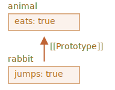
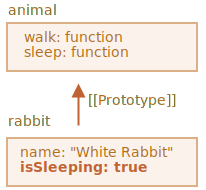
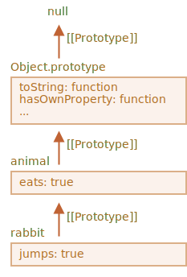

프로토타입 상속
====

##### 프로토타입 상속 <sub>(JS)</sub>
- 기존 기능 확장
  - 개발 시 매우 유용

|기본 객체|확장 <sub>(기능 추가)</sub> 객체|
|:---:|:---:|
|`user`|`admin`|
||`guest`|

### `[[Prototype]]`

##### JS 객체 내부 숨김 프로퍼티 <sub>(명세서)</sub>
- 객체 참조 값 저장 <sub>(미참조 시 `null`)</sub>
  - 참조 대상 == 프로토타입 <sub>(prototype)</sub>


##### 프로토타입 상속 <sub>(동작 방식)</sub>
- 객체 내 부재 프로퍼티 접근 시
  - 프로토타입 내 자동 검색

##### `__proto__` <sub>(접근자 프로퍼티)</sub>
- `[[Prototype]]` <sub>(프로토타입)</sub> 접근 · 설정
```javascript
let animal = {
  eats: true
};

let rabbit = {
  jumps: true
};

// __proto__ 값 설정
rabbit.__proto__ = animal;
```

<br />

 **`[[Prototype]]` ≠ `__proto__`**

##### `[[Prototype]]` <sub>(숨김 프로퍼티)</sub>
- 프로토타입 참조

##### `__proto__` <sub>(접근자 프로퍼티)</sub>
- `[[Prototype]]` 값 접근 · 설정 <sub>(\[g·s\]etter)</sub>

##### `[[Prototype]]` <sub>(프로토타입)</sub> 접근 · 설정 방법
- a. `__proto__` <sub>(접근자 프로퍼티)</sub>
  - 구식
- b. `Object.[g·s]etPrototypeOf` <sub>(메서드)</sub>
  - 최신

##### 특징
- 명세서
  - 브라우저 환경만 지원
- 실제
  - 모든 호스트 환경 지원

<br />

##### `rabbit` <sub>(객체)</sub> → `animal` <sub>(객체)</sub> 상속
- `rabbit` <sub>(하위 객체)</sub> 내 부재 프로퍼티 접근 시
   - `animal` <sub>(상위 객체)</sub> 내 자동 검색
```javascript
let animal = {
  eats: true
};

let rabbit = {
  jumps: true
};

// rabbit.[[Prototype]] → animal (객체) 참조
// - rabbit (객체) → animal (객체) 상속
rabbit.__proto__ = animal;

// rabbit (하위 객체) 내 eats (부재 프로퍼티) 접근 시
// - rabbit.[[prototype]] (animal 객체) 검색 후 사용
rabbit.eats;  // true
rabbit.jumps; // true
```



##### 상속 프로퍼티
- 프로토타입 통해 상속받은 프로퍼티
```javascript
let animal = {
  eats: true,
  walk() {
    "동물이 걷습니다.";
  }
};

let rabbit = {
  jumps: true,
  __proto__: animal
};

// walk (상속 메서드)
// - rabbit (하위 객체) 내 無
//   - animal (상위 객체) 검색 후 호출
rabbit.walk(); // 동물이 걷습니다.
```


##### 프로토타입 체인
- 더 깊은 상속 단계 형성 가능

##### `longEar` → `rabbit` → `animal` <sub>(객체)</sub> 상속
```javascript
let animal = {
  eats: true,
  walk() {
    "동물이 걷습니다.";
  }
};

let rabbit = {
  jumps: true,

  // rabbit (객체) → animal (객체) 상속
  __proto__: animal
};

let longEar = {
  earLength: 10,

  // longEar (객체) → rabbit (객체) 상속
  __proto__: rabbit
};

// longEar → rabbit → animal
longEar.walk(); // 동물이 걷습니다.

// longEar → rabbit
longEar.jumps; // true
```


##### 프로토타입 체인 제약사항 <sub>(3가지)</sub>
- a. 순환 참조 불허
  - 타 객체 닫힌 형태 참조 시 에러
- b. `__proto__` 값 자료형 제한
  - 객체 · `null` 만 가능
  - 타 자료형 무시
- c. 단일 `[[Prototype]]` <sub>(숨김 프로퍼티)</sub>
  - 객체당 1개 → 단일 상속
    - 다수 상속 불가능

### 프로토타입 == 읽기 전용

##### 프로토타입
- 프로퍼티 읽기 연산만 가능
- 프로퍼티 추가 · 수정 · 제거 연산 불가능
  - 객체 대상 직접 실행 필요

##### 중복 상속 프로퍼티
- 하위 객체 내 프로퍼티 사용
```javascript
let animal = {
  eats: true,
  walk() {
    "동물이 걷습니다.";
  }
};

let rabbit = {

  // rabbit (객체) → animal (객체) 상속
  __proto__: animal
};

// rabbit (하위 객체) 내 walk (메서드) 직접 할당
// - 상속 메서드 중복
rabbit.walk = function() {
  "토끼가 깡충깡충 뜁니다.";
};

// rabbit.walk() (중복 상속 메서드) 호출 시
// - 프로토타입 (animal 객체) 내 메서드 미사용
// - rabbit (하위 객체) 내 직접 추가한 메서드 실행
rabbit.walk(); // 토끼가 깡충깡충 뜁니다.
```


##### 접근자 프로퍼티 상속
- setter <sub>(값 설정 함수)</sub> 호출 시
  - 현재 호출 객체 내 프로퍼티 설정
```javascript
let user = {
  name: "John",
  surname: "Smith",

  // setter (값 설정)
  // - this.[sur]name 값 수정
  set fullName(value) {
    [this.name, this.surname] = value.split(" ");
  },

  // getter (값 접근)
  // - this.sur[name] 값 조합 문자열 반환
  get fullName() {
    return `${this.name} ${this.surname}`;
  }
};

let admin = {
  __proto__: user,
  isAdmin: true
};

// getter (프로토타입 내 함수) 실행
// - 프로토타입 (user 객체) 내 프로퍼티 값 접근
admin.fullName; // John Smith

// setter (프로토타입 내 함수) 실행
// - admin (하위 · 현재 호출 객체) 내 [sur]name (프로퍼티) 추가
admin.fullName = "Alice Cooper";

// getter (프로토타입 내 함수) 실행
// - admin (하위 객체) 내 프로퍼티 값 접근
admin.fullName; // Alice Cooper

// getter (객체 내 자체 함수) 실행
// - user (객체) 내 프로퍼티 값 접근
user.fullName;  // John Smith
```

### 상속 시 `this`

##### 프로토타입 영향 無
- 메서드 구현 주체 <sub>(객체 · 프로토타입)</sub> 무관
  - 항상 `.` <sub>(점)</sub> 앞 <sub>(현재 호출)</sub> 객체

##### 단일 거대 상위 객체 <sub>(메서드 저장소 역할)</sub>
- 다양한 메서드 구현
  - 다수 하위 객체 상속 후 사용
- 상속 메서드 사용 시
  - 호출 주체 <sub>(하위 객체)</sub> 상태 수정
  - 프로토타입 <sub>(상위 객체)</sub> 상태 수정 X

##### `rabbit` <sub>(객체)</sub> → `animal` <sub>(객체)</sub> 상속
- `animal` <sub>(상위 객체)</sub>
  - 다수 메서드 구현
- `rabbit` <sub>(하위 객체)</sub>
  - `sleep()` <sub>(상속 메서드)</sub> 호출 시
    - `isSleeping` <sub>(프로퍼티)</sub> 추가
```javascript
// 상위 객체 내 다양한 메서드 구현
let animal = {
  walk() {
    if (!this.isSleeping) {
      `동물이 걸어갑니다.`;
    }
  },

  sleep() {
    this.isSleeping = true;
  }
};

let rabbit = {
  name: "하얀 토끼",

  // rabbit (객체) → animal (객체) 상속
  __proto__: animal
};

// rabbit (하위 · `.` 점 앞 · 현재 호출 객체)
// - isSleeping (프로퍼티) 추가 후 값 (true) 할당
rabbit.sleep();

rabbit.isSleeping; // true
animal.isSleeping; // undefined
```



##### 상속 메서드 내 `this`
- `.` <sub>(점)</sub> 앞 <sub>(현재 호출)</sub> 객체
  - 해당 객체 <sub>(하위 객체)</sub> 상태 변화
  - 프로토타입 <sub>(상위 객체)</sub> 상태 변화 X

##### 상속 시 상 · 하위 객체 관계
- 메서드 공유
- 객체 상태 공유 X

### `for…in` <sub>(반복문)</sub>

##### 순회 시 상속 프로퍼티 포함
```javascript
let animal = {
  eats: true
};

let rabbit = {
  jumps: true,
  __proto__: animal
};

// for…in (반복문)
// - 상속 프로퍼티 포함
for (let prop in rabbit) {
  prop; // jumps, eats
}

// Object.keys (메서드)
// - 상속 프로퍼티 제외
Object.keys(rabbit); // jumps
```

##### [`hasOwnProperty(key)`](https://developer.mozilla.org/ko/docs/Web/JavaScript/Reference/Global_Objects/Object/hasOwnProperty)
- 객체 내 자체 프로퍼티 여부 확인
- `for…in` <sub>(반복문)</sub> 내 사용 시
  - 순회 중 상속 프로퍼티 제외 가능
```javascript
let animal = {
  eats: true
};

let rabbit = {
  jumps: true,

  // rabbit (객체) → animal (객체) 상속
  __proto__: animal
};

for (let prop in rabbit) {

  // rabbit (하위 객체) 내 자체 프로퍼티 여부 확인
  let isOwn = rabbit.hasOwnProperty(prop);

  if (isOwn) {
    `객체 자신의 프로퍼티: ${prop}`;
  } else {
    `상속 프로퍼티: ${prop}`;
  }
}
```



##### `{…}` <sub>(객체 리터럴)</sub> 선언 객체
- `Object.prototype` 상속

##### `Object.prototype` 내 모든 메서드
- `enumerable: false` <sub>(플래그)</sub>
  - `for…in` <sub>(반복문)</sub> 순회 시 제외

<br />

 **키 · 값 관련 내장 메서드 · 상속 프로퍼티**

##### 대다수 내장 메서드 <sub>(`Object.[key·value]s` 등)</sub>
- 동작 시 상속 프로퍼티 제외

<br />

요약
====

##### `[[Prototype]]` <sub>(JS 객체 내부 숨김 프로퍼티)</sub>
- 객체 <sub>(프로토타입)</sub> 참조 값 저장 <sub>(미참조 시 `null`)</sub>

##### `__proto__` <sub>(접근자 프로퍼티)</sub>
- `[[Prototype]]` 값 접근 · 설정 <sub>(\[g·s\]etter)</sub>
- 최근 사용 빈도 ↓

##### 객체 내 부재 프로퍼티 접근 시
- 프로토타입 내 자동 검색

##### 데이터 프로퍼티 처리 <sub>(프로퍼티 추가 · 수정 · 제거 연산)</sub>
- 프로토타입 대상 수행 불가능
- 객체 대상 직접 적용 필요

##### 상속 메서드 내 `this`
- 항상 `.` <sub>(점)</sub> 앞 <sub>(현재 호출)</sub> 객체
  - 메서드 구현 주체 <sub>(객체 · 프로토타입)</sub> 무관

##### 프로퍼티 순회
- `for…in` <sub>(반복문)</sub>
  - 상속 프로퍼티 포함
- 대다수 키 · 값 관련 내장 메서드
  - 상속 프로퍼티 제외

<br />

##  과제

### 프로토타입 기초

##### 경고 창 출력값 <sub>(`jumps` 프로퍼티)</sub> 예측
- `rabbit` <sub>(객체)</sub> → `animal` <sub>(객체)</sub> 상속
```javascript
let animal = {
  jumps: null
};

let rabbit = {
  jumps: true,

  // rabbit (객체) → animal (객체) 상속
  __proto__: animal
};

rabbit.jumps; // ? ①

delete rabbit.jumps;

rabbit.jumps; // ? ②

delete animal.jumps;

rabbit.jumps; // ? ③
```

<br />


#### `jumps` <sub>(프로퍼티)</sub> 값

##### 1. `true`
- `rabbit` <sub>(하위 객체)</sub> 내 有

##### 2. `null`
- `rabbit` <sub>(하위 객체)</sub> 내 無
  - 프로토타입 <sub>(`animal` 객체)</sub> 내 有

##### 3. `undefined`
- 하위 · 상위 객체 <sub>(프로토타입)</sub> 내 無

<hr />

### 검색 알고리즘

##### 객체 구성
```javascript
let head = {
  glasses: 1
};

let table = {
  pen: 3
};

let bed = {
  sheet: 1,
  pillow: 2
};

let pockets = {
  money: 2000
};
```

##### 1. 프로퍼티 검색 경로 설정
- `__proto__` <sub>(접근자 프로퍼티)</sub> 사용
- 경로 순서
  1. `pockets`
  2. `bed`
  3. `table`
  4. `head`
- ex\) `pockets.pen` → `table.pen` <sub>(`3`)</sub>
- ex\) `bed.glasses` → `head.glasses` <sub>(`1`)</sub>

##### 2. 프로퍼티 접근 속도 비교
- ex\) `glasses`
  - `pockets.glasses`
  - `head.glasses`
- 필요 시 성능 측정 <sub>(벤치마크 사용)</sub>

<br />


##### 1. `__proto__` <sub>(접근자 프로퍼티)</sub> 추가
```javascript
let head = {
  glasses: 1
};

let table = {
  pen: 3,

  // table (객체) → head (객체) 상속
  __proto__: head
};

let bed = {
  sheet: 1,
  pillow: 2,

  // bed (객체) → table (객체) 상속
  __proto__: table
};

let pockets = {
  money: 2000,

  // pockets (객체) → bed (객체) 상속
  __proto__: bed
};

pockets.pen; // 3
bed.glasses; // 1
table.money; // undefined
```

##### 2. 성능 차이 無 <sub>(모던 엔진)</sub>
- 프로퍼티 검색 위치 기억
  - 다음 요청 시 위치 정보 재사용
- ex\) `pockets.glasses`
  1. `head.glasses` 검색 성공 · 기억
  2. 다음 요청부터 `head.glasses` 검색

<hr />

### 프로퍼티 추가 위치 확인

##### `rabbit` <sub>(객체)</sub> → `animal` <sub>(객체)</sub> 상속
- `animal.eat()` 호출 시
  - `full` <sub>(프로퍼티)</sub> 생성
```javascript
let animal = {
  eat() {
    this.full = true;
  }
};

let rabbit = {

  // rabbit (객체) → animal (객체) 상속
  __proto__: animal
};

rabbit.eat();
```

##### `rabbit.eat()` 호출 시 `full` <sub>(프로퍼티)</sub> 생성 객체
- a. `animal` <sub>(객체)</sub>
- b. `rabbit` <sub>(객체)</sub>

<br />


##### `rabbit` <sub>(객체)</sub>
- 상속 메서드 내 `this`
  - 항상 `.` <sub>(점)</sub> 앞 <sub>(현재 호출)</sub> 객체
- `rabbit.eat()`
  - `rabbit` <sub>(객체)</sub> 상태 변경

##### 프로퍼티 검색 · 실행
- 완전히 별개 작업

##### `eat` <sub>(메서드)</sub>
- 접근 시
  - 프로토타입 내 검색
- 실행 시
  - `this` == `rabbit` <sub>(객체)</sub>

<hr />

### 햄스터 <sub>(객체)</sub> 2개 상속

##### `speedy` · `lazy` <sub>(객체)</sub>
- `hamster` <sub>(객체)</sub> 상속
- 둘 중 한 마리에게만 먹이 급여 시
  - 다른 한 마리 배 역시 꽉 참

##### 비정상 동작 코드 수정
```javascript
let hamster = {
  stomach: [],

  eat(food) {
    this.stomach.push(food);
  }
};

let speedy = {

  // speedy (객체) → hamster (객체) 상속
  __proto__: hamster
};

let lazy = {

  // lazy (객체) → hamster (객체) 상속
  __proto__: hamster
};

// speedy 햄스터 먹이 급여
speedy.eat("apple");

speedy.stomach; // apple

// lazy 햄스터 먹이 급여 전
// - 배에 apple 有 (꽉 찬 상태)
lazy.stomach;   // apple
```

<br />


#### `speedy.eat("apple")` 실행 과정

##### 1. `speedy.eat` <sub>(메서드)</sub>
- `speedy` <sub>(객체)</sub> 내 無
  - 프로토타입 <sub>(`hamster` 객체)</sub> 내 有
- `speedy` <sub>(객체)</sub>
  - `.` <sub>(점)</sub> 앞 <sub>(현재 호출)</sub> 객체
  - 메서드 실행 시 `this`

##### 2. `this.stomach.push()` 실행
- `stomach` <sub>(프로퍼티)</sub> 검색 후 `push` 호출
  - `speedy` <sub>(`this`)</sub> 내 無

##### 3. `stomach` <sub>(프로퍼티)</sub> 검색
- 프로토타입 체인 탐색
  - `hamster` <sub>(객체)</sub> 내 有

##### 4. `push` <sub>(메서드)</sub> 호출
- `hamster.stomach` 대상 동작
- `"apple"` <sub>(먹이)</sub>
  - 프로토타입 <sub>(`hamster` 객체)</sub> 내 추가

##### `[speedy·lazy].stomach.push()`
- `stomach` <sub>(프로퍼티)</sub> 검색 수행
  - 프로토타입 <sub>(`hamster` 객체)</sub> 내 有

#### 해결

##### a. 데이터 할당
- `this.stomach = …` <sub>(`push` 메서드 X)</sub>
  - 객체 내 자체 프로퍼티 추가
  - 프로토타입 체인 상 검색 X
```javascript
let hamster = {
  stomach: [],

  eat(food) {
  //this.stomach.push(food)
    this.stomach = [food];
  }
};

let speedy = {
  __proto__: hamster
};

let lazy = {
  __proto__: hamster
};

// speedy 햄스터 먹이 급여
speedy.eat("apple");

speedy.stomach; // apple

// lazy 햄스터 먹이 급여 전
// - 배에 apple 無 (빈 상태)
lazy.stomach;   //
```

##### b. 개별 프로퍼티 추가
- `speedy` · `lazy` <sub>(객체)</sub>
  - 각각 `stomach` <sub>(프로퍼티)</sub> 추가
- 특정 객체 상태 설명 프로퍼티 <sub>(`stomach`)</sub>
  - 조상 객체 정의 X
  - 해당 객체 자체 정의
```javascript
let hamster = {
  stomach: [],

  eat(food) {
    this.stomach.push(food);
  }
};

let speedy = {
  stomach: [], // 자체 프로퍼티
  __proto__: hamster
};

let lazy = {
  stomach: [], // 자체 프로퍼티
  __proto__: hamster
};

// speedy 햄스터 먹이 급여
speedy.eat("apple");

speedy.stomach; // apple

// lazy 햄스터 먹이 급여 전
// - 배에 apple 無 (빈 상태)
lazy.stomach;   //
```
