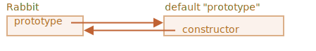

함수 내 `prototype` <sub>(프로퍼티)</sub>
====

##### 생성자
- `new` <sub>(연산자)</sub> 사용해 객체 생성
- 생성 객체 내 `[[Prototype]]` <sub>(숨김 프로퍼티)</sub>
  - 함수 내부 프로토타입 정보 사용해 설정

<br />

 **주의**

##### JS 초기
- 프로토타입 기반 상속
  - 주요 기능 중 하나

##### 과거 프로토타입 직접 접근 방법 無
- 생성자 내 `prototype` <sub>(숨김 프로퍼티)</sub>
  - 당시 프로토타입 접근 대안
  - 아직도 다수 스크립트 의존

<br />

##### `function.prototype` <sub>(프로퍼티)</sub>
- `function` <sub>(생성자)</sub> 내 프로토타입
  - 합수 내 일반 <sub>(특수 X)</sub> 프로퍼티
  - 생성 객체 내 `[[Prototype]]` 값 설정
```javascript
let animal = {
  eats: true
};

function Rabbit(name) {
  this.name = name;
}

// Rabbit (생성자) 내 prototype (프로퍼티) 수정
// - new Rabbit 호출해 객체 생성 시
//   - 생성 객체 내 [[Prototype]] → animal (객체) 참조
Rabbit.prototype = animal;

//  rabbit.__proto__ == animal
let rabbit = new Rabbit("흰 토끼");

// 프로토타입 (animal 객체) 내 메서드 사용
alert( rabbit.eats ); // true
```


##### 생성자 · 객체 · 프로토타입 관계
- → <sub>(가로 화살표)</sub>
  - `prototype` <sub>(생성자 내 일반 프로퍼티)</sub>
- ↑ <sub>(세로 화살표)</sub>
  - `[[Prototype]]` <sub>(객체 내 숨김 프로퍼티)</sub>
  - `rabbit` <sub>(객체)</sub> → `animal` <sub>(객체)</sub> 상속

<br />

 **`function.prototype` <sub>(프로퍼티)</sub> 사용 시점**

##### 생성자 호출 <sub>(`new` 연산자 사용)</sub> 때만 사용
- 생성 객체 내 `[[Prototype]]` 할당

##### 프로퍼티 값 변화 <sub>(상이 객체 참조)</sub> 시
- 이후 생성 객체 내 `[[Prototype]]`
  - 새 프로토타입 참조
- 기존 객체 내 `[[Prototype]]`
  - 기존 프로토타입 참조 유지

<br />

### `function.prototype` 기본값 · `constructor` <sub>(프로퍼티)</sub>

##### `function.prototype` <sub>(프로퍼티)</sub> 기본값
- 모든 함수 내 기본적 보유
- `{constructor: 함수 자신}` <sub>(객체)</sub> 참조
```javascript
function Rabbit() {}

// 암묵적인 prototype.constructor 기본값 설정
// - 함수 생성 시 자동 설정
// Rabbit.prototype = {constructor: Rabbit}; // 서로 참조

// true
Rabbit.prototype.constructor == Rabbit;
```



##### 생성자 호출 <sub>(`new Rabbit()`)</sub> 후 생성된 모든 객체
- `constructor` <sub>(상속 프로퍼티)</sub> 사용 가능
  - 객체 내 `[[Prototype]]` 통해 접근
```javascript
function Rabbit() {}

// 암묵적인 (자동) prototype.constructor 기본값 설정
// Rabbit.prototype = {constructor: Rabbit}; // 서로 참조

// 객체 생성 시 프로토타입 (객체) 상속 (Rabbit.prototype 사용)
// - rabbit.[[prototype]] → {constructor: Rabbit}
let rabbit = new Rabbit();

// rabbit.[[Prototype]] 통해 constructor (상속 프로퍼티) 접근
rabbit.constructor == Rabbit; // true
```


#### `constructor` <sub>(프로퍼티)</sub>

##### 새 객체 생성 시 기존 객체 내 프로퍼티 사용 가능
- 객체 생성 시 사용된 생성자 확인 불가능 시 유용
  - ex\) 서드파티 라이브러리 객체 등
```javascript
function Rabbit(name) {
  this.name = name;

  alert(name);
}

let rabbit1 = new Rabbit("흰 토끼");

// 새 객체 생성 (rabbit1 기존 객체 내 프로퍼티 사용)
let rabbit2 = new rabbit1.constructor("검정 토끼");
//  rabbit2 = new              Rabbit("검정 토끼");
```

##### 적절한 값 보장 X <sub>(JS 언어 차원)</sub>
- `function.prototype` <sub>(프로퍼티)</sub> 기본값 설정
  - JS 담당
- `constructor` <sub>(프로퍼티)</sub> 관련 발생하는 모든 일
  - 개발자 담당

##### `function.prototype` <sub>(프로퍼티)</sub> 값 명시적 설정 시
- 생성자 호출 <sub>(`new` 연산자 사용)</sub> 후 생성된 객체
  - `constructor` <sub>(프로퍼티)</sub> 無
```javascript
function Rabbit() {}

// prototype (프로퍼티) 값 명시적 설정
Rabbit.prototype = {
  jumps: true
};

let rabbit = new Rabbit();

rabbit.constructor === Rabbit; // false
```

##### `function.prototype` <sub>(프로퍼티)</sub> 덮어쓰기 지양
- 프로퍼티 기본값 유지
  - 기본값 <sub>(객체)</sub> 내 프로퍼티 추가 · 제거
```javascript
function Rabbit() {}

// Rabbit.prototype (프로퍼티) 전체 덮어쓰기 X (기본값 유지)
// - 기본값 (객체) 내 프로퍼티 추가
//   - 생성 객체 내 constructor (프로퍼티) 有
Rabbit.prototype.jumps = true

let rabbit = new Rabbit();

rabbit.constructor === Rabbit; // true

rabbit.jumps; // true
```
- 프로퍼티 덮어쓰기 <sub>(실수)</sub> 발생 시
  - `constructor` <sub>(프로퍼티)</sub> 수동 추가
    - 다시 사용 가능
```javascript
// constructor (프로퍼티) 수동 추가
// - constructor (프로퍼티) 특징 그대로 사용 가능
Rabbit.prototype = {
  jumps: true,
  constructor: Rabbit
};
```

<br />

요약
====

##### 생성자 디폴트 프로퍼티 <sub>(`F.prototype`)</sub>
- ≠ `[[Prototype]]` <sub>(숨김 프로퍼티)</sub>
- 새 객체 <sub>(`new F()`)</sub> `[[Prototype]]` 설정
- 객체 · `null` 할당 가능
  - 다른 값 무시
- 생성자 · `new` 함께 호출 때만 적용

##### 일반 객체 : `prototype` <sub>(프로퍼티)</sub> 추가 시
- 아무 일 발생 X
```javascript
let user = {
  name: "John",
  prototype: "Bla-bla" // 아무 일 발생 X
};
```

##### 모든 함수 : 디폴트 프로퍼티 보유
- `F.prototype = {constructor: F}`
- `constructor` <sub>(프로퍼티)</sub>
  - 생성자 참조

<br />

##  과제

### `prototype` <sub>(프로퍼티)</sub> 변경하기

##### `new Rabbit` 생성 후 해당 객체 `prototype` 변경
- 특정 코드 추가 후 경고 창 출력값 예측
```javascript
function Rabbit() {}
Rabbit.prototype = {
  eats: true
};

let rabbit = new Rabbit();

// ①
// Rabbit.prototype = {};

// ②
// Rabbit.prototype.eats = false;

// ③
// delete rabbit.eats;

// ④
// delete Rabbit.prototype.eats;

alert( rabbit.eats ); // true
```

<br />


##### 1. `true`
- `Rabbit.prototype` 교체 시
  - 새 `[[Prototype]]` <sub>(프로퍼티)</sub> 설정
    - 새 생성 객체 O
    - 기존 객체 X

##### 2. `false`
- 객체 할당
  - 참조 의한 할당
- `Rabbit.prototype` 참조 객체 <sub>(단 1개)</sub>
  - `Rabbit.prototype` 참조
  - `rabbit.[[Prototype]]` 참조
- 둘 중 한 참조 사용해 객체 내용 변경 시
  - 다른 참조 통해 변경 내용 확인 가능

##### 3. `true`
- `delete` 연산
  - 객체에 직접 적용
- `delete rabbit.eats`
  - `rabbit.eats` <sub>(프로퍼티)</sub> 제거
- `rabbit.eats` <sub>(프로퍼티)</sub> 부재 시
  - 아무 영향 無

##### 4. `undefined`
- `eats` <sub>(프로퍼티)</sub>
  - 프로토타입에서 삭제 <sub>(더 이상 존재 X)</sub>

<hr />

### 동일한 생성자 로 객체 만들기

##### 생성자 사용해 새 객체 생성 상황
- 생성자 1개 존재
- 임의 객체 <sub>(`obj`)</sub> 1개 존재
  - 생성자 사용해 생성

##### 생성자 작성
- 정상 · 비정상 동작 코드
- 기존 객체 생성자 이용해 새 객체 생성
```javascript
let obj2 = new obj.constructor();
```

<br />


##### 올바른 `constructor` <sub>(프로퍼티)</sub> 값 설정
- 디폴트 `prototype` <sub>(프로퍼티)</sub>
```javascript
User.prototype.constructor == User
```
```javascript
function User(name) {
  this.name = name;
}

let user = new User('John');
let user2 = new user.constructor('Pete');

alert( user2.name ); // Pete
```

##### `prototype` <sub>(프로퍼티)</sub> 덮어쓴 후 재설정 X
- `constructor` <sub>(`User` 참조)</sub> 재할당 X
```javascript
function User(name) {
  this.name = name;
}

// prototype (프로퍼티) 덮어씀
User.prototype = {};

let user = new User('John');
let user2 = new user.constructor('Pete');

alert( user2.name ); // undefined
```

#### `user2.name` == `undefined` 이유

##### 1. `new user.constructor('Pete')`
- `user` 내 `constructor` 검색
  - 검색 실패

##### 2. 프로토타입 체인 검색 시작
- `user` <sub>(객체)</sub> 프로토타입
  - `User.prototype` <sub>(`{}` 빈 객체)</sub>

##### 3. `User.prototype` == 빈 일반 객체 <sub>(`{}`)</sub>
- 일반 객체 프로토타입
  - `Object.prototype`
```javascript
Object.prototype.constructor == Object
```
- 새 객체 생성 시
  - `Object` <sub>(생성자)</sub> 사용

##### 최종 결과
- `new Object('Pete')` 호출
```javascript
/* 동일 */
new user.constructor('Pete')
new Object('Pete')
```

##### `Object` <sub>(생성자)</sub>
- 항상 `{}` <sub>(빈 객체)</sub> 생성
- 인수 무시
```javascript
/* 동일 */
new Object('Pete')
{} // 빈 객체
```
