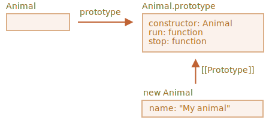

클래스 상속
====

##### 클래스
- 기능 확장 가능

### `extends` <sub>(키워드)</sub>

##### `Animal` <sub>(부모 클래스)</sub>
```javascript
class Animal {
  constructor(name) {
    this.speed = 0;
    this.name = name;
  }

  run(speed) {
    this.speed = speed;

    alert(`${this.name} 은/는 속도 ${this.speed}로 달립니다.`);
  }

  stop() {
    this.speed = 0;

    alert(`${this.name} 이/가 멈췄습니다.`);
  }
}

let animal = new Animal("동물");
```



##### `Rabbit` <sub>(자식 클래스)</sub>
- `Animal` <sub>(부모 클래스)</sub> 상속
```javascript
class Rabbit extends Animal {
  hide() {
    alert(`${this.name} 이/가 숨었습니다!`);
  }
}

let rabbit = new Rabbit("흰 토끼");

// 상속 메서드
rabbit.run(5); // 흰 토끼 은/는 속도 5로 달립니다.

// 자체 메서드
rabbit.hide(); // 흰 토끼 이/가 숨었습니다!
```

##### 프로토타입 기반 동작
- `Rabbit.prototype.[[Prototype]]`
  - `Animal.prototype` 참조
- `Rabbit.prototype` 내 메서드 부재 시
  - `Animal.prototype` 접근


#### `rabbit.run` <sub>(메서드)</sub> 검색 과정

##### 1. `rabbit` <sub>(객체)</sub>
- 메서드 無

##### 2. `Rabbit.prototype` <sub>(객체 프로토타입)</sub>
- 메서드 無

##### 3. `Rabbit.prototype.[[Prototype]]`
- 메서드 有
- 객체 프로토타입 상위 프로토타입
  - `Animal.prototype`
    - `extends` 통해 관계 생성

##### 클래스 → 함수
```javascript
class Parent {
  constructor(pp) {
    this.pp = pp;
  }

  pm() {
    console.log('pm');
  }
}

class Child extends Parent {
  constructor(pp, cp) {
    super(pp);
    this.cp = cp;
  }

  cm() {
    console.log('cm');
  }
}

let child = new Child('pp', 'cp');

↓↓↓

function Parent(pp) {
  this.pp = pp;
}

Parent.prototype.pm = function() {
  console.log(this.pp);
}

function Child(pp, cp) {
  Parent.call(this, pp);
  this.cp = cp;
}

Child.prototype.cm = function() {
  console.log(this.cp);
}

// 정적 프로퍼티 상속
Object.setPrototypeOf(Child, Parent);

// 프로토타입 체인 설정
Object.setPrototypeOf(Child.prototype, Parent.prototype);

let child = new Child('pp', 'cp');
```

<br />

 **클래스 표현식 상속 가능**

```javascript
function f(phrase) {
  return class {
    sayHi() {
      alert(phrase);
    }
  }
}

// f("Hello") (함수) 반환 값 (익명 클래스) 상속
class User extends f("Hello") {}

new User().sayHi(); // Hello
```

##### 조건별 상이 클래스 상속 가능
- 조건별 상이 클래스 반환 함수 생성 후
  - 함수 호출 결과 <sub>(익명 클래스)</sub> 상속

<br />

### 메서드 오버라이딩

##### 자식 클래스 내 상속 메서드 재정의
- 호출 시 자체 구현 <sub>(재정의)</sub> 메서드 사용
```javascript
class Animal {
  stop() {
    alert("animal 이 멈췄습니다.");
  }
}

class Rabbit extends Animal {

  // 상속 메서드 재정의
  // - 호출 시 자체 구현 메서드 호출
  stop() {
    alert("rabbit 이 멈췄습니다.");
  }
}

let rabbit = new Rabbit("토끼");

// 자체 메서드 호출
rabbit.stop(); // rabbit 이 멈췄습니다.
```

##### `super` <sub>(키워드)</sub>
- 자체 정의 메서드 내 상속 메서드 호출
- `super.method(…)`
  - 상속 메서드 <sub>(`method`)</sub> 호출
- `super(…)`
  - 부모 생성자 호출
  - 자식 생성자 내부에서만 사용 가능
```javascript
class Animal {
  constructor(name) {
    this.speed = 0;
    this.name = name;
  }

  run(speed) {
    this.speed = speed;
    alert(`${this.name}가 속도 ${this.speed}로 달립니다.`);
  }

  stop() {
    this.speed = 0;
    alert(`${this.name}가 멈췄습니다.`);
  }
}

class Rabbit extends Animal {
  hide() {
    alert(`${this.name}가 숨었습니다!`);
  }

  // 상속 메서드 재정의
  stop() {
    super.stop(); // 상속 메서드 호출
    this.hide();
  }
}

let rabbit = new Rabbit("흰 토끼");

// 흰 토끼가 속도 5로 달립니다.
rabbit.run(5);

// 흰 토끼가 멈췄습니다. 흰 토끼가 숨었습니다!
rabbit.stop();
```

<br />

 **화살표 함수 `super` <sub>(키워드)</sub> 미지원**

##### `super` <sub>(키워드)</sub> 사용 시
- 외부 함수 내 `super` 사용
```javascript
class Rabbit extends Animal {
  stop() {

    // stop (외부 함수 · 메서드) 내 super 사용
    // - 상속 메서드 호출 (1초 후)
    setTimeout(() => super.stop(), 1000);

    // 일반 함수 사용 시 에러
    setTimeout(function() { // Unexpected super
      super.stop()
    }, 1000);
  }
}
```

<br />

### 생성자 오버라이딩

##### `constructor` <sub>(생성자)</sub> 자동 생성 <sub>([명세서](https://tc39.github.io/ecma262/#sec-runtime-semantics-classdefinitionevaluation))</sub>
- 타 클래스 상속 후 `constructor` 부재 시
  - 빈 생성자 자동 생성
    - 부모 생성자 기본 호출 <sub>(인수 전달)</sub>
- 부모 · 자식 클래스 생성자 모두 부재 시
  - 모두 자동 생성
```javascript
class Rabbit extends Animal {

  /* 자체 생성자 부재 클래스 상속 시 자동 생성 (인수 전체 전달)
  constructor(...args) {
    super(...args);
  }
   */
}
```

#### 커스텀 자식 생성자

##### 자식 클래스 생성자
- `this` 사용 전 `super(…)` 호출 필수
  - 자식 생성자 실행 전 부모 생성자 실행
```javascript
class Animal {
  constructor(name) {
    this.speed = 0;
    this.name = name;
  }
  …
}

class Rabbit extends Animal {

  // super(…) (부모 생성자 호출) 無 (에러)
  constructor(name, earLength) {
 // this.super(name);
    this.speed = 0;
    this.name = name;
    this.earLength = earLength;
  }
  …
}

// 정상 동작 X
let rabbit = new Rabbit("흰 토끼", 10); // ReferenceError: Must call super constructor in derived class before accessing 'this' or returning from derived constructor
```

#### 일반 · 상속 클래스 생성자 차이

##### 상속 클래스 생성자 내 특수 내부 프로퍼티
- `[[ConstructorKind]]: "derived"`

##### 일반 클래스 생성자 실행 <sub>(`new`)</sub> 시
1. `{}` <sub>(빈 객체)</sub> 생성
2. `this` 에 객체 할당

##### 상속 클래스 생성자 실행 <sub>(`new`)</sub> 시
1. `{}` <sub>(빈 객체)</sub> 생성
2. 부모 클래스 생성자가 `this` 에 객체 할당
- 상속 클래스 생성자 내 `super()` 미호출 시
  - `this` 에 객체 할당 X
```javascript
class Animal {
  constructor(name) {
    this.speed = 0;
    this.name = name;
  }
  …
}

class Rabbit extends Animal {

  constructor(name, earLength) {

    // 부모 생성자 실행
    // - this 에 객체 할당
    super(name);

    this.earLength = earLength;
  }
  …
}

let rabbit = new Rabbit("흰 토끼", 10);

// 흰 토끼
alert(rabbit.name);

// 10
alert(rabbit.earLength);
```

### 클래스 필드 오버라이딩

##### 부모 생성자 내 오버라이딩 필드
- 부모 클래스 필드 값
- 자식 클래스 오버라이딩 값 X

##### 부모 생성자 내 오버라이딩 메서드
- 부모 클래스 메서드 X
- 자식 클래스 오버라이딩 메서드
```javascript
/* 필드 오버라이딩 */
class Animal {
  name = 'animal';

  constructor() {
    alert(this.name);
  }
}

class Rabbit extends Animal {
  name = 'rabbit';
}

new Animal(); // animal
new Rabbit(); // animal
```
```javascript
/* 메서드 오버라이딩 */
class Animal {
  showName() {
    alert('animal');
  }

  constructor() {
    this.showName();
  }
}

class Rabbit extends Animal {
  showName() {
    alert('rabbit');
  }
}

new Animal(); // animal
new Rabbit(); // rabbit
```

##### 클래스 초기화 순서
1. 부모 클래스 필드
2. 부모 생성자
3. 자식 클래스 필드
4. 자식 생성자

##### 필드 오버라이딩 문제 발생 시
- 필드 대신 다른 방법 사용
  - 메서드
  - getter
  - setter

### `super` · `[[HomeObject]]`
```javascript
let animal = {
  name: "동물",
  eat() {
    alert(`${this.name} 이/가 먹이를 먹습니다.`);
  }
};

let rabbit = {
  __proto__: animal,
  name: "토끼",
  eat() {

   // 컨텍스트 : rabbit (현재 객체)
   // super.eat()

   // 컨텍스트 : animal (프로토타입 · 부모 객체)
   // this.__proto__.eat()

   // 컨텍스트 : rabbit (현재 객체)
    this.__proto__.eat.call(this);
  }
};

rabbit.eat(); // 토끼 이/가 먹이를 먹습니다.
```

##### `rabbit.eat()`
- `this.__proto__` 통해
  - `animal.eat()` 호출
- `.` <sub>(점)</sub> 앞 객체
  - `animal` <sub>(== `rabbit.__proto__`)</sub>

##### 체인에 객체 하나 더 추가
```javascript
let animal = {
  name: "동물",
  eat() {
    alert(`${this.name} 이/가 먹이를 먹습니다.`);
  }
};

let rabbit = {
  __proto__: animal,
  eat() {

    // animal (부모) 메서드 호출 시도
    // - this           == longEar
    // - this.__proto__ == rabbit

    // 무한 루프 발생
    this.__proto__.eat.call(this);
  }
};

let longEar = {
  __proto__: rabbit,
  eat() {

    // rabbit (부모) 메서드 호출
    // - this           == longEar
    // - this.__proto__ == rabbit
    this.__proto__.eat.call(this);
  }
};

longEar.eat(); // RangeError: Maximum call stack size exceeded
```

##### `longEar.eat()`
- `this` == `longEar` <sub>(자손 객체)</sub>
- `this.__proto__` == `rabbit` <sub>(자식 객체)</sub>
- `this.__proto__.eat.call(this)`
  - == `rabbit.eat.call(this)`
  - `this` → `longEar` <sub>(자손 객체)</sub> 고정

##### `rabbit.eat()`
- `this` == `longEar` <sub>(자손 객체)</sub>
  - `longEar.eat()` 에서 `this` 고정
- `this.__proto__` == `rabbit` <sub>(자식 객체)</sub>
- `this.__proto__.eat.call(this)`
  - == `rabbit.eat.call(this)`
  - `this` → `longEar` <sub>(자손 객체)</sub> 고정
- 체인 위로 진행 X
  - 무한 루프


##### 1. `longEar.eat()`
- `this` == `longEar`
```javascript
// 모두 동일
this.__proto__
longEar.__proto__
rabbit

// 모두 동일
this.__proto__.eat.call(this);
longEar.__proto__.eat.call(this);
rabbit.eat.call(this);
```

##### 2. `rabbit.eat()`
- `this` == `longEar`
- 다시 `rabbit.eat` 호출
```javascript
// 모두 동일
this.__proto__
longEar.__proto__
rabbit

// 모두 동일
this.__proto__.eat.call(this);
longEar.__proto__.eat.call(this);
rabbit.eat.call(this);

// longEar.eat() 동일
```

##### 3. `rabbit.eat()`
- `this` == `longEar`
- 다시 `rabbit.eat` 호출
  - 2번 동일
- 체인 위로 진행 X
- 자기 자신 계속 호출
  - 무한 루프

### `[[HomeObject]]`

##### 특수 내부 프로퍼티 <sub>(함수 전용)</sub>
- 클래스 · 객체 메서드 보유
  - 해당 객체 내 저장

##### `super` <sub>(키워드)</sub>
- `[[HomeObject]]` 이용
  - 부모 프로토타입 · 메서드 찾음
```javascript
let animal = {
  name: "동물",

  // animal.eat.[[HomeObject]] == animal
  eat() {
    alert(`${this.name} 이/가 먹이를 먹습니다.`);
  }
};

let rabbit = {
  __proto__: animal,
  name: "토끼",

  // rabbit.eat.[[HomeObject]] == rabbit
  eat() {
    super.eat();
  }
};

let longEar = {
  __proto__: rabbit,
  name: "귀가 긴 토끼",

  // longEar.eat.[[HomeObject]] == longEar
  eat() {
    super.eat();
  }
};

// 귀가 긴 토끼 이/가 먹이를 먹습니다.
// - 정상 동작
longEar.eat();
```

##### 객체 메서드
- `[[HomeObject]]` 알고 있음
- `this` 없이 프로토타입에서 부모 메서드 가져옴

#### 메서드 자유로움 X

##### JS 함수
- 보통 객체에 묶이지 않음
  - 자유로움
- 객체 간 메서드 복사 가능
  - `this` 변화 무관

##### `[[HomeObject]]`
- 존재만으로 함수 자유도 파괴
  - 메서드 : 객체 기억
  - `[[HomeObject]]` 변경 불가능
  - 한 번 바인딩 된 함수
    - 더 이상 변경 X
- `super` 내부에서만 유효
  - 메서드 내 `super` 미사용 시
    - 메서드 자유성 보장
    - 객체 간 복사 가능
- 객체 간 메서드 잘못 복사 시
  - `super` 정상 동작 X
```javascript
let animal = {
  sayHi() {
    console.log(`나는 동물입니다.`);
  }
};

// animal (객체) 상속
let rabbit = {
  __proto__: animal,
  sayHi() {
    super.sayHi();
  }
};

let plant = {
  sayHi() {
    console.log("나는 식물입니다.");
  }
};

// plant (객체) 상속
let tree = {
  __proto__: plant,

  /*
   rabbit.sayHi (메서드) 복사
   - 중복 코드 방지 목적
   복사해온 rabbit.sayHi (메서드)
   - rabbit (객체) 에서 생성
     - [[HomeObject]] == rabbit (객체)
       - 변경 불가능
   tree.sayHi (메서드) 안
   - super.sayHi
     - rabbit (객체) 프로토타입 == animal (객체)
     - super
       - 체인 위 animal (객체) 에서 sayHi (메서드) 찾음
  */
  sayHi: rabbit.sayHi
};

tree.sayHi(); // 나는 동물입니다.
```


#### 함수형 프로퍼티 아닌 메서드 사용하기

##### 객체 메서드 `[[HomeObject]]`
- 메서드 문법 <sub>(`method()`)</sub>
  - 정상 동작
- 함수형 프로퍼티 문법 <sub>(`method: function()`)</sub>
  - 정상 동작 X
- 메서드 내 `super`
  - 존재 시
    - 메서드 문법 필수
  - 부재 시
    - 문법 무관
```javascript
let animal = {

//eat() { … }

  // 함수형 프로퍼티 문법
  eat: function() {
    …
  }
};

let rabbit = {
  __proto__: animal,

  // 함수형 프로퍼티 문법
  eat: function() {
    super.eat();
  }

  // 메서드 내 super 존재 시
  // - 메서드 문법 필수
  /*
   eat() {
     super.eat();
   }
   */

};

// [[HomeObject]] 부재 (에러)
rabbit.eat(); // SyntaxError: 'super' keyword unexpected here
```

<br />

요약
====

#### 1. 클래스 확장

##### `extends` <sub>(키워드)</sub>
```javascript
// Child.prototype.__proto__ == Parent.prototype
// - 메서드 전체 상속
class Child extends Parent { … }
```

#### 2. 생성자 오버라이딩

##### `super()`
- 부모 생성자 호출 필수
  - `this` 사용 전 `Child` 생성자 안

#### 3. 메서드 오버라이딩

##### `super.method()`
- `Child` 정의 메서드
  - `Parent` 정의 메서드 사용

#### 4. `[[HomeObject]]` · `super` <sub>(키워드)</sub>

##### `[[HomeObject]]` <sub>(메서드 내부 프로퍼티)</sub>
- 메서드 정의 클래스 · 객체 기억

##### `super` <sub>(키워드)</sub>
- `[[HomeObject]]` 사용해 부모 메서드 검색
- 객체 간 메서드 복사 시
  - 비정상 동작 가능성 有

#### 추가 사항

##### 화살표 함수
- `this` · `super` X
  - 주변 컨텍스트에 잘 들어맞음

<br />

##  과제

### 인스턴스 생성 오류

##### `Rabbit` <sub>(객체)</sub> 생성 불가능 이유 · 코드 수정
- `Rabbit` <sub>(클래스)</sub>
  - `Animal` <sub>(클래스)</sub> 상속
```javascript
class Animal {

  constructor(name) {
    this.name = name;
  }

}

class Rabbit extends Animal {
  constructor(name) {
    this.name = name;
    this.created = Date.now();
  }
}

// 에러
let rabbit = new Rabbit("White Rabbit"); // Error: this is not defined

alert(rabbit.name);
```

<br />


##### 자식 클래스 <sub>(`Rabbit`)</sub> 생성자 내 `super()` 호출 X
```javascript
class Animal {

  constructor(name) {
    this.name = name;
  }

}

class Rabbit extends Animal {
  constructor(name) {

    // super 호출
    super(name);
    this.created = Date.now();
  }
}

let rabbit = new Rabbit("White Rabbit");

// White Rabbit
alert(rabbit.name);
```

<hr />

### 시계 확장하기

##### `Clock` <sub>(클래스)</sub>
- 매 초마다 시간 출력
```javascript
class Clock {
  constructor({template}) {
    this.template = template;
  }

  render() {
    let date = new Date();

    let hours = date.getHours();
    if (hours < 10) hours = '0' + hours;

    let mins = date.getMinutes();
    if (mins < 10) mins = '0' + mins;

    let secs = date.getSeconds();
    if (secs < 10) secs = '0' + secs;

    let output = this.template
      .replace('h', hours)
      .replace('m', mins)
      .replace('s', secs);

    console.log(output);
  }

  stop() {
    clearInterval(this.timer);
  }

  start() {
    this.render();
    this.timer = setInterval(() => this.render(), 1000);
  }
}
```

#### `ExtendedClock` 작성 · `precision` 추가

##### `ExtendedClock` <sub>(클래스)</sub>
- `Clock` <sub>(클래스)</sub> 상속

##### `precision` <sub>(매개변수)</sub>
- 초 사이 간격 의미
- 기본값
  - `1000` <sub>(1초)</sub>

##### 새 파일 <sub>(`extended-clock.js`)</sub> 내 답 작성
- `clock.js` 수정 X
- 상속 사용

<br />


```javascript
class ExtendedClock extends Clock {
  constructor(options) {
    super(options);
    let {precision = 1000} = options;
    this.precision = precision;
  }

  start() {
    this.render();
    this.timer = setInterval(() => this.render(), this.precision);
  }
};
```

[정답](https://plnkr.co/edit/SCPW1LpH2vwuPOPk?p=preview)
