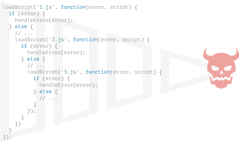

콜백
====

 **브라우저 전용 메서드 사용**

##### 예시 코드
- 브라우저 전용 메서드 사용

<br />

#### `loadScript(src)` <sub>(함수)</sub>

##### `src` <sub>(인수)</sub> 내 스크립트 읽기 수행
1. 스크립트 태그 동적 생성 후 추가
   - `<script src="…">`
2. 태그 내 스크립트 자동 로드 <sub>(브라우저)</sub>
   - 로딩 완료 시 스크립트 실행
```javascript
function loadScript(src) {

  // <script> (태그) 생성
  let script = document.createElement('script');
  script.src = src;

  // 페이지 내 <script> (태그) 추가
  // - src (인수) 내 스크립트 로딩 · 실행
  document.head.append(script);
}

// 함수 사용
// - 해당 경로 스크립트 로드 · 실행
loadScript('/my/script.js');
```


##### '비동기적' 실행
- 스크립트 로드
  - 즉시 시작
- 스크립트 실행
  - 함수 종료 후 시작
- 함수 하단 코드
  - 스크립트 로드 완료 대기 X
```javascript
loadScript('/my/script.js');

// 함수 하단 코드 이어 실행
// - 스크립트 로드 대기 X
…
```

##### 스크립트 로드 완료 후 작업 <sub>(함수 실행 등)</sub>
- ex\) 스크립트 내 함수 사용
  - 함수 실행 후 즉시 호출 시 정상 작동 X
```javascript
// script.js 내 함수 정의
// - function newFunction() { … }
loadScript('/my/script.js');

// 에러, 함수 존재 X
newFunction();
```

##### 브라우저
- 스크립트 읽을 충분한 시간 X

##### 스크립트 로딩 종료 여부
- 알 수 없음
- 알 수 있으면
  - 스크립트 내 함수 · 변수 사용 가능

##### `loadScript` <sub>(함수)</sub> 2번째 인수
- 콜백 <sub>(나중에 호출할 함수)</sub>
  - 스크립트 로딩 종료 후 실행
```javascript
function loadScript(src, callback) {
  let script = document.createElement('script');
  script.src = src;

  script.onload = () => callback(script);

  document.head.append(script);
}
```

##### 새롭게 불러온 스크립트 내 정의 함수
- 콜백 <sub>(함수)</sub> 안에서 호출 시
  - 외부 스크립트 내 함수 사용 가능
```javascript
loadScript('/my/script.js', function() {
  // 콜백 (함수)
  // - 스크립트 로딩 완료 후 실행

  // 정상 동작
  newFunction();
  …
});
```

##### 2번째 인수 <sub>(콜백 · 보통 익명 함수)</sub>
- 원하는 동작 완료 후 실행
  - ex\) 스크립트 로드 등
```javascript
function loadScript(src, callback) {
  let script = document.createElement('script');
  script.src = src;

  script.onload = () => callback(script);

  document.head.append(script);
}

loadScript('https://cdnjs.cloudflare.com/ajax/libs/lodash.js/3.2.0/lodash.js', script => {
  alert(`${script.src}가 로드되었습니다.`);

  // 스크립트 (lodash 라이브러리) 내 정의 함수
  alert( _ );
});
```

##### 콜백 기반 비동기 프로그래밍
- 콜백 인수 제공 필수
  - 비동기 수행 함수
  - 함수 내 동작 모두 처리 후 실행

### 콜백 속 콜백

##### 불러올 스크립트 2개
- 두 스크립트 순차적 로딩
  1. 1번째 스크립트 로딩
  2. 2번째 스크립트 로딩

##### 가장 자연스러운 해결 방법
- 콜백 함수 안
  - 2번째 `loadScript` <sub>(함수)</sub> 호출
```javascript
loadScript('/my/script.js', function(script) {

  alert(`${script.src}을 로딩했습니다. 이젠, 다음 스크립트를 로딩합시다.`);

  loadScript('/my/script2.js', function(script) {
    alert(`두 번째 스크립트를 성공적으로 로딩했습니다.`);
  });
});
```

##### 중첩 콜백 실행 순서
1. 외부 `loadScript` <sub>(함수)</sub> 완료
2. 내부 `loadScript` <sub>(함수)</sub> 실행

##### 3중첩 콜백
```javascript
loadScript('/my/script.js', function(script) {
  loadScript('/my/script2.js', function(script) {
    loadScript('/my/script3.js', function(script) {

      /* 세 스크립트 로딩 후 실행 코드 */

    });
  })
});
```

##### 중첩 콜백
- 적은 수행 동작
  - 괜찮음
- 많은 수행 동작
  - 좋지 않음

### 에러 핸들링

##### 콜백 에러
- 스크립트 로딩 실패
- 기타 등등
```javascript
function loadScript(src, callback) {
  let script = document.createElement('script');
  script.src = src;

  script.onload  = () => callback(null, script);
  script.onerror = () => callback(new Error(`${src}를 불러오는 도중에 에러가 발생했습니다.`));

  document.head.append(script);
}
```

##### 로딩 성공 시
- `callback(null, script)`

##### 로딩 실패 시
- `callback(error)`

##### 개선된 `loadScript` <sub>(함수)</sub> 사용법
```javascript
loadScript('/my/script.js', function(error, script) {
  if (error) {
    // 에러 처리
  } else {
    // 스크립트 로딩 성공
  }
});
```

#### 오류 우선 콜백 <sub>(error-first callback)</sub>
- 흔한 에러 처리 패턴

##### 관례
- 1번째 인수
  - 에러 위해 남겨둠
  - 에러 발생 시 이용
    - `callback(err)` <sub>(호출 형태)</sub>
- 2번째 인수 <sub>(인수 더 추가 가능)</sub>
  - 정사 동작 위해 남겨둠
  - 원하는 동작 성공 시 호출
```javascript
callback(null, cb1, cb2 …);
```

##### 오류 우선 콜백 스타일 사용 시
- 단일 콜백 <sub>(함수)</sub> 내
  - 에러 · 성공 케이스 모두 처리

### 멸망의 피라미드

##### 콜백 기반 비동기 처리
- 꽤 쓸만해 보임
- 실제로도 꽤 쓸만함

##### 1 ~ 2 개 중첩 호출 시
- 보기에 나쁘지 않음

##### 비동기 동작 多
- 꼬리에 꼬리 묾
```javascript
loadScript('1.js', function(error, script) {

  if (error) {
    handleError(error);
  } else {
    …
    loadScript('2.js', function(error, script) {
      if (error) {
        handleError(error);
      } else {
        …
        loadScript('3.js', function(error, script) {
          if (error) {
            handleError(error);
          } else {
            // 모든 스크립트 로딩 후 실행 흐름 이어짐
          }
        });
      }
    })
  }
});
```

##### 위 코드 동작 순서
1. `1.js` 로드, 그 후 에러 미발생 시,
2. `2.js` 로드, 그 후 에러 미발생 시,
3. `3.js` 로드, 그 후 에러 미발생 시,
4. 또 다른 작업 수행

##### 관리 어려움
- 호출 계속 중첩
  - 코드 깊어짐
- 본문 중간중간 반복문 · 조건문

##### '콜백 지옥' · '멸망의 피라미드'
- 깊은 중첩 코드 패턴



##### 비동기 동작 하나씩 추가 시
- 피라미드 우측 점점 길어짐
  - 좋지 않은 코딩 방식

##### 각 동작 분리
- 독립적인 함수
```javascript
loadScript('1.js', step1);

function step1(error, script) {
  if (error) {
    handleError(error);
  } else {
    …
    loadScript('2.js', step2);
  }
}

function step2(error, script) {
  if (error) {
    handleError(error);
  } else {
    …
    loadScript('3.js', step3);
  }
}

function step3(error, script) {
  if (error) {
    handleError(error);
  } else {
    // 모든 스크립트 로딩 후 다른 동작 수행
  }
};
```

##### 각 동작 분리
- 최상위 레벨 함수
- 깊은 중첩 X
- 콜백 기반 스타일 동일 동작

##### 가독성 ↓
- 찢어진 종잇조각 같이 보임
- 여기저기 코드 읽어야 함
  - 익숙지 않으면 더욱더 불편

##### `step` 명명 함수들
- '멸망의 피라미드' 피하기 용도
  - 재사용 X
  - 네임스페이스 복잡성 ↑

##### '멸망의 피라미드' 피하기
- `Promise` <sub>(객체)</sub>
  - 가장 좋은 방법 중 하나

<br />

##  과제

### 콜백 이용한 움직이는 원

##### Animated circle <sub>('css-animation' 과제)</sub>
- 점점 커지는 원

##### 동작 추가
- 원 내부 메시지 표시
  - 애니메이션 종료 후 <sub>(원 완전히 커진 후)</sub>

##### `showCircle(cx, cy, radius)` <sub>(함수)</sub>
- Animated circle <sub>(과제)</sub> 해답
- 원 그리기 기능
- 애니메이션 종료 여부 확인 X

##### 콜백 <sub>(인수)</sub> 추가
- 애니메이션 종료 시 콜백 실행
- 원 대응 `<div>` <sub>(인수)</sub> 필수
```javascript
showCircle(cx, cy, radius, callback) { … }
```
```javascript
showCircle(150, 150, 100, div => {
  div.classList.add('message-ball');
  div.append("Hello, world!");
});
```


<br />


[정답](https://plnkr.co/edit/cbR8Y1l11SL5Sdmo?p=preview)
