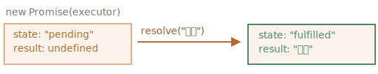

`Promise` <sub>(객체)</sub>
====

#### `Promise` <sub>(객체)</sub> 생성
```javascript
let promise = new Promise(function(resolve, reject) {
  // executor (실행자)
});
```

##### executor <sub>(실행자 · 실행 함수)</sub>
- `new Promise` <sub>(생성자)</sub> 전달 함수
  - 생성자 실행 시 자동 실행
  - 작업 수행 코드 <sub>(최종 결과 생성)</sub>

##### `resolve` · `reject` <sub>(executor 인수)</sub>
- 내장 콜백 <sub>(코드 직접 작성 X)</sub>
- executor <sub>(실행자)</sub> 처리 종료 시 1개 호출 필수
  - 성공 → `resolve(value)`
    - `value` <sub>(결과)</sub> 전달
  - 에러 → `reject(error)`
    - `error` <sub>(에러 객체)</sub> 전달

##### `Promise` <sub>(객체)</sub>
- `new Promise` <sub>(생성자)</sub> 반환 값
- 내부 프로퍼티
  - `state` <sub>(문자열)</sub>
  - `result`

|프로퍼티|최초|`resolve(value)`|`reject(error)`|
|:---:|:---:|:---:|:---:|
|`state`|`"pending"`|`"fulfilled"`|`"rejected"`|
|`result`|`undefined`|`value` <sub>(결과)</sub>|`error` <sub>(에러 객체)</sub>|

- executor <sub>(실행자)</sub> 의해 상태 변화


##### executor <sub>(실행자)</sub> 실행 지연
- `setTimeout` <sub>(메서드)</sub> 사용
```javascript
let promise = new Promise(function(resolve, reject) {

  // Promise (객체) 생성 시
  // - executor (실행자) 자동 실행

  // 1초 후 처리 성공 신호 전달
  // - resolve(…) 호출 · 결과 생성
  //   - result (프로퍼티) 값 → "완료" 할당
  setTimeout(() => resolve("완료"), 1000);
});
```



##### executor <sub>(실행자)</sub> 실행 거부 지연
- `setTimeout` <sub>(메서드)</sub> 사용
```javascript
let promise = new Promise(function(resolve, reject) {

  // Promise (객체) 생성 시
  // - executor (실행자) 자동 실행

  // 1초 후 실행 종료 신호 전달
  // - reject(…) 호출 · 에러 객체 생성
  //   - result (프로퍼티) 값 → 에러 객체 할당
  setTimeout(() => reject(new Error("에러")), 1000);
});
```


##### `Promise` <sub>(객체)</sub> 상태
- 처리된 <sub>(settled)</sub> 상태
  - 이행 <sub>(resolved · 처리 성공)</sub>
  - 거부 <sub>(rejected · 처리 실패)</sub>
- 대기 <sub>(pending)</sub> 상태
  - 작업 처리 중

<br />

 **`Promise` <sub>(객체)</sub> → 성공 · 실패만 수행**

##### executor <sub>(실행자)</sub>
- 내장 콜백 1개 호출 필수
  - `resolve` <sub>(처리 성공)</sub>
  - `reject` <sub>(처리 실패)</sub>
- 상태 변경 <sub>(처리 종료)</sub> 후 더 이상 변경 불가능
  - 1번째 내장 콜백 호출만 처리
    - 추가 호출 무시
- 처리 종료 결과 <sub>(2가지)</sub>
  - 결과
  - 에러
```javascript
let promise = new Promise(function(resolve, reject) {
  resolve("완료");

  reject(new Error(…));         // 무시
  setTimeout(() => resolve(…)); // 무시
});
```

##### `resolve` · `reject` <sub>(내장 콜백)</sub> 인수 개수
- 0 ~ 1개 <sub>(이 외 무시)</sub>

<br />

 **거부 내 `Error` <sub>(객체)</sub>**

##### 처리 실패 시 `reject` <sub>(내장 콜백)</sub> 호출 필요
- 모든 값 전달 가능 <sub>(`resolve` 동일)</sub>
  - `Error` <sub>(객체 · 상속 포함)</sub> 권장

<br />

 **`resolve` · `reject` <sub>(내장 콜백)</sub> 즉시 호출**

##### `resolve` · `reject` <sub>(내장 콜백)</sub>
- 보통 일정 시간 경과 <sub>(작업 처리)</sub> 후 호출
- 즉시 호출 가능 → 즉시 상태 변경
```javascript
let promise = new Promise(function(resolve, reject) {

  // 작업 처리 소모 시간 無
  // - 결과 → resolve (내장 콜백) 즉시 전달
  resolve(123); // 123
});
```

<br />

 **`state` · `result` <sub>(내부 프로퍼티)</sub>**

##### `state` · `result` <sub>(내부 프로퍼티)</sub>
- 직접 접근 불가능
- 특정 메서드 통한 직접 접근 가능
  - `.then`
  - `.catch`
  - `.finally`

<br />

### 소비자 <sub>(`then` · `catch` · `finally`)</sub>

##### `Promise` <sub>(객체)</sub>
- executor <sub>(실행자)</sub> · 소비 함수 연결
- 소비 함수 등록 시 전용 메서드 사용
  - `then`
  - `catch`
  - `finally`

#### `then` <sub>(메서드)</sub>

##### 문법
```javascript
promise.then(
  function(result) { …결과 (result) 처리… },
  function(error)  { …에러 (error)  처리… }
);
```
- 1번째 인수 <sub>(함수)</sub>
  - `Promise` <sub>(객체)</sub> 이행 시 실행
  - 실행 결과 전달
- 2번째 인수 <sub>(함수)</sub>
  - `Promise` <sub>(객체)</sub> 거부 시 실행
  - 에러 전달

##### 이행 처리
```javascript
let promise = new Promise(function(resolve, reject) {
  setTimeout(() => resolve("완료!"), 1000);
});

// resolve (내장 콜백) 호출 시
// - 1번째 인수 (함수) 실행
promise.then(
  result => alert(result), // 완료! (1초 후)
  error  => alert(error)   // 실행 X
);
```

##### 거부 처리
```javascript
let promise = new Promise(function(resolve, reject) {
  setTimeout(() => reject(new Error("에러")), 1000);
});

// reject (내장 콜백) 호출 시
// - 2번째 인수 (함수) 실행
promise.then(
  result => alert(result), // 실행 X
  error  => alert(error)   // Error: 에러 (1초 후)
);
```

##### 이행만 처리
- 인수 1개만 전달
```javascript
let promise = new Promise(resolve => {
  setTimeout(() => resolve("완료!"), 1000);
});

promise.then(alert); // 완료! (1초 후)
```

### `catch` <sub>(메서드)</sub>

##### 거부만 처리 방법 <sub>(2가지)</sub>
- a. `then(null, f)`
- b. `catch(f)` <sub>(간결성 ↑)</sub>
```javascript
let promise = new Promise((resolve, reject) => {
  setTimeout(() => reject(new Error("에러")), 1000);
});

// Error: 에러 (1초 후)
promise.then(null, alert)
promise.catch(alert);
```

### `finally` <sub>(메서드)</sub>

##### `Promise` <sub>(객체)</sub> 처리 <sub>(이행 · 거부)</sub> 후 항상 실행
- `finally(f)` ≒ `then(f, f)`
- 마무리 작업 필요 시 유용 <sub>(결과 무관)</sub>
  - ex\) 로딩 인디케이터 중단
```javascript
new Promise((resolve, reject) => {
  // 작업 처리 후 resolve · reject (내장 콜백) 호출
})

  // Promise (객체) 처리 후 실행
  // - 성공 · 실패 여부 무관
  .finally(()  => …로딩 인디케이터 중지…)

  .then(result => {…}, error => {…});
```

#### `finally(f)` vs `then(f, f)`

##### 1. 핸들러 인수 無
- 이행 · 거부 여부 확인 불가능
- '보편적' 동작 <sub>(절차 마무리)</sub> 수행
  - 성공 · 실패 여부 무관

##### 2. 결과 · 에러 → 다음 핸들러 자동 전달
- `result` <sub>(프로퍼티)</sub> 전달
```javascript
new Promise((resolve, reject) => {
  setTimeout(() => resolve("결과"), 2000)
}).finally(() => alert("Promise가 준비되었습니다."))
  .then(result => alert(result)); // 결과 (2초후)
```
- `error` <sub>(객체)</sub> 전달
```javascript
new Promise((resolve, reject) => {
  throw new Error("에러");
}).finally(() => alert("Promise가 준비되었습니다."))
  .catch(error => alert(error)); // Error: 에러
```

##### 3. 간결성 ↑
- `then(f, f)`
- `finally(f)` <sub>(동일 함수 중복 X)</sub>

<br />

 **처리 종료 시 핸들러 즉시 실행**

##### `Promise` <sub>(객체)</sub> · 등록 핸들러 관계

|`Promise` <sub>(객체)</sub>||등록 핸들러|
|:---:|:---:|:---:|
|대기 상태|→|처리 대기|
|처리 완료|→|즉시 실행|

```javascript
// 생성 · 이행 동시 실행
let promise = new Promise(resolve => resolve("완료!"));

// then 이행 핸들러 즉시 실행
promise.then(alert); // 완료!
```

<br />

### `loadScript` <sub>(함수)</sub>

##### 콜백 기반 함수 <sub>(기존)</sub>
```javascript
function loadScript(src, callback) {
  let script = document.createElement('script');
  script.src = src;

  script.onload  = () => callback(null, script);
  script.onerror = () => callback(new Error(`${src} 로딩 중 에러`));

  document.head.append(script);
}
```

##### `Promise` <sub>(객체)</sub> 기반 함수
- `Promise` <sub>(객체)</sub> 생성 후 반환
  - 스크립트 로드 후 이행
- 외부 코드
  - 핸들러 <sub>(소비 함수)</sub> 추가 <sub>(`then` 메서드)</sub>
```javascript
function loadScript(src) {
  return new Promise(function(resolve, reject) {
    let script = document.createElement('script');
    script.src = src;

    script.onload  = () => resolve(script);
    script.onerror = () => reject(new Error(`${src} 로딩 중 에러`));

    document.head.append(script);
  });
}

let promise = loadScript("https://cdnjs.cloudflare.com/ajax/libs/lodash.js/4.17.11/lodash.js");

promise.then(
  script => alert(`${script.src}을 불러왔습니다!`),
  error  => alert(`Error: ${error.message}`)
);

promise.then(script => alert('또다른 핸들러...'));
```

##### `Promise` <sub>(객체)</sub> vs 콜백
- `Promise` <sub>(객체)</sub>
  - 자연스러운 흐름
  - 결과 따라 다음 동작 코드 작성
  - 동작 추가 제한 無
- 콜백
  - 인수형 함수 필수
  - 다음 동작 코드 선준비 필수
  - 1개만 사용 가능

<br />

##  과제

### 두 번 resolve 하기?

##### 코드 실행 결과 예측
```javascript
let promise = new Promise(function(resolve, reject) {
  resolve(1);

  setTimeout(() => resolve(2), 1000);
});

promise.then(alert);
```

<br />


##### `1` 출력
- 1번째 내장 콜백 호출만 처리
  - 추가 호출 무시

<hr />

### `Promise` <sub>(객체)</sub> 기반 지연 만들기

##### `setTimeout` <sub>(내장 메서드)</sub>
- 내부 콜백 사용

##### `delay(ms)` <sub>(함수)</sub> 작성
- `Promise` <sub>(객체)</sub> 사용
- 반환 값
  - `Promise` <sub>(객체)</sub>
    - `ms` 후 이행
```javascript
function delay(ms) {
  /* 코드 작성 */
}

// 3초 후 (3초 후)
delay(3000).then(() => alert('3초 후 실행'));
```

<br />


```javascript
function delay(ms) {

  // resolve 호출 시 인수 전달 X
  // - 반환 값 불필요
  return new Promise(resolve => setTimeout(resolve, ms));
}

delay(3000).then(() => alert('3초후 실행'));
```

<hr />

### `Promise` <sub>(객체)</sub> 기반 애니메이션 적용 원 만들기

##### `showCircle` <sub>(함수 · '콜백' 과제)</sub> 재작성
- 콜백 인수 제거
- `Promise` <sub>(객체)</sub> 반환
```javascript
showCircle(150, 150, 100).then(div => {
  div.classList.add('message-ball');
  div.append("Hello, world!");
});
```

<br />


[정답](https://plnkr.co/edit/eAP9wNrKyu2LvWLZ?p=preview)
