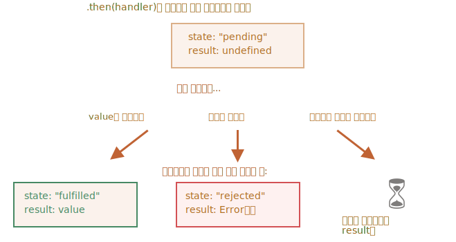

`Promise` <sub>(객체)</sub> 체이닝
====

##### 형태
1. 1초 후 최초 `Promise` <sub>(객체)</sub> 이행
2. 1번째 `then` 핸들러 호출
3. ② 반환 값 → 다음 `then` 핸들러 전달
4. 과정 반복
```javascript
new Promise(function(resolve, reject) {

  // ① 최초 이행 (1초 지연)
  setTimeout(() => resolve(1), 1000);

  // ② 1번째 핸들러 실행 (1초 후)
}).then(function(result) {
  result; // 1
  return result * 2;

  // ③ 2번째 핸들러 실행
}).then(function(result) {
  result; // 2
  return result * 2;

  // ④ 3번째 핸들러 실행
}).then(function(result) {
  result; // 4
  return result * 2;
});
```

##### `then` 핸들러 인수 <sub>(이전 동작 처리 결과)</sub>
- 핸들러 체인 따라 전달


##### `then(…)` <sub>(메서드)</sub>
- `Promise` <sub>(객체)</sub> 반환
  - 메서드 연속 호출 <sub>(체이닝)</sub> 가능

##### `then` 핸들러 반환 값
- `result` <sub>(내부 프로퍼티)</sub> 할당
  - 다음 핸들러 이용 <sub>(인수 전달)</sub>

##### 단일 `Promise` <sub>(객체)</sub> 대상 다수 `then` <sub>(메서드)</sub> 호출
- 독립 핸들러 등록 <sub>(체이닝 X)</sub>
  - 독립적 처리
  - 순차적 처리 X <sub>(처리 결과 전달 X)</sub>
- 드물게 사용
  - 보통 체이닝 사용
```javascript
let promise = new Promise(function(resolve, reject) {

  // 최초 이행
  setTimeout(() => resolve(1), 1000);
});

// 독립 (1번째) 핸들러 (개별 실행 · 1초 후)
promise.then(function(result) {
  result;  // 1 (최초 처리 결과)
  return result * 2;
})/* .then(…) */; // ← 체이닝

// 독립 (1번째) 핸들러 (개별 실행 · 1초 후)
promise.then(function(result) {
  result;  // 1 (최초 처리 결과)
  return result * 2;
});

// 독립 (1번째) 핸들러 (개별 실행 · 1초 후)
promise.then(function(result) {
  result;  // 1 (최초 처리 결과)
  return result * 2;
});
```


### `Promise` <sub>(객체)</sub> 반환

##### `then` 핸들러
- `Promise` <sub>(객체)</sub> 생성 · 반환 가능
  - 처리 결과 → 다음 핸들러 전달 <sub>(인수)</sub>
- 다음 핸들러
  - 이전 `Promise` <sub>(객체)</sub> 처리 대기
```javascript
new Promise(function(resolve, reject) {

  // 최초 이행 (1초 지연)
  setTimeout(() => resolve(1), 1000);

// 1번째 then 핸들러
// - 최초 이행 시 실행 (1초 후)
}).then(function(result) {
  result; // 1 (최초 처리 결과)

  // 새 Promise (객체) 생성 후 반환 (1초 지연)
  return new Promise((resolve, reject) => {
    setTimeout(() => resolve(result * 2), 1000);
  });

// 2번째 then 핸들러
// - 새 Promise (객체) 이행 시 실행 (1초 후)
}).then(function(result) {
  result; // 2 (새 Promise 객체 처리 결과)

  // 새 Promise (객체) 생성 후 반환 (1초 지연)
  return new Promise((resolve, reject) => {
    setTimeout(() => resolve(result * 2), 1000);
  });

// 3번째 then 핸들러
// - 새 Promise (객체) 이행 시 실행 (1초 후)
}).then(function(result) {
  result; // 4 (새 Promise 객체 처리 결과)
});
```

### `loadScript` <sub>(함수)</sub> 개선

##### 체이닝 적용
1. `loadScript` <sub>(함수)</sub> 호출
   - `Promise` <sub>(객체)</sub> 반환
2. 다음 `then` 핸들러
   - 새 `Promise` <sub>(객체)</sub> 이행 시 실행
3. 이후 초기화 진행
   - 다음 스크립트 로딩 준비
```javascript
function loadScript(src) {
  return new Promise(function(resolve, reject) {
    let script = document.createElement('script');
    script.src = src;

    script.onload  = () => resolve(script);
    script.onerror = () => reject(new Error(`${src} 로딩 중 에러`));

    document.head.append(script);
  });
}

// 최초 이행
loadScript("/article/promise-chaining/one.js")

  // 1번째 then 핸들러
  // - 최초 이행 시 실행
  .then(function(script) {

    // loadScript (함수) 호출 반환
    // - 새 Promise (객체) 생성 후 반환
    return loadScript("/article/promise-chaining/two.js");
  })

  // 2번째 then 핸들러
  // - 새 Promise (객체) 이행 시 실행
  .then(function(script) {

    // loadScript (함수) 호출 반환
    // - 새 Promise (객체) 생성 후 반환
    return loadScript("/article/promise-chaining/three.js");
  })

  // 3번째 then 핸들러
  // - 새 Promise (객체) 이행 시 실행
  .then(function(script) {

    // 모든 스크립트 순차 로드 완료
    // - 스크립트 내 함수 호출
    one();
    two();
    three();
  });
```
- 화살표 함수 사용 <sub>(간결성 ↑)</sub>
```javascript
function loadScript(src) {…}

loadScript("/article/promise-chaining/one.js")
  .then(script => loadScript("/article/promise-chaining/two.js"))
  .then(script => loadScript("/article/promise-chaining/three.js"))
  .then(script => {
    one();
    two();
    three();
  });
```

##### 코드 증가 뱡향 <sub>(콜백 vs `Promise` 객체)</sub>

||방향|
|:---:|:---:|
|콜백 <sub>('멸망의 피라미드')</sub>|→|
|`Promise` <sub>(객체)</sub>|↓|

##### `then` <sub>(메서드)</sub> 즉시 이어 호출 가능 <sub>(핸들러 내 호출 X)</sub>
- 동일 체이닝 동작 수행
- 우측 <sub>(→)</sub> 코드 증가
  - 콜백 동일 문제 발생 <sub>('멸망의 피라미드')</sub>
- 중첩 함수
  - 외부 스코프 접근 가능 <sub>(가끔 유용)</sub>
- 가장 깊은 중첩 함수
  - 모든 핸들러 인수 접근 가능
    - `script1`
    - `script2`
    - `script3`
```javascript
loadScript("/article/promise-chaining/one.js").then(script1 => {
  loadScript("/article/promise-chaining/two.js").then(script2 => {
    loadScript("/article/promise-chaining/three.js").then(script3 => {
      one();
      two();
      three();
    });
  });
});
```

<br />

 **`thenable` <sub>(객채)</sub>**

##### 핸들러 반환 가능 값
- `Promise` <sub>(객체)</sub>
- `thenable` <sub>(객체)</sub>
  - `then` <sub>(메서드)</sub> 구현
  - `Promise` <sub>(객체)</sub> 동일 방식 처리

##### 서드파티 라이브러리 내 자체 객체 <sub>(`thenable`)</sub>
- `then` <sub>(메서드)</sub> 구현
  - `Promise` <sub>(내장 객체)</sub> 호환 <sub>(상속 불필요)</sub>
- 자체 확장 <sub>(커스텀)</sub> 메서드 구현
```javascript
class Thenable {
  constructor(num) {
    this.num = num;
  }

  then(resolve, reject) {
    resolve; // function() { …내장 코드… }

    // 이행 (1초 지연)
    // - this.num * 2 (처리 결과) 전달
    setTimeout(() => resolve(this.num * 2), 1000);
  }
}

new Promise(resolve => resolve(1))

  // 1번째 then 핸들러
  // - 최초 이행 시 실행
  .then(result => {

    /* then 핸들러 반환 객체 확인 (JS)
     then (메서드) 구현 시 호출
     - resolve · reject (내장 인수) 전달
       - 둘 중 하나 호출 대기
     - 호출 결과 → 다음 핸들러 전달
     */
    return new Thenable(result);
  })

  // 2번째 then 핸들러
  // - Thenable (객체) 이행 시 실행
  .then(alert); // 2 (1초 후)
```

<br />

### 응용 <sub>(`fetch` 메서드)</sub>

##### 프론트 단 네트워크 요청
- `Promise` <sub>(객체)</sub> 자주 사용

#### `fetch` <sub>(메서드)</sub>

##### 원격 서버 내 정보 요청 후 수신
```javascript
let promise = fetch(url);
```
1. `url` 대상 네트워크 요청 전송
   - `Promise` <sub>(객체)</sub> 반환
2. 원격 서버 응답 <sub>(헤더 포함)</sub> 전송
3. `Promise` <sub>(반환 객체)</sub> 이행
   - `response` <sub>(객체)</sub> 포함 <sub>(핸들러 인수)</sub>
     - 다운로드 완료 전
4. 응답 완전히 종료 후 응답 전체 읽기
   - `response.text()` 호출

##### `response.text()`
- 텍스트 <sub>(원격 서버 전송 내용)</sub> 전체 다운로드 후
  - 이행된 `Promise` <sub>(객체)</sub> 반환
    - `result` 내 텍스트 저장

##### `…/user.json` <sub>(url)</sub> 요청 전송
- 서버 내 해당 텍스트 수신
```javascript
fetch('/article/promise-chaining/user.json')

  // 원격 서버 응답 시 then 핸들러 실행
  .then(function(response) {

    // 응답 텍스트 전체 다운로드 시
    // - 새 이행된 Promise (객체) 생성 · 반환
    //   - 응답 테스트 포함
    return response.text();
  })
  .then(function(text) {

    // 원격 수신 파일 내용
    text; // {"name": "Violet-Bora-Lee", "isAdmin": true}
  });
```

##### `response.json()`
- 원격 수신 데이터 읽은 후 `JSON` 파싱
```javascript
fetch('/article/promise-chaining/user.json')
  .then(response => response.json())

  // Violet-Bora-Lee
  .then(user => user.name);
```

##### 아바타 표시
- GitHub 요청 전송 후 사용자 프로필 수신
  - 프로필 내 아바타 이미지 표시
```javascript
// …/user.json (url) 요청 전송
fetch('/article/promise-chaining/user.json')

  // 응답 내용 → JSON 파싱
  .then(response => response.json())

  // GitHub 요청 전송
  .then(user => fetch(`https://api.github.com/users/${user.name}`))

  // 응답 내용 → JSON 파싱
  .then(response => response.json())

  // 아바타 이미지 표시
  .then(githubUser => {
    let img = document.createElement('img');
    img.src = githubUser.avatar_url;
    img.className = "promise-avatar-example";

    document.body.append(img);

    // 아바타 이미지 3초 간 표시 후 제거
    setTimeout(() => img.remove(), 3000);
  });
```

##### 아바타 제거 후 추가 동작 수행 <sub>(사용자 정보 수정 폼 표시 등)</sub>
- 아바타 제거 시 이행 `Promise` <sub>(객체)</sub> 반환
  - 체인 확장
```javascript
fetch('/article/promise-chaining/user.json')
  .then(response => response.json())
  .then(user => fetch(`https://api.github.com/users/${user.name}`))
  .then(response => response.json())

   // 새 Promise (객체) 반환
   // - setTimeout (메서드) 내 resolve(githubUser) 호출 시 이행
   //   - 다음 then 핸들러 처리 결과 전달 (인수)
  .then(githubUser => new Promise(function(resolve, reject) {
    let img = document.createElement('img');
    img.src = githubUser.avatar_url;
    img.className = "promise-avatar-example";

    document.body.append(img);

    setTimeout(() => {
      img.remove();

      // resolve (내장 콜백 함수) 호출 시
      // - 다음 then 핸들러 진행 (3초 지연 · 결과 전달)
      resolve(githubUser);
    }, 3000);
  }))

   // 3초 후 동작
  .then(githubUser => `${githubUser.name} 이미지 출력 성공`);
```

##### 비동기 동작 내 항상 `Promise` <sub>(객체)</sub> 반환 권장
- 추후 체인 확장 용이

##### 함수 단위 코드 분리 <sub>(재사용성 ↑)</sub>
```javascript
function loadJson(url) {
  return fetch(url)
    .then(response => response.json());
}

function loadGithubUser(name) {
  return fetch(`https://api.github.com/users/${name}`)
    .then(response => response.json());
}

function showAvatar(githubUser) {
  return new Promise(function(resolve, reject) {
    let img = document.createElement('img');
    img.src = githubUser.avatar_url;
    img.className = "promise-avatar-example";

    document.body.append(img);

    setTimeout(() => {
      img.remove();

      resolve(githubUser);
    }, 3000);
  });
}

loadJson('/article/promise-chaining/user.json')
  .then(user => loadGithubUser(user.name))
  .then(showAvatar)
  .then(githubUser => `${githubUser.name} 이미지 출력 성공`)
  …;
```

<br />

요약
====

##### 핸들러 <sub>(소비 함수)</sub> 내 `Promise` <sub>(객체)</sub> 반환 시
- 나머지 체인 <sub>(핸들러)</sub> 대기
- 처리 완료 시 다음 체인 <sub>(핸들러)</sub> 결과 전달 <sub>(인수)</sub>
  - `result` <sub>(내부 프로퍼티)</sub> 값
    - 이전 결과
    - 에러 객체



<br />

##  과제

### `then` vs `catch`

##### 두 코드 동일 동작 여부
```javascript
promise.then(f1).catch(f2);
promise.then(f1, f2);
```

<br />


#### 동작 상이

##### 1번째 코드
- `promise` · `then(f1)` 내 에러
  - `catch(f2)` 처리
```javascript
promise       // 에러 시 처리
  .then(f1)   // 에러 시 처리
  .catch(f2); // 에러 처리 주체
```

##### 2번째 코드
- `promise` 내 에러
  - `then(…,  f2)` 처리
- `then(f1, …)` 내 에러
  - 처리 주체 無
```javascript
promise          // 에러 시 처리
  .then(f1, f2); // 에러 처리 주체
```

##### `then` 핸들러 내 결과 · 에러
- 다음 핸들러 <sub>(`then` · `catch`)</sub> 전달
  - 체인 하단 방향 <sub>(↓)</sub>

##### 2번째 코드
- `then(f1, f2)` 하단 체인 無
