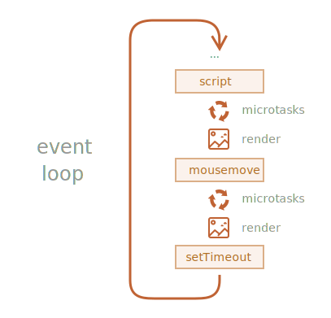

마이크로태스크
====

#### 동기 · 비동기 코드 실행 시점

##### `Promise` <sub>(객체)</sub> 핸들러 <sub>(비동기)</sub>
- 항상 동기 코드 다음 실행

##### 하단 일반 코드 <sub>(동기)</sub>
- 핸들러보다 먼저 실행 <sub>(처리 시점 무관)</sub>
```javascript
let promise = Promise.resolve();

promise.then(() => "Promise 성공!");

"코드 종료";

// 출력 순서
// ① "코드 종료"
// ② "Promise 성공!"
```

### 마이크로태스크 큐

##### 내부 큐 <sub>(비동기 작업 처리 담당)</sub>
- `PromiseJobs` <sub>(ECMA)</sub>
- 마이크로태스크 큐 <sub>(V8 엔진)</sub>

#### [명세서](https://tc39.github.io/ecma262/#sec-jobs-and-job-queues) 내용

##### a. 선입 작업 먼저 실행 <sub>(first-in-first-out · FIFO)</sub>
- `Promise` <sub>(객체)</sub> 핸들러
  - 큐 내 삽입 <sub>(실행 X)</sub>

##### b. 처리 작업 無 → 큐 내 작업 실행 시작
- 현재 처리 중인 코드 無
  - 큐 내 작업 순차 실행 <sub>(엔진)</sub>


##### 다수 체인 구성 시 각각 비동기 실행 <sub>(내부 큐 순차 삽입)</sub>
- 큐 내 핸들러 실행 시점 <sub>(2가지 충족 필요)</sub>
  - a. 현재 코드 완료
  - b. 큐 내 선입 <sub>(이전)</sub> 핸들러 실행 완료

##### 동기 코드 → 비동기화 <sub>(`Promise` 객체 적용)</sub>
- `then` <sub>(메서드)</sub> 사용
```javascript
Promise.resolve()
  .then(() => "Promise 성공!");
"코드 종료";

// 출력 순서
// ① 코드 종료
// ② Promise 성공!

↓↓↓

Promise.resolve()
  .then(() => "Promise 성공!")
  .then(() => "코드 종료");

// 출력 순서
// ① Promise 성공!
// ② 코드 종료
```

### 미처리 거부

##### 미처리 에러 <sub>(거부)</sub> → 전역 에러 생성
- 체인 끝 `catch` 핸들러 無 · 에러 처리 X
  - 내부 큐 끝 에러 <sub>(거부)</sub> 미처리

##### `catch` 핸들러 추가 여부
- 추가 시 에러 처리 <sub>(전역 에러 X)</sub>
```javascript
let promise = Promise.reject(new Error("Promise 실패!"))
promise.catch(e => "잡았다!");

// 에러 처리 (전역 에러 X)
window.addEventListener('unhandledrejection', function(event) {
  event.reason;
});
```
- 미추가 시 전역 에러
  1. 내부 큐 내 작업 無
  2. `unhandledrejection` <sub>(이벤트)</sub> 발생
```javascript
let promise = Promise.reject(new Error("Promise 실패!"));
//  promise.catch(e => "잡았다!");

// 에러 미처리 → 전역 에러
window.addEventListener('unhandledrejection', function(event) {
  event.reason; // Error: "Promise 실패!"
});
```

#### 에러 지연 처리 <sub>(`setTimeout` 메서드 이용)</sub>
```javascript
let promise = Promise.reject(new Error("Promise 실패!"));
setTimeout(() => promise.catch(err => alert('잡았다!')), 1000);

// 에러 미처리 → 전역 에러
window.addEventListener('unhandledrejection', function(event) {
  event.reason; // Error: "Promise 실패!"
});
```

##### 실행 순서
1. `unhandledrejection` 핸들러
   - `"Promise 실패!"`
2. `catch` 핸들러 <sub>(`setTimeout` 메서드 내)</sub>
   - `"잡았다!"`

##### `unhandledrejection` <sub>(이벤트)</sub> 생성 시점
- 내부 큐 내 작업 모두 완료 후
  - 큐 내 핸들러 중 거부 발생 시

### \[마이크로 vs 매크로\]테스트

##### 마이크로테스크 큐 작업
- `Promise` <sub>(객체)</sub> 핸들러
  - `then`
  - `catch`
  - `finally`
- 기타 등등

##### 매크로테스크 큐 작업
- `setTimeout` <sub>(메서드)</sub>
- `setInterval` <sub>(메서드)</sub>
- 입출력 작업
- UI 렌더링
- 기타 등등

##### 진행 순서



1. 매크로테스크 큐 <sub>(`script`)</sub>
2. 마이크로태스크 큐
3. 렌더링
4. 매크로테스크 큐 <sub>(`mousemove` 이벤트)</sub>
5. 마이크로태스크 큐
6. 렌더링
7. 매크로테스크 큐 <sub>(`setTimeout` 메서드)</sub>
8. 마이크로태스크 큐
9. 렌더링
10. …

##### 에러 지연 처리 진행 순서
1. 매크로테스트 큐
2. 마이크로테스크 큐 <sub>(핸들러 삽입)</sub>
   - 거부 핸들러 <sub>(즉시 발생)</sub> → 전역 에러
     - `unhandledrejection` <sub>(이벤트)</sub> 발생
3. 매크로테스트 큐
   - `catch` 핸들러 등록
4. 마이크로테스크 큐
   - `catch` 핸들러 실행
3. 미처리 거부된 `Promise` <sub>(객체)</sub> 발견
   - `unhandledrejection` <sub>(이벤트)</sub> 발생


##### 부가 설명
1. `Promise` <sub>(객체)</sub> 즉시 거부 처리
2. `.catch` 핸들러 호출 <sub>(`setTimeout` 안)</sub>
3. 스케줄링 '기록'
    - 즉시 실행 X
4. 에러
    - `unhandledrejection` <sub>(이벤트)</sub> 발생
5. `window` <sub>(전역 객체)</sub>
    - 이벤트 발생 감지
6. `.catch` 핸들러 스캐줄링 실행
    - 에러 처리

<br />

요약
====

##### 모든 `Promise` <sub>(객체)</sub> 동작
- `PromiseJobs` <sub>(내부 큐)</sub> 들어가서 처리
  - 마이크로태스크 큐 <sub>(ES8 용어)</sub>
- `Promise` <sub>(객체)</sub> 처리
  - 항상 비동기 처리

##### 핸들러 <sub>(`.then` · `.catch` · `.finally`)</sub>
- 항상 현재 코드 종료 후 호출
- 이후 코드 실행 필요 시
  - `.then` 체인 추가

##### 대다수 JS 엔진 <sub>(브라우저 · Node.js 등)</sub>
- 마이크로태스크 연관 관계 <sub>(`Promise` 객체 X)</sub>
  - 이벤트 루프
  - 매크로태스크
