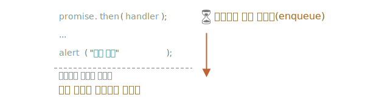

마이크로태스크
====

##### `Promise` <sub>(객체)</sub> 핸들러 <sub>(`.then` · `.catch` · `.finally`)</sub>
- 항상 비동기적 실행

##### `Promise` <sub>(객체)</sub> 핸들러 아래 코드
- 핸들러보다 먼저 실행
  - `Promise` <sub>(객체)</sub> 즉시 이행해도 동일
```javascript
let promise = Promise.resolve();

promise.then(() => alert("Promise 성공!"));

alert("코드 종료");

// 메시지 출력 순서
// ① "코드 종료"
// ② "Promise 성공!"
```

### 마이크로태스크 큐

##### 비동기 작업 처리
- 적절한 관리 필요

##### 용어
- ECMA
  - `PromiseJobs` <sub>(내부 큐)</sub>
- V8 엔진
  - 마이크로태스크 큐 <sub>(선호 용어)</sub>

##### 명세서 설명
- 먼저 들어온 작업 : 먼저 실행
  - first-in-first-out <sub>(FIFO)</sub>
- 실행할 것 아무것도 남아있지 않을 때
  - 마이크로태스크 큐 내 작업 실행 시작

#### 요약

##### 어떤 `Promise` <sub>(객체)</sub> 준비 완료 시
- 해당 `Promise` <sub>(객체)</sub> 핸들러
  - 큐에 들어감
  - 실행 X

##### 현재 코드에서 자유로운 상태 되었을 때
- 엔진 : 큐에서 작업 꺼내 실행
- 위 예시
  - `'코드 종료'` 먼저 출력되는 이유



##### `Promise` <sub>(객체)</sub> 핸들러
- 항상 내부 큐 통과

##### 다수 핸들러 체인
- 각 핸들러
  - 비동기적 실행

##### 큐 내 핸들러들 실행 시점
1. 현재 코드 완료되고
2. 큐 내 적체된 이전 핸들러들 실행 완료 시

##### 위 예시 : 'Promise 성공!' → '코드 종료' <sub>(순서 바꾸기)</sub>
- `then` <sub>(메서드)</sub> 사용
  - `'코드 종료'` → 큐에 넣기
```javascript
Promise.resolve()
  .then(() => alert("Promise 성공!"))
  .then(() => alert("코드 종료"));
```

### 처리되지 못한 거부

##### `unhandledrejection` <sub>(이벤트)</sub>
- 미처리 거부된 `Promise` <sub>(객체)</sub>
  - 전역 에러

##### '처리되지 못한 거부'
- 마이크로태스크 큐 끝
  - `Promise` <sub>(객체)</sub> 에러 미처리 시 발생

##### `.catch` 핸들러 추가
- 에러 처리
```javascript
let promise = Promise.reject(new Error("Promise 실패!"));
promise.catch(err => alert('잡았다!'));

// 에러 처리됨
// - unhandledrejection (이벤트) 핸들러 실행 X
window.addEventListener('unhandledrejection', event => alert(event.reason));
```

##### `.catch` 핸들러 미추가
- 마이크로태스크 큐 내 빈 이후
  - `unhandledrejection` <sub>(이벤트)</sub> 트리거
```javascript
let promise = Promise.reject(new Error("Promise 실패!"));

// 에러 미처리됨 (에러)
window.addEventListener('unhandledrejection', event => alert(event.reason)); // Error: "Promise 실패!"
```

##### 에러 지연 처리 <sub>(`setTimeout` 메서드 이용)</sub>
```javascript
let promise = Promise.reject(new Error("Promise 실패!"));
setTimeout(() => promise.catch(err => alert('잡았다!')), 1000);

// 에러
window.addEventListener('unhandledrejection', event => alert(event.reason)); // Error: "Promise 실패!"
```

##### 실행 순서
1. `"Promise 실패!"`
    - `unhandledrejection` 핸들러
2. `"잡았다!"`
    - `.catch` 핸들러 <sub>(`setTimeout` 안)</sub>

##### `unhandledrejection` <sub>(이벤트)</sub> 생성 시점
- 마이크로태스크 큐 내 작업 모두 완료 후

##### 엔진 : `Promise` <sub>(객체)</sub> 들 검사
- 큐 내 핸들러 중 하나라도 '거부' 상태 시
  - `unhandledrejection` <sub>(핸들러)</sub> 트리거

##### 위 예시 `.catch` 핸들러 <sub>(`setTimeout` 사용해 추가)</sub>
- 결국 트리거 됨
  - 다만 `unhandledrejection` 발생 이후

### 에러 지연 처리 추가 설명

##### microtask 큐 작업
- 핸들러
  - `.then`
  - `.catch`
  - `.finally`
- 기타 등등

##### macrotask 큐 작업
- `setTimeout` <sub>(메서드)</sub>
- `setInterval` <sub>(메서드)</sub>
- I/O operations
- UI rendering
- 기타 등등

##### 진행 순서
1. microtask 큐 내 작업
2. macrotask 큐 내 작업

##### 예시 <sub>(에러 지연 처리)</sub> 진행 순서
1. microtask 큐 내 작업 진행
2. macrotask 큐 내
    - 에러 처리 작업 진행
3. 미처리 거부된 `Promise` <sub>(객체)</sub> 발견
    - `unhandledrejection` <sub>(이벤트)</sub> 발생


##### 부가 설명
1. `Promise` <sub>(객체)</sub> 즉시 거부 처리
2. `.catch` 핸들러 호출 <sub>(`setTimeout` 안)</sub>
3. 스케줄링 '기록'
    - 즉시 실행 X
4. 에러
    - `unhandledrejection` <sub>(이벤트)</sub> 발생
5. `window` <sub>(전역 객체)</sub>
    - 이벤트 발생 감지
6. `.catch` 핸들러 스캐줄링 실행
    - 에러 처리

<br />

요약
====

##### 모든 `Promise` <sub>(객체)</sub> 동작
- `PromiseJobs` <sub>(내부 큐)</sub> 들어가서 처리
  - 마이크로태스크 큐 <sub>(ES8 용어)</sub>
- `Promise` <sub>(객체)</sub> 처리
  - 항상 비동기 처리

##### 핸들러 <sub>(`.then` · `.catch` · `.finally`)</sub>
- 항상 현재 코드 종료 후 호출
- 이후 코드 실행 필요 시
  - `.then` 체인 추가

##### 대다수 JS 엔진 <sub>(브라우저 · Node.js 등)</sub>
- 마이크로태스크 연관 관계 <sub>(`Promise` 객체 X)</sub>
  - 이벤트 루프
  - 매크로태스크
