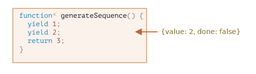

제너레이터
=========

##### 일반 함수
- 0 ~ 1개 값 반환

##### 제너레이터 <sub>(generator)</sub>
- 여러 개의 값 반환
  - 필요에 따라 하나씩 <sub>(yield)</sub>
- 이터러블 <sub>(객체)</sub> 함께 사용 시
  - 데이터 스트림 쉽게 생성

### 제너레이터 함수

##### 문법
- `function*`
```javascript
function* generateSequence() {
  yield 1;
  yield 2;
  return 3;
}
```

##### 제너레이터 함수 호출 시
- 코드 실행 X
- '제너레이터 객체' 반환
  - 실행 처리 객체
```javascript
function* generateSequence() {
  yield 1;
  yield 2;
  return 3;
}

// 제너레이터 함수
// - 제너레이터 객체 생성
let generator = generateSequence();
alert(generator); // [object Generator]
```
- 함수 본문 코드
  - 아직 실행 X


#### `next()` <sub>(메서드)</sub>
- 제너레이터 주요 메서드

##### `yield <value>` <sub>(문)</sub>
- 가장 가까운 `yield` <sub>(문)</sub>
  - 만날 때까지 실행 지속
- `value` 생략 시
  - `undefined`

##### `yield <value>` <sub>(문)</sub> 도달 시
- 실행 중단
- `value` <sub>(산출 목표 값)</sub>
  - 바깥 코드 반환

##### 반환 객체 내 프로퍼티 <sub>(2개)</sub>
- `value`
  - 산출 값
- `done` <sub>(`Boolean`)</sub>
  - `true` &nbsp;&nbsp;: 함수 코드 종료
  - `false` : 함수 코드 실행 중

#### 제너레이터 생성

##### 첫 번째 산출 값 반환
```javascript
function* generateSequence() {
  yield 1;
  yield 2;
  return 3;
}

let generator = generateSequence();

let one = generator.next();

// {value: 1, done: false}
alert(JSON.stringify(one));
```
- 첫 번째 값만 반환
  - 실행 : 2번째 줄 중단


##### `generator.next()` 다시 호출 <sub>(2번째)</sub>
- 실행 재개
  - 다음 `yield` 반환
- 실행 : 3번째 줄 중단
```javascript
let two = generator.next();

// {value: 2, done: false}
alert(JSON.stringify(two));
```



##### `generator.next()` 다시 호출 <sub>(3번째)</sub>
- 실행 : `return` <sub>(문)</sub> 도달
  - 함수 종료
```javascript
let three = generator.next();

// {value: 3, done: true}
alert(JSON.stringify(three));
```


##### 제너레이터 종료
- `generator.next()` 여러 번 호출
  - 소용 X
  - `{ done: true }` <sub>(객체)</sub> 계속 반환

<br />

 **`function* f( … )` · `function *f( … )`**

- 둘 다 유효

##### 대개 1번째 문법 선호
- `*` <sub>(asterisk)</sub> : 제너레이터 "함수" 표현
  - 함수 종류 표현
  - 함수 이름 표현 X

<br />

### 제너레이터 · 이터러블 <sub>(객체)</sub>
- 제너레이터 == 이터러블 <sub>(객체)</sub>
  - `for…of` <sub>(반복문)</sub> 사용 가능
```javascript
function* generateSequence() {
  yield 1;
  yield 2;
  return 3;
}

let generator = generateSequence();

for(let value of generator) {
  alert(value); // 1, 2
                // 3 : 미출력
}
```

##### `3` 미출력 이유
- `for…of` <sub>(이터레이션)</sub>
  - `{ done: true }` <sub>(객체)</sub> 반환 시
    - 마지막 `value` 무시
- 마지막 값
  - `yield` 사용
  - `return` X
```javascript
function* generateSequence() {
  yield 1;
  yield 2;
  yield 3;
}

let generator = generateSequence();

for(let value of generator) {
  alert(value); // 1, 2, 3
}
```
- `...` <sub>(전개 구문)</sub> 사용 가능
```javascript
function* generateSequence() {
  yield 1;
  yield 2;
  yield 3;
}

let sequence = [0, ...generateSequence()];

alert(sequence); // 0, 1, 2, 3
```

### 이터러블 <sub>(객체)</sub> 대신 제너레이터 사용하기
- `range` <sub>(이터러블 객체)</sub> 예시 <sub>(이터러블 챕터)</sub>
```javascript
let range = {
  from: 1,
  to: 5,

  // for…of 최초 호출 시
  // - [Symbol.iterator] (메서드) 호출
  [Symbol.iterator]() {

    /*
     [Symbol.iterator] (메서드)
     - 이터레이터 (객체) 반환
     for…of (반복문)
     - 반환된 이터레이터 (객체) 만 대상 동작
       - 이때 다음 값 정해짐
     */
    return {
      current: this.from,
      last: this.to,

      // for…of (반복문)
      // - 각 이터레이션마다 next() (메서드) 호출
      next() {

        // next() (메서드)
        // - { done: …, value : … } (객체) 반환
        if (this.current <= this.last) {
          return { done: false, value: this.current++ };
        } else {
          return { done: true };
        }
      }
    };
  }
};

alert([...range]); // 1,2,3,4,5
```
- 제너레이터 함수 버전
```javascript
let range = {
  from: 1,
  to: 5,

// [Symbol.iterator]: function*()
  *[Symbol.iterator]() {
    for(let value = this.from; value <= this.to; value++) {
      yield value;
    }
  }
};

alert( [...range] ); // 1, 2, 3, 4, 5
```

##### `range[Symbol.iterator]()` <sub>(제너레이터 메서드)</sub>
- 제너레이터 반환
- `for…of` 동작 조건 충족

##### `for…of` 동작 조건
- `.next()` <sub>(메서드)</sub> 有
- 반환 값 형태 <sub>(객체)</sub>
  - `{ value: … , done: boolean }`

##### 제너레이터
- JS 추가 당시
  - 이터레이터 구현 용이성 염두
- 이터러블 <sub>(객체)</sub> 대비
  - 간결성 ↑ <sub>(동일 기능 제공)</sub>

<br />

 **제너레이터 : 무한한 값 생성 가능**

- ex&#41; 끊임없는 의사 난수 생성 등

##### `for…of` 안
- `break` · `return` 필요
  - 무한 반복문 중단

<br />

### 제너레이터 컴포지션
- 제너레이터 안
  - 제너레이터 끼워 넣기

##### 제너레이터 함수
- 연속된 숫자 생성
```javascript
function* generateSequence(start, end) {
  for (let i = start; i <= end; i++) yield i;
}
```
- 좀 더 복잡한 값 연속 생성
  - 위 함수 기반

##### 값 생성 규칙
1. 0 ~ 9 <sub>(숫자)</sub>
    - 48 ~ 57 &nbsp;<sub>(문자 코드)</sub>
2. A ~ Z <sub>(알파벳 대문자)</sub>
    - 65 ~ 90 &nbsp;<sub>(문자 코드)</sub>
3. a ~ z &nbsp;<sub>(알파벳 소문자)</sub>
    - 97 ~ 122 <sub>(문자 코드)</sub>
- 응용
  - 특수 문자 추가
  - 비밀번호 생성
  - 기타 등등

##### 일반 함수 사용 시
1. 함수 여러 개 생성
2. 호출 결과 : 어딘가에 저장
3. 다시 그 결과들 조합

##### `yield*` <sub>(제너레이터 특수 문법)</sub>
- 한 제너레이터
  - 다른 제너레이터에 '끼워 넣기'
```javascript
function* generateSequence(start, end) {
  for (let i = start; i <= end; i++) yield i;
}

function* generatePasswordCodes() {

  // 0 ~ 9
  yield* generateSequence(48, 57);

  // A ~ Z
  yield* generateSequence(65, 90);

  // a ~ z
  yield* generateSequence(97, 122);

}

let str = '';

for(let code of generatePasswordCodes()) {
  str += String.fromCharCode(code);
}

alert(str); // 0 ~ 9
            // A ~ Z
            // a ~ z
```

##### `yield*` <sub>(지시자)</sub>
- 다른 제너레이터에 실행 위임

##### ex&#41; `yield* gen`
1. `gen` <sub>(제너레이터)</sub> 대상 반복 수행
2. 산출 값들
    - 바깥으로 전달
- 외부 제너레이터에 의한 값 산출처럼 보임

##### 중첩 제너레이터 코드 직접 삽입
- 동일 결과
```javascript
function* generateSequence(start, end) {
  for (let i = start; i <= end; i++) yield i;
}

function* generateAlphaNum() {

  // yield* generateSequence(48, 57);
  for (let i = 48; i <= 57; i++) yield i;

  // yield* generateSequence(65, 90);
  for (let i = 65; i <= 90; i++) yield i;

  // yield* generateSequence(97, 122);
  for (let i = 97; i <= 122; i++) yield i;

}

let str = '';

for(let code of generateAlphaNum()) {
  str += String.fromCharCode(code);
}

alert(str); // 0 ~ 9
            // A ~ Z
            // a ~ z
```

##### 제너레이터 컴포지션 사용 시
- 한 제너레이터 흐름
  - 자연스럽게 다른 제너레이터에 삽입
- 추가 메모리 필요 X
  - 중간 결과 저장 용도

<br />

## 요약
- 제너레이터는 제너레이터 함수 `function* f( … ) { … }`을 사용해 만듭니다.
- `yield` 연산자는 제너레이터 안에 있어야 합니다.
- `next`/`yield` 호출을 사용하면 외부 코드와 제너레이터 간에 결과를 교환할 수 있습니다.

모던 자바스크립트에서는 제너레이터를 잘 사용하지 않습니다. 그러나 제너레이터를 사용하면 실행 중에도 제너레이터 호출 코드와 데이터를 교환할 수 있기 때문에 유용한 경우가 종종 있습니다. 그리고 제너레이터를 사용하면 이터러블 객체를 쉽게 만들 수 있다는 장점도 있습니다.

다음 챕터에선 `for await ... of` 루프 안 비동기 데이터 스트림을 다룰 때 사용되는 비동기 제너레이터(asnyc generator)에 대해 알아볼 예정입니다. 비동기 제너레이터는 페이지네이션을 사용해 전송되는 비동기 데이터 스트림을 다룰 때 사용됩니다.

웹 프로그래밍에선 데이터 스트림을 다뤄야 하는 경우가 많은데, 제너레이터는 이 경우에 유용합니다.

<br />

##  과제

### title
의사 난수 생성기
개발을 하다 보면 임의의 데이터가 필요한 경우가 자주 생깁니다.

테스팅을 진행할 때도 임의의 데이터가 필요할 수 있습니다. 정형화된 데이터가 아닌 랜덤한 텍스트나 숫자 등을 입력해 테스트를 진행하는 것이 좋기 때문입니다.

자바스크립트에서는 `Math.random()`을 사용해 난수를 만들 수 있습니다. 그런데 테스트 도중 문제가 생겨 테스트를 중단했다가 소스 코드를 고치고 다시 테스트를 재개할 때는 이전에 문제를 일으켰던 데이터와 동일한 데이터를 입력해 같은 문제가 발생하는지 살펴보아야 합니다.

이를 위해 '고정값 의사 난수 생성기'가 사용됩니다. 고정값 의사 난수 생성기는 첫 번째 값을 '고정값'으로 삼고, 생성기 안에 저장된 공식을 사용해 두 번째 값을 생성합니다. 고정값이 같으면 난수 생성기에서 차례대로 나오는 값들이 동일하므로 난수 생성 흐름을 쉽게 재현할 수 있습니다. 고정값만 기억해 두면 됩니다.

다소 균일하게 분포된 값을 생성하는 공식의 예는 다음과 같습니다.
```javascript
next = previous * 16807 % 2147483647
```

고정값으로 `1`을 사용하면 생성기에서 나오는 값은 다음과 같습니다.

1. `16807`
2. `282475249`
3. `1622650073`
4. …기타 등등…

이번 과제는 고정값을 받아 위 공식을 사용해 제너레이터를 만들어내는 함수인 `pseudoRandom(seed)`을 만드는 것입니다.

예시:
```javascript
let generator = pseudoRandom(1);

alert(generator.next().value); // 16807
alert(generator.next().value); // 282475249
alert(generator.next().value); // 1622650073
```

<br />


```javascript
function* pseudoRandom(seed) {
  let value = seed;

  while(true) {
    value = value * 16807 % 2147483647
    yield value;
  }

};

let generator = pseudoRandom(1);

alert(generator.next().value); // 16807
alert(generator.next().value); // 282475249
alert(generator.next().value); // 1622650073
```

다음과 같이 일반 함수를 사용하여 동일한 작업을 수행 할 수 있음에 유의하세요.
```javascript
function pseudoRandom(seed) {
  let value = seed;

  return function() {
    value = value * 16807 % 2147483647;
    return value;
  }
}

let generator = pseudoRandom(1);

alert(generator()); // 16807
alert(generator()); // 282475249
alert(generator()); // 1622650073
```

일반 함수 또한 제너레이터와 같은 기능을 수행합니다. 그러나 일반 함수는 `for..of`을 이용해 반복하여 다른 곳에서 유용할 수 있는 제너레이터 구성 사용 능력을 잃게 합니다.

테스트 코드가 담긴 샌드박스를 열어 정답을 확인해보세요.
