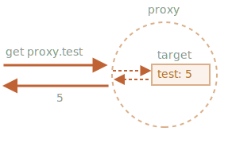

`Proxy` <sub>(객체)</sub>
====

##### 래퍼 객체
- 기존 객체 대상 작업 가로챈 후 대신 수행
  - a. 작업 변형 후 수행
  - b. 그대로 전달

#### 문법
```javascript
let proxy = new Proxy(target, handler);
```

##### `target`
- 적용 대상 <sub>(기존 객체)</sub>
  - 모든 객체 유형 <sub>(함수 등)</sub> 가능

##### `handler`
- '트랩' <sub>(동작 가로채는 메서드)</sub> 구현 객체
  - `Proxy` <sub>(객체)</sub> 설정 위치

|트랩|활성화 시점 <sub>(`target` 대상 작업)</sub>|
|:---:|---|
|`get`|프로퍼티 읽기|
|`set`|프로퍼티 쓰기|
|…|…|

##### 동작 과정
1. `Proxy` <sub>(객체)</sub> 대상 작업 수행
2. `handler` 내 작업 상응 트랩 유무 여부 확인
   - 有 → 트랩 실행 <sub>(작업 대신 수행)</sub>
   - 無 → 작업 그대로 전달

##### 빈 <sub>(트랩 無)</sub> `Proxy` <sub>(객체)</sub>
- 모든 작업 그대로 전달
```javascript
let target = {};

// 빈 handler (트랩 구현 객체) 전달
let proxy = new Proxy(target, {});

// 값 쓰기 동작 그대로 전달 (프로퍼티 생성)
proxy.test = 5;

target.test; // 5

// 값 읽기 동작 그대로 전달
proxy.test;  // 5

// 반복 작업 그대로 전달
for (let key in proxy) {
  key; // test
}
```
- `target` <sub>(기존 객체)</sub> 감싼 투명한 래퍼 역할 수행

ㅂ

#### 트랩 적용 <sub>(가로채기)</sub> 가능 작업

##### '내부 메서드'
- 객체 대상 작업 내 관여

|내부 메서드|관여 작업|
|:---:|---|
|`[[Get]]`|프로퍼티 읽기|
|`[[Set]]`|프로퍼티 쓰기|
|…|…|

- 명세서에만 정의 <sub>(개발자 사용 불가능)</sub>
- 상응 트랩 존재 시 호출 가로채어짐

##### 내부 메서드 · 상응 트랩 [목록](https://tc39.es/ecma262/#sec-proxy-object-internal-methods-and-internal-slots)
|내부 메서드|대응 트랩|동작 시점|
|---|---|---|
|`[[Get]]`|`get`|프로퍼티 읽기|
|`[[Set]]`|`set`|프로퍼티 쓰기|
|`[[HasProperty]]`|`has`|`in` <sub>(연산자)</sub> 동작|
|`[[Delete]]`|`deleteProperty`|`delete` <sub>(연산자)</sub> 동작|
|`[[Call]]`|`apply`|함수 호출|
|`[[Construct]]`|`construct`|`new` <sub>(연산자)</sub> 동작|
|`[[GetPrototypeOf]]`|`getPrototypeOf`|`Object.getPrototypeOf`|
|`[[SetPrototypeOf]]`|`setPrototypeOf`|`Object.setPrototypeOf`|
|`[[IsExtensible]]`|`isExtensible`|`Object.isExtensible`|
|`[[PreventExtensions]]`|`preventExtensions`|`Object.preventExtensions`|
|`[[DefineOwnProperty]]`|`defineProperty`|`Object.definePropert[y·ies]`|
|`[[GetOwnProperty]]`|`getOwnPropertyDescriptor`|`Object.getOwnPropertyDescriptor`<br />`Object.[key·value·entrie]s`<br />`for…in` <sub>(반복문)</sub>|
|`[[OwnPropertyKeys]]`|`ownKeys`|`Object.getOwnProperty[Name·Symbol]s`<br />`Object.[key·value·entrie]s`<br />`for…in` <sub>(반복문)</sub>|

<br />

 **규칙**

##### 내부 메서드 · 트랩
- 사용 시 규칙 준수 필요
  - 대다수 반환 값 관련

##### `boolean` 반환

|내부 메서드|필수 반환 값|
|:---:|---|
|`[[Set]]`|`true` <sub>(값 쓰기 성공)</sub>|
||`false` <sub>(값 쓰기 실패)</sub>|
|`[[Delete]]`|`true` <sub>(값 제거 성공)</sub>|
||`false` <sub>(값 제거 실패)</sub>|
|…|…|

##### 객체 반환

|내부 메서드|필수 반환 값|
|:---:|---|
|`[[GetPrototypeOf]]`|`Object.getPrototypeOf(기존 객체)`|
|…|…|

<br />

### `get` <sub>(트랩)</sub> · 프로퍼티 기본값 설정

##### 프로퍼티 읽기 가로채기
- `[[Get]]` <sub>(내부 메서드)</sub>
```javascript
//                  target
let proxy = new Proxy(…, {
  get(target, property[, receiver]) {…}
});
```
- `target` <sub>(== 생성자 1번째 인수)</sub>
  - 적용 대상 <sub>(기존 객체)</sub>
- `property` <sub>(문자열)</sub>
  - 프로퍼티명
- `receiver`
  - getter <sub>(접근자 프로퍼티)</sub> 내 `this`
    - 보통 `Proxy` <sub>(객체)</sub> 자신
    - `Proxy` <sub>(객체)</sub> 상속 시 하위 객체

##### 배열 내 부재 요소 접근 시 `0` <sub>(기본값)</sub> 반환
- `undefined` <sub>(기존 기본값)</sub> → `0` <sub>(새 기본값)</sub>
```javascript
let numbers = [0, 1, 2];

numbers[1];   // 1
numbers[123]; // undefined

numbers = new Proxy(numbers, {

  // 프로퍼티 읽기 동작 시 실행
  get(target, prop) {
    if (prop in target) {
      return target[prop];

    // 배열 내 요소 부재 시 0 반환
    } else {
      return 0;
    }
  }
});

numbers[1];   // 1
numbers[123]; // 0
```

##### 사전 객체 내 부재 구절 접근 시 그대로 반환
- `undefined` <sub>(기존 기본값)</sub> → 접근 값 <sub>(새 기본값)</sub>
```javascript
let dictionary = {
  'Hello': '안녕하세요',
  'Bye': '안녕히 가세요'
};

dictionary['Hello'];   // 안녕하세요
dictionary['Welcome']; // undefined

dictionary = new Proxy(dictionary, {

  // 프로퍼티 읽기 동작 시 실행
  get(target, phrase) {
    if (phrase in target) {
      return target[phrase];

    // 사전 내 구절 부재 시 그대로 반환
    } else {
      return phrase;
    }
  }
});

dictionary['Hello'];   // 안녕하세요
dictionary['Welcome']; // Welcome
```

<br />

 **주의**

##### 프락시 <sub>(객체)</sub>
- 기존 객체 덮어쓰기 필수 <subP>(위치 무관)</subP>
```javascript
let dictionary = {…};
dictionary = new Proxy(dictionary, …);
```

##### 기존 객체 참조
- `Proxy` <sub>(객체)</sub> 적용 후 제거 필수
  - 미제거 시 문제 발생 확률 ↑

<br />

### `set` <sub>(트랩)</sub> · 프로퍼티 값 검증

##### 프로퍼티 쓰기 가로채기
- `[[Set]]` <sub>(내부 메서드)</sub>
```javascript
//                  target
let proxy = new Proxy(…, {
  set(target, property[, receiver]) {…}
});
```
- `target` <sub>(== 생성자 1번째 인수)</sub>
  - 적용 대상 <sub>(기존 객체)</sub>
- `property` <sub>(문자열)</sub>
  - 프로퍼티명
- `receiver`
  - setter <sub>(접근자 프로퍼티)</sub> 내 `this`
    - 보통 `Proxy` <sub>(객체)</sub> 자신
    - `Proxy` <sub>(객체)</sub> 상속 시 하위 객체

##### 배열 내 숫자 외 저장 시 에러

|입력 자료형|트랩 반환 값|동작|
|:---:|:---:|:---:|
|`number`|`true`|저장|
|`number` 외|`false`|`TypeError`|
```javascript
let numbers = [];

numbers.push(1);
numbers.push(2);
numbers.push("test");

numbers.length; // 3

numbers = [];

numbers = new Proxy(numbers, {

  // 프로퍼티 쓰기 동작 시 실행
  set(target, prop, val) {
    if (typeof val == 'number') {
      target[prop] = val;
      return true;
    } else {
      return false;
    }
  }
});

// 숫자 저장 시 정상 동작
numbers.push(1);
numbers.push(2);

numbers.length; // 2

// 문자열 저장 시 에러
numbers.push("test"); // Error: 'set' on proxy

"윗줄 에러 발생 · 경고 창 코드 절대 미실행";
```

##### 적용 후 기존 객체 관련 기능 사용 가능
- 기존 기능 손상 X
- ex\) 배열
  - `push` <sub>(메서드)</sub>
  - `length` <sub>(프로퍼티)</sub>
  - 기타 등등

##### 배열 요소 추가 메서드 <sub>(`push` · `unshift` 등)</sub>
- 동작 시 `[[Set]]` <sub>(내부 메서드)</sub> 사용
  - `Proxy` <sub>(객체)</sub> 적용 가능
  - 메서드 오버라이딩 불필요 <sub>(코드 간결성 ↑)</sub>

<br />

 **`boolean` 반환 필수**

##### `set` <sub>(트랩)</sub> 규칙 <sub>(`boolean` 반환)</sub> 준수 필수

|반환 값|결과|
|:---:|---|
|truthy <sub>(`true`)</sub>|값 쓰기 성공|
|falsy <sub>(`false`)</sub>|값 쓰기 실패 <sub>(`TypeError`)</sub>|

<br />

### `ownKeys` · `getOwnPropertyDescriptor` <sub>(트랩)</sub> · 반복 작업

#### `ownKeys` <sub>(트랩)</sub>

##### 프로퍼티 목록 접근 가로채기
- `[[OwnPropertyKeys]]` <sub>(내부 메서드)</sub>
  - 프로퍼티 순회 동작 대다수 내부 사용
    - `Object.keys` <sub>(메서드)</sub>
    - `for…in` <sub>(반복문)</sub>
    - 기타 등등
```javascript
//                  target
let proxy = new Proxy(…, {
  ownKeys(target) {…}
});
```
- `target` <sub>(== 생성자 1번째 인수)</sub>
  - 적용 대상 <sub>(기존 객체)</sub>

##### 순회 동작별 차이점 <sub>(반환 값 · 순회 조건)</sub>
- `Object.getOwnPropertyNames` <sub>(메서드)</sub>
  - `symbol` 외 키
- `Object.getOwnPropertySymbols` <sub>(메서드)</sub>
  - `symbol` 키
- `Object.[key·value]s` <sub>(메서드)</sub>
  - `symbol` 외 키 · 값 <sub>(`enumerable: true`)</sub>
- `for…in` <sub>(반복문)</sub>
  - `symbol` 외 키 <sub>(`enumerable: true`)</sub>
  - 프로토타입 내 키 <sub>(`enumerable: true`)</sub>

##### 순회 시 `_` <sub>(밑줄)</sub> 시작 프로퍼티 <sub>(`_prop`)</sub> 제외
- `Object.[key·value]s` <sub>(메서드)</sub>
- `for…in` <sub>(반복문)</sub>
- 기타 등등
```javascript
let user = {
  name: "John",
  age: 30,
  _password: "***"
};

for (let key in user) {
  key; // name, age, _password
}

Object.keys(user);   // name, age, _password
Object.values(user); // John, 30, "***

user = new Proxy(user, {

  // 프로퍼티 순회 시작 시 최초 1번만 실행 (목록 반환)
  ownKeys(target) {

    // 목록 내 `_` (밑줄) 시작 프로퍼티 제외 후 반환
    return Object.keys(target).filter(key => !key.startsWith('_'));
  }
});

for (let key in user) {
  key; // name, age
}

Object.keys(user);   // name, age
Object.values(user); // John, 30
```

#### `getOwnPropertyDescriptor` <sub>(트랩)</sub>

##### 프로퍼티 설명자 접근 가로채기
- `[[GetOwnProperty]]` <sub>(내부 메서드)</sub>
  - 프로퍼티 순환 동작 일부 내부 사용
    - `enumerable` <sub>(플래그)</sub> 확인
```javascript
//                  target
let proxy = new Proxy(…, {
  getOwnPropertyDescriptor(target, property) {…}
});
```

##### `ownKeys` <sub>(트랩)</sub> 내 새 목록 반환 시
- 프로퍼티 설명자 <sub>(`enumerable` 플래그)</sub> 無
  - 프로퍼티 순회 동작 일부 내 제외
    - `Object.keys` <sub>(메서드)</sub>
    - `for…in` <sub>(반복문)</sub>
    - 기타 등등
```javascript
let user = {};

user = new Proxy(user, {
  ownKeys(target) {

    // 프로퍼티 설명자 (enumerable 플래그 등) 無
    // - 프로퍼티 순환 동작 일부 내 제외
    return ['a', 'b', 'c'];
  }
});

Object.keys(user); // "" (빈 문자열)
```
- `getOwnPropertyDescriptor` <sub>(트랩)</sub> 필요
  - 

##### `Object.keys` 프로퍼티 반환 설정
- `enumerable` <sub>(플래그)</sub> 설정
  - 객체 내 해당 프로퍼티 존재 <sub>(의미)</sub>
- `getOwnPropertyDescriptor` <sub>(트랩)</sub>
  1. 내부 메서드 호출 가로채기
      - `[[GetOwnProperty]]`
  2. `enumerable: true` <sub>(설명자)</sub> 반환
```javascript
let user = {};

user = new Proxy(user, {

  // 프로퍼티 순회 시작 시 최초 1번만 실행 (목록 반환)
  ownKeys(target) {
    return ['a', 'b', 'c'];
  },

  // 프로퍼티 설명자 (플래그) 추가
  // - 모든 프로퍼티 대상 호출
  getOwnPropertyDescriptor(target, prop) {
    return {
   // value: …,
   // writable: …,
      enumerable: true,
      configurable: true
    };
  }
});

Object.keys(user); // a, b, c
```

### `deleteProperty` <sub>(트랩)</sub> · 기타 트랩 · 프로퍼티 보호

##### `_` <sub>(밑줄)</sub> 프로퍼티 · 메서드
- 내부 전용 의미 <sub>(관습)</sub>
  - 객체 외부에서 접근 X
  - 실제로는 접근 가능
```javascript
let user = {
  name: "John",
  _password: "비밀"
};

alert(user._password); // 비밀
```

#### 프락시 사용해 해당 기능 구현

##### `get` <sub>(트랩)</sub>
- 프로퍼티 읽기 시
  - 에러 던지기

##### `set` <sub>(트랩)</sub>
- 프로퍼티 값 쓰기 시
  - 에러 던지기

##### `deleteProperty` <sub>(트랩)</sub>
- 프로퍼티 삭제 시
  - 에러 던지기

##### `ownKeys` <sub>(트랩)</sub>
- 프로퍼티 순환 시 <sub>(`for…in` · `Object.keys` 등)</sub>
  - `_` <sub>(밑줄)</sub> 시작 프로퍼티 제외
```javascript
let user = {
  name: "John",
  _password: "***"
};

user = new Proxy(user, {

  // 프로퍼티 읽기 가로채기
  get(target, prop) {
    if (prop.startsWith('_')) {
      throw new Error("접근 제한");
    }
    let value = target[prop];
    return (typeof value === 'function') ? value.bind(target) : value;
  },

  // 프로퍼티 쓰기 가로채기
  set(target, prop, val) {
    if (prop.startsWith('_')) {
      throw new Error("접근 제한");
    } else {
      target[prop] = val;
      return true;
    }
  },

  // 프로퍼티 삭제 가로채기
  deleteProperty(target, prop) {
    if (prop.startsWith('_')) {
      throw new Error("접근 제한");
    } else {
      delete target[prop];
      return true;
    }
  },

  // 프로퍼티 순회 가로채기
  ownKeys(target) {
    return Object.keys(target).filter(key => !key.startsWith('_'));
  }
});

// get (트랩)
// - _password 읽기 막음
try {
  alert(user._password);   // Error: 접근 제한
} catch(e) { alert(e.message); }

// set (트랩)
// - _password 값 쓰기 막음
try {
  user._password = "test"; // Error: 접근 제한
} catch(e) { alert(e.message); }

// deleteProperty (트랩)
// - _password 삭제 막음
try {
  delete user._password;   // Error: 접근 제한
} catch(e) { alert(e.message); }

// ownKeys (트랩)
// - 순회 대상에서 _password 제외
for (let key in user) {
  alert(key); // name
}
```
- `get` <sub>(트랩)</sub> 코드 마지막 줄 <sub>( return` 문)</sub>
```javascript
get(target, prop) {
  …
  let value = target[prop];

  /* 메서드 (함수) 여부 확인 후
   - value.bind(target) 호출
     - 메서드 내 this → target (객체) 고정
   this 미고정 시
   - get (트랩) 활성화
     - 메서드 내 this 사용해 프로퍼티 접근 시
       - 에러 발생
   */
  return (typeof value === 'function') ? value.bind(target) : value;
}
```

##### 객체 메서드 내 `_` <sub>(밑줄)</sub> 시작 프로퍼티 접근 허용
ex\) `user.checkPassword()` <sub>(메서드)</sub>
```javascript
user = {
  …

  // 비밀번호 확인
  checkPassword(value) {

    // _password (프로퍼티) 읽기
    // - get (트랩) 활성화
    //   - 에러 발생
    return value === this._password;
  }
}
```

##### `user.checkPassword()` 호출 시
- `.` <sub>(점)</sub> 앞 객체
  - `this` <sub>(`user` 객체)</sub>
- 프락시 적용 `user` <sub>(객체)</sub> 내 프로퍼티 접근 시
  - `get` <sub>(트랩)</sub> 활성화
    - 에러 발생

##### 객체 메서드 컨텍스트 → `target` <sub>(원본 객체)</sub> 바인딩
- `checkPassword()` 호출 시
  - `target` == `this` <sub>(트랩 생략)</sub>

#### 문제점

##### 해당 메서드 프락시 미적용 <sub>(원본)</sub> 객체 전달 시
- 엉망진창 되어버림
- 원본 · 프락시 적용 객체
  - 어디 있는지 파악 X

##### 한 객체 대상 다수 프락시 적용 시
- 각 프락시별 객체 대상 '수정' 동작 상이
  - 예상치 않은 결과 발생 가능

<br />

 **클래스 · `private` 프로퍼티**

##### 모던 JS 엔진
- 클래스 내 `private` 프로퍼티 사용 가능
  - 프락시 없이 프로퍼티 보호
  - 상속 불가능 <sub>(단점)</sub>

<br />

### `has` <sub>(트랩)</sub> · 범위 내 포함 여부 확인

##### `in` <sub>(연산자)</sub> 호출 가로채기
```javascript
has(target, property)
```

##### `target`
- 동작 전달 <sub>(프락시 적용)</sub> 객체
- `new Proxy` <sub>(생성자)</sub> 1번째 인수

##### `property`
- 프로퍼티명

##### 범위 표현 객체
```javascript
let range = {
  start: 1,
  end: 10
};
```

##### `range` <sub>(객체)</sub> 내 특정 숫자 포함 여부 확인
- `in` <sub>(연산자)</sub> 사용
```javascript
let range = {
  start: 1,
  end: 10
};

range = new Proxy(range, {
  has(target, prop) {
    return target.start <= prop && prop <= target.end;
  }
});

alert(5 in range);  // true
alert(50 in range); // false
```

### `apply` <sub>(트랩)</sub> · 함수 감싸기

##### 프락시 호출 <sub>(≒ 함수 호출)</sub> 시 동작
```javascript
apply(target, thisArg, args)
```

##### `target`
- 타겟 <sub>(객체 · 함수)</sub>
- `new Proxy` <sub>(생성자)</sub> 1번째 인수

##### `thisArg`
- `this` 값

##### `args`
- 인수 목록

##### `delay(f, ms)` <sub>(데코레이터)</sub>
- `delay(f, ms)` 호출 시 함수 반환
  - `f` <sub>(함수)</sub> `ms` <sub>(ms)</sub> 후 호출
```javascript
function delay(f, ms) {

  // 래퍼 함수 반환
  // - ms (지정 시간) 경과 후
  //   - f (함수) 호출 전달
  return function() {
    setTimeout(() => f.apply(this, arguments), ms);
  };
}

function sayHi(user) {
  alert(`Hello, ${user}!`);
}

// 래퍼 함수로 감싼 다음 sayHi (함수) 호출 시
// - 3초 후 함수 호출
sayHi = delay(sayHi, 3000);

// Hello, John! (3초 후)
sayHi("John");
```

##### 래퍼 함수
- 연산 전달 X
  - 프로퍼티 읽기 · 쓰기
  - 기타 등등
- 기존 함수 <sub>(`f`)</sub> 프로퍼티 정보 사라짐
  - `name`
  - `length`
  - 기타 등등
```javascript
function delay(f, ms) {
  return function() {
    setTimeout(() => f.apply(this, arguments), ms);
  };
}

function sayHi(user) {
  alert(`Hello, ${user}!`);
}

// 기존 함수 정의부 명시 인수 개수
alert(sayHi.length); // 1

sayHi = delay(sayHi, 3000);

// 래퍼 함수 정의부 명시 인수 개수
alert(sayHi.length); // 0
```

##### Proxy <sub>(객체)</sub>
- 타겟 <sub>(객체)</sub> 에 전부 전달 <sub>(훨씬 강력)</sub>
  - 연산
  - 기존 함수 <sub>(`f`)</sub> 프로퍼티
```javascript
function delay(f, ms) {
  return new Proxy(f, {
    apply(target, thisArg, args) {
      setTimeout(() => target.apply(thisArg, args), ms);
    }
  });
}

function sayHi(user) {
  alert(`Hello, ${user}!`);
}

sayHi = delay(sayHi, 3000);

// get length (연산) 까지 타겟 (객체) 에 전달
alert(sayHi.length); // 1

// Hello, John! (3초 후)
sayHi("John");
```

##### 결과 동일
- 프락시 대상 모든 연산
  - 원본 함수 전달
- 좀 더 성능 좋은 래퍼 함수

##### 이 외 다양한 트랩 존재
- 잘 알아보고 사용하기

<br />

요약
====

##### `Proxy` <sub>(객체)</sub>
- 특정 객체 감싼 후
  - 객체 대상 작업 중간 가로채는 객체
- 가로챈 작업 일부
  - 별도 처리 동작 추가
- 모든 객체 타입 적용 가능
  - 클래스
  - 함수
  - 기타 등등

##### 문법
```javascript
let proxy = new Proxy(target, {
  /* 트랩 설정 */
});
```

##### `target` <sub>(객체)</sub> 대신 `proxy` <sub>(객체)</sub> 사용 필수
- `target` <sub>(객체)</sub> 참조 사용 시
  - 큰 문제 발생

##### 래퍼 유사
- 자체 프로퍼티 · 메서드 X

##### `handler` <sub>(생성자 2번째 인수)</sub> 트랩
- 전달 시
  - 해당 트랩 기능 동작
- 미전달 시
  - 그대로 `target` <sub>(객체)</sub> 전달

#### 주요 트랩

##### 프로퍼티 관련 <sub>(부재 프로퍼티 적용 가능)</sub>
- `get` <sub>(읽기)</sub>
- `set` <sub>(쓰기)</sub>
- `deleteProperty` <sub>(삭제)</sub>

##### 함수 호출
- `apply`

##### `new` <sub>(연산자)</sub>
- `construct`

##### 기타 트랩 · 동작
- [메뉴얼](https://developer.mozilla.org/en-US/docs/Web/JavaScript/Reference/Global_Objects/Proxy)

##### 다양한 기능
- 가상 프로퍼티 · 메서드 구현
- 기본값 설정
- `observable` <sub>(객체)</sub>
- 함수 데코레이터
- 기타 등등

##### 다수 프락시 적용
- 다양한 기능 · 데코레이팅 추가 가능
