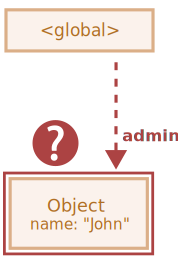

`WeakRef`
====

 **JS 언어 내 숨겨진 기능**

- 굉장히 드물게 사용

<br />

##### 도달 가능성
- 도달 가능한 · 사용중인 값
  - 메모리 내 유지

##### 강한 참조 1개
```javascript
// user (변수) → 객체 강한 참조
let user = {name: "John"};

// user (변수) → null 할당
user = null;

// 강한 참조 無
// - 도달 불가능 → 메모리 내 제거
```

##### 강한 참조 2개
```javascript
// user (변수) → 객체 강한 참조
let user = {name: "John"};

// user · admin (변수) → 객체 강한 참조
// - 참조 복사
let admin = user;

// user (변수) → null 할당
user = null;

// 강한 참조 有 (admin 변수)
// - 도달 가능 → 메모리 내 유지
```

<br />

 **강한 vs 약한 참조**

##### 강한 참조
- 가비지 컬렉션 작동 대상 X
  - 메모리 내 유지
- JS 내 일반적인 객체 참조 유형
```javascript
// user (변수) → 객체 강한 참조
let user = {name: "John"};
```

##### 약한 참조
- 가비지 컬렉션 작동 대상
  - 강한 참조 부재 시 추후 메모리 내 제거

<br />

### `WeakRef` <sub>(객체)</sub>

 **주의**

##### 학습 내용 내 사용 구조
- 실무 사용 지양

<br />

##### 타 객체 대상 약한 참조 저장
- 참조 대상 <sub>(타 객체)</sub>
  - 가비지 컬렉터 작동 대상

#### 강한 vs 약한 참조 비교 과정

##### 1. 단일 객체 대상 강한 · 약한 참조 설정
- `user` <sub>(변수)</sub> 강한 참조
- `admin` <sub>(변수)</sub> 약한 참조
```javascript
// user (변수) → 객체 강한 참조
let user = {name: "John"};

// admin (변수) → 객체 약한 참조
let admin = new WeakRef(user);
```


##### 2. 강한 참조 제거
- `user` <sub>(변수)</sub> 제거
  - 값 덮어쓰기
  - 외부 스코프 이동
  - 기타 등등
- `admin` <sub>(변수)</sub> 유지 <sub>(약한 참조)</sub>
  - 객체 대상 강한 참조 無
    - 가비지 컬렉션 작동 대상
- 가비지 컬렉션 작동 시점 불명확
  - 객체 상태 확인 불가능 <sub>([슈뢰딩거의 고양이](https://en.wikipedia.org/wiki/Schr%C3%B6dinger%27s_cat))</sub>
    - 메모리 내 유지 · 제거 가능성 有
```javascript
// user (변수) → null 할당
user = null;
```



##### `deref()` <sub>(메서드)</sub>
- 객체 삭제 전
  - `WeakRef` <sub>(객체)</sub> 참조 객체 반환
- 객체 삭제 후
  - `undefined` 반환
```javascript
let ref = admin.deref();

if (ref) {

  // 객체 아직 존재 (삭제 X)
  // - 객체 대상 작업 가능

} else {

  // 객체 삭제 완료
  // - 가비지 컬렉터 의해 제거됨

}
```

### 사용 사례

##### 일반적인 용도
- 캐싱
- 연관 배열
  - 자원 집중적인 객체 저장

##### 기능
- 캐시 · 연관 배열 내 객체 존재 시
  - 가비지 컬렉터 작동하게끔 함

##### ex\) 수많은 이진 이미지 객체들
- `ArrayBuffer` · `Blob` 타입
- 각 파일별 이름 · 경로 설정
- 기존 자료구조
  - 사용 부적합
- 약한 참조 사용 자료구조
  - 사용 적합
- `Map`
  - 객체 저장 유지
  - 메모리 사용량 ↑
- `WeakMap`
  - 약한 참조 사용
  - 가비지 컬렉터 작동

##### `Map` 컬렉션
- 값 : `WeakRef` 인스턴스
  - 용량 큰 객체 대상 약한 참조
    - 오랫동안 저장 X
- '도달 가능한' 상태 경우
  - 캐시 내 이미지 객체 얻기
- 캐시 내 삭제 완료 경우
  - 객체 재생성 · 다시 다운로드
- 메모리 사용량 절약

### 사용 사례 1 <sub>(캐싱)</sub>

##### `Map`
- `key`
  - 문자열
- `value`
  - `WeakRef` <sub>(객체)</sub>
    - 가비지 컬렉션 대상

##### 가비지 컬렉션
- 동작 전
  - 캐시에서 가져오기
- 동작 후
  - 다시 다운로드 후 캐시에 넣기
```javascript
function fetchImg() {

  // 이미지 다운로드 코드

}

// 고차원 함수
// - 인수 : 함수
// - 반환 : 함수
function weakRefCache(fetchImg) {

    /* 캐시 (Map)
     key
     - 이미지명
     value
     - WeakRef (객체)
     */
    const imgCache = new Map();

    // 함수 반환
    // - 인수 : 이미지명
    //   - 캐시 내 이미지 가져올 때 사용
    return (imgName) => {

        // 캐시 내 이미지 가져오기
        // - key : 함수 인수
        const cachedImg = imgCache.get(imgName);

        // 캐시 내 키 (함수 인수) 해당 이미지
        // - 존재 · 아직 삭제 전
        //   - value 반환
        if (cachedImg?.deref()) {
            return cachedImg?.deref();
        }

        // 캐시 내 키 (함수 인수) 해당 이미지
        // - 부재 · deref (메서드) undefined 반환
        //   - 다시 다운로드 실행
        const newImg = fetchImg(imgName);

        // 다시 다운로드된 이미지
        // - 캐시에 삽입 (WeakRef 객체)
        imgCache.set(imgName, new WeakRef(newImg));

        return newImg;
    };
}

const getCachedImg = weakRefCache(fetchImg);
```

##### `Map` 컬렉션
- `key`
  - 이미지명 <sub>(문자열)</sub>
- `value`
  - `WeakRef` <sub>(객체)</sub>
    - 이미지 저장

##### `WeakRef` 캐싱
- 자원 집중적인 객체
  - 너무 많은 메모리 할당 방지
- 캐시 내 객체 재사용
  - 메모리 · 시간 절약


##### 단점
- `WeakRef` <sub>(객체)</sub> 참조 객체
  - 얼마 후 삭제됨


##### 해결
- 주기적인 캐시 정리
  - 참조 사라진 해당 키 · 값 정리
- 청소 콜백 <sub>(함수 · finalizers)</sub> 사용

### 사용 사례 2 <sub>(DOM 객체 추적)</sub>

##### 서드파티 코드 · 라이브러리
- 개발 페이지 내 요소와 상호작용 <sub>(요소 존재 동안)</sub>
  - ex\) logger
```html
<!DOCTYPE HTML>
<html lang="en">

<head>
  <meta charset="utf-8">
  <link rel="stylesheet" href="index.css">
  <title>WeakRef DOM Logger</title>
</head>

<body>
  <div class="app">
    <button class="start-messages">Start sending messages</button>
    <div class="window">
      <div class="window__header">
        <p class="window__title">Messages:</p>
        <button class="window__button">Close</button>
      </div>
      <div class="window__body">
        No messages.
      </div>
    </div>
  </div>
  <script type="module" src="index.js"></script>
</body>

</html>
```
```javascript
/* ①
 DOM 요소 얻기
 - "Start sending messages" 버튼
 */
const startMessagesBtn = document.querySelector('.start-messages');

/* ②
 DOM 요소 얻기
 - "Close" 버튼
 */
const closeWindowBtn = document.querySelector('.window__button');

/* ③
 DOM 요소 얻기
 - 로그 표시 창
 - new WeakRef() (생성자) 사용
 windowElementRef (변수)
 - 약한 참조 (DOM 요소)
 */
const windowElementRef = new WeakRef(document.querySelector(".window__body"));

/* ④
 이벤트 리스너 추가
 - "Start sending messages" 버튼
   - 클릭 시 logger 시작 기능 담당
 */
startMessagesBtn.addEventListener('click', () => {
  startMessages(windowElementRef);
    startMessagesBtn.disabled = true;
});

/* ⑤
 이벤트 리스너 추가
 - "Close" 버튼
   - 클릭 시 로그 표시 창 기능 담당
 */
closeWindowBtn.addEventListener('click', () =>  document.querySelector(".window__body").remove());

const startMessages = (element) => {

    /* ⑥
     setInterval (메서드) 호출
     - 매초 새 메시지 표시
     */
    const timerId = setInterval(() => {

        // DOM 요소 (로그 표시 창 · WeakRef 객체)
        // - element.deref() (메서드)

        /* ⑦
         타겟 객체 반환 시
         - 여전히 접근 가능 · 아직 메모리 제거 X
         - 새 메시지 생성 후 보내기
         */
        if (element.deref()) {
          const payload = document.createElement("p");
            payload.textContent = `Message: System status OK: ${new Date().toLocaleTimeString()}`;
            element.deref().append(payload);

        /* ⑧
         undefined 반환 시
         - 메모리에서 제거
         - logger
           - 메시지 표시 중단
           - 타이머 초기화
         */
        } else {

            /* ⑨
             alert (함수)
             - DOM 요소 (로그 표시 창 · WeakRef)
               - 메모리에서 제거 후 호출
                 - ex) "Close" 버튼 클릭 등
             메모리에서 제거 동작
             - 즉시 동작 보장 X
               - 가비지 컬렉터 내부 메커니즘이 시점 결정
             */
            alert("The element has been deleted.");
            clearInterval(timerId);
        }
    }, 1000);
};
```

##### `"Start sending messages"` 버튼 클릭 시
- 메시지 표시 시작
  - 로그 표시 창 <sub>(`WeakRef` 객체)</sub>
    - `.window__body` <sub>(클래스)</sub> 요소

##### `.window__body` <sub>(클래스)</sub> 요소 삭제 시
- logger
  - 메시지 보내기 중단해야 함
- `"Close"` 버특 클릭 시
  - 해당 요소 삭제

##### 서드파티 코드에 매번 DOM 요소 유무 여부 알리기 X
- 약한 참조 생성
  - `WeakRef` <sub>(객체)</sub>
- DOM 내 해당 요소 삭제 시
  - logger 인지
  - 메시지 보내기 중단

##### 프로세스 직접 조작 X
- 가비지 컬렉션 동작 강요 가능 <sub>(브라우저)</sub>

##### Google Chrome
1. developer tools
2. "Performance" tab
3. 쓰레기통 <sub>(아이콘)</sub> 클릭
    - "Collect garbage"
- 작동 후
  - `alert` <sub>(함수)</sub> 바로 호출됨


<br />

요약
====

##### `WeakRef` <sub>(객체)</sub>
- 객체 대상 약한 참조 생성
- 객체 대상 강한 참조 부재 시
  - 가비지 컬렉터 의해 제거 가능
- 용도
  - 자원 집중적인 작업
  - 시스템 자원 사용량 최적화
