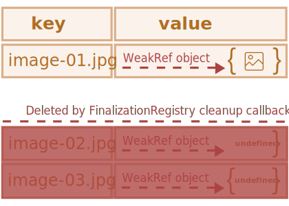
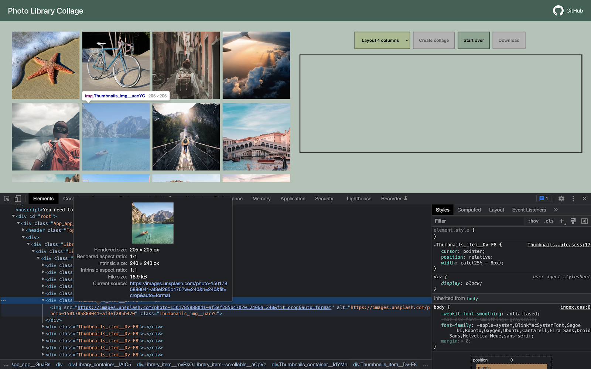
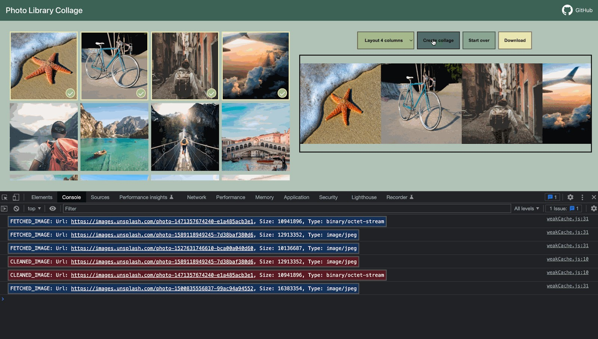
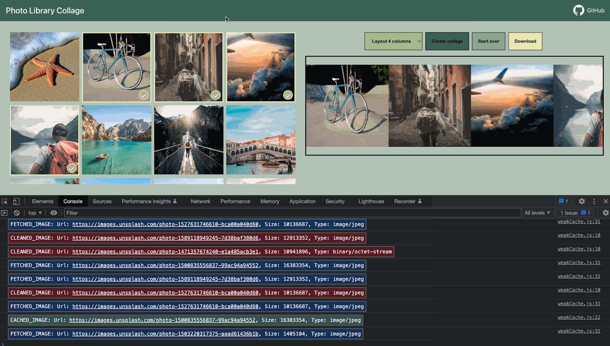
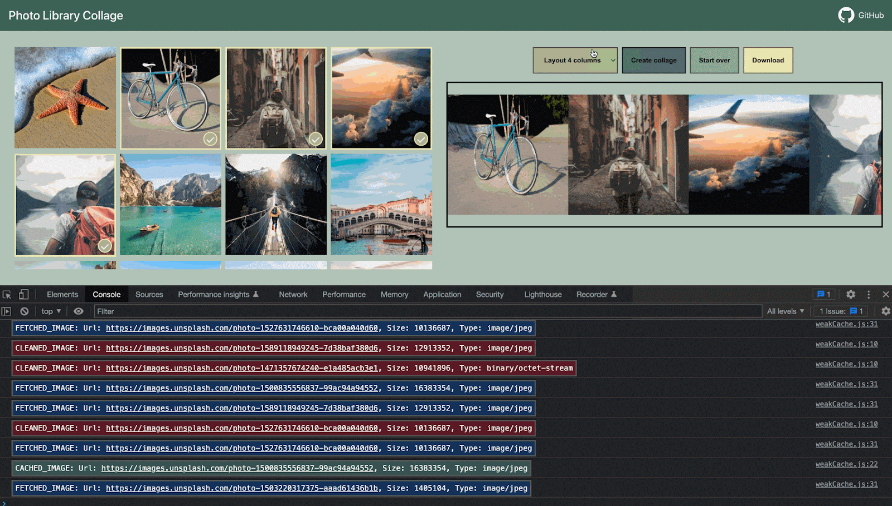

`FinalizationRegistry` <sub>(객체)</sub>
====

##### 청소 콜백 <sub>(finalizer)</sub>
- `FinalizationRegistry` 내 객체 등록 후
  - 메모리 내 제거 <sub>(가비지 컬렉션)</sub> 시 호출

##### 용도
- 가비지 컬렉션 작동 후 추가 동작 수행

##### Registry <sub>(`FinalizationRegistry`)</sub>
- JS 특별 객체
  - 객체 등록 · 제외 담당
  - 청소 콜백 <sub>(함수)</sub> 관리

##### 기능
- 객체 등록 · 청소 콜백 <sub>(함수)</sub> 연결
  - 관련 정보 저장
- 메모리에서 객체 제거 시
  - 청소 콜백 <sub>(함수)</sub> 자동 호출

##### `FinalizationRegistry` 인스턴스 생성
- 생성자 호출 <sub>(인수 1개)</sub>
  - 청소 콜백 <sub>(함수 · finalizer)</sub> 전달

##### 문법
```javascript
function cleanupCallback(heldValue) {
  /* 청소 콜백 (함수) 코드 */
}

const registry = new FinalizationRegistry(cleanupCallback);
```

##### `cleanupCallback` <sub>(청소 콜백 함수 · finalizer)</sub>
- 매모리에서 Registry 등록 객체 제거 시
  - 자동 호출

##### `heldValue` <sub>(청소 콜백 함수 매개변수)</sub>
- 객체 전달 시
  - Registry 내 강한 참조 유지

##### `registry`
- `FinalizationRegistry` 인스턴스

#### `FinalizationRegistry` 메서드

##### `register(target, heldValue [, unregisterToken])`
- `registry` 내 객체 등록
- `target` <sub>(객체)</sub>
  - 추적 위해 등록되는 객체
  - 가비지 컬렉터 의해 삭제 시
    - 청소 콜백 <sub>(함수)</sub> 호출
      - `heldValue` <sub>(인수)</sub> 값
- `[unregisterToken]`
  - 제거 토큰
  - 등록 객체 제거 위해 전달
    - 가비지 컬렉터 의해 삭제 전
  - 보통 `target` <sub>(객체)</sub> 사용 <sub>(관행)</sub>

##### `unregister(unregisterToken)`
- `registry` 내 등록 객체 제거
- `unregisterToken`
  - 객체 등록 시 값 얻어짐

##### `FinalizationRegistry` 인스턴스 생성
- 청소 콜백 <sub>(함수)</sub> 설정
- `user` <sub>(객체)</sub> 등록
```javascript
let user = {name: "John"};

const registry = new FinalizationRegistry((heldValue) => {
  console.log(`${heldValue} has been collected by the garbage collector.`);
});

registry.register(user, user.name);
```

##### `registry`
- 등록 객체 대상
  - 강한 참조 X
    - 목적에 반함
  - 강한 참조 시
    - 가비지 컬렉터 대상 X
```javascript
// user (객체)
// - 가비지 컬렉터 의해 제거 시
//   - 콘솔 메시지 출력
 */
"John has been collected by the garbage collector."
```

#### 청소 콜백 <sub>(함수)</sub> 호출 미발생 가능 상황

##### 프로그램 완전 종료
- 브라우저 탭 닫기
- 기타 등등

##### `FinalizationRegistry` 인스턴스
- JS 코드 내 '도달 불가능' 시
- 생성 객체
  - 스코프 밖으로 사라질 시
  - 삭제 시

### `FinalizationRegistry` · 캐싱

##### `WeakRef` <sub>(객체)</sub> 캐싱 예제
- `Map` 내 메모리 누수 발생
  - `key`
    - 계속 유지
  - `value`
    - 가비지 컬렉터 의해 제거

##### `FinalizationRegistry` 사용해 개선
```javascript
function fetchImg() {
  /* 이미지 다운로드 코드 */
}

function weakRefCache(fetchImg) {
  const imgCache = new Map();

  /* ①
   FinalizationRegistry 인스턴스 생성
   - 죽은 (key 만 남은) 요소 관리
     - value (WeakRef)
       - 가비지 컬렉터 의해 제거된 상태
   필수 확인
   - value (WeakRef) 가비지 컬렉터 의해 제거 후
     - 아직 재추가 안됨
   */
  const registry = new FinalizationRegistry((imgName) => {
    const cachedImg = imgCache.get(imgName);
    if (cachedImg && !cachedImg.deref()) imgCache.delete(imgName);
  });

  return (imgName) => {
    const cachedImg = imgCache.get(imgName);

    if (cachedImg?.deref()) {
      return cachedImg?.deref();
    }

    const newImg = fetchImg(imgName);
    imgCache.set(imgName, new WeakRef(newImg));

    /* ②
     새 이미지 다운로드 · 캐시 내 삽입 후
     - registry 내 WeakRef (객체) 등록
       - WeakRef (객체) 추적
     */
    registry.register(newImg, imgName);

    return newImg;
  };
}

const getCachedImg = weakRefCache(fetchImg);
```

##### '살아있는' `Map` 요소만 유지
- 각 `WeakRef` <sub>(객체)</sub>
  - `FinalizationRegistry` 등록
  - 가비지 컬렉터 의해 제거 시
    - 청소 콜백 <sub>(함수)</sub> 작동
      - '죽은' 요소 제거



#### 중요한 사실

##### finalizer <sub>(청소 콜백 함수)</sub>
- 병렬 프로세스 생성 허용
  - JS 코드 · 청소 콜백 <sub>(함수)</sub> 사이

##### 시간 차 존재
- 객체 삭제 마크 <sub>(가비지 컬렉터)</sub> 시점
- 실제 청소 콜백 <sub>(함수)</sub> 작동 시점

##### 시간 차 사이
- 해당 객체 대상 모든 동작 · 작업 가능
  - ex\) 메모리로 다시 가져오기 등

##### 캐시 내 제거 후 재추가 여부 필수 확인 이유
- 가비지 컬렉터 의해 제거 전
  - 추적 객체 대상 모든 동작 · 작업 가능

##### 특별 상황 <sub>(주의)</sub>
- 키 검색 도중 가비지 컬렉터 의해 제거
  - 청소 콜백 <sub>(함수)</sub> 작동 전

### `WeakRef` · `FinalizationRegistry` <sub>(실무)</sub>

##### 실무 시나리오
- 모바일 · 클라우드 사진 동기화
  - 타 기기에서 사진 보기
  - 기타 추가 기능 제공

##### 추가 기능들
- 사진 편집 · 영상 효과
- 임시 저장 · 앨범 생성
- 일련 사진 → 영상 몽타주 <sub>(변환)</sub>
- 기타 등등

##### 예제


##### 좌측
- 클라우드 사진 라이브러리
  - 섬네일 목록 <sub>(사진 표시)</sub>

##### 우측
- "Create collage" 버튼
  - 사진 선택 · 콜라주 생성 <sub>(다운로드 가능)</sub>

##### 압축
- 사진 다운로드 · 표시 섬네일
  - 페이지 로딩 속도 ↑

##### 압축 X
- 사진 선택 · 콜라주 생성



##### 크기
- 섬네일 고유 크기
  - 240 x 240 <sub>(픽셀)</sub>
- 미리보기 모드
  - 전체 크기 불필요

##### 콜라주 생성 <sub>(사진 4장)</sub>
1. 사진 선택
2. "Create collage" 버튼 클릭
3. `weakRefCache` <sub>(함수)</sub>
    - 캐시 내 이미지 유무 여부 확인
    - 부재 시
      - 다운로드 <sub>(클라우드)</sub>
      - 캐시 삽입

### 실무 : `WeakRef` <sub>(객체)</sub> · `FinalizationRegistry`

##### 실무 시나리오
- 모바일 · 클라우드 사진 동기화
  - 타 기기에서 사진 보기
  - 기타 추가 기능 제공

##### 추가 기능들
- 사진 편집 · 영상 효과
- 임시 저장 · 앨범 생성
- 일련 사진 → 영상 몽타주 변환
- 기타 등등

#### 예제

##### 좌측
- 클라우드 사진 라이브러리
  - 섬네일로 사진 표시

##### 우측
- "Create collage" 버튼
  - 사진 선택 · 콜라주 생성
    - 다운로드 가능

##### 압축 적용
- 사진 다운로드 · 섬네일
  - 페이지 로딩 속도 ↑

##### 압축 미적용
- 사진 선택 · 콜라주 생성


##### 크기
- 섬네일 고유 크기
  - 240 x 240 <sub>(픽셀)</sub>
- 미리보기 모드
  - 전체 크기 불필요


##### 콜라주 생성 <sub>(사진 4장)</sub>
1. 사진 선택
2. "Create collage" 버튼 클릭
3. `weakRefCache` <sub>(함수)</sub>
    - 캐시 내 이미지 유무 여부 확인
    - 부재 시
      1. 클라우드에서 다운로드
      2. 캐시 내 삽입
    - 각 선택 사진 대상 동작


##### 콘솔 화면
- 클라우드에서 다운로드된 사진 확인
  - _'FETCHED_IMAGE'_

##### 첫 콜라주 생성
- 캐시 내 이미지 부재
  1. 모든 사진 다운로드
  2. 캐시 내 삽입

##### 이미지 다운로드 중
- 가비지 컬렉터 의해 메모리 청소 <sub>(동시 진행)</sub>

##### 캐시 내 이미지 <sub>(약한 참조)</sub>
- 가비지 컬렉터 의해 제거
- 청소 콜백 <sub>(함수)</sub>
  - 캐시 내 빈 요소 <sub>(키만 남음)</sub> 제거
    - _'CLEANED_IMAGE'_



##### 사진 교체 후 새 콜라주 생성
1. 교체할 사진 선택 해제
2. 다른 사진 선택
3. "Create collage" 버튼 클릭


##### 다운로드
- 모든 이미지 X
  - 캐시 내 부재 이미지
- 일부 이미지
  - 캐시에서 가져옴
    - _'CACHED_IMAGE'_

##### 새 콜라주 생성 시점
- 가비지 컬렉터 의해 이미지 제거 전
- 네트워크 요청 수 ↓
  - 작업 처리 속도 ↑



##### 이미지 1개 교체 후 다시 새 콜라주 생성



##### 총 선택 사진 수 : 4개
- 3개
  - 캐시에서 가져옴
- 1개
  - 클라우드에서 다운로드
- 네크워크 로드 감소량
  - 75%


##### 항상 동일 작동 보장 X
- 결과 항상 다름
  - 구현체 상이
  - 가비지 컬렉터 동작 메커니즘

##### 일반적인 경우 학습 내용 불필요
- `WeakRef` <sub>(객체)</sub>
- `FinalizationRegistry`

[예제](https://plnkr.co/edit/L7yYPNraR6ujk9ib?p=preview) <sub>(다른 구현 방식)</sub>

<br />

요약
====

##### `FinalizationRegistry`
- 청소 콜백 <sub>(함수)</sub> 등록
- 객체 대상 강한 참조 부재 시
  - 콜백 호출 후 해당 콜백 자동 제거
- 용도
  - 객체 관련 자원 관리
  - 객체 제거 시 작업 관리
