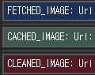

`FinalizationRegistry` <sub>(객체)</sub>
====

##### `FinalizationRegistry` <sub>(특수 객체)</sub>
- 객체 · 청소 콜백 내부 등록 후 연결
- 등록 객체 대상 약한 참조 유지
  - 메모리 내 제거 시 청소 콜백 호출
  - 강한 참조 시 가비지 컬렉션 작동 대상 X

##### 용도
- 가비지 컬렉션 작동 후 추가 동작 수행

##### 객체 생성
- 청소 콜백 전달 필요
```javascript
// heldValue (콜백 인수)
// - 객체 전달 시 강한 참조 유지
function cleanupCallback(heldValue) {
  …청소 콜백 코드…
}

const registry = new FinalizationRegistry(cleanupCallback);
```

### 메서드

#### `register`

##### 추적 객체 등록
```javascript
register(target, heldValue[, unregisterToken])
```

##### `target` <sub>(객체)</sub>
- 등록 객체 <sub>(이후 추적)</sub>
  - 약한 참조 유지
  - 강한 참조 시 가비지 컬렉션 작동 대상 X
- 메모리 내 제거 시 청소 콜백 자동 호출
  - `heldValue` 전달

##### `[unregisterToken]`
- 제거 토큰
- 가비지 컬렉션 작동 전 등록 객체 제거 시 사용
- 보통 `target` <sub>(객체)</sub> 사용 <sub>(관행)</sub>

#### `unregister`

##### 등록 객체 제거
```javascript
unregister(unregisterToken)
```
- `unregisterToken`
  - 객체 등록 시 설정 값

#### 객체 생성 후 `user` <sub>(객체)</sub> · 청소 콜백 등록
```javascript
let user = {name: "John"};

// 객체 생성 · 청소 콜백 등록
const registry = new FinalizationRegistry((heldValue) => {
  console.log(`${heldValue}: 메모리 내 제거 완료.`);
});

// 추적 객체 등록
// - user (객체) 메모리 내 제거 시 user.name 콜백 전달
registry.register(user, user.name);
```
- 메모리 내 `user` <sub>(객체)</sub> 제거 시
  - 청소 콜백 실행 <sub>(콘솔 메시지 출력)</sub>
```javascript
"John: 메모리 내 제거 완료."
```

##### 청소 콜백 미호출 가능성 有
- a. 프로그램 완전 종료
  - 브라우저 탭 닫기
  - 기타 등등
- b. `FinalizationRegistry` <sub>(객체)</sub> 도달 불가
  - 생성 객체 유실 · 제거 시
    - 청소 콜백 호출 X

### 캐싱

##### `WeakRef` <sub>(객체)</sub> 캐싱 예제
- 캐시 <sub>(`Map` 객체)</sub> 내 메모리 누수 발생
  - 값 <sub>(`WeakRef` 객체 참조 객체)</sub> 제거 시
    - 키 계속 유지
- `FinalizationRegistry` <sub>(객체)</sub> 적용
  - 약한 참조 객체 제거 시 해당 요소 제거
```javascript
function fetchImg() {
  …이미지 다운로드…
}

function weakRefCache(fetchImg) {
  const imgCache = new Map();

  // ①
  // FinalizationRegistry (객체) 생성
  // - WeakRef (객체) 참조 객체 (이미지) 제거 시 해당 요소 제거
  const registry = new FinalizationRegistry((imgName) => {
    const cachedImg = imgCache.get(imgName);

    if (cachedImg && !cachedImg.deref()) {
      imgCache.delete(imgName);
    }
  });

  return (imgName) => {
    const cachedImg = imgCache.get(imgName);

    if (cachedImg?.deref()) {
      return cachedImg?.deref();
    }

    const newImg = fetchImg(imgName);

    imgCache.set(imgName, new WeakRef(newImg));

    // ②
    // 이미지 다운로드 · 캐시 내 삽입 후
    // - FinalizationRegistry (객체) 내 등록 (추적)
    registry.register(newImg, imgName);

    return newImg;
  };
}

const getCachedImg = weakRefCache(fetchImg);
```

##### 캐시 내 `WeakRef` <sub>(객체)</sub> 참조 유지 요소만 유지
- 메모리 내 `WeakRef` <sub>(객체)</sub> 참조 객체 제거 시
  - 청소 콜백 실행 <sub>(캐시 내 해당 요소 제거)</sub>


#### 특징

##### 주요 코드 · 청소 콜백 사이 병렬 작업 허용
- 두 작업 사이 시차 有
  - 메모리 내 등록 객체 제거 시점
  - 실제 청소 콜백 실행 시점
- 시차 내 추적 객체 대상 모든 작업 가능
  - 메모리 내 다시 로드
  - 기타 등등

##### 추가 확인 작업 필수
- a. 캐시 내 요소 재추가 여부
  - 약한 참조 유지 요소 제거 방지
- b. 약한 참조 제거 후 청소 콜백 실행 여부
  - 시차 의한 청소 콜백 실행 전 접근 방지

### 실무 <sub>(`WeakRef` · `FinalizationRegistry`)</sub>

##### 모바일 · 클라우드 사진 동기화 <sub>(실무 시나리오)</sub>
- 기타 추가 기능 제공
  - 사진 편집 · 영상 효과 적용
  - 추억 리스트 · 앨범 생성
  - 일련 사진 → 영상 몽타주 <sub>(변환)</sub>
  - 기타 등등

##### 레이아웃
- 좌측
  - 클라우드 사진 라이브러리
    - 섬네일 목록 <sub>(선택 가능)</sub>
- 우측
  - 콜라주 관련 목록
    - 버튼
    - 결과 창
    - 기타 등등


##### 압축 여부
- 섬네일 목록 압축 <sub>(로드 속도 ↑)</sub>
  - 240 x 240 <sub>(픽셀)</sub>
- 콜라주 압축 X <sub>(원본 다운로드)</sub>


##### 콘솔 출력 내용
- _'FETCHED_IMAGE'_
  - 이미지 다운로드
- _'CACHED_IMAGE'_
  - 캐시 내 이미지 사용
- _'CLEANED_IMAGE'_
  - 캐시 내 빈 요소 <sub>(이미지 無)</sub> 제거



#### 1번째 콜라주 생성 <sub>(사진 4장)</sub>

##### 새 이미지 4개
1. 섬네일 선택
2. "Create collage" 버튼 클릭
3. `weakRefCache` <sub>(함수)</sub> 실행
   - 캐시 내 이미지 유무 여부 확인
   - 부재 시 다운로드 후 캐시 내 저장


##### 캐시 내 이미지 無
- 모든 이미지 다운로드 후 저장
  - _'FETCHED_IMAGE'_

##### 이미지 다운로드 중 메모리 정리 동시 진행
- 캐시 내 일부 이미지 <sub>(약한 참조)</sub> 제거
  - _'CLEANED_IMAGE'_


#### 2번째 콜라주 생성

##### 이미지 1개 교체
1. 기존 섬네일 1개 선택 해제
2. 타 섬네일 1개 선택
3. "Create collage" 버튼 클릭


##### 모든 이미지 다운로드 X
- 캐시 내 이미지 1개 <sub>(제거 전)</sub> 사용
  - _'CACHED_IMAGE'_
- 성능 향상
  - 네트워크 요청 수 ↓ <sub>(3/4)</sub>
  - 작업 처리 속도 ↑


#### 3번째 콜라주 생성

##### 이미지 1개 교체
1. 기존 섬네일 1개 선택 해제
2. 타 섬네일 1개 선택
3. "Create collage" 버튼 클릭


##### 모든 이미지 다운로드 X
- 캐시 내 이미지 3개 <sub>(제거 전)</sub> 사용
  - _'CACHED_IMAGE'_
- 성능 향상
  - 네트워크 요청 수 ↓ <sub>(1/4)</sub>
  - 작업 처리 속도 ↑↑


##### 결과 항상 상이 <sub>(작동 보장 X)</sub>
- 구현체 상이
- 가비지 컬렉터 동작 방식 상이

[예제](https://plnkr.co/edit/L7yYPNraR6ujk9ib?p=preview) <sub>(구현 방식 상이)</sub>

<br />

요약
====

##### `FinalizationRegistry` <sub>(특수 객체)</sub>
- 객체 · 청소 콜백 내부 등록 후 연결
- 등록 객체 대상 약한 참조 유지
  - 메모리 내 제거 시 청소 콜백 호출
  - 강한 참조 시 가비지 컬렉션 작동 대상 X
- 용도
  - 객체 관련 자원 관리
  - 기타 마무리 작업 수행
  - 객체 제거 시 작업 관리
