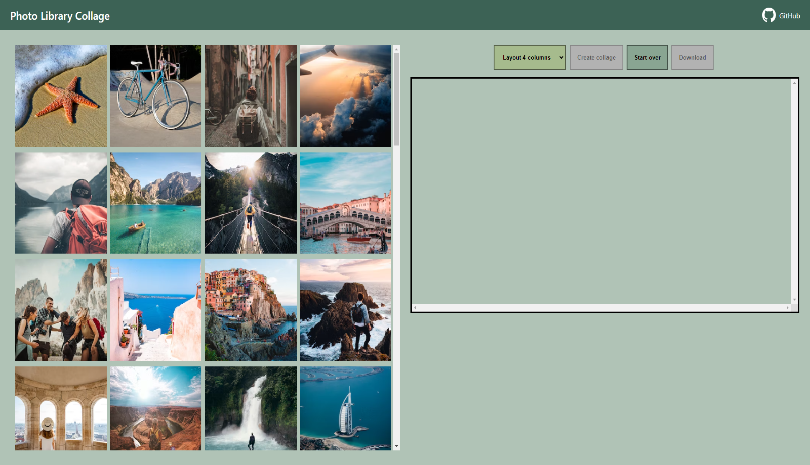

FinalizationRegistry
====================

##### 청소 콜백 <sub>(함수)</sub> <sub>(finalizer)</sub>
- FinalizationRegistry 등록 객체
  - 가비지 컬렉터 의해 삭제 시 호출

##### 목적
- 객체 : 메모리에서 삭제 후
  - 객체 관련 추가 동작 제공

##### Registry <sub>(FinalizationRegistry)</sub>
- JS 내 특별 객체
  - 객체 등록 · 제외 담당
  - 청소 콜백 <sub>(함수)</sub> 관리

##### 기능
- 객체 등록 · 청소 콜백 <sub>(함수)</sub> 연결
  - 관련 정보 저장
- 객체 : 메모리에서 제거 시
  - 청소 콜백 <sub>(함수)</sub> 자동 호출

##### FinalizationRegistry 인스턴스 생성
- 생성자 호출 <sub>(인수 1개)</sub>
  - 청소 콜백 <sub>(함수)</sub> <sub>(finalizer)</sub> 전달

##### 문법
```javascript
function cleanupCallback(heldValue) {

  // 청소 콜백 (함수) 코드

}

const registry = new FinalizationRegistry(cleanupCallback);
```

##### `cleanupCallback` <sub>(청소 콜백 함수)</sub>
- 등록 객체 : 매모리에서 제거 시
  - 자동 호출

##### `heldValue`
- 청소 콜백 <sub>(함수)</sub> 전달 인수
- 인수 == 객체 경우
  - registry : 강한 참조 유지

##### `registry`
- `FinalizationRegistry` 인스턴스

#### `FinalizationRegistry` 메서드

##### `register(target, heldValue [, unregisterToken])`
- `registry` 에 객체 등록
- `target` <sub>(객체)</sub>
  - 추적 위해 등록되는 객체
  - 가비지 컬렉터 의해 삭제 시
    - 청소 콜백 <sub>(함수)</sub> 호출
      - 인수 : `heldValue`
- `unregisterToken` <sub>(옵션)</sub>
  - 등록 제외 토큰
  - 객체 등록 제외 위해 전달
    - 가비지 컬렉터 의해 삭제 전
  - 대개 `target` <sub>(객체)</sub> 사용
    - 관행

##### unregister(unregisterToken)
- `registry` 에서 객체 제외
- 인수 : 1개 <sub>(`unregisterToken`)</sub>
  - 객체 등록 시 얻어짐

##### `user` <sub>(객체)</sub>
- `FinalizationRegistry` 인스턴스 생성
  - 청소 콜백 <sub>(함수)</sub> 정의
```javascript
let user = { name: "John" };

const registry = new FinalizationRegistry((heldValue) => {
  console.log(`${heldValue} has been collected by the garbage collector.`);
});
```
- `user` <sub>(객체)</sub> 등록
```javascript
registry.register(user, user.name);
```

##### `registry`
- 등록 객체에 강한 참조 X
  - 목적에 반함
- 등록 객체에 강한 참조 시
  - 가비지 컬렉터 대상 X
```javascript
/*
 user (객체)
 - 가비지 컬렉터 의해 제거 시
   - 콘솔에 메시지 출력
 */
"John has been collected by the garbage collector."
```

#### 청소 콜백 <sub>(함수)</sub> 구현 후 미사용 경우 有

##### 프로그램 완전 종료 시
- 브라우저 탭 닫기 등

##### `FinalizationRegistry` 인스턴스
- JS 코드 내 '도달 불가능' 시
- 인스턴스 생성 객체
  - 스코프 밖으로 사라질 시
  - 삭제 시

### `FinalizationRegistry` · 캐싱

##### `WeakRef` <sub>(객체)</sub> 캐싱 예제
- 메모리 누수 : `Map`
  - `key`
    - 계속 유지
  - `value`
    - 가비지 컬렉터 의해 제거

##### `FinalizationRegistry` 사용해 개선
```javascript
function fetchImg() {

  // 이미지 다운로드 코드

}

function weakRefCache(fetchImg) {
  const imgCache = new Map();

  /* (1)
   FinalizationRegistry 인스턴스 생성
   - 죽은 (key 만 남은) 요소 관리
     - value (WeakRef)
       - 가비지 컬렉터 의해 제거
   필수 체크
   - value (WeakRef) : 가비지 컬렉터 의해 제거 후
     - 아직 재추가 안됨
   */
  const registry = new FinalizationRegistry((imgName) => {
    const cachedImg = imgCache.get(imgName);
    if (cachedImg && !cachedImg.deref()) imgCache.delete(imgName);
  });

  return (imgName) => {
    const cachedImg = imgCache.get(imgName);

    if (cachedImg?.deref()) {
      return cachedImg?.deref();
    }

    const newImg = fetchImg(imgName);
    imgCache.set(imgName, new WeakRef(newImg));

    /* (2)
     새 이미지 다운로드 · 캐시에 삽입 후
     - registry 에 WeakRef (객체) 등록
       - WeakRef (객체) 추적
     */
    registry.register(newImg, imgName);

    return newImg;
  };
}

const getCachedImg = weakRefCache(fetchImg);
```

##### '살아있는' `Map` 요소만 유지
- 각 `WeakRef` <sub>(객체)</sub>
  - `FinalizationRegistry` 등록
  - 가비지 컬렉터 의해 제거 시
    - 청소 콜백 <sub>(함수)</sub> 작동
      - '죽은' 요소 제거


#### 중요한 사실

##### finalizers
- 병렬 프로세스 작동
  - main 프로그램
  - 청소 콜백 <sub>(함수)</sub>

##### 시간 차 존재
- 가비지 컬렉터 의해 삭제 표시
- 실제 청소 콜백 <sub>(함수)</sub> 작동

##### 시간 차 사이
- main 프로그램
  - 해당 객체에 그 어떤 동작도 가능
    - ex&#41; 메모리로 가져오기 등

##### 예시 : 필수 체크 이유
- 가비지 컬렉터 의해 제거 전
  - 추적 객체에 그 어떤 동작도 가능

##### 특별 상황 <sub>(주의 요구)</sub>
- 키 검색 도중
  - 가비지 컬렉터 의해 제거 경우 有
  - 아직 청소 콜백 <sub>(함수)</sub> 작동 전

### 실무 : `WeakRef` <sub>(객체)</sub> · FinalizationRegistry

##### 실무 시나리오
- 모바일 · 클라우드 사진 동기화
  - 타 기기에서 사진 보기
  - 기타 추가 기능 제공

##### 추가 기능들
- 사진 편집 · 영상 효과
- 임시 저장 · 앨범 생성
- 일련 사진 → 영상 몽타주 변환
- 기타 등등

##### 예제



##### 좌측
- 클라우드 사진 라이브러리
  - 섬네일로 사진 표시

##### 우측
- "Create collage" 버튼
  - 사진 선택 · 콜라주 생성
    - 다운로드 가능

##### 압축
- 사진 다운로드 · 표시 섬네일
  - 페이지 로딩 속도 ↑

##### 압축 X
- 사진 선택 · 콜라주 생성


##### 사이즈
- 섬네일 고유 사이즈
  - 240 x 240 <sub>(픽셀)</sub>
- 미리보기 모드
  - 전체 사이즈 불필요

##### 콜라주 생성 <sub>(사진 4장)</sub>
1. 사진 선택
2. "Create collage" 버튼 클릭
3. `weakRefCache` <sub>(함수)</sub>
    - 캐시 내 이미지 존재 여부 확인
    - 부재 시
      - 다운로드 <sub>(클라우드)</sub>
      - 캐시 삽입


### 실무 : `WeakRef` <sub>(객체)</sub> · FinalizationRegistry

##### 실무 시나리오
- 모바일 · 클라우드 사진 동기화
  - 타 기기에서 사진 보기
  - 기타 추가 기능 제공

##### 추가 기능들
- 사진 편집 · 영상 효과
- 임시 저장 · 앨범 생성
- 일련 사진 → 영상 몽타주 변환
- 기타 등등

##### 예제


##### 좌측
- 클라우드 사진 라이브러리
  - 섬네일로 사진 표시

##### 우측
- "Create collage" 버튼
  - 사진 선택 · 콜라주 생성
    - 다운로드 가능

##### 압축
- 사진 다운로드 · 표시 섬네일
  - 페이지 로딩 속도 ↑

##### 압축 X
- 사진 선택 · 콜라주 생성


##### 사이즈
- 섬네일 고유 사이즈
  - 240 x 240 <sub>(픽셀)</sub>
- 미리보기 모드
  - 전체 사이즈 불필요

##### 콜라주 생성 <sub>(사진 4장)</sub>
1. 사진 선택
2. "Create collage" 버튼 클릭
3. `weakRefCache` <sub>(함수)</sub>
    - 캐시 내 이미지 존재 여부 확인
    - 부재 시
      - 다운로드 <sub>(클라우드)</sub>
      - 캐시 삽입

-  Let's assume, that we need to create a collage of 4 photos: we select them, and then click the "Create collage" button. At this stage, the already known to us weakRefCache function checks whether the required image is in the cache. If not, it downloads it from the cloud and puts it in the cache for further use. This happens for each selected image:


Paying attention to the output in the console, you can see, which of the photos were downloaded from the cloud – this is indicated by FETCHED_IMAGE. Since this is the first attempt to create a collage, this means, that at this stage the “weak cache” was still empty, and all the photos were downloaded from the cloud and put in it.

But, along with the process of downloading images, there is also a process of memory cleanup by the garbage collector. This means, that the object stored in the cache, which we refer to, using a weak reference, is deleted by the garbage collector. And our finalizer executes successfully, thereby deleting the key, by which the image was stored in the cache. CLEANED_IMAGE notifies us about it:


Next, we realize that we do not like the resulting collage, and decide to change one of the images and create a new one. To do this, just deselect the unnecessary image, select another one, and click the "Create collage" button again:


But this time not all images were downloaded from the network, and one of them was taken from the weak cache: the CACHED_IMAGE message tells us about it. This means that at the time of collage creation, the garbage collector had not yet deleted our image, and we boldly took it from the cache, thereby reducing the number of network requests and speeding up the overall time of the collage creation process:


Let's "play around" a little more, by replacing one of the images again and creating a new collage:


This time the result is even more impressive. Of the 4 images selected, 3 of them were taken from the weak cache, and only one had to be downloaded from the network. The reduction in network load was about 75%. Impressive, isn't it?


Of course, it is important to remember, that such behavior is not guaranteed, and depends on the specific implementation and operation of the garbage collector.

Based on this, a completely logical question immediately arises: why do not we use an ordinary cache, where we can manage its entities ourselves, instead of relying on the garbage collector? That’s right, in the vast majority of cases there is no need to use WeakRef and FinalizationRegistry.

Here, we simply demonstrated an alternative implementation of similar functionality, using a non-trivial approach with interesting language features. Still, we cannot rely on this example, if we need a constant and predictable result.

You can open this example in the sandbox.

