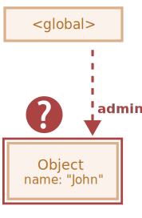

WeakRef and FinalizationRegistry
================================

 **언어 내 숨겨진 기능**

- 굉장히 드물게 사용

<br />

##### 도달 가능 원칙 <sub>(가비지 컬렉션)</sub>
- 도달 가능한 · 사용중인 값
```javaScript
// user (변수)
// - 객체 참조
let user = { name: "John" };

// user (변수)
// - null 할당
user = null;

// 객체 참조 없어짐
// - 메모리에서 객체 삭제
```
- 참조 2개
```javaScript
// user (변수)
// - 객체 참조
let user = { name: "John" };

// 참조 값 복사
// - user (변수) → admin (변수)
let admin = user;

// user (변수)
// - null 할당
user = null;

// 객체
// - 도달 가능 · 참조 유지 (admin 변수)
//   - 메모리에 객체 유지
```

 **용어 : "강한 참조" · "약한 참조"**

##### 강한 참조
- 가비지 컬렉션 작동 대상 X
  - 참조 메모리 위치에 객체 · 값 저장
- JS
  - 일반적인 객체 참조
```javaScript
// user (변수)
// - 강한 참조
let user = { name: "John" };
```

##### 약한 참조
- 가비지 컬렉션 작동 대상
- 약한 참조만 존재 시
  - 메모리에서 삭제

### `WeakRef`

 **주의**

##### 이번 학습에서 사용하는 구조
- 신중한 사용 필요
- 되도록 사용 지양

<br />

##### 어떤 객체에 대한 약한 참조 저장 객체
- 어떤 객체
  - "타겟"
  - "지시 대상"

##### 특징
- "타겟" · "지시 대상" 객체
  - 가비지 컬렉터 작동 대상

##### 예제
- `user` <sub>(변수)</sub>
  - 지시 대상
- `admin` <sub>(변수)</sub>
  - `user` <sub>(변수)</sub> 에 대한 약한 참조
- `WeakRef` 생성자
  - 타겟 <sub>(지시 대상)</sub> 객체 인수 전달
```javaScript
// user (변수)
// - 객체에 대한 강한 참조
let user = { name: "John" };

// admin (변수)
// - 객체에 대한 약한 참조
let admin = new WeakRef(user);
```
- `user` <sub>(변수)</sub>
  - 강한 참조
- `admin` <sub>(변수)</sub>
  - 약한 참조


##### 어느 순간
- `user` <sub>(변수)</sub> 사용 X
  - 값 덮어씌우기
  - 스코프 밖으로 이동
  - 기타 등등 등
- `admin` <sub>(변수)</sub>
  - 약한 참조 유지
```javaScript
// user (변수)
// - null 값 할당
user = null;
```
- 객체에 대한 약한 참조
  - 객체 유지 불가능
- 약한 참조만 존재 시
  - 가비지 컬렉터 작동

##### 가비지 컬렉터 작동 전
- 약한 참조 유지 가능
  - 강한 참조 부재 상태
- 객체 상태
  - 슈뢰딩거의 고양이
  - 전혀 알 수 없음



##### `deref()` <sub>(메서드)</sub>
- 객체 삭제 전
  - `WeakRef` 참조 객체 반환
- 객체 삭제 후
  - `undefined` 반환
```javaScript
let ref = admin.deref();

if (ref) {

  // 객체 아직 삭제 X
  // - 객체 대상 작업 가능

} else {

  // 객체 삭제 완료
  // - 가비지 컬렉터에 의해 제거됨

}
```

### `WeakRef` 유스 케이스

##### 일반적인 사용처
- 캐싱
- 연관 배열
  - 자원 집중적인 객체 저장

##### 기능
- 캐시 · 연관 배열 내 존재 시
  - 가비지 컬렉터 작동하게끔 함

WeakRef is typically used to create caches or associative arrays that store resource-intensive objects. This allows one to avoid preventing these objects from being collected by the garbage collector solely based on their presence in the cache or associative array.

One of the primary examples – is a situation when we have numerous binary image objects (for instance, represented as ArrayBuffer or Blob), and we want to associate a name or path with each image. Existing data structures are not quite suitable for these purposes:

Using Map to create associations between names and images, or vice versa, will keep the image objects in memory since they are present in the Map as keys or values.
WeakMap is ineligible for this goal either: because the objects represented as WeakMap keys use weak references, and are not protected from deletion by the garbage collector.
But, in this situation, we need a data structure that would use weak references in its values.

For this purpose, we can use a Map collection, whose values are WeakRef instances referring to the large objects we need. Consequently, we will not keep these large and unnecessary objects in memory longer than they should be.

Otherwise, this is a way to get the image object from the cache if it is still reachable. If it has been garbage collected, we will re-generate or re-download it again.

This way, less memory is used in some situations.

### 유스 케이스 1 : 캐싱