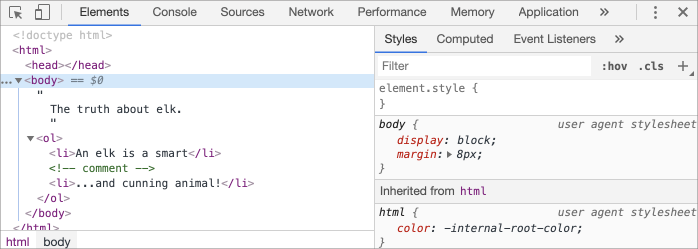

DOM 트리
========

##### 모든 HTML 태그 == 객체
- 중첩 태그
  - 태그 하나가 감싸고 있는 '자식' 태그
- 태그 내 문자

##### JS 통해 접근
- 페이지 조작 시 사용
- ex&#41; `document.body` <sub>(객체)</sub>
  - `<body>` <sub>(태그)</sub>

##### `<body>` <sub>(태그)</sub> : 3초간 붉은색 변경
```javascript
// 배경색 → 붉은색 변경하기
document.body.style.background = "red";

// 3초 후 원래 배경색 복구
setTimeout(() => document.body.style.background = "", 3000);
```

##### 다양한 프로퍼티
- `innerHTML`
  -  해당 노드 HTML 콘텐츠
- `offsetWidth`
  - 해당 노의 너비 <sub>(픽셀)</sub>
- 기타 등등

### DOM 구조
```html
<!DOCTYPE HTML>
<html>
<head>
  <title>사슴에 관하여</title>
</head>
<body>
  사슴에 관한 진실.
</body>
</html>
```


#### 태그 트리 구조 <sub>(트리 내 노드 == 객체)</sub> 

##### 태그
- 요소 <sub>(노드)</sub>
- 트리 구조 구성
  - `<html>` <sub>(루트 노드)</sub>
  - `<head>` · `<body>` <sub>(루트 노드 자식)</sub>

#####  텍스트 노드
- 요소 내의 문자
- 문자열만 담음
  - 자식 노드 X
  - 잎 노드 <sub>(트리 끝)</sub>

##### ex&#41; `<title>` <sub>(태그 · 위 그림)</sub>
- 자식
  - 텍스트 노드 <sub>("사슴에 관하여")</sub>

##### 공백 특수문자 텍스트 노드
- `↵` <sub>(새 줄)</sub>
  - `\n` <sub>(JS 표현)</sub>
- `␣` <sub>(공백)</sub>
- 유효한 문자 취급
  - 텍스트 노드 구성 <sub>(DOM 일부)</sub>

#### 텍스트 노드 생성 예외 <sub>(2가지)</sub>

##### 1. `<head>` <sub>(태그)</sub> 이전 새 줄 · 공백
- 무시 <sub>(역사적인 이유)</sub>
##### 2. `</body>` <sub>(닫는 태그)</sub> 뒤에 무언가 추가 시
- 자동으로 `body` <sub>(요소)</sub> 안쪽으로 옮겨짐
- HTML 명세서 명시
  - 모든 콘텐츠 : `body` <sub>(요소)</sub> 안쪽에 위치

##### 공백 텍스트 노드 없는 HTML 문서
```html
<!DOCTYPE HTML>
<html><head><title>사슴에 관하여</title></head><body>사슴에 관한 진실.</body></html>
```


 **문자열 양 끝 공백 · 공백만 있는 텍스트 노드 : 개발자 도구 표시 X**

- 화면 덜 차지
- 브라우저상 HTML 문서 표현
  - 대개 영향 X

### 자동 교정

##### 기형적인 HTML
- 자동 교정 작동

##### 브라우저 DOM 생성과정
- 에러 자동 처리
  - 문서 에러
  - 닫는 태그 부재 에러
  - 기타 등등

##### ex&#41; `<html>` · `<body>` <sub>(태그)</sub> 부재 시
- 적절한 위치에 자동 삽입
- "안녕하세요." <sub>(문장)</sub> 하나만 저장 시
  - 자동 태그 생성 <sub>(브라우저)</sub>
    - `<html>` <sub>(최상위 태그)</sub>
    - `<head>` <sub>(태그)</sub>
    - `<body>` <sub>(태그)</sub>


##### ex&#41; 닫는 태그 부재 시
```html
<p>안녕하세요
<li>엄마
<li>그리고
<li>아빠
```

##### 브라우저
- 자동으로 빠진 부분 채워 넣어줌
- 최종 결과물
  - 정상적인 DOM


 **테이블 : 항상 `<tbody>` <sub>(태그)</sub> 존재**

- DOM 명세서 명시
- 개발 시 대개 생략
  - 자동 삽입 <sub>(브라우저)</sub>
```html
<table>
  <tr>
    <td>1</td>
  </tr>
</table>
```


### 기타 노드 타입
- HTML 내 모든 것
  - DOM 구성

##### 주석 노드
```html
<!DOCTYPE HTML>
<html>
<body>
  사슴에 관한 진실.
  <ol>
    <li>사슴은 똑똑합니다.</li>
    <!-- comment -->
    <li>그리고 잔꾀를 잘 부리죠!</li>
  </ol>
</body>
</html>
```


##### 주석 : DOM 추가 이유 <sub>(HTML 규칙)</sub>
- HTML 내 뭔가 존재 시
  - 반드시 DOM 트리에 추가
- 화면 출력물에 영향 X

##### `<!DOCTYPE...>` <sub>(지시자 · HTML 문서 최상단)</sub>
- 트리 내 `<html>` <sub>(요소)</sub> 바로 위에 위치

##### `document` <sub>(객체)</sub>
- 문서 전체 표현

##### [노드 타입 <sub>(12가지)</sub>](https://dom.spec.whatwg.org/#node)
- 주 사용 노드 <sub>(실무)</sub>
1. 문서 노드 <sub>(document node)</sub>
    - DOM '진입점'
2. 요소 노드 <sub>(element node)</sub>
    - HTML 태그에서 생성
    - DOM 트리 구성 블록
3. 텍스트 노드 <sub>(text node)</sub>
    - 텍스트 내용
4. 주석 노드 <sub>(comment node)</sub>
    - 화면 표시 X
    - 정보 기록 <sub>(JS 이용해 읽기 가능)</sub>

### DOM 구조 직접 보기

##### [Live DOM Viewer](https://software.hixie.ch/utilities/js/live-dom-viewer/)
- 실시간 DOM 구조 확인

##### 브라우저 개발자 도구
- 주류 방식

##### [elk.html](https://ko.javascript.info/article/dom-nodes/elk.html)
1. 페이지 접속
2. 개발자 도구 열기
2. Elements 패널 이동



- 요소 클릭
  - 자세한 내용

##### 생략된 부분 유의
- 텍스트 노드
  - 텍스트 표시
- 빈 텍스트 노드 <sub>(새 줄 · 공백)</sub>
  - 표시 X
- 개발 시 문제 X
  - 대부분 요소 노드만 다룸

##### 특정 노드 정보 확인 <sub>(Elements 패널)</sub>
- 좌측 상단 버튼 클릭 후
  - 웹페이지 상 노드 클릭
- 요소 오른쪽 버튼 클릭 후
  - 'Inspect' <sub>(컨텍스트 메뉴)</sub> 클릭


##### 여러 하위 패널 <sub>(Elements 패널 우측)</sub>
- Style
  - 요소 적용 CSS 규칙 <sub>(일률적)</sub>
    - 내장 규칙 포함
- Computed
  - 요소 적용 CSS 규칙 <sub>(프로퍼티 기준)</sub>
    - CSS 상속 등 적용
- Event Listeners
  - DOM 요소에 붙은 이벤트 리스너
- 기타 등등
- 대부분의 값
  - 바로 수정 가능 

### 콘솔 사용해 DOM 다루기
개발자 도구를 이용해 DOM을 탐색하다 보면, DOM에 자바스크립트를 적용해 보고 싶어질 때가 생깁니다. 노드를 가져와서 코드로 해당 노드를 수정하고, 브라우저상에서 결과물을 바로 볼 수 있게 말이죠. 이럴 때 쓸 수 있는 몇 가지 팁을 알려드리겠습니다.

먼저 아래 작업을 해주세요.
- Elements 패널에서 첫 번째 <li>를 선택하세요.
- Esc를 눌러 Elements 패널 아래에 콘솔을 띄우세요.

이제 가장 마지막에 선택했던 요소는 $0으로, 그 이전에 선택했던 요소는 $1로 접근할 수 있습니다.

예를 들어 콘솔 창에 $0.style.background = 'red'을 입력하면 아래와 같이 첫 번째 list 아이템이 붉은색으로 표시되는 걸 볼 수 있습니다.


이 방법을 사용하면 Elements 패널에 있는 노드를 콘솔창으로 가져올 수 있습니다.

또 다른 방법도 있습니다. DOM 노드를 참조하는 변수가 있는 경우 콘솔에 inspect(node) 명령어를 입력하면 Elements 패널에서 해당 요소가 강조되는 것을 확인할 수 있습니다.

아니면 아래에서 document.body를 입력해서 한 것처럼, DOM 노드를 콘솔 창에 출력해서 탐색해볼 수도 있습니다.


지금까지 소개해 드린 팁들은 디버깅 용도입니다. 자바스크립트를 이용해 DOM에 접근하고 수정하는 방법은 다음 챕터부터 배우도록 하겠습니다.

브라우저의 개발자 도구는 개발을 도와주는 훌륭한 도구입니다. 개발자 도구를 사용하면 DOM을 탐색할 수 있고, 새로운 것을 적용해 본 후 어떤 변화나 버그가 생기는지 바로 확인할 수 있습니다.

<br />

## 요약

##### HTML · XML 문서 <sub>(DOM 트리 표현 <sub>(브라우저)</sub>)</sub>
- DOM 트리 표현 <sub>(브라우저)</sub>
  - 태그 → 요소 노드 <sub>(트리 구조 형성)</sub>
  - 문자 → 텍스트 노드
  - 이 외 HTML 내 모든 것
    - DOM 구성 <sub>(주석 등)</sub>

##### 개발자 도구
- DOM 검사 · 즉시 수정 가능

지금까지 소개해 드린 개발자 도구 사용법은 가장 많이 사용되고, 중요한 기능 위주였습니다. Chrome 개발자 도구 문서 사이트 https://developers.google.com/web/tools/chrome-devtools로 가시면 다양한 기능을 살펴볼 수 있습니다. 툴을 배울 때 가장 좋은 방법은 이리저리 클릭해보고 메뉴를 직접 열어보는 것입니다. 다양한 옵션을 확인하는 것 또한 잊으면 안 되죠. 이런 과정을 통해 도구가 어느 정도 손에 익으면 문서를 정독해 부족한 나머지를 채우면 됩니다.

DOM 노드는 노드 간 이동, 수정 등을 가능하게 해주는 프로퍼티와 메서드를 지원합니다. 다음 챕터에서 이에 대해 다뤄보도록 하겠습니다.
