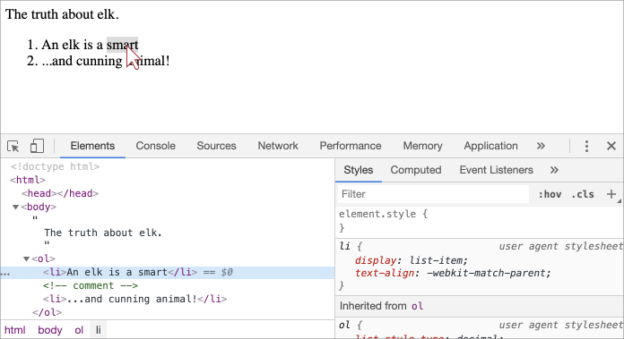

DOM 트리
====

##### 모든 HTML 태그 == 객체
- 중첩 태그
  - 태그 하나가 감싸고 있는 '자식' 태그
- 태그 내 문자
- 기타 등등

##### JS 통해 접근
- 페이지 조작 시 사용
- ex\) `document.body` <sub>(객체)</sub>
  - `<body>` <sub>(태그)</sub>

##### `<body>` <sub>(태그)</sub> 3초간 배경색 변경 <sub>(붉은색)</sub>
```javascript
// 배경색 변경 (붉은색)
document.body.style.background = "red";

// 3초 후 배경색 초기화
setTimeout(() => document.body.style.background = "", 3000);
```

##### 다양한 프로퍼티
- `innerHTML`
  - 해당 노드 HTML 내용
- `offsetWidth`
  - 해당 노드 너비 <sub>(픽셀)</sub>
- 기타 등등

### DOM 구조
```html
<!DOCTYPE HTML>
<html>
  <head>
    <title>사슴에 관하여</title>
  </head>
  <body>
    사슴에 관한 진실.
  </body>
</html>
```


#### 태그 트리 구조 <sub>(트리 내 노드 == 객체)</sub>

##### 태그
- 요소 <sub>(노드)</sub>
- 트리 구조 구성
  - `<html>` <sub>(루트 노드)</sub>
    - `<head>` <sub>(루트 자식 노드)</sub>
    - `<body>` <sub>(루트 자식 노드)</sub>

##### 텍스트 노드
- 요소 내 문자열
- 문자열만 담음
  - 자식 노드 無
  - 잎 노드 <sub>(트리 끝 위치)</sub>

##### `<title>` <sub>(태그 · 위 트리 이미지)</sub>
- 요소 <sub>(노드)</sub>
- 자식 노드 有
  - 텍스트 노드 <sub>("사슴에 관하여")</sub>

##### 특수문자 <sub>(`↵` 새 줄 · `␣` 공백 등)</sub>
- 유효 문자 취급
  - 텍스트 노드 구성 <sub>(DOM 일부)</sub>

#### 텍스트 노드 생성 예외 <sub>(2가지)</sub>

##### 1. `<head>` <sub>(태그)</sub> 이전 `↵` <sub>(새 줄)</sub> · `␣` <sub>(공백)</sub>
- 무시 <sub>(역사적인 이유)</sub>

##### 2. `</body>` <sub>(닫는 태그)</sub> 뒤 무언가 추가
- `body` <sub>(태그)</sub> 내부 자동 이동
- HTML 명세서 명시
  - 모든 콘텐츠
    - `body` <sub>(태그)</sub> 내부 위치

##### 공백 텍스트 노드 없는 HTML 문서
```html
<!DOCTYPE HTML>
<html><head><title>사슴에 관하여</title></head><body>사슴에 관한 진실.</body></html>
```


<br />

 **문자열 양 끝 공백 · 공백만 있는 텍스트 노드 <sub>(개발자 도구 미표시)</sub>**

##### 무의미한 공백 제거 <sub>(개발자 도구)</sub>
- 화면 덜 차지
- 브라우저상 HTML 문서 표현 시 보통 영향 無

<br />

### 자동 교정

##### 기형적인 HTML 구조
- 자동 교정 작동

##### 브라우저 DOM 생성 과정 중 에러 자동 처리
- 문서 에러
- 닫는 태그 부재 에러
- 기타 등등

##### `<html>` · `<body>` <sub>(태그)</sub> 부재 시 자동 삽입
- ex\) 문서 내 텍스트 <sub>("안녕하세요.")</sub> 하나만 삽입 시
  - 필수 태그 자동 생성 <sub>(브라우저)</sub>
    - `<html>` <sub>(최상위 태그)</sub>
    - `<head>` <sub>(태그)</sub>
    - `<body>` <sub>(태그)</sub>

```html
<!DOCTYPE HTML>
"안녕하세요."

↓↓↓

<html>
  <head></head>
  <body>
    "안녕하세요."
  </body>
</html>
```


##### 닫는 태그 부재 시 자동 삽입
```html
<!DOCTYPE HTML>
<html>
  <head></head>
  <body>
    <p>안녕하세요
    <li>엄마
    <li>그리고
    <li>아빠
  </body>
</html>

↓↓↓

<html>
  <head></head>
  <body>
    <p>안녕하세요</p>
    <li>엄마</li>
    <li>그리고</li>
    <li>아빠</li>
  </body>
</html>
```


##### 빠진 부분 자동 삽입 <sub>(브라우저)</sub>
- 최종 결과물
  - 정상적인 DOM

<br />

 **테이블 내 `<tbody>` <sub>(태그)</sub> 항상 有**

- DOM 명세서 명시
- 개발 시 보통 생략
  - 자동 삽입 <sub>(브라우저)</sub>
```html
<table>
  <tr>
    <td>1</td>
  </tr>
</table>

↓↓↓

<table>
  <tbody>
    <tr>
      <td>1</td>
    </tr>
  </tbody>
</table>
```


<br />

### 기타 노드 타입

##### 주석 노드
```html
<!DOCTYPE HTML>
<html>
  <head></head>
  <body>
    사슴에 관한 진실.
    <ol>
      <li>사슴은 똑똑합니다.</li>
      <!-- comment -->
      <li>그리고 잔꾀를 잘 부리죠!</li>
    </ol>
  </body>
</html>
```


##### DOM 내 주석 추가 이유 <sub>(HTML 규칙)</sub>
- HTML 내 뭔가 존재 시
  - 반드시 DOM 트리 내 추가
- 화면 출력물 내 영향 無

##### `<!DOCTYPE …>` <sub>(지시자 · HTML 문서 최상단)</sub>
- 트리 내 `<html>` <sub>(태그)</sub> 바로 위 위치

##### `document` <sub>(객체)</sub>
- 문서 전체 표현

##### [노드 타입](https://dom.spec.whatwg.org/#node) <sub>(총 12가지 · 4가지만 실무 주 사용)</sub>
1. 문서 노드 <sub>(document node)</sub>
    - DOM '진입점'
2. 요소 노드 <sub>(element node)</sub>
    - HTML 태그
    - DOM 트리 구성 블록
3. 텍스트 노드 <sub>(text node)</sub>
    - 텍스트 내용 <sub>(문자열)</sub>
4. 주석 노드 <sub>(comment node)</sub>
    - 화면 미표시
    - 정보 기록 <sub>(JS 이용해 읽기 가능)</sub>

### DOM 구조 직접 보기

##### 도구
1. [Live DOM Viewer](https://software.hixie.ch/utilities/js/live-dom-viewer/)
    - 실시간 DOM 구조 확인
2. 브라우저 개발자 도구
    - 주류 방식

##### [elk.html](https://ko.javascript.info/article/dom-nodes/elk.html) <sub>(개발자 도구)</sub>
1. 페이지 접속
2. 개발자 도구 열기
3. Elements <sub>(패널)</sub> 이동


##### 요소 클릭
- 자세한 내용 표시

##### 생략 내용 유의
- 텍스트 노드
  - 문자열만 표시
- 빈 텍스트 노드 <sub>(`↵` 새 줄 · `␣` 공백)</sub>
  - 미표시
- 개발 시 문제 X
  - 대다수 경우 요소 <sub>(노드)</sub>만 처리

##### 특정 노드 정보 확인 <sub>(Elements 패널)</sub>
- 좌상단 버튼 클릭 후
  - 웹페이지 상 노드 클릭
- 요소 우클릭 후
  - 'Inspect' <sub>(컨텍스트 메뉴)</sub> 클릭



##### 다수 하위 패널 <sub>(Elements 패널 우측 · 대다수 값 즉시 수정 가능)</sub>
- Style
  - 요소 적용 CSS 규칙 <sub>(일률적 표시)</sub>
    - 내장 규칙 포함
- Computed
  - 요소 적용 CSS 규칙 <sub>(프로퍼티 기준)</sub>
    - CSS 상속 규칙 포함
- Event Listeners
  - DOM 요소 내 설정된 이벤트 리스너
- 기타 등등

### 콘솔 사용해 DOM 다루기
- 코드로 해당 노드 수정
- 브라우저상 결과물 바로 확인

#### 방법 ⓐ <sub>(Elements 패널 내 노드 → 콘솔 창)</sub>

##### 선작업
1. Elements <sub>(패널)</sub>
    - 요소 선택 <sub>(`<li>`)</sub>
2. Esc 키 누르기
    - Elements <sub>(패널)</sub> 하단 콘솔 표시

##### 접근
- 마지막 선택 요소
  - $0
- 마지막 2번째 선택 요소
  - $1
- …

##### 콘솔 창 입력 <sub>(`$0.style.background = 'red'`)</sub>
- 1번째 항목 붉은색 표시


#### 방법 ⓑ

##### `inspect(node)` <sub>(콘솔 명령어)</sub>
- DOM 노드 참조 변수 사용
- 해당 요소 강조 <sub>(Elements 패널)</sub>

#### 방법 ⓒ

##### DOM 노드 입력 <sub>(콘솔 창)</sub>
- 해당 노드 콘솔 창 출력
  - ex\) document.body


##### 콘솔 사용해 DOM 다루는 방법
- 디버깅 용도

<br />

요약
====

##### HTML · XML 문서 → DOM 트리 표현 <sub>(브라우저 내)</sub>
- 태그
  - 요소 노드 <sub>(트리 구조 형성)</sub>
- 문자열
  - 텍스트 노드
- 이 외 HTML 내 모든 것
  - DOM 구성 요소 <sub>(주석 등)</sub>

##### [Chrome 개발자 도구 문서](https://developers.google.com/web/tools/chrome-devtools)
- 다양한 기능 확인
- 최선의 툴 학습 방법
  - 이리저리 클릭하기
  - 메뉴 직접 열어보기
  - 다양한 옵션 확인
