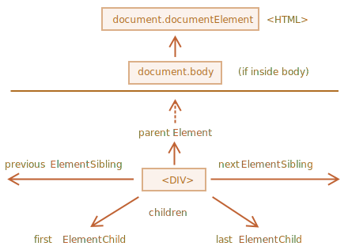

DOM 탐색
====

##### `document` <sub>(객체)</sub>
- DOM 수행 연산 시작점
- DOM 접근 위한 '진입점'

##### DOM 노드 탐색 관계도


### `documentElement` · `body` <sub>(트리 상단)</sub>

##### `document` <sub>(객체)</sub> 프로퍼티 <sub>(DOM 트리 상단 노드)</sub>
- `documentElement` <sub>(`<html>` 태그 · 요소)</sub>
  - DOM 트리 최상단 노드 <sub>(`document` 제외)</sub>
- `body` <sub>(`<body>` 태그 · 요소)</sub>
  - 개발 시 자주 사용
- `head` <sub>(`<head>` 태그 · 요소)</sub>

<br />

 **`document.body == null` 가능 <sub>(주의)</sub>**

##### 스크립트 읽는 도중 부재 요소
- 스크립트 접근 불가능

##### `<head>` <sub>(태그)</sub> 내 스크립트
- `document.body` 접근 불가능
  - 아직 읽지 않은 상태 <sub>(브라우저)</sub>

##### 1번째 `alert` 창 `null` 출력
```html
<!DOCTYPE HTML>
<html>

<head>
  <script>
    // null
    // - <body> (노드) 생성 전
    alert( document.body );
  </script>
</head>

<body>
  <script>
    // HTMLBodyElement
    // - <body> (노드) 생성 후
    alert( document.body );
  </script>
</body>

</html>
```

<br />

 **`null` <sub>(DOM)</sub> == '無'**

##### DOM 내 `null` 의미
- '존재하지 않음'
- '해당 노드 없음'

<br />

### 자식 노드 탐색

##### 자식 노드
- 부모 노드 바로 아래 위치 <sub>(중첩 관계)</sub>
- ex\) `<html>` <sub>(요소)</sub> 자식 노드
  - `<head>` <sub>(요소)</sub>
  - `<body>` <sub>(요소)</sub>

##### 자손 노드
- 중첩 관계 내 모든 요소
  - 자식 노드
  - 자식 노드 내 모든 자식 노드
  - 기타 등등
```html
<!DOCTYPE HTML>
<html>

<body>
  <div>시작</div>

  <ul>
    <li>
      <b>항목</b>
    </li>
  </ul>
</body>

</html>
```

##### `<body>` <sub>(요소)</sub> 자식 노드
- `<div>` <sub>(요소)</sub>
- `<ul>` <sub>(요소)</sub>
- 다수 빈 텍스트 노드

##### `<body>` <sub>(요소)</sub> 자손 노드
- 자식 노드 <sub>(`<div>` · `<ul>` 요소)</sub>
- 더 깊은 중첩 요소
  - `<ul>` <sub>(요소)</sub> 자식 노드
    - `<li>` <sub>(요소)</sub>
    - `<b>` <sub>(요소)</sub>
    - 기타 등등

#### `childNodes` <sub>(프로퍼티 · 컬렉션)</sub>
- 모든 자식 노드 <sub>(텍스트 노드 포함)</sub>

##### `document.body` 자식 노드 출력
```html
<!DOCTYPE HTML>
<html>

<body>
  <div>시작</div>

  <ul>
    <li>항목</li>
  </ul>

  <div>끝</div>

  <script>
    let childNodes = document.body.childNodes;

    for (let i = 0; i < childNodes.length; i++) {

      // Text, DIV, Text, UL, … , SCRIPT
      alert( childNodes[i] );
    }
  </script>

  …추가 내용…
</body>

</html>
```

##### `<script>` <sub>(`SCRIPT`)</sub> 마지막 출력 이유
- `…추가 내용…` <sub>(`<script>` 태그 하단)</sub>
  - 아직 읽지 못한 상태 <sub>(스크립트 실행 시점)</sub>

#### `[first·last]Child` <sub>(프로퍼티)</sub>
- 1번째 · 마지막 자식 노드 <sub>(단축키 역할)</sub>
```javascript
/* 자식 노드 존재 시 항상 참 */
firstChild === childNodes[0];
lastChild  === childNodes[childNodes.length - 1]
```

#### `hasChildNodes` <sub>(메서드)</sub>
- 자식 노드 유무 여부 확인

### DOM 컬렉션

##### `childNodes` <sub>(프로퍼티 · 컬렉션)</sub>
- 컬렉션 <sub>(배열 X)</sub>
  - 이터러블 <sub>(반복 가능 객체)</sub>
  - 유사 배열 객체

#### 컬렉션 특징

##### 1. `for…of` <sub>(반복문)</sub> 사용 가능
- 이터러블 <sub>(반복 가능 객체)</sub>
  - `[Symbol.iterator]` <sub>(메서드)</sub> 구현
```javascript
for (let node of document.body.childNodes) {
  alert(node); // 컬렉션 내 모든 노드 출력
}
```

##### 2. 배열 메서드 無
```javascript
// undefined
// - filter (배열 메서드) 無
alert(document.body.childNodes.filter);

// function
// - Array.from 적용 (배열 변환)
//   - 배열 메서드 사용 가능
alert( Array.from(document.body.childNodes).filter );
```

<br />

 **읽기만 가능**

##### 모든 탐색용 프로퍼티 읽기 전용
- 자식 노드 교체 <sub>(`childNodes[i] = …`)</sub> 불가능
- DOM 변경
  - 타 메서드 필요

<br />

 **살아있는 DOM 컬렉션**

##### DOM 현재 상태 반영
- 일부 예외사항 제외

##### `childNodes` <sub>(프로퍼티 · 컬렉션)</sub> 참조 도중
- 새 노드 추가 · 삭제 <sub>(변경 사항 발생)</sub> 시
  - 컬렉션 자동 반영

<br />

 **`for…in` <sub>(반복문)</sub> 사용 지양**

##### 모든 열거 가능 프로퍼티 순회
- 거의 사용되지 않는 '추가' 프로퍼티 포함
```html
<body>
  <script>
    // 불필요 프로퍼티까지 순회
    // - 0, 1, length, item, values 등
    for (let prop in document.body.childNodes) {
      alert(prop);
    }
  </script>
</body>
```

<br />

### 형제 · 부모 노드

#### 형제 노드 <sub>(동일 부모 노드 내 자식 노드)</sub>

##### `[previous·next]Sibling` <sub>(프로퍼티)</sub>
- 이전 · 다음 형제 노드

##### ex\) `<head>` · `<body>` <sub>(요소)</sub>
```html
<!DOCTYPE HTML>
<html>
  <head> … </head><body> … </body>
</html>
```

##### `<head>` <sub>(요소)</sub>
- `<body>` <sub>(요소)</sub> '이전' · '좌측' 형제 노드
- `body.previousSibling`

##### `<body>` <sub>(요소)</sub>
- `<head>` <sub>(요소)</sub> '다음' · '우측' 형제 노드
- `head.nextSibling`

#### 부모 노드

##### `parentNode` <sub>(프로퍼티)</sub>
```javascript
// <body> (요소) 부모 노드
// - <html> (요소)
// true
alert( document.body.parentNode === document.documentElement );

// <body> (요소) 이전 형제 노드
// - <head> (요소)
// // HTMLHeadElement
alert( document.body.previousSibling );

// <head> (요소) 다음 형제 노드
// - <body> (요소)
// HTMLBodyElement
alert( document.head.nextSibling );
```

### 요소 <sub>(노드)</sub> 간 이동

##### 실무
- 텍스트 · 주석 노드
  - 잘 다루지 않음
- 요소 노드
  - 주요 작업 대상



#### `Element` <sub>(요소)</sub> 프로퍼티

##### `children`
- 자식 노드 중 요소 노드

##### `[first·last]ElementChild`
- 1번째 마지막 자식 요소 노드

##### `[previous·next]ElementSibling`
- 형제 요소 노드

##### `parentElement`
- 부모 요소 노드

<br />

 **`parentNode` vs `parentElement`**

##### `parentNode` <sub>(프로퍼티)</sub>
- 부모 '노드' 반환 <sub>(종류 무관)</sub>

##### `parentElement` <sub>(프로퍼티)</sub>
- 부모 '요소 노드' 반환

##### 두 프로퍼티
- 보통 동일 노드 반환

##### `documentElement` <sub>(`<html>` 요소)</sub> 대상
- 다른 노드 반환
- 부모 노드
  - `document` <sub>(요소 노드 X)</sub>
```javascript
// document (노드)
alert( document.documentElement.parentNode );

// null (요소 노드)
alert( document.documentElement.parentElement );
```

##### 사소한 차이 <sub>(부모 노드 메서드)</sub> 활용법
- 거슬러 올라가기 <sub>(임의 요소 노드 시작)</sub>
  - `<html>` <sub>(요소)</sub>
  - `document` X
```javascript
// <html> (요소) 까지 거슬러 올라감
while (elem = elem.parentElement) {
  alert( elem );
}
```

<br />

##### `childNodes` <sub>(프로퍼티)</sub> → `children` <sub>(프로퍼티)</sub>
- 자식 노드 중 요소 노드만 출력
```html
<html>

<body>
  <div>시작</div>

  <ul>
    <li>항목</li>
  </ul>

  <div>끝</div>

  <script>
    for (let elem of document.body.children) {

      // DIV, UL, DIV, SCRIPT
      alert(elem);
    }
  </script>
  …
</body>

</html>
```

### 테이블 탐색하기

##### 일부 DOM 요소 노드
- 기본 외 추가 프로퍼티 지원 <sub>(편의 도모)</sub>

#### 테이블 관련 추가 프로퍼티

##### `<table>` <sub>(요소)</sub>
- `rows`
  - `<tr>` <sub>(요소)</sub> 컬렉션
- `caption` · `tHead` · `tFoot`
  - `<caption>` <sub>(요소)</sub>
  - `<thead>` <sub>(요소)</sub>
  - `<tfoot>` <sub>(요소)</sub>
- `tBodies`
  - `<tbody>` <sub>(요소)</sub> 컬렉션

##### `<tbody>` <sub>(요소)</sub> 표준 명세서
- 테이블 <sub>(`<table>`)</sub> 내
  - 다수 존재 가능
  - 최소 1개 필수
- 부재 시
  - 자동 추가 <sub>(브라우저)</sub>

##### `<t[head·body·foot]>` <sub>(요소)</sub>
- `rows`
  - `<tr>` <sub>(요소)</sub> 컬렉션

##### `<tr>` <sub>(요소)</sub>
- `cells`
  - `<td>` · `<th>` <sub>(요소)</sub> 컬렉션
- `sectionRowIndex`
  - `<t[head·body·foot]>` <sub>(요소)</sub> 내 순서
- `rowIndex`
  - 동일 요소 간 순서 <sub>(`<table>` 요소 안)</sub>

##### `<td>` · `<th>` <sub>(요소)</sub>
- `cellIndex`
  - 해당 `<tr>` <sub>(요소)</sub> 내 순서
```html
<table id="table">
  <tr>
    <td>일</td><td>이</td>
  </tr>
  <tr>
    <td>삼</td><td>사</td>
  </tr>
</table>

<script>
  // 1번째 줄 · 2번째 칸 <td> (요소)
  // - <td>이</td>
  let td = table.rows[0].cells[1];

  // 강조
  td.style.backgroundColor = "red";
</script>
```

##### 표 관련 공식 명세서
- [tabular data](https://html.spec.whatwg.org/multipage/tables.html)

<br />

요약
====

#### 탐색 프로퍼티
- 이웃 노드로 바로 이동

##### 모든 노드 적용
- `parentNode`
- `childNodes`
- `firstChild`
- `lastChild`
- `previousSibling`
- `nextSibling`

##### 요소 노드 적용
- `parentElement`
- `children`
- `firstElementChild`
- `lastElementChild`
- `previousElementSibling`
- `nextElementSibling`

##### 몇몇 DOM 요소 <sub>(테이블 등)</sub>
- 추가 프로퍼티 有
- 컬렉션
  - 콘텐츠 접속

<br />

##  과제

### 자식 DOM
```html
<html>

<body>
  <div>사용자:</div>
  <ul>
    <li>John</li>
    <li>Pete</li>
  </ul>
</body>

</html>
```

##### 해당 DOM 노드 접근 방법 구상
- `<div>` <sub>(요소)</sub>
- `<ul>` <sub>(요소)</sub>
- 2번째 `<li>` <sub>(요소)</sub>
  - `<li>Pete</li>`

<br />


```javascript
/* <div> (요소) */
document.body.firstElementChild;
document.body.children[0];

// 1번째 노드 (0) : 공백
document.body.childNodes[1];

/* <ul> (요소) */
document.body.lastElementChild;

// 1번째 노드 (0) : 공백
document.body.children[1];

/* 2번째 <li> (요소)
 <li>Pete</li>
 1. <ul> (요소) 가져오기
 2. <ul> (요소) 마지막 자식 요소 가져오기
 */
document.body.lastElementChild.lastElementChild
```

<hr />

### 형제 노드에 관한 질문

##### `null` 여부
1. `elem.lastChild.nextSibling`
    - 마지막 자식 노드의 다음 형제 노드
2. `elem.children[0].previousSibling`
    - 1번째 자식 요소 노드의 이전 노드

<br />


##### 1. Yes
- `elem.lastChild`
  - 항상 마지막 자식 노드
  - `nextSibling` X

##### 2. No
- `elem.children[0]`
  - '요소 노드' 중 1번째 자식 노드
  - 앞에 다른 노드 <sub>(요소 노드 X)</sub> 존재 가능
    - ex\) 텍스트 노드

#### 공통점 : 자식 노드 부재 시 에러 발생
- `elem.lastChild`
  - `null` <sub>(`nextSibling` 접근 X)</sub>
- `elem.children` <sub>(컬렉션)</sub>
  - 빈 상태 <sub>(`[]`)</sub>

<hr />

### 모든 대각선 셀 선택하기

##### 테이블 내 모든 대각선 셀 : 빨간색 칠하기
```javascript
td.style.backgroundColor = 'red';
```

##### 결과


<br />


##### `rows` · `cells` <sub>(프로퍼티)</sub> 이용

[코드](https://plnkr.co/edit/z4zT9zp7dGDd1Ze9?p=preview)
