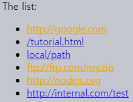

속성 · 프로퍼티
====

##### 브라우저
- HTML 읽고 <sub>(파싱)</sub> DOM 객체 생성

##### 요소 내 DOM 객체 프로퍼티
- 대다수 표준 HTML 속성 대응
  - ex\) `<body id="page">`
    - `body.id="page"`
- 프로퍼티 · 속성 매핑
  - 대부분 1:1 <sub>(예외 有)</sub>

### DOM 프로퍼티

#### 커스텀 프로퍼티

##### 내장 프로퍼티 불충분 시
- 새 프로퍼티 추가

##### `document.body` <sub>(요소)</sub>
- 새 프로퍼티 추가
```javascript
// 커스텀 프로퍼티 추가
document.body.myData = {
  name: 'Caesar',
  title: 'Imperator'
};

document.body.myData.title; // Imperator

// 커스텀 메서드 추가
// - this 값 == document.body
document.body.sayTagName = function() {
  this.tagName;
};

document.body.sayTagName(); // BODY
```

#### 내장 프로토타입 수정

##### 수정사항 <sub>(커스터마이징)</sub>
- 특정 노드 전체 적용

##### `Element.prototype` <sub>(내장 프로토타입)</sub> 수정
- 새 메서드 추가
  - 모든 요소 사용 가능
```javascript
Element.prototype.sayHi = function() {
  `Hello, I'm ${this.tagName}`;
};

// Hello, I'm HTML
document.documentElement.sayHi();

// Hello, I'm BODY
document.body.sayHi();
```

##### DOM 노드 == JS 객체
- 노드 <sub>(객체)</sub> 수정 가능
  - 새 프로퍼티 추가
  - 프로퍼티 수정
  - 기타 등등
- 프로퍼티 · 메서드 규칙 동일
  - 모든 값 할당 가능
  - 대 · 소문자 구분

### HTML 속성

##### DOM 객체 생성 시
- HTML 표준 속성 인식
  - DOM 프로퍼티 생성
- HTML 非표준 속성 인식 X
  - DOM 프로퍼티 미생성
```html
<body id="test" something="non-standard">
  <script>
    document.body.id;        // test (id 속성)

    // 非표준 속성 프로퍼티 전환 X
    document.body.something; // undefined (something 속성)

  </script>
</body>
```

##### 요소별 전용 표준 속성 有 <sub>(명세서 참조)</sub>
- ex\) `type` <sub>(속성)</sub>
  - `<input>` <sub>(`HTMLInputElement`)</sub> 표준
  - `<body>` <sub>(`HTMLBodyElement`)</sub> 표준 X
```html
<body id="body" type="text">
  <input id="input" type="text">

  <script>
    input.type; // text (type 속성)
    body.type;  // undefined (type 속성)
    
  </script>
</body>
```

##### HTML 명시 속성 <sub>(非표준 속성 등)</sub> 접근 메서드
- `hasAttribute(name)`
  - 속성 <sub>(`name`)</sub> 유무 여부 확인
- `getAttribute(name)`
  - 속성 <sub>(`name`)</sub> 값 가져오기
- `setAttribute(name, value)`
  - 속성 <sub>(`name`)</sub> 값 변경 <sub>(`value`)</sub>
- `removeAttribute(name)`
  - 속성 <sub>(`name`)</sub> 값 제거

##### `attributes` <sub>(프로퍼티)</sub>
- 모든 속성값 가져오기
- `Attr` <sub>(내장 클래스)</sub> 구현 객체 컬렉션
  - `name` <sub>(프로퍼티)</sub>
  - `value` <sub>(프로퍼티)</sub>
```html
<body something="non-standard">
  <script>
    // non-standard (非표준 속성 접근)
    document.body.getAttribute('something');
  </script>
</body>
```

##### HTML 속성 특징
- 대 · 소문자 구분 X
  - ex\) `id` == `ID`
- 값
  - 항상 문자열
```html
<body>
  <div id="elem" about="Elephant"></div>

  <script>
    /* ①  속성 읽기 (<… about="Elephant">)
     HTML 내 항상 소문자 (about)
     속성 대 · 소문자 구분 X
     - about == About
     */
    elem.getAttribute('About');

    /* ② 속성 추가 (<… test="123">)
     모든 값 속성 대입 가능
     - 문자열 자동 변환
       - 123 (숫자) → "123" (문자열)
     */
    elem.setAttribute('Test', 123);

    /* ③ 추가된 속성 확인
     outerHTML (프로퍼티)
     - 모든 속성 확인 가능
     */
    elem.outerHTML;

    /* ④ 전체 속성 나열
     attributes (프로퍼티) 반환 컬렉션
     - 이터러블 (객체)
       - 열거 가능
     - Attr (내장 클래스) 구현 객체 (컬렉션 요소)
       - name (프로퍼티)
       - value (프로퍼티)
     */
    for (let attr of elem.attributes) {
      `${attr.name} = ${attr.value}`;
    }
  </script>
</body>
```

### 프로퍼티 · 속성 동기화

##### 표준 속성 수정 시
- 대응 프로퍼티 자동 갱신

##### 대응 프로퍼티 수정 시
- 표준 속성 자동 갱신 <sub>(예외 有)</sub>

##### 표준 속성 ↔ 대응 프로퍼티
```html
<input>

<script>
  let input = document.querySelector('input');

  // 속성 추가 → 프로퍼티 갱신
  input.setAttribute('id', 'id');

  input.id; // id

  // 프로퍼티 수정 → 속성 갱신
  input.id = 'newId';
  
  input.getAttribute('id'); // newId
</script>
```

##### 단방향 <sub>(예외 · 속성 → 프로퍼티)</sub>
- ex\) `input.value` 등
- 일부 경우 유용
  - `value` 값 변경 발생 시
    - '기존' 값 <sub>(속성값)</sub> 복구
```html
<input>

<script>
  let input = document.querySelector('input');

  // 속성 추가 → 프로퍼티 갱신
  input.setAttribute('value', 'text');

  input.value; // text

  // 프로퍼티 수정 → 속성 갱신 X
  input.value = 'newValue';

  input.getAttribute('value'); // text
</script>
```

### DOM 프로퍼티 값 자료형

##### 문자열 외 일부 자료형 有
- `input.checked` <sub>(체크박스 요소 프로퍼티)</sub>
  - `boolean`
```html
<input id="input" type="checkbox" checked> checkbox

<script>
  // 속성값
  input.getAttribute('checked'); // "" (빈 문자열)

  // 프로퍼티 값
  input.checked; // true
</script>
```

##### `style` <sub>(속성)</sub>
- 속성값
  - 문자열
- 대응 프로퍼티 값
  - 객체
```html
<div id="div" style="color: red; font-size: 120%">Hello</div>

<script>
  // color: red; font-size: 120% (문자열)
  div.getAttribute('style');

  // [object CSSStyleDeclaration] (객체)
  div.style;

  // red
  div.style.color;
</script>
```

##### 대다수 프로퍼티 값
- 문자열

##### 속성값 ≠ 대응 프로퍼티 값 <sub>(문자열)</sub> 예외 <sub>(극소수 경우)</sub>
- ex\) `href`
  - 속성
    - 전체 · 상대 url
    - `#hash`
  - 프로퍼티
    - 항상 전체 url
```html
<a id="a" href="#hello">link</a>

<script>
  a.getAttribute('href'); // #hello (속성)
  a.href; // http://site.com/page#hello (프로퍼티)
</script>
```

### 非표준 <sub>(커스텀)</sub> 속성 <sub>(`dataset`)</sub>

##### 주 용도
- 사용자 지정 데이터 전달
  - HTML 문서 → JS 코드
- JS 조작 대상 HTML 요소 표시

##### 데이터 전달 <sub>(HTML → JS)</sub>
- `show-info` <sub>(커스텀 속성)</sub>
```html
<!-- <div> (요소 · name 이름 정보) -->
<div show-info="name"></div>

<!-- <div> (요소 · age 나이 정보) -->
<div show-info="age"></div>

<script>
  let user = {
    name: "Pete",
    age: 25
  };

  let divs = document.querySelectorAll('[show-info]');

  for (let div of divs) {

    // 해당 태그 내 정보 표시
    let field = div.getAttribute('show-info');

    /*
     Pete (user.name)
     - <div show-info="name">Pete</div>
     25 (user.age)
     - <div show-info="age">25</div>
     */
    div.innerHTML = user[field];
  }
</script>
```

##### 요소 스타일 적용
- `order-state` <sub>(커스텀 속성)</sub>
  - 주문 상태 따라 스타일 변경
```html
<style>
  /* order-state (커스텀 속성) 따라 스타일 변경 */
  .order[order-state="new"] {
    color: green;
  }

  .order[order-state="pending"] {
    color: blue;
  }

  .order[order-state="canceled"] {
    color: red;
  }
</style>

<div class="order" order-state="new">
  A new order.
</div>

<div class="order" order-state="pending">
  A pending order.
</div>

<div class="order" order-state="canceled">
  A canceled order.
</div>
```

##### 커스텀 속성 선호 이유
- 클래스 대비 편의성 ↑
  - 속성 상태 변경 용이
- 클래스 <sub>(3개 필요)</sub>
  - `.order-state-new`
  - `.order-state-pending`
  - `.order-state-canceled`
```javascript
// 클래스 추가 · 제거 대비 단순
div.setAttribute('order-state', 'canceled');
```

##### 非표준 → 추후 표준 지정 가능성 有 <sub>(문제점)</sub>
- 충돌 방지 필요
  - `data-[*]` <sub>(속성)</sub> 사용

##### `data-[*]` <sub>(속성)</sub> 전체
- 별도 예약
  - 개발자 용도 맞게 사용

##### `dataset` <sub>(프로퍼티)</sub>
- `data-[*]` <sub>(속성)</sub> 접근 <sub>(읽기 · 수정)</sub>
  - ex\) `<elem data-about=…>`
    - `elem.dataset.about`
```html
<body data-about="Elephants">
  <script>
    document.body.dataset.about; // Elephants
  </script>
</body>
```

##### 다수 단어 구성 → 카멜 표기법 <sub>(변환)</sub>
- ex\) `data-order-state`
  - `dataset.orderState`
```html
<style>
  .order[data-order-state="new"] {
    color: green;
  }

  .order[data-order-state="pending"] {
    color: blue;
  }

  .order[data-order-state="canceled"] {
    color: red;
  }
</style>

<div id="order" class="order" data-order-state="new">
  A new order.
</div>

<script>
  // 읽기
  order.dataset.orderState; // new

  // 수정
  order.dataset.orderState = "pending";
</script>
```

<br />

요약
====
- 속성
  - HTML 요소
- 프로퍼티 <sub>(선호도 ↑)</sub>
  - DOM 객체

||자료형|대 · 소문자 구분|
|:---:|:---:|:---:|
|속성|`string`|X<br /><sub>(항상 소문자)</sub>|
|프로퍼티|전체<br /><sub>(명세서 참조)</sub>|O|

##### 속성 관련 메서드
- `hasAttribute(name)`
  - 속성 <sub>(`name`)</sub> 유무 여부 확인
- `getAttribute(name)`
  - 속성 <sub>(`name`)</sub> 값 가져오기
- `setAttribute(name, value)`
  - 속성 <sub>(`name`)</sub> 값 변경 <sub>(`value`)</sub>
- `removeAttribute(name)`
  - 속성 <sub>(`name`)</sub> 값 제거

##### 속성 관련 프로퍼티
- `attributes`
  - `Attr` <sub>(내장 클래스)</sub> 구현 객체 컬렉션

#### 정확한 HTML 속성값 필요 시 속성 사용

##### 1. 非표준 속성
- `data-[*]` <sub>(속성)</sub> 제외
  - `dataset` <sub>(프로퍼티)</sub> 사용

##### 2. HTML 속성값 '그대로' 읽기 <sub>('원본'값)</sub>
- 일부 속성값 ≠ 대응 프로퍼티 값
  - ex\) `href`
    - 속성
      - 전체 · 상대 url
      - `#hash`
    - 프로퍼티
      - 항상 전체 url

<br />

##  과제

### 속성 접근
1. 특정 요소 검색
   - `data-widget-name` <sub>(속성)</sub> 有
2. 해당 속성값 읽기
```html
<!DOCTYPE html>
<html>

<body>
  <div data-widget-name="menu">Choose the genre</div>

  <script>
    …
  </script>
</body>

</html>
```

<br />


```html
<!DOCTYPE html>
<html>

<body>
  <div data-widget-name="menu">Choose the genre</div>

  <script>
    // 요소 검색
    let elem = document.querySelector('[data-widget-name]');

    // 커스텀 속성값 읽기
    elem.dataset.widgetName;
    elem.getAttribute('data-widget-name');
  </script>
</body>

</html>
```

<hr />

### 외부 링크 <sub>(요소)</sub> 주황색 표시

##### 특정 외부 링크 <sub>(요소)</sub> 색상 변경 <sub>(주황색)</sub>
- `style` <sub>(프로퍼티)</sub> 수정

##### 외부 링크 <sub>(요소)</sub> 구성 조건
- `href`
  - `://` <sub>(프로토콜)</sub> 포함
  - `http://internal.com` 시작 X
```html
<a name="list">the list</a>

<ul>
  <li><a href="http://google.com">http://google.com</a></li>
  <li><a href="/tutorial">/tutorial.html</a></li>
  <li><a href="local/path">local/path</a></li>
  <li><a href="ftp://ftp.com/my.zip">ftp://ftp.com/my.zip</a></li>
  <li><a href="http://nodejs.org">http://nodejs.org</a></li>
  <li><a href="http://internal.com/test">http://internal.com/test</a></li>
</ul>

<script>
  // 개별 링크 (요소) 스타일 설정
  let link = document.querySelector('a');
  link.style.color = 'orange';
</script>
```



<br />


#### 모든 외부 참조 검색 <sub>(2가지 방법)</sub>

##### 1. `document.querySelectorAll('a')`
1. 모든 링크 <sub>(요소)</sub> 검색
2. 필요 링크 <sub>(요소)</sub> 필터링
```javascript
let links = document.querySelectorAll('a');

for (let link of links) {

  // HTML 내 속성값 필요
  // - link.href (DOM 프로퍼티) X
  // - getAttribute (메서드) 사용
  let href = link.getAttribute('href');

  // 속성 無
  if (!href) {
    continue;
  }

  // 프로토콜 無
  if (!href.includes('://')) {
    continue;
  }

  // 제외 링크
  // - http://internal.com
  if (href.startsWith('http://internal.com')) {
    continue;
  }

  link.style.color = 'orange';
}
```

##### 2. CSS 선택자 조건 명시
1. `href` <sub>(속성)</sub> 내 `://` <sub>(프로토콜)</sub> 포함 링크
2. 그 중 `http://internal.com` 시작 X
```javascript
let selector = 'a[href*="://"]:not([href^="http://internal.com"])';
let links = document.querySelectorAll(selector);

links.forEach(link => link.style.color = 'orange');
```
