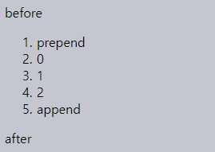
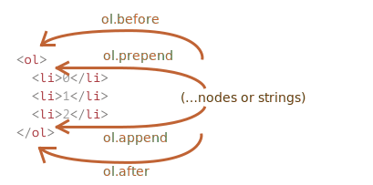
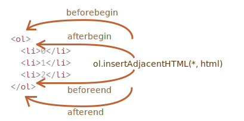
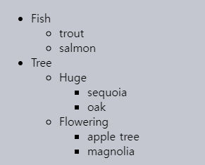
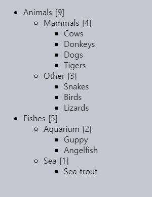
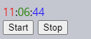

문서 수정
====

##### DOM 조작
- '생동감 있는' 웹페이지 핵심

### 메시지 보여주기

##### JS 미사용 메시지 창
```html
<style>
  .alert {
    padding: 15px;
    border: 1px solid #d6e9c6;
    border-radius: 4px;
    color: #3c763d;
    background-color: #dff0d8;
  }
</style>

<div class="alert">
  <strong>안녕하세요!</strong> 중요 메시지를 확인하셨습니다.
</div>
```


##### JS 사용한 메시지 창 생성 학습
- 경고 창 <sub>(`alert`)</sub> 보다 보기 좋은 메시지 창
- 스타일 코드 생략

### 요소 생성

#### DOM 노드 생성 메서드 <sub>(2가지)</sub>

##### 1. `document.createElement(tag)` <sub>(주로 사용)</sub>
- 새 요소 생성
  - ex\) 메시지 들어간 `div` <sub>(요소)</sub> 등
- `tag` <sub>(문자열)</sub>
  - 태그명
```javascript
let div = document.createElement('div');
```

##### 2. `document.createTextNode(text)`
- 새 텍스트 노드 생성
- `text` <sub>(문자열)</sub>
  - 텍스트 내용
```javascript
let textNode = document.createTextNode('안녕하세요.');
```

#### 메시지 생성하기

##### 메시지 들어간 `<div>` <sub>(요소)</sub> 생성 <sub>(3단계)</sub>
```javascript
// ①
// <div> (요소) 생성
// - div (변수) 할당
let div = document.createElement('div');

// ②
// 요소 클래스 속성 설정
// - .alert
div.className = "alert";

// ③
// 내용 채워넣기
div.innerHTML = "<strong>안녕하세요!</strong> 중요 메시지를 확인하셨습니다.";
```
- 아직 변수 <sub>(`div`)</sub> 에만 저장된 상태
  - 페이지 내 미표시

### 노드 삽입

##### 노드 삽입 메서드
- `node.before(노드 · 문자열)`
  - `node` 앞 삽입
- `node.after(노드 · 문자열)`
  - `node` 뒤 삽입
- `node.prepend(노드 · 문자열)`
  - `node` 내 1번째 자식 노드 앞 삽입
- `node.append(노드 · 문자열)`
  - `node` 내 마지막 자식 노드 뒤 삽입
- `node.replaceWith(노드 · 문자열)`
  - `node` 교체

##### 생성한 요소 <sub>(`div` 변수 저장)</sub>
- `document` 내 삽입 필요 <sub>(페이지 표시)</sub>
  - ex\) `<body>` <sub>(`document.body`)</sub> 등

##### `document.body.append(div)`
- `document.body` 내 `div` <sub>(생성 요소)</sub> 삽입
```html
<style>
  .alert {…}
</style>

<script>
  let div = document.createElement('div');
  div.className = "alert";
  div.innerHTML = "<strong>안녕하세요!</strong> 중요 메시지를 확인하셨습니다.";

  // 요소 삽입
  document.body.append(div);
</script>
```

##### 문자열 전달 시 텍스트 노드 생성
```html
<ol id="ol">
  <li>0</li>
  <li>1</li>
  <li>2</li>
</ol>

<script>
  // <ol> (요소) 앞
  // - 'before' (문자열) 삽입
  ol.before('before');

  // <ol> (요소) 뒤
  // - 'after' (문자열) 삽입
  ol.after('after');

  // <ol> (요소) 내 1번째 자식 노드 앞
  // - <li>prepend</li> (요소) 삽입
  let liFirst = document.createElement('li');
  liFirst.innerHTML = 'prepend';
  ol.prepend(liFirst);

  // <ol> (요소) 내 마지막 자식 노드 뒤
  // - <li>append</li> (요소) 삽입
  let liLast = document.createElement('li');
  liLast.innerHTML = 'append';
  ol.append(liLast);
</script>

↓↓↓

before
<ol id="ol">
  <li>prepend</li>
  <li>0</li>
  <li>1</li>
  <li>2</li>
  <li>append</li>
</ol>
after
```





##### 다수 노드 삽입
- 다수 인수 <sub>(노드 · 문자열)</sub> 전달
```html
<div id="div"></div>

<script>
  div.before(
    '<p>안녕하세요</p>',
    document.createElement('hr')
  );
</script>

↓↓↓

&lt;p&gt;안녕하세요&lt;/p&gt;
<hr>
<div id="div"></div>
```

##### 문자열 인수 <sub>(텍스트 노드 생성)</sub>
- 'HTML' X
- '문자열' 형태
  - 특수문자 <sub>(`<` · `>` 등)</sub> 이스케이프 처리
- 안전하게 문자열 삽입
  - `textContent` <sub>(프로퍼티)</sub> 동일 효과

### `insertAdjacent[*]` <sub>(요소 전용)</sub>

#### `elem.insertAdjacentHTML(where, html)`

##### 'HTML 자체' <sub>(문자열 형태)</sub> 삽입
- 태그 정상 동작
- `innerHTML` <sub>(프로퍼티)</sub> 동일 효과

##### `where` <sub>(문자열 · `elem` 기준)</sub>
- `'beforebegin'`
  - `elem` 앞
- `'afterbegin'`
  - `elem` 내 1번째 자식 요소 앞
- `'beforeend'`
  - `elem` 내 마지막 자식 요소 뒤
- `'afterend'`
  - `elem` 뒤

##### `html` <sub>(문자열)</sub>
- HTML <sub>(문자열 형태)</sub>
- 이스케이프 미처리 <sub>('그대로' 삽입)</sub>
```html
<div id="div">
  <p>contents</p>
</div>

<script>
  div.insertAdjacentHTML('beforebegin', 'before begin');
  div.insertAdjacentHTML('afterbegin', '<p>after begin</p>');
  div.insertAdjacentHTML('beforeend', '<p>before end</p>');
  div.insertAdjacentHTML('afterend', 'after end');
</script>

↓↓↓

before begin
<div id="div">
  <p>after begin</p>
  <p>contents</p>
  <p>before end</p>
  </div>
after end
```



#### 형제 메서드 <sub>(2가지)</sub>
- 메서드 구색 갖추기 목적
- 사용 빈도 ↓

##### `elem.insertAdjacentText(where, text)`
- 문법 동일
- `text` <sub>(문자열)</sub>
  - '문자 그대로' 삽입

##### `elem.insertAdjacentElement(where, elem)`
- 문법 동일
- `elem` <sub>(요소)</sub> 삽입

##### 메시지 보여주기 코드 재작성
- `insertAdjacentHTML` <sub>(메서드)</sub> 사용
```html
<style>
  .alert {…}
</style>

<script>
  document.body.insertAdjacentHTML(
    'afterbegin',
    `<div class="alert">
      <strong>안녕하세요!</strong>
      중요 메시지를 확인하셨습니다.
    </div>`
  );
</script>
```

### 노드 제거

##### `node.remove()` <sub>(메서드)</sub>
- `node` 제거

##### 1초 후 메시지 제거
```html
<style>
  .alert {…}
</style>

<script>
  let div = document.createElement('div');
  div.className = "alert";
  div.innerHTML = "<strong>안녕하세요!</strong> 중요 메시지를 확인하셨습니다.";

  document.body.append(div);

  // 1초 후 div (요소) 제거
  setTimeout(() => div.remove(), 1000);
</script>
```

##### 참고 <sub>(노드 삽입 메서드)</sub>
- 기존 노드 위치 변경 시 자동 제거 수행
  - 수동 제거 불필요
```html
<div id="first">First</div>
<div id="second">Second</div>

<script>
  // remove (메서드) 호출 불필요
  // 1. <div id="first"> (노드) 가져오기
  // 2. <div id="second"> (노드) 뒤 삽입
  second.after(first);
</script>

↓↓↓

<div id="second">Second</div>
<div id="first">First</div>
```

### 노드 복제

##### `cloneNode(deep)` <sub>(메서드)</sub>
- `deep` <sub>(`boolean`)</sub>
  - '깊은' 복제 <sub>(모든 하위 노드 복제)</sub> 여부
```html
<style>
  .alert {…}
</style>

<div class="alert" id="div">
  <strong>안녕하세요!</strong> 중요 메시지를 확인하셨습니다.
</div>

<script>
  // 메시지 창 복제
  let div2 = div.cloneNode(true);

  // 복제한 메시지 창 내용 수정
  div2.querySelector('strong').innerHTML = '안녕히 가세요!';

  // 기존 메시지 창 다음 표시
  div.after(div2);
</script>
```

### `DocumentFragment` <sub>(노드)</sub>

##### 래퍼 역할
- 다수 노드 그룹화
- 삽입 시 본체 제거
  - 내부 노드만 삽입

##### `getListContent` <sub>(함수)</sub>
- `DocumentFragment` <sub>(노드)</sub> 생성 · 반환
  - 새 `<li>` <sub>(요소)</sub> 그룹화
```html
<ul id="ul"></ul>

<script>
  function getListContent() {
    let fragment = new DocumentFragment();

    for (let i=1; i<=3; i++) {
      let li = document.createElement('li');
      li.append(i);
      fragment.append(li);
    }

    return fragment;
  }

  ul.append(getListContent());
</script>

↓↓↓

<ul>
  <li>1</li>
  <li>2</li>
  <li>3</li>
</ul>
```

##### 사용 빈도 ↓
- 더 쉬운 방법 有 <sub>(배열 등)</sub>
```html
<ul id="ul"></ul>

<script>
  function getListContent() {
    let result = [];

    for (let i=1; i<=3; i++) {
      let li = document.createElement('li');
      li.append(i);
      result.push(li);
    }

    return result;
  }

  ul.append(...getListContent());
</script>

↓↓↓

<ul>
  <li>1</li>
  <li>2</li>
  <li>3</li>
</ul>
```

### 구식 삽입 · 제거 <sub>(하위 호환성)</sub>

 **구식 문법**

- 구식 스크립트 이해 시 필요

<br />

##### 구식 삽입 · 제거 메서드
- `parent.appendChild(node)`
  - `parent` 내 마지막 자식 노드 뒤 삽입
- `parent.insertBefore(node, child)`
  - `parent` 내 `child` <sub>(자식 노드)</sub> 앞 추가
  - `parent` 내 1번째 자식 노드 앞 삽입 시
    - `first[Element]Child` 사용
```javascript
parent.insertBefore(node, parent.firstChild);
parent.insertBefore(node, parent.firstElementChild);
```
- `parent.replaceChild(node, child)`
  - `parent` 내 `child` <sub>(자식 노드)</sub> 교체
- `parent.removeChild(node)`
  - `parent` 내 `node` <sub>(자식 노드)</sub> 제거
- 삽입 · 제거 노드 <sub>(`node`)</sub> 반환
  - 사용 빈도 ↓
```html
<ol id="list">
  <li>0</li>
  <li>1</li>
  <li>2</li>
</ol>

<script>
  /* appendChild */
  let li1 = document.createElement('li');
  li1.innerHTML = 'appendChild';

  list.appendChild(li1);
</script>

↓↓↓

<ol id="list">
  <li>0</li>
  <li>1</li>
  <li>2</li>
  <li>appendChild</li>
</ol>

<script>
  /* insertBefore */
  let li2 = document.createElement('li');
  li2.innerHTML = 'insertBefore';

  list.insertBefore(li2, list.children[1]);
</script>

↓↓↓

<ol id="list">
  <li>0</li>
  <li>insertBefore</li>
  <li>1</li>
  <li>2</li>
  <li>appendChild</li>
</ol>

<script>
  list.removeChild(list.firstElementChild);
</script>

↓↓↓

<ol id="list">
  <li>insertBefore</li>
  <li>1</li>
  <li>2</li>
  <li>appendChild</li>
</ol>
```

### `document.write` 첨언

##### 아주 오래된 메서드
- 보통 구식 스크립트 내 有

##### 웹페이지 내 내용 추가
```html
<p>… 페이지 어딘가 …</p>

<script>
  document.write('<b>자바스크립트를 사용해 Hello 입력</b>');
</script>

<p>끝</p>
```

##### '호출 위치 내 즉시' 내용 추가
- HTML 형식 문자열 동적 생성
  - 유연한 동적 조작 수행 가능

##### 페이지 로드 중에만 작동 <sub>(단점)</sub>
- 페이지 로드 완료 후 호출 시
  - 기존 문서 내용 제거
```html
<p>1 초 후, 이 페이지의 내용은 전부 교체됩니다.</p>

<script>
  // 1초 후 document.write 호출
  // - 페이지 로드 끝난 후 호출 시
  //   - 기존 내용 제거
  setTimeout(() => document.write('<b>…사라졌습니다.</b>'), 1000);
</script>
```

##### HTML 파싱 도중 메서드 도달 시 <sub>(브라우저)</sub>
- HTML <sub>(문자열 형식 · 메서드 인수)</sub>
  - 페이지 내 기존 구성 내용 취급 해석

##### 도중 DOM 조작 X <sub>(속도 ↑)</sub>
- DOM 구조 완성 전 페이지 내 내용 삽입

##### <sub>(흔치 않은)</sub> 유용한 상황 <sub>(다수 조건 충족 필요)</sub>
1. HTML 내 다수 글자 동적 추가 필요
2. 아직 페이지 로드 중
3. 속도 중요

<br />

요약
====

#### 노드 메서드

##### 노드 생성
- `document.createElement(tag)`
  - 새 요소 생성
  - `tag` <sub>(문자열)</sub>
    - 태그명
  - 주로 사용
- `document.createTextNode(text)`
  - 텍스트 노드 생성
  - `text` <sub>(문자열)</sub>
    - 텍스트 내용
  - 사용 빈도 ↓
- `cloneNode(deep)`
  - 노드 복제
  - `deep` <sub>(`boolean`)</sub>
    - 모든 하위 노드 복제 여부

##### 노드 삽입 · 제거 <sub>(문자열 전달 → 텍스트 노드 생성)</sub>
- `node.before(노드 · 문자열)`
  - `node` 앞 삽입
- `node.after(노드 · 문자열)`
  - `node` 뒤 삽입
- `node.prepend(노드 · 문자열)`
  - `node` 내 1번째 자식 노드 앞 삽입
- `node.append(노드 · 문자열)`
  - `node` 내 마지막 자식 노드 뒤 삽입
- `node.replaceWith(노드 · 문자열)`
  - `node` 교체

#### `insertAdjacent[*]` <sub>(요소 전용)</sub>

##### `elem.insertAdjacentHTML(where, html)`
- `html` <sub>(HTML 문자열)</sub> 삽입
- `where` <sub>(문자열 · `elem` 기준)</sub>
  - `'beforebegin'`
    - `elem` 앞
  - `'afterbegin'`
    - `elem` 내 1번째 자식 요소 앞
  - `'beforeend'`
    - `elem` 내 마지막 자식 요소 뒤
  - `'afterend'`
    - `elem` 뒤

##### `elem.insertAdjacent[Text·Element]`
- 문법 동일
- 문자열 · 요소 삽입
- 사용 빈도 ↓

##### 구식 노드 삽입 · 제거 <sub>(`node` 반환)</sub>
- `parent.appendChild(node)`
- `parent.insertBefore(node, child)`
- `parent.replaceChild(node, child)`
- `parent.removeChild(node)`

##### `document.write(html)`
- 페이지 로드 완료 전 HTML 삽입
- 페이지 로드 완료 후 호출 시
  - 기존 문서 내용 제거
- 구식 스크립트 내 有

<br />

##  과제

### `createTextNode` vs `innerHTML` vs `textContent`

##### 변수
- `elem` <sub>(빈 DOM 요소)</sub>
- `text` <sub>(문자열)</sub>

##### 셋 중 동일 동작 수행 명령어 예측
```javascript
// ⓐ
elem.append(document.createTextNode(text));

// ⓑ
elem.innerHTML = text;

// ⓒ
elem.textContent = text;
```

<br />


##### ⓐ · ⓒ
- `text` <sub>(문자열)</sub>
  - '문자열 형태' 추가
```html
<div id="elem1"></div>
<div id="elem2"></div>
<div id="elem3"></div>
<script>
  let text = '<b>text</b>';

  elem1.append(document.createTextNode(text));
  elem2.innerHTML = text;
  elem3.textContent = text;
</script>

↓↓↓

<div id="elem1">"&lt;b&gt;text&lt;/b&gt;"</div>
<div id="elem2"><b>text</b></div>
<div id="elem3">"&lt;b&gt;text&lt;/b&gt;"</div>
```

||`innerHTML`|`textContent`|
|---|---|---|
|`document.createTextNode`|`&amp;lt;b&amp;gt;text&amp;lt;/b&amp;gt;`|`undefined`|
|`innerHTML`|`&lt;b&gt;text&lt;/b&gt;`|`text`|
|`textContent`|`&amp;lt;b&amp;gt;text&amp;lt;/b&amp;gt;`|`&lt;b&gt;text&lt;/b&gt;`|

##### HTML 문자 엔티티 <sub>(일부)</sub>

|특수코드 값|표시|의미|
|---|:---:|---|
|\&nbsp;|"&nbsp;"|공백 <sub>(스페이스 한 칸)</sub>|
|\&lt;|&lt;|부등호|
|\&gt;|&gt;|부등호|
|\&amp;|&amp;|앰퍼샌드 기호|
|\&quot;|&quot;|쌍따옴표|
|\&#035;|&#035;|샵|
|\&#039;|&#039;|따옴표|

<hr />

### 요소 제거

##### `clear(elem)` <sub>(함수)</sub> 작성
- `elem` <sub>(요소)</sub> 내 모든 하위 요소 제거
```html
<ol id="elem">
  <li>Hello</li>
  <li>World</li>
</ol>

<script>
  function clear(elem) {
     /* … */
  }

  // elem (요소) 내부 목록 제거
  clear(elem);
</script>
```

<br />


#### `remove()` <sub>(메서드)</sub> 사용

##### `childNodes` <sub>(프로퍼티 · 컬렉션)</sub> · `for[…of]` <sub>(반복문)</sub>
- `remove()` 호출 시 `childNodes` 변경
  - `[0]` <sub>(1번째 요소)</sub> 제거 시 인덱스 재정렬
    - `[0]` ← `[1]`
    - `[1]` ← `[2]`
    - …
- 반복 시 매번 `[0]` <sub>(1번째 요소)</sub> 제거 필요
  - `i` <sub>(반복문 카운터)</sub> 계속 증가
    - 일부 원소 제거 생략
```javascript
function clear(elem) {
  for (let i=0; i < elem.childNodes.length; i++) {
      elem.childNodes[i].remove();
  }
}
```

##### `firstChild` <sub>(프로퍼티)</sub> · `while` <sub>(반복문)</sub>
```javascript
function clear(elem) {
  while (elem.firstChild) {
    elem.firstChild.remove();
  }
}
```

##### `innerHTML` <sub>(프로퍼티)</sub>
```javascript
function clear(elem) {
  elem.innerHTML = '';
}
```

<hr />

### 'aaa' 잔존 이유

##### `table.remove()` 호출 후 `'aaa'` 존재 이유
```html
<table id="table">
  aaa
  <tr>
    <td>Test</td>
  </tr>
</table>

<script>
  table.remove();
</script>

↓↓↓

aaa
```

<br />


##### 잘못된 HTML → 자동 교정 <sub>(브라우저)</sub>
- `'aaa'`
  - `<table>` <sub>(태그)</sub> 앞 이동

##### `<table>` <sub>(태그)</sub> 내부 <sub>(명세서)</sub>
- 테이블 관련 특정 태그만 존재 가능
- 텍스트 X

##### 자동 교정 적용 결과 확인
- DOM 탐색 <sub>(브라우저 도구)</sub>

##### HTML 표준
- 잘못된 HTML 수정 방법 구체적 기술

<hr />

### 목록 생성

##### 인터페이스 작성
- 사용자 입력값 받아 목록 생성

##### 목록 요소 생성 방법
1. 사용자 입력 <sub>(목록 요소 내용)</sub> 받기
   - `prompt` <sub>(함수)</sub>
2. 입력 내용 갖는 `<li>` <sub>(요소)</sub> 생성 후
   - `<ul>` <sub>(요소)</sub> 내 추가
3. 사용자 입력 취소할 때까지 계속 진행
   - ESC 키
   - 취소 버튼
- 모든 요소 동적 생성
- 사용자 HTML 태그 입력 시
  - 텍스트 처리

[데모](https://ko.js.cx/task/create-list/solution/)

<br />


##### `textContent` <sub>(프로퍼티)</sub> 사용법 참고

[정답](https://plnkr.co/edit/bmDA88Onms5B8lDv?p=preview)

<hr />

### 객체 → 트리

##### `createTree` <sub>(함수)</sub> 작성
- 중첩 객체 → 목록 <sub>(`<ul>` · `<li>` 요소)</sub>
```javascript
let data = {
  "Fish": {
    "trout": {},
    "salmon": {}
  },
  "Tree": {
    "Huge": {
      "sequoia": {},
      "oak": {}
    },
    "Flowering": {
      "apple tree": {},
      "magnolia": {}
    }
  }
};
```

##### 코드 형식
```javascript
let container = document.getElementById('container');

// container (요소) 내 트리 생성
createTree(container, data);
```

##### 결과물 <sub>(트리)</sub>



##### 2가지 방법 중 하나 선택
1. 전체 트리 생성 후 `innerHTML` 사용
2. 개별 노드 생성 후 DOM 메서드 사용

##### 참고
- '불필요' 요소 無
  - ex\) `<ul></ul>` <sub>(내용 無)</sub> 등

<br />


##### 재귀 이용 <sub>(가장 쉬운 객체 순회 방법)</sub>
1. [innerHTML](https://plnkr.co/edit/uzYDJhClECPCrjqo?p=preview)
2. [DOM](https://plnkr.co/edit/zO8vT3dGOJCsgxuz?p=preview)

<hr />

### 트리 자손 수 표시

##### 트리 구성
- 중첩 `<ul>` · `<li>` <sub>(요소)</sub>

##### `<li>` <sub>(요소)</sub> 자손 요소 개수 표시
- 자식 부재 노드 <sub>(잎 노드)</sub> 제외

##### 결과물



<br />


##### 각 `<li>` <sub>(요소)</sub> 내 텍스트 추가
- `data` <sub>(요소 외 노드 프로퍼티)</sub> 수정

[정답](https://plnkr.co/edit/avz8NRsacBbhZIiR?p=preview)

<hr />

### 달력 생성

##### `createCalender(elem, year, month)` <sub>(함수)</sub> 작성
- 달력 생성 후 `elem` <sub>(요소)</sub> 내 추가
- `year`
  - 연도
- `month`
  - 월

##### 조건
- 요일 <sub>(월 ~ 일)</sub>
  - `<th>` <sub>(요소)</sub>
  - 테이블 최상단
- 주 <sub>(week)</sub>
  - `<tr>` <sub>(요소)</sub>
- 일 <sub>(day)</sub>
  - `<td>` <sub>(요소)</sub>

##### `createCalender(cal, 2012, 9)`


##### 참고
- 동작 구현 X <sub>(클릭 등)</sub>

<br />


##### `innerHTML` <sub>(프로퍼티)</sub> 사용
- 문자열 형태 테이블 생성 후 삽입
  - `"<table>…</table>"`

#### 순서

##### 1. 테이블 헤더 생성 후 요일 입력
- `<th>`

##### 2. `d` <sub>(`Date` 일자 객체)</sub> 생성
- `d = new Date(year, month - 1)`
  - 해당 월 <sub>(`month - 1`)</sub> 1번째 날
- JS 월 <sub>(month)</sub>
  - `0` <sub>(1월)</sub> ~ `11` <sub>(12월)</sub>

##### 3. 1번째 열 <sub>(주 week)</sub> 빈칸 입력
- `<td></td>`
- 범위 <sub>(달별 상이)</sub>
  - 1번째 칸
  - 각 달 1번째 일 <sub>(`d.getDay()`)</sub> 앞 칸

##### 4. `d` <sub>(`Date` 일자 객체)</sub> 일 <sub>(day)</sub> 증가
- `d.setDate(d.getDate() + 1)`
- 다음 달 전까지 새 칸 <sub>(`<td>`)</sub> 추가
  - `d.getMonth()` <sub>(현재 달)</sub>
- 새 칸 == 일요일
  - 다음 주 넘어가기
    - `"</tr><tr>"`

##### 5. 마지막 행 내 빈 공간 존재 시
- 빈칸 채우기 <sub>(사각형 형태 유지)</sub>
  - `<td></td>`

[정답](https://plnkr.co/edit/mY8MUTL7KtJo5TuN?p=preview)

<hr />

### 알록달록한 시계 <sub>(`setInterval`)</sub>

##### 알록달록한 시계 생성



##### JS
- 요소 내부 시간 갱신

##### HTML · CSS
- 스타일 꾸미기

<br />


##### 1. HTML · CSS
- 시 · 분 · 초 <sub>(HTML)</sub>
  - `<span>` <sub>(태그)</sub> 사용
- 색상 추가 <sub>(CSS)</sub>
```html
<div id="clock">
  <span class="hour">hh</span>
  :
  <span class="min">mm</span>
  :
  <span class="sec">ss</span>
</div>
```

##### 2. JS
- `update` <sub>(함수)</sub>
  - 시간 갱신
  - 매 초 호출 <sub>(`setInterval` 메서드)</sub>
```javascript
function update() {
  let clock = document.getElementById('clock');

  // 현재 일시
  let date = new Date();

  // 시
  let hours = date.getHours();
  if (hours < 10) {
    hours = '0' + hours;
  }
  clock.children[0].innerHTML = hours;

  // 분
  let minutes = date.getMinutes();
  if (minutes < 10) {
    minutes = '0' + minutes;
  }
  clock.children[1].innerHTML = minutes;

  // 초
  let seconds = date.getSeconds();
  if (seconds < 10) {
    seconds = '0' + seconds;
  }
  clock.children[2].innerHTML = seconds;
}
```

##### 시계 관리 함수
- `setInterval` <sub>(메서드)</sub>
  - 지연 발생 가능 유의 <sub>(신뢰성 ↓)</sub>
```javascript
let timerId;

function clockStart() {
  timerId = setInterval(update, 1000);

  // setInterval (메서드) 실행 전 시계 표시
  update();
}

function clockStop() {
  clearInterval(timerId);
  timerId = null;
}
```

[정답](https://plnkr.co/edit/l1pafBuHjny7dkzL?p=preview)

<hr />

### 목록 내 HTML 삽입

##### 두 `<li>` <sub>(요소)</sub> 사이 HTML 삽입
- `<li>2</li><li>3</li>` <sub>(삽입 HTML)</sub>
```html
<ul id="ul">
  <li id="one">1</li>
  <li id="two">4</li>
</ul>
```

<br />


##### `insertAdjacentHTML` <sub>(메서드)</sub>
- 문서 내 HTML 추가
```javascript
// <li id="one"> (요소) 다음 삽입
one.insertAdjacentHTML('afterend', '<li>2</li><li>3</li>');
```

<hr />

### 테이블 정렬

##### 테이블 정렬
- `Name` <sub>(열)</sub> 기준
```html
<table>
  <thead>
    <tr>
      <th>Name</th>
      <th>Surname</th>
      <th>Age</th>
    </tr>
  </thead>
  <tbody>
    <tr>
      <td>John</td>
      <td>Smith</td>
      <td>10</td>
    </tr>
    <tr>
      <td>Pete</td>
      <td>Brown</td>
      <td>15</td>
    </tr>
    <tr>
      <td>Ann</td>
      <td>Lee</td>
      <td>5</td>
    </tr>
    <tr>
      <td>…</td>
      <td>…</td>
      <td>…</td>
    </tr>
  </tbody>
</table>
```

<br />


```javascript
let sortedRows = Array

  // ①
  // <tbody> (요소) 내 모든 <tr> (요소)
  .from(table.tBodies[0].rows)

  // ②
  // 1번째 <td> (이름 요소) 내용 기준 정렬
  .sort((rowA, rowB) =>
    rowA.cells[0].innerHTML.localeCompare(rowB.cells[0].innerHTML)
  );

// ③
// 정렬된 노드 삽입
table.tBodies[0].append(...sortedRows);
```

##### 행 해당 요소들 수동 제거 불필요
- 재삽입 시 위치 자동 수정

##### 테이블 내 `<tbody>` <sub>(요소)</sub>
- DOM 구조 내 항상 有
  - 부재 시 자동 교정 <sub>(브라우저)</sub>

[정답](https://plnkr.co/edit/fTJ5OR6dti9679X9?p=preview)
