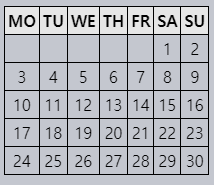

문서 수정하기
============

##### DOM 조작
- '생동감 있는' 웹페이지 핵심

### 예제 : 메시지 보여주기
- `alert` 창보다 보기 좋은 메시지 창
  - HTML 사용해 생성
```html
<style>
.alert {
  padding: 15px;
  border: 1px solid #d6e9c6;
  border-radius: 4px;
  color: #3c763d;
  background-color: #dff0d8;
}
</style>

<div class="alert">
  <strong>안녕하세요!</strong> 중요 메시지를 확인하셨습니다.
</div>
```


- JS 사용해 메시지 창 생성 학습
- 스타일
  - HTML · 외부 CSS 파일 저장 가정

### 요소 생성하기

#### DOM 노드 생성 메서드 <sub>(2가지)</sub>

##### `document.createElement(tag)`
- 새 요소 노드 생성
- `tag`
  - 태그명
```javascript
let div = document.createElement('div');
```

##### `document.createTextNode(text)`
- 새 텍스트 노드 생성
- `text`
  - 문자열
```javascript
let textNode = document.createTextNode('안녕하세요.');
```

##### 개발 시 주요 생성 노드
- 메시지 들어간 요소 노드

#### 메시지 생성하기

##### 메시지 들어갈 `<div>` <sub>(요소)</sub> 생성 <sub>(3단계)</sub>
```javascript
// (1)
// <div> (요소) 생성
// - div (변수) 할당
let div = document.createElement('div');

// (2)
// 만든 요소 클래스 값
// - 'alert' 설정
div.className = "alert";

// (3)
// 내용 채워넣기
div.innerHTML = "<strong>안녕하세요!</strong> 중요 메시지를 확인하셨습니다.";
```

##### 요소 생성 후
- 아직 변수 <sub>(`div`)</sub> 상태
  - 페이지 표시 X

### 삽입 메서드

##### 생성한 요소 <sub>(`div`)</sub>
- `document` 내 어딘가 삽입 필요 <sub>(페이지 표시)</sub>
  - ex&#41; `<body>` <sub>(`document.body`)</sub>

##### `append` <sub>(노드 삽입 메서드)</sub>
- `document.body.append(div)`
- 다른 요소에도 호출 가능
  - ex&#41; `div.append(…)`
```html
<style>
.alert {
  padding: 15px;
  border: 1px solid #d6e9c6;
  border-radius: 4px;
  color: #3c763d;
  background-color: #dff0d8;
}
</style>

<script>
  let div = document.createElement('div');
  div.className = "alert";
  div.innerHTML = "<strong>안녕하세요!</strong> 중요 메시지를 확인하셨습니다.";

  // 요소 삽입
  document.body.append(div);
</script>
```

##### 노드 삽입 메서드
- `node.append(노드 · 문자열)`
  - `node` 끝에 삽입
- `node.prepend(노드 · 문자열)`
  - `node` 맨 앞에 삽입
- `node.before(노드 · 문자열)`
  - `node` 이전에 삽입
- `node.after(노드 · 문자열)`
  - `node` 다음에 삽입
- `node.replaceWith(노드 · 문자열)`
  - `node` 대체

##### 문자열 전달 시
- 텍스트 노드 생성
```html
<ol id="ol">
  <li>0</li>
  <li>1</li>
  <li>2</li>
</ol>

<script>
  // <ol> (요소) 앞
  // - 'before' (문자열) 삽입
  ol.before('before');

  // <ol> (요소) 뒤
  // - 'after' (문자열) 삽입
  ol.after('after');

  // <ol> (요소) 첫 항목
  // - liFirst (요소) 삽입
  let liFirst = document.createElement('li');
  liFirst.innerHTML = 'prepend';
  ol.prepend(liFirst);

  // <ol> (요소) 마지막 항목
  // - liLast (요소) 삽입
  let liLast = document.createElement('li');
  liLast.innerHTML = 'append';
  ol.append(liLast);
</script>

↓↓↓

```html
before
<ol id="ol">
  <li>prepend</li>
  <li>0</li>
  <li>1</li>
  <li>2</li>
  <li>append</li>
</ol>
after
```


##### 여러 노드 · 문자열 삽입
```html
<div id="div"></div>

<script>
  div.before('<p>안녕하세요</p>', document.createElement('hr'));
</script>

↓↓↓

&lt;p&gt;안녕하세요&lt;/p&gt;
<hr>
<div id="div"></div>
```

##### 문자열 인수 <sub>(텍스트 노드)</sub>
- 특수문자 <sub>(`<` · `>` 등)</sub>
  - 이스케이프 처리

##### 문자열 : 안전한 방법으로 삽입
- `textContent` <sub>(프로퍼티)</sub> 사용 동일

### `insertAdjacentHTML` · `Text` · `Element`
- 다재다능한 메서드 

#### `elem.insertAdjacentHTML(where, html)`
- 'HTML 그 자체' <sub>(문자열 형태)</sub> 삽입
  - 태그 정상 동작
  - `innerHTML` 사용 동일

##### `where` <sub>(`elem` 기준 상대 위치)</sub>
- `'beforebegin'`
  - `elem` 바로 앞
- `'afterbegin`'
  - `elem` 1번째 자식 요소 바로 앞
- `'beforeend'`
  - `elem` 마지막 자식 요소 바로 다음
- `'afterend'`
  - `elem` 바로 다음

##### `html`
- HTML 문자열
- 이스케이프 처리 X
  - '그대로' 삽입
```html
<div id="div"></div>
<script>
  div.insertAdjacentHTML('beforebegin', '<p>안녕하세요.</p>');
  div.insertAdjacentHTML('afterend', '<p>안녕히 가세요.</p>');
</script>

↓↓↓

<p>안녕하세요.</p>
<div id="div"></div>
<p>안녕히 가세요.</p>
```


#### 두 가지 형제 메서드
- 메서드 구색 갖추기 목적
- 드물게 사용

##### `elem.insertAdjacentText(where, text)`
- 문법 동일
- `text`
  - '문자 그대로' 삽입

##### `elem.insertAdjacentElement(where, elem)`
- 문법 동일
- `elem` <sub>(요소)</sub> 삽입

새롭게 배운 메서드 `insertAdjacentHTML`를 사용해 메시지 창 예시를 다시 작성하면 다음과 같습니다.

```html
<style>
.alert {
  padding: 15px;
  border: 1px solid #d6e9c6;
  border-radius: 4px;
  color: #3c763d;
  background-color: #dff0d8;
}
</style>

<script>
  document.body.insertAdjacentHTML("afterbegin", `<div class="alert">
    <strong>안녕하세요!</strong> 중요 메시지를 확인하셨습니다.
  </div>`);
</script>
```

### 노드 삭제하기
- `node.remove()` <sub>(메서드)</sub>

##### 1초 후 메시지 사라짐
```html
<style>
.alert {
  padding: 15px;
  border: 1px solid #d6e9c6;
  border-radius: 4px;
  color: #3c763d;
  background-color: #dff0d8;
}
</style>

<script>
  let div = document.createElement('div');
  div.className = "alert";
  div.innerHTML = "<strong>안녕하세요!</strong> 중요 메시지를 확인하셨습니다.";

  document.body.append(div);
  setTimeout(() => div.remove(), 1000);
</script>
```

##### 참고 : 노드 삽입 메서드
- 요소 노드 이동 시
  - 기존 노드
    - 수동 삭제 필요 X
    - 자동 삭제
```html
<div id="first">First</div>
<div id="second">Second</div>
<script>
  // remove (메서드) 호출 필요 X
  // id가 second인 노드를 가져오고, 해당 노드의 뒤에 id가 first인 노드를 삽입
  second.after(first);
</script>
```

### `cloneNode`<sub>(노드 복제)</sub>

##### `elem.cloneNode(true)`
- `elem` '깊은' 복제본 생성
  - 속성 · 자손 요소 전부 복사

##### `elem.cloneNode(false)`
- `elem` 만 복제
  - 자손 노드 복사 X
```html
<style>
.alert {
  padding: 15px;
  border: 1px solid #d6e9c6;
  border-radius: 4px;
  color: #3c763d;
  background-color: #dff0d8;
}
</style>

<div class="alert" id="div">
  <strong>안녕하세요!</strong> 중요 메시지를 확인하셨습니다.
</div>

<script>
  // 메시지 창 복제
  let div2 = div.cloneNode(true);

  // 복제한 메시지 창 내용 수정
  div2.querySelector('strong').innerHTML = '안녕히 가세요!';

  // 복제한 메시지 창
  // - 기존 메시지 창 다음 표시
  div.after(div2);
</script>
```

### `DocumentFragment`

##### 래퍼 역할
- 그룹 <sub>(여러 노드 구성)</sub> 감싸 다른 곳 전달
- 문서 상 다른 노드 추가 가능
- 삽입 시
  - 본체 사라짐
  - 내부 추가 노드만 남음

##### `getListContent` <sub>(함수)</sub>
- fragment 생성
  - `<li>` <sub>(노드)</sub> 구성
```html
<ul id="ul"></ul>

<script>
function getListContent() {
  let fragment = new DocumentFragment();

  for(let i=1; i<=3; i++) {
    let li = document.createElement('li');
    li.append(i);
    fragment.append(li);
  }

  return fragment;
}

ul.append(getListContent()); // (*)
</script>

↓↓↓

<ul>
  <li>1</li>
  <li>2</li>
  <li>3</li>
</ul>
```

##### 직접 사용 흔치 않음
- 더 쉬운 방법 존재 <sub>(배열 등)</sub>
```html
<ul id="ul"></ul>

<script>
function getListContent() {
  let result = [];

  for(let i=1; i<=3; i++) {
    let li = document.createElement('li');
    li.append(i);
    result.push(li);
  }

  return result;
}

ul.append(...getListContent());
</script>
```

### 구식 삽입 · 삭제 메서드

 **오래된 문법**

- 오래된 스크립트 이해에 필요

<br />

- 하위 호환성 위해 존재

##### `p.appendChild(node)`
- `p` 마지막 자식으로 추가
```html
<ol id="list">
  <li>0</li>
  <li>1</li>
  <li>2</li>
</ol>

<script>
  let newLi = document.createElement('li');
  newLi.innerHTML = 'Hello, world!';

  list.appendChild(newLi);
</script>
```

##### `p.insertBefore(node, nextSibling)`
- `p` 안 `nextSibling` 앞에 추가
```html
<ol id="list">
  <li>0</li>
  <li>1</li>
  <li>2</li>
</ol>
<script>
  let newLi = document.createElement('li');
  newLi.innerHTML = 'Hello, world!';

  list.insertBefore(newLi, list.children[1]);
</script>

↓↓↓

<ol id="list">
  <li>0</li>
  <li>Hello, world!'</li>
  <li>1</li>
  <li>2</li>
</ol>
```
- 첫 번째 항목으로 추가 시
  - `firstChild` <sub>(프로퍼티)</sub>
```javascript
list.insertBefore(newLi, list.firstChild);
```

##### `p.replaceChild(node, oldChild)`
- `p` 자식 노드 중 `oldChild` → `node` 교체

##### `p.removeChild(node)`
- `p` 자식 노드 증 `node` 삭제

```html
<ol id="list">
  <li>0</li>
  <li>1</li>
  <li>2</li>
</ol>

<script>
  let li = list.firstElementChild;
  list.removeChild(li);
</script>

↓↓↓

<ol id="list">
  <li>1</li>
  <li>2</li>
</ol>
```

##### 삽입 · 삭제한 노드 반환
- 반환 값
  - 사용할 일 거의 없음

### `document.write` 첨언
- 아주 오래된 메서드
- 웹페이지에 뭔가 더함
```html
<p>페이지 어딘가...</p>
<script>
  document.write('<b>자바스크립트를 사용해 Hello 입력</b>');
</script>
<p>끝</p>
```

##### 페이지 '그 자리에 즉시' 추가
- HTML 형식 문자열 동적 작업 가능

##### 페이지 불러오는 도중에만 작동
- 페이지 로드 완료 후 호출 시
  - 기존 문서 내용 사라짐
```html
<p>일 초 후, 이 페이지의 내용은 전부 교체됩니다.</p>
<script>
  // 1초 후 document.write 호출
  // - 페이지 로드 끝난 후 호출 시
  //   - 기존 내용 사라짐
  setTimeout(() => document.write('<b>...사라졌습니다.</b>'), 1000);
</script>
```

##### DOM 조작 X <sub>(속도 아주 빠름)</sub>
- HTML '읽는 <sub>(파싱하는)</sub>' 도중 만나면
  - 마치 원래 페이지에 있었던 것처럼 HTML <sub>(텍스트 형식)</sub> 해석

##### 유용한 상황 <sub>(흔치 않은 상황)</sub>
1. 매우 많은 글자를 HTML에 동적 추가 +
2. 아직 페이지 불러오는 중 +
3. 속도 중요

##### 메서드 발견 시
- 오래된 스크립트일 확률 ↑

<br />

## 요약

#### 노드 생성 메서드:

##### `document.createElement(tag)`
- 새 요소 생성
  - `tag` <sub>(태그명)</sub>

##### `document.createTextNode(value)`
- 텍스트 노드 생성
  - 드물게 사용

##### `elem.cloneNode(deep)`
- 요소 복제
- `deep == true`
  - 모든 자손 요소 복제

##### 노드 삽입 · 삭제 메서드:
- `node.append(노드 · 문자열)`
  - `node` 끝에 삽입
- `node.prepend(노드 · 문자열)`
  - `node` 맨 앞에 삽입
- `node.before(노드 · 문자열)`
  - `node` 이전에 삽입
- `node.after(노드 · 문자열)`
  - `node` 다음에 삽입
- `node.replaceWith(노드 · 문자열)`
  - `node` 대체
- `node.remove()`
  - `node` 제거
- 문자열 삽입 · 삭제 시
  - 문자열 '그대로' 전달

##### '구식' 노드 삽입 · 삭제 메서드 <sub>(`node` 반환)</sub>
- `p.appendChild(node)`
- `p.insertBefore(node, nextSibling)`
- `p.removeChild(node)`
- `p.replaceChild(newElem, node)`

##### `elem.insertAdjacentHTML(where, html)`
- `where` <sub>(위치)</sub> 에 `html` <sub>(HTML)</sub> 삽입
- `"beforebegin"`
  - `elem` 바로 앞
- `"afterbegin"`
  - `elem` 1번째 자식 요소 바로 앞
- `"beforeend"`
  - `elem` 마지막 자식 요소 바로 다음
- `"afterend"`
  - `elem` 바로 다음

##### `elem.insertAdjacent[Text · Element]`
- 문자열 · 요소 삽입
- 드물게 사용

##### `document.write(html)`
- 페이지 로딩 끝나기 전 HTML 삽입
- 문서 로딩 끝난 후 호출 시
  - 문서 내용 지워짐
- 오래된 스크립트에서 볼 수 있음

<br />

###  과제

<hr />

### `createTextNode` vs `innerHTML` vs `textContent`
- `elem` <sub>(빈 DOM 요소)</sub>
- `text` <sub>(문자열)</sub>

##### 셋 중 같은 동작 수행 명령어
1. `elem.append(document.createTextNode(text))`
2. `elem.innerHTML = text`
3. `elem.textContent = text`

<br />


##### 정답 : 1 · 3
- `text` <sub>(문자열)</sub>
  - '텍스트 형태'로 추가
```html
<div id="elem1"></div>
<div id="elem2"></div>
<div id="elem3"></div>
<script>
  let text = '<b>text</b>';

  elem1.append(document.createTextNode(text));
  elem2.innerHTML = text;
  elem3.textContent = text;
</script>

↓↓↓

<div id="elem1"></div>
<div id="elem2"><b>text</b></div>
<div id="elem3"></div>
```

<hr />

### 요소 삭제하기

##### `clear(elem)` <sub>(함수)</sub> 만들기
- 요소 내 모든 하위 요소 삭제
```html
<ol id="elem">
  <li>Hello</li>
  <li>World</li>
</ol>

<script>
  function clear(elem) { /* 함수 코드 */ }

  // elem (요소) 내부 리스트 삭제
  clear(elem);
</script>
```

<br />


##### `remove()` <sub>(잘못된 방법)</sub>
- `elem.childNodes` <sub>(컬렉션)</sub> 변화
  - 반복문 : 매번 `0` 번째 인덱스 시작 필요
    - `for…of` <sub>(반복문)</sub> 동일
- `i` <sub>(인덱스)</sub> 계속 증가
  - 일부 원소 지나침
```javascript
function clear(elem) {
  for (let i=0; i < elem.childNodes.length; i++) {
      elem.childNodes[i].remove();
  }
}
```

##### 올바른 방법
```javascript
function clear(elem) {
  while (elem.firstChild) {
    elem.firstChild.remove();
  }
}
```
- 더 간단한 방법
```javascript
function clear(elem) {
  elem.innerHTML = '';
}
```

<hr />

### 왜 'aaa' 가 남아 있을까요

##### `table.remove()` 호출 후
- `'aaa'` <sub>(텍스트)</sub>
  - 여전히 존재
```html
<table id="table">
  aaa
  <tr>
    <td>Test</td>
  </tr>
</table>

<script>
  // table
  // - 삭제할 표 id (속성)
  alert(table);

  table.remove();

  // 문서 안
  // - 'aaa' 여전히 존재
</script>
```

<br />


##### 잘못된 HTML
- 자동 교정 발생 <sub>(브라우저)</sub>
  - `'aaa'` : `<table>`<sub>(태그)</sub> 앞으로 이동

##### 명세서
- `<table>` <sub>(태그)</sub> 안
  - 표 관련 특정 태그만 존재
  - 텍스트 X

##### DOM 탐색 <sub>(브라우저 도구)</sub>
- 자동 교정 적용 결과 확인

##### HTML 표준
- 잘못된 HTML 수정 방법
  - 구체적으로 기술

<hr />

### 리스트 생성하기

##### 인터페이스 작성
- 사용자 입력값 받아 리스트 생성

##### 리스트 요소 생성 방법
1. 사용자 입력 <sub>(리스트 내용)</sub> 받기
    - `prompt`
2. 입력받은 내용 갖는 `<li>` <sub>(요소)</sub> 생성 후
    - `<ul>` <sub>(요소)</sub> 에 추가
3. 사용자가 입력 취소할 때까지 계속 진행
    - ESC 키 · 취소 버튼 <sub>(프롬프트 창)</sub>
- 모든 요소
  - 동적 생성
- 사용자 HTML 태그 입력
  - 텍스트 처리

[데모](https://ko.js.cx/task/create-list/solution/)

<br />


##### `textContent` <sub>(프로퍼티)</sub> 사용법 참고
[정답 확인](https://plnkr.co/edit/bmDA88Onms5B8lDv?p=preview)

<hr />

### 객체로부터 트리 생성하기

##### `createTree` <sub>(함수)</sub> 만들기
- 중첩 객체 → `<ul>` · `<li>` <sub>(요소)</sub> 리스트
```javascript
let data = {
  "Fish": {
    "trout": {},
    "salmon": {}
  },

  "Tree": {
    "Huge": {
      "sequoia": {},
      "oak": {}
    },
    "Flowering": {
      "apple tree": {},
      "magnolia": {}
    }
  }
};
```

##### 코드 형식
```javascript
let container = document.getElementById('container');

// container (요소) 내 트리 생성
createTree(container, data);
```

##### 결과물 <sub>(트리)</sub>


##### 두 방법 중 하나 선택
1. 전체 트리 생성 후
    - `container.innerHTML` <sub>(컨테이너에 추가)</sub>
2. 노드 각각 생성 후
    - DOM 메서드 사용 <sub>(컨테이너에 추가)</sub>
- '불필요한' 요소 존재 X
  - ex&#41; `<ul></ul>` <sub>(내용 없는 태그)</sub> 등

<br />


##### 재귀
- 객체 순회하는 가장 쉬운 방법

1. [innerHTML 사용 풀이](https://plnkr.co/edit/uzYDJhClECPCrjqo?p=preview)
2. [DOM 사용 풀이](https://plnkr.co/edit/zO8vT3dGOJCsgxuz?p=preview)

<hr />

### 트리의 자손 수 나타내기

##### 중첩 `<ul>` · `<li>` <sub>(요소)</sub> 트리
- `<li>` <sub>(요소)</sub> 자손 요소 수 표시
  - 자식 없는 노드 생략

##### 결과물


<br />


##### 각 `<li>` 텍스트 추가
- `data` <sub>(텍스트 노드 프로퍼티)</sub> 변경

[정답](https://plnkr.co/edit/avz8NRsacBbhZIiR?p=preview)

<hr />

### 달력 만들기

##### `createCalender(elem, year, month)` <sub>(함수)</sub> 작성
- 주어진 연도 · 월 달력 생성 후
  - `elem` 안에 추가

##### 조건
- 주
  - `<tr>` <sub>(요소)</sub>
- 날짜
  - `<td>` <sub>(요소)</sub>
- 표 최상단
  - 요일 <sub>(월 ~ 일)</sub>
  - `<th>` <sub>(요소)</sub>

##### ex&#41; `createCalender(cal, 2012, 9)`



<br />


##### `innerHTML` 방식
- 표 생성
  - 문자열 형태 <sub>(`"<table>…</table>"`)</sub>

#### 순서

##### 1. 표 헤더 생성 · 요일 입력
- `<th>`

##### 2. 날짜 객체 생성
- `d = new Date(year, month - 1)`
  - 월 <sub>(`month - 1`)</sub> 1번째 날
- JS 월
  - `0` ~ `11`

##### 3. 1번째 열 빈칸
- 1번째 칸 날 ~ 각 달 1번째 날 <sub>(`d.getDay()`)</sub> 이전
  - `<td></td>`

##### 4. `d` <sub>(객체)</sub> 날짜 증가
- `d.setDate(d.getDate() + 1)`
- 다음 달 전까지 새 칸 <sub>(`<td>`)</sub> 추가
  - 다음 달 <sub>(`d.getMonth()`)</sub> 전까지
- 일요일 : 다음 주로 넘어가기
  - `"</tr><tr>"`

##### 5. 마지막 행 빈 공간이 존재 시
- 빈칸 채우기 <sub>(사각형 형태)</sub>
  - `<td></td>`

[정답](https://plnkr.co/edit/mY8MUTL7KtJo5TuN?p=preview)

<hr />

### `setInterval` 사용한 알록달록한 시계
- 알록달록한 시계 만들기


##### JS
- 요소 내부 시간 업데이트할 때만

##### HTML · CSS
- 스타일 꾸미기

<br />


##### 1. HTML · CSS
- 시 · 분 · 초 <sub>(시간 구성)</sub>
  - `<span>` <sub>(태그)</sub>
- 색 입히기
```html
<div id="clock">
  <span class="hour">hh</span>:<span class="min">mm</span>:<span class="sec">ss</span>
</div>
```

##### 2. `update` <sub>(함수)</sub>
- 시각 갱신
- 매 초 호출
  - `setInterval` <sub>(함수)</sub>
```javascript
function update() {
  let clock = document.getElementById('clock');
  let date = new Date(); // 현재 날짜 · 시간
  let hours = date.getHours();
  if (hours < 10) hours = '0' + hours;
  clock.children[0].innerHTML = hours;

  let minutes = date.getMinutes();
  if (minutes < 10) minutes = '0' + minutes;
  clock.children[1].innerHTML = minutes;

  let seconds = date.getSeconds();
  if (seconds < 10) seconds = '0' + seconds;
  clock.children[2].innerHTML = seconds;
}
```

##### `setInterval` <sub>(함수)</sub>
- 지연 발생 가능
  - 신뢰성 ↓

##### 시계 관리 함수
```javascript
let timerId;

function clockStart() {
  timerId = setInterval(update, 1000);

  // `setInterval` 실행 전 시계 표시
  update();
}

function clockStop() {
  clearInterval(timerId);
  timerId = null;
}
```

[정답](https://plnkr.co/edit/l1pafBuHjny7dkzL?p=preview)

<hr />

### 리스트에 HTML 삽입하기

##### 두 `<li>` <sub>(요소)</sub> 사이 html 삽입
- `<li>2</li><li>3</li>`
```html
<ul id="ul">
  <li id="one">1</li>
  <li id="two">4</li>
</ul>
```

<br />


##### `insertAdjacentHTML` <sub>(메서드)</sub>
- 문서 어딘가에 HTML 추가
```javascript
one.insertAdjacentHTML('afterend', '<li>2</li><li>3</li>');
```

<hr />

### 표 정렬하기
- `'name'` <sub>(열)</sub> 기준 표 정렬
```html
<table>
<thead>
  <tr>
    <th>Name</th><th>Surname</th><th>Age</th>
  </tr>
</thead>
<tbody>
  <tr>
    <td>John</td><td>Smith</td><td>10</td>
  </tr>
  <tr>
    <td>Pete</td><td>Brown</td><td>15</td>
  </tr>
  <tr>
    <td>Ann</td><td>Lee</td><td>5</td>
  </tr>
  <tr>
    <td>…</td><td>…</td><td>…</td>
  </tr>
</tbody>
</table>
```

<br />


```javascript
// (1)
// `<tbody>` (요소) 내 모든 `<tr>` (요소) 불러오기
let sortedRows = Array.from(table.tBodies[0].rows)

  // (2)
  // 1번째 `<td>` <sub>(`name` 필드)</sub> 내용 기준 정렬
  .sort((rowA, rowB) => rowA.cells[0].innerHTML.localeCompare(rowB.cells[0].innerHTML));

// (3)
// 정렬된 노드 삽입
table.tBodies[0].append(...sortedRows);
```

##### 행 해당 요소들 지울 필요 X
- '재삽입'
  - 기존 위치 저절로 벗어남

##### 표 내 명시적 `<tbody>` <sub>(요소)</sub> 없어도
- DOM 구조 상 항상 존재

[정답](https://plnkr.co/edit/fTJ5OR6dti9679X9?p=preview)
