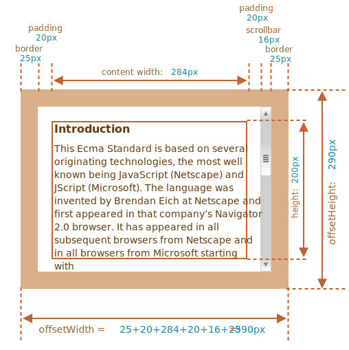
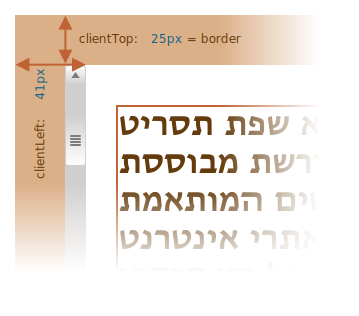
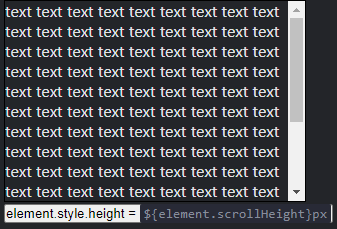
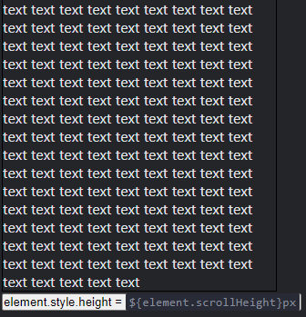
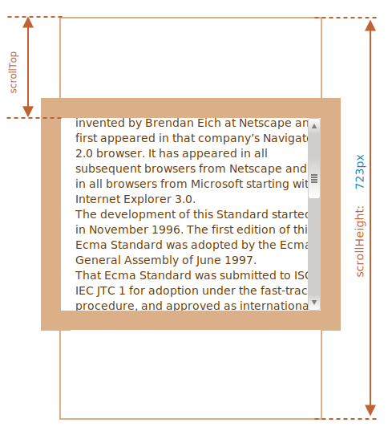
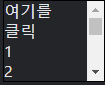
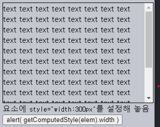
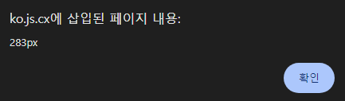
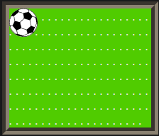
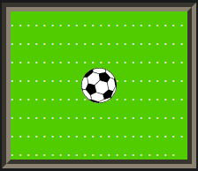

요소 크기 · 스크롤
====

##### 요소 기하 정보 관련 프로퍼티 <sub>(너비 · 높이 등)</sub>
- 요소 이동 · 특정 좌표 위치 시 사용

### 샘플 요소
```html
<div id="example">
  …텍스트…
</div>

<style>
  #example {
    width: 300px;
    height: 200px;
    border: 25px solid #E8C48F;
    padding: 20px;
    overflow: auto; /* 스크롤바 설정 */

    /*
     margin (여백)
     - 요소 자체 내 포함 X
     - 관련 특수 JS 프로퍼티 無
     */
    /* margin: …; */
  }
</style>
```

##### [요소 생김새](https://plnkr.co/edit/sSVXtcaSEX2qGs6h?p=preview)


<br />

 **스크롤바 항상 주의**

##### 일부 브라우저
- 콘텐츠 영역 너비 <sub>('content width')</sub> 일부
  - 스크롤바 차지

##### 샙플 예시
- 콘텐츠 영역 너비
  - `300px` <sub>(스크롤바 無)</sub>
  - `284px` <sub>(스크롤바 有)</sub>
- 스크롤바 너비
  - `16px` <sub>(브라우저 · 디바이스별 상이)</sub>

##### 요소 작업
- 스크롤바 영역 항상 주의

<br />

 **`padding-bottom` 텍스트 넘침 주의**

##### 요소 내 매우 긴 텍스트 <sub>(요소 크기 초과)</sub>
- `padding-bottom` 영역 내 표시 <sub>(정상 동작)</sub>

<br />

### 기하 프로퍼티


- `offset[Left·Top]`
- `client[Left·Top]`
- `offset[width·height]`
- `client[width·height]`
- `scroll[Left·Top]`
- `scroll[Width·Height]`

##### 기하 프로퍼티 값
- 숫자 <sub>(픽셀)</sub>

### `offset[Parent·Left·Top]`
- 가장 외부 위치
- 드물게 사용

##### offset
- 요소 화면 차지 영역 전체 크기 <sub>(총합)</sub>
  - 요소 너비 · 높이
  - 패딩 <sub>(마진 X)</sub>
  - 테두리 <sub>(`border` CSS 프로퍼티)</sub>
  - 스크롤바

#### `offsetParent`
- 최근접 조상 요소 참조
  - 요소 렌더링 시 좌표 계산 내 사용

##### 최근접 조상 요소 `position` <sub>(CSS 프로퍼티)</sub> 유무 여부
- 有 <sub>(아무 요소 · `static` 외 값)</sub>
  - `absolute`
  - `relative`
  - `fixed`
  - `sticky`
- 無
  1. `<td>` · `<th>` · `<table>` <sub>(요소)</sub>
  2. `<body>` <sub>(요소)</sub>

##### `offset[Left·Top]`
- 우측 · 하단 거리
  - `offsetParent` 기준

##### 내부 `<div>` <sub>(요소)</sub>
- `offsetParent`
  - `<main>` <sub>(요소)</sub>
- `offset[Left·Top]`
  - `180` <sub>(`left: 180px; top: 180px`)</sub>
```html
<main style="position: relative" id="main">
  <article>
    <div id="div" style="position: absolute; left: 180px; top: 180px">…</div>
  </article>
</main>

<script>
  // main
  alert(div.offsetParent.id);

  // 180   (숫자)
  // 180px (문자열) X
  alert(div.offsetLeft);

  // 180   (숫자)
  // 180px (문자열) X
  alert(div.offsetTop);
</script>
```


##### `offsetParent == null` 경우 <sub>(특정 요소)</sub>
1. 화면 내 미표시
    - `display: none` <sub>(CSS 프로퍼티)</sub>
    - 문서 내 부재
2. `<body>` · `<html>`
3. `position: fixed` <sub>(CSS 프로퍼티)</sub>

### `offset[Width·Height]`

##### 요소 가장 외부 부분 너비 · 높이
- 요소 전체 크기 <sub>(테두리 포함)</sub>



#### 샘플 요소

##### `offsetWidth == 390` <sub>(외부 너비)</sub>
- `25px * 2` <sub>(테두리)</sub>
- `20px * 2` <sub>(패딩)</sub>
- `300px` <sub>(`width` CSS 프로퍼티)</sub>
  - `284px` <sub>(콘텐츠 너비)</sub>
  - `16px` <sub>(스크롤바 너비)</sub>

##### `offsetHeight == 290` <sub>(외부 높이)</sub>
- `25px * 2` <sub>(테두리)</sub>
- `20px * 2` <sub>(패딩)</sub>
- `200px` <sub>(`height` CSS 프로퍼티)</sub>

<br />

 **화면 미표시 요소 기하 프로퍼티 <sub>(`0` · `null`)</sub>**

##### 기하 프로퍼티 값 계산 대상
- 문서 내 표시 요소

#### 미표시 요소

##### 종류
1. `display: none` <sub>(CSS 프로퍼티 · 조상 포함)</sub>
2. 문서 내 부재
    - ex\) 생성 후 문서 삽입 전

##### 기하 프로퍼티 값
- `offsetParent == null`
- `offset[Left·Top] == 0`

##### `isHidden` <sub>(커스텀 함수)</sub>
- 요소 숨김 상태 여부 확인
- 문서 내 존재 · 비어있는 요소 <sub>(크기 : 0)</sub>
  - `true` 반환 <sub>(주의)</sub>
```javascript
function isHidden(elem) {
  return !elem.offsetWidth && !elem.offsetHeight;
}
```

<br />

### `client[Top·Left]`

#### 테두리 두께 측정 가능

##### 테두리 <sub>(`border` CSS 프로퍼티)</sub>
- 요소 내 위치

##### 테두리 두께 · 프로퍼티 값 보통 일치
- 좌측 테두리 너비 == `clientLeft`
- 상단 테두리 높이 == `clientTop`

##### 샘플 예시 테두리 두께
- 좌측 테두리 너비
  - `25` <sub>(`clientLeft`)</sub>
- 상단 테두리 높이
  - `25` <sub>(`clientTop`)</sub>


#### 정확한 일치 X <sub>(테두리 두께 · 프로퍼티 값)</sub>

##### 프로퍼티 본래 의미
- 테두리 내 상대 좌표
  - 테두리 외부 기준

##### 좌측 진행 <sub>(←)</sub> 언어 <sub>(아랍어 · 히브리어 등)</sub>
- 스크롤바 좌측 생성
- `clientLeft == 41` <sub>(≠ 좌측 테두리 너비)</sub>
  - 좌측 테두리 너비 <sub>(`25`)</sub>
  - 스크롤바 너비 <sub>(`16`)</sub>


##### 히브리어 예시



### `client[Width·Height]`

##### 테두리 <sub>(`border` CSS 프로퍼티)</sub> 내 영역 전체 크기
- 패딩 <sub>(상 · 하 · 좌 · 우)</sub>
- 콘텐츠 너비 · 높이 <sub>(스크롤바 너비 X)</sub>


#### 샘플 요소

##### `clientWidth == 324`
- `20px * 2` <sub>(좌 · 우 패딩)</sub>
- `284px` <sub>(콘텐츠 너비)</sub>
  - `300px` <sub>(너비)</sub> - `16px` <sub>(스크롤바 너비)</sub>

##### `clientHeight == 240`
- `20px * 2` <sub>(상 · 하 패딩)</sub>
- `200px` <sub>(높이)</sub>

##### 패딩 부재 시 두 영역 정확히 일치
- `client[Width·Height]`
- 콘텐츠 너비 · 높이 <sub>(테두리 · 스크롤바 내부)</sub>


### `scroll[Width·Height]`
- `client[Width·Height]` 유사
- 스크롤바 의해 가려진 영역 포함


#### 샘플 요소

##### `scrollWidth == 324`
- 콘텐츠 영역 내부 전체 너비
  - `324px` <sub>(`clientWidth`)</sub>

##### `scrollHeight == 723`
- 콘텐츠 영역 내부 전체 높이
  - `240px` <sub>(`clientHeight`)</sub>
  - `483px` <sub>(세로 스크롤바 의해 가려진 부분)</sub>

##### 콘텐츠 영역만큼 요소 크기 늘리기
```javascript
// 콘텐츠 높이만큼 요소 높이 늘리기
element.style.height = `${element.scrollHeight}px`;
```



↓↓↓



### `scroll[Left·Top]`

#### 스크롤 이동 시 가려진 영역 <sub>(좌측 · 상단)</sub> 너비 · 높이

##### `scrollLeft`
- 가로 스크롤 우측 이동 시
  - 가려진 좌측 콘텐츠 너비

##### `scrollTop`
- 세로 스크롤 하단 이동 시
  - 가려진 상단 콘텐츠 높이

##### `scrollHeight` 내 `scrollTop` 영역
- ex\) 세로 스크롤바 하단 약간 이동



<br />

 **값 수정 가능**

##### 대다수 기하 프로퍼티
- 읽기 전용

##### `scroll[Left·Top]`
- 값 수정 가능
  - 요소 내 스크롤 자동 이동
- 스크롤바 최상단 · 최하단 이동 필요 시
  - `scrollTop` 큰 숫자 할당
    - `0` <sub>(최상단)</sub>
    - `1e9` <sub>(최하단)</sub>
    - 기타 등등

##### 요소 클릭 시 스크롤바 `10px` 하단 이동
- `elem.scrollTop += 10`



<br />

### 요소 너비 · 높이 얻기 <sub>(CSS 지양)</sub>

##### `width` · `height` <sub>(CSS 프로퍼티)</sub> 고유 특성 有
- `getComputedStyle` <sub>(메서드)</sub> 지양
- 기하 프로퍼티 사용

#### 1. 타 CSS 프로퍼티 영향

##### ex\) `box-sizing` <sub>(CSS 프로퍼티)</sub>
- 요소 너비 · 높이 계산 방법 '지정'
- 값 변경 시
  - `getComputedStyle` <sub>(메서드)</sub> 값 부정확

#### 2. `auto` 값

##### ex\) 인라인 요소
- CSS 정상 동작
- JS 문제 발생
  - 정확한 `px` 값 필요
  - 문자열 <sub>(`auto`)</sub> 사용 불가능
```html
// 인라인 요소
<span id="elem">안녕하세요!</span>

<script>
  // auto
  alert( getComputedStyle(elem).width );
</script>
```

#### 3. 스크롤바

##### 콘텐츠 영역 일부 차지 <sub>(일부 브라우저)</sub>
- 실제 콘텐츠 영역 너비 \< CSS 너비 <sub>(`width`)</sub>
- CSS 너비 <sub>(`width` CSS 프로퍼티)</sub>
  - 스크롤바 너비 고려 X <sub>(비정상 동작 가능)</sub>
- `client[Width·Height]`
  - 실제 콘텐츠 영역 너비 계산

##### ex\) `getComputedStyle(elem).width`
- 몇몇 브라우저 <sub>(Chrome 등)</sub>
  - 실제 내부 너비 반환 <sub>(스크롤바 너비 제외)</sub>
- 일부 브라우저 <sub>(Firefox 등)</sub>
  - CSS 설정 너비 반환 <sub>(스크롤바 무시)</sub>

##### 대다수 Windows 설치 브라우저
- 스크롤바 영역 인식
  - 실제 영역 <sub>(`283px`)</sub>





##### Windows 외 OS 설치 브라우저 <sub>(Firefox 등)</sub>
- 스크롤바 영역 무시
  - CSS 설정 너비 <sub>(`300px`)</sub>

##### `getComputedStyle` vs 기하 프로퍼티
- `getComputedStyle(…).width` 만 문제
  - 스크롤바

<br />

요약
====

#### 요소 기하 프로퍼티

##### `offsetParent` <sub>(3가지 중 하나)</sub>
1. 최근접 조상 요소 <sub>(위치 계산 시 사용)</sub>
    - `position` <sub>(CSS 프로퍼티)</sub>
      - `absolute`
      - `relative`
      - `fixed`
      - `sticky`
2. `td` · `th` · `table` <sub>(요소)</sub>
3. `body` <sub>(요소)</sub>

##### `offset[Left·Top]`
- 요소 : 우측 · 하단으로 떨어진 거리
  - `offsetParent` 기준

##### `offset[Width·Height]`
- 요소 전체 너비 · 높이
  - 테두리 <sub>(`border`)</sub> 포함

##### `client[Left·Top]`
- 두 영역 사이 거리
  - 요소 제일 밖 영역
  - 요소 내 <sub>(콘텐츠 + 패딩)</sub> 영역
- 대다수 경우
  - 좌측 · 상단 테두리 두께와 일치
- 일부 언어 <sub>(좌 ← 우)</sub>
  - `clientLeft`
    - 스크롤바 두께 포함

##### `client[Width·Height]`
- 콘텐츠 · 패딩 포함 영역 너비 · 높이
  - 스크롤바 제외

##### `scroll[Width·Height]`
- 콘텐츠 · 패딩 포함 영역 너비 · 높이
  - `client[Width·Height]` 유사
- 스크롤바 의해 숨겨진 콘텐츠 영역 포함

##### `scroll[Left·Top]`
- 스크롤바 이동 따라 가려진 영역 너비 · 높이
  - 요소 콘텐츠

##### 모든 프로퍼티 <sub>(`scroll[Left·Top]` 제외)</sub>
- 읽기 전용

### 미니 요약


##### `offset[Left·Top]`
- 기준 ~ 테두리 <sub>(`border`)</sub>

##### `client[Left·Top]`
- 테두리 외부 ~ 콘텐츠 <sub>(패딩 포함)</sub>

##### `offset[width·height]`
- 마진 <sub>(`margin`)</sub> X
- 테두리
- 패딩
- 콘텐츠
  - 스크롤바 포함

##### `client[width·height]`
- 패딩
- 콘텐츠
  - 스크롤바 X

##### `scroll[Left·Top]`
- 스크롤 이동 따라 가려진 영역 너비 · 높이
- `offset[Left·Top]` ~ 콘텐츠 <sub>(테두리 X)</sub>

##### `scroll[Width·Height]` <sub>(`client[width·height]` 유사)</sub>
- 패딩
- 콘텐츠
  - 스크롤바 X
- 스크롤바 의해 가려진 영역

<br />

##  과제

### `scrollBottom`

##### `scrollTop`
- 세로 스크롤 하단 이동 시
  - 가려진 상단 콘텐츠 높이

##### 가려진 하단 콘텐츠 높이 <sub>(`scrollTop` 반대편)</sub> 구하기
- `scrollBottom` <sub>(변수)</sub>
- 임의 요소 대상 정상 동작

##### 참고
- 스크롤 유무 여부 확인
- 스크롤 최하단 도달 시 값
  - `0`

<br />


```javascript
// 스크롤 의해 가려진 바닥 높이
// = 최대 높이 - 스크롤 의해 가려진 상단 높이 - 보이는 요소 높이
let scrollBottom = elem.scrollHeight - elem.scrollTop - elem.clientHeight;
```

<hr />

### 스크롤바 너비 구하기
- 표준 스크롤바 너비

##### Windows <sub>(OS)</sub>
- `12px` ~ `20px`
- 반투명
- 스크롤바 미표시 시
  - `0px`

##### 참고
- 모든 HTML 문서 적용 가능
  - 콘텐츠 무관

<br />


##### 요소 생성
- 스크롤바 표시 설정
- 테두리 · 패딩 X

##### 스크롤바 너비
- `offsetWidth` - `clientWidth`
  - 요소 외부 너비 - 콘텐츠 너비
```javascript
// 요소 생성
// - 스크롤바 표시 설정
let div = document.createElement('div');
div.style.overflowY = 'scroll';
div.style.width = '50px';
div.style.height = '50px';

// 문서 내 요소 추가
// - 미추가 시 요소 크기 : 0
document.body.append(div);
let scrollWidth = div.offsetWidth - div.clientWidth;

div.remove();

alert(scrollWidth);
```

<hr />

### 정중앙에 공 위치시키기

##### 수정 전



##### 코드 작성
1. 좌표 구하기
2. 좌표 이용해 정중앙에 공 위치시키기



##### 조건
- JS 이용 <sub>(CSS 이용 X)</sub>
- 크기 관계 없이 작동
  - 공 크기 <sub>(`10px` · `20px` · `30px`)</sub>
  - 문서 크기

##### 참고
- 정중앙 위치시키기 작업
  - 기존
    - CSS 이용
  - 과제
    - JS 만 이용

<br />


##### 공 <sub>(요소)</sub> `position` <sub>(CSS 프로퍼티)</sub> 값
- `position: absolute`

##### `left` · `top` <sub>(기하 프로퍼티)</sub> 측정 기준
- 최근접 조상 요소
  - 특정 `position` <sub>(CSS 프로퍼티)</sub> 값 보유
- `#field` <sub>(요소)</sub>
  - `position: relative`

##### 좌표 시작점
- 콘텐츠 영역 좌상단


##### 콘텐츠 영역 너비 · 높이
- `client[Width·Height]`

##### 콘텐츠 영역 정중앙 좌표
```javascript
(clientWidth / 2, clientHeight / 2)
```

##### `ball.style.[left·top]`
- 공 <sub>(요소)</sub> 좌상단 모서리 위치
- 좌표 정중앙 위치 시
  - 공 <sub>(요소)</sub> 자체 정중앙 X
  - 공 <sub>(요소)</sub> 좌상단 모서리 정중앙
    - 좌푯값 보정 필요
```javascript
ball.style.left = Math.round(field.clientWidth / 2) + 'px';
ball.style.top = Math.round(field.clientHeight / 2) + 'px';

```

##### 공 <sub>(요소)</sub> 자체 정중앙 위치시키기
- 공 <sub>(요소)</sub> 좌측 이동
  - 요소 너비 절반
- 공 <sub>(요소)</sub> 상단 이동
  - 요소 높이 절반
```javascript
ball.style.left = Math.round(field.clientWidth / 2 - ball.offsetWidth / 2) + 'px';
ball.style.top = Math.round(field.clientHeight / 2 - ball.offsetHeight / 2) + 'px';
```

<br />

 **주의**

##### `` <sub>(요소)</sub>
- `width` · `height` <sub>(프로퍼티)</sub> 부재 시
  - 비정상 작동
```html

```

<br />

##### `` <sub>(요소)</sub> 너비 · 높이 미설정 시
- `0` 자동 설정 <sub>(로딩 종료 전까지)</sub>
- `ball.offsetWidth` : `0`
  - 잘못된 좌표 설정됨
- 첫 로딩 완료 후
  - 이미지 캐싱 <sub>(다음 로딩 시 바로 값 설정)</sub>

##### 문제 해결
- 요소 너비 · 높이 설정
```html
<!-- 요소 속성 -->


<!-- CSS -->
<style>
#ball {
  width: 40px;
  height: 40px;
}
</style>
```

[정답](https://plnkr.co/edit/c90eAUpyikvBYKKj?p=preview)

<hr />

### `width` vs `clientWidth` <sub>(차이)</sub><br /><sub>(CSS 프로퍼티 vs 기하 프로퍼티)</sub>
- `getComputedStyle(elem).width`
- `elem.clientWidth`

<br />


##### ① 타입
- `getComputedStyle(elem).width`
  - 문자열 반환 <sub>(`'300px'`)</sub>
- `clientWidth`
  - `number` 반환 <sub>(`300`)</sub>

##### ② 非숫자
- `getComputedStyle` <sub>(메서드)</sub>
  - 非숫자 값 반환 가능
    - ex\) `"auto"` <sub>(인라인 요소 너비)</sub>

##### ③ 영역
- `width` <sub>(CSS 프로퍼티)</sub>
  - 콘텐츠 영역 <sub>(패딩 제외)</sub>
  - 표준 `box-sizing` 연관
- `clientWidth`
  - 콘텐츠 · 패딩 포함 영역

##### ④ 스크롤바 존재 시 포함 여부 <sub>(브라우저 별도 처리)</sub>
- `getComputedStyle(elem).width`
  - 브라우저 따라 상이
- `clientWidth`
  - 항상 제외 <sub>(브라우저 종류 무관)</sub>
