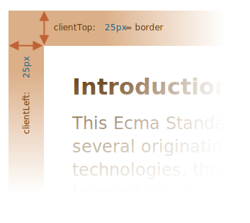

요소 사이즈와 스크롤
==================

##### 요소 기하 정보 관련 프로퍼티
- ex&#41;
  - 너비
  - 높이
  - 기타 등등
- 요소 이동 · 특정 좌표 위치 시 사용

### 샘플 요소
```html
<div id="example">
  …텍스트…
</div>
<style>
  #example {
    width: 300px;
    height: 200px;
    border: 25px solid #E8C48F;
    padding: 20px;
    overflow: auto; // 스크롤바

    // margin
    // - 요소 자체 포함 X
    // - 관련 특수 JS 프로퍼티 X
//  margin: …;
  }
</style>
```

##### [요소 생김새](https://plnkr.co/edit/sSVXtcaSEX2qGs6h?p=preview)


<br />

 **스크롤바 잊지 말기**

##### 스크롤바 위치 <sub>(몇몇 브라우저)</sub>
- 콘텐츠 영역 너비 일부 빌림
  - _'content width'_ 표시

##### 샙플 예시
- 스크롤바 부재 시
  - 콘텐츠 영역 너비 : `300px`
- 스크롤바 존재 시
  - 스크롤바 너비 : `16px`
    - 브라우저 · 디바이스마다 상이
  - 콘텐츠 영역 너비 : `284px`
- 요소 다룰 때
  - 스크롤바 차지 공간 주의하기

<br />

 **텍스트 넘침 주의 <sub>(`padding-bottom`)</sub>**

##### 요소 내 텍스트 길어 넘칠 시
- `padding-bottom` 영역에 표시
  - 정상적인 동작

<br />

### 기하 프로퍼티


##### 기하 프로퍼티 값
- 숫자
  - 단위 : 픽셀

### `offset[Parent·Left·Top]`
- 가장 바깥
- 드물게 사용

##### offset
- 요소 화면 차지 영역 전체 크기 <sub>(총합)</sub>
  - 요소 너비 · 높이
  - 패딩 <sub>(마진 X)</sub>
  - 스크롤바
  - 테두리

#### `offsetParent` <sub>(프로퍼티)</sub>
- 가장 가까운 조상 요소 참조
  - 요소 랜더링 시 좌표 계산에 사용됨

##### 촤근접 조상 요소 CSS `position` <sub>(프로퍼티)</sub> 유무 여부
- 존재 시
  - `absolute`
  - `relative`
  - `fixed`
  - `sticky`
- 부재 시
  - `<td>` · `<th>` · `<table>` <sub>(요소)</sub>
  - `<body>` <sub>(요소)</sub>

##### `offset[Left · Top]` <sub>(프로퍼티)</sub>
- 요소 : 우측 · 하단으로 떨어진 거리
  - `offsetParent` 기준

##### 안쪽 `<div>` <sub>(요소)</sub>
- `offsetParent`
  - `<main>`
- `offset[Left · Top]`
  - `180`
```html
<main style="position: relative" id="main">
  <article>
    <div id="example" style="position: absolute; left: 180px; top: 180px">…</div>
  </article>
</main>
<script>
  alert(example.offsetParent.id); // main

  // 반환 값
  // -  180    (숫자)
  // - '180px' (문자열) X
  alert(example.offsetLeft); // 180
  alert(example.offsetTop);  // 180
</script>
```


##### `offsetParent` == `null` 경우
1. 화면에 보이지 않는 요소
    - CSS `display` <sub>(프로퍼티)</sub> : `none`
    - 문서 내 없음
2. `<body>` · `<html>` <sub>(요소)</sub>
3. 요소 CSS `position` <sub>(프로퍼티)</sub>
    - `fixed`

### `offset[Width · Height]`

##### 요소 가장 바깥 부분 너비 · 높이
- 요소 전체 사이즈 <sub>(테두리 포함)</sub>


##### 샘플 요소
- `offsetWidth` : `390`
  - `300px` <sub>(바깥 너비 : `width` CSS 프로퍼티)</sub>
  - `2 * 20px` <sub>(패딩)</sub>
  - `2 * 25px` <sub>(테두리)</sub>
- `offsetHeight` : `290`
  - 바깥 높이

<br />

 **화면 미표시 요소 기하 프로퍼티 값 : `0` · `null`**

##### 기하 프로퍼티
- 보이는 요소 대상으로만 계산

#### 보이지 않는 요소
1. 요소 CSS `display` <sub>(프로퍼티)</sub>
    - `none`
2. 문서 내 해당 요소 X
- ex&#41;
  - 요소 생성 후 문서 삽입 전
  - 새 요소 `display` <sub>(프로퍼티)</sub> : `none`

##### 기하 프로퍼티 값
- `offsetParent`
  - `null`
- `offset[Left · Top]`
  - `0`

##### 요소 숨김 상태 여부 확인
```javascript
function isHidden(elem) {
  return !elem.offsetWidth && !elem.offsetHeight;
}
```

##### `isHidden` <sub>(프로퍼티)</sub> 주의점
- 화면 내 존재 · 사이즈 : 0 <sub>(빈 `<div>` 등)</sub>
  - `true` 반환

<br />

### `client[Top · Left]`
- 테두리 두께 측정
  - 요소 내 존재

##### 샘플 예시
- `clientLeft` : `25`
  - 좌측 테두리 너비
- `clientTop` : `25`
  - 상단 테두리 높이



##### 정확히는 테두리 안 상대 좌표 <sub>(테두리 바깥 기준)</sub>
- 테두리 높이 · 너비 정확히 일치 X

##### 좌측 진행 언어 <sub>(아랍어 · 히브리어)</sub>
- 스크롤바 좌측 생성
- `clientLeft` : `41` <sub>(`25` + `16`)</sub>
  - 스크롤바 너비 포함

##### 히브리어 예시


### `client[Width · Height]`
- 테두리 안 영역 사이즈
  - 콘텐츠 너비
  - 패딩
  - 스크롤바 너비 X


##### `clientHeight` : `240px`
- `200px` <sub>(높이)</sub> + `2 * 20px`<sub>(위 · 아래 패딩)</sub>
- 테두리 안 영역 전체 총합
  - 가로 스크롤바 X

##### `clientWidth` : `284px`
- 컨텐츠 너비
  - `300px` <sub>(너비)</sub> - `16px`<sub>(스크롤바 너비)</sub>
    - `284px`
- 차지하는 너비 `16px` 때문에 콘텐츠 너비는 `300px`이 아닌 `284px`이 된다는 점입니다. 따라서 `clientWidth`는 콘텐츠 너비 `284px`에 왼쪽, 오른쪽 패딩(`2 * 20px`)을 더한 값인 `324px`가 됩니다.

**패딩이 없었다면 `clientWidth`와 `clientHeight`는 테두리와 스크롤바 안쪽에 있는 콘텐츠 영역의 너비, 높이와 정확히 일치했을 겁니다.**


따라서 패딩이 없는 경우엔 `clientWidth`와 `clientHeight`를 사용해 콘텐츠 영역 크기를 구할 수 있습니다.

### `scrollWidth`와 `scrollHeight`
`scrollWidth`와 `scrollHeight` 프로퍼티는 `clientWidth`와 `clientHeight` 유사한데, 스크롤바에 의해 감춰진 영역도 포함한다는 점에서 차이가 있습니다.


그림을 살펴봅시다.
- `scrollWidth` = `324` – 수평 스크롤바가 없기 때문에 안쪽 영역 전체를 나타내는 `clientWidth`와 동일합니다.
- `scrollWidth` = `324` – 스크롤 때문에 가려진 영역을 포함한 콘텐츠 영역 높이 전체
- `scrollHeight` = `723` – 세로 스크롤바에 가려진 부분을 포함하는 콘텐츠 영역 안쪽 전체의 높이
- `scrollWidth` = `324` – 콘텐츠 영역 안쪽 전체의 너비. 그림은 가로 스크롤바가 없기 때문에 `clientWidth`와 동일합니다.

`scrollWidth`와 `scrollHeight`는 요소 크기를 콘텐츠가 차지하는 만큼 늘리고자 할 때 사용할 수 있습니다.

예시:
```javascript
// 콘텐츠가 차지하는 높이만큼 요소 높이를 늘림
element.style.height = `${element.scrollHeight}px`;
```

버튼을 눌러 직접 요소 크기를 확장해 봅시다.


↓↓↓


### `scrollLeft`와 `scrollTop`
`scrollLeft`와 `scrollTop`은 가로 스크롤이 오른쪽, 세로 스크롤이 아래로 움직임에 따라 가려진 영역의 너비와 높이를 나타냅니다.

세로 스크롤바를 아래로 조금 내린 경우를 가정한 그림을 예시로 들어봅시다. `scrollHeight`에서 `scrollTop`이 얼마만큼의 영역을 차지하는지를 살펴볼 수 있습니다.


이렇게 scrollTop은 ‘세로 스크롤바에 의해 가려져 보이지 않는’ 위쪽 콘텐츠의 높이가 됩니다.

<br />

 **`scrollLeft`와 `scrollTop`은 수정 가능합니다.**

기하 프로퍼티 대부분은 읽기전용이지만 `scrollLeft`와 `scrollTop`은 변경이 가능합니다. 스크립트로 프로퍼티를 수정하면 자동으로 요소 내 스크롤이 움직입니다.

요소를 클릭하면 스크롤바가 `10px` 아래로 내려가도록 `elem.scrollTop += 10`을 스크립트에 추가해 놓았습니다.


이런 특징을 이용하면 `scrollTop`을 `0`이나 `1e9`같은 아주 큰 숫자로 설정해 스크롤바를 최상단이나 최하단으로 옮길 수 있습니다.

<br />

### CSS를 사용해 너비와 높이를 얻지 마세요
지금까지 요소 너비와 높이, 요소 포지셔닝 관련 거리를 구하는 데 사용되는 기하 프로퍼티를 살펴보았습니다.

그런데 우리는 스타일과 클래스 챕터에서 `getComputedStyle`를 사용해 CSS가 적용된 요소의 높이와 너비를 구할 수 있다는 것을 알아본 바 있습니다.

그렇다면 왜 `getComputedStyle`를 사용해 요소 너비와 높이를 얻지 말라고 하는 걸까요?

```javascript
let elem = document.body;

alert( getComputedStyle(elem).width ); // CSS가 적용된 elem의 너비
```

`getComputedStyle`가 아닌 기하 프로퍼티를 사용해 너비와 높이 정보를 얻어야 하는 데는 다음과 같은 이유가 있습니다.

1. CSS `width`와 `height`는 다른 CSS 프로퍼티의 영향을 받습니다. 요소의 너비와 높이 계산 방법을 '지정’하는 `box-sizing`이 이런 프로퍼티의 대표적인 예이죠. `box-sizing`을 변경하면 `getComputedStyle`로 구한 값이 부정확 할 수 있습니다.
2. CSS `width`와 `height`는 `auto`일 수 있습니다. 인라인 요소(inline element)가 이런 경우에 속합니다.
```html
<span id="elem">안녕하세요!</span>

<script>
  alert( getComputedStyle(elem).width ); // auto
</script>
```
CSS 관점에서 보면 `width:auto`는 전혀 이상할 게 없어 보입니다. 그런데 자바스크립트 입장에선 정확한 `px`값이 있어야 계산을 할 수 있기 때문에 `auto`라는 값은 쓸모가 없습니다.

다른 한 가지 이유는 스크롤바때문입니다. 스크롤바가 없으면 정상 동작하는데, 스크롤바가 생기면 의도한 대로 동작하지 않는 코드가 있습니다. 이런 일은 스크롤바가 콘텐츠 영역을 차지하는 몇몇 브라우저에서 발생합니다. 이들 브라우저에선 콘텐츠가 실제 차지하는 영역이 CSS로 설정한 너비보다 좁은데, `clientWidth`와 `clientHeight`는 이를 고려해 클라이언트 요소가 차지하는 공간을 계산합니다.

그런데 `getComputedStyle(elem).width`를 사용하면 상황이 달라집니다. Chrome 같은 브라우저는 스크롤바 너비를 제외한 진짜 내부 너비를 반환하는데 Firefox 같은 브라우저는 스크롤바를 무시하고 CSS로 설정한 너비를 반환합니다. 이런 브라우저 간 차이 때문에 `getComputedStyle`이 아닌 기하 프로퍼티를 사용해야 합니다.

스크롤바가 차지하는 영역을 따로 두는 브라우저(Windows에서 돌아가는 대부분의 브라우저)에서 아래 예시를 실행하면 300px이 아닌 다른 값이 출력되는 것을 확인할 수 있습니다.


텍스트가 들어있는 위 요소의 CSS엔 `width:300px`가 설정되어 있는 상태입니다.

Windows가 설치된 데스크톱 PC의 Firefox, Chrome, Edge 브라우저는 모두 스크롤바 영역을 따로 떼어놓습니다. 그런데 Windows 이외의 OS가 설치된 PC의 Firefox에서 예시를 실행하면 `300px`이 출력되는 것을 확인할 수 있습니다. 다른 브라우저들은 ‘진짜’ 너비를 출력하는 반면 Firefox는 CSS로 설정한 너비를 출력하기 때문입니다.

`getComputedStyle`과 기하 프로퍼티의 차이는 자바스크립트를 사용해 `getComputedStyle(...).width`로 값을 얻고자 할 때만 발생합니다. 눈으로 봤을 땐 전혀 문제가 없으니 이 점에 유의하시기 바랍니다.

<br />

## 요약
요소는 다음과 같은 기하 프로퍼티를 지원합니다.

- `offsetParent` – 위치 계산에 사용되는 가장 가까운 조상 요소나 `td`, `th`, `table`, `body`
- `offsetLeft`와 `offsetTop` – `offsetParent` 기준으로 요소가 각각 오른쪽, 아래쪽으로 얼마나 떨어져 있는지를 나타내는 값
- `offsetWidth`와 `offsetHeight` – 테두리를 포함 요소 '전체’가 차지하는 너비와 높이
- `clientLeft`와 `clientTop` – 요소 제일 밖을 감싸는 영역과 요소 안(콘텐츠 + 패딩)을 감싸는 영역 사이의 거리를 나타냄. 대부분의 경우 왼쪽, 위쪽 테두리 두께와 일치하지만, 오른쪽에서 왼쪽으로 글을 쓰는 언어가 세팅된 OS에선 `clientLeft`에 스크롤바 두께가 포함됨
- `clientWidth`와 `clientHeight` – 콘텐츠와 패딩을 포함한 영역의 너비와 높이로, 스크롤바는 포함되지 않음
- `scrollWidth`와 `scrollHeight` – `clientWidth`, `clientHeight` 같이 콘텐츠와 패딩을 포함한 영역의 너비와 높이를 나타내는데, 스크롤바에 의해 숨겨진 콘텐츠 영역까지 포함됨
- `scrollLeft`와 `scrollTop` – 스크롤바가 오른쪽, 아래로 움직임에 따라 가려지게 되는 요소 콘텐츠의 너비와 높이

스크롤바를 움직일 수 있게 해주는 `scrollLeft`와 `scrollTop`을 제외한 모든 프로퍼티는 읽기 전용입니다.

<br />

###  과제

<hr />

### What's the scroll from the bottom?
중요도: 5
The `elem.scrollTop` property is the size of the scrolled out part from the top. How to get the size of the bottom scroll (let’s call it `scrollBottom`)?

Write the code that works for an arbitrary `elem`.

P.S. Please check your code: if there’s no scroll or the element is fully scrolled down, then it should return `0`.
content

<br />


The solution is:
```javascript
let scrollBottom = elem.scrollHeight - elem.scrollTop - elem.clientHeight;
```

In other words: (full height) minus (scrolled out top part) minus (visible part) – that’s exactly the scrolled out bottom part.

<hr />

### What is the scrollbar width?
Write the code that returns the width of a standard scrollbar.

For Windows it usually varies between `12px` and `20px`. If the browser doesn’t reserve any space for it (the scrollbar is half-translucent over the text, also happens), then it may be `0px`.

P.S. The code should work for any HTML document, do not depend on its content.

<br />


To get the scrollbar width, we can create an element with the scroll, but without borders and paddings.

Then the difference between its full width `offsetWidth` and the inner content area width `clientWidth` will be exactly the scrollbar:
```javascript
// create a div with the scroll
let div = document.createElement('div');

div.style.overflowY = 'scroll';
div.style.width = '50px';
div.style.height = '50px';

// must put it in the document, otherwise sizes will be 0
document.body.append(div);
let scrollWidth = div.offsetWidth - div.clientWidth;

div.remove();

alert(scrollWidth);
```

<hr />

### Place the ball in the field center
Here’s how the source document looks:


What are coordinates of the field center?

Calculate them and use to place the ball into the center of the green field:


- The element should be moved by JavaScript, not CSS.
- The code should work with any ball size (`10`, `20`, `30` pixels) and any field size, not be bound to the given values.

P.S. Sure, centering could be done with CSS, but here we want exactly JavaScript. Further we’ll meet other topics and more complex situations when JavaScript must be used. Here we do a “warm-up”.

<br />


The ball has `position:absolute`. It means that its `left`/`top` coordinates are measured from the nearest positioned element, that is `#field` (because it has `position:relative`).

The coordinates start from the inner left-upper corner of the field:


The inner field width/height is `clientWidth`/`clientHeight`. So the field center has coordinates (`clientWidth/2`, `clientHeight/2`).

…But if we set `ball.style.left/top` to such values, then not the ball as a whole, but the left-upper edge of the ball would be in the center:
```javascript
ball.style.left = Math.round(field.clientWidth / 2) + 'px';
ball.style.top = Math.round(field.clientHeight / 2) + 'px';

```
Here’s how it looks:


To align the ball center with the center of the field, we should move the ball to the half of its width to the left and to the half of its height to the top:
```javascript
ball.style.left = Math.round(field.clientWidth / 2 - ball.offsetWidth / 2) + 'px';
ball.style.top = Math.round(field.clientHeight / 2 - ball.offsetHeight / 2) + 'px';
```

Now the ball is finally centered.

 **Attention: the pitfall!**

The code won’t work reliably while `` has no width/height:
Attention: the pitfall!

```html

```

<br />

When the browser does not know the width/height of an image (from tag attributes or CSS), then it assumes them to equal `0` until the image finishes loading.

So the value of `ball.offsetWidth` will be `0` until the image loads. That leads to wrong coordinates in the code above.

After the first load, the browser usually caches the image, and on reloads it will have the size immediately. But on the first load the value of `ball.offsetWidth` is `0`.

We should fix that by adding `width`/`height` to ``:
```html

```
…Or provide the size in CSS:
```css
#ball {
  width: 40px;
  height: 40px;
}
```

[샌드박스를 열어 정답을 확인해보세요.](https://plnkr.co/edit/c90eAUpyikvBYKKj?p=preview)

<hr />

### CSS `width`와 `clientWidth`의 차이
`getComputedStyle(elem).width`와 `elem.clientWidth`의 차이점은 무엇일까요?

최소 세 가지 차이점을 설명해주세요. 더 많을수록 좋습니다.

<br />


둘의 차이점은 다음과 같습니다.

1. `clientWidth`는 숫자형을 반환하는 반면, `getComputedStyle(elem).width`는 끝에 `px`가 붙은 문자열을 반환합니다.
2. `getComputedStyle`은 인라인 요소의 너비를 구할 때 `"auto"`와 같은 숫자가 아닌 값을 반환할 수도 있습니다.
3. `clientWidth`는 콘텐츠와 패딩을 포함한 영역의 너비를 가르키지만, (표준 `box-sizing`과 연관된) CSS `width`는 패딩을 제외한 콘텐츠 영역의 너비를 가리킵니다.
4. 페이지에 스크롤바가 있고 브라우저가 스크롤바 영역을 따로 처리하는 경우에, 어떤 브라우저는 CSS width를 계산할 때 스크롤바 너비를 제외하는 반면(스크롤바 영역은 콘텐츠를 담을 수 없기 때문) 어떤 브라우저는 스크롤바 영역을 포함합니다. `clientWidth` 프로퍼티는 브라우저 종류에 상관 없이 항상 동일하게 스크롤바 영역이 있는 경우엔 스크롤바 너비를 제외합니다.
