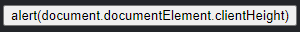
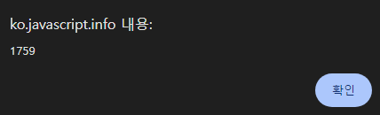
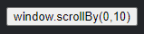
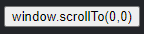
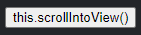
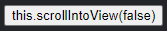
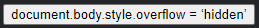
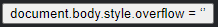

브라우저 창 크기 · 스크롤
====

##### `document.documentElement` <sub>(루트 문서 요소)</sub>
- `<html>` <sub>(태그)</sub> 상응
- 다양한 메서드 지원 <sub>(주의점 有)</sub>

### 브라우저 창 너비 · 높이

##### `document.documentElement.client[Width·Height]`
```javascript
document.documentElement.clientWidth
document.documentElement.clientHeight
```






<br />

 **`window` <sub>(전역 객체)</sub> 사용 지양**

##### `document.documentElement.client[Width·Height]`
- 스크롤바 너비 제외
  - 실제 콘텐츠 영역

##### `window.inner[Width·Height]`
- 스크롤바 영역 포함
```javascript
/* 전체 창 너비 */
// 스크롤바 너비 제외
document.documentElement.clientWidth;

// 스크롤바 너비 포함
window.innerWidth;
```

##### 창 크기 값 필요 작업
- 보통 스크롤바 내 그리기 · 위치 설정 등
  - 스크롤바 너비 제외 필요

<br />

 **`DOCTYPE` 명시 필수**

##### `<!DOCTYPE HTML>` 無
- 기하 관련 프로퍼티 오작동 가능성 有
  - 부정확 · 부적절한 값 반환

<br />

### 문서 너비 · 높이

#### `document.documentElement` <sub>(요소)</sub>

##### 이론
- 문서 루트 상응 요소 <sub>(모든 콘텐츠 포함)</sub>
  - `scroll[Width·Height]` 사용 가능

##### 실제
- 내부 프로퍼티
  - 예상과 다르게 동작

##### Chrome · Safari · Opera <sub>(브라우저)</sub>
- 스크롤 부재 시 내부 프로퍼티
  - 예상과 다른 값 반환 가능
```javascript
let de = document.documentElement;

/* scrollHeight < clientHeight
 예상
 - false
 실제
 - true · false
 */
de.scrollHeight < de.clientHeight;
```

##### 정확한 문서 전체 높이 값
- 6가지 프로퍼티 중 최댓값
  - 역사적 이유 有 <sub>(非논리적)</sub>
```javascript
let scrollHeight = Math.max(
  document.documentElement.scrollHeight,
  document.documentElement.offsetHeight,
  document.documentElement.clientHeight,
  document.body.scrollHeight,
  document.body.offsetHeight,
  document.body.clientHeight
);

// 전체 문서 높이 (스크롤 의해 가려진 영역 포함)
scrollHeight;
```

### 스크롤 정보

#### `scroll[Left·Top]`

##### DOM 요소 현재 스크롤 상태
- 스크롤 의해 가려진 영역 정보

##### 대다수 브라우저
- `document.documentElement` 사용

##### 일부 브라우저 <sub>(구버전 WebKit 기반)</sub>
- [버그 <sub>(5991)</sub>](https://bugs.webkit.org/show_bug.cgi?id=5991) 有
  - `document.documentElement` X
  - `document.body` 사용

#### `page[X·Y]Offset`

##### `window` <sub>(전역 객체)</sub> 프로퍼티 <sub>(읽기 전용)</sub>
- 동일 스크롤 정보 제공 <sub>(브라우저별 예외 無)</sub>
```javascript
// 가로 스크롤 의해 가려진 좌측 영역 너비
window.pageXOffset;

// 세로 스크롤 의해 가려진 상단 영역 높이
window.pageYOffset;
```

### 스크롤 상태 변경

 **중요**

##### JS 스크롤 이동 조작 시 조건
- DOM
  - 완전히 생성 완료 상태
- `<head>` <sub>(태그)</sub> 내 스크립트 <sub>(스크롤 이동 코드)</sub>
  - 미작동 가능

<br />

#### `scroll[Top·Left]`

##### 스크롤 상태 변경
- 일반 요소
- 페이지 전체 <sub>(일부 브라우저 예외 有)</sub>
```javascript
// 대다수 브라우저
document.documentElement.scrollTop;
document.documentElement.scrollLeft;

// Safari
document.body.scrollTop;
,document.body.scrollLeft;
```

#### `scroll[By·To]`

##### `window` <sub>(전역 객체)</sub> 메서드
- 유용 · 범용성 <sub>(브라우저별 예외 無)</sub>

##### 스크롤 상태 변경
- 상대적 <sub>(현재 위치 기준)</sub>
- 절대적 <sub>(절대 좌표 기준)</sub>

##### [`scrollBy(x, y)`](https://developer.mozilla.org/ko/docs/Web/API/Window/scrollBy)
- 상대적 변경
  - 현재 위치 기준
- ex\) `scrollBy(0,10)`
  - 현재 위치 기준 `10px` 하단 이동



##### [`scrollTo(pageX, pageY)`](https://developer.mozilla.org/ko/docs/Web/API/Window/scrollTo)
- 절대적 변경
  - 절대 좌표 기준
- 가시 영역 좌상단 모서리 좌표 이동
  - `page[X·Y]` <sub>(문서 좌상단 모서리 기준)</sub>
    - `scroll[Left·Top]` 유사
- ex\) `scrollTo(0,0)`
  - 스크롤 상태 초기화 <sub>(처음 상태)</sub>



### `scrollIntoView(top)` <sub>(메서드)</sub>

##### 스크롤 상태 변경
- 가시 영역 내 요소 위치

##### `top` <sub>(`boolean`)</sub>
- `true` <sub>(기본값)</sub>
  - 창 최상단 요소 위치
  - 상단 모서리 일치 <sub>(요소 · 창)</sub>
- `false`
  - 창 최하단 요소 위치
  - 하단 모서리 일치 <sub>(요소 · 창)</sub>





### 스크롤 방지

##### 종종 스크롤바 '고정' 필요
- ex\) 중요 메시지 전달 시
  - 사용자 스크롤 이동 방지

#### `style.overflow = "hidden"`

##### 요소 내 스크롤바 고정
- ex\) `document.body`
  - 문서 스크롤바 고정





##### 스크롤바 제거 <sub>(단점)</sub>
- 빈 스크롤바 영역 콘텐츠 확장
  - 급격한 콘텐츠 움직임 현상 발생

##### 콘텐츠 영역 전체 너비 유지 <sub>(해결)</sub>
- `clientWidth` 값 비교 후 증상 보정
  - 스크롤바 고정 전 · 후
- 스크롤바 제거 → `clientWidth` 값 ↑
  - `padding` 추가 <sub>(스크롤바 영역 크기)</sub>

<br />

요약
====

### 브라우저 창

#### 기하 프로퍼티

##### 가시 영역 문서 너비 · 높이
- 실제 콘텐츠 표시 영역
```javascript
document.documentElement.clientWidth
document.documentElement.clientHeight
```

##### 문서 전체 너비 · 높이
- 스크롤 의해 가려진 영역 포함
```javascript
let scrollHeight = Math.max(
  document.documentElement.scrollHeight,
  document.documentElement.offsetHeight,
  document.documentElement.clientHeight,
  document.body.scrollHeight,
  document.body.offsetHeight,
  document.body.clientHeight
);
```

#### 스크롤 관련 프로퍼티 · 메서드

##### 현재 스크롤 정보
- `window.page[X·Y]Offset`

##### 스크롤 상태 변경
- `window.scrollBy(x, y)`
  - 상대적 <sub>(현재 스크롤 상태 기준)</sub>
- `window.scrollTo(pageX, pageY)`
  - 절대적 <sub>(절대 좌표 기준)</sub>
- `elem.scrollIntoView(top)`
  - 가시 영역 내 요소 위치
  - `top == true` <sub>(기본값)</sub>
    - 창 최상단
  - `top == false`
    - 창 최하단
