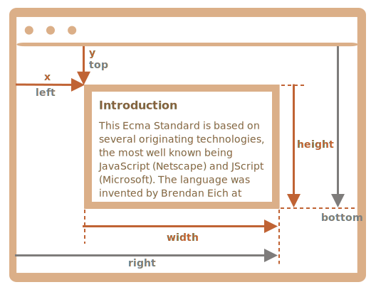
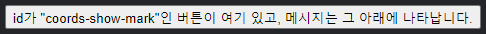
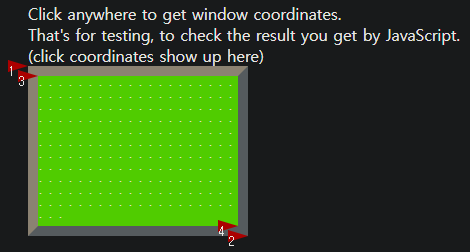
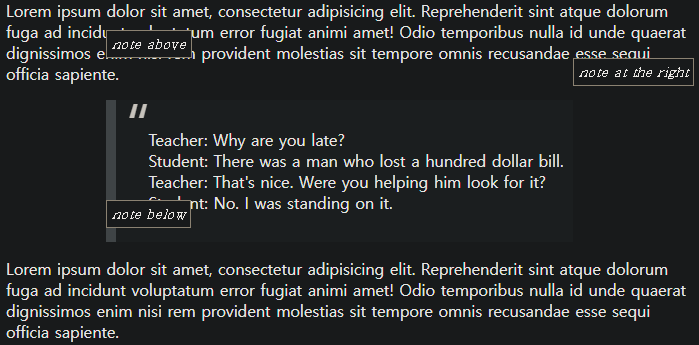
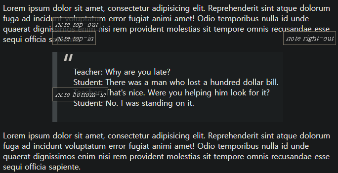

좌표
====

#### 좌표 체계 <sub>(2가지 · 대다수 JS 메서드 둘 중 하나 이용)</sub>

##### 1. 창 기준 <sub>(클라이언트 좌표)</sub>
- 창 좌상단 모서리 기준
  - `position: fixed` 유사
- (`clientX`, `clientY`) <sub>(좌표)</sub>

##### 2. 문서 기준 <sub>(페이지 좌표)</sub>
- 문서 좌상단 모서리 기준
  - `position: absolute` <sub>(최상단)</sub> 유사
- (`pageX`, `pageY`) <sub>(좌표)</sub>

##### 스크롤 이동 전
- 창 · 문서 좌상단 모서리 일치

##### 스크롤 이동 후
- 창 기준 요소 좌표 변경 <sub>(창 내 요소 이동)</sub>
- 문서 기준 좌표 동일

#### 문서 내 한 지점 좌표 <sub>(스크롤 이동 전 · 후)</sub>


##### `clientY` <sub>(창 기준 좌표)</sub>
- 창 최상단 <sub>(스크롤 시 거리 근접)</sub> 부터 계산
  - 스크롤 후 좌표 변경 <sub>(화살표 길이 ↓)</sub>

##### `pageY` <sub>(문서 기준 좌표)</sub>
- 문서 최상단 <sub>(스크롤 의해 가려짐)</sub> 부터 계산
  - 스크롤 후 좌표 동일

### 창 기준 <sub>(요소)</sub> 좌표

##### `getBoundingClientRect()` <sub>(요소 메서드)</sub>
- `DOMRect` <sub>(객체)</sub> 반환
  - 요소 감싸는 가장 작은 박스 좌표 <sub>(창 기준)</sub>

#### [`DOMRect`](https://www.w3.org/TR/geometry-1/#domrect) <sub>(클래스)</sub>



##### 주요 프로퍼티
- `x` · `y`
  - 박스 X · Y 좌표 <sub>(창 기준)</sub>
- `width` · `height` <sub>(음수 가능)</sub>
  - 박스 너비 · 높이

##### 파생 프로퍼티
- `left` <sub>(`x`)</sub> · `right` <sub>(`x` + `width`)</sub>
  - 박스 좌 · 우 모서리 X 좌표 <sub>(창 기준)</sub>
- `top` <sub>(`y`)</sub> · `bottom` <sub>(`y` + `height`)</sub>
  - 박스 상 · 하 모서리 Y 좌표 <sub>(창 기준)</sub>

#### 주의

##### 소수 가능
- 좌표 계산 시 소수 사용 <sub>(브라우저)</sub>
  - 반올림 불필요 <sub>(`style.[left·top]` 등)</sub>

##### 음수 가능
- 스크롤 후 창 외부 <sub>(최상단 위)</sub> 요소 위치 시
  - `top` <sub>(파생 프로퍼티)</sub> 값 음수

<br />

 **파생 프로퍼티 필요 이유 <sub>(편의 도모)</sub>**

#### `width` · `height` <sub>(주요 프로퍼티)</sub>

##### '방향성' 박스 표시 가능 <sub>(마우스 드래그 등)</sub>
- 우하단 → 좌상단 <sub>(↖)</sub>
  - 음수 값

##### `width = -200` · `height = -100`
- `x` ≠ `left`
- `y` ≠ `top`


##### 실제 값 항상 양수
- 이론상 음수 가능

<br />

 **IE `x` · `y` 미지원**

#### 해결 <sub>(2가지 방법)</sub>

##### ⓐ 폴리필 추가
  - `DomRect.prototype`
    - getter 추가

##### ⓑ `left` · `top` <sub>(파생 프로퍼티)</sub> 사용
- `width` · `height` <sub>(주요 프로퍼티)</sub> 값 양수 경우
  - `x` → `left`
  - `y` → `top`

<br />

 **`right` · `bottom` <sub>(좌표 vs CSS)</sub>**

##### 창 기준 좌표 · `position: fixed` <sub>(CSS)</sub>
- 명백한 유사점 有

#### 측정 기준 상이

##### 창 기준 좌표
- 좌상단 모서리

##### `position: fixed` <sub>(CSS)</sub>
- `right` <sub>(CSS)</sub>
  - 우측 모서리
- `bottom` <sub>(CSS)</sub>
  - 하단 모서리

<br />

### `elementFromPoint(x, y)` <sub>(메서드)</sub>

##### `document.elementFromPoint(x, y)`
- `(x, y)` <sub>(창 기준 좌표)</sub> 최근접 중첩 요소 반환
```javascript
let elem = document.elementFromPoint(x, y);
```

##### 창 정중앙 요소 대상 동작
- 붉은색 강조 · 태그 얼럿 창 출력
- 현재 스크롤 위치 강조 요소
  - 상이 가능 <sub>(창 기준 좌표)</sub>
```javascript
let centerX = document.documentElement.clientWidth / 2;
let centerY = document.documentElement.clientHeight / 2;

let elem = document.elementFromPoint(centerX, centerY);

// 붉은색 강조
elem.style.background = "red";

// 태그 얼럿 창 출력
alert(elem.tagName);
```

<br />

 **창 외부 좌표 대상 == `null`**

##### `document.elementFromPoint(x, y)`
- 가시 영역 <sub>(창)</sub> 내 대상만 동작

##### `null` 반환 의미
- `(x, y)` <sub>(좌표)</sub> 중 최소 하나
  - 음수
  - 창 너비 · 높이 이탈

##### 해당 특징 미인지 시 전형적인 실수 발생 가능
```javascript
let elem = document.elementFromPoint(x, y);

// 창 외부 요소 이탈 시
// - elem (변수) == null
elem.style.background = ''; // 에러
```

<br />

### 창 내 특정 좌표 요소 고정

##### 좌표 주요 용도
- 위치 설정

#### 요소 근처 위치 내 표시

##### 1. 특정 요소 좌표 얻기
- `getBoundingClientRect()` <sub>(메서드)</sub>

##### 2. 근처 위치 내 표시 <sub>(CSS · 좌표 조합)</sub>
- `position` <sub>(CSS)</sub>
  - `style.left`
  - `style.right`
  - `style.top`
  - `style.bottom`
- 창 기준 좌표 <sub>(`DOMRect` 객체 파생 프로퍼티)</sub>
  - `left`
  - `right`
  - `top`
  - `bottom`

##### `createMessageUnder(elem, html)` <sub>(함수)</sub>
- `elem` <sub>(요소)</sub> 하단 `html` <sub>(메시지)</sub> 표시
```javascript
function createMessageUnder(elem, html) {

  // 메시지 표시 요소 생성
  let message = document.createElement('div');

  // 요소 스타일링 (CSS 클래스 사용 권장)
  message.style.cssText = "position: fixed; color: red";

  // 요소 좌표
  let coords = elem.getBoundingClientRect();

  // px (단위) 추가 주의
  message.style.left = coords.left + "px";
  message.style.top = coords.bottom + "px";

  message.innerHTML = html;

  return message;
}

// 사용법
// - 5초간 문서 내 메시지 표시
let elem = document.getElementById("coords-show-mark");
let message = createMessageUnder(elem, '독도는 우리땅!');
document.body.append(message);
setTimeout(() => message.remove(), 5000);
```



##### 응용
- 상 · 하 · 좌 · 우 표시
- CSS 애니메이션 <sub>(`fade-in` 등)</sub> 적용

#### 개선점

##### 문제
- 페이지 스크롤 시
  - 기준 요소 <sub>(버튼)</sub> · 메시지 사이 벌어짐

##### 이유
- 메시지 요소
  - `position: fixed` <sub>(CSS)</sub>
    - 창 기준 위치 <sub>(좌표)</sub> 고정
- 창 기준 동일 위치 표시 <sub>(스크롤 무관)</sub>
  - 페이지 스크롤 시 위치 변경 X

##### 해결 <sub>(2가지 조합)</sub>
- 문서 기준 좌표
- `position: absolute` <sub>(CSS)</sub>

### 문서 기준 좌표

##### 좌표 기준
- 문서 좌상단 모서리

##### `position` <sub>(CSS)</sub> 유사점
- 창 기준 좌표
  - `position: fixed`
- 문서 기준 좌표
  - `position: absolute` <sub>(최상단)</sub>

##### 문서 내 특정 좌표 위치 설정 <sub>(2가지 조합)</sub>
- `position: absolute` <sub>(CSS)</sub>
- `left` · `top` <sub>(파생 프로퍼티)</sub>

##### 문서 기준 요소 좌표 정보
- 관련 표준 메서드 無

##### 두 좌표 체계 <sub>(창 · 문서 기준)</sub> 연계
``` javascript
//     창 기준 좌표       window.page[X·Y]Offset
pageX == clientX + 문서 내 가로 스크롤 의해 가려진 영역 너비
pageY == clientY + 문서 내 세로 스크롤 의해 가려진 영역 높이
```

##### `getCoords(elem)` <sub>(함수)</sub>
1. 창 기준 좌표
    - `getBoundingClientRect()`
2. 스크롤 의해 가려진 영역 너비 · 높이 추가
```javascript
// 문서 기준 요소 좌표 얻기
function getCoords(elem) {

  // ①
  // 창 기준 좌표
  let box = elem.getBoundingClientRect();

  return {
    // ②
    // 스크롤 의해 가려진 영역 너비 · 높이 추가
    left:   box.left   + window.pageXOffset
    right:  box.right  + window.pageXOffset,
    top:    box.top    + window.pageYOffset,
    bottom: box.bottom + window.pageYOffset,
  };
}
```

##### `createMessageUnder(elem, html)` <sub>(함수)</sub>
- `position` <sub>(CSS)</sub> 값
  - `fixed` X
  - `absolute`
- 요소 좌표
  - `getBoundingClientRect()` X
  - `getCoords(elem)`
```javascript
function createMessageUnder(elem, html) {
  let message = document.createElement('div');

//message.style.cssText = "position: fixed; color: red";
  message.style.cssText = "position: absolute; color: red";

//let coords = elem.getBoundingClientRect();
  let coords = getCoords(elem);

  message.style.left = coords.left + "px";
  message.style.top = coords.bottom + "px";

  message.innerHTML = html;

  return message;
}
```

<br />

요약
====

#### 좌표 체계 <sub>(2가지)</sub>

##### 1. 창 기준 <sub>(`position: fixed` 조합 유용)</sub>
- `getBoundingClientRect()` <sub>(메서드)</sub>

##### 2. 문서 기준 <sub>(`position: absolute` 조합 유용)</sub>
- `getBoundingClientRect()` <sub>(메서드)</sub>
- 현재 스크롤 상태

<br />

##  과제

### 창 기준 좌표 구하기

##### 화살표 표시 부분 창 기준 좌표 얻기
1. 좌상단 외부 모서리
2. 우하단 외부 모서리
3. 좌상단 내부 모서리
4. 우하단 내부 모서리

##### 편의 기능
- 요소 내 클릭 시
  - 클릭 지점 좌표 출력



##### 조건
- 두 좌푯값 <sub>(화살표 표시 부분)</sub> 동일
  - 계산값 <sub>(과제)</sub>
  - 마우스 클릭 시 출력값 <sub>(편의 기능)</sub>

##### 참고
- 요소 크기 · 테두리 종류 무관
  - 항상 정상 작동

<br />


##### 외부 모서리 좌표
- [`getBoundingClientRect()`](https://developer.mozilla.org/en-US/docs/Web/API/Element/getBoundingClientRect) <sub>(메서드)</sub>
```javascript
let coords = elem.getBoundingClientRect();

// 좌상단 외부
let answer1 = [
  coords.left,
  coords.top
];

// 우하단 외부
let answer2 = [
  coords.right,
  coords.bottom
];
```

#### 내부 모서리 좌표 <sub>(테두리 두께 이용)</sub>

##### 좌상단 내부 모서리 좌표
- 좌상단 외부 모서리 좌표 + 테두리 두께
  - `client[Left·Top]`
```javascript
let answer3 = [
  coords.left + elem.clientLeft,
  coords.top  + elem.clientTop
];
```

##### 우하단 내부 모서리 좌표
1. 우하단 외부 모서리 좌표 - 테두리 두께
```javascript
// getComputedStyle (CSS) 이용
let answer4_1 = [
  coords.right  - parseInt(getComputedStyle(elem).borderRightWidth),
  coords.bottom - parseInt(getComputedStyle(elem).borderBottomWidth)
];
```

2. 좌상단 내부 모서리 좌표 + 요소 너비 · 높이
```javascript
// client[Width·Height] (기하 프로퍼티) 이용
let answer4_2 = [
  coords.left + elem.clientLeft + elem.clientWidth,
  coords.top  + elem.clientTop  + elem.clientHeight
];
```

[정답](https://plnkr.co/edit/w1mwumfvKPR3ApJc?p=preview)

<hr />

### 요소 근처 노트 표시하기 <sub>(상대 좌표)</sub>

##### `positionAt(anchor, position, elem)` <sub>(함수)</sub> 작성
- `elem` <sub>(요소)</sub> 위치 설정
  - `anchor` <sub>(기준 요소)</sub> 근처 <sub>(외부)</sub>

##### `position` <sub>(문자열)</sub>
- `"top"`
  - `anchor` 상단
- `"right"`
  - `anchor` 우측
- `"bottom"`
  - `anchor` 하단

##### `showNote(anchor, position, html)` <sub>(함수)</sub>
- 과제 소스코드 내 함수
  - `positionAt` <sub>(함수)</sub> 내부 사용
- 노트 요소 생성
  - `html` <sub>(내용)</sub>
  - `position` <sub>(위치)</sub>
  - `anchor` <sub>(기준 요소)</sub>

##### 결과물


<br />


##### 정확한 좌표 계산 필요
- 코드 참조

##### 참고
- 문서 내 요소 위치 필수
  - 프로퍼티 값 필요 <sub>(`offsetHeight` 등)</sub>
- 숨겨진 <sub>(`display: none`)</sub> · 문서 외부 요소
  - 크기 無

[정답](https://plnkr.co/edit/TY4R2je7qdqDBOgZ?p=preview)

<hr />

### 요소 근처 노트 표시하기 <sub>(절대 좌표)</sub>

##### 이전 과제 정답 <sub>(함수)</sub> 변형
- `position: absolute` <sub>(CSS)</sub> 사용
  - 스크롤 시 요소 사이 벌어짐 방지

##### 스타일 추가 <sub>(스크롤 이동 테스트 용도)</sub>
``` javascript
<body style="height: 2000px">
```

<br />


##### 이전 과제 정답 <sub>(함수)</sub> 코드 변형 <sub>(2가지)</sub>
1. `position: [fixed → absolute]`
    - `.note` <sub>(CSS 클래스)</sub> 요소
2. `getCoords()` <sub>(챕터 내 함수)</sub> 사용
    - 문서 기준 좌표 반환

[정답](https://plnkr.co/edit/TY4R2je7qdqDBOgZ?p=preview)

<hr />

### 요소 내 노트 표시하기 <sub>(절대 좌표)</sub>

##### 이전 과제 정답 <sub>(함수)</sub> 확장
- `positionAt(anchor, position, elem)`
  - `anchor` 내 `elem` 삽입 <sub>(표시 동작 변경)</sub>

##### `position` <sub>(문자열)</sub>
- `"[top·right·bottom]-out"` <sub>(기존 위치)</sub>
  - `anchor` 상단 · 우측 · 하단
- `"[top·right·bottom]-in"`
  - `anchor` 내부 상단 · 우측 · 하단
    - 각 경계면 접촉
```javascript
// 외부 상단
positionAt(blockquote, "top-out", note);

// 내부 상단
positionAt(blockquote, "top-in" , note);
```

##### 결과물



<br />


[정답](https://plnkr.co/edit/vYfLijXlrNezxdcV?p=preview)
