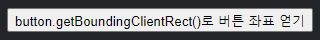

좌표
===

##### 대다수 JS 메서드
- 두 좌표 체계 중 하나 이용

##### 1. 창 기준
- 창 좌상단 모서리 기준
- `position: fixed` 설정 유사
- 좌표 표시
  - (`clientX`, `clientY`)

##### 2. 문서 기준
- 문서 좌상단 모서리 기준
- 문서 최상단 `position: absolute` 설정 유사
- 좌표 표시
  - (`pageX`, `pageY`)

##### 스크롤 이동 전
- 창 · 문서 좌상단 모서리
  - 두 모서리 정확히 일치

##### 스크롤 이동 후
- 창 기준 요소 좌표 변경 <sub>(창 내 요소 이동)</sub>
  - `client[X·Y]`
- 문서 기준 좌표 변경 X
  - `page[X·Y]`

##### 문서 내 한 지점 스크롤 이동 전 <sub>(좌)</sub> · 후 <sub>(우)</sub> 좌표 표시


#### 문서 스크롤 시

##### `clientY` <sub>(창 기준 좌표)</sub>
- 창 최상단부터 계산 <sub>(해당 지점 · 창 최상단 근접)</sub>
  - 좌표 변경 <sub>(화살표 길이 짧아짐)</sub>

##### `pageY` <sub>(문서 기준 좌표)</sub>
- 문서 최상단부터 계산 <sub>(스크롤 되어 가려짐)</sub>
  - 좌표 동일

### `getBoundingClientRect` <sub>(요소 좌표 얻기)</sub>
- [`DOMRect`](https://www.w3.org/TR/geometry-1/#domrect) <sub>(클래스)</sub> 객체 형태 반환
  - 요소 감싸는 가장 작은 박스 좌표
    - 창 기준 좌표

#### `DOMRect` <sub>(클래스)</sub>

##### 주요 프로퍼티 <sub>(요소 감싸는 박스 관련)</sub>
- `x` · `y`
  - X · Y 좌표 <sub>(창 기준 좌표)</sub>
- `width` · `height`
  - 너비 · 높이 <sub>(음수 가능)</sub>

##### 파생 프로퍼티 <sub>(요소 감싸는 박스 관련)</sub>
- `top` · `bottom`
  - 상 · 하 모서리 Y 좌표
- `left` · `right`
  - 좌 · 우 모서리 X 좌표

##### 페이지 조금씩 스크롤 <sub>(창 기준 버튼 위치 변경)</sub> 후
- 버튼 클릭 <sub>(좌푯값 변경)</sub>
- 수직 스크롤 시 값 변경 프로퍼티
  - `y`
  - `top`
  - `bottom`



##### `getBoundingClientRect()` 각 프로퍼티 정리


##### 파생 프로퍼티 계산

|좌표|계산|
|---|---|
|top|`y`|
|bottom|`y + height`|
|left|`x`|
|right|`x + width`|

#### 주의사항

##### 소수 가능
- 좌표 계산 시 소수 사용 <sub>(브라우저)</sub>
- 반올림 필요 X
  - `style.[left·top]`

##### 음수 가능
- 페이지 스크롤 후
  - 창 위로 요소 밀려났을 때
    - `top` : 음수
<br />

 **파생 프로퍼티 필요 이유 <sub>(`top` · `left`)</sub>**

- 편의 위해 존재

##### `width` · `height`
- '방향 있는' 사각형 표시 시 음수 가능
  - 우하단 → 좌상단 <sub>(↖ 방향)</sub>

##### ex\) `width = -200` · `height = -100`
- `top` &nbsp;≠ `y`
- `left` ≠ `x`


##### `getBoundingClientRect().[width·height]`
- 이론
  - 음수 가능
- 실제
  - 항상 양수

<br />

 **IE :  `x` · `y` 미지원**

#### 예전부터 미지원

##### 폴리필 추가
  - `DomRect.prototype`
    - getter 추가

##### `top` · `left` 사용
- `width` · `height` 값 : 양수 경우
  - `top` &nbsp;== `y`
  - `left` == `x`

<br />

 **`right` · `bottom` <sub>(좌표)</sub> ≠ `position` <sub>(CSS 프로퍼티)</sub>**

##### 창 기준 좌표 · `position: fixed` <sub>(CSS 프로퍼티)</sub>
- 명백한 유사점 존재

#### 차이점 <sub>(측정 기준)</sub>

##### 창 기준 좌표 측정 기준
- 좌상단 모서리

##### `position: fixed` <sub>(CSS 프로퍼티)</sub> 측정 기준
- `right` <sub>(프로퍼티)</sub>
  - 우측 모서리
- `bottom` <sub>(프로퍼티)</sub>
  - 하단 모서리

<br />

### `elementFromPoint(x, y)`

##### `(x, y)` <sub>(창 기준 좌표)</sub> 최근접 중첩 요소 반환
- 창 기준 좌표 사용
```javascript
let elem = document.elementFromPoint(x, y);
```

##### ex\) 창 정중앙 요소 대상 동작
- 얼럿창 출력 · 붉은색 강조
- 현재 스크롤 위치 강조 요소
  - 상이 가능 <sub>(창 기준 좌표)</sub>
```javascript
let centerX = document.documentElement.clientWidth / 2;
let centerY = document.documentElement.clientHeight / 2;

let elem = document.elementFromPoint(centerX, centerY);

elem.style.background = "red";
alert(elem.tagName);
```

<br />

 **창밖 좌표 대상 : `null`**

- 보이는 영역 <sub>(창)</sub> 내 위치 대상만 동작

##### `null` 반환 의미
- 좌표 <sub>`(x, y)`</sub> 중 최소 하나
  - 음수
  - 창 너비 · 높이 이탈

##### 해당 특징 미인지 시
- 전형적인 실수 발생
```javascript
let elem = document.elementFromPoint(x, y);

// 창 밖으로 요소 이탈 시
// - elem (요소) == null
elem.style.background = ''; // 에러!
```

<br />

### 창 내 특정 좌표에 요소 고정하기

##### 요소 근처 무언가 표시 시 <sub>(함께 사용)</sub>
- `getBoundingClientRect`
  - 요소 좌표 얻기
- `position` <sub>(CSS 프로퍼티)</sub>
  - `top`
  - `bottom`
  - `left`
  - `right`

##### `createMessageUnder(elem, html)` <sub>(함수)</sub>
- `elem` <sub>(요소)</sub> 하단 메시지 표시
```javascript
let elem = document.getElementById("coords-show-mark");

function createMessageUnder(elem, html) {

  // 메시지 담길 요소 생성
  let message = document.createElement('div');

  // 요소 스타일링
  // - css 클래스 사용 권장
  message.style.cssText = "position: fixed; color: red";

  // 좌표 지정
  // - "px" 주의
  let coords = elem.getBoundingClientRect();

  message.style.left = coords.left + "px";
  message.style.top = coords.bottom + "px";

  message.innerHTML = html;

  return message;
}

// 사용법
// - 문서 내 메시지 띄우기 (5초 동안)
let message = createMessageUnder(elem, '독도는 우리땅!');
document.body.append(message);
setTimeout(() => message.remove(), 5000);
```


##### 응용
- 상 · 하 · 좌 · 우 표시
- CSS 애니메이션 <sub>(`fade-in` 등)</sub> 적용

#### 개선점

##### 페이지 스크롤 시
- 버튼에서 메시지 떨어짐

##### 이유
- 메시지 요소
  - `position: fixed`
- `getBoundingClientRect` <sub>(메서드)</sub>
  - 창 기준 좌표 반환
- 페이지 스크롤 시 위치 변경 X
  - 창 기준 동일 위치 존재

##### 해결 <sub>(함께 사용)</sub>
- 문서 기준 좌표
- `position: absolute`

### 문서 기준 좌표

##### 좌표 기준
- 문서 좌상단 모서리

##### `position` <sub>(CSS 프로퍼티)</sub> 유사점
- 창 기준 좌표
  - `position: fixed`
- 문서 기준 좌표
  - `position: absolute` <sub>(최상단 요소 설정)</sub>

##### 문서 내 특정 좌표 위치시키기 <sub>(스크롤 이동 상관 X)</sub>
- 정확한 좌표
- `position: absolute`
- `top` · `left`

##### 문서 기준 요소 좌표 제공 표준 메서드
- 아직 부재
- 아주 쉽게 코드 작성

##### 두 좌표 체계 <sub>(창 · 문서 기준 좌표)</sub> 연관시키기
``` javascript
pageY == clientY + 문서 상 세로 스크롤 의해 밀려난 부분 높이
pageX == clientX + 문서 상 가로 스크롤 의해 밀려난 부분 너비
```

##### `getCoords(elem)` <sub>(함수)</sub>
1. 창 기준 좌쵸 표 얻기
  - `getBoundingClientRect()`
2. 스크롤 의해 가려진 영역 너비 · 높이 더하기
```javascript
// 문서 기준 요소 좌표 얻기
function getCoords(elem) {
  let box = elem.getBoundingClientRect();

  return {
    top:    box.top    + window.pageYOffset,
    right:  box.right  + window.pageXOffset,
    bottom: box.bottom + window.pageYOffset,
    left:   box.left   + window.pageXOffset
  };
}
```

##### `position: absolute` 사용 시
- 메시지 : 스크롤 해도 버튼 요소 근처 머무름

##### `createMessageUnder` <sub>(함수)</sub>
```javascript
function createMessageUnder(elem, html) {
  let message = document.createElement('div');
  message.style.cssText = "position: absolute; color: red";

  let coords = getCoords(elem);

  message.style.left = coords.left + "px";
  message.style.top = coords.bottom + "px";

  message.innerHTML = html;

  return message;
}
```

<br />

## 요약

#### 페이지 내 모든 점
- 좌표 보유

##### 1. 창 기준
- `gettBoundingClientRect()`
- `position: fixed` 함께 사용 시 유용

##### 2. 문서 기준
- `getBoundingClientRect()` + 현재 스크롤 상태
- `position: absolute` 함께 사용 시 유용

두 좌표 체계 모두 장단점이 있습니다. CSS의 `position`, `absolute`, `fixed`처럼 이게 필요할 때도 있고 저게 필요할 때도 있습니다.

<br />

##  과제

### 창 기준 좌표 구하기

- 화살표 표시 지점

##### 편의 기능
- 요소 내 클릭 시
  - 클릭 지점 좌표 출력

##### 구할 좌표 리스트
1. 좌상단 외부 모서리
2. 우하단 외부 모서리
3. 좌상단 내부 모서리
4. 우하단 내부 모서리

##### 조건
- 마우스 클릭 시 출력 좌표 동일

##### 참고
- 요소 크기 · 테두리 관계 없이 작동


<br />


##### 외부 모서리
- [`getBoundingClientRect()`](https://developer.mozilla.org/en-US/docs/Web/API/Element/getBoundingClientRect) <sub>(메서드)</sub>
```javascript
let coords = elem.getBoundingClientRect();

let answer1 = [coords.left , coords.top];
let answer2 = [coords.right, coords.bottom];
```

##### 좌상단 내부 모서리
- 테두리 두께 고려
- `client[Left·Top]`
```javascript
let answer3 = [coords.left + field.clientLeft, coords.top + field.clientTop];
```

##### 우하단 내부 모서리
- 우상단 위부 모서리 - 테두리 두께
```javascript
// CSS 이용 방법
let answer4_1 = [
  coords.right  - parseInt(getComputedStyle(field).borderRightWidth),
  coords.bottom - parseInt(getComputedStyle(field).borderBottomWidth)
];

// client[Width·Height] 이용 방법
// - 좌상단 모서리 좌표
let answer4_2 = [
  coords.left + elem.clientLeft + elem.clientWidth,
  coords.top  + elem.clientTop  + elem.clientHeight
];
```

[정답](https://plnkr.co/edit/w1mwumfvKPR3ApJc?p=preview)

<hr />

### 요소 근처에 노트 표시하기

##### `positionAt(anchor, position, elem)` <sub>(함수)</sub> 생성
- `elem` 위치 설정
  - 근처 `anchor` 기준

##### `position` 값 <sub>(3가지 문자열 중 하나)</sub>
- `"top"`
  - `anchor` 바로 위
- `"right"`
  - `anchor` 바로 우측
- `"bottom"`
  - `anchor` 바로 아래

##### `showNote(anchor, position, html)` <sub>(함수)</sub> 내 사용됨
- `note` <sub>(요소)</sub> 생성
  - 내용 : `html`
  - 위치 : `position` <sub>(`anchor` 근처)</sub>

##### 결과물


<br />


##### 정확한 좌표 계산 필요
- 코드 참조

##### 참고
- 요소 : 문서 내 위치
  - 프로퍼티 값 필요 <sub>(`offsetHeight` 등)</sub>
- 숨겨진 · 문서 밖 요소
  - 크기 : 0

[정답](https://plnkr.co/edit/TY4R2je7qdqDBOgZ?p=preview)

<hr />

### 요소 근처에 노트 표시하기 <sub>(절대값 좌표)</sub>

##### `position: absolute` 사용
- 스크롤 시 요소 이동 방지

##### 이전 과제 코드 변형
- 스크롤 테스트 위해 스타일 더하기
``` javascript
<body style="height: 2000px">
```

<br />


##### 이전 과제 코드 변형 <sub>(2가지)</sub>
1. `position: [fixed → absolute]`
    - `.note` <sub>(CSS 클래스)</sub>
2. `getCoords()` <sub>('좌표 챕터' 함수)</sub> 사용
    - 문서 기준 좌표 얻기

[정답](https://plnkr.co/edit/TY4R2je7qdqDBOgZ?p=preview)

<hr />

### 요소 내 노트 표시하기 <sub>(절대값 좌표)</sub>
- 이전 과제 함수 확장
  - `positionAt(anchor, position, elem)`

#### `position` <sub>(인수)</sub> 새 값
- `[top·right·bottom]-out`
  - `anchor` 기준 외부 <sub>(이전 기능 동일)</sub>
- `[top·right·bottom]-in`
  - `anchor` 기준 내부 <sub>(테두리에 붙음)</sub>
```javascript
// 요소 상단
positionAt(blockquote, "top-out", note);

// 요소 내 상단
positionAt(blockquote, "top-in" , note);
```

##### 결과물


##### 이전 과제 코드 변형

<br />


[정답](https://plnkr.co/edit/vYfLijXlrNezxdcV?p=preview)
