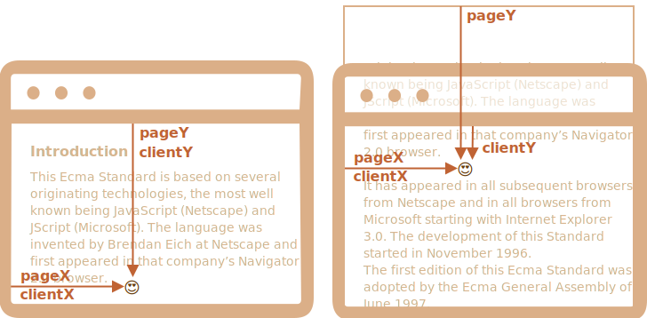

좌표
===

##### 대다수 JS 메서드
- 두 좌표 체계 중 하나 이용

##### 1. 창 기준
- 창 좌상단 모서리 기준
  - ≒ `position: fixed`
  - `clientX` · `clientY`

##### 2. 문서 기준
- 문서 좌상단 모서리 기준
  - ≒ `position: absolute` <sub>(문서 최상단)</sub>
  - `pageX` · `pageY`

##### 스크롤 이동 전
- 창 좌상단 모서리 · 문서 좌상단 모서리
  - 정확히 일치

##### 스크롤 이동 후
- 문서 기준 좌표 변경 X
- 창 기준 요소 좌표 변경
  - 창 내 요소 움직임

##### 문서 내 한 지점 스크롤 움직이기 전 <sub>(좌)</sub> 후 <sub>(우)</sub> 좌표 표시



##### 문서 스크롤 되었을 때
- `pageY` <sub>(문서 기준 좌표)</sub>
  - 문서 맨 위부터 계산 <sub>(스크롤 되어 가려짐)</sub>
    - 좌표 동일
- `clientY` <sub>(창 기준 좌표)</sub>
  - 해당 지점 : 창 상단과 가까워짐
    - 좌표 변경 <sub>(화살표 짧아짐)</sub>

### `getBoundingClientRect` <sub>(요소 좌표 얻기)</sub>
- 해당 요소 감싸는 가장 작은 네모 창 기준 좌표
  - [`DOMRect`](https://www.w3.org/TR/geometry-1/#domrect) <sub>(클래스)</sub> 객체 형태 반환

#### `DOMRect`

##### 주요 프로퍼티
- `x` · `y`
  - 요소 감싸는 네모 창 기준 X · Y 좌표
- `width` · `height`
  - 요소 감싸는 네모 너비 · 높이 <sub>(음수 가능)</sub>

##### 파생 프로퍼티
- `top` · `bottom`
  - 요소 감싸는 네모 상 · 하 모서리 Y 좌표
- `left` · `right`
  - 요소 감싸는 네모 좌 · 우 모서리 X 좌표

##### 페이지 조금씩 스크롤 창 기준 버튼 위치 변경
- 버튼 클릭 시 좌푯값 변경
  - 수직 스크롤 시 변화
    - `y`
    - `top`
    - `bottom`


##### `getBoundingClientRect()` 각 프로퍼티

|좌표|계산|
|---|---|
|left|`x`|
|top|`y`|
|right|`x + width`|
|bottom|`y + height`|


#### 주의사항

##### 소수 가능
- 좌표 계산 시 소수 사용 <sub>(브라우저)</sub>
- 반올림 필요 X
  - `style.[left·top]`

##### 음수 가능
- 페이지 스크롤 후
  - 요소 : window 위로 밀려났을 때

<br />

 **파생 프로퍼티 필요 이유 <sub>(`top` · `left`)</sub>**

- 편의 위해 존재

##### `width` · `height`
- '방향 있는' 사각형 : 음수 가능
  - 우하단 → 좌상단 <sub>(↖)</sub>

##### ex&#41; `width = -200` · `height = -100`
- `left` · `top` ≠ `x` · `y`

##### 실제 `getBoundingClientRect` <sub>(메서드)</sub>
- `width` · `height`
  - 항상 양수


<br />

 **IE :  `x` · `y` 미지원**

#### 예전부터 미지원

##### 폴리필 추가
  - `DomRect.prototype`
    - getter 추가

##### `top` · `left` 사용
- `width` · `height` : 양수
  - `top` · `left` == `x` · `y`

<br />

 **`right` · `bottom` <sub>(좌표)</sub> ≠ `position` <sub>(CSS 프로퍼티)</sub>**

##### 창 기준 좌표 · `position: fixed` <sub>(CSS 프로퍼티)</sub>
- 명백한 유사점 존재

##### CSS
- `right` <sub>(프로퍼티)</sub>
  - 우측 모서리로부터의 거리
- `bottom` <sub>(프로퍼티)</sub>
  - 아래 모서리로부터의 거리

##### 창 기준 좌표 사용 시 주의
- 측정 기준 : 좌상단 모서리

<br />

### `elementFromPoint(x, y)`
- `(x, y)` <sub>(창 기준 좌표)</sub> 최근접 중첩 요소

##### 문법
```javascript
let elem = document.elementFromPoint(x, y);
```

##### 창 정중앙 요소 태그
- 얼럿창 출력
- 붉은색 강조
```javascript
let centerX = document.documentElement.clientWidth / 2;
let centerY = document.documentElement.clientHeight / 2;

let elem = document.elementFromPoint(centerX, centerY);

elem.style.background = "red";
alert(elem.tagName);
```

##### 창 기준 좌표 사용
- 현재 스크롤 위치 강조되는 요소
  - 상이 가능

<br />

 **창밖 좌표 대상 : `null`**

- 보이는 영역 안 <sub>(창 안)</sub> 위치 시만 동작

##### `null` 반환
- 좌표 <sub>`(x, y)`</sub> 중 하나라도
  - 음수
  - 창 너비 · 높이 이탈

##### 특징 미인지 시 전형적인 실수 발생
```javascript
let elem = document.elementFromPoint(x, y);

// 요소 : 창 밖으로 나가면
// - lem = null
elem.style.background = ''; // 에러!
```

<br />

### 창 내 특정 좌표에 요소 고정

##### 요소 근처 무언가 표시
- 요소 좌표 얻기
  - `getBoundingClientRect`
- `position` <sub>(CSS 프로퍼티)</sub>
  - `left` · `top` <sub>(또는 `right` · `bottom`)</sub> 함께 사용

예를 들어 아래 `createMessageUnder(elem, html)` 함수는 `elem` 아래쪽에 메시지를 표시합니다.
```javascript
let elem = document.getElementById("coords-show-mark");

function createMessageUnder(elem, html) {
  // 메시지가 담길 요소를 만듭니다.
  let message = document.createElement('div');
  // 요소를 스타일링 할 땐 css 클래스를 사용하는 게 좋습니다.
  message.style.cssText = "position:fixed; color: red";

  // 좌표를 지정합니다. 이때 "px"을 함께 써주는 걸 잊지 마세요!
  let coords = elem.getBoundingClientRect();

  message.style.left = coords.left + "px";
  message.style.top = coords.bottom + "px";

  message.innerHTML = html;

  return message;
}

// 사용법:
// 문서 안에 메시지를 띄우고, 5초 동안만 보여줍니다.
let message = createMessageUnder(elem, '독도는 우리땅!');
document.body.append(message);
setTimeout(() => message.remove(), 5000);
```

직접 버튼을 눌러 위 예시를 실행해 봅시다.


위 예시를 응용하면 메시지를 왼쪽 이나 오른쪽, 아래에 표시할 수도 있고 CSS 애니메이션을 적용하면 ‘fade-in’ 등의 효과도 줄 수 있습니다. 좌푯값과 요소의 크기만 알면 손쉽게 원하는 것을 할 수 있죠.

그런데 예시에서 뭔가 부자연스러운 게 보입니다. 페이지를 스크롤 하면 메시지가 버튼에서 떨어지네요.

메시지가 버튼에서 떨어지는 이유는 아주 명확합니다. 메시지 요소가 `position:fixed`이기 때문에 페이지가 스크롤 되어도 창 기준 동일한 위치에 있기 때문입니다.

이런 부자연스러운 현상을 개선하려면 문서 기준 좌표와 `position:absolute`를 함께 사용해야 합니다.

### 문서 기준 좌표
문서 기준 좌표는 창이 아닌 문서 왼쪽 위 모서리부터 시작합니다.

CSS와 비교하자면 창 기준 좌표는 `position:fixed`에 해당하고 문서 기준 좌표는 맨 위 기준 `position:absolute`와 비슷합니다.

문서 내 특정 좌표에 무언가를 위치시키고 싶을 땐 `position:absolute`와 `top`,`left`를 사용하면 스크롤 이동에 상관없이 해당 요소를 한 좌표에 머물게 할 수 있습니다. 그러려면 우선 정확한 좌표가 필요합니다.

그런데 요소의 문서 기준 좌표를 제공하는 표준 메서드가 아직 없습니다. 하지만 아주 쉽게 코드를 작성할 수 있습니다.

두 좌표 체계(창 기준 좌표와 문서 기준 좌표)는 다음 수식을 통해 연관시킬 수 있습니다.
- `pageY` = `clientY` + 문서에서 세로 방향 스크롤에 의해 밀려난 부분의 높이
- `pageX` = `clientX` + 문서에서 가로 방향 스크롤에 의해 밀려난 부분의 너비

다음 함수 `getCoords(elem)`는 `elem.getBoundingClientRect()`을 사용해 창 기준 좌표를 얻고 여기에 스크롤에 의해 가려진 영역의 너비나 높이를 더합니다.

```javascript
// 요소의 문서 기준 좌표를 얻습니다.
function getCoords(elem) {
  let box = elem.getBoundingClientRect();

  return {
    top: box.top + window.pageYOffset,
    right: box.right + window.pageXOffset,
    bottom: box.bottom + window.pageYOffset,
    left: box.left + window.pageXOffset
  };
}
```

그런데 위 예시에서 `position:absolute`을 사용했다면 스크롤을 해도 메시지가 버튼 요소 근처에 머물렀을 겁니다.

이를 반영한 함수 `createMessageUnder`를 같이 살펴봅시다.
```javascript
function createMessageUnder(elem, html) {
  let message = document.createElement('div');
  message.style.cssText = "position:absolute; color: red";

  let coords = getCoords(elem);

  message.style.left = coords.left + "px";
  message.style.top = coords.bottom + "px";

  message.innerHTML = html;

  return message;
}
```

<br />

## 요약
페이지 내 모든 점은 다음과 같은 좌표를 갖습니다.
1. 창 기준 – `elem.getBoundingClientRect()`
2. 문서 기준 – `elem.getBoundingClientRect()`와 현재 스크롤 상태

창 기준 좌표는 `position:fixed`와 사용하면 좋고 문서 기준 좌표는 `position:absolute`와 사용하면 좋습니다.

두 좌표 체계 모두 장단점이 있습니다. CSS의 `position`, `absolute`, `fixed`처럼 이게 필요할 때도 있고 저게 필요할 때도 있습니다.

<br />

##  과제

### Find window coordinates of the field
In the iframe below you can see a document with the green “field”.

Use JavaScript to find window coordinates of corners pointed by with arrows.

There’s a small feature implemented in the document for convenience. A click at any place shows coordinates there.


Your code should use DOM to get window coordinates of:
1. Upper-left, outer corner (that’s simple).
2. Bottom-right, outer corner (simple too).
3. Upper-left, inner corner (a bit harder).
4. Bottom-right, inner corner (there are several ways, choose one).

The coordinates that you calculate should be the same as those returned by the mouse click.

P.S. The code should also work if the element has another size or border, not bound to any fixed values.

<br />


##### Outer corners
Outer corners are basically what we get from [`elem.getBoundingClientRect()`](https://developer.mozilla.org/en-US/docs/Web/API/Element/getBoundingClientRect).

Coordinates of the upper-left corner `answer1` and the bottom-right corner `answer2`:
```javascript
let coords = elem.getBoundingClientRect();

let answer1 = [coords.left, coords.top];
let answer2 = [coords.right, coords.bottom];
```

##### Left-upper inner corner
That differs from the outer corner by the border width. A reliable way to get the distance is `clientLeft`/`clientTop`:
```javascript
let answer3 = [coords.left + field.clientLeft, coords.top + field.clientTop];
```

##### Right-bottom inner corner
In our case we need to substract the border size from the outer coordinates.

We could use CSS way:
```javascript
let answer4 = [
  coords.right - parseInt(getComputedStyle(field).borderRightWidth),
  coords.bottom - parseInt(getComputedStyle(field).borderBottomWidth)
];
```

An alternative way would be to add `clientWidth`/`clientHeight` to coordinates of the left-upper corner. That’s probably even better:
```javascript
let answer4 = [
  coords.left + elem.clientLeft + elem.clientWidth,
  coords.top + elem.clientTop + elem.clientHeight
];
```

[샌드박스를 열어 정답을 확인해보세요.](https://plnkr.co/edit/w1mwumfvKPR3ApJc?p=preview&preview)

<hr />

### Show a note near the element
Create a function `positionAt(anchor, position, elem)` that positions `elem`, depending on position near `anchor` element.

The `position` must be a string with any one of 3 values:
- `"top"` – position `elem` right above `anchor`
- `"right"` – position `elem` immediately at the right of `anchor`
- `"bottom"` – position `elem` right below `anchor`

It’s used inside function `showNote(anchor, position, html)`, provided in the task source code, that creates a “note” element with given `html` and shows it at the given `position` near the `anchor`.

Here’s the demo of notes:


<br />


In this task we only need to accurately calculate the coordinates. See the code for details.

Please note: the elements must be in the document to read `offsetHeight` and other properties. A hidden (`display:none`) or out of the document element has no size.

[샌드박스를 열어 정답을 확인해보세요.](https://plnkr.co/edit/TY4R2je7qdqDBOgZ?p=preview)

<hr />

### Show a note near the element (absolute)
Modify the solution of the previous task so that the note uses `position:absolute` instead of `position:fixed`.

That will prevent its “runaway” from the element when the page scrolls.

Take the solution of that task as a starting point. To test the scroll, add the style `<body style="height: 2000px">`

<br />


The solution is actually pretty simple:
- Use `position:absolute` in CSS instead of `position:fixed` for `.note`.
- Use the function getCoords() from the chapter 좌표 to get document-relative coordinates.

[샌드박스를 열어 정답을 확인해보세요.](https://plnkr.co/edit/TY4R2je7qdqDBOgZ?p=preview)

<hr />

### Position the note inside (absolute)
Extend the previous task [Show a note near the element (absolute)](https://ko.javascript.info/task/position-at-absolute): teach the function `positionAt(anchor, position, elem)` to insert `elem` inside the `anchor`.

New values for `position`:
- `top-out`, `right-out`, `bottom-out` – work the same as before, they insert the `elem` over/right/under `anchor`.
- `top-in`, `right-in`, `bottom-in` – insert `elem` inside the `anchor`: stick it to the upper/right/bottom edge.

For instance:
```javascript
// shows the note above blockquote
positionAt(blockquote, "top-out", note);

// shows the note inside blockquote, at the top
positionAt(blockquote, "top-in", note);
```

The result:


As the source code, take the solution of the task [Show a note near the element (absolute)](https://ko.javascript.info/task/position-at-absolute).
- above assignment

<br />


[샌드박스를 열어 정답을 확인해보세요.](https://plnkr.co/edit/vYfLijXlrNezxdcV?p=preview)
