브라우저 이벤트 소개
====

##### 이벤트 <sub>(event)</sub>
- 특정 동작 발생 신호
  - 모든 DOM 노드 생성 가능
- DOM 한정 개념 X

#### 주요 DOM 이벤트

##### 마우스 이벤트
- `click`
  - 요소 위 마우스 좌클릭
  - 요소 위 터치스크린 탭
- `contextmenu`
  - 요소 위 마우스 우클릭
- `mouse[over·out]`
  - 요소 위 · 외부 마우스 커서 이동
- `mouse[down·up]`
  - 요소 위 마우스 좌측 버튼 누르기 · 떼기
- `mousemove`
  - 마우스 이동

##### 폼 요소 이벤트
- `submit`
  - 폼 <sub>(`<form>`)</sub> 제출
- `focus`
  - 폼 요소 <sub>(`<input>` 등)</sub> 포커스

##### 키보드 이벤트
- `key[down·up]`
  - 키보드 버튼 누르기 · 떼기

##### 문서 이벤트
- `DOMContentLoaded`
  - DOM 생성 <sub>(HTML 로드 · 처리)</sub> 완료

##### CSS 이벤트
- `transitionend`
  - CSS 애니메이션 종료

##### 이 외 다양한 이벤트 有
- 기타 등등

### 이벤트 핸들러

##### 핸들러 <sub>(함수)</sub>
- 이벤트 발생 시 실행
- 사용자 행동 반응 내용 <sub>(동작)</sub>
- 다양한 할당 · 설정 방법 有

#### 1. HTML 속성 <sub>(HTML만 사용)</sub>

##### `on<event>` <sub>(HTML 속성)</sub>
- ex\) `<input>` <sub>(태그)</sub> 내 `onclick` <sub>(속성)</sub>
  - `click` <sub>(이벤트)</sub> 핸들러 할당
```html
<!-- 버튼 클릭 시 onclick 내 코드 실행 -->
<input onclick="alert('클릭!')" type="button" value="클릭해 주세요.">
```

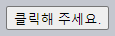

##### 할당 과정
1. 핸들러 → HTML 속성 할당
2. 속성값 이용해 새 함수 생성 <sub>(브라우저)</sub>
3. 생성된 새 함수 → DOM 프로퍼티 할당

##### 속성값 내 따옴표 주의
- 속성값 전체
  - `""` <sub>(큰 따옴표)</sub>
- 속성값 내부
  - `''` <sub>(작은 따옴표)</sub>
  - `""` <sub>(큰 따옴표)</sub> 사용 시 미작동
```html
<!-- 잘못된 따옴표 사용 -->
<input onclick="alert("클릭!")" … >
```

##### 긴 코드 직접 할당 지양
- 함수 생성 후 호출 할당

##### 버튼 클릭 시 `countRabbits()` <sub>(함수)</sub> 호출
```html
<script>
  function countRabbits() {
    for (let i=1; i<=3; i++) {
      `토끼 ${i}마리`;
    }
  }
</script>

<input onclick="countRabbits()" type="button" value="토끼를 세봅시다!">
```

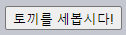

##### 대 · 소문자 구분 X <sub>(보통 소문자 작성)</sub>
- ex\) `onclick`
  - `ONCLICK`
  - `onClick`
  - `onCLICK`

#### 2. DOM 프로퍼티 <sub>(HTML · JS 사용)</sub>

##### `on<event>` <sub>(DOM 프로퍼티)</sub>
- ex\) `elem.onclick` <sub>(프로퍼티)</sub>
```html
<input id="elem" type="button" value="클릭해 주세요.">

<script>
  elem.onclick = function() {
    '클릭!';
  };
</script>
```


##### 대 · 소문자 구분
- `elem.onclick` <sub>(정상 작동)</sub>
- `elem.ONCLICK` <sub>(미작동)</sub>

#### 이벤트 전용 HTML 속성 · DOM 프로퍼티

##### 단 하나 有
- 다수 핸들러 할당 불가능
- 추가 핸들러 할당 시
  - 기존 핸들러 덮어씌워짐

##### `click` <sub>(이벤트)</sub> 핸들러 2개 할당
1. `<… onclick="…">` <sub>(HTML 속성)</sub>
2. `elem.onclick` <sub>(DOM 프로퍼티)</sub>
```html
<input onclick="alert('이전')" id="elem" type="button" value="클릭해 주세요.">

<script>
  // 기존 할당 핸들러 덮어씀
  elem.onclick = function() {
    '이후';
  };
</script>
```

##### 핸들러 제거
- `null` 할당
  - ex\) `elem.onclick = null`

### 요소 접근 <sub>(`this`)</sub>

##### 핸들러 내 `this` 값
- 해당 핸들러 할당 요소

##### `onclick="alert(this.innerHTML)"`
```html
<button onclick="alert(this.innerHTML)">클릭해 주세요.</button>
```
- `this` == `<button>` <sub>(요소)</sub>
- 버튼 클릭 시
  - 버튼 내 콘텐츠 경고 창 출력


### 흔한 실수

#### `(…)` <sub>(괄호)</sub>

##### HTML 속성
- `(…)` <sub>(괄호)</sub> 필요
```html
<input onclick="sayThanks()" type="button">
```

##### HTML 속성 핸들러 할당 과정 <sub>(`(…)` 괄호 필요 이유)</sub>
1. 속성값 읽기 <sub>(브라우저)</sub>
2. 핸들러 함수 생성
    - 속성값 → 함수 본문
3. `onclick` <sub>(DOM 프로퍼티)</sub>
    - 생성된 핸들러 함수 할당
```javascript
button.onclick = function() {
  sayThanks(); // HTML 속성값
};
```

##### DOM 프로퍼티
- `(…)` <sub>(괄호)</sub> 無
```javascript
function sayThanks() {
  '감사합니다!';
}

// 정상
// - 함수 할당
elem.onclick = sayThanks;

// 비정상
// - 함수 반환 값 할당
// - 반환 값 부재 시 undefined 할당
elem.onclick = sayThanks();
```

##### `setAttribute` <sub>(메서드)</sub> 사용 X
- 속성 항상 문자열
  - 할당 함수 → 문자열 <sub>(변환)</sub>
```javascript
// <body> (요소) 클릭 시 에러
document.body.setAttribute('onclick', function() { 1) };
```

### `addEventListener` <sub>(메서드)</sub>

##### HTML 속성 · DOM 프로퍼티
- 이벤트당 핸들러 1개만 할당 가능
  - 다수 핸들러 할당 불가능
- 추가 핸들러 할당 시
  - 프로퍼티 <sub>(기존 핸들러)</sub> 덮어씌어짐
```javascript
input.onclick = function() { 1; }
…

// 이전 핸들러 덮어씀
input.onclick = function() { 2; }
```

#### `[add·remove]EventListener` <sub>(메서드)</sub>

##### 기능
- 이벤트 핸들러 설정 <sub>(개수 무관)</sub>

##### 문법
```javascript
elem.addEventListener(event, handler, [options]);
elem.removeEventListener(event, handler, [options]);
```
- `event` <sub>(문자열)</sub>
  - 이벤트명 <sub>(`'click'` 등)</sub>
- `handler` <sub>(함수)</sub>
  - 핸들러
- `[options]` <sub>(객체)</sub>
  - 핸들러 설정
```javascript
/* [options] (핸들러 설정 인수) */
{
  // 이벤트 발생 시 핸들러 자동 삭제 여부
  // - 1회용 여부 설정
  once: boolean,

  // capture (이벤트 처리 단계) 설정 여부
  capture: boolean,

  // preventDefault() 미호출 여부
  passive: boolean
}

// 호환성 유지
// - boolean (非객체) 전달 가능
options: boolean
↓↓↓
options: {capture: boolean}
```

<br />

 **동일 함수만 제거 가능**

##### 핸들러 제거
- 설정 시 사용 함수 그대로 전달
```javascript
elem.addEventListener( "click" , () => '감사합니다!');
…

// 동일 형태 · 상이 함수
// - 핸들러 제거 X
elem.removeEventListener( "click", () => '감사합니다!');

↓↓↓

function handler() {
  '감사합니다!';
}

input.addEventListener("click", handler);
…
input.removeEventListener("click", handler);
```

##### 핸들러 함수
- 변수 미저장 시 제거 불가능
- `addEventListener` <sub>(메서드)</sub> 사용 함수
  - 접근 방법 無

<br />

##### 다수 핸들러 설정
- `addEventListener` <sub>(메서드)</sub> 다수 호출
```html
<input id="elem" type="button" value="클릭해 주세요."/>

<script>
  function handler1() {
    '감사합니다!';
  };

  function handler2() {
    '다시 한번 감사합니다!';
  }

  elem.onclick = () => "안녕하세요.";

  elem.addEventListener("click", handler1);
  elem.addEventListener("click", handler2);
</script>
```

<br />

 **특정 이벤트 `addEventListener` 만 가능**

##### 일부 이벤트 DOM 프로퍼티 할당 불가능
- `addEventListener` <sub>(메서드)</sub> 사용 필수
  - `DOMContentLoaded` <sub>(이벤트)</sub> 등

##### e`DOMContentLoaded` <sub>(이벤트)</sub>
- 문서 읽은 후 DOM 트리 생성 완료 시 발생
```javascript
// DOM 프로퍼티
// - 미동작
document.onDOMContentLoaded = function() {
  "DOM이 완성되었습니다.";
};

// addEventListener (메서드)
// - 정상 동작
document.addEventListener("DOMContentLoaded", function() {
  "DOM이 완성되었습니다.";
});
```

##### `addEventListener` <sub>(메서드)</sub>
- 범용적인 용도
- 예외적인 이벤트 담당

<br />

### 이벤트 객체

##### 이벤트 발생 시 생성 <sub>(브라우저)</sub>
- 이벤트 관련 상세 정보 有

|이벤트|정보|
|:---:|---|
|`click`|마우스 포인터 위치 등|
|`keydown`|눌려진 키 종류 등|
|기타 등등||

- 핸들러 인수 자동 전달 <sub>(1번째 인수)</sub>
```javascript
elem.onclick = function(event) { … }
```

##### 포인터 좌표 정보 얻기
```html
<input id="elem" type="button" value="클릭해 주세요.">

<script>
  elem.onclick = function(event) {
    event.type;          // 타입
    event.currentTarget; // 발생 요소

    // 발생 좌표
    event.clientX;
    event.clientY;
  };
</script>
```

#### 이벤트 객체 프로퍼티 <sub>(일부)</sub>

##### `type` <sub>(문자열)</sub>
- 이벤트 타입명 <sub>(`'click'` 등)</sub>

##### `currentTarget` <sub>(요소 객체)</sub>
- 이벤트 처리 요소
- 보통 `this` 값 동일 <sub>(예외 2가지 有)</sub>
  - 화살표 함수 핸들러
  - 함수 바인딩

##### `client[X·Y]` <sub>(포인터 관련 이벤트)</sub>
- 커서 상대 좌표
  - 브라우저 화면 기준
  - 모니터 기준 X

##### 이 외 다양한 프로퍼티 有
- 타입별 지원 프로퍼티 상이

<br />

 **HTML 핸들러 <sub>(속성)</sub> 내 이벤트 객체 접근**

##### HTML 속성 핸들러 내 이벤트 객체 사용 시 함수 구성
- 1번째 인수
  - `event` <sub>(객체)</sub>
- 본문
  - 속성값
```html
<input type="button" onclick="alert(event.type)" value="이벤트 타입">

<script>
  // 1번째 인수
  // - event (객체)
  function(event) {
    event.type; // 본문 (속성값)
  }
</script>
```

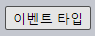

<br />

### 객체 형태 핸들러 · `handleEvent` <sub>(메서드)</sub>

##### 객체 형태 핸들러
- `addEventListener` <sub>(메서드)</sub>
  - 객체 핸들러 <sub>(함수 X)</sub> 설정 가능
- `handleEvent` <sub>(메서드)</sub>
  - 이벤트 발생 시 호출 <sub>(구현 필수)</sub>
```html
<button id="elem">클릭해 주세요.</button>

<script>
  // 객체 핸들러
  // - handleEvent (메서드) 구현
  let obj = {
    handleEvent(event) {
      event.type + " 이벤트가 " + event.currentTarget + "에서 발생했습니다.";
    }
  };

  // 객체 형태 핸들러 설정
  // - 이벤트 발생 시
  //   - obj.handleEvent(event) 호출
  elem.addEventListener('click', obj);
</script>
```

##### 클래스 사용 가능
```html
<button id="elem">클릭해 주세요.</button>

<script>
  class Menu {
    handleEvent(event) {
      switch (event.type) {
        case 'mousedown':
          elem.innerHTML = "마우스 버튼을 눌렀습니다.";
          break;
        case 'mouseup':
          elem.innerHTML += " 그리고 버튼을 뗐습니다.";
          break;
      }
    }
  }

  let menu = new Menu();

  elem.addEventListener('mousedown', menu);
  elem.addEventListener('mouseup', menu);
</script>
```

##### 다수 이벤트 처리 시 주의점
- 정확한 이벤트 타입명 명시
  - 명시한 이벤트만 처리

##### `handleEvent` <sub>(메서드)</sub>
- 모든 이벤트 처리 불필요
  - 이벤트 처리 기능 위임 가능
    - 별도 처리 메서드 호출
```html
<button id="elem">클릭해 주세요.</button>

<script>
  class Menu {

    // 이벤트 핸들러 명확히 분리
    // - 코드 변경 원활
    handleEvent(event) {

      // ex) mousedown → onMousedown
      let method = 'on' + event.type[0].toUpperCase() + event.type.slice(1);

      // 이벤트 처리 위임
      this[method](event);
    }

    // 실제 이벤트 (mousedown) 처리 메서드
    onMousedown() {
      elem.innerHTML = "마우스 버튼을 눌렀습니다.";
    }

    // 실제 이벤트 (mouseup) 처리 메서드
    onMouseup() {
      elem.innerHTML += " 그리고 버튼을 뗐습니다.";
    }
  }

  let menu = new Menu();

  elem.addEventListener('mousedown', menu);
  elem.addEventListener('mouseup', menu);
</script>
```

<br />

요약
====

#### 이벤트 핸들러 할당 · 설정 방법 <sub>(3가지)</sub>

##### 1. HTML 속성
- <… `onclick="…"`>
- HTML 태그 사이 JS 코드
  - 부조화
  - 긴 코드 삽입 시 가독성 ↓
- 다수 핸들러 할당 불가능
```html
<script>
  function myFunction() {
    '2';
  };
</script>

<!-- 함수 직접 할당 -->
<input id="elem-1" onclick="alert('1')" type="button" value="클릭해 주세요.">

<!-- 기존 함수 할당 (`(…)` 괄호 필수) -->
<input id="elem-2" onclick="myFunction()" type="button" value="클릭해 주세요.">
```

##### 2. DOM 프로퍼티
- `elem.onclick = function(…) { … }`
- 다수 핸들러 할당 불가능
```html
<input id="button" type="button" value="클릭해 주세요.">

<script>
  myFunction function() {
    '2';
  };

  // 함수 직접 할당
  button.onclick = function() {
    '1';
  };

  // 기존 함수 할당 (`(…)` (괄호) 無)
  button.onclick = myFunction;
</script>
```

##### 3. `[add·remove]EventListener` <sub>(메서드)</sub>
- 핸들러 추가 · 제거
- 다수 핸들러 설정 가능
- 코드량 ↑
- 특정 이벤트 설정 시 필수
  - `transitionend`
  - `DOMContentLoaded`
  - 기타 등등
- 객체 형태 핸들러 설정 가능
  - 핸들러 내 `handleEvent` <sub>(메서드)</sub> 호출
```html
<input id="button" type="button" value="클릭해 주세요.">

<script>
  myFunction() {
    '클릭2';
  }

  // 핸들러 설정
  elem.addEventListener( "click" , () => '클릭1');

  // 기존 함수 설정 (`(…)` (괄호) 無)
  elem.addEventListener( "click", myFunction);

  // 동일 형태 · 상이 함수
  // - 핸들러 제거 X
  elem.removeEventListener( "click" , () => '클릭1');

  // 동일 함수 (참조 필요)
  // - 핸들러 제거
  elem.removeEventListener( "click", myFunction);
</script>
```
```javascript
/* 특정 이벤트 설정 시 필수 */
// DOM 프로퍼티
// - 미동작
document.onDOMContentLoaded = function() {
  "DOM이 완성되었습니다.";
};

// addEventListener (메서드)
// - 정상 동작
document.addEventListener("DOMContentLoaded", function() {
  "DOM이 완성되었습니다.";
});
```

##### `event` <sub>(객체)</sub>
- 이벤트 관련 상세 정보 有
- 이벤트 핸들러 <sub>(함수)</sub> 1번째 인수

<br />

##  과제

### 버튼 클릭 시 특정 요소 숨기기

##### 코드 작성
- `<button>` <sub>(요소)</sub> 클릭 시
  - `<div id="text">` <sub>(요소)</sub> 사라짐

##### 결과물

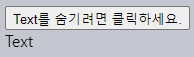

<br />


[정답](https://plnkr.co/edit/b7LXYQMsfY5Tvut8?p=preview)

<hr />

### 클릭된 요소 숨기기

##### `<button>` <sub>(요소)</sub> 작성
- 클릭 시 자신 숨기기

##### 결과물

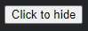

<br />


##### 핸들러 내부 `this` 사용
- '요소 자체' 참조
```html
<input onclick="this.hidden = true" type="button" value="Click to hide">
```

<hr />

### 실행 핸들러 예측

##### 버튼 클릭 시 실행될 핸들러 예측
- 버튼 이벤트 처리 핸들러 3개
```javascript
// ①
button.addEventListener("click", () => "1");

// ②
button.removeEventListener("click", () => "1");

// ③
button.onclick = () => 2;
```

<br />


#### ① · ③

##### ② `removeEventListener` <sub>(메서드)</sub>
- 1번째 등록 핸들러 제거 X
  - 동일 형태 · 상이 함수
  - 함수 참조 저장 필요
```javascript
function handler() {
  1;
}

button.addEventListener("click", handler);

// 동일 함수 (핸들러 제거)
button.removeEventListener("click", handler);
```

##### ③ `button.onclick` <sub>(DOM 프로퍼티)</sub>
- 독립적 동작
- `addEventListener` 설정 핸들러
  - 함께 동작

<hr />

### 공 가로질러 이동시키기

##### 공 이동 <sub>(클릭 위치)</sub>

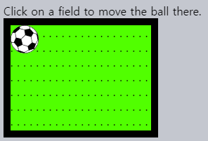

##### 조건
- 포인터 위치 == 공 중심 <sub>(클릭 시)</sub>
- CSS 애니메이션 사용 가능
- 가장자리 침범 X
- 스크롤 정상 작동

##### 참고
- 작동 시 공 · 필드 <sub>(요소)</sub> 크기 무관
- `client[X·Y]` <sub>(이벤트 객체 프로퍼티)</sub> 사용

<br />


#### 1. 공 <sub>(요소)</sub> 위치 설정 메서드

##### `position: fixed` <sub>(CSS)</sub> X
- 스크롤 이동 시 공 <sub>(요소)</sub> 이동

##### `position: absolute` <sub>(CSS)</sub> 사용
- 상대 위치 설정 <sub>(필드 요소 기준)</sub>
- 필드 <sub>(요소)</sub>
  - 자체 위치 설정 필요
```css
#field {
  width: 200px;
  height: 150px;
  position: relative;
}

#ball {
  position: absolute;

  /* 최근접 조상 (필드 요소) 기준 상대 위치 설정 */
  left: 0;
  top: 0;

  /* CSS 애니메이션 */
  transition: 1s all;
}
```

#### 2. `ball.style.[left·top]` 값 계산


##### `client[X·Y]` <sub>(이벤트 객체 프로퍼티)</sub>
- 창 기준 클릭 좌표

##### `left` <sub>(클릭 좌표)</sub> 계산 <sub>(필드 요소 기준)</sub>
```javascript
// 창 기준 클릭 좌표 - 필드 (요소) 좌측 좌표 - 테두리 두께
let left = event.clientX - fieldCoords.left - field.clientLeft;
```

##### `ball.style.left`
- 공 <sub>(요소)</sub> 좌측 가장자리
- 클릭 좌표 <sub>(`left`)</sub> 값 할당 시
  - 공 <sub>(요소)</sub> 좌측 가장자리 위치 설정
- 공 <sub>(요소)</sub> 중심 위치 설정 필요
  - 좌푯값 보정 <sub>(공 요소 너비 · 높이 절반 이동)</sub>
```javascript
// 창 기준 클릭 좌표 - 필드 (요소) 좌측 좌표 - 테두리 두께 - 공 (요소) 너비 절반
let left = event.clientX - fieldCoords.left - field.clientLeft - ball.offsetWidth / 2;
```

##### `top` <sub>(클릭 좌표)</sub> 계산 <sub>(필드 요소 기준)</sub>
- `left` <sub>(클릭 좌표)</sub> 계산 동일
```javascript
// 창 기준 클릭 좌표 - 필드 (요소) 상단 좌표 - 테두리 두께 - 공 (요소) 높이 절반
let top = event.clientY - fieldCoords.top - field.clientTop - ball.offsetHeight / 2;
```

##### 참고
- 공 <sub>(요소)</sub> `offset[*]` <sub>(기하 프로퍼티)</sub> 접근
  - `width` · `height` <sub>(CSS)</sub> 값 필요
    - 명시적 값 설정 <sub>(HTML · CSS)</sub>

[정답](https://plnkr.co/edit/RaxSzVksClBe41iu?p=preview)

<hr />

### 슬라이딩 메뉴 만들기

##### 클릭해 여닫는 메뉴 작성

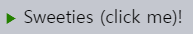

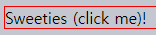

##### 참고
- 소스코드 내 HTML · CSS 수정 가능

<br />


#### 1. HTML · CSS

##### 메뉴
- 독립적인 그래픽 구성 컴포넌트
  - 단일 DOM 요소 생성
- 메뉴 목록 구성
  - `<ul>` · `<li>` <sub>(요소)</sub>
```html
<!-- 메뉴 구조 형태 -->
<div class="menu">
  <span class="title">Sweeties (click me)!</span>
  <ul>
    <li>Cake</li>
    <li>Donut</li>
    <li>Honey</li>
  </ul>
</div>
```

##### 메뉴 제목
- `<div>` <sub>(요소)</sub> X
  - 암시적인 `display: block` <sub>(CSS)</sub>
    - 가로 너비 100% 차지
```html
<div style="border: solid red 1px" onclick="alert(1)">Sweeties (click me)!</div>
```


- `<span>` <sub>(요소)</sub> 사용
  - 암시적인 `display: inline` <sub>(CSS)</sub>
    - 문자 공간만큼만 차지
```html
<span style="border: solid red 1px" onclick="alert(1)">Sweeties (click me)!</span>
```

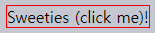

##### `click` <sub>(이벤트)</sub> 핸들러
- `<div>` <sub>(요소)</sub>
  - 빈 공간 <sub>(텍스트 우측)</sub> 有
    - `click` <sub>(이벤트)</sub> 발생 · 처리
- `<span>` <sub>(요소)</sub>
  - 빈 공간 <sub>(텍스트 우측)</sub> 無
    - `click` <sub>(이벤트)</sub> 미발생

#### 2. 메뉴 여닫기 <sub>(기능)</sub>

##### 동작
- 화살표 변경
- 메뉴 목록 표시 · 숨기기

##### 기능 구현
- CSS
  - 동작 구현
- JS
  - 메뉴 상태 설정
    - `.open` <sub>(CSS 클래스)</sub> 추가 · 제거
```css
/* 닫힌 상태 (.open CSS 클래스) 無 */
.menu ul {
  margin: 0;
  list-style: none;
  padding-left: 20px;
  display: none;
}

.menu .title::before {
  content: '▶ ';
  font-size: 80%;
  color: green;
}
```
```css
/* 열린 상태 (.open CSS 클래스) 有 */
.menu.open ul {
  display: block;
}

.menu.open .title::before {
  content: '▼ ';
}
```

[정답](https://plnkr.co/edit/ndvUGyfb4lM0B6bc?p=preview)

<hr />

### '닫기' 버튼 추가하기

##### 닫기 버튼 추가
- 각 메시지 우상단 <sub>(위치)</sub>

##### 결과물

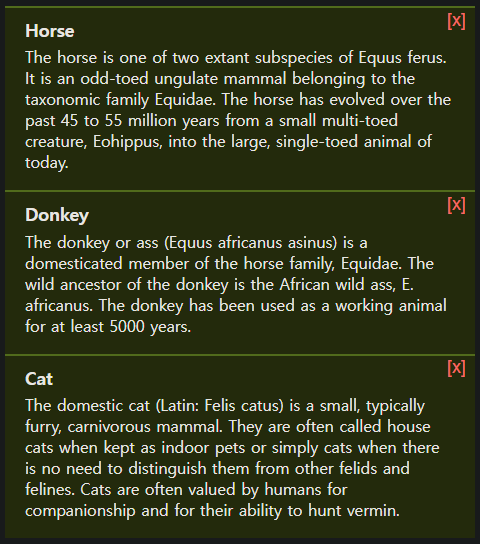

<br />


#### 2가지 방법

##### a. `position: absolute` <sub>(CSS)</sub>
- 메시지 본문 <sub>(`<pane>` 요소)</sub>
  - `position: relative` <sub>(CSS)</sub> 설정
- 좀 더 유연한 방법

##### b. `float: right` <sub>(CSS)</sub>
- 버튼 · 텍스트 겹칠 가능성 無

##### 각 메시지 본문 <sub>(`<pane>` 요소)</sub>
- 닫기 버튼 <sub>(`[x]`)</sub> 추가
```javascript
pane.insertAdjacentHTML("afterbegin", '<button class="remove-button">[x]</button>');
```

##### 닫기 버튼 <sub>(`<button>` 요소)</sub>
- `pane.firstChild` <sub>(메시지 본문 요소 1번째 자식)</sub>
  - `click` <sub>(이벤트)</sub> 핸들러 할당
```javascript
pane.firstChild.onclick = () => pane.remove();
```

[정답](https://plnkr.co/edit/77eBtLwpqwqBOe6m?p=preview)

<hr />

### 캐러셀 만들기

##### 캐러셀 <sub>(이미지 리본)</sub> 작성
- 화살표 클릭 시 이미지 스크롤 <sub>(화살표 방향)</sub>

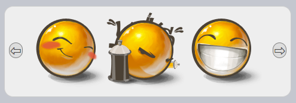

##### 추후 기능 추가 가능
- 무한 스크롤
- 동적 로딩
- 기타 등등

##### 참고
- HTML · CSS <sub>(90%)</sub>
- JS <sub>(10%)</sub>

<br />


#### 이미지 리본

##### 구성
- `<ul>` <sub>(요소)</sub>
- `<li>` <sub>(요소)</sub>
- `` <sub>(요소)</sub>

##### 너비 <sub>(보통 아주 넓음)</sub>
- 고정 크기 `<div>` <sub>(요소)</sub> 사용
  - 리본 일부분만 표시


#### 이미지 수평 나열 <sub>(적절한 CSS 프로퍼티 사용)</sub>

##### `<li>` <sub>(요소)</sub>
- `display: inline-block` 설정

##### `` <sub>(요소)</sub>
- `display: inline` <sub>(기본값)</sub>
  - 별도 공간 <sub>(글자꼬리)</sub> 有
- `display: block` 설정
  - 별도 공간 <sub>(글자꼬리)</sub> 無

##### `<ul>` <sub>(요소)</sub>
- 스크롤 담당
- 다양한 방법 有
  - `margin-left`
  - `transform: translateX(…)`
  - 기타 등등


##### 외부 `<div>` <sub>(요소)</sub>
- 고정 너비
  - 너비 외부 이미지 미표시

##### 캐러셀
- 독립적인 자체 그래픽 구성 컴포넌트
  - 단일 `<div>` <sub>(요소)</sub> 내 위치 권장

[정답](https://plnkr.co/edit/77eBtLwpqwqBOe6m?p=preview)
