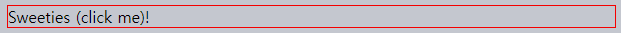

브라우저 이벤트 소개
====

##### 이벤트 <sub>(event)</sub>
- 특정 동작 발생 신호
  - 모든 DOM 노드 생성 가능
- DOM 한정 개념 X

#### 주요 DOM 이벤트

##### 마우스 이벤트
- `click`
  - 요소 위 마우스 좌측 버튼 클릭
  - 요소 위 터치스크린 탭
- `contextmenu`
  - 요소 위 마우스 우측 버튼 클릭
- `mouse[over·out]`
  - 요소 위 · 외부 마우스 커서 이동
- `mouse[down·up]`
  - 요소 위 마우스 좌측 버튼 누르기 · 떼기
- `mousemove`
  - 마우스 이동

##### 폼 요소 이벤트
- `submit`
  - 폼 <sub>(`<form>`)</sub> 제출
- `focus`
  - 폼 요소 <sub>(`<input>` 등)</sub> 포커스

##### 키보드 이벤트
- `key[down·up]`
  - 키보드 버튼 누르기 · 떼기

##### 문서 이벤트
- `DOMContentLoaded`
  - DOM 생성 <sub>(HTML 로드 · 처리)</sub> 완료

##### CSS 이벤트
- `transitionend`
  - CSS 애니메이션 종료

##### 이 외 다양한 이벤트 有
- 기타 등등

### 이벤트 핸들러 <sub>(handler)</sub>
- 이벤트 발생 시 실행
- 사용자 행동 처리 JS 코드
- 다양한 할당 방법

#### 1. HTML 속성
- HTML 내 `on<event>` <sub>(속성)</sub>

##### ex\) `<input>` <sub>(태그)</sub>
- `onclick` <sub>(속성)</sub>
  - `click` <sub>(핸들러)</sub> 할당
```html
<!--
버튼 클릭 시
- click (핸들러) 코드 실행
-->
<input value="클릭해 주세요." onclick="alert('클릭!')" type="button">
```

##### 속성값 내 따옴표 주의
- 속성값 전체
  - `""` <sub>(큰 따옴표)</sub>
- 속성값 내부
  - `''` <sub>(작은 따옴표)</sub>
  - `""` <sub>(큰 따옴표)</sub> 사용 시 작동 X
```html
<!-- 잘못된 따옴표 사용 -->
<… onclick="alert("클릭!")" … >
```

##### 할당 과정
1. 핸들러 → HTML 속성 할당
2. 속성값 이용해 새 함수 생성 <sub>(브라우저)</sub>
3. 생성된 새 함수 → DOM 프로퍼티 할당

##### 긴 코드
- HTML 속성값 직접 할당 X
- 함수 생성 후 호출

##### 버튼 클릭 시 `countRabbits()` <sub>(함수)</sub> 호출
```html
<script>
  function countRabbits() {
    for (let i=1; i<=3; i++) {
      alert(`토끼 ${i}마리`);
    }
  }
</script>

<input type="button" onclick="countRabbits()" value="토끼를 세봅시다!">
```


##### 대 · 소문자 구분 X
- `ONCLICK` == `onClick` == `onCLICK`
- 보통 소문자 작성
  - `onclick`

#### 2. DOM 프로퍼티
- `on<event>` <sub>(DOM 프로퍼티)</sub>

##### ex\) `elem.onclick` <sub>(프로퍼티)</sub>
```html
<input id="elem" type="button" value="클릭해 주세요.">
<script>
  elem.onclick = function() {
    alert('감사합니다.');
  };
</script>
```


##### 대·소문자 구분
- `elem.onclick` <sub>(O)</sub>
- `elem.ONCLICK` <sub>(X)</sub>

#### HTML 속성 · DOM 프로퍼티
- 동일 작업

##### 1. HTML만 사용 <sub>(HTML 속성)</sub>
```html
<!-- button.onclick 초기화 -->
<input type="button" onclick="alert('클릭!')" value="클릭해 주세요.">
```


##### 2. HTML · JS 함께 사용 <sub>(DOM 프로퍼티)</sub>
```html
<input type="button" id="button" value="클릭해 주세요.">
<script>
  button.onclick = function() {
    alert('클릭!');
  };
</script>
```


##### `onclick` <sub>(프로퍼티)</sub>
- 단 하나 존재
  - 복수 이벤트 핸들러 할당 X
- 핸들러 하나 더 추가 시
  - 기존 핸들러 덮어씌워짐
```html
<input type="button" id="elem" onclick="alert('이전')" value="클릭해 주세요.">
<script>
  // 기존 작성된 핸들러 덮어씀
  elem.onclick = function() {
    alert('이후');
  };
</script>
```

##### 핸들러 제거
- `null` 할당
  - ex\) `elem.onclick = null`

### `this` <sub>(요소 접근)</sub>

##### 핸들러 내부 `this` 값
- 핸들러 할당 요소

##### ex\) `this.innerHTML`
- `this` == `<button>` <sub>(요소)</sub>
- 버튼 클릭 시
  - 버튼 내 콘텐츠 얼럿창 출력
```html
<button onclick="alert(this.innerHTML)">클릭해 주세요.</button>
```


### 흔한 실수

##### DOM 프로퍼티
- `(…)` <sub>(괄호)</sub> X
```javascript
function sayThanks() {
  alert('감사합니다!');
}

// 올바른 방법
// - 함수 할당
elem.onclick = sayThanks;

// 틀린 방법
// - 함수 호출 · 반환 값 할당
// - 반환 값 부재 시
//   - undefined 할당
elem.onclick = sayThanks();
```

##### HTML 속성값
- `(…)` <sub>(괄호)</sub> 필요
```html
<input type="button" id="button" onclick="sayThanks()">
```

##### HTML 속성값 : `(…)` <sub>(괄호)</sub> 필요 이유
1. 속성값 읽음 <sub>(브라우저)</sub>
2. 핸들러 함수 생성
    - 속성값 → 함수 본문
3. `onclick` <sub>(프로퍼티)</sub>
    - 생성된 새 함수 할당
```javascript
button.onclick = function() {
  sayThanks(); // 속성값
};
```

##### `setAttribute` 사용 X
- 속성
  - 항상 문자열
- 함수
  - 문자열 되어버림
```javascript
// <body> (요소) 클릭 시 에러 발생
document.body.setAttribute('onclick', function() { alert(1) });
```

### `addEventListener` <sub>(메서드)</sub>

##### 기존 핸들러 할당 방식 <sub>(HTML 속성 · DOM 프로퍼티)</sub> 문제점
- 이벤트 하나만 할당
  - 복수 핸들러 할당 X

##### 복수 이벤트
- 복수 이벤트 핸들러 필요
- ex\) 버튼 클릭 시
  - 버튼 강조
  - 메시지 표시

##### 기존 핸들러 할당 방식 <sub>(HTML 속성 · DOM 프로퍼티)</sub>
- 프로퍼티 덮어씌어짐
```javascript
input.onclick = function() { alert(1); }
…

// 이전 핸들러 덮어씀
input.onclick = function() { alert(2); }
```

#### `[add·remove]EventListener` <sub>(메서드)</sub>
- 복수 핸들러 할당

##### 문법
```javascript
element.addEventListener(event, handler, [options]);
element.removeEventListener(event, handler, [options]);
```
- `event`
  - 이벤트명 <sub>('click' 등)</sub>
- `handler`
  - 핸들러 함수
- `[options]` <sub>(객체)</sub>
  - 핸들러 설정
```javascript
/* options (인수) */
{
  /* 1회용 리스너 설정
   - 이벤트 발생 시 리스너 자동 삭제 여부
   */
  once: boolean,

  /* 이벤트 처리 단계 설정
   호환성 유지 기능
   - options (인수)
     - boolean (非객체 인수) 전달 시
       - { capture: boolean } 동일
   */
  capture: boolean,

  // 리스너 지정 함수
  // - `preventDefault()` 미호출 여부
  passive: biolean
}
```

<br />

 **동일 함수만 삭제 가능**

##### 핸들러 삭제 시
- 할당 시 사용한 함수 그대로 전달

##### 동일 모양 · 다른 함수
```javascript
elem.addEventListener( "click" , () => alert('감사합니다!'));
…

// 핸들러 삭제 X
elem.removeEventListener( "click", () => alert('감사합니다!'));

↓↓↓

function handler() {
  alert( '감사합니다!' );
}

input.addEventListener("click", handler);
…
input.removeEventListener("click", handler);
```

##### 핸들러 함수
- 변수 미저장 시
  - 핸들러 삭제 X
- `addEventListener` <sub>(메서드)</sub> 할당 함수
  - 불러올 방법 X

<br />

##### `addEventListener` <sub>(메서드)</sub> 복수 호출
- 복수 핸들러 할당
```html
<input id="elem" type="button" value="클릭해 주세요."/>

<script>
  function handler1() {
    alert('감사합니다!');
  };

  function handler2() {
    alert('다시 한번 감사합니다!');
  }

  elem.onclick = () => alert("안녕하세요.");

  // "감사합니다!"
  elem.addEventListener("click", handler1);

  // "다시 한번 감사합니다!"
  elem.addEventListener("click", handler2);
</script>
```

<br />

 **특정 이벤트 : `addEventListener` <sub>(메서드)</sub> 로만 할당 가능**

##### DOM 프로퍼티 할당 불가 이벤트
- `addEventListener` <sub>(메서드)</sub> 사용

##### ex\) `DOMContentLoaded` <sub>(이벤트)</sub>
- 문서 읽고 DOM 트리 생성 완료 시 발생
```javascript
// DOM 프로퍼티 할당
// - 얼럿창 동작 X
document.onDOMContentLoaded = function() {
  alert("DOM이 완성되었습니다.");
};

// addEventListener (메서드)
// - 얼럿창 정상 동작
document.addEventListener("DOMContentLoaded", function() {
  alert("DOM이 완성되었습니다.");
});
```

##### `addEventListener` <sub>(메서드)</sub> 담당 작업
- 범용적인 리스너 할당
- 예외적인 이벤트 할당

<br />

### 이벤트 <sub>(객체)</sub>

##### 이벤트 처리 시 상세 정보 필요
- 'click' <sub>(이벤트)</sub>
  - 마우스 포인터 위치 등
- 'keydown' <sub>(이벤트)</sub>
  - 눌려진 키 종류 등
- 기타 등등

##### 이벤트 발생 시
- 이벤트 <sub>(객체)</sub> 생성
  - 이벤트 관련 상세 정보 보유
  - 핸들러 인수 전달

##### ex\) 포인터 좌표 정보 얻기 <sub>(이벤트 객체)</sub>
```html
<input type="button" value="클릭해 주세요." id="elem">

<script>
  elem.onclick = function(event) {

    // 이벤트 타입 · 요소 · 발생 좌표
    alert(event.type + " 이벤트가 " + event.currentTarget + "에서 발생했습니다.");
    alert("이벤트가 발생한 곳의 좌표는 " + event.clientX + ":" + event.clientY +"입니다.");
  };
</script>
```

#### 이벤트 <sub>(객체)</sub> 프로퍼티 일부

##### `type` <sub>(문자열)</sub>
- 이벤트 타입
  - ex\) `'click'`

##### `currentTarget` <sub>(요소 객체)</sub>
- 이벤트 처리 요소
- `this` 값 동일
  - 예외 <sub>(값 상이)</sub>
    - 화살표 함수 핸들러
    - 다른 곳에 바인딩

##### `client[X·Y]`
- 커서 상대 좌표 <sub>(포인터 관련 이벤트)</sub>
  - 브라우저 화면 기준
  - 모니터 기준 X

##### 이 외 다양한 프로퍼티 존재
- 타입 별 지원 프로퍼티 상이

<br />

 **이벤트 <sub>(객체)</sub> : HTML 핸들러 내 접근 가능**

##### HTML 속성 핸들러 할당 시
- 생성된 핸들러 함수 구성
  - 1번째 인수
    - `event` <sub>(객체)</sub>
  - 본문
    - 속성값
```html
<input type="button" onclick="alert(event.type)" value="이벤트 타입">
```


```javascript
// 1번째 인수
// - event (객체)
function(event) {

  // 본문
  // - 속성값
  alert(event.type);
}
```

<br />

### 객체 형태 핸들러 · `handleEvent` <sub>(메서드)</sub>

##### `addEventListener` <sub>(메서드)</sub>
- 함수 외 객체
  - 이벤트 핸들러로 할당 가능
- 이벤트 발생 시
  - `handleEvent` <sub>(객체 구현 메서드)</sub> 호출
```html
<button id="elem">클릭해 주세요.</button>

<script>
  let obj = {
    handleEvent(event) {
      alert(event.type + " 이벤트가 " + event.currentTarget + "에서 발생했습니다.");
    }
  };

  // 객체 형태 인수 (핸들러)
  // - 이벤트 발생 시
  //   - obj.handleEvent(event) 호출
  elem.addEventListener('click', obj);
</script>
```

##### 클래스 사용 가능
```html
<button id="elem">클릭해 주세요.</button>

<script>
  class Menu {
    handleEvent(event) {
      switch (event.type) {
        case 'mousedown':
          elem.innerHTML = "마우스 버튼을 눌렀습니다.";
          break;
        case 'mouseup':
          elem.innerHTML += " 그리고 버튼을 뗐습니다.";
          break;
      }
    }
  }

  let menu = new Menu();

  elem.addEventListener('mousedown', menu);
  elem.addEventListener('mouseup', menu);
</script>
```

##### 복수 이벤트 처리 주의점
- 정확한 이벤트 타입 명시
  - 명시한 이벤트만 처리

##### `handleEvent` <sub>(메서드)</sub>
- 모든 이벤트 처리 불필요
- 이벤트 관련 기능 위임 가능
  - 별도 처리 메서드 호출
```html
<button id="elem">클릭해 주세요.</button>

<script>
  class Menu {
    handleEvent(event) {

      // mousedown → onMousedown
      let method = 'on' + event.type[0].toUpperCase() + event.type.slice(1);

      // 이벤트 처리 위임
      this[method](event);
    }

    // 실제 이벤트 처리 메서드
    onMousedown() {
      elem.innerHTML = "마우스 버튼을 눌렀습니다.";
    }

    // 실제 이벤트 처리 메서드
    onMouseup() {
      elem.innerHTML += " 그리고 버튼을 뗐습니다.";
    }
  }

  let menu = new Menu();
  elem.addEventListener('mousedown', menu);
  elem.addEventListener('mouseup', menu);
</script>
```

##### 이벤트 핸들러 명확히 분리
- 코드 변경 원활

<br />

요약
====

#### 이벤트 핸들러 할당 방법 <sub>(3가지)</sub>

##### 1. HTML 속성
- <… `onclick="…"` …>
- 자주 사용 X
- HTML 태그 중간 JS 코드
  - 어색함
  - 긴 코드 X
- 복수 핸들러 할당 X
```html
<script>
  elem.onclick = myFunction() {
    alert('2');
  };
</script>

<!-- 함수 직접 할당 -->
<input id="elem-1" onclick="alert('1')" type="button" value="클릭해 주세요.">

<!--
기존 함수 할당
- 함수 뒤 `(…)` (괄호) 필요 (함수 본문 삽입)
-->
<input id="elem-2" onclick="myFunction()" type="button" value="클릭해 주세요.">
```

##### 2. DOM 프로퍼티
- `elem.onclick = function(…) { … }`
- 복수 핸들러 할당 X
```html
<input id="button" type="button" value="클릭해 주세요.">
<script>
  button.onclick = function() {
    alert('1');
  };

  // 기존 함수 할당
  // - 함수 뒤 `(…)` (괄호) X
  myFunction function() {
    alert('2');
  };
  button.onclick = myFunction;
</script>
```

##### 3. `[add·remove]EventListener` <sub>(메서드)</sub>
- 핸들러 추가 · 제거
- 가장 유연
- 가장 많은 코드량
- 특정 이벤트 전용 담당
  - `transitionend`
  - `DOMContentLoaded`
  - 기타 등등
- 객체 형태 핸들러
  - `handleEvent` <sub>(객체 구현 메서드)</sub> 호출
```html
<input id="button" type="button" value="클릭해 주세요.">

<script>
  elem.addEventListener( "click" , () => alert('클릭1'));

  // 기존 함수 할당
  // - 함수 뒤 `(…)` (괄호) X
  myFunction() {
    alert('클릭2');
  }
  elem.addEventListener( "click", myFunction);

  // 리스너 삭제 X
  // - 모양은 같지만 동일 함수 X
  elem.removeEventListener( "click" , () => alert('클릭1'));

  // 리스너 삭제
  // - 동일 함수 참조 필요
  elem.removeEventListener( "click", myFunction);
</script>
```
```javascript
/* 특정 이벤트 등록 전용 */
// DOM 프로퍼티
// - 얼럿창 동작 X
document.onDOMContentLoaded = function() {
  alert("DOM이 완성되었습니다.");
};

// addEventListener (메서드)
// - 얼럿창 정상 동작
document.addEventListener("DOMContentLoaded", function() {
  alert("DOM이 완성되었습니다.");
});
```

##### `event` <sub>(객체)</sub>
- 이벤트 관련 상세 정보 보유
- 이벤트 핸들러 함수 1번째 인수

<br />

##  과제

### 버튼 클릭 시 특정 요소 숨기기

##### `button` <sub>(요소)</sub> : JS 코드 추가
- 요소 클릭 시
  - `<div id="text">` 사라짐

##### 결과물


<br />


[정답](https://plnkr.co/edit/b7LXYQMsfY5Tvut8?p=preview)

<hr />

### 클릭된 요소 숨기기

##### 클릭 시 자신 숨기는 버튼 작성

##### 결과물


<br />


##### 핸들러 내부 `this`
- '요소 자체' 참조
```html
<input type="button" onclick="this.hidden=true" value="Click to hide">
```

<hr />

### 실행 핸들러 맞추기

##### 버튼 클릭 시 실행될 핸들러 맞추기
- 버튼 이벤트 처리 담당 핸들러 3개
```javascript
// ①
button.addEventListener("click", () => alert("1"));

// ②
button.removeEventListener("click", () => alert("1"));

// ③
button.onclick = () => alert(2);
```

<br />


#### ① · ③

##### ② `removeEventListener` <sub>(메서드)</sub>
- 1번째 등록 핸들러 제거 X
  - 동일 모양 · 다른 함수
  - 함수 참조 저장 필요
```javascript
function handler() {
  alert(1);
}

button.addEventListener("click", handler);
button.removeEventListener("click", handler);
```

##### ③ `button.onclick`
- 독립적으로 동작
- `addEventListener` 등록 핸들러
  - 함께 동작

<hr />

### 공 : 가로질러 이동시키기

##### 클릭 위치로 공 이동시키기


##### 조건
- 클릭 시
  - 포인터 위치 == 공 중심
- CSS 애니메이션 사용 가능
- 가장자리 침범 X
- 동시에 스크롤 정상 작동

##### 참고
- 공 · 필드 크기 관계없이 작동
- 클릭 좌표
  - `event.client[X·Y]`

<br />


#### 1. 공 <sub>(요소)</sub> 위치 메서드

##### `position: fixed` <sub>(CSS 프로퍼티)</sub> X
- 스크롤 이동 시 공 <sub>(요소)</sub> 위치 변경

##### `position:absolute` <sub>(CSS 프로퍼티)</sub> 사용
- 필드 <sub>(요소)</sub> 자체 위치 설정
- 공 <sub>(요소)</sub> 위치
  - 상대 위치 설정 <sub>(필드 요소 기준)</sub>
```css
#field {
  width: 200px;
  height: 150px;
  position: relative;
}

#ball {
  position: absolute;

  /* 최근접 조상 기준 상대 위치 설정 (필드 요소) */
  left: 0;
  top: 0;

  /* CSS animation */
  transition: 1s all;
}
```

#### 2. 정확한 `ball.style.[left·top]` 값 할당
- 상대 위치 좌표 <sub>(필드 요소 기준)</sub>


##### `event.client[X·Y]`
- 창 기준 좌표

##### 창 기준 `left` 좌표
```javascript
// 창 기준 좌표 - 필드 좌측 가장자리 - 테두리 두께
let left = event.clientX - fieldCoords.left - field.clientLeft;
```

##### `ball.style.left`
- 공 <sub>(요소)</sub> 좌측 가장자리
- `left` 값 할당 시
  - 커서 위치 : 공 <sub>(요소)</sub> 가장자리
- 공 <sub>(요소)</sub> 중심 위치 설정
  - 너비 · 높이 절반만큼씩 이동

##### 최종 창 기준 `left` 값
```javascript
let left = event.clientX - fieldCoords.left - field.clientLeft - ball.offsetWidth / 2;
```

##### 세로 좌표 계산
- 가로 좌표 <sub>(`left`)</sub> 계산 동일

##### 공 <sub>(요소)</sub> `offsetWidth` <sub>(프로퍼티)</sub> 접근 시
- `width` · `height` <sub>(프로퍼티)</sub> 알고 있어야함
  - HTML · CSS 내 값 설정 필요

[정답](https://plnkr.co/edit/RaxSzVksClBe41iu?p=preview)

<hr />

### 슬라이딩 메뉴 만들기

##### 클릭해 여닫는 메뉴 작성


##### 참고
- 기존 제공 코드 <sub>(HTML · CSS)</sub> 수정

<br />


#### HTML · CSS

##### 메뉴
- 독립적인 그래픽 구성 컴포넌트
  - 하나의 DOM 요소 생성
- 메뉴 목록 구성
  - `<ul>` <sub>(요소)</sub>
  - `<li>` <sub>(요소)</sub>

##### 예시
```html
<div class="menu">
  <span class="title">Sweeties (click me)!</span>
  <ul>
    <li>Cake</li>
    <li>Donut</li>
    <li>Honey</li>
  </ul>
</div>
```

##### 제목 요소
- `<div>` <sub>(요소)</sub> X
  - 암시적인 `display: block` <sub>(속성)</sub>
    - 가로 너비 100% 차지
```html
<div style="border: solid red 1px" onclick="alert(1)">Sweeties (click me)!</div>
```



- `<span>` <sub>(요소)</sub> 사용
  - 암시적인 `display: inline` <sub>(속성)</sub>
    - 문자 공간만큼만 차지
```html
<span style="border: solid red 1px" onclick="alert(1)">Sweeties (click me)!</span>
```


##### `onclick` 핸들러 할당 시
- `<div>` <sub>(요소)</sub>
  - 텍스트 우측 <sub>(빈 공간)</sub>
    - 요소 차지
    - 클릭 이벤트 처리
- `<span>` <sub>(요소)</sub>
  - 텍스트 우측 <sub>(빈 공간)</sub> X
    - 문자 공간만큼만 차지
    - 클릭 이벤트 작동 X

#### 메뉴 여닫기
- 화살표 변경
- 메뉴 표시 · 숨기기

##### 메뉴 여닫기 기능 구현
- CSS
  - 완벽히 구현 가능
- JS
  - 메뉴 상태명 설정
    - `.open` <sub>(클래스)</sub>
```css
/*
 닫힌 상태
 - .open (클래스) X
 */
.menu ul {
  margin: 0;
  list-style: none;
  padding-left: 20px;
  display: none;
}

.menu .title::before {
  content: '▶ ';
  font-size: 80%;
  color: green;
}
```
```css
/*
 열린 상태
 - .open (클래스)
 */
.menu.open .title::before {
  content: '▼ ';
}

.menu.open ul {
  display: block;
}
```

[정답](https://plnkr.co/edit/ndvUGyfb4lM0B6bc?p=preview)

<hr />

### '닫기' 버튼 추가하기

##### 각 메시지 우상단
- 닫기 버튼 추가

##### 결과물


<br />


#### 2가지 방법

##### 1. `position: absolute` <sub>(CSS 프로퍼티)</sub>
- 메시지 본문 <sub>(`<pane>` 요소)</sub>
  - `position: relative`
- 좀 더 유연한 방법

##### 2. `float: right` <sub>(CSS 프로퍼티)</sub>
- 버튼 · 텍스트
  - 절대 겹치지 않음

##### 각 `<pane>` <sub>(요소)</sub>
- 닫기 <sub>(`[x]`)</sub> 버튼 추가
```javascript
pane.insertAdjacentHTML("afterbegin", '<button class="remove-button">[x]</button>');
```

##### `<button>` <sub>(닫기 버튼 요소)</sub>
- `pane.firstChild`
  -  핸들러 추가
```javascript
pane.firstChild.onclick = () => pane.remove();
```

[정답](https://plnkr.co/edit/77eBtLwpqwqBOe6m?p=preview)

<hr />

### 캐러셀 만들기

##### 이미지 리본
- 화살표 클릭 시
  - 해당 방향으로 이미지 스크롤


##### 추후 기능 추가
- 무한 스크롤링
- 동적 로딩
- 기타 등등

##### 참고
- HTML · CSS <sub>(90%)</sub>
- JS <sub>(10%)</sub>

<br />


##### 이미지 리본 표현
- `<ul>` <sub>(요소)</sub>
- `<li>` <sub>(요소)</sub>
- `` <sub>(요소)</sub>

##### 보통 아주 긴 이미지 리본
- 고정 크기 `<div>` <sub>(요소)</sub> 사용
  - 리본 일부분만 화면 표시


#### 이미지 수평 나열 작업
- 적절한 CSS 프로퍼티 사용

##### `<li>` <sub>(요소)</sub>
- `display: inline-block`

##### `` <sub>(요소)</sub>
- `display: inline` <sub>(기본값)</sub>
  - 글자꼬리 위한 별도 공간 존재
- `display: block` <sub>(수정)</sub>
  - 글자꼬리 위한 별도 공간 제거

##### `<ul>` <sub>(요소)</sub>
- 스크롤링 기능 담당 <sub>(요소 밀기)</sub>
- 다양한 방법 가능
  - `margin-left` <sub>(속성)</sub> 값 ↑
  - `transform: translateX()` <sub>(속성)</sub>


##### 외부 `<div>` <sub>(요소)</sub>
- 고정 너비
  - 너비 밖 이미지 잘림

##### 캐러셀
- 독립적인 자체 그래픽 구성 컴포넌트
  - `<div>` <sub>(요소)</sub> 로 감싸기
    - 요소 내 스타일 적용

[정답](https://plnkr.co/edit/77eBtLwpqwqBOe6m?p=preview)
