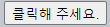

버블링 · 캡처링
====

##### `<div>` <sub>(요소)</sub> 이벤트 핸들러
- 중첩 태그 `click` <sub>(이벤트)</sub> 대상 동작
  - `<em>` <sub>(요소)</sub>
  - `<code>` <sub>(요소)</sub>
  - 기타 등등
```html
<div onclick="alert('div에 할당한 핸들러!')">
  <em>
    <code>EM</code>을 클릭했는데도
    <code>DIV</code>에 할당한 핸들러가 동작합니다.
  </em>
</div>
```


### 버블링

##### 발생 원리 <sub>(과정)</sub>
1. 특정 요소 이벤트 발생
2. 해당 요소 핸들러 동작
3. 부모 요소 핸들러 동작
4. 조상 요소 핸들러 동작
5. …
6. 최상단 조상 요소 핸들러 동작 <sub>(종료)</sub>

##### `FORM > DIV > P` <sub>(중첩 구조)</sub>
- 각각 이벤트 핸들러 할당
```html
<style>
  body * {
    margin: 10px;
    border: 1px solid blue;
  }
</style>

<form onclick="alert('form')">FORM
  <div onclick="alert('div')">DIV
    <p onclick="alert('p')">P</p>
  </div>
</form>
```


##### `<p>` <sub>(요소)</sub> 클릭 시
1. `<p>` <sub>(가장 내부 요소)</sub> 핸들러 동작
2. `<div>` <sub>(외부 요소)</sub> 핸들러 동작
3. `<form>` <sub>(더 외부 요소)</sub> 핸들러 동작
4. …
5. `document` <sub>(객체)</sub> 핸들러 동작 <sub>(종료)</sub>


<br />

 **대다수 이벤트 버블링 발생**

##### 일부 이벤트 버블링 미발생
- ex\) `focus` 등

<br />

### `target` <sub>(이벤트 객체 프로퍼티)</sub>

##### _target_ 요소 <sub>(`target` 프로퍼티)</sub>
- 이벤트 발생한 가장 내부 요소

#### `target` vs `this` <sub>(`currentTarget`)</sub>

##### `target` <sub>(이벤트 객체 프로퍼티)</sub>
- '타깃' 요소 <sub>(버블링 무관)</sub>
  - 이벤트 시작 지점
- 부모 요소 핸들러
  - 이벤트 시작 요소 상세 정보 접근 가능

##### `this` <sub>(`currentTarget` 이벤트 객체 프로퍼티)</sub>
- '현재' 요소 <sub>(버블링 진행 중 변경)</sub>
  - 버블링 진행 중 현재 위치 요소
  - 현재 실행 중인 핸들러 할당 요소 참조

- 핸들러는 form.onclick 하나밖에 없지만 이 핸들러에서 폼 안의 모든 요소에서 발생하는 클릭 이벤트를 ‘잡아내고(catch)’ 있습니다. 
- 클릭 이벤트가 어디서 발생했든 상관없이 `<form>` 요소까지 이벤트가 버블링 되어 핸들러를 실행시키기 때문입니다.
- form.onclick 핸들러 내의 this와 event.target은 다음과 같습니다.
- `this(event.currentTarget)`
  - `<form>` 요소에 있는 핸들러가 동작했기 때문에 `<form>` 요소를 가리킵니다.
- `event.target`
  - 폼 안쪽에 실제 클릭한 요소를 가리킵니다.

#### `<form id="form">` <sub>(요소)</sub>

##### 이벤트 핸들러 1개 <sub>(`onclick`)</sub>
- 폼 내 모든 요소 클릭 이벤트 처리

##### 이벤트 버블링 진행
- '타깃' → … → `<form>` <sub>(요소)</sub>
  - 진행 과정 내 모든 요소 핸들러 실행

##### `form.onclick` <sub>(핸들러)</sub>
- `event.target`
  - 폼 내부 실제 클릭한 요소
- `this` <sub>(`event.currentTarget`)</sub>
  - `<form>` <sub>(요소)</sub>
- 두 값 동일
  - 정확히 `<form>` <sub>(요소)</sub> 클릭

##### 결과


```html
<!-- index.html -->
<!DOCTYPE HTML>
<html>

<head>
  <meta charset="utf-8">
  <link rel="stylesheet" href="example.css">
</head>

<body>
  클릭하면 <code>event.target</code>과 <code>this</code>정보를 볼 수 있습니다.

  <form id="form">FORM
    <div>DIV
      <p>P</p>
    </div>
  </form>

  <script src="script.js"></script>
</body>
</html>
```
```javascript
/* script.js */
form.onclick = function(event) {
  event.target.style.backgroundColor = 'yellow';

  // 크롬 (브라우저)
  // - 노란색 칠하는데 약간의 시간 필요
  setTimeout(() => {
    alert("target = " + event.target.tagName + ", this=" + this.tagName);
    event.target.style.backgroundColor = ''
  }, 0);
};
```
```css
/* example.css */
form { background-color: green; position: relative; width: 150px; height: 150px; text-align: center; cursor: pointer; }
div { background-color: blue; position: absolute; top: 25px; left: 25px; width: 100px; height: 100px; }
p { background-color: red; position: absolute; top: 25px; left: 25px; width: 50px; height: 50px; line-height: 50px; margin: 0; }
body { line-height: 25px; font-size: 16px; }
```

### 버블링 중단하기

##### 일반적인 이벤트 버블
- 타깃 <sub>(이벤트 발생 요소)</sub> → `document` <sub>(객체)</sub>
  - 거쳐가는 각 노드 모두 이벤트 발생

##### 몇몇 이벤트 버블
- 타깃 <sub>(이벤트 발생 요소)</sub> → `window` <sub>(전역 객체)</sub>
  - 거쳐가는 각 노드 모두 이벤트 발생

##### `event.stopPropagation()` <sub>(메서드)</sub>
- 핸들러 : 이벤트 완전히 처리 후
  - 버블링 중단

##### ex\) `<button>` <sub>(요소)</sub> 클릭 시
- `body.onclick` <sub>(핸들러)</sub> 동작 X
```html
<body onclick="alert(`버블링은 여기까지 도달하지 못합니다.`)">
  <button onclick="event.stopPropagation()">클릭해 주세요.</button>
</body>
```



<br />

 **`event.stopImmediatePropagation()` <sub>(메서드)</sub>**

##### 한 요소 특정 이벤트 처리 핸들러 다수 경우
- 핸들러 중 하나 버블링 중단 시
  - 나머지 핸들러 여전히 동작

##### `event.stopPropagation()` <sub>(메서드)</sub>
- 버블링 중단
- 타 핸들러들 여전히 동작

##### `event.stopImmediatePropagation()` <sub>(메서드)</sub>
- 버블링 중단
- 타 핸들러들 동작 중단

<br />

 **버블링 막지 말기 <sub>(필요한 경우 제외)</sub>**

##### 아키텍처 신중히 고려
- 진짜 막아야 하는 상황에서만 버블링 막기

##### `event.stopPropagation()` <sub>(메서드)</sub>
- 추후 문제될 상황 유발 가능

#### 문제될만한 시나리오

##### 1. 중첩 메뉴
- 각 서브 메뉴 요소 대상 클릭 이벤트 처리
- 상위 메뉴 요소 클릭 이벤트 핸들러
  - `stopPropagation` 적용 시
    - 서브 메뉴 클릭 이벤트 처리 X

##### 2. 행동 패턴 분석 <sub>(사람들 페이지 내 클릭 위치 등)</sub> 실행
- window 내 발생 클릭 이벤트 전부 감지
  - 일부 분석 시스템 분석 방식 <sub>(실무)</sub>
```javascript
document.addEventListener('click'…)`
```

##### 3. 버블링 막힌 영역 <sub>(중첩 메뉴 요소)</sub>
- 분석 시스템 코드 동작 X
  - 분석 제대로 실행 X
  - '죽은 영역'

##### 이벤트 버블링 막아야 하는 경우
- 거의 없음
- 버블링 막아야 해결되는 문제
  - 커스텀 이벤트 등 사용해 문제 해결

##### 한 가지 이벤트 버블링 통제 방식
- 핸들러 내 `event` <sub>(객체)</sub>
  - 데이터 저장 <sub>(다른 핸들러 접근)</sub>
- 아래쪽 일 <sub>(`event` 객체 내 저장 데이터)</sub>
  - 부모 요소 핸들러 전달

<br />

### 캡처링

##### 표준 [DOM 이벤트](https://www.w3.org/TR/DOM-Level-3-Events/) 정의 이벤트 흐름 <sub>(3가지 단계)</sub>
- 캡처링 단계
  - 이벤트 : 하위 요소 전파
- 타깃 단계
  - 이벤트 : 실제 타깃 요소 전달
- 버블링 단계
  - 이벤트 : 상위 요소 전파

##### ex\) 테이블 내 `<td>` <sub>(요소)</sub> 클릭
1. 캡처링 단계
    - 이벤트 전파 <sub>(최상위 조상 → 아래쪽)</sub>
2. 타깃 단계
    - 이벤트 도착 · 실행 <sub>(타깃 요소)</sub>
3. 버블링 단계
    - 이벤트 전파 <sub>(타깃 요소 → 위쪽)</sub>


##### 캡처링
- **사용 경우 흔치 않음**
- 캡처링 관련 코드
  - 발견할 일 거의 없음

##### 할당 핸들러 <sub>(HTML 속성 · DOM 프로퍼티 · 할당 메서드)</sub>
- 캡처링 단계
  - 미인식 <sub>(동작 X)</sub>
- 타깃 · 버블링 단계
  - 동작

##### 캡처링 단계 핸들러 동작 설정
- `addEventListener` <sub>(메서드)</sub> 옵션 설정
  - `capture: true`
```javascript
// 옵션 객체 (인수) 전달
elem.addEventListener( …, { capture: true } )

// boolean (인수) 전달
elem.addEventListener( …, true )
```

##### `[capture]` 값
- `false` <sub>(기본값)</sub>
  - 버블링 단계 동작
- `true`
  - 캡처링 단계 동작

##### 공식적으로 총 3개 이벤트 흐름
- 타깃 단계 <sub>(2번째 단계)</sub>
  - 별도 처리 X
- 캡처링 · 버블링 단계 핸들러
  - 타깃 단계에서 트리거

##### ex\) 캡처링 · 버블링 진행 순서
- 문서 내 요소 '전체'
  - 핸들러 할당
    - 캡처링 단계 1개
    - 버블링 단계 1게
```html
<style>
  body * { margin: 10px; border: 1px solid blue; }
</style>

<form>FORM
  <div>DIV
    <p>P</p>
  </div>
</form>

<script>
  // 문서 내 요소 전체
  for (let elem of document.querySelectorAll('*')) {

    // 캡처링 단계 핸들러
    elem.addEventListener("click", e => alert(`캡처링: ${elem.tagName}`), true);

    // 버블링 단계 핸들러
    elem.addEventListener("click", e => alert(`버블링: ${elem.tagName}`));
  }
</script>
```


##### `<p>` <sub>(요소)</sub> 클릭 시 이벤트 전달 순서
1. `HTML` → `BODY` → `FORM` → `DIV`
    - 캡처링 단계
2. `P`
    - 타깃 단계
    - 캡처링 · 버블링 둘 다 핸들러 설정
      - 2번 호출
3. `DIV` → `FORM` → `BODY` → `HTML`
    - 버블링 단계

##### `event.eventPhase` <sub>(프로퍼티)</sub>
- 현재 발생 중인 이벤트 흐름 단계 정보
- 정숫값 반환
  - 현재 실행 단계 구분
- 드물게 사용
  - 핸들러 통해 흐름 단계 구분 가능

<br />

 **핸들러 등록 · 제거 : 동일 단계 설정**

#### 핸들러 할당 · 삭제

#####  `addEventListener(…, true)` <sub>(캡처링 단계)</sub>
- `removeEventListener(…, true)` <sub>(O)</sub>
- `removeEventListener(…)` <sub>(X)</sub>

##### `addEventListener(…)` <sub>(버블링 단계)</sub>
- `removeEventListener(…, true)` <sub>(X)</sub>
- `removeEventListener(…)` <sub>(O)</sub>

<br />

 **동일 요소 · 단계 이벤트 리스너 : 설정 순서대로 동작**

##### 특정 요소 : 한 단계 이벤트 핸들러 다수 설정 시
- 설정 순서대로 동작 <sub>(`addEventListener` 메서드)</sub>
```javascript
// 1번째 트리거
elem.addEventListener("click", e => alert(1));

// 2번째 트리거
elem.addEventListener("click", e => alert(2));
```

<br />

요약
====

##### 타깃 요소 <sub>(`event.target`)</sub>
- 이벤트 발생한 가장 내부 요소

#### 이벤트 흐름

##### 캡처링 단계
- 최상위 노드 → `event.target`
- 각 요소 동작 핸들러
  - `addEventListener`
    - `(…, true)`
    - `(…, { capture: true })`

##### 타깃 단계
- 타깃 요소 설정 핸들러 호출

##### 버블링 단계
- `event.target` → 최상위 노드
- 각 요소 동작 핸들러
  - HTML 속성
  - DOM 프로퍼티
  - `addEventListener`
    - `(…)`
    - `(…, false)`
    - `(…, { capture: false })`

##### `event` <sub>(객체)</sub> 프로퍼티
- `target`
  - 이벤트 발생한 가장 내부 요소
- `currentTarget` (`this`)
  - 이벤트 처리하는 현재 요소
  - 실제 핸들러 할당 요소
- `eventPhase` <sub>(정숫값)</sub>
  - 현재 이벤트 흐름 단계
    - `1` <sub>(캡처링)</sub>
    - `2` <sub>(타깃)</sub>
    - `3` <sub>(버블링)</sub>

##### `event.stopPropagation()` <sub>(핸들러 내)</sub>
- 이벤트 버블링 막기
- 사용 자제
  - 버블링 쓰임새
    - 현재 명확 X
    - 추후 필요 가능성 有

##### 단계별 사용 빈도
- 캡처링 단계
  - 거의 쓰이지 않음
- 버블링 단계
  - 주로 사용
