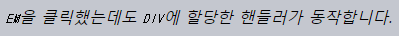
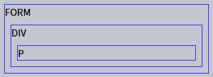

버블링 · 캡처링
====

##### `<div>` <sub>(요소)</sub> 이벤트 핸들러
- 중첩 태그 `click` <sub>(이벤트)</sub> 대상 동작
  - `<em>` <sub>(요소)</sub>
  - `<code>` <sub>(요소)</sub>
  - 기타 등등
```html
<div onclick="alert('div에 할당한 핸들러!')">
  <em>
    <code>EM</code>을 클릭했는데도
    <code>DIV</code>에 할당한 핸들러가 동작합니다.
  </em>
</div>
```



### 버블링

##### 발생 원리 <sub>(과정)</sub>
1. 특정 요소 이벤트 발생
2. 해당 요소 핸들러 동작
3. 부모 요소 핸들러 동작
4. 조상 요소 핸들러 동작
5. …
6. 최상단 조상 요소 핸들러 동작 <sub>(종료)</sub>

##### `FORM > DIV > P` <sub>(중첩 구조)</sub>
- 각각 이벤트 핸들러 할당
```html
<style>
  body * {
    margin: 10px;
    border: 1px solid blue;
  }
</style>

<form onclick="alert('form')">FORM
  <div onclick="alert('div')">DIV
    <p onclick="alert('p')">P</p>
  </div>
</form>
```


##### `<p>` <sub>(요소)</sub> 클릭 시
1. `<p>` <sub>(가장 내부 요소)</sub> 핸들러 동작
2. `<div>` <sub>(외부 요소)</sub> 핸들러 동작
3. `<form>` <sub>(더 외부 요소)</sub> 핸들러 동작
4. …
5. `document` <sub>(객체)</sub> 핸들러 동작 <sub>(종료)</sub>


<br />

 **대다수 이벤트 버블링 발생**

##### 일부 이벤트 버블링 미발생
- ex\) `focus` 등

<br />

### `target` <sub>(이벤트 객체 프로퍼티)</sub>

##### _target_ 요소
- 이벤트 발생한 가장 내부 요소

#### `target` vs `this` <sub>(`currentTarget`)</sub>

##### `target` <sub>(이벤트 객체 프로퍼티)</sub>
- 타겟 요소 <sub>(버블링 무관)</sub>
  - 이벤트 시작 지점
- 부모 요소 핸들러
  - 이벤트 시작 요소 상세 정보 접근 가능

##### `this` <sub>(`currentTarget` 이벤트 객체 프로퍼티)</sub>
- '현재' 요소 <sub>(버블링 진행 중 변경)</sub>
  - 버블링 진행 중 현재 위치 요소
  - 현재 실행 중인 핸들러 설정 요소 참조

#### `<form id="form">` <sub>(요소)</sub>

##### 이벤트 버블링 진행
- 타겟 요소 → … → `<form>` <sub>(요소)</sub>
  - 진행 과정 내 모든 요소 핸들러 실행

##### 이벤트 핸들러 <sub>(1개)</sub>
- `form.onclick`
  - 폼 내 모든 요소 `click` <sub>(이벤트)</sub> 처리
- `target` <sub>(이벤트 객체 프로퍼티)</sub>
  - 폼 내 실제 클릭한 요소
- `this` <sub>(`currentTarget` 이벤트 객체 프로퍼티)</sub>
  - `<form id="form">` <sub>(요소)</sub>
- `target` == `this` <sub>(`currentTarget`)</sub>
  - 정확히 `<form>` <sub>(요소)</sub> 클릭

##### 결과


```html
<!-- index.html -->
<!DOCTYPE HTML>
<html>

<head>
  <meta charset="utf-8">
  <link rel="stylesheet" href="example.css">
</head>

<body>
  클릭하면 <code>event.target</code>과 <code>this</code>정보를 볼 수 있습니다.

  <form id="form">FORM
    <div>DIV
      <p>P</p>
    </div>
  </form>

  <script src="script.js"></script>
</body>

</html>
```
```javascript
/* script.js */
// <form> (요소) 핸들러 할당
form.onclick = function(event) {

  // 폼 내 실제 클릭한 요소
  event.target.style.backgroundColor = 'yellow';

  // Chrome
  // - 지연 시간 발생
  setTimeout(() => {
    "target = " + event.target.tagName + ", this=" + this.tagName;
    event.target.style.backgroundColor = ''
  }, 0);
};
```
```css
/* example.css */
form { background-color: green; position: relative; width: 150px; height: 150px; text-align: center; cursor: pointer; }
div { background-color: blue; position: absolute; top: 25px; left: 25px; width: 100px; height: 100px; }
p { background-color: red; position: absolute; top: 25px; left: 25px; width: 50px; height: 50px; line-height: 50px; margin: 0; }
body { line-height: 25px; font-size: 16px; }
```

### 버블링 비활성화

##### 버블링 진행 과정 내 모든 요소 핸들러 실행
- 대다수 이벤트
  - 타겟 <sub>(요소)</sub> → `document` <sub>(객체)</sub>
- 일부 이벤트
  - 타겟 <sub>(요소)</sub> → `window` <sub>(전역 객체)</sub>

##### `stopPropagation()` <sub>(이벤트 객체 메서드)</sub>
- 해당 핸들러 이벤트 처리 후 버블링 중단 <sub>(미발생)</sub>

##### `<button>` <sub>(요소)</sub>
- 클릭 시 `stopPropagation()` 호출
  - `body.onclick` <sub>(핸들러)</sub> 미동작
```html
<body onclick="alert(`버블링은 여기까지 도달하지 못합니다.`)">
  <button onclick="event.stopPropagation()">클릭해 주세요.</button>
</body>
```


<br />

 **`stopImmediatePropagation()` <sub>(이벤트 객체 메서드)</sub>**

#### 요소 내 특정 이벤트 처리 핸들러 다수 경우

##### 버블링 비활성화 메서드 <sub>(이벤트 객체)</sub> 비교 <sub>(2가지)</sub>
- `stopPropagation()`
  - 핸들러 중 하나 버블링 중단
  - 타 핸들러 여전히 버블링 진행
- `stopImmediatePropagation()`
  - 모든 핸들러 버블링 중단

<br />

 **버블링 비활성화 가급적 지양**

##### `stopPropagation()` <sub>(이벤트 객체 메서드)</sub>
- 추후 문제 상황 유발 가능

#### 문제 가능 시나리오

##### 1. 중첩 메뉴
- 각 서브 메뉴 <sub>(요소)</sub>
  - `click` <sub>(이벤트)</sub> 처리
- 상위 메뉴 <sub>(요소)</sub> 핸들러 <sub>(`click` 이벤트)</sub>
  - `stopPropagation()` 적용
    - 서브 메뉴 발생 이벤트 미처리

##### 2. 행동 패턴 분석 <sub>(사용자 페이지 내 클릭 위치 등)</sub> 실행
- 창 내 `click` <sub>(이벤트)</sub> 전부 감지
  - 실제 일부 분석 시스템 방식
```javascript
document.addEventListener('click', …);`
```

##### 3. 버블링 비활성화 영역 <sub>('죽은 영역' · 각 서브 메뉴 요소)</sub>
- 분석 시스템 코드 미동작
  - 분석 비정상 실행

##### 드문 이벤트 버블링 비활성화 필요 상황
- 버블링 비활성화 필요 시 대안 사용
  - ex\) 커스텀 이벤트 등

##### 한 가지 이벤트 버블링 통제 방식
- 핸들러 내 이벤트 객체 내 데이터 저장
  - 타 핸들러 <sub>(부모 요소 등)</sub> 접근 · 처리 가능

<br />

### 캡처링

##### 이벤트 흐름 <sub>(표준 [DOM 이벤트](https://www.w3.org/TR/DOM-Level-3-Events/) 정의 · 3가지 단계)</sub>
1. 캡처링 단계
   - 이벤트 하위 요소 전파
2. 타겟 단계
   - 이벤트 타겟 요소 전달
3. 버블링 단계
   - 이벤트 상위 요소 전파

##### 테이블 내 `<td>` <sub>(요소)</sub> 클릭 시 이벤트 흐름
1. 캡처링 단계
   - 이벤트 전파 <sub>(최상위 조상 → 하단 방향)</sub>
2. 타겟 단계
   - 이벤트 도착 · 실행 <sub>(타겟 요소)</sub>
3. 버블링 단계
   - 이벤트 전파 <sub>(타겟 요소 → 상단 방향)</sub>


##### 캡처링
- 사용 빈도 ↓↓
- 관련 코드 발견 가능성 거의 無

##### 일반적인 핸들러 <sub>(HTML 속성 · DOM 프로퍼티 · 설정 메서드)</sub>
- 캡처링 단계 미인식 <sub>(미동작)</sub>
- 타겟 · 버블링 단계만 인식 <sub>(동작)</sub>

##### 핸들러 캡처링 단계 인식 <sub>(동작)</sub> 설정
- `addEventListener` <sub>(메서드)</sub> 옵션 설정
  - `capture: true`
```javascript
// options (객체) 전달
elem.addEventListener( …, {capture: true} )

// boolean 전달
// - true == {capture: true} (호환성 유지)
elem.addEventListener( …, true )
```

##### `[capture]` <sub>(옵션)</sub> 값
- `false` <sub>(기본값)</sub>
  - 버블링 단계 동작
- `true`
  - 캡처링 단계 동작

##### 공식적인 총 3개 이벤트 흐름
- 타겟 단계
  - 별도 처리 X
- 캡처링 · 버블링 단계 <sub>(핸들러)</sub>
  - 타겟 단계 내 처리

##### 캡처링 · 버블링 진행 순서
- 문서 내 전체 요소 핸들러 설정
  - 캡처링 단계 1개
  - 버블링 단계 1게
```html
<style>
  body * {
    margin: 10px;
    border: 1px solid blue;
  }
</style>

<form>FORM
  <div>DIV
    <p>P</p>
  </div>
</form>

<script>
  // 문서 내 전체 요소
  for (let elem of document.querySelectorAll('*')) {

    // 캡처링 단계 핸들러
    elem.addEventListener("click", e => `캡처링: ${elem.tagName}`), true;

    // 버블링 단계 핸들러
    elem.addEventListener("click", e => `버블링: ${elem.tagName}`);
  }
</script>
```



##### `<p>` <sub>(요소)</sub> 클릭 시 이벤트 전달 순서
1. 캡처링 단계
   1. `HTML`
   2. `BODY`
   3. `FORM`
   4. `DIV`
2. 타겟 단계
   - `P` <sub>(캡처링 · 버블링 둘 다 설정 → 2번)</sub>
3. 버블링 단계
   1. `DIV`
   2. `FORM`
   3. `BODY`
   4. `HTML`

##### `eventPhase` <sub>(이벤트 객체 프로퍼티)</sub>
- 현재 발생 중인 이벤트 흐름 단계 정보
- 정숫값 반환
  - 현재 실행 단계 구분
- 사용 빈도 ↓
  - 핸들러 통해 흐름 단계 구분 가능

<br />

 **핸들러 설정 · 제거 시 동일 단계 필수**

#### 핸들러 설정 · 제거

##### `addEventListener(…, true)` <sub>(캡처링 단계)</sub>
- `removeEventListener(…, true)`
- `removeEventListener(…)` X

##### `addEventListener(…)` <sub>(버블링 단계)</sub>
- `removeEventListener(…, true)` X
- `removeEventListener(…)`

<br />

 **동일 요소 · 단계 핸들러 설정 순서대로 동작**

##### 특정 요소 내 특정 단계 이벤트 핸들러 다수 설정 시
- 설정 순서대로 동작
  - `addEventListener` <sub>(메서드)</sub> 순서
```javascript
// 1번째
elem.addEventListener("click", e => 1);

// 2번째
elem.addEventListener("click", e => 2);
```

<br />

요약
====

##### `target` <sub>(이벤트 객체 프로퍼티)</sub>
- 타겟 요소
  - 이벤트 발생한 가장 내부 요소

#### 이벤트 흐름 <sub>(3가지)</sub>

##### 1. 캡처링 단계
- 최상위 노드 → 타겟 요소 <sub>(`target`)</sub>
- 진행 과정 내 모든 요소 핸들러 <sub>(캡처링 단계)</sub> 실행
```javascript
addEventListener(…, {capture: true});
addEventListener(…, true);
```

##### 2. 타겟 단계
- 타겟 요소 설정 핸들러 호출

##### 3. 버블링 단계
- 타겟 요소 <sub>(`target`)</sub> → 최상위 노드
- 진행 과정 내 모든 요소 핸들러 <sub>(버블링 단계)</sub> 실행
```html
<!-- HTML 속성 -->
<div onclick="…">

<script>
  // DOM 프로퍼티
  elem.onclick = function() {…}

  // addEventListener (메서드)
  addEventListener(…);
  addEventListener(…, false);
  addEventListener(…, {capture: false});
</script>
```

#### 이벤트 객체 내 프로퍼티 · 메서드

##### `target` <sub>(타겟 요소)</sub>
- 이벤트 발생한 가장 내부 요소

##### `currentTarget` <sub>(`this`)</sub>
- 이벤트 처리 중인 현재 요소
  - 실제 핸들러 설정 요소

##### `eventPhase` <sub>(정숫값)</sub>
- 현재 이벤트 흐름 단계
  - `1` <sub>(캡처링)</sub>
  - `2` <sub>(타겟)</sub>
  - `3` <sub>(버블링)</sub>

##### `stopPropagation()` <sub>(메서드)</sub>
- 이벤트 버블링 중단 <sub>(지양)</sub>
  - 버블링 추후 필요 가능성 有

##### 이벤트 흐름 단계별 사용 빈도
- 캡처링 단계
  - 사용 빈도 ↓
- 버블링 단계
  - 주로 사용
